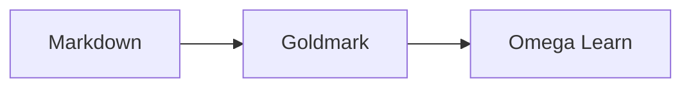

# Omega Learn

Omega Learn is a small, self-contained Go website for browsing a personal Markdown knowledge base. It turns the files under [`docs/`](docs/) into a searchable documentation library while keeping those Markdown files as the source of truth.

The site uses the Gruvbox Dark Soft theme and includes responsive navigation, generated tables of contents, Mermaid diagrams, and syntax highlighting for Go, YAML, and JSON.

## Features

- Discovers every `.md` file below `docs/` at startup
- Organizes articles by their top-level directory
- Generates article titles, summaries, reading times, breadcrumbs, and navigation
- Builds an “On this page” menu from level-two and level-three headings
- Rewrites relative links between local Markdown files to website routes
- Provides full-text search with `⌘ K` or `Ctrl K`
- Renders GitHub Flavored Markdown, tables, footnotes, and typographic substitutions
- Renders Mermaid diagrams with a pop-up viewer and zoom controls
- Highlights fenced Go, YAML/YML, and JSON code blocks
- Serves templates, styles, scripts, Mermaid, and Highlight.js from the compiled binary
- Adds a health-check endpoint and basic browser security headers

## Requirements

- Go version compatible with [`go.mod`](go.mod)

No Node.js installation or frontend build step is required.

## Run locally

```bash
go run .
```

Open [http://localhost:8080](http://localhost:8080). The server reads the Markdown library when it starts, so restart it after adding or editing a document.

To use a different address or content directory:

```bash
go run . -addr :3000 -docs ./docs
```

The same settings can be supplied with environment variables:

```bash
OMEGA_ADDR=:3000 OMEGA_DOCS=./docs go run .
```

| Setting | Flag | Environment variable | Default |
| --- | --- | --- | --- |
| Listen address | `-addr` | `OMEGA_ADDR` | `:8080` |
| Markdown directory | `-docs` | `OMEGA_DOCS` | `docs` |

Command-line flags take precedence over environment-variable defaults.

## Build a binary

```bash
go build -o omega-learn .
./omega-learn
```

The web templates and static assets are embedded in the binary. The `docs/` directory remains external so the same binary can serve a different knowledge base with `-docs`.

## Add content

Create Markdown files anywhere below `docs/`:

```text
docs/
├── algorithms/
│   └── recursion.md
├── k8s/
│   └── storage/
│       └── storage-concepts.md
└── sre/
    └── role.md
```

The first path segment becomes the library section. For example, `docs/k8s/storage/storage-concepts.md` is served at:

```text
/docs/k8s/storage/storage-concepts
```

A file named `README.md` maps to its containing directory. For example, `docs/k8s/README.md` is available at `/docs/k8s`.

For the best result, begin each document with a level-one heading and an introductory paragraph:

```markdown
# Storage concepts

A practical guide to storage lifetimes and Kubernetes storage objects.

## Container storage

Article content starts here.
```

The level-one heading is displayed as the article title and omitted from the rendered article body to avoid duplication. The first suitable paragraph becomes the article summary.

### Link between documents

Use ordinary relative Markdown links:

```markdown
[Read about workload configuration](../config/config-concepts.md)
[Jump to a section](../config/config-concepts.md#configmaps)
```

Links to existing local `.md` files are automatically converted to their `/docs/...` routes.

### Render Mermaid diagrams

Use a fenced block labeled `mermaid`:

````markdown

````

Rendered diagrams can be clicked to open the diagram viewer. The viewer supports zoom buttons, reset, scrolling, keyboard zoom shortcuts, and `Esc` to close.

### Highlight source code

Use fenced blocks labeled `go`, `yaml`, `yml`, or `json`:

````markdown
```go
func main() {
    fmt.Println("learn deeply")
}
```

```yaml
apiVersion: v1
kind: ConfigMap
```

```json
{
  "enabled": true
}
```
````

## Project structure

```text
.
├── docs/                   Markdown knowledge base
├── web/
│   ├── static/             Gruvbox theme, interactions, and vendored libraries
│   └── templates/          Home and article templates
├── main.go                 Flags and HTTP server startup
├── site.go                 Content loading, Markdown rendering, search, and routes
├── site_test.go            Rendering, routing, search, and error-path tests
├── go.mod
└── README.md
```

## HTTP routes

| Route | Purpose |
| --- | --- |
| `/` | Library home page |
| `/docs/{path}` | Rendered Markdown article |
| `/api/search?q={query}` | JSON search results |
| `/assets/{path}` | Embedded frontend assets |
| `/healthz` | Health check; returns `ok` |

## Verify changes

```bash
go test ./...
go test -race ./...
go vet ./...
go build ./...
```

These checks exercise document discovery, Markdown rendering, local-link rewriting, routes, search, and empty-library handling.
