# Recursion — explained like a baby

Recursion means:

> **A function solves a problem by asking a smaller version of itself to solve part of the problem.**

Imagine opening a Russian nesting doll:

1. Open the current doll.
2. Find a smaller doll.
3. Open that smaller doll.
4. Continue until there is no smaller doll.
5. Close them in reverse order.

That is recursion.

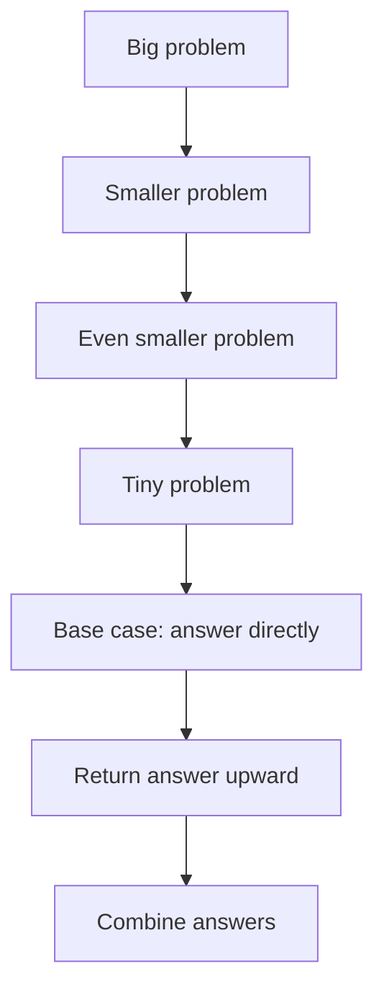

---

# 1. The smallest possible example

Suppose we want to count down from `3`.

```go
func countdown(n int) {
	if n == 0 {
		fmt.Println("Done")
		return
	}

	fmt.Println(n)
	countdown(n - 1)
}
```

Calling:

```go
countdown(3)
```

Produces:

```text
3
2
1
Done
```

The function keeps calling itself with a smaller number:

```text
countdown(3)
countdown(2)
countdown(1)
countdown(0)
```

At `0`, it stops.

---

# 2. The two required parts of recursion

Every recursive solution needs two things.

## Part 1: Base case

The condition that stops recursion.

```go
if n == 0 {
	return
}
```

Without a base case, the function keeps calling itself until the program runs out of stack memory.

## Part 2: Recursive case

The function calls itself with a smaller or simpler problem.

```go
countdown(n - 1)
```

The input must move toward the base case.

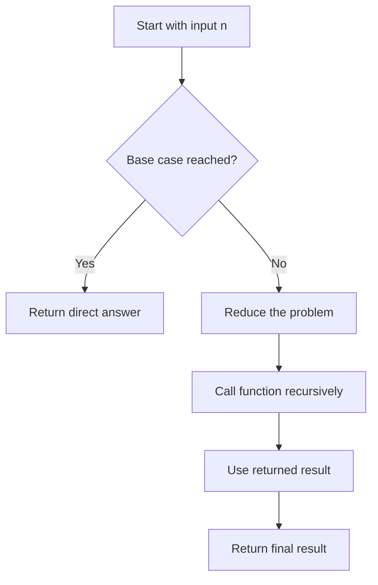

A useful formula is:

```text
Recursive solution =
Base case
+
Smaller recursive problem
+
Work done at the current level
```

---

# 3. Why is recursion needed?

Recursion is useful when the problem itself contains smaller versions of the same problem.

For example:

* A folder contains files and more folders.
* A tree node contains smaller trees.
* A manager has employees who may manage other employees.
* A decision produces more decisions.
* A maze contains smaller paths to explore.
* A string can be split into smaller strings.

These structures are naturally recursive.

## Folder example

```text
Documents
├── Resume.pdf
├── Work
│   ├── ProjectA
│   │   └── Design.md
│   └── ProjectB
└── Personal
    └── Photos
```

To search all files:

1. Examine the current folder.
2. For every subfolder, perform the same search.
3. Stop when a folder has no subfolders.

That is recursion.

---

# 4. The most important mental model

Think of a recursive function as making a promise:

> “Give me the answer for the smaller problem, and I will use it to construct the answer for the current problem.”

For factorial:

```text
factorial(5)
```

The function thinks:

> “I do not know `5!`, but if somebody gives me `4!`, I can multiply it by `5`.”

So:

```text
5! = 5 × 4!
4! = 4 × 3!
3! = 3 × 2!
2! = 2 × 1!
1! = 1
```

The recursive function does not need to understand the entire chain at once.

It only needs to know:

1. What is the smallest answer?
2. How can I reduce the current problem?
3. How do I use the smaller answer?

---

# 5. How recursion is calculated

Let us calculate factorial.

```text
5! = 5 × 4 × 3 × 2 × 1 = 120
```

Recursive definition:

```text
factorial(n) = n × factorial(n - 1)
factorial(1) = 1
```

Go implementation:

```go
func factorial(n int) int {
	if n <= 1 {
		return 1
	}

	return n * factorial(n-1)
}
```

Calling:

```go
factorial(4)
```

First, calls go downward:

```text
factorial(4)
= 4 × factorial(3)

factorial(3)
= 3 × factorial(2)

factorial(2)
= 2 × factorial(1)

factorial(1)
= 1
```

Then results return upward:

```text
factorial(1) = 1
factorial(2) = 2 × 1 = 2
factorial(3) = 3 × 2 = 6
factorial(4) = 4 × 6 = 24
```

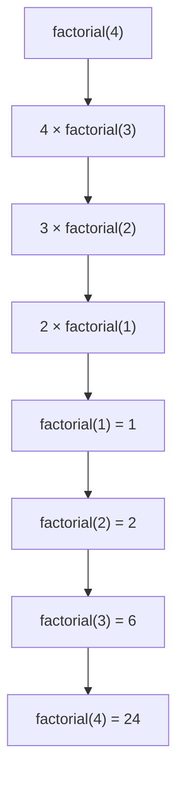

Recursion has two phases:

```text
Calling downward
Unwinding upward
```

---

# 6. The call stack

Each function call needs to remember:

* Its arguments
* Its local variables
* Where execution should continue
* What result it is waiting for

This information is stored in the **call stack**.

For:

```go
factorial(4)
```

The stack grows like this:

```text
Top
┌──────────────────────┐
│ factorial(1), n = 1  │
├──────────────────────┤
│ factorial(2), n = 2  │
├──────────────────────┤
│ factorial(3), n = 3  │
├──────────────────────┤
│ factorial(4), n = 4  │
└──────────────────────┘
Bottom
```

When `factorial(1)` returns, its stack frame is removed.

Then `factorial(2)` continues.

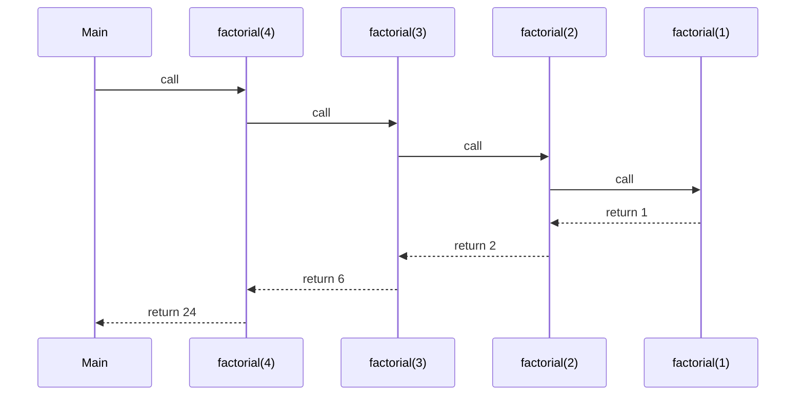

## Important consequence

Recursive algorithms use stack memory.

If recursion depth is `n`, the space complexity is often:

```text
O(n)
```

Even when the function uses no explicit array or map.

---

# 7. Recursion versus iteration

A recursive countdown:

```go
func countdown(n int) {
	if n == 0 {
		return
	}

	fmt.Println(n)
	countdown(n - 1)
}
```

An iterative countdown:

```go
func countdown(n int) {
	for n > 0 {
		fmt.Println(n)
		n--
	}
}
```

Both solve the same problem.

| Recursion                                | Iteration                           |
| ---------------------------------------- | ----------------------------------- |
| Uses function calls                      | Uses loops                          |
| Uses call-stack memory                   | Usually uses constant extra memory  |
| Often clearer for trees and decisions    | Often clearer for linear repetition |
| Can cause stack overflow                 | Usually avoids stack overflow       |
| Naturally expresses DFS and backtracking | May require an explicit stack       |

Use recursion when it makes the problem easier to understand.

Do not use recursion merely because it looks clever.

---

# 8. The five questions to ask before writing recursion

For every recursive problem, ask:

## 1. What does my function mean?

Example:

```go
factorial(n)
```

means:

> Return the factorial of `n`.

For a tree:

```go
maxDepth(node)
```

means:

> Return the maximum depth of the tree rooted at `node`.

This contract must be precise.

## 2. What is the smallest problem?

For factorial:

```text
factorial(0) = 1
factorial(1) = 1
```

For a tree:

```text
Depth of an empty tree = 0
```

## 3. How do I make the problem smaller?

Examples:

```text
n → n - 1
array → remaining array
tree → left and right subtrees
string → remaining characters
```

## 4. How do I use the smaller answer?

For factorial:

```text
n × factorial(n - 1)
```

For tree depth:

```text
1 + max(leftDepth, rightDepth)
```

## 5. Does every path reach the base case?

This prevents infinite recursion.

---

# 9. A reusable recursion template

```go
func solve(state State) Result {
	// 1. Base case
	if isBaseCase(state) {
		return baseResult
	}

	// 2. Reduce the problem
	smallerState := makeSmaller(state)

	// 3. Recursive call
	smallerResult := solve(smallerState)

	// 4. Use the smaller result
	return combine(state, smallerResult)
}
```

For recursion with multiple branches:

```go
func solve(state State) Result {
	if isBaseCase(state) {
		return baseResult
	}

	leftResult := solve(firstChoice(state))
	rightResult := solve(secondChoice(state))

	return combine(leftResult, rightResult)
}
```

---

# 10. Types of recursion

## 10.1 Linear recursion

Each call makes one recursive call.

Examples:

* Factorial
* Sum of an array
* Reverse a linked list
* Countdown

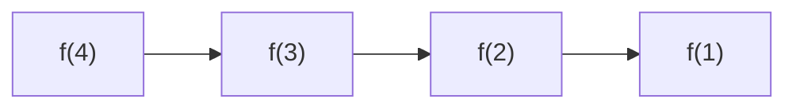

Typical complexity:

```text
Time: O(n)
Space: O(n)
```

---

## 10.2 Tree recursion

Each call makes multiple recursive calls.

Examples:

* Fibonacci
* Tree traversal
* Generate subsets
* Backtracking

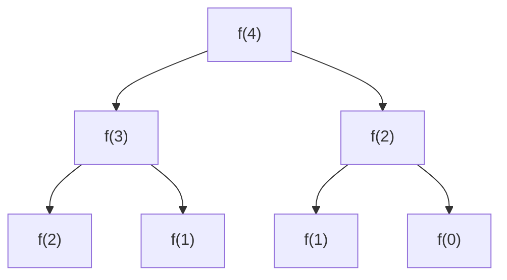

The number of calls can grow exponentially.

---

## 10.3 Divide and conquer

Split one large problem into independent smaller problems.

Examples:

* Merge sort
* Quick sort
* Binary search
* Tree algorithms

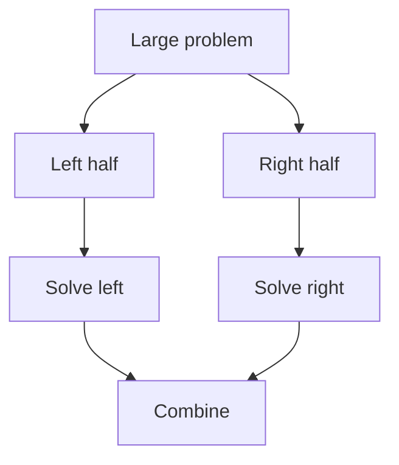

---

## 10.4 DFS recursion

Explore one path deeply before exploring another path.

Used for:

* Trees
* Graphs
* Mazes
* Islands
* File systems

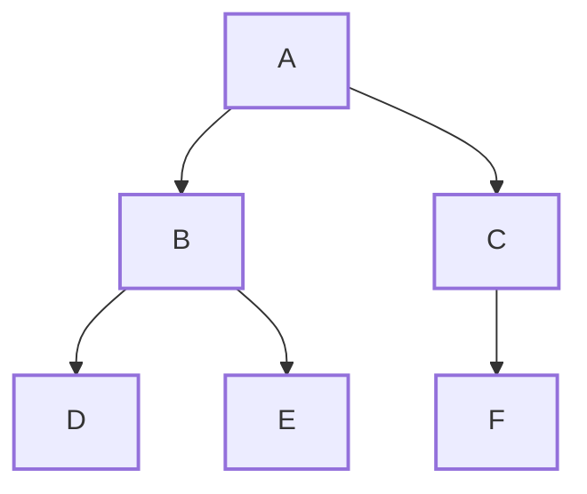

A depth-first traversal might visit:

```text
A → B → D → E → C → F
```

---

## 10.5 Backtracking

Backtracking means:

> Choose something, explore it, undo the choice, and try another choice.

Examples:

* Subsets
* Permutations
* Generate Parentheses
* Combination Sum
* Sudoku
* N-Queens

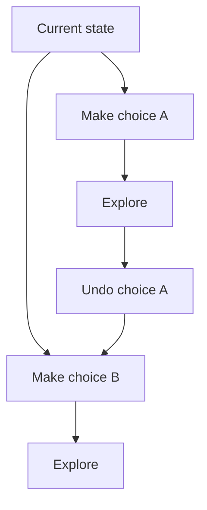

Backtracking is recursion plus undoing decisions.

---

# 11. Problem 1: Factorial

## Problem

Calculate:

```text
n! = n × (n-1) × ... × 1
```

## Recursive thinking

```text
factorial(n) = n × factorial(n - 1)
```

## Code

```go
func factorial(n int) int {
	if n <= 1 {
		return 1
	}

	return n * factorial(n-1)
}
```

## Complexity

```text
Time:  O(n)
Space: O(n)
```

The time is `O(n)` because there are `n` calls.

The space is `O(n)` because `n` stack frames exist at the deepest point.

---

# 12. Problem 2: Fibonacci

Fibonacci numbers:

```text
0, 1, 1, 2, 3, 5, 8, 13...
```

Definition:

```text
fib(n) = fib(n - 1) + fib(n - 2)
```

## Naive recursive code

```go
func fib(n int) int {
	if n <= 1 {
		return n
	}

	return fib(n-1) + fib(n-2)
}
```

For `fib(5)`:

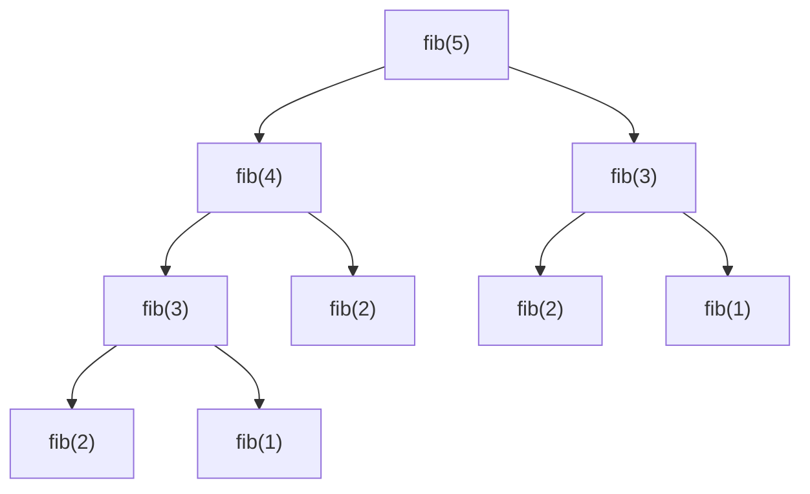

Notice that `fib(3)` and `fib(2)` are calculated repeatedly.

## Complexity

```text
Time:  O(2^n)
Space: O(n)
```

The stack depth is only `n`, even though the number of calls is exponential.

## Improved with memoization

```go
func fib(n int, memo map[int]int) int {
	if n <= 1 {
		return n
	}

	if result, exists := memo[n]; exists {
		return result
	}

	memo[n] = fib(n-1, memo) + fib(n-2, memo)
	return memo[n]
}
```

Usage:

```go
result := fib(10, make(map[int]int))
```

Complexity:

```text
Time:  O(n)
Space: O(n)
```

This is the connection between recursion and dynamic programming.

---

# 13. Problem 3: Sum of an array

Input:

```text
[4, 7, 2]
```

Recursive idea:

```text
sum([4, 7, 2])
= 4 + sum([7, 2])
= 4 + 7 + sum([2])
= 4 + 7 + 2 + sum([])
```

## Go code

```go
func sum(nums []int, index int) int {
	if index == len(nums) {
		return 0
	}

	return nums[index] + sum(nums, index+1)
}
```

## Complexity

```text
Time:  O(n)
Space: O(n)
```

A common mistake is to create a new slice during every call:

```go
return nums[0] + sum(nums[1:])
```

This may create additional slice-related overhead depending on what else is done. Passing an index is usually cleaner.

---

# 14. Problem 4: Binary tree traversal

A tree is recursive by definition.

A tree contains:

* A root
* A left subtree
* A right subtree

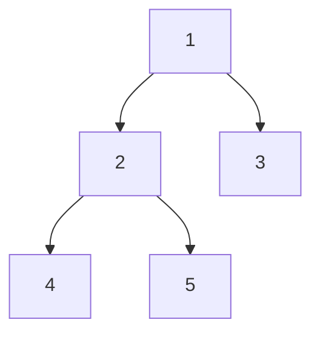

## Tree node

```go
type TreeNode struct {
	Val   int
	Left  *TreeNode
	Right *TreeNode
}
```

## Preorder traversal

Order:

```text
Root → Left → Right
```

```go
func preorder(node *TreeNode) {
	if node == nil {
		return
	}

	fmt.Println(node.Val)
	preorder(node.Left)
	preorder(node.Right)
}
```

Output:

```text
1 2 4 5 3
```

## Inorder traversal

Order:

```text
Left → Root → Right
```

```go
func inorder(node *TreeNode) {
	if node == nil {
		return
	}

	inorder(node.Left)
	fmt.Println(node.Val)
	inorder(node.Right)
}
```

Output:

```text
4 2 5 1 3
```

## Postorder traversal

Order:

```text
Left → Right → Root
```

```go
func postorder(node *TreeNode) {
	if node == nil {
		return
	}

	postorder(node.Left)
	postorder(node.Right)
	fmt.Println(node.Val)
}
```

Output:

```text
4 5 2 3 1
```

## Complexity

For all three traversals:

```text
Time:  O(n)
Space: O(h)
```

Where `h` is tree height.

* Balanced tree: `h = O(log n)`
* Skewed tree: `h = O(n)`

---

# 15. Problem 5: Maximum depth of a tree

## Recursive contract

```text
maxDepth(node)
```

means:

> Return the maximum depth of the tree rooted at `node`.

For an empty tree:

```text
depth = 0
```

For a non-empty tree:

```text
depth = 1 + maximum(left depth, right depth)
```

```go
func maxDepth(node *TreeNode) int {
	if node == nil {
		return 0
	}

	leftDepth := maxDepth(node.Left)
	rightDepth := maxDepth(node.Right)

	return 1 + max(leftDepth, rightDepth)
}

func max(a, b int) int {
	if a > b {
		return a
	}
	return b
}
```

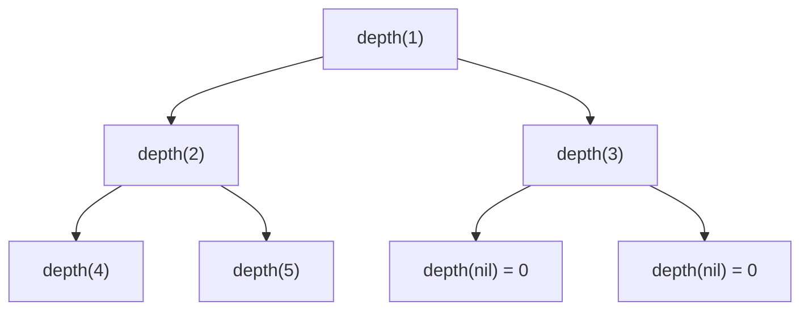

Complexity:

```text
Time:  O(n)
Space: O(h)
```

---

# 16. Backtracking mental model

Suppose you are choosing clothes:

```text
Shirt:
- Blue
- Red

Pants:
- Black
- White
```

You try:

```text
Blue + Black
Blue + White
Red + Black
Red + White
```

The process is:

1. Choose blue.
2. Choose black.
3. Record the outfit.
4. Remove black.
5. Choose white.
6. Record the outfit.
7. Remove white.
8. Remove blue.
9. Choose red.
10. Repeat.

This is backtracking.

The standard pattern is:

```go
func backtrack(path []Choice, choices []Choice) {
	if solutionComplete(path) {
		saveCopy(path)
		return
	}

	for _, choice := range choices {
		if !isValid(choice, path) {
			continue
		}

		// Choose
		path = append(path, choice)

		// Explore
		backtrack(path, choices)

		// Undo
		path = path[:len(path)-1]
	}
}
```

Remember:

```text
Choose
Explore
Undo
```

---

# 17. Problem 6: Generate all subsets

Input:

```text
[1, 2]
```

Output:

```text
[]
[1]
[2]
[1, 2]
```

For every number, there are two choices:

```text
Include it
Do not include it
```

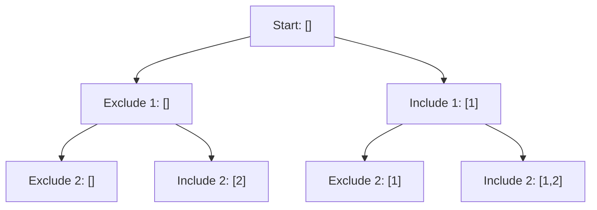

## Go implementation

```go
func subsets(nums []int) [][]int {
	result := make([][]int, 0)
	path := make([]int, 0)

	var backtrack func(index int)
	backtrack = func(index int) {
		if index == len(nums) {
			subset := append([]int(nil), path...)
			result = append(result, subset)
			return
		}

		// Do not include nums[index]
		backtrack(index + 1)

		// Include nums[index]
		path = append(path, nums[index])
		backtrack(index + 1)

		// Undo
		path = path[:len(path)-1]
	}

	backtrack(0)
	return result
}
```

## Why copy the path?

This is wrong:

```go
result = append(result, path)
```

The underlying array may be reused and modified later.

Instead:

```go
subset := append([]int(nil), path...)
result = append(result, subset)
```

## Complexity

For `n` numbers, there are `2^n` subsets.

```text
Time:  O(n × 2^n)
Space: O(n) recursion depth
Output: O(n × 2^n)
```

The additional `n` factor comes from copying each subset.

---

# 18. Problem 7: Permutations

Input:

```text
[1, 2, 3]
```

Possible outputs:

```text
[1, 2, 3]
[1, 3, 2]
[2, 1, 3]
[2, 3, 1]
[3, 1, 2]
[3, 2, 1]
```

At every position, choose any number not already used.

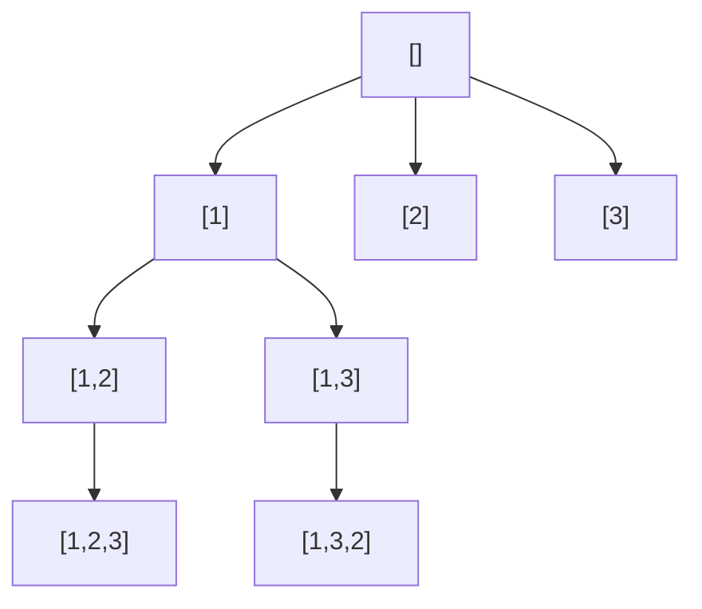

## Go implementation

```go
func permute(nums []int) [][]int {
	result := make([][]int, 0)
	path := make([]int, 0, len(nums))
	used := make([]bool, len(nums))

	var backtrack func()
	backtrack = func() {
		if len(path) == len(nums) {
			permutation := append([]int(nil), path...)
			result = append(result, permutation)
			return
		}

		for i := 0; i < len(nums); i++ {
			if used[i] {
				continue
			}

			// Choose
			used[i] = true
			path = append(path, nums[i])

			// Explore
			backtrack()

			// Undo
			path = path[:len(path)-1]
			used[i] = false
		}
	}

	backtrack()
	return result
}
```

## Complexity

There are `n!` permutations.

```text
Time:  O(n × n!)
Space: O(n)
Output: O(n × n!)
```

---

# 19. Problem 8: Generate Parentheses

For `n = 3`, generate:

```text
((()))
(()())
(())()
()(())
()()()
```

At every step, choose:

```text
Add "("
Add ")"
```

But the partial string must remain valid.

Rules:

```text
Opening brackets used < n
Closing brackets used < opening brackets used
```

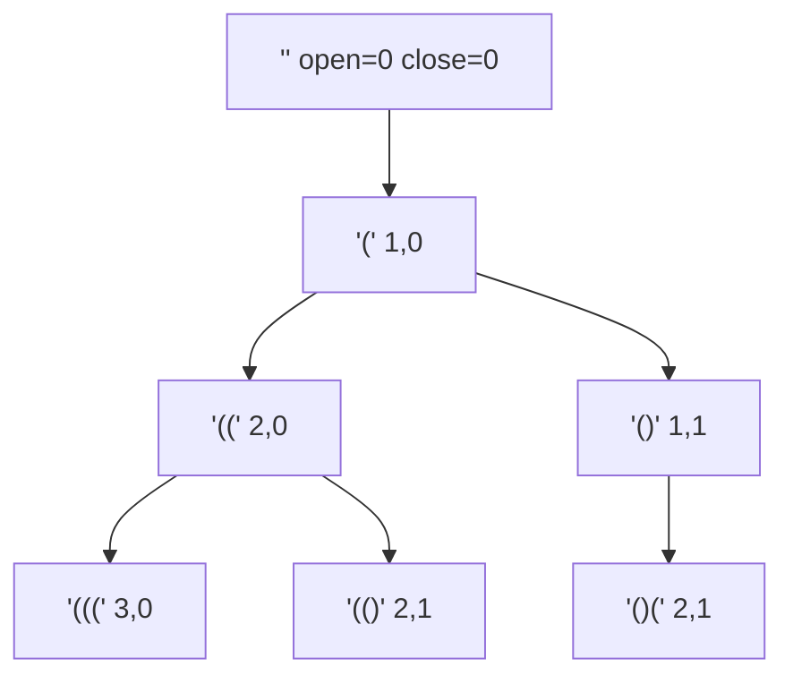

## Go implementation

```go
func generateParenthesis(n int) []string {
	result := make([]string, 0)

	var backtrack func(current []byte, open, close int)
	backtrack = func(current []byte, open, close int) {
		if len(current) == 2*n {
			result = append(result, string(current))
			return
		}

		if open < n {
			current = append(current, '(')
			backtrack(current, open+1, close)
			current = current[:len(current)-1]
		}

		if close < open {
			current = append(current, ')')
			backtrack(current, open, close+1)
			current = current[:len(current)-1]
		}
	}

	backtrack(make([]byte, 0, 2*n), 0, 0)
	return result
}
```

## Interview insight

Do not generate every possible sequence and validate afterward.

Prune invalid branches before exploring them.

That is one of the main goals of backtracking.

---

# 20. Problem 9: Combination Sum

Input:

```text
candidates = [2, 3, 6, 7]
target = 7
```

Output:

```text
[2, 2, 3]
[7]
```

At each candidate, you can:

```text
Use it again
Move to the next candidate
```

## Go implementation

```go
func combinationSum(candidates []int, target int) [][]int {
	result := make([][]int, 0)
	path := make([]int, 0)

	var backtrack func(start, remaining int)
	backtrack = func(start, remaining int) {
		if remaining == 0 {
			combination := append([]int(nil), path...)
			result = append(result, combination)
			return
		}

		if remaining < 0 {
			return
		}

		for i := start; i < len(candidates); i++ {
			value := candidates[i]

			path = append(path, value)
			backtrack(i, remaining-value)
			path = path[:len(path)-1]
		}
	}

	backtrack(0, target)
	return result
}
```

Why call:

```go
backtrack(i, remaining-value)
```

instead of:

```go
backtrack(i+1, remaining-value)
```

Because the same number may be reused.

Why use `start`?

To avoid generating duplicate orderings such as:

```text
[2, 2, 3]
[2, 3, 2]
[3, 2, 2]
```

---

# 21. Recursion complexity

Recursive complexity has two parts:

```text
Time complexity:
How many calls are made?
×
How much work happens per call?

Space complexity:
Maximum recursion depth
+
Any additional data structures
```

## Linear recursion

```go
func solve(n int) {
	if n == 0 {
		return
	}
	solve(n - 1)
}
```

Recurrence:

```text
T(n) = T(n - 1) + O(1)
```

Result:

```text
Time: O(n)
Space: O(n)
```

## Binary tree recursion

```go
func solve(n int) {
	if n == 0 {
		return
	}

	solve(n - 1)
	solve(n - 1)
}
```

Recurrence:

```text
T(n) = 2T(n - 1) + O(1)
```

Result:

```text
Time: O(2^n)
Space: O(n)
```

A critical distinction:

> Space depends on the longest active path, not the total number of calls.

---

# 22. Understanding recursion trees

Consider:

```go
func f(n int) {
	if n == 0 {
		return
	}

	f(n - 1)
	f(n - 1)
}
```

At each level, the number of calls doubles.

```text
Level 0: 1 call
Level 1: 2 calls
Level 2: 4 calls
Level 3: 8 calls
```

Total:

```text
1 + 2 + 4 + ... + 2^n
≈ 2^(n+1)
= O(2^n)
```

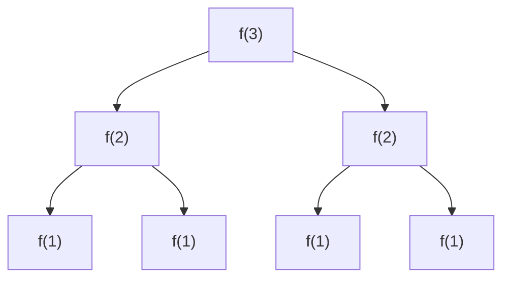

---

# 23. Tail recursion

A tail-recursive function performs the recursive call as its final operation.

```go
func factorialTail(n, accumulator int) int {
	if n <= 1 {
		return accumulator
	}

	return factorialTail(n-1, accumulator*n)
}
```

Usage:

```go
result := factorialTail(5, 1)
```

Some languages optimize tail recursion and reuse the same stack frame.

Go does not guarantee tail-call optimization. Therefore, deep tail recursion can still overflow the stack or require stack growth.

For simple linear operations in Go, loops are generally preferable.

---

# 24. Common recursion mistakes

## Mistake 1: Missing the base case

```go
func countdown(n int) {
	fmt.Println(n)
	countdown(n - 1)
}
```

This never stops.

---

## Mistake 2: Input does not move toward the base case

```go
func countdown(n int) {
	if n == 0 {
		return
	}

	countdown(n)
}
```

`n` never changes.

---

## Mistake 3: Wrong base-case result

For factorial:

```go
if n == 0 {
	return 0
}
```

This makes every factorial result zero.

Correct:

```go
if n == 0 {
	return 1
}
```

Because:

```text
n × 1 = n
```

---

## Mistake 4: Forgetting to use the recursive result

Wrong:

```go
func factorial(n int) int {
	if n <= 1 {
		return 1
	}

	factorial(n - 1)
	return n
}
```

Correct:

```go
return n * factorial(n-1)
```

---

## Mistake 5: Modifying shared state without undoing

Wrong backtracking:

```go
path = append(path, choice)
backtrack()
```

The choice remains in `path`.

Correct:

```go
path = append(path, choice)
backtrack()
path = path[:len(path)-1]
```

---

## Mistake 6: Saving the same mutable path

Wrong:

```go
result = append(result, path)
```

Correct:

```go
copyOfPath := append([]int(nil), path...)
result = append(result, copyOfPath)
```

---

## Mistake 7: Recomputing the same state

Naive Fibonacci recalculates the same values many times.

Use:

* Memoization
* Tabulation
* Another mathematical transformation

---

## Mistake 8: Ignoring stack depth

A recursive function with one million levels may be dangerous.

Consider:

* A loop
* An explicit stack
* BFS
* Iterative DFS

---

# 25. How to debug recursion

Add logging at function entry and exit.

```go
func factorial(n int, depth int) int {
	indent := strings.Repeat("  ", depth)
	fmt.Printf("%senter factorial(%d)\n", indent, n)

	if n <= 1 {
		fmt.Printf("%sreturn 1\n", indent)
		return 1
	}

	result := n * factorial(n-1, depth+1)
	fmt.Printf("%sreturn %d\n", indent, result)
	return result
}
```

Output:

```text
enter factorial(4)
  enter factorial(3)
    enter factorial(2)
      enter factorial(1)
      return 1
    return 2
  return 6
return 24
```

This makes the call stack visible.

---

# 26. How to recognize a recursion problem

Look for these signals:

* The problem contains nested structures.
* The input can be divided into smaller versions of itself.
* You need all combinations or permutations.
* You need to explore choices.
* The problem mentions trees or graphs.
* The problem asks for paths.
* The problem asks to generate all valid arrangements.
* The problem can be expressed using previous states.

Typical phrases:

```text
Generate all...
Find every...
Explore every path...
All possible combinations...
For each child...
For each neighboring node...
Left subtree and right subtree...
```

---

# 27. Recursion patterns to memorize

## Pattern 1: Process a sequence

```go
func process(nums []int, index int) {
	if index == len(nums) {
		return
	}

	// Process nums[index]
	process(nums, index+1)
}
```

## Pattern 2: Return an answer

```go
func solve(n int) int {
	if n == 0 {
		return baseValue
	}

	smallerAnswer := solve(n - 1)
	return combine(n, smallerAnswer)
}
```

## Pattern 3: Binary choice

```go
func choose(index int) {
	if index == n {
		saveAnswer()
		return
	}

	// Exclude
	choose(index + 1)

	// Include
	path = append(path, values[index])
	choose(index + 1)
	path = path[:len(path)-1]
}
```

## Pattern 4: Loop over choices

```go
func backtrack(start int) {
	if complete() {
		saveAnswer()
		return
	}

	for i := start; i < len(choices); i++ {
		makeChoice(i)
		backtrack(nextStart(i))
		undoChoice(i)
	}
}
```

## Pattern 5: Tree recursion

```go
func solve(node *TreeNode) Result {
	if node == nil {
		return baseResult
	}

	left := solve(node.Left)
	right := solve(node.Right)

	return combine(node, left, right)
}
```

## Pattern 6: Graph DFS

```go
func dfs(node int, graph [][]int, visited []bool) {
	if visited[node] {
		return
	}

	visited[node] = true

	for _, neighbor := range graph[node] {
		dfs(neighbor, graph, visited)
	}
}
```

---

# 28. Most important interview problems

## Foundation

1. Factorial
2. Fibonacci
3. Sum of an array
4. Reverse a string
5. Binary search recursively
6. Power of a number

## Trees and DFS

1. Maximum Depth of Binary Tree
2. Same Tree
3. Invert Binary Tree
4. Path Sum
5. Diameter of Binary Tree
6. Lowest Common Ancestor
7. Validate Binary Search Tree
8. Tree traversals

## Backtracking

1. Subsets
2. Permutations
3. Combination Sum
4. Generate Parentheses
5. Letter Combinations of a Phone Number
6. Palindrome Partitioning
7. Word Search
8. N-Queens

## Recursion with dynamic programming

1. Climbing Stairs
2. House Robber
3. Coin Change
4. Longest Common Subsequence
5. Edit Distance
6. Partition Equal Subset Sum

---

# 29. Mock interview questions

## Question 1: What is recursion?

A strong answer:

> Recursion is a technique where a function solves a problem by calling itself on a smaller subproblem. It requires a base case to stop and a recursive case that makes progress toward the base case. Each active call occupies a stack frame, so recursion depth affects space complexity.

---

## Question 2: What happens internally during recursion?

A strong answer:

> Every recursive call creates a stack frame containing its parameters, local variables, and return address. Frames are added while recursion goes deeper and removed when calls return. This return process is called stack unwinding.

---

## Question 3: Why is a base case necessary?

A strong answer:

> The base case defines the smallest directly solvable problem and prevents infinite recursive calls. Every recursive path must eventually reach it.

---

## Question 4: What causes stack overflow?

A strong answer:

> Stack overflow happens when recursion becomes too deep or never reaches its base case, causing too many active stack frames to accumulate.

---

## Question 5: What is the space complexity of factorial recursion?

```text
O(n)
```

Although each call performs constant work, `n` calls are simultaneously active before unwinding.

---

## Question 6: Why is naive Fibonacci slow?

A strong answer:

> It repeatedly calculates the same subproblems. Its recursion tree has exponentially many calls, producing approximately `O(2^n)` time. Memoization reduces this to `O(n)` by caching each state.

---

## Question 7: What is the difference between recursion and backtracking?

A strong answer:

> Recursion is a mechanism where a function calls itself. Backtracking is an algorithmic technique that uses recursion to explore choices, undo a choice, and explore alternatives.

---

## Question 8: What is the difference between DFS and backtracking?

A strong answer:

> DFS describes an exploration order: go as deep as possible before returning. Backtracking usually uses DFS but additionally maintains a candidate solution, makes choices, validates or prunes them, and undoes choices.

---

## Question 9: Why must paths be copied in backtracking?

A strong answer:

> The same mutable path is reused while exploring multiple branches. Saving its reference would allow later modifications to change previously stored results. A copy captures the path’s current state.

---

## Question 10: When should recursion be avoided?

A strong answer:

> Avoid it when recursion depth may be extremely large, when an iterative solution is substantially simpler, or when stack overhead is a concern. An explicit stack can preserve DFS behavior without relying on the language call stack.

---

# 30. Senior-level interview questions

## 1. What determines recursive space complexity?

Not the total number of calls.

It is primarily the maximum number of simultaneously active calls.

For a balanced tree:

```text
Depth = O(log n)
```

For a skewed tree:

```text
Depth = O(n)
```

---

## 2. How do you identify overlapping subproblems?

Check whether the recursion tree reaches the same state multiple times.

For example:

```text
fib(5)
```

calculates `fib(3)` more than once.

When repeated calls depend on the same parameters, memoization may help.

---

## 3. When does memoization not help?

Memoization does not significantly help when:

* Each recursive state is unique.
* The state space is too large.
* Cached results are unlikely to be reused.
* State hashing or storage costs exceed the benefit.

For example, generating every permutation requires producing `n!` unique outputs. Memoization cannot remove the output requirement.

---

## 4. How do you prevent cycles in recursive graph traversal?

Maintain a visited set.

```go
func dfs(node int, graph [][]int, visited []bool) {
	if visited[node] {
		return
	}

	visited[node] = true

	for _, neighbor := range graph[node] {
		dfs(neighbor, graph, visited)
	}
}
```

Without `visited`, a cycle such as:

```text
A → B → C → A
```

causes infinite recursion.

---

## 5. What is the difference between recursion-tree size and recursion depth?

For naive Fibonacci:

```text
Number of calls: O(2^n)
Maximum depth:   O(n)
```

Therefore:

```text
Time:  O(2^n)
Space: O(n)
```

---

## 6. How do you optimize a backtracking problem?

Common techniques:

* Prune invalid branches early.
* Sort input to enable early termination.
* Skip duplicate choices.
* Use efficient mutable state.
* Avoid unnecessary copying except when saving results.
* Use bitmasks for small state spaces.
* Cache states when branches overlap.

---

# 31. Interview walkthrough: Subsets

Suppose the interviewer asks:

> Generate all subsets of an integer array.

A structured answer:

## Step 1: Define the state

```text
index = which number we are deciding about
path = currently selected numbers
```

## Step 2: Define choices

For each number:

```text
Exclude it
Include it
```

## Step 3: Define the base case

```text
index == len(nums)
```

All decisions have been made.

## Step 4: Save a copy

```go
subset := append([]int(nil), path...)
```

## Step 5: Analyze complexity

There are `2^n` subsets, and copying each can take `O(n)`.

```text
Time: O(n × 2^n)
Auxiliary recursion space: O(n)
Output space: O(n × 2^n)
```

This explanation is as important as the code.

---

# 32. Interview walkthrough: Permutations

State:

```text
path = current permutation
used[i] = whether nums[i] is already selected
```

Base case:

```text
len(path) == len(nums)
```

Choices:

```text
Every unused number
```

Backtracking:

```text
Mark used
Append
Recurse
Remove
Mark unused
```

Complexity:

```text
n! outputs
Each output has n elements

Time: O(n × n!)
Auxiliary space: O(n)
```

---

# 33. How recursion connects to other topics

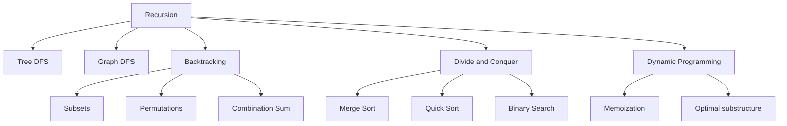

Recursion is not an isolated topic.

It is the foundation of:

* Tree algorithms
* Graph DFS
* Backtracking
* Divide and conquer
* Memoized dynamic programming
* Parsing
* Compiler syntax trees
* File-system traversal

---

# 34. The simplest mental checklist

Before coding, say this aloud:

```text
1. What does my function return?
2. What is the smallest input?
3. What smaller problem will I call?
4. How will I use the smaller answer?
5. Does every path stop?
6. How deep can the stack become?
7. Am I recalculating the same state?
8. Do I need to undo mutable state?
```

For backtracking:

```text
State
Choices
Constraints
Base case
Choose
Explore
Undo
```

---

# 35. Final cheat sheet

## Basic recursion

```go
func solve(n int) int {
	if n == 0 {
		return base
	}

	return combine(n, solve(n-1))
}
```

## Tree recursion

```go
func solve(node *TreeNode) int {
	if node == nil {
		return 0
	}

	left := solve(node.Left)
	right := solve(node.Right)

	return combine(node, left, right)
}
```

## Backtracking

```go
func backtrack() {
	if complete() {
		saveCopy()
		return
	}

	for _, choice := range choices {
		if !valid(choice) {
			continue
		}

		makeChoice(choice)
		backtrack()
		undoChoice(choice)
	}
}
```

## Complexity

```text
Time =
number of calls
×
work per call

Space =
maximum recursion depth
+
additional state
```

## Core mental model

> Trust the recursive call to correctly solve the smaller problem.

Your responsibility is only to define:

```text
Base case
Smaller problem
How to combine the answer
```
