# Arrays and Slices — Explained Simply

## 1. The simplest mental model

Imagine a row of numbered lockers:

```text
Index:     0      1      2      3      4
        +------+------+------+------+------+
Value:  |  10  |  20  |  30  |  40  |  50  |
        +------+------+------+------+------+
```

Each locker:

* Has a fixed position called an **index**
* Stores one value
* Can be accessed directly using its index

```go
numbers := []int{10, 20, 30, 40, 50}

fmt.Println(numbers[0]) // 10
fmt.Println(numbers[3]) // 40
```

The first position is index `0`, not index `1`.

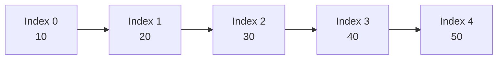

The most important property is:

> An array stores elements next to each other, allowing direct access to any position.

---

# 2. Why do we need arrays?

Suppose you want to store the marks of five students.

Without an array:

```go
student1 := 90
student2 := 75
student3 := 82
student4 := 94
student5 := 68
```

This becomes difficult to process.

With an array or slice:

```go
marks := []int{90, 75, 82, 94, 68}

for _, mark := range marks {
    fmt.Println(mark)
}
```

Arrays and slices make it easy to:

* Store many related values
* Process values using loops
* Sort and search data
* Find maximums and minimums
* Calculate sums
* Compare neighboring values
* Implement stacks, queues, heaps and matrices
* Solve most interview problems

Many data structures eventually use an array internally.

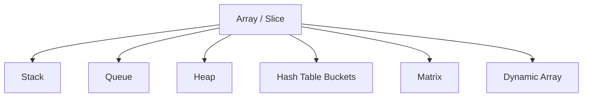

---

# 3. Array versus slice in Go

In many programming languages, the word “array” is also used loosely for a dynamic list.

In Go, arrays and slices are different.

## Go array

An array has a fixed size.

```go
numbers := [5]int{10, 20, 30, 40, 50}
```

The size is part of its type:

```go
var a [3]int
var b [5]int
```

`[3]int` and `[5]int` are different types.

You cannot resize an array after creating it.

---

## Go slice

A slice is a flexible view over an underlying array.

```go
numbers := []int{10, 20, 30}
numbers = append(numbers, 40)
```

Slices are used much more commonly in normal Go programs.

```go
var array [5]int
var slice []int
```

The easiest mental model is:

> An array is the actual row of lockers.
> A slice is a small controller that describes which lockers you can currently see.

A Go slice internally contains approximately three pieces of information:

```text
Pointer: Where the underlying array starts
Length:  How many elements are currently visible
Capacity: How much space is available before reallocation
```

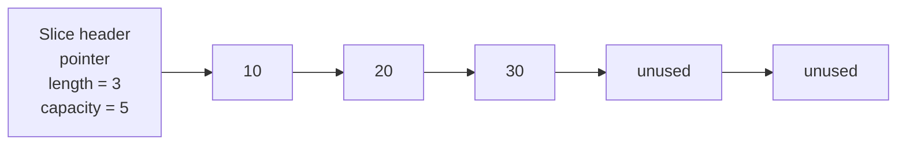

Example:

```go
numbers := make([]int, 3, 5)

fmt.Println(len(numbers)) // 3
fmt.Println(cap(numbers)) // 5
```

The underlying array has space for five elements, but the slice currently exposes three.

---

# 4. How array access is calculated

Array elements are stored consecutively in memory.

Suppose each value takes four bytes.

```text
Base address = 1000
Element size = 4 bytes
```

The memory address of an element is:

```text
address = baseAddress + index × elementSize
```

For index `3`:

```text
address = 1000 + 3 × 4
        = 1012
```

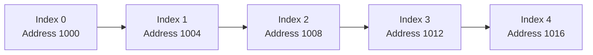

The computer does not need to examine indexes `0`, `1` and `2` before reaching index `3`.

It calculates the address directly.

That is why accessing an array element is:

```text
O(1)
```

```go
value := numbers[3]
```

Regardless of whether the array contains 10 elements or 10 million elements, the address calculation requires approximately the same amount of work.

---

# 5. Important terminology

Consider:

```go
numbers := []int{10, 20, 30, 40, 50}
```

| Term        | Meaning                                           |
| ----------- | ------------------------------------------------- |
| Element     | A value stored in the slice, such as `30`         |
| Index       | The position of an element, such as `2`           |
| Length      | Number of currently accessible elements           |
| Capacity    | Available backing-array space                     |
| Subarray    | Continuous section of an array                    |
| Subsequence | Elements in order, but not necessarily continuous |
| Prefix      | Section beginning at index `0`                    |
| Suffix      | Section ending at the last index                  |

Examples:

```text
Array:       [1, 2, 3, 4, 5]

Subarray:    [2, 3, 4]
Subsequence: [1, 3, 5]
Prefix:      [1, 2, 3]
Suffix:      [4, 5]
```

This distinction matters considerably in interviews.

---

# 6. Array and slice complexity

Let `n` be the number of elements.

| Operation             |      Time complexity | Reason                      |
| --------------------- | -------------------: | --------------------------- |
| Access by index       |               `O(1)` | Address calculated directly |
| Update by index       |               `O(1)` | Direct access               |
| Search unsorted array |               `O(n)` | May examine every element   |
| Append to slice       |     Amortized `O(1)` | Occasionally reallocates    |
| Insert at beginning   |               `O(n)` | Existing elements must move |
| Insert in middle      |               `O(n)` | Later elements must move    |
| Delete from middle    |               `O(n)` | Later elements must move    |
| Copy array            |               `O(n)` | Every element is copied     |
| Traverse array        |               `O(n)` | Every element is visited    |
| Sort                  | Usually `O(n log n)` | Depends on algorithm        |

## Why is append only amortized `O(1)`?

When a slice has spare capacity:

```text
[10, 20, 30, _, _]
```

Appending `40` is cheap:

```text
[10, 20, 30, 40, _]
```

But when the backing array is full:

```text
[10, 20, 30]
```

Go may need to:

1. Allocate a larger array
2. Copy existing values
3. Add the new value
4. Point the slice to the new array

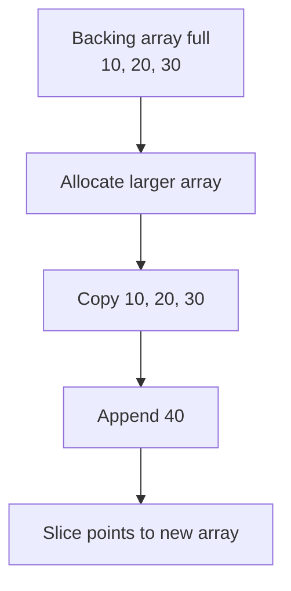

One append can therefore be `O(n)`, but most appends are cheap. Across many appends, the average is called **amortized `O(1)`**.

---

# 7. Go slice behavior you must understand

## 7.1 Slices can share the same backing array

```go
numbers := []int{10, 20, 30, 40, 50}
part := numbers[1:4]

fmt.Println(part) // [20 30 40]
```

`part` is usually not a complete copy. It refers to the same backing array.

```go
part[0] = 999

fmt.Println(numbers) // [10 999 30 40 50]
```

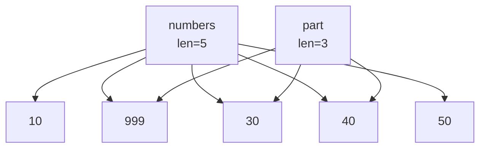

Mental model:

> Two remote controls can point to the same television.

Changing the television through one remote is visible through the other.

---

## 7.2 Copying a slice variable does not copy the elements

```go
a := []int{10, 20, 30}
b := a

b[0] = 999

fmt.Println(a) // [999 20 30]
```

The slice header is copied, but both slices refer to the same backing array.

To create an independent copy:

```go
a := []int{10, 20, 30}

b := make([]int, len(a))
copy(b, a)

b[0] = 999

fmt.Println(a) // [10 20 30]
fmt.Println(b) // [999 20 30]
```

---

## 7.3 Array assignment copies the entire array

```go
a := [3]int{10, 20, 30}
b := a

b[0] = 999

fmt.Println(a) // [10 20 30]
fmt.Println(b) // [999 20 30]
```

Because arrays are values in Go, assigning one array to another copies all elements.

---

## 7.4 Slice bounds

For:

```go
numbers := []int{10, 20, 30, 40, 50}
```

This:

```go
part := numbers[1:4]
```

means:

```text
Start at index 1
Stop before index 4
```

Result:

```text
[20, 30, 40]
```

The general format is:

```go
slice[start:end]
```

The start is inclusive. The end is exclusive.

---

# 8. The main array interview patterns

Most array interview problems are not completely new problems.

They usually belong to one of these patterns:

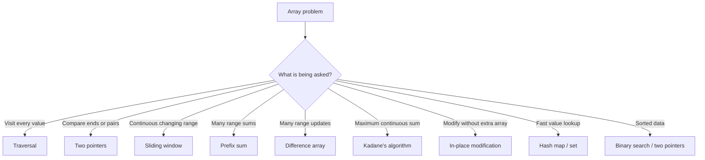

The primary interview skill is not memorizing code.

It is recognizing which pattern applies.

---

# 9. Pattern 1: Traversal

## Mental model

Walk past every locker and inspect it.

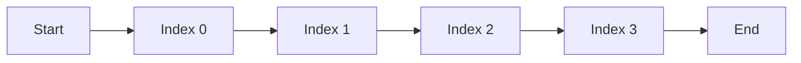

Basic traversal:

```go
numbers := []int{4, 2, 8, 1}

for i := 0; i < len(numbers); i++ {
    fmt.Println(numbers[i])
}
```

Using `range`:

```go
for index, value := range numbers {
    fmt.Println(index, value)
}
```

## Example: Find maximum

```go
func maxValue(numbers []int) int {
    maximum := numbers[0]

    for _, number := range numbers[1:] {
        if number > maximum {
            maximum = number
        }
    }

    return maximum
}
```

Complexity:

```text
Time:  O(n)
Space: O(1)
```

## Common traversal questions

* Find maximum or minimum
* Calculate total sum
* Count even numbers
* Find first occurrence
* Verify whether an array is sorted
* Count frequency
* Find a missing value

---

# 10. Pattern 2: Two pointers

Two pointers means maintaining two indexes instead of repeatedly scanning the array.

```text
left                            right
  ↓                               ↓
[ 1, 2, 3, 4, 5, 6, 7, 8 ]
```

The pointers usually:

* Move toward each other
* Move in the same direction
* Represent a valid range
* Separate processed and unprocessed elements

---

## 10.1 Opposite-direction pointers

Useful for:

* Sorted pair sum
* Palindrome checking
* Container With Most Water
* Reversing an array

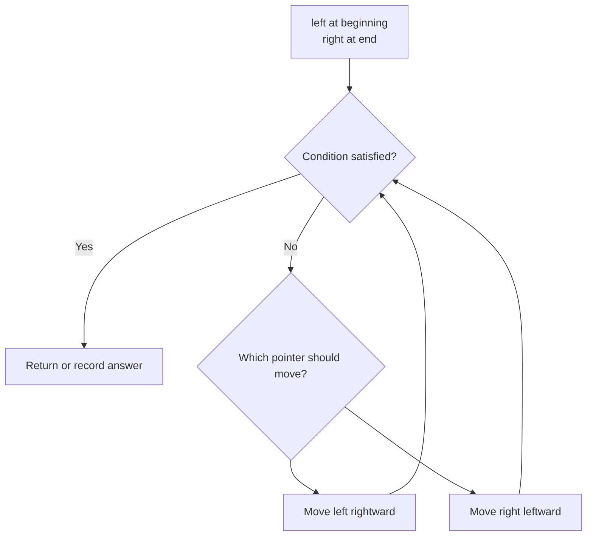

### Example: Pair sum in a sorted array

```go
func hasPairWithSum(numbers []int, target int) bool {
    left := 0
    right := len(numbers) - 1

    for left < right {
        sum := numbers[left] + numbers[right]

        if sum == target {
            return true
        }

        if sum < target {
            left++
        } else {
            right--
        }
    }

    return false
}
```

Why does this work?

Suppose the sum is too small:

```text
numbers[left] + numbers[right] < target
```

Because the array is sorted, moving `right` left would only make the sum smaller.

Therefore, we must increase `left`.

Complexity:

```text
Time:  O(n)
Space: O(1)
```

A brute-force pair comparison would take `O(n²)`.

---

## 10.2 Same-direction pointers

Useful for:

* Remove duplicates
* Move zeroes
* Partition values
* Remove a target value
* Compact an array

Mental model:

```text
write = where the next valid value should go
read  = searches for valid values
```

### Example: Move Zeroes

Input:

```text
[0, 1, 0, 3, 12]
```

Output:

```text
[1, 3, 12, 0, 0]
```

```go
func moveZeroes(numbers []int) {
    write := 0

    for read := 0; read < len(numbers); read++ {
        if numbers[read] != 0 {
            numbers[write] = numbers[read]
            write++
        }
    }

    for write < len(numbers) {
        numbers[write] = 0
        write++
    }
}
```

Visualization:

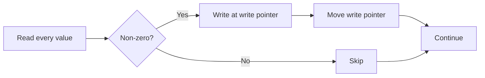

Complexity:

```text
Time:  O(n)
Space: O(1)
```

---

# 11. Pattern 3: Sliding window

Sliding window is used for a continuous section of an array or string.

Example:

```text
Array:  [2, 1, 5, 1, 3, 2]
Window:       [5, 1, 3]
```

Instead of recalculating every window from the beginning, update the previous result.

## Mental model

Imagine looking through a window that moves across a long wall.

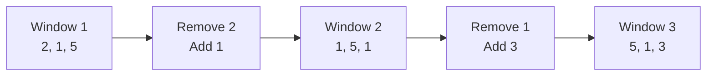

---

## 11.1 Fixed-size sliding window

Problem:

> Find the maximum sum of any subarray of size `k`.

Brute force:

* Calculate every window independently
* Each window takes `O(k)`
* Total: `O(n × k)`

Sliding window:

```go
func maxWindowSum(numbers []int, k int) int {
    if len(numbers) < k {
        return 0
    }

    windowSum := 0

    for i := 0; i < k; i++ {
        windowSum += numbers[i]
    }

    maximum := windowSum

    for right := k; right < len(numbers); right++ {
        windowSum += numbers[right]
        windowSum -= numbers[right-k]

        if windowSum > maximum {
            maximum = windowSum
        }
    }

    return maximum
}
```

Complexity:

```text
Time:  O(n)
Space: O(1)
```

---

## 11.2 Variable-size sliding window

Useful when the problem asks:

* Longest subarray satisfying a condition
* Shortest subarray satisfying a condition
* Longest substring without repetition
* Maximum consecutive values under a limit

General template:

```go
left := 0

for right := 0; right < len(numbers); right++ {
    // Add numbers[right] to the window.

    for windowIsInvalid {
        // Remove numbers[left] from the window.
        left++
    }

    // Record answer for the valid window.
}
```

Mental model:

```text
Expand right to explore.
Shrink left to repair.
```

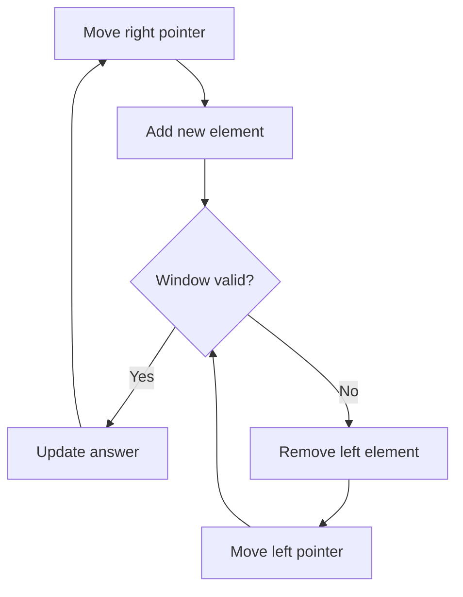

---

# 12. Pattern 4: Prefix sum

Prefix sum helps answer range-sum questions quickly.

Consider:

```text
numbers = [2, 4, 1, 3, 5]
```

Create:

```text
prefix = [0, 2, 6, 7, 10, 15]
```

Where:

```text
prefix[i] = sum of elements before index i
```

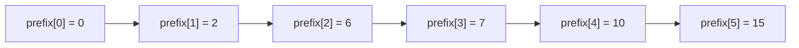

To find the sum from index `1` to index `3`:

```text
[4, 1, 3]
```

Calculate:

```text
prefix[4] - prefix[1]
= 10 - 2
= 8
```

The formula for an inclusive range `[left, right]` is:

```text
rangeSum = prefix[right + 1] - prefix[left]
```

## Why does subtraction work?

```text
prefix[right + 1] = everything before and including right
prefix[left]      = everything before left
```

Subtracting removes the unwanted prefix.

```go
func buildPrefixSum(numbers []int) []int {
    prefix := make([]int, len(numbers)+1)

    for i, number := range numbers {
        prefix[i+1] = prefix[i] + number
    }

    return prefix
}

func rangeSum(prefix []int, left, right int) int {
    return prefix[right+1] - prefix[left]
}
```

Complexity:

```text
Build prefix array: O(n)
Each range query:   O(1)
Extra space:        O(n)
```

Without prefix sums, each range query could take `O(n)`.

## Common prefix-sum problems

* Range Sum Query
* Subarray Sum Equals K
* Find equilibrium index
* Count subarrays with a target sum
* Two-dimensional matrix range sum
* Running Sum of 1D Array

---

# 13. Pattern 5: Difference array

Prefix sums answer many range queries.

Difference arrays handle many range updates.

Suppose:

```text
numbers = [0, 0, 0, 0, 0]
```

You are told:

> Add `3` to every position from index `1` to index `3`.

A direct update would modify:

```text
[0, 3, 3, 3, 0]
```

For one update, this is fine.

For thousands of updates over very large ranges, it becomes expensive.

## Difference-array idea

Instead of updating every element:

* Start adding at `left`
* Stop adding after `right`

```text
difference[left] += value
difference[right + 1] -= value
```

Example:

```text
Add 3 from index 1 to index 3

difference = [0, +3, 0, 0, -3]
```

Now calculate the running sum:

```text
index 0: 0
index 1: 0 + 3 = 3
index 2: 3 + 0 = 3
index 3: 3 + 0 = 3
index 4: 3 - 3 = 0
```

Result:

```text
[0, 3, 3, 3, 0]
```

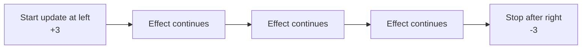

General implementation:

```go
func applyRangeUpdates(
    size int,
    updates [][3]int,
) []int {
    difference := make([]int, size+1)

    for _, update := range updates {
        left := update[0]
        right := update[1]
        value := update[2]

        difference[left] += value

        if right+1 < size {
            difference[right+1] -= value
        }
    }

    result := make([]int, size)
    running := 0

    for i := 0; i < size; i++ {
        running += difference[i]
        result[i] = running
    }

    return result
}
```

Complexity:

```text
Each range update: O(1)
Final reconstruction: O(n)
Space: O(n)
```

Common problems:

* Corporate Flight Bookings
* Car Pooling
* Range Addition
* Calendar occupancy
* Capacity changes over time

---

# 14. Pattern 6: Kadane’s algorithm

Kadane’s algorithm finds the maximum sum of a continuous subarray.

Example:

```text
[-2, 1, -3, 4, -1, 2, 1, -5, 4]
```

Best subarray:

```text
[4, -1, 2, 1]
```

Sum:

```text
6
```

## Baby mental model

You are carrying a bag containing your current sum.

At every number, ask:

> Is my existing bag helping me, or should I throw it away and start again here?

For each number:

```text
current = max(number, current + number)
best    = max(best, current)
```

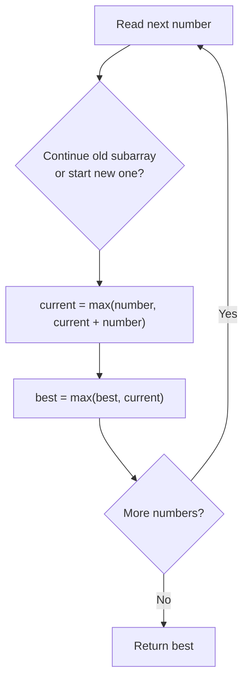

Implementation:

```go
func maximumSubarray(numbers []int) int {
    current := numbers[0]
    best := numbers[0]

    for i := 1; i < len(numbers); i++ {
        current = max(numbers[i], current+numbers[i])
        best = max(best, current)
    }

    return best
}
```

Complexity:

```text
Time:  O(n)
Space: O(1)
```

## Why reset the subarray?

Suppose:

```text
current sum = -10
next number = 5
```

Continuing gives:

```text
-10 + 5 = -5
```

Starting fresh gives:

```text
5
```

The negative prefix only damages every future subarray. It should be discarded.

---

# 15. Pattern 7: In-place modification

“In-place” means modifying the original array instead of creating another full array.

Usually:

```text
Extra space = O(1)
```

Examples:

* Move Zeroes
* Rotate Array
* Remove Duplicates
* Reverse Array
* Merge Sorted Array
* Partition values

## Reverse an array in place

```go
func reverse(numbers []int) {
    left := 0
    right := len(numbers) - 1

    for left < right {
        numbers[left], numbers[right] =
            numbers[right], numbers[left]

        left++
        right--
    }
}
```

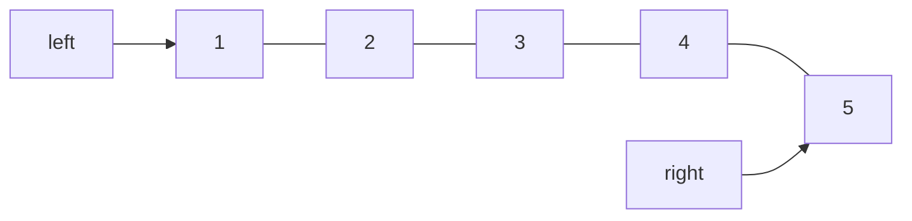

After swapping:

```text
[5, 2, 3, 4, 1]
```

Continue inward until the pointers meet.

---

# 16. Core interview problems

## 16.1 Two Sum

### Problem

Given:

```text
numbers = [2, 7, 11, 15]
target = 9
```

Return the indexes of two values whose sum is `9`.

Answer:

```text
[0, 1]
```

Because:

```text
2 + 7 = 9
```

### Pattern

Array traversal plus hash map.

For each number:

```text
needed = target - current
```

Check whether `needed` has already been seen.

```go
func twoSum(numbers []int, target int) []int {
    seen := make(map[int]int)

    for index, number := range numbers {
        needed := target - number

        if previousIndex, exists := seen[needed]; exists {
            return []int{previousIndex, index}
        }

        seen[number] = index
    }

    return nil
}
```

Complexity:

```text
Time:  O(n)
Space: O(n)
```

Interview recognition:

> Pair sum, unsorted input, need original indexes → hash map.

For sorted input, consider two pointers instead.

---

## 16.2 Best Time to Buy and Sell Stock

### Problem

```text
prices = [7, 1, 5, 3, 6, 4]
```

Best action:

```text
Buy at 1
Sell at 6
Profit = 5
```

You must buy before selling.

### Mental model

Walk through the days while remembering:

* Cheapest price seen so far
* Best profit possible so far

```go
func maxProfit(prices []int) int {
    minimumPrice := prices[0]
    bestProfit := 0

    for _, price := range prices[1:] {
        profit := price - minimumPrice

        if profit > bestProfit {
            bestProfit = profit
        }

        if price < minimumPrice {
            minimumPrice = price
        }
    }

    return bestProfit
}
```

Complexity:

```text
Time:  O(n)
Space: O(1)
```

This is similar to Kadane’s algorithm because you maintain the best answer ending at the current position.

---

## 16.3 Maximum Subarray

Pattern:

```text
Kadane’s algorithm
```

Important question:

> Is the requested subarray continuous?

If yes, Kadane may apply.

```go
func maxSubArray(numbers []int) int {
    current := numbers[0]
    best := numbers[0]

    for i := 1; i < len(numbers); i++ {
        current = max(numbers[i], current+numbers[i])
        best = max(best, current)
    }

    return best
}
```

---

## 16.4 Rotate Array

Input:

```text
numbers = [1, 2, 3, 4, 5, 6, 7]
k = 3
```

Output:

```text
[5, 6, 7, 1, 2, 3, 4]
```

### In-place reversal technique

1. Reverse the entire array
2. Reverse the first `k` elements
3. Reverse the remaining elements

```text
Original:
[1, 2, 3, 4, 5, 6, 7]

Reverse all:
[7, 6, 5, 4, 3, 2, 1]

Reverse first 3:
[5, 6, 7, 4, 3, 2, 1]

Reverse remaining:
[5, 6, 7, 1, 2, 3, 4]
```

```go
func rotate(numbers []int, k int) {
    n := len(numbers)

    if n == 0 {
        return
    }

    k %= n

    reverseRange(numbers, 0, n-1)
    reverseRange(numbers, 0, k-1)
    reverseRange(numbers, k, n-1)
}

func reverseRange(numbers []int, left, right int) {
    for left < right {
        numbers[left], numbers[right] =
            numbers[right], numbers[left]

        left++
        right--
    }
}
```

Complexity:

```text
Time:  O(n)
Space: O(1)
```

Important edge case:

```go
k %= len(numbers)
```

Without this, rotating an array of length `5` by `12` positions would cause incorrect indexing.

---

## 16.5 Merge Sorted Array

You are given two sorted arrays, with extra space at the end of the first array.

```text
nums1 = [1, 2, 3, 0, 0, 0]
nums2 = [2, 5, 6]
```

Result:

```text
[1, 2, 2, 3, 5, 6]
```

### Important trick

Merge from the end.

If you merge from the beginning, you may overwrite unprocessed values.

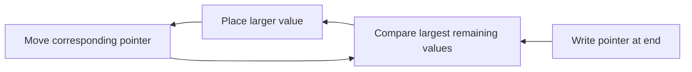

```go
func merge(nums1 []int, m int, nums2 []int, n int) {
    first := m - 1
    second := n - 1
    write := m + n - 1

    for second >= 0 {
        if first >= 0 && nums1[first] > nums2[second] {
            nums1[write] = nums1[first]
            first--
        } else {
            nums1[write] = nums2[second]
            second--
        }

        write--
    }
}
```

Complexity:

```text
Time:  O(m + n)
Space: O(1)
```

---

## 16.6 Move Zeroes

Pattern:

```text
Same-direction two pointers
```

```go
func moveZeroes(numbers []int) {
    write := 0

    for _, number := range numbers {
        if number != 0 {
            numbers[write] = number
            write++
        }
    }

    for write < len(numbers) {
        numbers[write] = 0
        write++
    }
}
```

---

## 16.7 Product of Array Except Self

Input:

```text
[1, 2, 3, 4]
```

Output:

```text
[24, 12, 8, 6]
```

For index `2`:

```text
1 × 2 × 4 = 8
```

You cannot use the current element.

### Mental model

For each position:

```text
answer[i] = product of everything to the left
          × product of everything to the right
```

```text
numbers = [1, 2, 3, 4]

left products:
[1, 1, 2, 6]

right products:
[24, 12, 4, 1]

result:
[24, 12, 8, 6]
```

```go
func productExceptSelf(numbers []int) []int {
    result := make([]int, len(numbers))

    prefixProduct := 1

    for i := 0; i < len(numbers); i++ {
        result[i] = prefixProduct
        prefixProduct *= numbers[i]
    }

    suffixProduct := 1

    for i := len(numbers) - 1; i >= 0; i-- {
        result[i] *= suffixProduct
        suffixProduct *= numbers[i]
    }

    return result
}
```

Complexity:

```text
Time:  O(n)
Extra space: O(1)
```

The returned result array normally does not count as auxiliary space.

Pattern:

```text
Prefix calculation + suffix calculation
```

---

## 16.8 Container With Most Water

Given heights:

```text
[1, 8, 6, 2, 5, 4, 8, 3, 7]
```

Choose two lines that hold the most water.

Area:

```text
width × minimum(leftHeight, rightHeight)
```

Why minimum?

Because water spills over the shorter wall.

```go
func maxArea(heights []int) int {
    left := 0
    right := len(heights) - 1
    best := 0

    for left < right {
        width := right - left
        height := min(heights[left], heights[right])
        area := width * height

        if area > best {
            best = area
        }

        if heights[left] < heights[right] {
            left++
        } else {
            right--
        }
    }

    return best
}
```

Complexity:

```text
Time:  O(n)
Space: O(1)
```

### Why move the shorter wall?

The current area is limited by the shorter wall.

Moving the taller wall:

* Reduces the width
* Does not improve the limiting height

Only moving the shorter wall gives a chance to find a taller limiting wall.

---

# 17. Pattern recognition table

| Problem wording               | Likely pattern                |
| ----------------------------- | ----------------------------- |
| “Find a value at index…”      | Direct array access           |
| “Process every element…”      | Traversal                     |
| “Pair in sorted array…”       | Two pointers                  |
| “Pair in unsorted array…”     | Hash map                      |
| “Longest continuous…”         | Sliding window                |
| “Maximum sum of size k…”      | Fixed sliding window          |
| “Maximum continuous sum…”     | Kadane’s algorithm            |
| “Many range sum queries…”     | Prefix sum                    |
| “Count subarrays with sum k…” | Prefix sum + hash map         |
| “Many range additions…”       | Difference array              |
| “Modify without extra space…” | In-place / two pointers       |
| “Sorted array…”               | Binary search or two pointers |
| “Rotate/reverse…”             | In-place reversal             |
| “Everything except current…”  | Prefix and suffix             |
| “Compare left and right…”     | Opposite-direction pointers   |
| “Keep valid elements…”        | Read and write pointers       |

---

# 18. How to approach an array problem

Use this sequence during an interview.

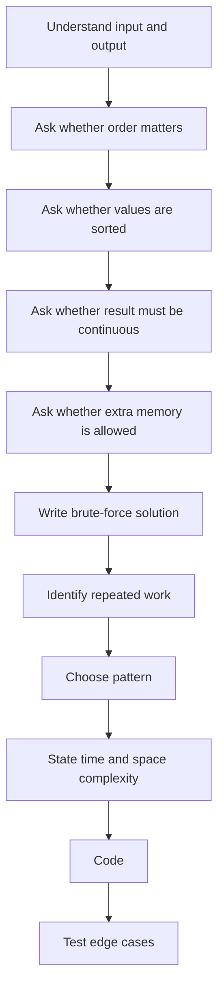

Ask yourself:

### Is the array sorted?

If yes, consider:

* Two pointers
* Binary search
* Merge process

### Is the answer a continuous section?

If yes, consider:

* Sliding window
* Prefix sum
* Kadane’s algorithm

### Am I repeatedly recalculating the same sum?

Consider:

* Running sum
* Prefix sum
* Sliding window

### Do I need fast membership lookup?

Consider:

* Hash set
* Hash map

### Must I modify the input without extra memory?

Consider:

* Swapping
* Reversal
* Read/write pointers

---

# 19. Common mistakes

## Mistake 1: Off-by-one errors

Incorrect:

```go
for i := 0; i <= len(numbers); i++ {
    fmt.Println(numbers[i])
}
```

The last valid index is:

```text
len(numbers) - 1
```

Correct:

```go
for i := 0; i < len(numbers); i++ {
    fmt.Println(numbers[i])
}
```

---

## Mistake 2: Accessing an empty slice

Incorrect:

```go
numbers := []int{}
maximum := numbers[0]
```

This panics.

Check:

```go
if len(numbers) == 0 {
    return 0
}
```

The correct empty-input behavior depends on the problem contract.

---

## Mistake 3: Forgetting that slices share memory

```go
original := []int{1, 2, 3}
copyOfHeader := original

copyOfHeader[0] = 99
```

Both slices now observe `99`.

Use `copy` for independent storage.

---

## Mistake 4: Modifying the slice while ranging incorrectly

```go
for _, value := range numbers {
    value = value * 2
}
```

This does not update the slice because `value` is a copy.

Correct:

```go
for i := range numbers {
    numbers[i] *= 2
}
```

---

## Mistake 5: Using `O(n²)` when a running value is enough

For every index, recalculating a complete sum often indicates an optimization opportunity.

Look for:

* Prefix sum
* Sliding window
* Running minimum
* Running maximum
* Hash map

---

## Mistake 6: Forgetting all-negative arrays in Kadane

Incorrect initialization:

```go
best := 0
```

For:

```text
[-5, -2, -8]
```

This would incorrectly return `0`.

Correct:

```go
current := numbers[0]
best := numbers[0]
```

The answer should be `-2`.

---

## Mistake 7: Overwriting values during in-place merge

When merging into an array with free space at the end, start writing from the back.

---

# 20. Interview mock questions

## Question 1: Why is array access `O(1)`?

A strong answer:

> Array elements are stored contiguously. The address of an element can be calculated directly as the base address plus the index multiplied by the element size. Therefore, accessing an element does not require traversing earlier elements.

---

## Question 2: Why is searching an unsorted array `O(n)`?

> Without ordering or an auxiliary index, the target could appear anywhere, including the final position, or may not exist. In the worst case, every element must be examined.

---

## Question 3: What is the difference between an array and a slice in Go?

> A Go array has a fixed length, and its length is part of its type. A slice is a descriptor over a backing array containing a pointer, length and capacity. Slices can grow using `append`, although growth may allocate a new backing array.

---

## Question 4: Is appending to a slice always `O(1)`?

> No. It is amortized `O(1)`. If capacity is available, append is constant time. If the backing array is full, Go may allocate a larger array and copy the existing elements, making that particular append `O(n)`.

---

## Question 5: When would you use two pointers?

> Two pointers are useful when processing sorted arrays, comparing values from both ends, finding pairs, reversing arrays, or compacting valid elements in place.

---

## Question 6: Sliding window versus prefix sum?

> Sliding window is useful when incrementally maintaining information for a moving continuous range, especially longest or shortest valid windows. Prefix sums are useful when answering many arbitrary range-sum queries or combining prefix sums with a hash map to count subarrays.

---

## Question 7: What makes Kadane’s algorithm work?

> If the maximum sum ending before the current element is negative, carrying that sum forward only makes future subarrays worse. Therefore, the algorithm either extends the previous subarray or starts a new subarray at the current element.

---

## Question 8: Why merge sorted arrays from the end?

> Writing from the beginning could overwrite unprocessed values in the first array. Writing from the end uses the available empty space and safely places the largest remaining element.

---

## Question 9: What is an in-place algorithm?

> An in-place algorithm modifies the existing data structure while using constant or very small auxiliary memory. It may still use variables and the output array may or may not count, depending on the problem definition.

---

## Question 10: What is the difference between a subarray and a subsequence?

> A subarray is continuous. A subsequence preserves relative order but may skip elements.

Example:

```text
Array:       [1, 2, 3, 4]
Subarray:    [2, 3]
Subsequence: [1, 3, 4]
```

---

# 21. Coding mock questions

## Easy

1. Find the largest element.
2. Reverse an array in place.
3. Check whether an array is sorted.
4. Remove a target value in place.
5. Move all zeroes to the end.
6. Find the second-largest element.
7. Merge two sorted arrays.
8. Find the missing number from `0` to `n`.

## Medium

1. Two Sum
2. Best Time to Buy and Sell Stock
3. Maximum Subarray
4. Product of Array Except Self
5. Rotate Array
6. Container With Most Water
7. Subarray Sum Equals K
8. Three Sum
9. Longest Consecutive Sequence
10. Minimum Size Subarray Sum

## Harder

1. Trapping Rain Water
2. First Missing Positive
3. Maximum Product Subarray
4. Sliding Window Maximum
5. Median of Two Sorted Arrays
6. Largest Rectangle in Histogram

---

# 22. Mini interview exercise

Consider:

```text
numbers = [3, 1, 4, 1, 5]
```

## Exercise 1

What is:

```go
numbers[2]
```

Answer:

```text
4
```

---

## Exercise 2

What is the complexity of accessing `numbers[2]`?

Answer:

```text
O(1)
```

---

## Exercise 3

What is the complexity of finding whether `5` exists without extra data structures?

Answer:

```text
O(n)
```

---

## Exercise 4

What pattern would you use to find the maximum sum of any three consecutive numbers?

Answer:

```text
Fixed-size sliding window
```

---

## Exercise 5

What pattern would you use to answer 100,000 range-sum queries?

Answer:

```text
Prefix sum
```

---

## Exercise 6

What pattern would you use to find a pair with a target sum in a sorted array?

Answer:

```text
Two pointers
```

---

## Exercise 7

What pattern would you use to move all zeroes to the end without another array?

Answer:

```text
Read/write pointers and in-place modification
```

---

# 23. One-page mental model

```text
ARRAY
A numbered row of adjacent boxes.

INDEX ACCESS
Jump directly to a box: O(1).

TRAVERSAL
Visit every box: O(n).

TWO POINTERS
Use two fingers to avoid repeated scanning.

SLIDING WINDOW
Move one continuous viewing window.

PREFIX SUM
Precalculate totals so range queries become subtraction.

DIFFERENCE ARRAY
Mark where a range update starts and stops.

KADANE
Keep a profitable running subarray; abandon a harmful one.

IN-PLACE
Rearrange existing boxes instead of creating a second row.

GO SLICE
A pointer, length and capacity describing part of a backing array.
```

---

# 24. Final pattern map

```mermaid
mindmap
  root((Arrays and Slices))
    Storage
      Contiguous memory
      Index based
      O(1) access
    Go Slice
      Pointer
      Length
      Capacity
      Backing array
      Append
    Traversal
      Sum
      Min and max
      Frequency
    Two Pointers
      Pair sum
      Palindrome
      Move zeroes
      Reverse
    Sliding Window
      Fixed size
      Variable size
      Longest range
    Prefix Sum
      Range sum
      Subarray sum
    Difference Array
      Range updates
    Kadane
      Maximum subarray
    In Place
      Rotate
      Merge
      Remove duplicates
```

The central interview lesson is:

> Arrays are simple storage. Most difficult array questions are really tests of whether you recognize traversal, two pointers, sliding window, prefix sum, Kadane’s algorithm or in-place modification.
