# Dynamic Programming — explained like a baby

Dynamic Programming, usually called **DP**, is a technique for solving a large problem by:

1. Breaking it into smaller problems.
2. Solving each smaller problem once.
3. Remembering the answer.
4. Reusing that answer instead of recalculating it.

> **DP = recursion or iteration + memory**

Dynamic Programming does not mean “programming dynamically.” It means **remembering previously calculated results**.

---

# 1. Baby-level mental model

Imagine someone asks:

> “How many ways can you climb five stairs if you can take one or two steps?”

To reach stair `5`, your final jump must come from:

* Stair `4` using one step.
* Stair `3` using two steps.

Therefore:

```text
ways(5) = ways(4) + ways(3)
```

But calculating `ways(4)` also needs `ways(3)`.

Without DP, you calculate `ways(3)` multiple times.

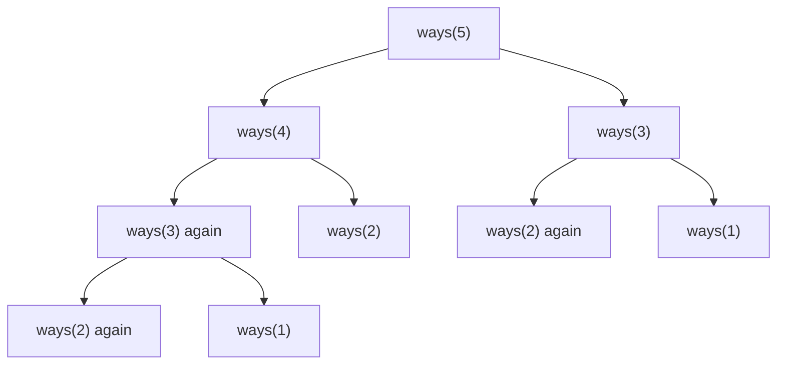

The computer keeps asking the same questions:

```text
ways(3)?
ways(2)?
ways(3) again?
ways(2) again?
```

DP says:

> “I already calculated `ways(3)`. Let me reuse the answer.”

That is the entire idea.

---

# 2. Why is Dynamic Programming needed?

Consider the Fibonacci sequence:

```text
fib(n) = fib(n-1) + fib(n-2)
```

A normal recursive solution recalculates the same values repeatedly.

```go
func fib(n int) int {
	if n <= 1 {
		return n
	}

	return fib(n-1) + fib(n-2)
}
```

Its recursion tree grows rapidly.

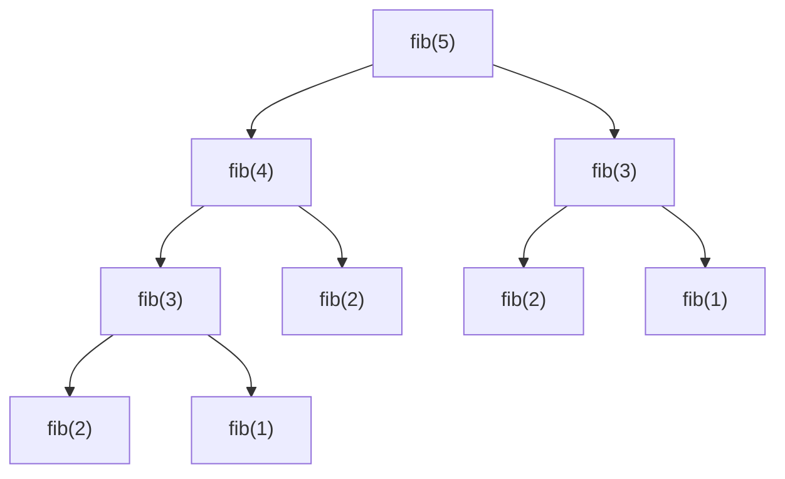

Notice:

* `fib(3)` is calculated more than once.
* `fib(2)` is calculated many times.

### Without DP

```text
Time: O(2ⁿ)
```

### With DP

```text
Time: O(n)
```

DP can turn an extremely slow solution into a practical one.

---

# 3. When can DP be used?

A problem usually needs two properties.

## Property 1: Overlapping subproblems

The same smaller problem appears repeatedly.

Examples:

```text
fib(3) is needed multiple times
minimum coins for amount 7 is needed multiple times
LCS for prefixes i and j is reused
```

## Property 2: Optimal substructure

The answer to the large problem can be built from answers to smaller problems.

For example:

```text
Minimum coins for amount 11
=
1 coin + minimum coins for a smaller amount
```

Or:

```text
Best robbery result at house i
=
maximum of:
- skipping house i
- robbing house i
```

---

# 4. The most important DP mental model

Almost every DP problem can be solved using six questions.

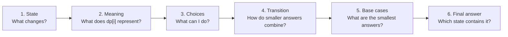

Use this checklist:

```text
State
Meaning
Choices
Transition
Base case
Calculation order
Answer
```

---

# 5. What is a DP state?

A **state** describes one smaller version of the original problem.

For Climbing Stairs:

```text
dp[i] = number of ways to reach stair i
```

For House Robber:

```text
dp[i] = maximum money that can be robbed from houses 0 to i
```

For Coin Change:

```text
dp[a] = minimum coins needed to create amount a
```

For Longest Common Subsequence:

```text
dp[i][j] = LCS length using the first i characters of text1
           and the first j characters of text2
```

A correct state definition is usually the hardest part of DP.

---

# 6. What is a state transition?

A **state transition** explains how one DP answer is calculated from earlier answers.

For Climbing Stairs:

```text
dp[i] = dp[i-1] + dp[i-2]
```

For House Robber:

```text
dp[i] = max(
    dp[i-1],            // skip current house
    money[i] + dp[i-2]  // rob current house
)
```

For Unique Paths:

```text
dp[row][col] =
    dp[row-1][col] + dp[row][col-1]
```

The transition is the formula that connects smaller problems to the current problem.

---

# 7. Memoization vs Tabulation

There are two main ways to write DP.

## Memoization: top-down DP

Start with the original problem and recursively move toward smaller problems.

Store each result in a cache.

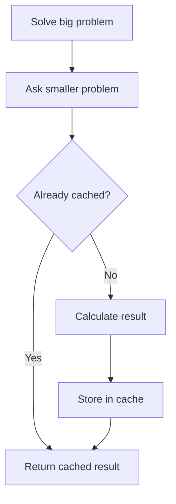

## Tabulation: bottom-up DP

Start with the smallest known answers.

Build larger answers one by one.

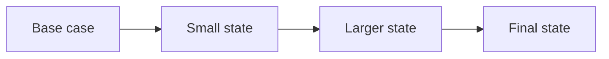

| Property                   | Memoization               | Tabulation         |
| -------------------------- | ------------------------- | ------------------ |
| Direction                  | Top-down                  | Bottom-up          |
| Technique                  | Recursion + cache         | Loop + table       |
| Calculates                 | Only requested states     | Usually all states |
| Stack usage                | Uses recursive call stack | No recursion stack |
| Often easier initially     | Yes                       | Sometimes          |
| Usually faster in practice | Sometimes slower          | Often faster       |
| Stack overflow risk        | Yes                       | No                 |

Both implement the same recurrence.

---

# 8. Example 1: Climbing Stairs

You can climb either:

* One stair.
* Two stairs.

How many ways can you reach stair `n`?

## Step 1: Define the state

```text
dp[i] = number of ways to reach stair i
```

## Step 2: Find the choices

To reach stair `i`, the last jump came from:

```text
i - 1
or
i - 2
```

## Step 3: Write the transition

```text
dp[i] = dp[i-1] + dp[i-2]
```

## Step 4: Base cases

```text
dp[0] = 1
dp[1] = 1
```

Why is `dp[0] = 1`?

There is exactly one way to stay at the starting position: do nothing.

## Calculation

```text
dp[0] = 1
dp[1] = 1
dp[2] = 2
dp[3] = 3
dp[4] = 5
dp[5] = 8
```

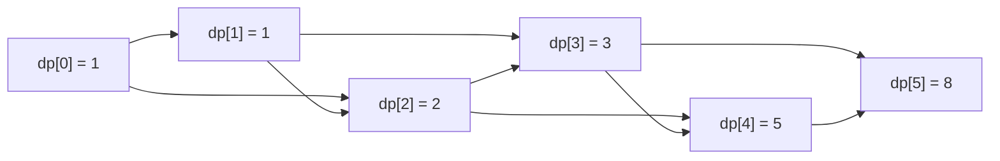

## Memoization solution in Go

```go
func climbStairs(n int) int {
	memo := make(map[int]int)

	var solve func(int) int
	solve = func(stair int) int {
		if stair <= 1 {
			return 1
		}

		if result, exists := memo[stair]; exists {
			return result
		}

		memo[stair] = solve(stair-1) + solve(stair-2)
		return memo[stair]
	}

	return solve(n)
}
```

Complexity:

```text
Time:  O(n)
Space: O(n)
```

## Tabulation solution

```go
func climbStairs(n int) int {
	if n <= 1 {
		return 1
	}

	dp := make([]int, n+1)
	dp[0] = 1
	dp[1] = 1

	for stair := 2; stair <= n; stair++ {
		dp[stair] = dp[stair-1] + dp[stair-2]
	}

	return dp[n]
}
```

## Space-optimized solution

We only need the previous two values.

```go
func climbStairs(n int) int {
	if n <= 1 {
		return 1
	}

	twoStepsBack := 1
	oneStepBack := 1

	for stair := 2; stair <= n; stair++ {
		current := oneStepBack + twoStepsBack
		twoStepsBack = oneStepBack
		oneStepBack = current
	}

	return oneStepBack
}
```

Complexity:

```text
Time:  O(n)
Space: O(1)
```

---

# 9. Example 2: House Robber

You have houses containing:

```text
[2, 7, 9, 3, 1]
```

You cannot rob adjacent houses.

At every house, you have two choices:

1. Skip it.
2. Rob it.

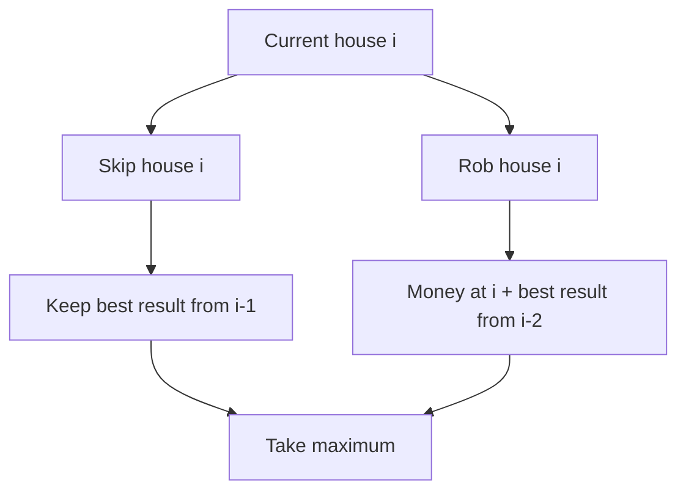

## State

```text
dp[i] = maximum money obtainable using houses 0 through i
```

## Transition

```text
dp[i] = max(
    dp[i-1],
    money[i] + dp[i-2]
)
```

Translation:

```text
skip current house
versus
rob current house and skip the previous one
```

## Step-by-step

```text
Houses: [2, 7, 9, 3, 1]

dp[0] = 2
dp[1] = max(2, 7) = 7

dp[2] = max(7, 9 + 2) = 11
dp[3] = max(11, 3 + 7) = 11
dp[4] = max(11, 1 + 11) = 12
```

Answer:

```text
12
```

Rob houses containing:

```text
2 + 9 + 1 = 12
```

## Go solution

```go
func rob(houses []int) int {
	twoHousesBack := 0
	oneHouseBack := 0

	for _, money := range houses {
		skipCurrent := oneHouseBack
		robCurrent := twoHousesBack + money

		current := max(skipCurrent, robCurrent)

		twoHousesBack = oneHouseBack
		oneHouseBack = current
	}

	return oneHouseBack
}

func max(a, b int) int {
	if a > b {
		return a
	}
	return b
}
```

Complexity:

```text
Time:  O(n)
Space: O(1)
```

---

# 10. The pick/not-pick pattern

Many DP problems have this structure:

```text
Pick the current item
or
Do not pick the current item
```

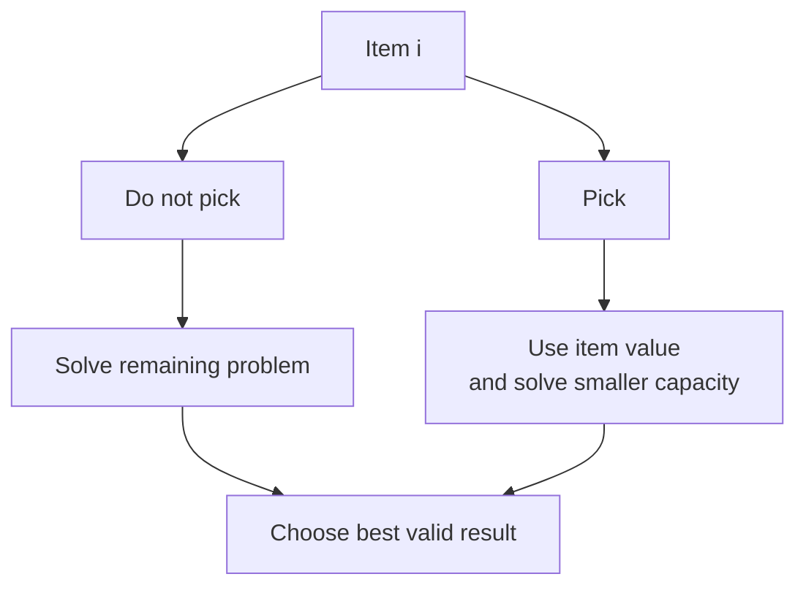

Common pick/not-pick problems:

* House Robber
* 0/1 Knapsack
* Partition Equal Subset Sum
* Target Sum
* Subset Sum
* Longest Increasing Subsequence
* Coin Change variants

---

# 11. Knapsack: the main DP family

Suppose you have a bag with capacity `W`.

Each item has:

* A weight.
* A value.

You want the maximum value without exceeding the capacity.

## 0/1 Knapsack

Each item may be selected zero or one time.

State:

```text
dp[i][capacity]
=
maximum value using the first i items
with the given remaining capacity
```

Transition:

```text
Do not take item:
dp[i-1][capacity]

Take item:
value[i] + dp[i-1][capacity-weight[i]]
```

Therefore:

```text
dp[i][capacity] =
max(
    dp[i-1][capacity],
    value[i] + dp[i-1][capacity-weight[i]]
)
```

The second choice only exists when the item fits.

## 0/1 versus unbounded knapsack

| Type               | Can reuse item? | Example                      |
| ------------------ | --------------: | ---------------------------- |
| 0/1 Knapsack       |              No | Partition Equal Subset Sum   |
| Unbounded Knapsack |             Yes | Coin Change                  |
| Bounded Knapsack   |   Limited count | Inventory-selection problems |

---

# 12. Example 3: Coin Change

Given:

```text
coins = [1, 2, 5]
amount = 11
```

Find the minimum number of coins.

Answer:

```text
5 + 5 + 1 = 3 coins
```

## State

```text
dp[a] = minimum number of coins required to create amount a
```

## Transition

Try every coin:

```text
dp[a] = min(
    dp[a],
    1 + dp[a-coin]
)
```

## Base case

```text
dp[0] = 0
```

Zero coins are needed to create amount zero.

## Go solution

```go
func coinChange(coins []int, amount int) int {
	impossible := amount + 1

	dp := make([]int, amount+1)
	for currentAmount := 1; currentAmount <= amount; currentAmount++ {
		dp[currentAmount] = impossible
	}

	for currentAmount := 1; currentAmount <= amount; currentAmount++ {
		for _, coin := range coins {
			if coin <= currentAmount {
				dp[currentAmount] = min(
					dp[currentAmount],
					1+dp[currentAmount-coin],
				)
			}
		}
	}

	if dp[amount] == impossible {
		return -1
	}

	return dp[amount]
}

func min(a, b int) int {
	if a < b {
		return a
	}
	return b
}
```

Complexity:

```text
Time:  O(amount × number of coins)
Space: O(amount)
```

---

# 13. 1D Dynamic Programming

Use 1D DP when one variable is enough to describe the smaller problem.

Examples:

```text
dp[i]
dp[amount]
dp[capacity]
```

Common 1D DP problems:

* Climbing Stairs
* House Robber
* Coin Change
* Decode Ways
* Word Break
* Maximum Product Subarray
* Longest Increasing Subsequence
* Partition Equal Subset Sum

Typical transition:

```text
dp[i] depends on earlier dp values
```

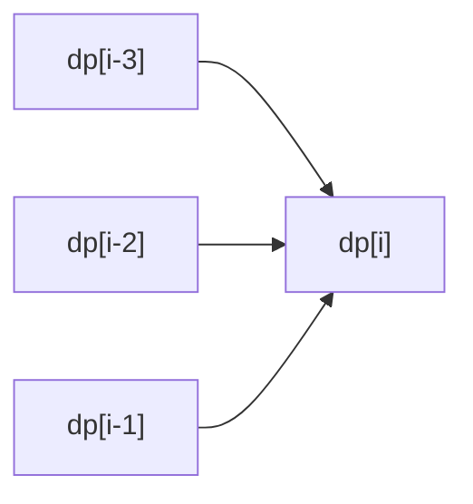

---

# 14. 2D Dynamic Programming

Use 2D DP when two values are required to describe a state.

Examples:

```text
dp[row][column]
dp[index1][index2]
dp[item][capacity]
```

Common 2D DP problems:

* Unique Paths
* Longest Common Subsequence
* Edit Distance
* 0/1 Knapsack
* Minimum Path Sum
* Interleaving String
* Distinct Subsequences

---

# 15. Example 4: Unique Paths

A robot starts at the top-left of a grid.

It may move:

* Right.
* Down.

How many ways can it reach the bottom-right?

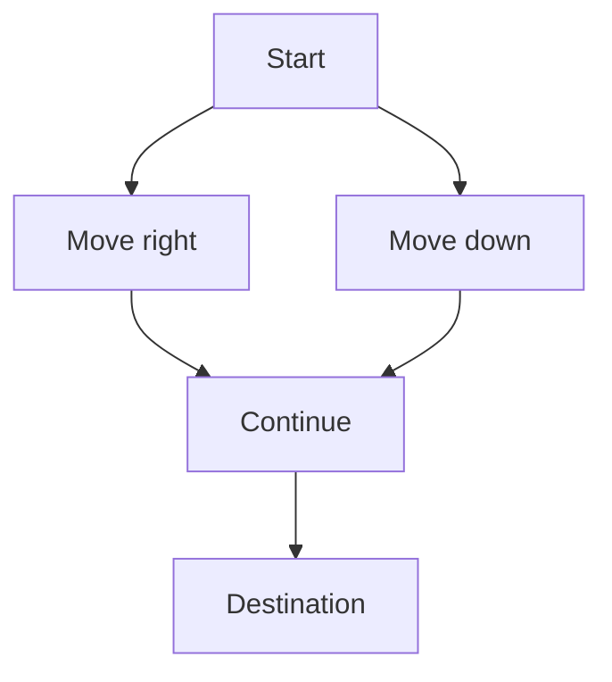

To enter a cell, the robot must come from:

```text
Above
or
Left
```

## State

```text
dp[row][column] =
number of ways to reach this cell
```

## Transition

```text
dp[row][column] =
    dp[row-1][column] +
    dp[row][column-1]
```

## Base case

There is one way to move through:

* The first row: keep moving right.
* The first column: keep moving down.

## Space-optimized Go solution

```go
func uniquePaths(rows, columns int) int {
	dp := make([]int, columns)

	for column := range dp {
		dp[column] = 1
	}

	for row := 1; row < rows; row++ {
		for column := 1; column < columns; column++ {
			dp[column] = dp[column] + dp[column-1]
		}
	}

	return dp[columns-1]
}
```

Complexity:

```text
Time:  O(rows × columns)
Space: O(columns)
```

---

# 16. Longest subsequence problems

A **subsequence** keeps the order but may remove elements.

For example:

```text
Original:    A B C D E
Subsequence: A C E
```

`ACE` is a subsequence.

`ECA` is not, because the order changed.

---

# 17. Longest Increasing Subsequence

Given:

```text
[10, 9, 2, 5, 3, 7, 101, 18]
```

One longest increasing subsequence is:

```text
[2, 3, 7, 101]
```

Length:

```text
4
```

## State

```text
dp[i] =
length of the longest increasing subsequence ending exactly at i
```

The words **ending exactly at `i`** are important.

## Transition

Look at every earlier index `j`.

When:

```text
numbers[j] < numbers[i]
```

then `numbers[i]` may be added after `numbers[j]`.

```text
dp[i] = max(dp[i], dp[j] + 1)
```

## Go solution: O(n²)

```go
func lengthOfLIS(numbers []int) int {
	if len(numbers) == 0 {
		return 0
	}

	dp := make([]int, len(numbers))
	answer := 1

	for i := range numbers {
		dp[i] = 1

		for j := 0; j < i; j++ {
			if numbers[j] < numbers[i] {
				dp[i] = max(dp[i], dp[j]+1)
			}
		}

		answer = max(answer, dp[i])
	}

	return answer
}
```

Complexity:

```text
Time:  O(n²)
Space: O(n)
```

A more advanced binary-search solution runs in:

```text
O(n log n)
```

In interviews, explain the `O(n²)` DP solution before optimizing.

---

# 18. Longest Common Subsequence

Given:

```text
text1 = "abcde"
text2 = "ace"
```

The longest common subsequence is:

```text
"ace"
```

Length:

```text
3
```

## State

```text
dp[i][j] =
LCS length using text1[0:i] and text2[0:j]
```

## Transition

When the current characters match:

```text
dp[i][j] = 1 + dp[i-1][j-1]
```

When they do not match:

```text
dp[i][j] = max(
    dp[i-1][j],
    dp[i][j-1]
)
```

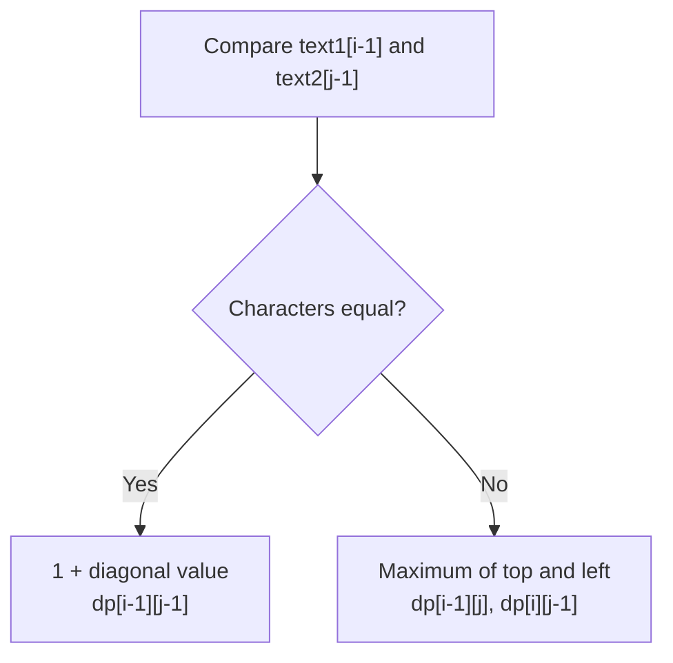

Complexity:

```text
Time:  O(m × n)
Space: O(m × n)
```

---

# 19. Edit Distance

Given two strings, find the minimum operations required to convert one into the other.

Allowed operations:

1. Insert.
2. Delete.
3. Replace.

Example:

```text
horse → ros
```

## State

```text
dp[i][j] =
minimum operations required to convert
the first i characters of word1
into the first j characters of word2
```

## Transition

When characters match:

```text
dp[i][j] = dp[i-1][j-1]
```

When characters do not match:

```text
dp[i][j] = 1 + min(
    dp[i-1][j],    // delete
    dp[i][j-1],    // insert
    dp[i-1][j-1]   // replace
)
```

Mental model:

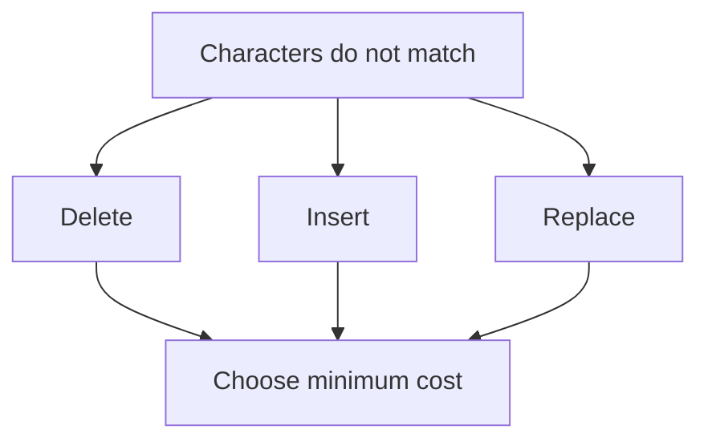

---

# 20. Word Break

Given:

```text
s = "leetcode"
dictionary = ["leet", "code"]
```

Can the string be divided into dictionary words?

Answer:

```text
true
```

Because:

```text
"leet" + "code"
```

## State

```text
dp[i] =
whether the first i characters can be segmented
```

## Transition

Try every previous cut `j`:

```text
dp[i] = true
if:
    dp[j] is true
and
    s[j:i] exists in the dictionary
```

Conceptually:

```text
Can the prefix before j be formed?
+
Is the substring from j to i a word?
```

---

# 21. Partition Equal Subset Sum

Given:

```text
[1, 5, 11, 5]
```

Can it be divided into two subsets with the same sum?

Total:

```text
22
```

Each subset must have:

```text
11
```

So the problem becomes:

> Can we select numbers whose sum is `total / 2`?

This is a 0/1 knapsack problem.

## State

```text
dp[sum] =
whether the target sum can be created
```

## Transition

```text
dp[sum] = dp[sum] OR dp[sum-number]
```

Important: Iterate sums backward.

```go
for _, number := range numbers {
	for sum := target; sum >= number; sum-- {
		dp[sum] = dp[sum] || dp[sum-number]
	}
}
```

Why backward?

Because each number may be used only once.

Going forward could reuse the same number during the same iteration.

---

# 22. How to recognize a DP problem

Look for words such as:

* Maximum.
* Minimum.
* Number of ways.
* Can it be done?
* Longest.
* Shortest.
* Count all possibilities.
* Choose or skip.
* Divide into groups.
* Convert one sequence into another.

Then ask:

```text
Does the answer depend on answers to smaller versions
of the same problem?
```

Common clues:

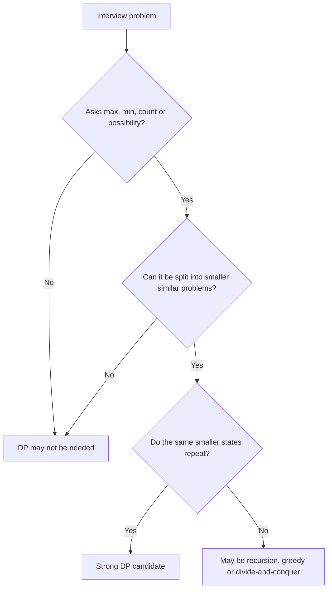

---

# 23. A practical DP-solving process

When you see a DP problem, do not immediately create a table.

Use this process.

## Step 1: Write the brute-force choices

Ask:

```text
What decisions can I make here?
```

Examples:

```text
Pick or skip
Move right or down
Use coin or try another coin
Match characters or skip one
Rob or skip
```

## Step 2: Write the recursive function

Determine its changing arguments.

```go
solve(index)
solve(index, capacity)
solve(row, column)
solve(index1, index2)
```

These arguments usually become the DP state.

## Step 3: Identify repeated states

If `solve(index, capacity)` can be reached through different paths, cache it.

## Step 4: Add memoization

Store the result using the function arguments as the cache key.

## Step 5: Convert to tabulation when useful

Determine which smaller states must be calculated first.

## Step 6: Optimize memory

Ask:

```text
Does the current row need every previous row,
or only the immediately previous row?
```

---

# 24. DP state dimensions

The number of changing variables usually determines the DP dimensions.

| Recursive function            | DP structure               |
| ----------------------------- | -------------------------- |
| `solve(index)`                | `dp[index]`                |
| `solve(amount)`               | `dp[amount]`               |
| `solve(row, column)`          | `dp[row][column]`          |
| `solve(i, j)`                 | `dp[i][j]`                 |
| `solve(index, capacity)`      | `dp[index][capacity]`      |
| `solve(index, previousIndex)` | `dp[index][previousIndex]` |

This is a useful interview shortcut:

> The parameters that change between recursive calls often form the DP state.

---

# 25. Common DP patterns

| Pattern           | State idea                           | Common problems                             |
| ----------------- | ------------------------------------ | ------------------------------------------- |
| Fibonacci-style   | `dp[i]` from earlier positions       | Climbing Stairs, House Robber               |
| Grid DP           | `dp[row][column]`                    | Unique Paths, Minimum Path Sum              |
| Pick/not pick     | Index plus optional capacity         | Knapsack, Partition Equal Subset Sum        |
| Coin DP           | Amount or target                     | Coin Change, Combination Sum IV             |
| Subsequence DP    | Ending index or two sequence indexes | LIS, LCS                                    |
| String conversion | Prefixes of two strings              | Edit Distance                               |
| Segmentation      | Whether a prefix is valid            | Word Break                                  |
| Interval DP       | Answer for range `[left, right]`     | Burst Balloons, Matrix Chain Multiplication |
| State-machine DP  | State such as holding/not holding    | Stock-buying problems                       |
| Tree DP           | Answer for each subtree              | House Robber III                            |

---

# 26. Most important interview problems

## Foundation

1. **Climbing Stairs**

   * Fibonacci-style recurrence.
   * Learn memoization and tabulation.

2. **House Robber**

   * Pick/not-pick decisions.
   * Learn space optimization.

3. **Unique Paths**

   * Basic 2D grid DP.

## Core intermediate problems

4. **Coin Change**

   * Unbounded knapsack.
   * Minimum-value DP.

5. **Partition Equal Subset Sum**

   * 0/1 knapsack.
   * Boolean DP.

6. **Word Break**

   * Prefix-based DP.

7. **Longest Increasing Subsequence**

   * Subsequence ending at an index.

## Important string DP

8. **Longest Common Subsequence**

   * Two-string 2D DP.

9. **Edit Distance**

   * Multiple transitions.
   * Insert/delete/replace decisions.

---

# 27. Common mistakes

## Mistake 1: Undefined DP meaning

Bad:

```text
dp[i] stores the answer
```

Better:

```text
dp[i] stores the maximum money obtainable
using houses from index 0 through i
```

The state definition must be precise.

---

## Mistake 2: Incorrect base cases

For Climbing Stairs:

```text
dp[0] = 1
```

For Coin Change:

```text
dp[0] = 0
```

The same index can have different meanings in different problems.

---

## Mistake 3: Wrong iteration order

For 0/1 knapsack:

```text
Iterate capacity backward
```

For unbounded knapsack:

```text
Iterating capacity forward may allow item reuse
```

Iteration order is part of the algorithm.

---

## Mistake 4: Confusing subsequence and substring

Substring:

```text
Characters must be continuous
```

Subsequence:

```text
Characters may be skipped, but order must remain
```

---

## Mistake 5: Optimizing space too early

First build the correct recurrence and table.

Then optimize:

```text
O(n) space → O(1)
O(rows × columns) → O(columns)
```

---

## Mistake 6: Using DP when greedy works

DP explores and compares multiple decisions.

Greedy commits to the locally best decision.

For example:

* Coin Change with arbitrary denominations generally needs DP.
* Interval scheduling can use greedy.
* Minimum Spanning Tree uses greedy.
* House Robber needs DP.

---

# 28. DP complexity calculation

A practical formula is:

```text
Time complexity
=
number of states × work per state
```

## Climbing Stairs

```text
States: n
Work per state: O(1)

Time: O(n)
```

## Coin Change

```text
States: amount
Work per state: number of coins

Time: O(amount × coins)
```

## Unique Paths

```text
States: rows × columns
Work per state: O(1)

Time: O(rows × columns)
```

## LCS

```text
States: m × n
Work per state: O(1)

Time: O(m × n)
```

## LIS basic DP

```text
States: n
Work per state: scan up to n earlier elements

Time: O(n²)
```

Space complexity is usually:

```text
Number of stored states
+
recursion stack for memoization
```

---

# 29. Memoization template in Go

```go
func solve(input []int) int {
	memo := make(map[int]int)

	var dp func(index int) int
	dp = func(index int) int {
		if index < 0 {
			return 0
		}

		if result, exists := memo[index]; exists {
			return result
		}

		// Calculate using smaller states.
		result := dp(index - 1)

		memo[index] = result
		return result
	}

	return dp(len(input) - 1)
}
```

For a two-dimensional state, use a struct as the key:

```go
type State struct {
	Index    int
	Capacity int
}

memo := make(map[State]int)
```

---

# 30. Tabulation template

```go
func solve(n int) int {
	dp := make([]int, n+1)

	// Base cases.
	dp[0] = 0

	for state := 1; state <= n; state++ {
		// Calculate dp[state] using previously calculated states.
	}

	return dp[n]
}
```

Two-dimensional version:

```go
dp := make([][]int, rows)

for row := range dp {
	dp[row] = make([]int, columns)
}

for row := 0; row < rows; row++ {
	for column := 0; column < columns; column++ {
		// Calculate dp[row][column].
	}
}
```

---

# 31. Mock interview questions

## Question 1: What is Dynamic Programming?

A strong answer:

> Dynamic Programming solves problems with overlapping subproblems and optimal substructure. It stores the result of each subproblem so that the same state is not recalculated. It can be implemented using top-down memoization or bottom-up tabulation.

---

## Question 2: What is the difference between memoization and tabulation?

> Memoization is top-down. It uses recursion and caches states as they are requested. Tabulation is bottom-up. It calculates states iteratively, beginning with base cases. Both generally use the same recurrence.

---

## Question 3: What is a DP state?

> A state is the minimum information required to uniquely describe a smaller subproblem. For example, in Coin Change, the remaining amount can be the state. In Longest Common Subsequence, the two string indexes form the state.

---

## Question 4: How do you calculate DP time complexity?

> Count the number of unique states, then multiply by the amount of work done for each state.

Example:

```text
LCS has m × n states.
Each state performs O(1) work.
Therefore, time complexity is O(m × n).
```

---

## Question 5: Why is Climbing Stairs a DP problem?

> The number of ways to reach stair `i` depends on the number of ways to reach stairs `i-1` and `i-2`. These subproblems repeat in the recursive solution, so their answers can be cached.

---

## Question 6: How do you decide the dimensions of a DP table?

> Look at the changing parameters of the recursive solution. One changing parameter usually gives 1D DP. Two independent changing parameters usually give 2D DP.

---

## Question 7: What is the difference between 0/1 and unbounded knapsack?

> In 0/1 knapsack, each item can be selected at most once. In unbounded knapsack, an item may be selected repeatedly. The table iteration order often changes because of this distinction.

---

## Question 8: Why do we iterate backward in Partition Equal Subset Sum?

> Each number can be used only once. Iterating backward prevents a number from updating a state and then immediately reusing that updated state during the same iteration.

---

## Question 9: Can every recursive problem be solved using DP?

> No. DP is useful when recursive subproblems overlap. If subproblems are independent, memoization may not offer meaningful benefits.

---

## Question 10: DP versus greedy?

> DP considers multiple possible choices and stores the best result for each state. Greedy makes the locally best choice immediately. Greedy is valid only when a local choice can be proven to produce a global optimum.

---

# 32. Interview explanation template

When solving a DP problem aloud, use this order:

```text
1. I will first identify the decisions.
2. I will define the DP state.
3. I will write the recurrence.
4. I will specify the base cases.
5. I will determine the calculation order.
6. I will calculate time and space complexity.
7. I will consider space optimization.
```

Example for House Robber:

> Let `dp[i]` represent the maximum money obtainable from the first `i` houses. At each house, I can either skip it and keep `dp[i-1]`, or rob it and add its money to `dp[i-2]`. Therefore, the transition is `dp[i] = max(dp[i-1], money[i] + dp[i-2])`. Since only the previous two states are needed, space can be reduced to `O(1)`.

---

# 33. Recommended practice order

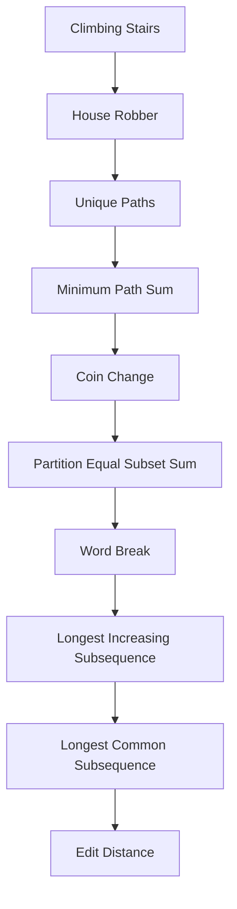

Suggested progression:

| Level       | Problems                                    |
| ----------- | ------------------------------------------- |
| Beginner    | Climbing Stairs, Min Cost Climbing Stairs   |
| Basic 1D    | House Robber, Decode Ways                   |
| Grid        | Unique Paths, Minimum Path Sum              |
| Knapsack    | Coin Change, Partition Equal Subset Sum     |
| Subsequence | LIS, LCS                                    |
| String DP   | Word Break, Edit Distance                   |
| Advanced    | Burst Balloons, Regular Expression Matching |

---

# 34. Final mental model

Think of DP as completing a school worksheet.

Without DP:

> Every time you need an earlier answer, you erase everything and solve it again.

With DP:

> You write each answer in a table and look it up later.

The core process is:

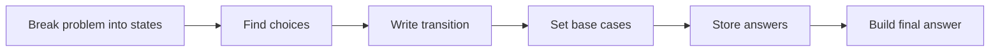

Remember this sentence:

> **DP is not mainly about arrays or tables. DP is about defining a state and connecting it to smaller states.**

And this formula:

```text
DP solution
=
State
+
Transition
+
Base case
+
Calculation order
```
