# Graphs — Explained Like You’re Five

Imagine a city.

* Houses are **nodes**
* Roads between houses are **edges**
* Some roads are one-way
* Some roads are two-way
* Some roads take longer than others
* You may want to find whether two houses are connected, the shortest route, or whether following roads eventually brings you back to the same place

That city map is a **graph**.

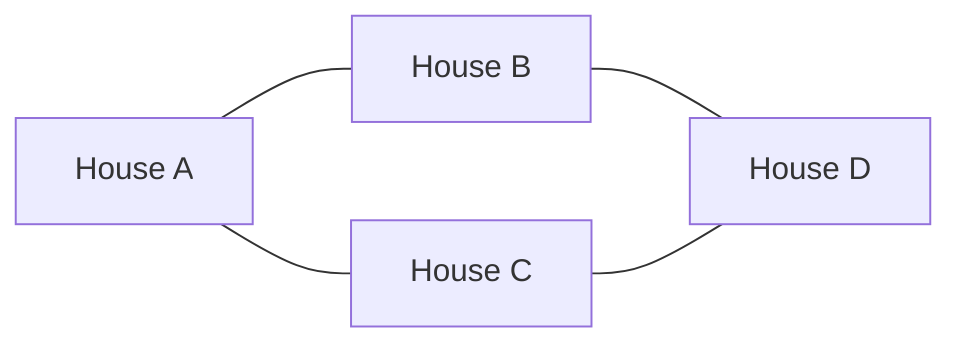

A graph is simply:

```text
Graph = Nodes + Connections
```

---

# 1. Why Do We Need Graphs?

Graphs represent relationships.

| Real-world system | Node     | Edge                    |
| ----------------- | -------- | ----------------------- |
| Facebook          | Person   | Friendship              |
| Google Maps       | Location | Road                    |
| Kubernetes        | Service  | Dependency              |
| Internet          | Router   | Network connection      |
| LinkedIn          | User     | Professional connection |
| Airline network   | Airport  | Flight                  |
| Build system      | Package  | Dependency              |
| Course planning   | Course   | Prerequisite            |
| Grid problems     | Cell     | Adjacent cell           |

A normal array represents items in a line.

```text
A → B → C → D
```

A tree represents a parent-child hierarchy.

```text
        A
       / \
      B   C
```

A graph can represent almost any relationship.

```text
A connects to B
A connects to C
B connects to D
C connects to D
D connects back to A
```

Graphs are needed when connections are not limited to a simple sequence or hierarchy.

---

# 2. Basic Graph Vocabulary

Consider:

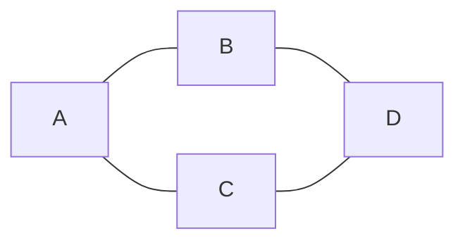

## Vertex or Node

An object in the graph.

```text
A, B, C, D
```

## Edge

A connection between two nodes.

```text
A — B
A — C
B — D
C — D
```

## Neighbor

A node directly connected to another node.

For node `A`:

```text
Neighbors of A = B, C
```

## Path

A sequence of connected nodes.

```text
A → B → D
```

## Cycle

A path that returns to the starting node.

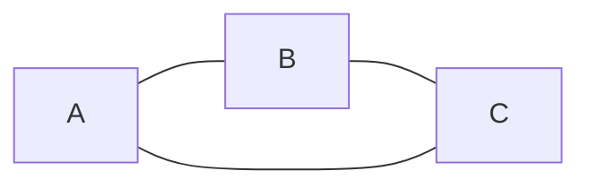

```text
A → B → C → A
```

## Connected Component

A group of nodes that can reach each other.

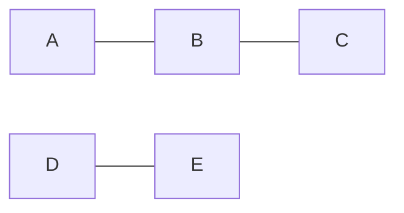

This graph has two connected components:

```text
Component 1: A, B, C
Component 2: D, E
```

---

# 3. Types of Graphs

## Undirected Graph

The connection works both ways.

```text
A — B

A can reach B
B can reach A
```

Examples:

* Friendship
* Two-way roads
* Computer network connections

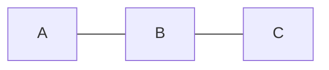

---

## Directed Graph

The connection has a direction.

```text
A → B

A can reach B
B may not reach A
```

Examples:

* Twitter follows
* Course prerequisites
* Service dependencies
* One-way roads

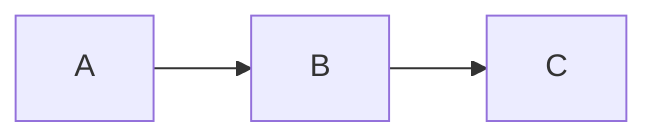

---

## Weighted Graph

Each edge has a cost.

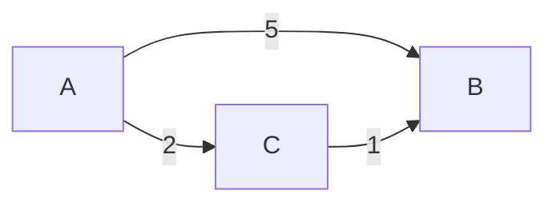

The cost could represent:

* Distance
* Time
* Money
* Network latency
* Risk

Here:

```text
A → B directly costs 5

A → C → B costs:
2 + 1 = 3
```

Therefore, going through `C` is cheaper.

---

## Unweighted Graph

Edges do not have meaningful costs.

Every edge is treated as having equal cost.

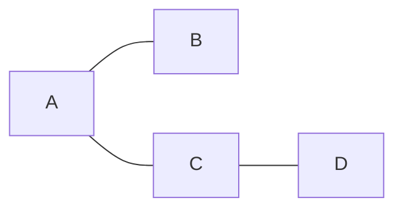

BFS finds the shortest path in an unweighted graph.

---

# 4. The Most Important Mental Model

When solving graph questions, think:

```text
1. What are the nodes?
2. What creates an edge?
3. Is the graph directed?
4. Is it weighted?
5. Can it contain cycles?
6. What exactly am I searching for?
```

For example, in **Number of Islands**:

```text
Node = one land cell
Edge = two land cells touching vertically or horizontally
Goal = count connected components
```

For **Course Schedule**:

```text
Node = course
Edge = prerequisite relationship
Goal = detect a cycle or produce dependency order
```

For **Network Delay Time**:

```text
Node = computer
Edge = network connection
Weight = transmission time
Goal = shortest weighted path from one node
```

---

# 5. Graph Representation

A graph usually arrives as an edge list, adjacency list, matrix, or grid.

---

## 5.1 Edge List

Store every connection.

```text
A — B
A — C
B — D
```

```go
edges := [][]int{
	{0, 1},
	{0, 2},
	{1, 3},
}
```

Useful when:

* Input naturally contains edges
* Using Union-Find
* Running algorithms over all edges

But finding every neighbor of a node is inefficient because you may need to scan all edges.

---

## 5.2 Adjacency List

For every node, store its neighbors.

```text
A: B, C
B: A, D
C: A
D: B
```

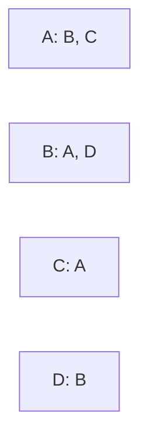

Go representation:

```go
graph := map[int][]int{
	0: {1, 2},
	1: {0, 3},
	2: {0},
	3: {1},
}
```

More commonly, when nodes are numbered `0` to `n-1`:

```go
graph := make([][]int, n)

for _, edge := range edges {
	u := edge[0]
	v := edge[1]

	graph[u] = append(graph[u], v)
	graph[v] = append(graph[v], u)
}
```

For a directed graph:

```go
graph[u] = append(graph[u], v)
```

Do not add the reverse edge unless the graph is undirected.

### Complexity

For:

* `V` vertices
* `E` edges

Adjacency-list memory:

```text
O(V + E)
```

It is the default representation for most interview problems.

---

## 5.3 Adjacency Matrix

Use a two-dimensional table.

```text
     A B C D
A    0 1 1 0
B    1 0 0 1
C    1 0 0 0
D    0 1 0 0
```

```go
matrix := [][]int{
	{0, 1, 1, 0},
	{1, 0, 0, 1},
	{1, 0, 0, 0},
	{0, 1, 0, 0},
}
```

To check whether `A` connects directly to `C`:

```go
matrix[A][C]
```

Time:

```text
O(1)
```

But memory:

```text
O(V²)
```

This is wasteful when the graph has many nodes but few edges.

---

## Representation Comparison

| Representation   |     Memory |   Check direct edge | Visit neighbors |
| ---------------- | ---------: | ------------------: | --------------: |
| Edge list        |     `O(E)` |              `O(E)` |          `O(E)` |
| Adjacency list   | `O(V + E)` | Usually `O(degree)` |     `O(degree)` |
| Adjacency matrix |    `O(V²)` |              `O(1)` |          `O(V)` |

For most coding interviews:

```text
Default choice = adjacency list
```

---

# 6. Graph Traversal

Graph traversal means visiting nodes systematically.

The two fundamental algorithms are:

```text
BFS: explore level by level
DFS: explore one path deeply
```

Almost every graph algorithm builds on BFS or DFS.

---

# 7. BFS — Breadth-First Search

## Baby Mental Model

Imagine dropping a stone into water.

The ripples spread outward one level at a time.

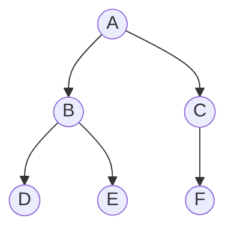

Starting from `A`, BFS visits:

```text
A
B, C
D, E, F
```

Order:

```text
A → B → C → D → E → F
```

BFS uses a **queue**.

```text
First in, first out
```

---

## BFS Process

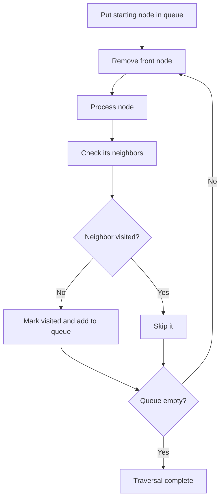

---

## BFS in Go

```go
func bfs(graph [][]int, start int) []int {
	visited := make([]bool, len(graph))
	queue := []int{start}
	order := make([]int, 0, len(graph))

	// Mark when inserting into the queue.
	visited[start] = true

	for len(queue) > 0 {
		node := queue[0]
		queue = queue[1:]

		order = append(order, node)

		for _, neighbor := range graph[node] {
			if visited[neighbor] {
				continue
			}

			visited[neighbor] = true
			queue = append(queue, neighbor)
		}
	}

	return order
}
```

## Why Mark Visited Before Enqueuing?

Suppose both `B` and `C` connect to `D`.

If `D` is marked only when removed from the queue:

```text
B adds D
C also adds D
```

Now `D` appears twice.

Correct pattern:

```go
visited[neighbor] = true
queue = append(queue, neighbor)
```

Mark it immediately when discovered.

---

## BFS Complexity

```text
Time:  O(V + E)
Space: O(V)
```

Why?

* Each node is visited once
* Each edge is inspected once or twice
* The queue and visited set may contain up to `V` nodes

---

## Why BFS Finds the Shortest Unweighted Path

BFS visits nodes by distance.

```text
Level 0: start
Level 1: one edge away
Level 2: two edges away
Level 3: three edges away
```

The first time BFS reaches a node, it has used the minimum number of edges.

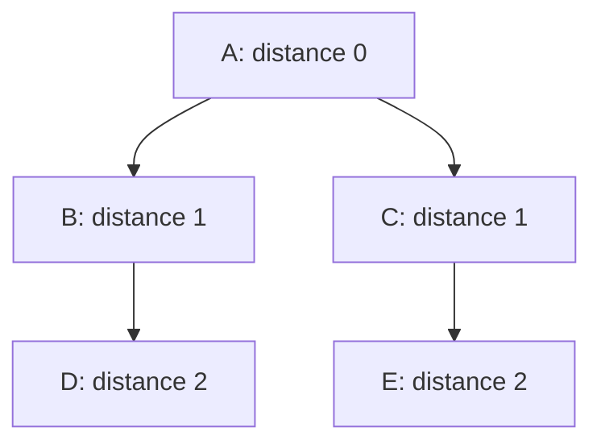

Distance implementation:

```go
func shortestDistances(graph [][]int, start int) []int {
	distance := make([]int, len(graph))
	for i := range distance {
		distance[i] = -1
	}

	queue := []int{start}
	distance[start] = 0

	for len(queue) > 0 {
		node := queue[0]
		queue = queue[1:]

		for _, neighbor := range graph[node] {
			if distance[neighbor] != -1 {
				continue
			}

			distance[neighbor] = distance[node] + 1
			queue = append(queue, neighbor)
		}
	}

	return distance
}
```

Use BFS for:

* Shortest path in an unweighted graph
* Level-by-level processing
* Minimum number of moves
* Grid spreading problems
* Multi-source expansion

Common BFS problems:

* Rotting Oranges
* Word Ladder
* Shortest Path in Binary Matrix
* Binary Tree Level Order Traversal
* Minimum Genetic Mutation

---

# 8. DFS — Depth-First Search

## Baby Mental Model

Imagine entering a maze.

At every junction:

1. Pick one path
2. Keep walking
3. Stop at a dead end
4. Walk backward
5. Try another path


Possible DFS order:

```text
A → B → D → E → C → F
```

DFS uses:

* Recursion and the call stack
* Or an explicit stack

---

## Recursive DFS in Go

```go
func dfs(
	node int,
	graph [][]int,
	visited []bool,
	order *[]int,
) {
	visited[node] = true
	*order = append(*order, node)

	for _, neighbor := range graph[node] {
		if visited[neighbor] {
			continue
		}

		dfs(neighbor, graph, visited, order)
	}
}
```

Calling it:

```go
visited := make([]bool, len(graph))
order := []int{}

dfs(0, graph, visited, &order)
```

---

## Iterative DFS

```go
func iterativeDFS(graph [][]int, start int) []int {
	visited := make([]bool, len(graph))
	stack := []int{start}
	order := []int{}

	for len(stack) > 0 {
		last := len(stack) - 1
		node := stack[last]
		stack = stack[:last]

		if visited[node] {
			continue
		}

		visited[node] = true
		order = append(order, node)

		for _, neighbor := range graph[node] {
			if !visited[neighbor] {
				stack = append(stack, neighbor)
			}
		}
	}

	return order
}
```

---

## DFS Complexity

```text
Time:  O(V + E)
Space: O(V)
```

The extra space comes from:

* Visited array
* Recursive call stack or explicit stack

Use DFS for:

* Connected components
* Cycle detection
* Exploring every path
* Backtracking
* Topological sort
* Grid flood fill
* Tree and graph recursion

---

# 9. BFS vs DFS

| Question                 | BFS                   | DFS                  |
| ------------------------ | --------------------- | -------------------- |
| Data structure           | Queue                 | Stack/recursion      |
| Exploration              | Level by level        | Deep path first      |
| Unweighted shortest path | Best choice           | Not guaranteed       |
| Connected components     | Yes                   | Yes                  |
| Cycle detection          | Yes                   | Yes                  |
| Topological sort         | Kahn’s algorithm      | Postorder DFS        |
| Memory                   | Can hold a wide level | Can hold a deep path |
| Maze existence           | Yes                   | Yes                  |
| Minimum maze steps       | Best choice           | Not guaranteed       |

Interview mental shortcut:

```text
Minimum number of steps → BFS
Explore or count a region → DFS/BFS
All paths or backtracking → DFS
Dependencies → Topological sort
```

---

# 10. Why Do We Need `visited`?

Consider a cycle:


Without `visited`:

```text
A → B → C → A → B → C → A ...
```

The traversal never stops.

A visited set means:

```text
I have already processed this node.
Do not process it again.
```

Common forms:

```go
visited := make([]bool, n)
```

Or when nodes are strings:

```go
visited := make(map[string]bool)
```

---

# 11. Connected Components

A connected component is one isolated group inside a graph.

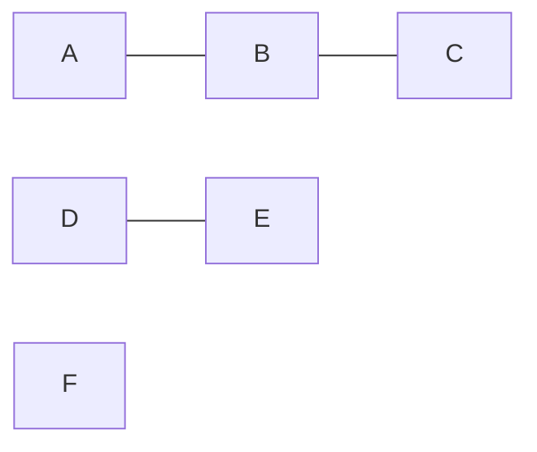

Components:

```text
1. A, B, C
2. D, E
3. F
```

## Algorithm

For every node:

```text
If it has not been visited:
    Start DFS/BFS
    Mark its entire group
    Increase component count
```

```go
func countComponents(graph [][]int) int {
	visited := make([]bool, len(graph))
	components := 0

	var dfs func(int)
	dfs = func(node int) {
		visited[node] = true

		for _, neighbor := range graph[node] {
			if !visited[neighbor] {
				dfs(neighbor)
			}
		}
	}

	for node := range graph {
		if visited[node] {
			continue
		}

		components++
		dfs(node)
	}

	return components
}
```

This pattern solves:

* Number of Islands
* Number of Provinces
* Connected Components in an Undirected Graph
* Accounts Merge
* Similar String Groups

---

# 12. Grid Problems Are Graph Problems

Consider:

```text
1 1 0
1 0 0
0 0 1
```

Every land cell is a node.

Two land cells have an edge when they touch.

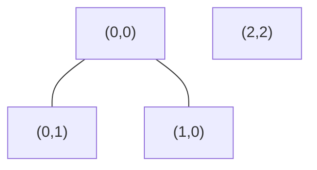

There are two connected components, so there are two islands.

## Direction Array

```go
directions := [][]int{
	{-1, 0}, // up
	{1, 0},  // down
	{0, -1}, // left
	{0, 1},  // right
}
```

## Grid Boundary Check

```go
newRow >= 0 &&
newRow < rows &&
newCol >= 0 &&
newCol < cols
```

---

## Number of Islands

```go
func numIslands(grid [][]byte) int {
	rows := len(grid)
	if rows == 0 {
		return 0
	}

	cols := len(grid[0])
	islands := 0

	var dfs func(int, int)
	dfs = func(row, col int) {
		if row < 0 || row >= rows ||
			col < 0 || col >= cols ||
			grid[row][col] != '1' {
			return
		}

		// Modify the grid to mark the cell visited.
		grid[row][col] = '0'

		dfs(row-1, col)
		dfs(row+1, col)
		dfs(row, col-1)
		dfs(row, col+1)
	}

	for row := 0; row < rows; row++ {
		for col := 0; col < cols; col++ {
			if grid[row][col] == '1' {
				islands++
				dfs(row, col)
			}
		}
	}

	return islands
}
```

Mental model:

```text
Find unvisited land
Flood-fill the complete island
Increase island count
```

Complexity:

```text
Time:  O(rows × columns)
Space: O(rows × columns) worst case
```

---

# 13. Cycle Detection

Cycle detection differs between undirected and directed graphs.

---

## 13.1 Cycle in an Undirected Graph


During DFS, seeing a visited neighbor does not automatically mean there is a cycle.

Why?

Because the neighbor may simply be the node we came from.

```text
A → B

While processing B, we see A.
That is the parent edge, not a cycle.
```

We therefore track the parent.

```go
func hasUndirectedCycle(graph [][]int) bool {
	visited := make([]bool, len(graph))

	var dfs func(node, parent int) bool
	dfs = func(node, parent int) bool {
		visited[node] = true

		for _, neighbor := range graph[node] {
			if !visited[neighbor] {
				if dfs(neighbor, node) {
					return true
				}
				continue
			}

			if neighbor != parent {
				return true
			}
		}

		return false
	}

	for node := range graph {
		if !visited[node] && dfs(node, -1) {
			return true
		}
	}

	return false
}
```

---

## 13.2 Cycle in a Directed Graph

Consider:

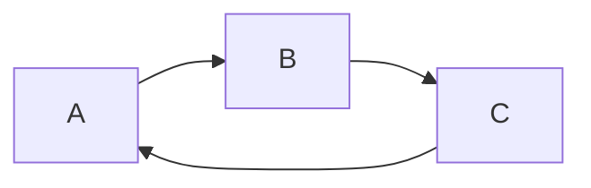

A simple visited array is insufficient.

We need three states:

```text
0 = unvisited
1 = currently being visited
2 = completely processed
```

If DFS reaches a node in state `1`, it has returned to something on its current path.

That means a cycle exists.

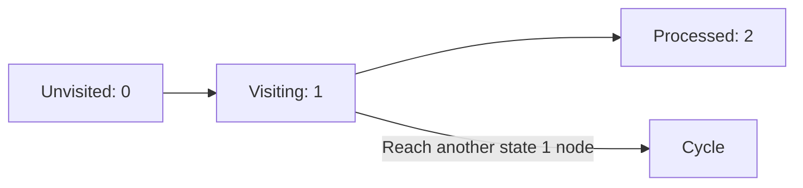

```go
func hasDirectedCycle(graph [][]int) bool {
	state := make([]int, len(graph))

	var dfs func(int) bool
	dfs = func(node int) bool {
		if state[node] == 1 {
			return true
		}

		if state[node] == 2 {
			return false
		}

		state[node] = 1

		for _, neighbor := range graph[node] {
			if dfs(neighbor) {
				return true
			}
		}

		state[node] = 2
		return false
	}

	for node := range graph {
		if state[node] == 0 && dfs(node) {
			return true
		}
	}

	return false
}
```

---

# 14. Topological Sort

Topological sort produces an order in which dependencies can be completed.

Example:

```text
Learn variables before learning functions.
Learn functions before learning recursion.
```

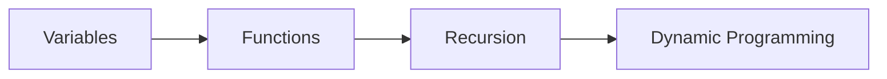

A valid topological order:

```text
Variables → Functions → Recursion → Dynamic Programming
```

Topological sorting works only for a:

```text
Directed Acyclic Graph
DAG
```

---

## Kahn’s Algorithm

Kahn’s algorithm uses:

* Indegree
* Queue
* BFS

### Indegree

Indegree means how many dependencies point into a node.

```mermaid
graph LR
    A --> C
    B --> C
```

```text
Indegree of C = 2
```

A node with indegree `0` has no unfinished prerequisites.

---

## Kahn’s Algorithm Process

```mermaid
flowchart TD
    A[Calculate indegree] --> B[Put all indegree-0 nodes in queue]
    B --> C[Remove one node]
    C --> D[Add it to result]
    D --> E[Decrease neighbor indegrees]
    E --> F{Neighbor indegree becomes 0?}
    F -- Yes --> G[Add neighbor to queue]
    F -- No --> H[Continue]
    G --> I{Queue empty?}
    H --> I
    I -- No --> C
    I -- Yes --> J{Processed all nodes?}
    J -- Yes --> K[Valid topological order]
    J -- No --> L[Cycle exists]
```

---

## Course Schedule in Go

```go
func canFinish(numCourses int, prerequisites [][]int) bool {
	graph := make([][]int, numCourses)
	indegree := make([]int, numCourses)

	for _, prerequisite := range prerequisites {
		course := prerequisite[0]
		requiredCourse := prerequisite[1]

		graph[requiredCourse] = append(
			graph[requiredCourse],
			course,
		)
		indegree[course]++
	}

	queue := make([]int, 0)

	for course := 0; course < numCourses; course++ {
		if indegree[course] == 0 {
			queue = append(queue, course)
		}
	}

	completed := 0

	for len(queue) > 0 {
		course := queue[0]
		queue = queue[1:]
		completed++

		for _, nextCourse := range graph[course] {
			indegree[nextCourse]--

			if indegree[nextCourse] == 0 {
				queue = append(queue, nextCourse)
			}
		}
	}

	return completed == numCourses
}
```

The final check is critical:

```go
completed == numCourses
```

If some courses were never processed, they are trapped in a cycle.

Complexity:

```text
Time:  O(V + E)
Space: O(V + E)
```

---

# 15. Union-Find / Disjoint Set Union

Union-Find answers questions such as:

```text
Are these two nodes in the same group?
What happens when I connect these groups?
Does adding this edge create a cycle?
```

## Baby Mental Model

Imagine children forming teams.

Initially:

```text
A is alone
B is alone
C is alone
D is alone
```

Then:

```text
Union(A, B)
Union(C, D)
Union(B, C)
```

Now everyone is in one team.

```mermaid
graph TD
    A --> B
    A --> C
    C --> D
```

Union-Find has two main operations.

## Find

Find the leader of a group.

```text
Find(D) → A
```

## Union

Merge two groups.

```text
Union(A, C)
```

---

## Union-Find Implementation

```go
type UnionFind struct {
	parent []int
	rank   []int
}

func NewUnionFind(size int) *UnionFind {
	parent := make([]int, size)
	rank := make([]int, size)

	for i := range parent {
		parent[i] = i
	}

	return &UnionFind{
		parent: parent,
		rank:   rank,
	}
}

func (uf *UnionFind) Find(node int) int {
	if uf.parent[node] != node {
		uf.parent[node] = uf.Find(uf.parent[node])
	}

	return uf.parent[node]
}

func (uf *UnionFind) Union(a, b int) bool {
	rootA := uf.Find(a)
	rootB := uf.Find(b)

	if rootA == rootB {
		return false
	}

	if uf.rank[rootA] < uf.rank[rootB] {
		uf.parent[rootA] = rootB
	} else if uf.rank[rootA] > uf.rank[rootB] {
		uf.parent[rootB] = rootA
	} else {
		uf.parent[rootB] = rootA
		uf.rank[rootA]++
	}

	return true
}
```

## Path Compression

Before:

```text
D → C → B → A
```

After finding `D`:

```text
D → A
C → A
B → A
```

This makes future operations much faster.

## Union by Rank

Attach the shorter tree under the taller tree.

This prevents long chains.

## Complexity

Union-Find operations are almost constant time:

```text
O(α(n))
```

`α(n)` grows so slowly that it is effectively constant for interview purposes.

Use Union-Find for:

* Redundant Connection
* Number of Connected Components
* Accounts Merge
* Kruskal’s Minimum Spanning Tree
* Dynamic connectivity

---

# 16. Redundant Connection

Suppose edges are added one at a time.

```text
1 — 2
2 — 3
3 — 1
```

Before adding `3 — 1`, nodes `3` and `1` are already connected.

Adding the edge creates a cycle.

```go
func findRedundantConnection(edges [][]int) []int {
	uf := NewUnionFind(len(edges) + 1)

	for _, edge := range edges {
		if !uf.Union(edge[0], edge[1]) {
			return edge
		}
	}

	return nil
}
```

Mental model:

```text
If both endpoints already have the same leader,
the new edge is redundant.
```

---

# 17. Dijkstra’s Algorithm

Dijkstra finds the shortest path when:

```text
The graph has non-negative edge weights.
```

Example:

```mermaid
graph LR
    A -- 10 --> B
    A -- 2 --> C
    C -- 3 --> B
    B -- 1 --> D
    C -- 10 --> D
```

Possible routes from `A` to `D`:

```text
A → B → D = 10 + 1 = 11

A → C → D = 2 + 10 = 12

A → C → B → D = 2 + 3 + 1 = 6
```

Shortest distance:

```text
6
```

---

## Dijkstra Mental Model

Imagine spreading outward from the source, but not by number of edges.

Spread by the cheapest total cost discovered so far.

```text
Always process the currently cheapest node.
```

That requires a **min heap**.

---

## Relaxation

Suppose:

```text
Current distance to A = 4
Edge A → B costs 3
Current distance to B = 10
```

A new route to `B` costs:

```text
4 + 3 = 7
```

Since `7 < 10`, update `B`.

```text
distance[B] = 7
```

This is called **relaxing an edge**.

---

## Dijkstra Process

```mermaid
flowchart TD
    A[Set source distance to 0] --> B[Put source in min heap]
    B --> C[Remove cheapest node]
    C --> D{Is heap entry stale?}
    D -- Yes --> E[Skip it]
    D -- No --> F[Inspect outgoing edges]
    F --> G[Calculate new distance]
    G --> H{New distance smaller?}
    H -- Yes --> I[Update distance and push into heap]
    H -- No --> J[Ignore]
    I --> K{Heap empty?}
    J --> K
    E --> K
    K -- No --> C
    K -- Yes --> L[Shortest distances complete]
```

---

## Dijkstra Complexity

With an adjacency list and min heap:

```text
Time:  O((V + E) log V)
Space: O(V + E)
```

Often simplified to:

```text
O(E log V)
```

Use Dijkstra for:

* Network Delay Time
* Cheapest weighted route
* Minimum effort or cost
* Pathfinding with non-negative weights

Do not use ordinary Dijkstra when negative edge weights exist.

---

# 18. BFS vs Dijkstra

Consider two paths:

```text
A → B: weight 100
A → C → B: weights 1 + 1
```

BFS sees:

```text
A → B uses one edge
```

So BFS may choose it.

But the cost is `100`.

Dijkstra sees:

```text
A → C → B costs 2
```

| Graph                       | Correct algorithm                             |
| --------------------------- | --------------------------------------------- |
| Every edge has equal cost   | BFS                                           |
| Non-negative weighted edges | Dijkstra                                      |
| Negative weights            | Bellman-Ford or another appropriate algorithm |
| DAG with weights            | Topological-order shortest path can work      |

---

# 19. Multi-Source BFS

Sometimes spreading begins from several nodes simultaneously.

Example: multiple rotten oranges.

```text
2 1 1
1 1 0
0 1 2
```

Both rotten oranges start spreading at minute `0`.

```mermaid
flowchart LR
    R1[Rotten source 1] --> F1[Fresh neighbors]
    R2[Rotten source 2] --> F2[Fresh neighbors]
    F1 --> N[Next minute]
    F2 --> N
```

Put every starting source in the queue before BFS begins.

```go
queue := make([]Position, 0)

for row := 0; row < rows; row++ {
	for col := 0; col < cols; col++ {
		if grid[row][col] == 2 {
			queue = append(queue, Position{row, col})
		}
	}
}
```

This creates one combined wave.

Use multi-source BFS for:

* Rotting Oranges
* Walls and Gates
* Distance to nearest zero
* Spread of infection
* Nearest facility problems

---

# 20. Clone Graph

The challenge is that the graph may contain:

* Cycles
* Shared neighbors
* Multiple incoming edges

You cannot recursively create a new copy every time you encounter a node. That would duplicate nodes or loop forever.

Use a map:

```text
original node → cloned node
```

```go
type Node struct {
	Val       int
	Neighbors []*Node
}

func cloneGraph(node *Node) *Node {
	if node == nil {
		return nil
	}

	clones := make(map[*Node]*Node)

	var clone func(*Node) *Node
	clone = func(current *Node) *Node {
		if existing, ok := clones[current]; ok {
			return existing
		}

		copyNode := &Node{Val: current.Val}
		clones[current] = copyNode

		for _, neighbor := range current.Neighbors {
			copyNode.Neighbors = append(
				copyNode.Neighbors,
				clone(neighbor),
			)
		}

		return copyNode
	}

	return clone(node)
}
```

Important order:

```text
1. Create clone
2. Store clone in map
3. Recursively clone neighbors
```

Store it before recursion so cycles are handled safely.

---

# 21. Pacific Atlantic Water Flow

This problem looks like water flows from each cell toward two oceans.

A slow approach would start DFS from every cell.

A better approach reverses the thinking:

```text
Instead of asking:
Can this cell flow to the ocean?

Ask:
Which cells can the ocean reach if movement is reversed?
```

Run DFS/BFS:

* From all Pacific border cells
* From all Atlantic border cells

Then find the intersection.

```mermaid
flowchart TD
    P[Pacific border traversal] --> PS[Pacific reachable set]
    A[Atlantic border traversal] --> AS[Atlantic reachable set]
    PS --> I[Intersection]
    AS --> I
    I --> R[Cells reaching both oceans]
```

This is a common interview technique:

```text
Reverse the direction of the search.
```

---

# 22. Evaluate Division

Input:

```text
a / b = 2
b / c = 3
```

Represent it as a weighted directed graph:

```text
a → b has weight 2
b → a has weight 1/2

b → c has weight 3
c → b has weight 1/3
```

To calculate `a / c`:

```text
a → b → c
2 × 3 = 6
```

```mermaid
graph LR
    A[a] -- 2 --> B[b]
    B -- 0.5 --> A
    B -- 3 --> C[c]
    C -- 0.333 --> B
```

This problem teaches an important lesson:

```text
A graph edge can represent more than distance.
It can represent a mathematical relationship.
```

---

# 23. Common Graph Problem Patterns

| Problem wording                          | Likely pattern                   |
| ---------------------------------------- | -------------------------------- |
| Count groups, regions, networks          | Connected components             |
| Minimum steps, moves, transformations    | BFS                              |
| Spread every minute                      | Multi-source BFS                 |
| Dependencies or prerequisites            | Topological sort                 |
| Can all tasks finish?                    | Directed cycle detection         |
| Extra edge creates cycle                 | Union-Find                       |
| Cheapest weighted route                  | Dijkstra                         |
| Copy nodes and relationships             | DFS/BFS + map                    |
| Explore every connected cell             | Grid DFS/BFS                     |
| Reachable from two boundaries            | Reverse traversal + intersection |
| Calculate relationship through equations | Weighted graph DFS               |

---

# 24. Graph Algorithm Decision Tree

```mermaid
flowchart TD
    A[Graph problem] --> B{Grid or explicit nodes?}

    B -->|Grid| C[Treat each cell as a node]
    B -->|Explicit nodes| D[Build adjacency list]

    C --> E{What is required?}
    D --> E

    E -->|Count groups| F[DFS, BFS, or Union-Find]
    E -->|Minimum unweighted steps| G[BFS]
    E -->|Explore paths or regions| H[DFS or BFS]
    E -->|Dependencies| I[Topological sort]
    E -->|Cycle in undirected graph| J[DFS with parent or Union-Find]
    E -->|Cycle in directed graph| K[DFS states or Kahn's algorithm]
    E -->|Weighted shortest path| L[Dijkstra]
    E -->|Multiple starting points| M[Multi-source BFS]
```

---

# 25. Complexity Cheat Sheet

Let:

```text
V = number of vertices
E = number of edges
```

| Algorithm                  |               Time | Extra space |
| -------------------------- | -----------------: | ----------: |
| BFS                        |         `O(V + E)` |      `O(V)` |
| DFS                        |         `O(V + E)` |      `O(V)` |
| Connected components       |         `O(V + E)` |      `O(V)` |
| Directed cycle detection   |         `O(V + E)` |      `O(V)` |
| Topological sort           |         `O(V + E)` |      `O(V)` |
| Union-Find operations      | Nearly `O(1)` each |      `O(V)` |
| Dijkstra with heap         | `O((V + E) log V)` |  `O(V + E)` |
| Adjacency matrix traversal |      Often `O(V²)` |     `O(V²)` |

For an undirected adjacency list, each edge appears twice:

```text
u → v
v → u
```

But the total traversal complexity remains:

```text
O(V + E)
```

Constant factors are ignored.

---

# 26. Common Interview Mistakes

## Mistake 1: Forgetting Disconnected Nodes

Starting DFS only from node `0` does not visit isolated components.

Wrong:

```go
dfs(0)
```

Correct:

```go
for node := range graph {
	if !visited[node] {
		dfs(node)
	}
}
```

---

## Mistake 2: Adding Reverse Edges to a Directed Graph

For prerequisite:

```text
A must happen before B
```

Correct:

```go
graph[A] = append(graph[A], B)
```

Do not automatically add:

```go
graph[B] = append(graph[B], A)
```

---

## Mistake 3: Using BFS for Weighted Shortest Paths

BFS minimizes edge count, not total cost.

Use Dijkstra for non-negative weighted graphs.

---

## Mistake 4: Marking Visited Too Late in BFS

Mark nodes when they enter the queue, not when they leave it.

---

## Mistake 5: Forgetting the Parent in Undirected Cycle Detection

Returning to the immediate parent is normal.

It is not a cycle.

---

## Mistake 6: Using Only Boolean Visited for Directed Cycles

Directed cycle detection needs to distinguish:

```text
Currently on my path
Already completely processed
```

Use three states or separate `visited` and `pathVisited` arrays.

---

## Mistake 7: Forgetting Stale Dijkstra Heap Entries

A node may enter the heap multiple times with different distances.

When removing an entry:

```go
if heapDistance > distance[node] {
	continue
}
```

---

## Mistake 8: Mutating Input Without Mentioning It

For grid problems, changing land from `1` to `0` is convenient.

But tell the interviewer:

```text
“I’m modifying the input to use it as the visited structure.”
```

Use a separate visited matrix if input mutation is forbidden.

---

# 27. Common Problems and What They Test

## 1. Number of Islands

Tests:

* Grid as a graph
* Connected components
* DFS/BFS
* Boundary checking

Core sentence:

```text
Each unvisited land cell starts a new connected component.
```

---

## 2. Clone Graph

Tests:

* Graph traversal
* Cycle handling
* Mapping original nodes to cloned nodes

Core sentence:

```text
The map acts as both the visited structure and clone lookup.
```

---

## 3. Course Schedule

Tests:

* Directed graph
* Cycle detection
* Topological sort
* Indegree

Core sentence:

```text
All courses can finish only if the dependency graph has no cycle.
```

---

## 4. Pacific Atlantic Water Flow

Tests:

* Grid traversal
* Reverse thinking
* Multiple source cells
* Set intersection

Core sentence:

```text
Search backwards from both oceans and intersect the reachable cells.
```

---

## 5. Rotting Oranges

Tests:

* Multi-source BFS
* Level processing
* Time or distance calculation

Core sentence:

```text
All initially rotten oranges enter the queue at minute zero.
```

---

## 6. Network Delay Time

Tests:

* Weighted directed graph
* Dijkstra
* Min heap
* Shortest distances

Core sentence:

```text
Find the shortest signal time to every node, then take the maximum.
```

---

## 7. Redundant Connection

Tests:

* Union-Find
* Undirected cycle detection
* Incremental connectivity

Core sentence:

```text
An edge is redundant when both endpoints are already in the same set.
```

---

## 8. Evaluate Division

Tests:

* Weighted graph modeling
* DFS/BFS
* Multiplying edge values along a path

Core sentence:

```text
Equations become weighted directed edges and division becomes path multiplication.
```

---

# 28. Interview Explanation Template

Before coding, explain your approach like this:

```text
I will model each item as a node and each relationship as an edge.

Because the graph is [directed/undirected] and
[weighted/unweighted], I will use [algorithm].

I will store the graph as an adjacency list because it requires
O(V + E) space and allows efficient neighbor traversal.

I will maintain a visited structure to avoid cycles and duplicate work.

The time complexity is O(V + E), because each node and edge is
processed a constant number of times.
```

For a grid:

```text
I will treat every valid grid cell as a node.

Two cells have an edge when they are adjacent in the four allowed
directions.

Each DFS marks one complete connected region, so every unvisited
land cell starts a new island.
```

---

# 29. Mock Interview Questions

## Question 1: Why is BFS suitable for shortest path in an unweighted graph?

**Answer:**

BFS explores nodes by increasing number of edges from the source. It processes all nodes at distance `k` before any node at distance `k + 1`. Therefore, the first time it reaches a node, it has found the path using the minimum number of edges.

---

## Question 2: Why does DFS need a visited set?

**Answer:**

A graph can contain cycles and multiple paths to the same node. Without a visited set, DFS can recurse forever around a cycle or repeatedly process the same node.

---

## Question 3: What is the difference between tree DFS and graph DFS?

**Answer:**

A tree normally has no cycles and every child has one parent, so traversal often does not require a visited set. A graph can contain cycles and multiple paths to a node, so graph DFS usually requires visited tracking.

---

## Question 4: How do you detect a cycle in a directed graph?

**Answer:**

Use three states: unvisited, visiting, and processed. During DFS, reaching a visiting node means we have found a back edge to something on the current recursion path, so a cycle exists.

---

## Question 5: How do you detect a cycle in an undirected graph?

**Answer:**

During DFS, track the parent node. If we encounter a visited neighbor that is not the parent, there is a cycle. Alternatively, process edges using Union-Find and detect when both endpoints already belong to the same set.

---

## Question 6: What is topological sorting?

**Answer:**

Topological sorting is a linear ordering of nodes in a directed acyclic graph where every dependency appears before the node that depends on it. It is commonly used for course prerequisites, build systems, and task scheduling.

---

## Question 7: How can topological sort detect a cycle?

**Answer:**

In Kahn’s algorithm, we repeatedly process nodes with indegree zero. If fewer than `V` nodes are processed, the remaining nodes depend on each other in a cycle.

---

## Question 8: When would you use Union-Find instead of DFS?

**Answer:**

Union-Find is useful when edges are added incrementally and we repeatedly need to test whether two nodes are already connected. DFS is usually simpler when the complete graph already exists and we need to traverse its structure.

---

## Question 9: Why can’t BFS replace Dijkstra?

**Answer:**

BFS minimizes the number of edges. Dijkstra minimizes total edge weight. They produce the same result only when every edge has the same weight.

---

## Question 10: Can Dijkstra handle negative weights?

**Answer:**

No. Dijkstra assumes that once the shortest unprocessed node is selected, its distance cannot later improve. A negative edge can violate that assumption.

---

## Question 11: What is a disconnected graph?

**Answer:**

A disconnected graph contains more than one connected component. Starting traversal from one node will not visit nodes in other components, so we must loop through every node and start a new traversal when necessary.

---

## Question 12: Why is adjacency list usually preferred?

**Answer:**

Most interview graphs are sparse. An adjacency list uses `O(V + E)` memory, while an adjacency matrix uses `O(V²)` memory. It also lets us iterate directly over a node’s actual neighbors.

---

# 30. Coding Pattern Templates

## DFS Template

```go
var dfs func(int)

dfs = func(node int) {
	visited[node] = true

	for _, neighbor := range graph[node] {
		if !visited[neighbor] {
			dfs(neighbor)
		}
	}
}
```

---

## BFS Template

```go
queue := []int{start}
visited[start] = true

for len(queue) > 0 {
	node := queue[0]
	queue = queue[1:]

	for _, neighbor := range graph[node] {
		if !visited[neighbor] {
			visited[neighbor] = true
			queue = append(queue, neighbor)
		}
	}
}
```

---

## Connected Components Template

```go
components := 0

for node := range graph {
	if !visited[node] {
		components++
		dfs(node)
	}
}
```

---

## Grid DFS Template

```go
var dfs func(int, int)

dfs = func(row, col int) {
	if row < 0 || row >= rows ||
		col < 0 || col >= cols ||
		visited[row][col] {
		return
	}

	visited[row][col] = true

	for _, direction := range directions {
		dfs(
			row+direction[0],
			col+direction[1],
		)
	}
}
```

---

## Topological Sort Template

```go
for node := 0; node < n; node++ {
	if indegree[node] == 0 {
		queue = append(queue, node)
	}
}

for len(queue) > 0 {
	node := queue[0]
	queue = queue[1:]
	order = append(order, node)

	for _, neighbor := range graph[node] {
		indegree[neighbor]--

		if indegree[neighbor] == 0 {
			queue = append(queue, neighbor)
		}
	}
}
```

---

# 31. Senior-Level Interview Considerations

At a senior level, interviewers may expect more than working code.

Discuss these decisions:

## Graph Size

```text
How many nodes and edges can exist?
```

An adjacency matrix may be impossible for millions of nodes.

## Recursion Depth

A recursive DFS over a deeply connected graph can overflow the stack.

Use iterative DFS when depth may be very large.

## Input Mutation

Clarify whether changing the input grid is allowed.

## Deterministic Output

Adjacency-map iteration may produce different traversal orders. Sort neighbors when stable output is required.

## Concurrency

Parallel graph traversal is possible, but synchronization and duplicate discovery can make it more complex. A basic interview solution should usually remain sequential unless concurrency is explicitly requested.

## Distributed Graphs

At large scale, a graph may not fit on one machine. Systems may partition nodes and edges, maintain distributed frontiers, and accept eventual consistency or approximate answers.

## Memory Trade-offs

For large sparse graphs:

```text
Adjacency list
Compressed sparse row
Edge streaming
Partitioned storage
```

may be preferable to ordinary nested structures.

---

# 32. Recommended Practice Order

Study these problems in this sequence:

| Order | Problem                         | Main concept              |
| ----: | ------------------------------- | ------------------------- |
|     1 | Find if Path Exists in Graph    | Basic BFS/DFS             |
|     2 | Number of Islands               | Grid connected components |
|     3 | Max Area of Island              | DFS aggregation           |
|     4 | Number of Provinces             | Connected components      |
|     5 | Clone Graph                     | DFS + mapping             |
|     6 | Rotting Oranges                 | Multi-source BFS          |
|     7 | Course Schedule                 | Topological sort          |
|     8 | Course Schedule II              | Produce dependency order  |
|     9 | Redundant Connection            | Union-Find                |
|    10 | Pacific Atlantic Water Flow     | Reverse traversal         |
|    11 | Evaluate Division               | Weighted DFS              |
|    12 | Network Delay Time              | Dijkstra                  |
|    13 | Word Ladder                     | Implicit graph + BFS      |
|    14 | Cheapest Flights Within K Stops | Constrained shortest path |

---

# Final Mental Model

```mermaid
mindmap
  root((Graph))
    Nodes
      People
      Computers
      Courses
      Grid cells
    Edges
      Relationships
      Roads
      Dependencies
      Adjacent cells
    Traversal
      BFS
        Queue
        Level by level
        Unweighted shortest path
      DFS
        Stack
        Deep exploration
        Components and cycles
    Dependencies
      Topological sort
      Directed cycle detection
    Connectivity
      DFS
      BFS
      Union-Find
    Weighted paths
      Dijkstra
      Min heap
      Relaxation
```

Remember these six lines:

```text
Graph = nodes connected by edges.

BFS = explore level by level.

DFS = explore one path deeply.

Topological sort = dependency order.

Union-Find = quickly manage connected groups.

Dijkstra = shortest path with non-negative weights.
```

For interviews, begin every problem by asking:

```text
What are the nodes?
What are the edges?
Directed or undirected?
Weighted or unweighted?
What exactly must be calculated?
```

Those questions usually reveal the algorithm.
