# Hash Map and Hash Set — Explained Simply

## 1. The simplest definition

A **Hash Map** stores a relationship:

```text
key → value
```

Examples:

```text
"name" → "Abhishek"
"userID" → 4821
"apple" → 5
```

A **Hash Set** only remembers whether something exists:

```text
"apple" exists
"banana" exists
"orange" does not exist
```

The main benefit is fast lookup:

```text
Average lookup: O(1)
```

---

# 2. Baby mental model

## Hash Map: labelled drawers

Imagine a cabinet with labelled drawers:

```text
"apple"  → drawer containing 5
"banana" → drawer containing 3
"orange" → drawer containing 7
```

When someone asks:

> How many apples do we have?

You do not search every drawer.

You directly open the drawer labelled `"apple"`.

That is the mental model for a hash map.

---

## Hash Set: a guest list

Imagine a party guest list:

```text
Abhishek
John
Sarah
```

When someone arrives, you only ask:

> Is this name already on the list?

You do not need additional information about that person.

That is a hash set.

```text
Hash Map: name → information
Hash Set: name exists or does not exist
```

---

# 3. Why do we need them?

Suppose you have an array:

```text
[8, 3, 11, 20, 7, 15, 2]
```

You want to know whether `15` exists.

With an unsorted array, you may need to inspect every element:

```text
8 → no
3 → no
11 → no
20 → no
7 → no
15 → yes
```

Worst-case complexity:

```text
O(n)
```

With a hash set:

```text
set[15]
```

Average complexity:

```text
O(1)
```

## Comparison

| Operation               | Array/List |  Hash Map/Set |
| ----------------------- | ---------: | ------------: |
| Find an arbitrary value |       O(n) |  Average O(1) |
| Insert                  | Often O(1) |  Average O(1) |
| Delete by value         |       O(n) |  Average O(1) |
| Preserve order          |        Yes |    Usually no |
| Access by position      |       O(1) | Not supported |

Hash maps trade additional memory for faster lookup.

---

# 4. How does a Hash Map work?

A hash map does not literally create a drawer named `"apple"`.

Internally, it normally has an array of buckets.

A **hash function** converts a key into a number.

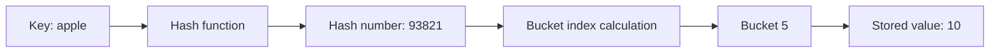

A simplified bucket calculation is:

```text
bucketIndex = hash(key) % numberOfBuckets
```

For example:

```text
hash("apple") = 93821
numberOfBuckets = 8

bucketIndex = 93821 % 8
            = 5
```

Therefore:

```text
"apple" → bucket 5
```

These hash numbers are only examples. Real hash functions use more sophisticated calculations.

---

## Complete lookup process

Suppose we run:

```go
value := inventory["apple"]
```

Conceptually, the hash map does this:

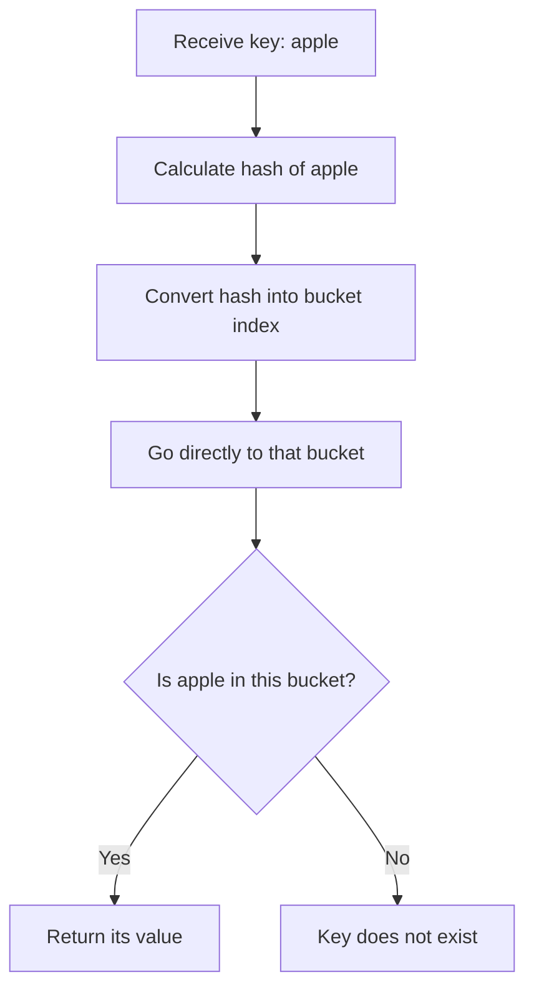

This direct bucket access is why lookup is usually close to `O(1)`.

---

# 5. What is a collision?

Different keys can produce the same bucket index.

For example:

```text
hash("apple") % 8 = 5
hash("grape") % 8 = 5
```

Both keys want bucket `5`.

This is called a **hash collision**.

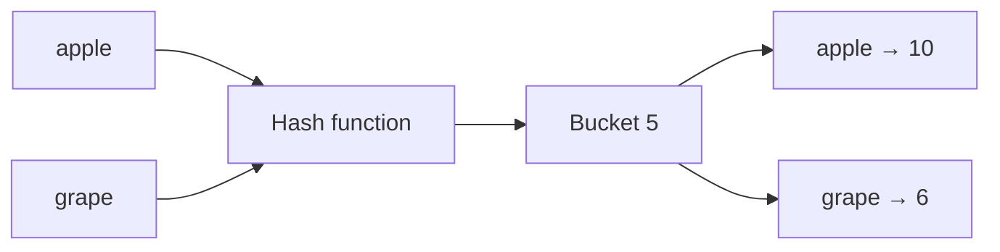

The hash map must keep both keys and compare them when searching the bucket.

Common collision-handling strategies include:

1. **Separate chaining**: Store multiple entries inside the same bucket.
2. **Open addressing**: Find another available bucket.

The exact implementation depends on the language and runtime.

---

## Why can the worst case become O(n)?

Imagine every key lands in the same bucket:

```text
Bucket 5:
apple
banana
orange
grape
mango
watermelon
```

Now finding `"watermelon"` may require scanning every entry in that bucket.

```text
Worst case: O(n)
```

Therefore:

```text
Average lookup: O(1)
Worst-case lookup: O(n)
```

A good hash function and appropriate resizing make the worst case uncommon.

---

# 6. Load factor

The **load factor** measures how full the hash table is.

```text
loadFactor = numberOfStoredEntries / numberOfBuckets
```

Example:

```text
Stored entries = 6
Buckets = 8

Load factor = 6 / 8
            = 0.75
```

As the table becomes crowded:

* Collisions become more frequent.
* Lookup becomes slower.
* The hash map may allocate more buckets and redistribute entries.

This redistribution is called **rehashing** or **resizing**.

A single resize can be expensive, but over many insertions, insertion is generally considered amortized `O(1)`.

---

# 7. Hash Map vs Hash Set

| Feature        | Hash Map                          | Hash Set                        |
| -------------- | --------------------------------- | ------------------------------- |
| Stores         | Key and value                     | Unique values only              |
| Example        | `"apple" → 5`                     | `"apple"`                       |
| Main question  | “What value belongs to this key?” | “Does this value exist?”        |
| Duplicate keys | No                                | No duplicate elements           |
| Common use     | Counting, mapping, caching        | Membership, duplicate detection |

Conceptually, a hash set can be implemented using a hash map:

```text
"apple" → nothing
"banana" → nothing
```

In Go, it is commonly represented as:

```go
set := make(map[int]struct{})
```

`struct{}` occupies no storage for fields.

---

# 8. Hash Map and Hash Set in Go

## Create a Hash Map

```go
ages := make(map[string]int)

ages["Alice"] = 30
ages["Bob"] = 35
```

Or:

```go
ages := map[string]int{
    "Alice": 30,
    "Bob":   35,
}
```

---

## Read a value

```go
age := ages["Alice"]
fmt.Println(age)
```

---

## Check whether a key exists

This is important because a missing key returns the value type’s zero value.

```go
age, exists := ages["Alice"]

if exists {
    fmt.Println("Age:", age)
}
```

For example, both of these can produce `0`:

```text
"John" exists and has value 0
"Sarah" does not exist
```

Use the second return value to distinguish them:

```go
value, exists := numbers["Sarah"]
```

---

## Delete an entry

```go
delete(ages, "Alice")
```

---

## Iterate through a map

```go
for name, age := range ages {
    fmt.Println(name, age)
}
```

Do not depend on Go map iteration order.

---

## Create a Hash Set

```go
seen := make(map[int]struct{})

seen[10] = struct{}{}
seen[20] = struct{}{}
```

Check membership:

```go
_, exists := seen[10]
```

A slightly simpler alternative is:

```go
seen := make(map[int]bool)
```

But `map[int]struct{}` more clearly communicates that only membership matters.

---

# 9. Complexity

Let `n` be the number of elements.

| Operation                     | Average |        Worst case |
| ----------------------------- | ------: | ----------------: |
| Insert                        |    O(1) |              O(n) |
| Lookup                        |    O(1) |              O(n) |
| Delete                        |    O(1) |              O(n) |
| Iterate over all entries      |    O(n) |              O(n) |
| Build a map from `n` elements |    O(n) | Potentially O(n²) |
| Memory                        |    O(n) |              O(n) |

## Important string-key nuance

Hashing an integer can generally be treated as constant time.

Hashing a string requires reading its characters.

For a string of length `k`:

```text
Hashing cost may be O(k)
```

In interviews, map operations are often described as `O(1)` when keys are fixed-size integers or the key size is treated as bounded.

---

# 10. The interview decision tree

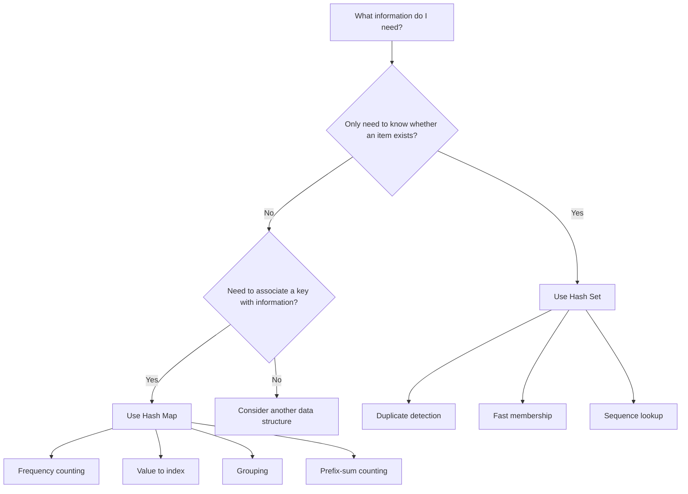

## Recognition rules

When the problem says:

> Have I seen this before?

Think:

```text
Hash Set
```

When it says:

> How many times have I seen this?

Think:

```text
Hash Map: item → count
```

When it says:

> Where did I see this?

Think:

```text
Hash Map: item → index
```

When it says:

> Which items belong together?

Think:

```text
Hash Map: signature → group
```

When it says:

> Find a contiguous subarray with a certain sum.

Think:

```text
Prefix sum + Hash Map
```

---

# 11. Core interview patterns

## Pattern 1: Membership

Question:

> Does this item exist?

```go
set := make(map[int]struct{})

set[10] = struct{}{}

_, exists := set[10]
```

Used in:

* Contains Duplicate
* Intersection of Two Arrays
* Happy Number
* Longest Consecutive Sequence

---

## Pattern 2: Frequency counting

Question:

> How many times does each item appear?

```go
frequency := make(map[int]int)

for _, number := range numbers {
    frequency[number]++
}
```

Example:

```text
Input: [4, 2, 4, 1, 2, 4]

Map:
4 → 3
2 → 2
1 → 1
```

Used in:

* Valid Anagram
* First Unique Character
* Top K Frequent Elements
* Majority Element

---

## Pattern 3: Value to index

Question:

> At which position did this value appear?

```go
indexByValue := make(map[int]int)

for index, value := range numbers {
    indexByValue[value] = index
}
```

Used in:

* Two Sum
* Nearby Duplicate
* Index-based pairing problems

---

## Pattern 4: Grouping by a signature

Question:

> Which items have the same defining property?

```text
signature → list of items
```

For anagrams:

```text
character frequency → words
```

Used in:

* Group Anagrams
* Grouping equivalent strings
* Categorization problems

---

## Pattern 5: Prefix sum to frequency

Question:

> How many contiguous subarrays have a given sum?

```text
prefixSum → how many times it has appeared
```

Used in:

* Subarray Sum Equals K
* Binary Subarrays With Sum
* Contiguous Array

---

## Pattern 6: Set plus sequence starting point

Question:

> What is the longest consecutive sequence?

Store every number in a set.

Only begin counting when the previous number does not exist.

```text
n is a sequence start when n - 1 is absent
```

---

# 12. Problem 1: Contains Duplicate

## Problem

Given an integer array, return `true` when any value appears at least twice.

```text
Input:  [1, 2, 3, 1]
Output: true
```

## Brute force

Compare every element with every other element:

```text
O(n²)
```

## Hash Set solution

As you scan the array:

1. Check whether the number is already in the set.
2. If yes, you found a duplicate.
3. Otherwise, add it.

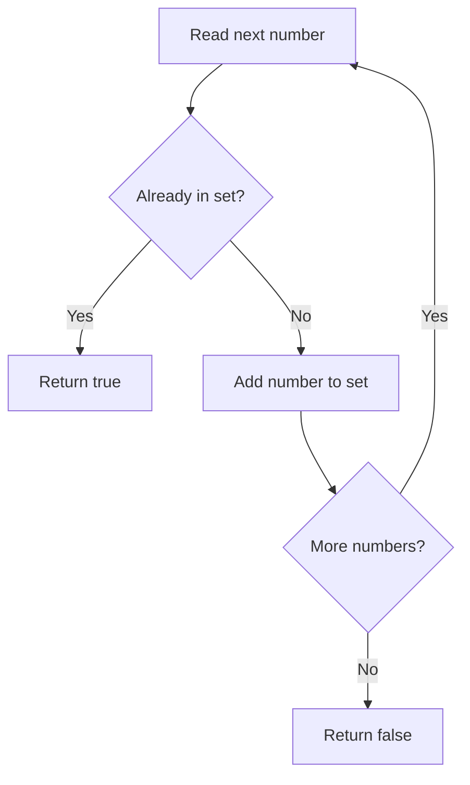

## Go solution

```go
func containsDuplicate(nums []int) bool {
    seen := make(map[int]struct{}, len(nums))

    for _, number := range nums {
        if _, exists := seen[number]; exists {
            return true
        }

        seen[number] = struct{}{}
    }

    return false
}
```

## Complexity

```text
Time:  O(n) average
Space: O(n)
```

## Mental model

> Before putting an item into the box, check whether the box already contains it.

---

# 13. Problem 2: Two Sum

## Problem

Return the indices of two numbers whose sum equals the target.

```text
Input:  nums = [2, 7, 11, 15], target = 9
Output: [0, 1]
```

Because:

```text
2 + 7 = 9
```

---

## Brute force

Try every pair:

```text
2 + 7
2 + 11
2 + 15
7 + 11
...
```

Complexity:

```text
O(n²)
```

---

## Hash Map insight

For every number:

```text
needed = target - currentNumber
```

When current number is `7`:

```text
needed = 9 - 7
       = 2
```

Ask:

> Have I previously seen `2`?

Store:

```text
number → index
```

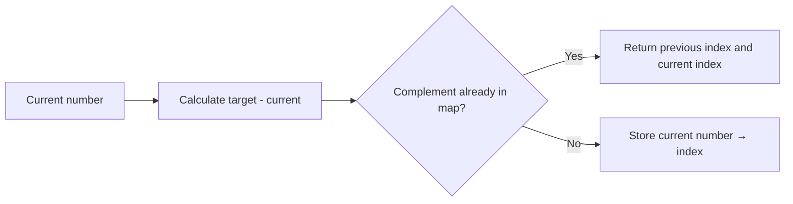

## Walkthrough

```text
nums = [2, 7, 11, 15]
target = 9
```

| Current | Needed | Map before checking | Result          |
| ------: | -----: | ------------------- | --------------- |
|       2 |      7 | `{}`                | Store `2 → 0`   |
|       7 |      2 | `{2: 0}`            | Found index `0` |

---

## Go solution

```go
func twoSum(nums []int, target int) []int {
    indexByValue := make(map[int]int, len(nums))

    for index, number := range nums {
        complement := target - number

        if previousIndex, exists := indexByValue[complement]; exists {
            return []int{previousIndex, index}
        }

        indexByValue[number] = index
    }

    return nil
}
```

## Why check before inserting?

Consider:

```text
nums = [3, 2]
target = 6
```

If you insert `3` before checking, the algorithm might incorrectly use the same `3` twice.

Correct sequence:

```text
Check complement first
Then insert current number
```

## Complexity

```text
Time:  O(n) average
Space: O(n)
```

## Mental model

> I have one puzzle piece. Which other piece do I need, and have I seen it already?

---

# 14. Problem 3: Group Anagrams

## Problem

Group words containing the same characters.

```text
Input:
["eat", "tea", "tan", "ate", "nat", "bat"]

Output:
[
  ["eat", "tea", "ate"],
  ["tan", "nat"],
  ["bat"]
]
```

Anagrams have identical character frequencies:

```text
eat:
a → 1
e → 1
t → 1

tea:
a → 1
e → 1
t → 1
```

---

## Hash Map structure

```text
character-count signature → words
```

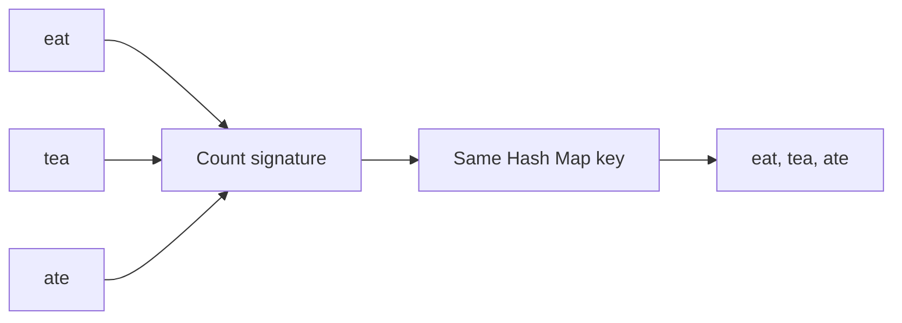

For lowercase English letters, create an array of 26 counts.

```text
[a-count, b-count, c-count, ..., z-count]
```

Arrays are comparable in Go, so `[26]int` can be used as a map key.

---

## Go solution

```go
func groupAnagrams(words []string) [][]string {
    groups := make(map[[26]int][]string)

    for _, word := range words {
        var signature [26]int

        for _, character := range word {
            signature[character-'a']++
        }

        groups[signature] = append(groups[signature], word)
    }

    result := make([][]string, 0, len(groups))

    for _, group := range groups {
        result = append(result, group)
    }

    return result
}
```

## Complexity

Let:

* `n` = number of words
* `k` = average word length

```text
Time:  O(n × k)
Space: O(n × k)
```

An alternative is to sort every word:

```text
Time: O(n × k log k)
```

Frequency counting avoids sorting.

## Mental model

> Give each word a fingerprint. Words with the same fingerprint belong in the same box.

---

# 15. Problem 4: Subarray Sum Equals K

This is one of the most important hash-map interview patterns.

## Problem

Count the number of contiguous subarrays whose sum equals `k`.

```text
Input: nums = [1, 1, 1], k = 2
Output: 2
```

The matching subarrays are:

```text
[1, 1] at indices 0–1
[1, 1] at indices 1–2
```

---

## Prefix sum

A prefix sum is the sum from the beginning up to the current position.

For:

```text
[1, 2, 3]
```

Prefix sums are:

```text
1
1 + 2 = 3
1 + 2 + 3 = 6
```

```text
[1, 3, 6]
```

---

## Important equation

Suppose:

```text
currentPrefix - previousPrefix = k
```

Rearrange:

```text
previousPrefix = currentPrefix - k
```

Therefore, at every position, ask:

> How many times have I previously seen `currentPrefix - k`?

Store:

```text
prefixSum → frequency
```

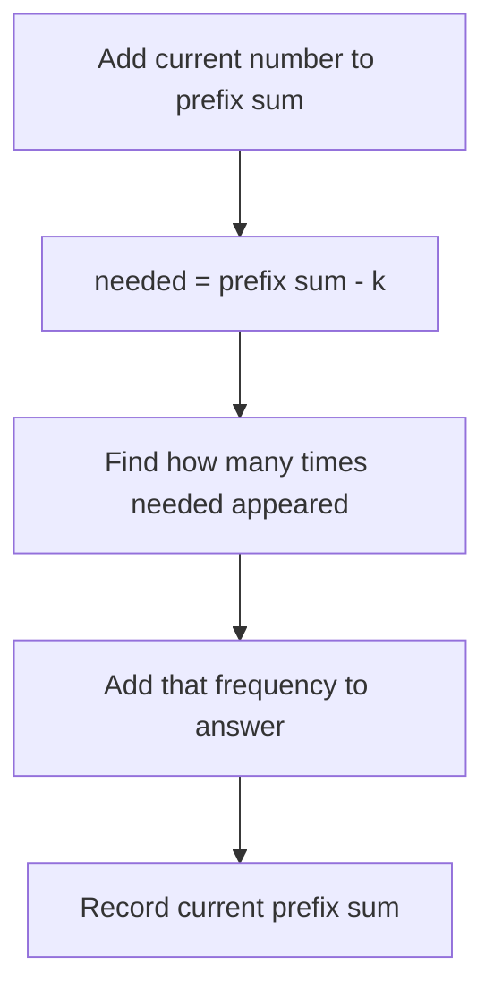

---

## Why initialize `0 → 1`?

Suppose:

```text
nums = [3]
k = 3
```

Current prefix sum:

```text
3
```

Needed previous prefix:

```text
3 - 3 = 0
```

The imaginary prefix before the array begins has sum `0`.

Therefore:

```go
prefixFrequency[0] = 1
```

Without this initialization, subarrays beginning at index `0` would be missed.

---

## Walkthrough

```text
nums = [1, 1, 1]
k = 2
```

Initial state:

```text
frequency = {0: 1}
prefix = 0
count = 0
```

| Number | Prefix | Needed `prefix-k` | Existing frequency | Count |
| -----: | -----: | ----------------: | -----------------: | ----: |
|      1 |      1 |                -1 |                  0 |     0 |
|      1 |      2 |                 0 |                  1 |     1 |
|      1 |      3 |                 1 |                  1 |     2 |

---

## Go solution

```go
func subarraySum(nums []int, target int) int {
    prefixFrequency := map[int]int{
        0: 1,
    }

    prefixSum := 0
    result := 0

    for _, number := range nums {
        prefixSum += number

        neededPrefix := prefixSum - target
        result += prefixFrequency[neededPrefix]

        prefixFrequency[prefixSum]++
    }

    return result
}
```

## Complexity

```text
Time:  O(n) average
Space: O(n)
```

## Mental model

> My current running total is too large by exactly `k`. Have I seen the smaller running total before?

---

# 16. Problem 5: Longest Consecutive Sequence

## Problem

Find the length of the longest consecutive sequence.

```text
Input:
[100, 4, 200, 1, 3, 2]

Output:
4
```

Because:

```text
1, 2, 3, 4
```

---

## Obvious solution: sort

```text
[1, 2, 3, 4, 100, 200]
```

Complexity:

```text
O(n log n)
```

But the interview usually asks for `O(n)`.

---

## Hash Set insight

Put every number into a set.

For each number, only start counting if:

```text
number - 1 does not exist
```

Why?

```text
1 has no 0 → sequence start
2 has 1 → not a start
3 has 2 → not a start
4 has 3 → not a start
```

This prevents recounting the same sequence repeatedly.

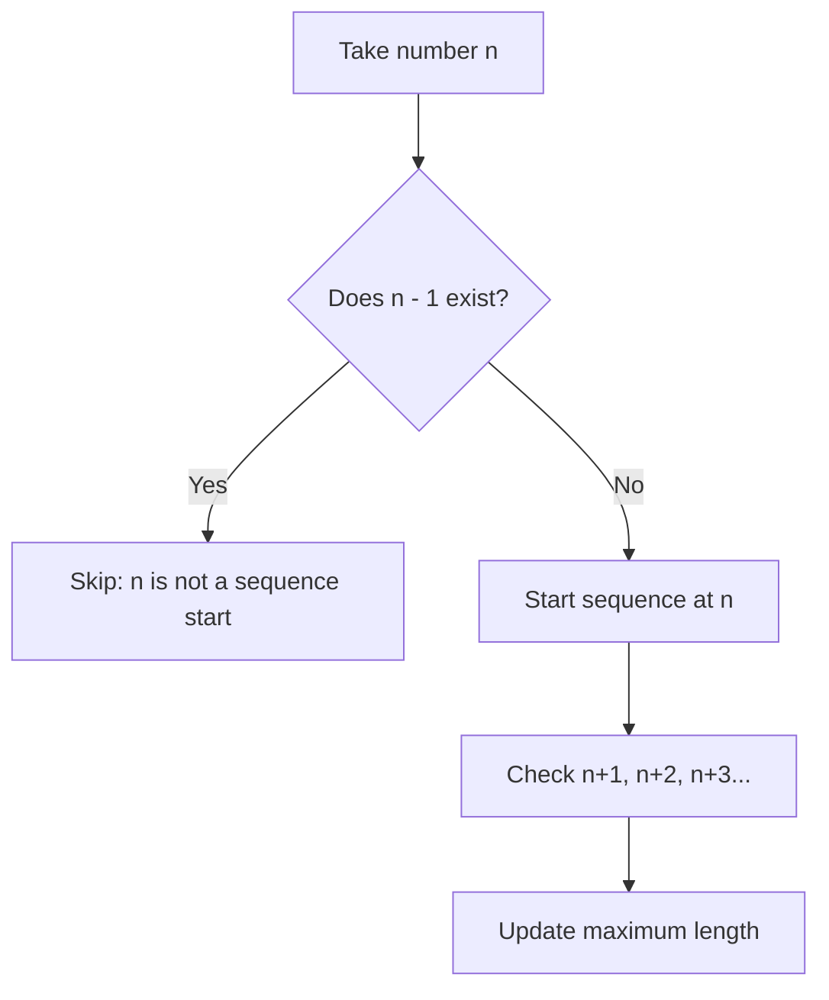

---

## Go solution

```go
func longestConsecutive(nums []int) int {
    numbers := make(map[int]struct{}, len(nums))

    for _, number := range nums {
        numbers[number] = struct{}{}
    }

    longest := 0

    for number := range numbers {
        _, hasPrevious := numbers[number-1]
        if hasPrevious {
            continue
        }

        current := number
        length := 1

        for {
            _, hasNext := numbers[current+1]
            if !hasNext {
                break
            }

            current++
            length++
        }

        if length > longest {
            longest = length
        }
    }

    return longest
}
```

## Why is this O(n) despite the inner loop?

At first, it appears to be:

```text
loop inside loop = O(n²)
```

But sequence traversal begins only from sequence starting points.

For:

```text
1, 2, 3, 4
```

The full sequence is traversed only from `1`.

It is not traversed again from `2`, `3`, or `4`.

Each number participates in a small constant number of operations.

Therefore:

```text
Time: O(n) average
```

## Complexity

```text
Time:  O(n) average
Space: O(n)
```

## Mental model

> Do not board a train from the middle. Find the first station and travel forward.

---

# 17. Problem 6: First Unique Character

## Problem

Return the index of the first character that appears exactly once.

```text
Input:  "leetcode"
Output: 0
```

`'l'` appears once.

```text
Input:  "loveleetcode"
Output: 2
```

`'v'` is the first unique character.

---

## Approach

Make two passes:

### Pass 1

Count every character.

```text
character → frequency
```

### Pass 2

Return the first character whose frequency is `1`.

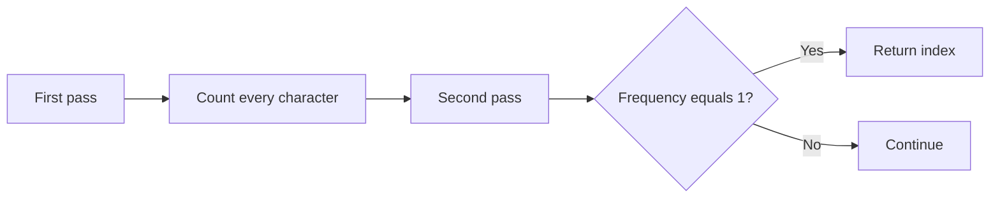

---

## Go solution

For lowercase ASCII input:

```go
func firstUniqueCharacter(text string) int {
    frequency := make(map[byte]int)

    for index := 0; index < len(text); index++ {
        frequency[text[index]]++
    }

    for index := 0; index < len(text); index++ {
        if frequency[text[index]] == 1 {
            return index
        }
    }

    return -1
}
```

## Complexity

```text
Time:  O(n)
Space: O(k)
```

Here, `k` is the number of distinct characters.

For lowercase English letters, `k ≤ 26`, so the extra space can be considered `O(1)`.

## Mental model

> First count everybody. Then walk through the original line and find the first person standing alone.

---

# 18. Common mistakes

## Mistake 1: Assuming map order

This is unsafe:

```go
for key := range myMap {
    // Do not expect a fixed order.
}
```

A hash map is generally not a sorted collection.

---

## Mistake 2: Ignoring missing-key behaviour

```go
count := frequency[key]
```

This returns `0` when:

* The key is missing.
* The key exists and its value is zero.

Use:

```go
value, exists := frequency[key]
```

when the distinction matters.

---

## Mistake 3: Inserting too early in Two Sum

Incorrect order:

```go
indexByValue[number] = index
// Then check complement
```

Correct order:

```go
// Check complement
// Then insert current number
```

---

## Mistake 4: Forgetting `0 → 1` in prefix-sum problems

```go
prefixFrequency := map[int]int{
    0: 1,
}
```

This handles subarrays beginning at index `0`.

---

## Mistake 5: Using a map when order is required

Use a different or additional data structure when the problem requires:

* Sorted keys
* Insertion order
* Minimum or maximum element
* Access by position

Possible alternatives include:

* Sorted array
* Balanced tree
* Heap
* Queue
* Linked list

---

## Mistake 6: Saying Hash Map is always O(1)

The accurate interview answer is:

> Lookup, insertion and deletion are average `O(1)`, but collisions can degrade them to `O(n)` in the worst case.

---

# 19. How to calculate complexity in Hash Map problems

## Example: Contains Duplicate

```go
for _, number := range nums {
    if _, exists := seen[number]; exists {
        return true
    }
    seen[number] = struct{}{}
}
```

There are `n` iterations.

Each map lookup and insertion is average `O(1)`:

```text
n × O(1) = O(n)
```

Space:

```text
At most n values in the set = O(n)
```

---

## Example: Two Sum

One loop over `n` numbers:

```text
O(n)
```

Each iteration performs:

* One subtraction: `O(1)`
* One map lookup: average `O(1)`
* One map insertion: average `O(1)`

Total:

```text
O(n)
```

---

## Example: Group Anagrams

Suppose there are `n` words and each word has length `k`.

Every character of every word is examined:

```text
n × k
```

Therefore:

```text
O(nk)
```

---

## Example: Longest Consecutive Sequence

Although there is an inner loop, each sequence is expanded only once from its starting point.

Therefore:

```text
O(n)
```

Do not mechanically conclude that every nested loop is `O(n²)`. Ask how many total times the inner operation executes across the whole algorithm.

---

# 20. Most common Hash Map and Hash Set interview questions

## Essential

| Problem                      | Primary pattern             |
| ---------------------------- | --------------------------- |
| Contains Duplicate           | Hash Set membership         |
| Two Sum                      | Value → index               |
| Valid Anagram                | Frequency counting          |
| Group Anagrams               | Signature → group           |
| First Unique Character       | Frequency counting          |
| Intersection of Two Arrays   | Hash Set membership         |
| Longest Consecutive Sequence | Set and sequence start      |
| Subarray Sum Equals K        | Prefix sum → frequency      |
| Isomorphic Strings           | Bidirectional mapping       |
| Happy Number                 | Cycle detection using a set |

## Frequently asked intermediate problems

| Problem                                        | Pattern                        |
| ---------------------------------------------- | ------------------------------ |
| Top K Frequent Elements                        | Frequency map + buckets/heap   |
| Longest Substring Without Repeating Characters | Sliding window + map/set       |
| Find All Anagrams in a String                  | Sliding window + frequency     |
| Contiguous Array                               | Prefix balance + first index   |
| Four Sum II                                    | Pair sum frequency             |
| Copy List With Random Pointer                  | Old node → new node            |
| LRU Cache                                      | Hash map + doubly linked list  |
| Design HashMap                                 | Hashing and collision handling |

---

# 21. Mock interview questions

## Conceptual questions

### 1. What is the difference between a Hash Map and a Hash Set?

A hash map stores key-value pairs:

```text
key → value
```

A hash set stores unique values and supports membership checking.

---

### 2. Why is lookup average O(1)?

The key is hashed into a bucket index, allowing the implementation to access the probable location directly instead of scanning every element.

---

### 3. Why is lookup worst-case O(n)?

Many keys may collide into the same bucket, requiring a scan through multiple entries.

---

### 4. What is a collision?

A collision occurs when different keys map to the same bucket or hash-table position.

---

### 5. What makes a good hash function?

A good hash function should:

* Be deterministic for a given execution and use case.
* Distribute keys relatively evenly.
* Be fast to calculate.
* Minimize harmful collision patterns.

---

### 6. What is load factor?

```text
number of entries / number of buckets
```

A high load factor generally increases collisions and may trigger resizing.

---

### 7. Can a Hash Map contain duplicate keys?

No. Assigning the same key again normally replaces its previous value.

```go
scores["Alice"] = 10
scores["Alice"] = 20
```

Final value:

```text
"Alice" → 20
```

---

### 8. Can a Hash Set contain duplicates?

No. Adding the same element multiple times still leaves one logical element.

---

### 9. How would you implement a set in Go?

```go
set := make(map[string]struct{})
```

---

### 10. When should you not use a Hash Map?

Avoid relying on a hash map alone when you need:

* Sorted order
* Stable iteration order
* Index-based access
* Efficient smallest/largest lookup
* Range queries

---

# 22. Coding mock questions

## Easy

1. Given an array, determine whether any value appears twice.
2. Determine whether two strings are anagrams.
3. Return the intersection of two arrays.
4. Find the first non-repeating character.
5. Determine whether a ransom note can be built from magazine letters.

## Medium

1. Return two indices whose values sum to a target.
2. Group anagrams.
3. Find the longest substring without repeated characters.
4. Count subarrays whose sum equals `k`.
5. Find the longest consecutive sequence.
6. Return the `k` most frequent elements.
7. Determine whether two strings are isomorphic.
8. Find all anagram starting positions in a string.

## Advanced

1. Design an LRU cache.
2. Design a custom Hash Map.
3. Find the longest substring containing at most `k` distinct characters.
4. Count four-number combinations producing zero.
5. Find subarrays whose sum is divisible by `k`.
6. Maintain frequencies while processing a data stream.

---

# 23. Interview answer template

When solving a hash-map problem, explain it in this order:

## Step 1: State the brute force

> The brute-force approach compares every pair, giving `O(n²)` time.

## Step 2: Identify repeated work

> We repeatedly search whether a value has already appeared.

## Step 3: Introduce the map or set

> I can store previously seen values in a hash map, making each lookup average `O(1)`.

## Step 4: Define what is stored

> The map stores each number as the key and its index as the value.

## Step 5: Explain the algorithm

> For every number, I calculate its complement, check whether the complement exists, and then store the current number.

## Step 6: Give complexity

> The algorithm performs one pass, so average time is `O(n)` and space is `O(n)`.

That explanation is often as important as the code.

---

# 24. Final mental model

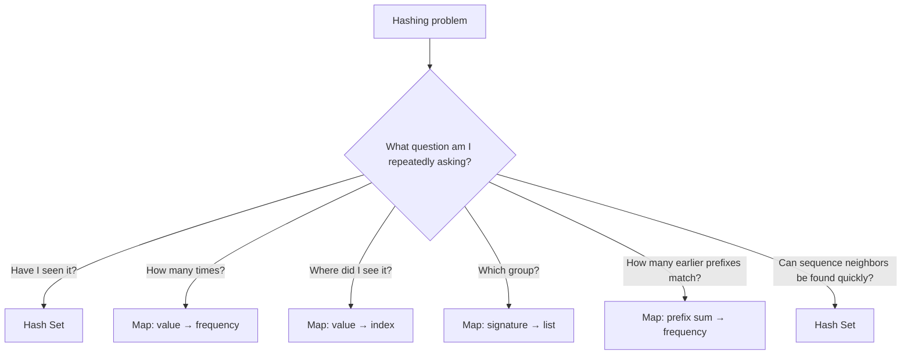

Memorize these six statements:

```text
Existence      → Hash Set
Frequency      → value → count
Location       → value → index
Pair finding   → complement → index
Grouping       → signature → list
Subarray count → prefix sum → frequency
```

And remember the central trade-off:

```text
Use extra memory to avoid repeated searching.
```

That is the core idea behind most Hash Map and Hash Set interview problems.
