# Heap / Priority Queue — Explained Like You Are Five

Imagine a hospital waiting room.

Patients do **not** always get treated in arrival order. A patient with a serious injury gets treated before someone with a small cut.

That is a **priority queue**:

> The most important item comes out first.

A **heap** is the data structure commonly used to build that priority queue.

---

# 1. Heap vs Priority Queue

These terms are related but not identical.

| Term           | Meaning                                                          |
| -------------- | ---------------------------------------------------------------- |
| Priority queue | The behaviour: insert items and remove the highest-priority item |
| Heap           | A data structure commonly used to implement a priority queue     |
| Min heap       | The smallest value has highest priority                          |
| Max heap       | The largest value has highest priority                           |

A priority queue might expose operations such as:

```text
push(item)
peek()
pop()
```

The heap is the internal machinery that makes these operations efficient.

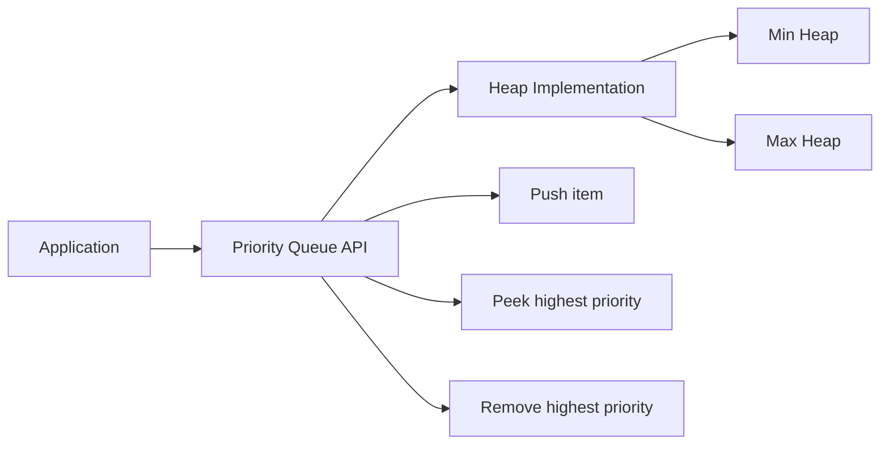

---

# 2. Why Do We Need a Heap?

Suppose you have these numbers:

```text
8, 2, 10, 4, 1, 7
```

You repeatedly need to ask:

```text
What is the smallest number right now?
```

You could use a normal array, but finding the smallest item would require scanning everything.

```text
Find minimum in array: O(n)
```

You could keep the array sorted, but inserting a new item might require shifting many elements.

```text
Insert into sorted array: O(n)
```

A heap gives a useful compromise:

```text
Peek minimum: O(1)
Insert:       O(log n)
Remove min:   O(log n)
```

A heap is useful when you repeatedly need the:

* Smallest item
* Largest item
* Next task to execute
* Next meeting to finish
* K largest or smallest items
* Next item among several sorted sources
* Current median of a stream

---

# 3. The Mental Model

Think of a heap as a company.

In a **min heap**, every manager must have a value smaller than or equal to their direct employees.

```text
Manager <= Children
```

In a **max heap**, every manager must have a value greater than or equal to their direct employees.

```text
Manager >= Children
```

The CEO is at the top.

Therefore:

* Min heap CEO = smallest value
* Max heap CEO = largest value

The entire company is not sorted. Only the manager-child relationship is maintained.

---

# 4. Min Heap

In a min heap, every parent is smaller than or equal to its children.

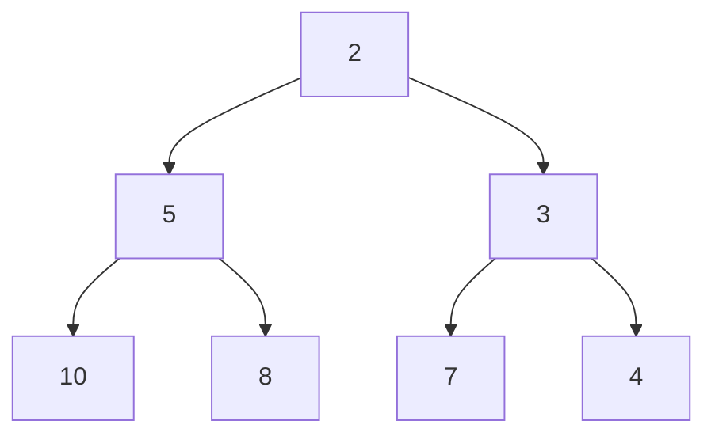

This is a valid min heap because:

```text
2 <= 5 and 3
5 <= 10 and 8
3 <= 7 and 4
```

The smallest item is always at the root:

```text
heap[0]
```

But the rest of the heap is not fully sorted.

For example:

```text
5 appears before 3
```

That is allowed because `5` and `3` are siblings. The heap only guarantees the relationship between parent and child.

---

# 5. Max Heap

In a max heap, every parent is larger than or equal to its children.

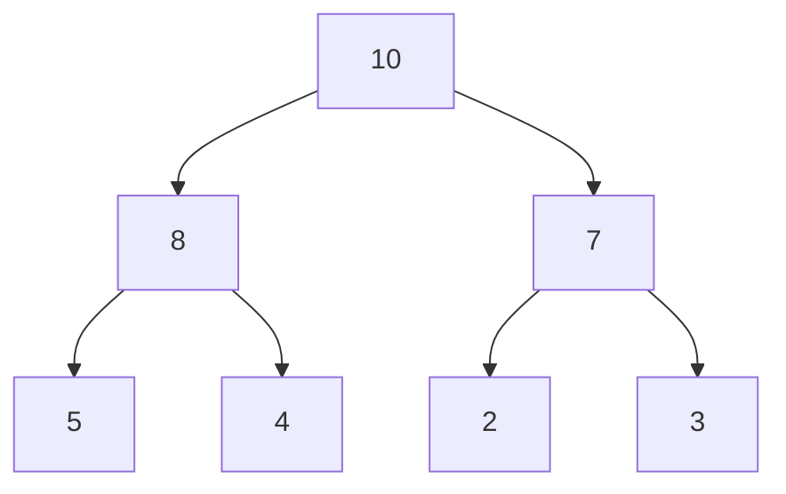

The largest value is always at the root.

```text
heap[0] = maximum
```

---

# 6. A Heap Is Usually Stored as an Array

Although we draw a heap as a tree, it is normally stored inside an array.

Consider this min heap:

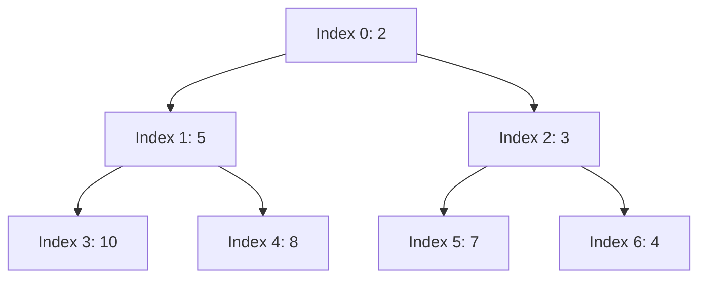

Its array representation is:

```text
Index:  0  1  2   3  4  5  6
Value: [2, 5, 3, 10, 8, 7, 4]
```

For an item at index `i`:

```text
Parent index = (i - 1) / 2
Left child   = 2*i + 1
Right child  = 2*i + 2
```

Integer division is used.

For index `2`:

```text
Parent = (2 - 1) / 2 = 0
Left   = 2*2 + 1 = 5
Right  = 2*2 + 2 = 6
```

Therefore:

```text
Value at index 2 = 3
Parent            = 2
Left child        = 7
Right child       = 4
```

No pointers are required.

---

# 7. Why Does the Array Representation Work?

A binary heap is a **complete binary tree**.

Complete means:

* Every level is completely filled, except possibly the last.
* The last level is filled from left to right.
* There are no random gaps.

Valid:

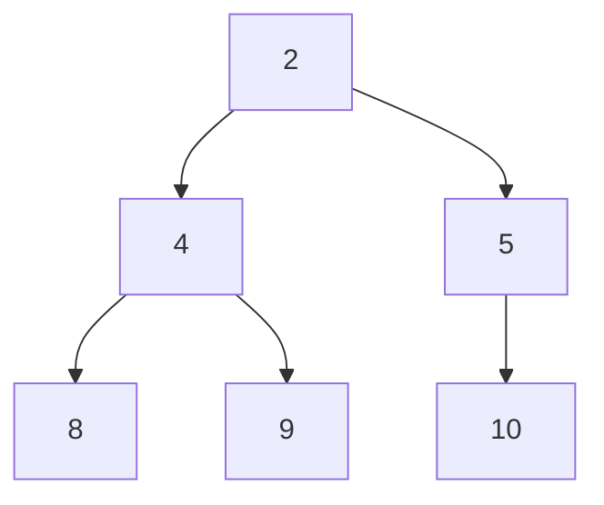

Invalid complete tree:

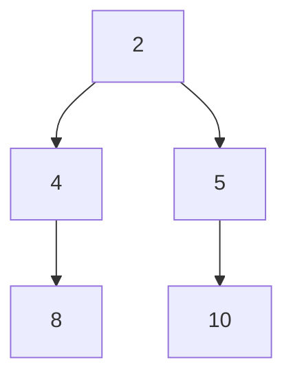

There is a missing position under `4`, even though a later position under `5` is occupied.

Because there are no gaps, the tree can be packed neatly into an array.

---

# 8. Heap Operations

The most important operations are:

| Operation | Description                  |
| --------- | ---------------------------- |
| Peek      | Read the root                |
| Push      | Insert a new item            |
| Pop       | Remove the root              |
| Heapify   | Convert an array into a heap |

---

# 9. Peek

For a min heap:

```text
heap[0] = smallest item
```

For a max heap:

```text
heap[0] = largest item
```

No searching is required.

```text
Time: O(1)
```

---

# 10. Inserting an Item: Bubble Up

Start with this min heap:

```text
[2, 5, 4, 10, 8, 7]
```

Insert `3`.

## Step 1: Add it to the end

```text
[2, 5, 4, 10, 8, 7, 3]
```

The tree remains complete, but the heap rule may be broken.

`3` has parent `4`.

```text
3 < 4
```

Swap them:

```text
[2, 5, 3, 10, 8, 7, 4]
```

Now `3` has parent `2`.

```text
3 >= 2
```

Stop.

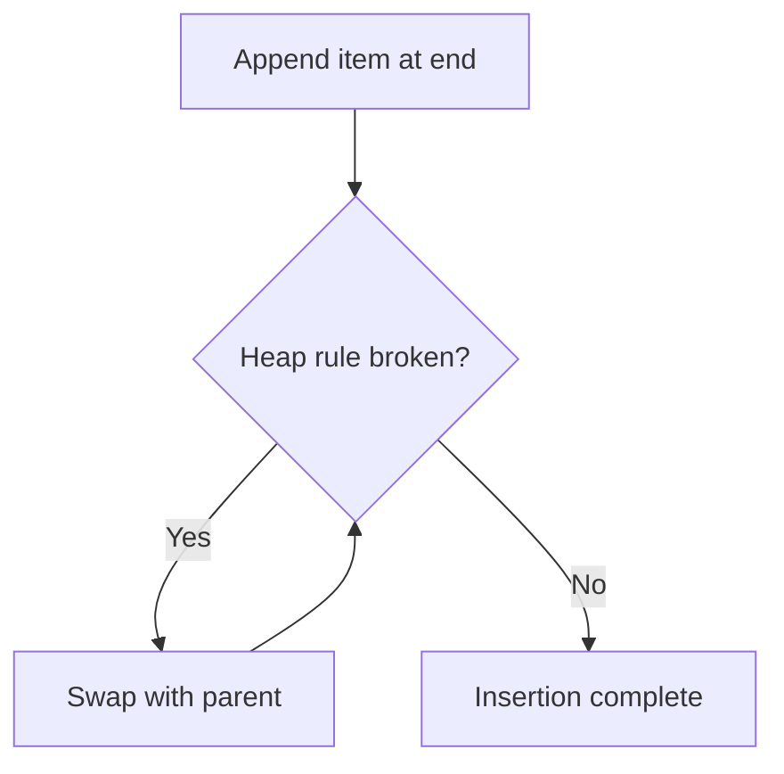

This process is called:

* Bubble up
* Sift up
* Swim
* Percolate up

All usually mean the same thing.

---

# 11. Removing the Root: Bubble Down

Start with:

```text
[2, 5, 3, 10, 8, 7, 4]
```

Remove the minimum value, `2`.

You cannot simply remove the first array element because that would leave a hole.

## Step 1: Move the last item to the root

```text
[4, 5, 3, 10, 8, 7]
```

Now the min-heap rule is broken:

```text
4 > 3
```

## Step 2: Swap with the smaller child

```text
[3, 5, 4, 10, 8, 7]
```

The heap is valid again.

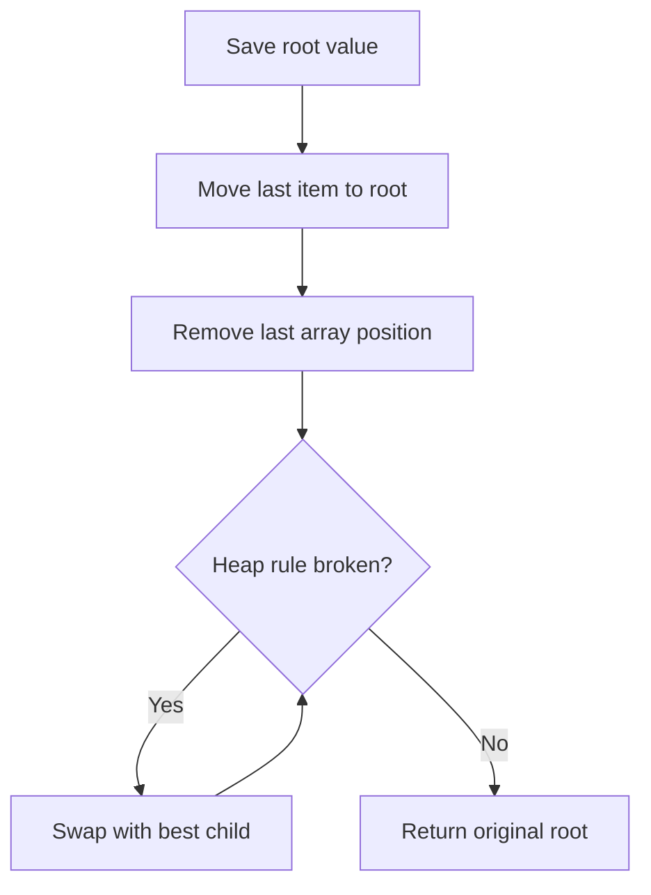

For a min heap, swap with the **smaller child**.

For a max heap, swap with the **larger child**.

This process is called:

* Bubble down
* Sift down
* Sink
* Heapify down

---

# 12. How Is Heap Complexity Calculated?

A binary heap is a complete binary tree.

At every level, the number of nodes approximately doubles.

```text
Level 0: 1 node
Level 1: 2 nodes
Level 2: 4 nodes
Level 3: 8 nodes
Level 4: 16 nodes
```

For a tree with height `h`:

```text
Number of nodes ≈ 2^h
```

Therefore:

```text
h ≈ log₂(n)
```

The heap's height is:

```text
O(log n)
```

During insertion, an item travels along at most one path from the bottom to the root.

```text
O(log n)
```

During removal, an item travels along at most one path from the root to the bottom.

```text
O(log n)
```

---

# 13. Heap Complexity Table

| Operation               |                         Time |
| ----------------------- | ---------------------------: |
| Peek minimum or maximum |                       `O(1)` |
| Insert                  |                   `O(log n)` |
| Remove root             |                   `O(log n)` |
| Replace root            |                   `O(log n)` |
| Search arbitrary value  |                       `O(n)` |
| Delete arbitrary value  | `O(log n)` after locating it |
| Build heap              |                       `O(n)` |
| Heap sort               |                 `O(n log n)` |

Space:

```text
O(n)
```

---

# 14. Why Is Searching a Heap O(n)?

A heap is not a sorted tree.

Consider:

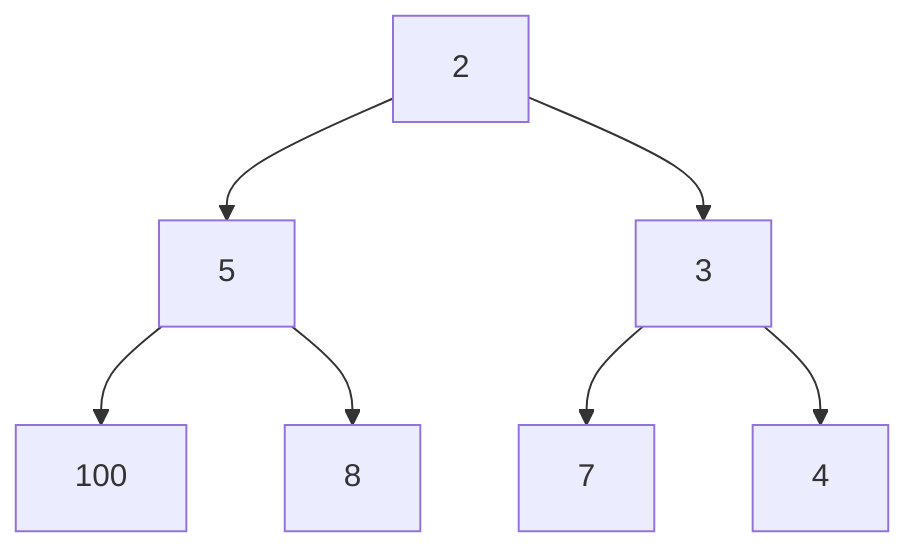

Suppose you are searching for `8`.

You cannot say:

```text
8 > 2, so search only the right side.
```

That works in a binary search tree, but not in a heap.

Both sides may contain larger values.

Therefore, in the worst case, you may inspect every item:

```text
O(n)
```

A heap is optimized for finding the root, not for searching arbitrary values.

---

# 15. Building a Heap

Suppose you receive an unsorted array:

```text
[8, 3, 5, 1, 9, 2]
```

There are two ways to build a heap.

## Approach 1: Insert Items One by One

Each insertion costs:

```text
O(log n)
```

For `n` items:

```text
O(n log n)
```

## Approach 2: Bottom-Up Heapify

Start from the last non-leaf node:

```text
n/2 - 1
```

Then sift each node down toward the root.

```text
Time: O(n)
```

This often surprises interview candidates.

## Why Is Bottom-Up Heapify O(n)?

Most nodes are near the bottom.

* About half the nodes are leaves and require no work.
* About one-quarter can move only one level.
* About one-eighth can move two levels.
* Very few nodes can move all the way down.

Therefore, the total work is linear:

```text
O(n)
```

Not every node performs `log n` work.

---

# 16. Priority Queue Example

Imagine tasks:

| Task                   | Priority |
| ---------------------- | -------: |
| Update profile picture |        1 |
| Fix payment outage     |      100 |
| Reply to email         |        5 |
| Fix login issue        |       50 |

A max-priority queue processes:

```text
Fix payment outage
Fix login issue
Reply to email
Update profile picture
```

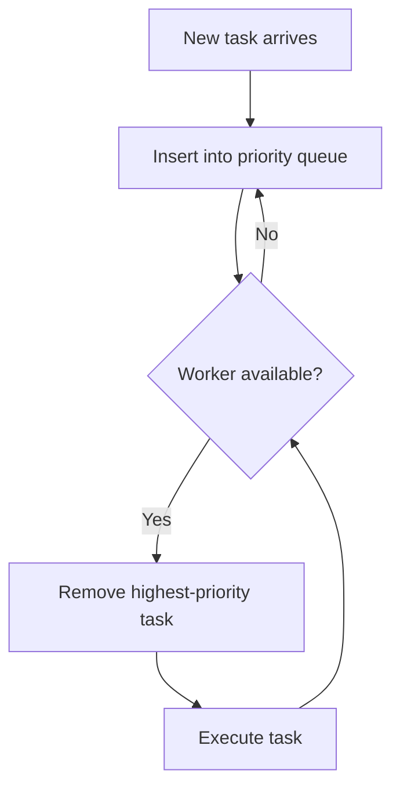

---

# 17. Min Heap or Max Heap?

Use this rule:

```text
Need the smallest item repeatedly → Min heap
Need the largest item repeatedly  → Max heap
```

Examples:

| Problem                    | Heap     |
| -------------------------- | -------- |
| Earliest finishing meeting | Min heap |
| Cheapest route candidate   | Min heap |
| Next scheduled task        | Min heap |
| Largest number             | Max heap |
| Most frequent item         | Max heap |
| Highest-priority job       | Max heap |

The confusing part is Top K problems.

---

# 18. The Opposite-Heap Rule for Top K

Suppose you need the **K largest** values.

Use a **min heap of size K**.

Why min heap?

Because the smallest item among your current winners is the first item you want to remove.

Example:

```text
Numbers: 7, 2, 10, 4, 8
K = 3
```

Keep only three candidates.

```text
After 7:       [7]
After 2:       [2, 7]
After 10:      [2, 7, 10]
After 4:       remove 2 → [4, 7, 10]
After 8:       remove 4 → [7, 8, 10]
```

The three largest numbers are:

```text
7, 8, 10
```

The root is `7`, which is the third largest.

```text
K largest  → Min heap of size K
K smallest → Max heap of size K
```

Mental model:

> Keep a small team of winners. The weakest winner stands at the door and is replaced when someone better arrives.

---

# 19. Pattern 1: Kth Largest Element

Problem:

```text
nums = [3, 2, 1, 5, 6, 4]
k = 2
```

The sorted order is:

```text
[1, 2, 3, 4, 5, 6]
```

The second-largest value is:

```text
5
```

## Heap Approach

Maintain a min heap containing at most `k` items.

For every number:

1. Push it into the heap.
2. If heap size exceeds `k`, remove the smallest.
3. At the end, the heap root is the kth-largest item.

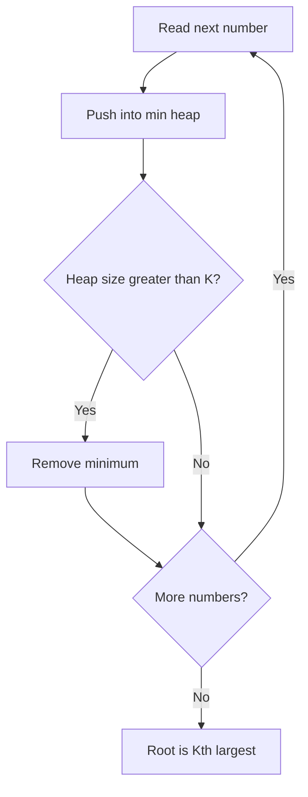

Complexity:

```text
Time:  O(n log k)
Space: O(k)
```

Alternative:

```text
Quickselect: Average O(n)
```

The heap solution is often easier and is especially useful for streams.

---

# 20. Pattern 2: Top K Frequent Elements

Problem:

```text
nums = [1, 1, 1, 2, 2, 3]
k = 2
```

Frequencies:

```text
1 → 3 times
2 → 2 times
3 → 1 time
```

Answer:

```text
[1, 2]
```

## Approach

First build a frequency map:

```text
value → count
```

Then maintain a min heap of size `k`, ordered by frequency.

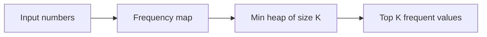

Complexity, where `m` is the number of unique values:

```text
Build frequency map: O(n)
Heap processing:     O(m log k)
Total:               O(n + m log k)
Space:               O(m + k)
```

Interview clue:

```text
Top K + frequency
```

Usually means:

```text
Hash map + heap
```

---

# 21. Pattern 3: Merge K Sorted Lists

Suppose you have:

```text
List 1: 1 → 4 → 8
List 2: 2 → 3 → 9
List 3: 5 → 6 → 7
```

At every step, you need the smallest head among all lists.

Initially:

```text
1, 2, 5
```

Put those values into a min heap.

Remove `1`, add it to the answer, and insert the next value from List 1: `4`.

Heap now contains:

```text
2, 4, 5
```

Continue until all lists are empty.

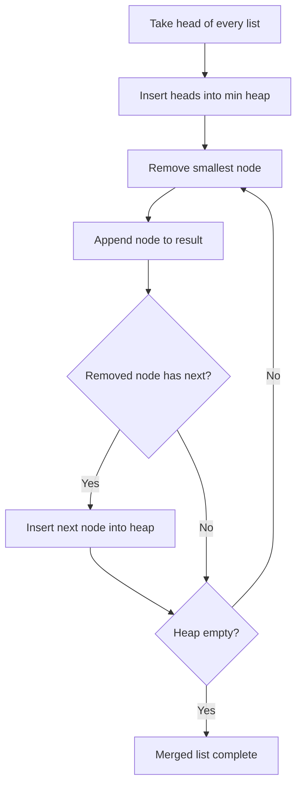

If there are `N` total nodes and `k` lists:

```text
Time:  O(N log k)
Space: O(k)
```

The heap never needs to contain more than one candidate from each list.

---

# 22. Pattern 4: Find Median from a Data Stream

Numbers arrive one by one:

```text
5, 2, 10, 3, 8, ...
```

You must return the median after every insertion.

One heap is not enough.

Use two heaps:

```text
Lower half → Max heap
Upper half → Min heap
```

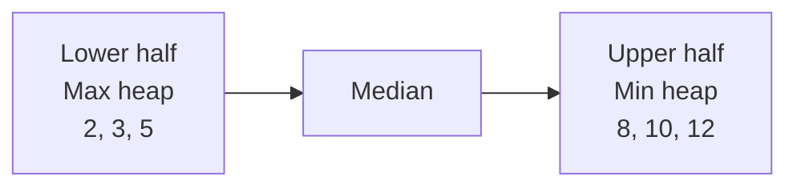

The max heap gives the largest value in the lower half.

The min heap gives the smallest value in the upper half.

Maintain these rules:

```text
1. Every lower-half value <= every upper-half value
2. Heap sizes differ by at most one
```

## Odd Number of Elements

```text
Lower: [5, 3, 2]
Upper: [8, 10]
```

Median:

```text
root of larger heap = 5
```

## Even Number of Elements

```text
Lower root = 5
Upper root = 8
```

Median:

```text
(5 + 8) / 2 = 6.5
```

Complexity:

```text
Add number: O(log n)
Find median: O(1)
Space:      O(n)
```

Mental model:

> Two rooms separated by a door. The left room stores the smaller half, and the right room stores the larger half. The people closest to the door determine the median.

---

# 23. Pattern 5: Meeting Rooms II

You receive meeting intervals:

```text
[0, 30]
[5, 10]
[15, 20]
```

You need to calculate the minimum number of rooms.

At time `5`:

* Meeting `[0,30]` is running.
* Meeting `[5,10]` starts.

You need two rooms.

At time `15`:

* Meeting `[5,10]` has ended.
* Its room can be reused.

## Heap Approach

1. Sort meetings by start time.
2. Keep a min heap of meeting end times.
3. The root is the meeting that finishes earliest.
4. If the next meeting starts after that time, reuse the room.
5. Otherwise, allocate another room.

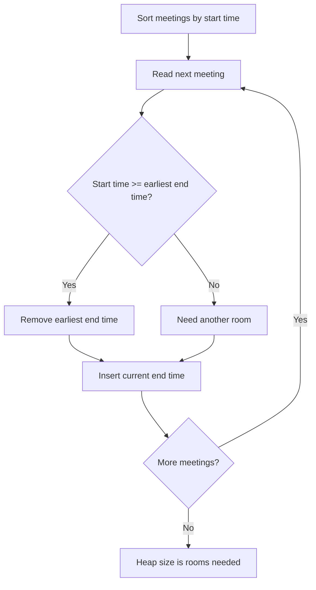

Complexity:

```text
Sorting: O(n log n)
Heap:    O(n log n)
Total:   O(n log n)
Space:   O(n)
```

The heap stores the end time of every room currently being used.

---

# 24. Pattern 6: Task Scheduler

You have tasks such as:

```text
A, A, A, B, B, B
```

A task must wait for a cooldown before running again.

For cooldown `n = 2`, a possible schedule is:

```text
A B idle A B idle A B
```

A common solution uses:

* Max heap: tasks with the highest remaining frequency
* Queue: tasks waiting for their cooldown to finish

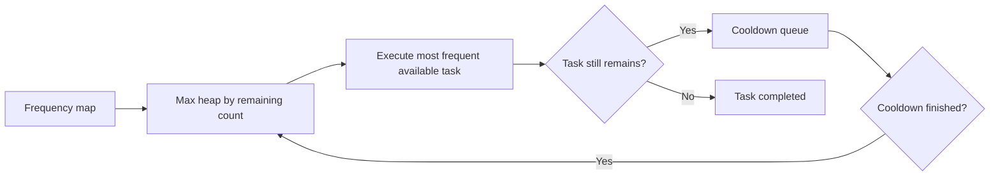

Why process the most frequent task first?

Because highly frequent tasks are the hardest to schedule. Delaying them can create more idle slots later.

General complexity:

```text
Time:  O(total schedule slots × log m)
Space: O(m)
```

Here, `m` is the number of distinct task types.

Because there are at most 26 uppercase English letters in the standard problem, the heap is very small.

---

# 25. Heap Patterns to Recognize

Use a heap when a question contains phrases like:

| Interview wording           | Likely pattern             |
| --------------------------- | -------------------------- |
| K largest                   | Min heap of size K         |
| K smallest                  | Max heap of size K         |
| Kth largest                 | Min heap of size K         |
| Kth smallest                | Max heap of size K         |
| Top K frequent              | Frequency map + min heap   |
| Continuously find median    | Two heaps                  |
| Merge K sorted lists        | Min heap with K candidates |
| Next task to execute        | Priority queue             |
| Earliest finishing meeting  | Min heap                   |
| Minimum cost available      | Min heap                   |
| Maximum reward available    | Max heap                   |
| Process events by timestamp | Min heap                   |
| Find shortest path          | Min heap, usually Dijkstra |

---

# 26. When Should You Not Use a Heap?

A heap is not always the best choice.

## Need the Entire Collection Sorted

Use sorting:

```text
O(n log n)
```

A heap only guarantees the root.

## Need Fast Membership Checking

Use a hash set:

```text
O(1) average
```

Searching a heap is `O(n)`.

## Need Ordered Searching and Range Queries

Use:

* Balanced binary search tree
* Ordered map
* Sorted structure

A heap cannot efficiently answer:

```text
Give me every value between 20 and 50.
```

## Need a Single Minimum Once

Scanning once may be simpler:

```text
O(n)
```

Building a heap would also cost `O(n)` and add unnecessary complexity.

---

# 27. Heap vs Other Data Structures

| Data structure |   Peek min |     Insert | Remove min |     Search |
| -------------- | ---------: | ---------: | ---------: | ---------: |
| Unsorted array |     `O(n)` |     `O(1)` |     `O(n)` |     `O(n)` |
| Sorted array   |     `O(1)` |     `O(n)` |     `O(n)` | `O(log n)` |
| Min heap       |     `O(1)` | `O(log n)` | `O(log n)` |     `O(n)` |
| Balanced BST   | `O(log n)` | `O(log n)` | `O(log n)` | `O(log n)` |

A heap is specialized for:

```text
Repeatedly accessing and removing the smallest or largest item.
```

---

# 28. Go Min-Heap Template

Go provides heap functionality through `container/heap`.

```go
package main

import (
	"container/heap"
	"fmt"
)

// IntMinHeap implements heap.Interface.
type IntMinHeap []int

func (h IntMinHeap) Len() int {
	return len(h)
}

// Less defines priority.
// For a min heap, smaller values have higher priority.
func (h IntMinHeap) Less(i, j int) bool {
	return h[i] < h[j]
}

func (h IntMinHeap) Swap(i, j int) {
	h[i], h[j] = h[j], h[i]
}

func (h *IntMinHeap) Push(value any) {
	*h = append(*h, value.(int))
}

func (h *IntMinHeap) Pop() any {
	old := *h
	n := len(old)

	value := old[n-1]
	*h = old[:n-1]

	return value
}

func main() {
	h := &IntMinHeap{8, 3, 5, 1}

	heap.Init(h)

	heap.Push(h, 2)
	heap.Push(h, 10)

	fmt.Println("Minimum:", (*h)[0])

	for h.Len() > 0 {
		fmt.Println(heap.Pop(h))
	}
}
```

Output:

```text
Minimum: 1
1
2
3
5
8
10
```

Important Go detail:

`heap.Pop` internally swaps the root with the last item and restores the heap. Your custom `Pop` method removes the final array element, not the root directly.

---

# 29. Creating a Max Heap in Go

Change only the `Less` method:

```go
func (h IntMaxHeap) Less(i, j int) bool {
	return h[i] > h[j]
}
```

For a min heap:

```go
return h[i] < h[j]
```

For a max heap:

```go
return h[i] > h[j]
```

A useful mental model:

> `Less(i, j)` answers whether item `i` should appear closer to the root than item `j`.

---

# 30. Kth Largest Element in Go

```go
package main

import "container/heap"

type IntMinHeap []int

func (h IntMinHeap) Len() int           { return len(h) }
func (h IntMinHeap) Less(i, j int) bool { return h[i] < h[j] }
func (h IntMinHeap) Swap(i, j int)      { h[i], h[j] = h[j], h[i] }

func (h *IntMinHeap) Push(value any) {
	*h = append(*h, value.(int))
}

func (h *IntMinHeap) Pop() any {
	old := *h
	n := len(old)

	value := old[n-1]
	*h = old[:n-1]

	return value
}

func findKthLargest(nums []int, k int) int {
	h := &IntMinHeap{}
	heap.Init(h)

	for _, number := range nums {
		heap.Push(h, number)

		if h.Len() > k {
			heap.Pop(h)
		}
	}

	return (*h)[0]
}
```

Example:

```go
nums := []int{3, 2, 1, 5, 6, 4}
answer := findKthLargest(nums, 2)

// answer = 5
```

Complexity:

```text
Time:  O(n log k)
Space: O(k)
```

---

# 31. Common Mistakes

## Mistake 1: Thinking the Heap Is Fully Sorted

This is valid:

```text
[2, 5, 3, 10, 8, 7, 4]
```

Even though:

```text
5 > 3
```

Only parent-child relationships matter.

---

## Mistake 2: Using a Max Heap for K Largest

For `K` largest, normally use:

```text
Min heap of size K
```

The root represents the weakest current winner.

---

## Mistake 3: Saying Build Heap Is O(n log n)

Repeated insertion is:

```text
O(n log n)
```

Bottom-up heap construction is:

```text
O(n)
```

---

## Mistake 4: Claiming Heap Search Is O(log n)

Heap search is generally:

```text
O(n)
```

The tree is not ordered like a binary search tree.

---

## Mistake 5: Forgetting the Complete-Tree Requirement

The shape of the tree is important. It keeps the height at:

```text
O(log n)
```

Without this requirement, the tree could become a long chain.

---

## Mistake 6: Using a Heap When Sorting Is Simpler

For one-time offline processing:

```text
Sort: O(n log n)
```

may be simpler.

A heap becomes especially valuable when:

* Data arrives as a stream.
* You only need `K` items.
* You repeatedly remove the highest-priority item.

---

# 32. Interview Questions and Answers

## Question 1: What Is a Heap?

A heap is a complete binary tree that satisfies a heap property. In a min heap, each parent is no greater than its children. In a max heap, each parent is no smaller than its children.

---

## Question 2: Is a Heap Fully Sorted?

No. A heap only guarantees ordering between parents and children. Siblings and separate subtrees are not necessarily sorted.

---

## Question 3: Why Is Peek O(1)?

The minimum or maximum value is always stored at the root, which is normally array index `0`.

---

## Question 4: Why Are Insertion and Removal O(log n)?

A heap is a complete binary tree with height `O(log n)`. An inserted or replaced item moves along at most one root-to-leaf path.

---

## Question 5: What Is the Difference Between a Heap and a Priority Queue?

A priority queue describes the operations and behaviour. A heap is one common data structure used to implement that behaviour.

---

## Question 6: Why Is Searching a Heap O(n)?

The heap property does not provide enough ordering to eliminate an entire subtree during a search. In the worst case, every node must be inspected.

---

## Question 7: Why Is Building a Heap O(n)?

Most nodes are close to the leaves and move very little during bottom-up heapification. Only a small number of nodes can move many levels.

---

## Question 8: How Do You Find the Kth-Largest Element?

Maintain a min heap of size `k`. Insert each value and remove the minimum whenever the heap grows beyond `k`. The root is the kth-largest value.

---

## Question 9: How Can a Min Heap Be Used as a Max Heap?

Reverse the comparison function, or store negated values when the language only provides a min heap.

Example:

```text
Store 10 as -10
Store 5 as -5
```

The smallest negative value represents the largest original value.

---

## Question 10: Can a Heap Contain Duplicate Values?

Yes. Duplicates do not violate the heap property.

```text
Parent <= child
```

allows equality.

---

## Question 11: Is a Heap Stable?

Not normally.

If two items have the same priority, the heap does not necessarily preserve insertion order.

To make it stable, store:

```text
(priority, insertionSequence, value)
```

Use the sequence number as a tie-breaker.

---

## Question 12: How Do You Delete an Arbitrary Heap Element?

If its index is known:

1. Swap it with the last item.
2. Remove the last item.
3. Bubble the replacement up or down.

The restructuring takes:

```text
O(log n)
```

But finding the item may cost:

```text
O(n)
```

unless an additional index map is maintained.

---

# 33. Common Coding Questions

| Problem                         | Main pattern                     | Complexity           |
| ------------------------------- | -------------------------------- | -------------------- |
| Kth Largest Element             | Min heap of size K               | `O(n log k)`         |
| Top K Frequent Elements         | Hash map + min heap              | `O(n + m log k)`     |
| Merge K Sorted Lists            | Min heap with list heads         | `O(N log k)`         |
| Find Median from Data Stream    | Max heap + min heap              | Add `O(log n)`       |
| Meeting Rooms II                | Sort + min heap of end times     | `O(n log n)`         |
| Task Scheduler                  | Frequency map + max heap + queue | Usually `O(n log m)` |
| K Closest Points                | Max heap of size K               | `O(n log k)`         |
| Reorganize String               | Max heap by frequency            | `O(n log m)`         |
| Smallest Range Covering K Lists | Min heap + current maximum       | `O(N log k)`         |
| Dijkstra’s Algorithm            | Min heap of distances            | `O((V+E) log V)`     |

---

# 34. Mock Interview Problems

## Mock Problem 1: K Closest Points

Given points:

```text
[[1,3], [-2,2], [5,8]]
```

Return the `k` points closest to the origin.

Distance:

```text
x² + y²
```

Expected pattern:

```text
Max heap of size K
```

Why max heap?

You are keeping the `K` smallest distances. The largest distance among the current winners should be removed first.

Complexity:

```text
Time:  O(n log k)
Space: O(k)
```

---

## Mock Problem 2: Connect Ropes with Minimum Cost

You have ropes:

```text
[4, 3, 2, 6]
```

Connecting two ropes costs the sum of their lengths.

To minimize total cost, repeatedly connect the two smallest ropes.

Expected pattern:

```text
Min heap
```

Steps:

```text
2 + 3 = 5
4 + 5 = 9
6 + 9 = 15

Total = 5 + 9 + 15 = 29
```

Complexity:

```text
O(n log n)
```

---

## Mock Problem 3: Kth Largest in a Stream

Numbers arrive continuously.

After every insertion, return the kth-largest value.

Expected pattern:

```text
Persistent min heap of size K
```

This is preferable to sorting all values after every insertion.

Each insertion:

```text
O(log k)
```

---

## Mock Problem 4: Reorganize String

Given:

```text
"aaabbc"
```

Rearrange the characters so that no two adjacent characters are equal.

Expected pattern:

```text
Frequency map + max heap
```

Repeatedly choose the most frequent character that is different from the previously used character.

---

## Mock Problem 5: Smallest Range Covering K Lists

Given several sorted lists, find the smallest range containing at least one number from every list.

Expected pattern:

```text
Min heap + track current maximum
```

The heap gives the current minimum. The tracked value gives the current maximum.

---

# 35. Interview Decision Framework

When you see a problem, ask these questions.

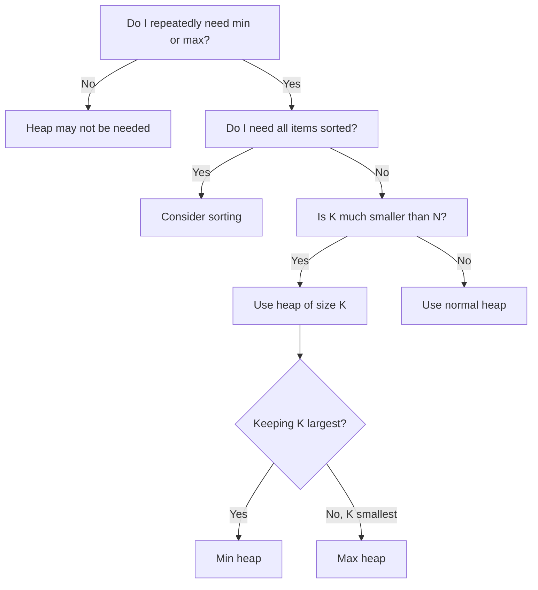

---

# 36. Final Mental Model

Remember these five ideas:

## 1. Heap Means Important Item at the Top

```text
Min heap → smallest on top
Max heap → largest on top
```

## 2. It Is Not Fully Sorted

```text
Only parent-child ordering is guaranteed.
```

## 3. Insert Goes Up

```text
Append → bubble up
```

## 4. Root Removal Goes Down

```text
Replace root with last → bubble down
```

## 5. Top K Uses the Opposite Heap

```text
K largest  → Min heap
K smallest → Max heap
```

The one-sentence interview explanation is:

> A binary heap is a complete binary tree, usually stored as an array, that maintains either the minimum or maximum element at the root and supports insertion and root removal in `O(log n)` time.
