Below is an interview-focused linked-list chapter using Go examples and Mermaid diagrams.

# Linked Lists — Explained Like You Are Five

## 1. What Is a Linked List?

Imagine a treasure hunt.

Each location contains:

1. A treasure.
2. A note telling you where the next treasure is.

You cannot immediately jump to treasure number five. You must start at the first treasure and follow the notes one by one.

That is a linked list.

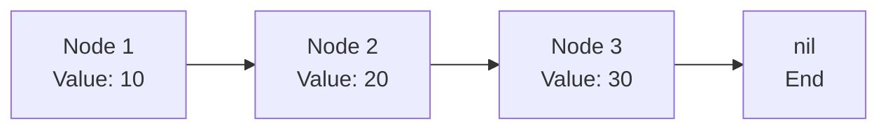

Every box is called a **node**.

Each node normally contains:

```text
Node
├── Value
└── Pointer to the next node
```

In Go:

```go
type ListNode struct {
    Val  int
    Next *ListNode
}
```

Example:

```go
head := &ListNode{Val: 10}
head.Next = &ListNode{Val: 20}
head.Next.Next = &ListNode{Val: 30}
```

The result is:

```text
10 → 20 → 30 → nil
```

`nil` means there is no next node. The list has ended.

---

# 2. The Main Mental Model

Think of a linked list as a train.

Each train compartment contains:

* Some passengers: the value.
* A connector to the next compartment: the pointer.

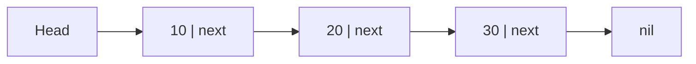

The first node is called the **head**.

To reach `30`, you must travel through:

```text
10 → 20 → 30
```

You cannot directly ask for `list[2]` as you can with an array.

---

# 3. Why Do We Need Linked Lists?

Arrays store elements beside each other in memory.

```text
Array:

Index:  0    1    2    3
Value: 10   20   30   40
```

This makes array access very fast:

```go
value := numbers[2]
```

The computer calculates the location of index `2` directly.

But inserting something at the beginning can be expensive.

Before:

```text
10 20 30 40
```

Insert `5` at the beginning:

```text
5 10 20 30 40
```

The other elements may have to move.

A linked list does not need to move every node. It only changes connections.

Before:

```text
10 → 20 → 30
```

Insert `5` at the beginning:

```text
5 → 10 → 20 → 30
```

We only perform two operations:

```go
newNode.Next = head
head = newNode
```

## Array versus linked list

| Operation                 |          Array | Linked list |
| ------------------------- | -------------: | ----------: |
| Access by index           |         `O(1)` |      `O(n)` |
| Search                    |         `O(n)` |      `O(n)` |
| Insert at beginning       | Usually `O(n)` |      `O(1)` |
| Delete from beginning     | Usually `O(n)` |      `O(1)` |
| Insert after a known node | Usually `O(n)` |      `O(1)` |
| Memory usage              |          Lower |      Higher |
| Cache friendliness        |         Better |       Worse |

Linked lists are useful when:

* Insertions and deletions happen frequently.
* Elements do not need fast index access.
* The structure grows and shrinks dynamically.
* Nodes need to move without copying their data.
* You are building structures such as LRU caches, queues or adjacency lists.

---

# 4. How Is a Linked List Stored?

The nodes are not required to be next to each other in memory.

Conceptually, memory might look like this:

```text
Address 1000: value=10, next=5000
Address 5000: value=20, next=2300
Address 2300: value=30, next=nil
```

Even though the addresses are scattered, the pointers connect them.

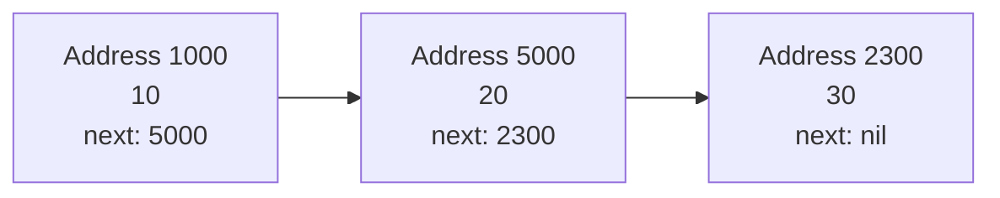

The logical order is determined by pointers, not by physical memory location.

---

# 5. Types of Linked Lists

## 5.1 Singly Linked List

Each node points only to the next node.

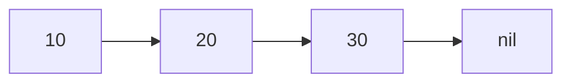

```go
type ListNode struct {
    Val  int
    Next *ListNode
}
```

You can move only forward.

```text
10 → 20 → 30
```

You cannot directly move from `30` back to `20`.

---

## 5.2 Doubly Linked List

Each node points both forward and backward.

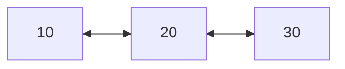

```go
type DoublyNode struct {
    Val  int
    Prev *DoublyNode
    Next *DoublyNode
}
```

It supports movement in both directions:

```text
10 ⇄ 20 ⇄ 30
```

A doubly linked list is commonly used in:

* LRU caches.
* Browser back and forward navigation.
* Undo and redo systems.
* Music playlists.
* Deques.

The trade-off is additional memory and more pointer updates.

---

## 5.3 Circular Linked List

The last node points back to the first node.

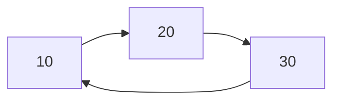

There is no `nil` ending.

Circular lists can be useful for:

* Round-robin scheduling.
* Repeating playlists.
* Turn-based games.
* Circular buffers.

You must be careful during traversal because checking only `current != nil` would create an infinite loop.

---

# 6. Basic Linked-List Operations

## 6.1 Traversal

To visit every node:

```go
func printList(head *ListNode) {
    current := head

    for current != nil {
        fmt.Println(current.Val)
        current = current.Next
    }
}
```

Movement:

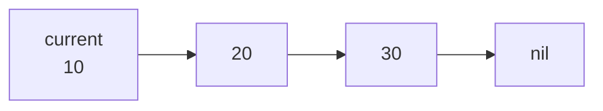

At every step:

```go
current = current.Next
```

### Time complexity

For `n` nodes:

```text
10 → 20 → 30 → ... → last node
```

Every node is visited once.

```text
Time:  O(n)
Space: O(1)
```

---

## 6.2 Calculate the Length

A linked list does not automatically provide an index-based length unless you separately store it.

```go
func length(head *ListNode) int {
    count := 0

    for current := head; current != nil; current = current.Next {
        count++
    }

    return count
}
```

### Complexity

```text
Time:  O(n)
Space: O(1)
```

You count one node at a time.

---

## 6.3 Insert at the Beginning

Before:

```text
10 → 20 → 30
```

Create a new node:

```text
5
```

Point it to the old head:

```text
5 → 10 → 20 → 30
```

Then make it the new head.

```go
func insertAtHead(head *ListNode, value int) *ListNode {
    newNode := &ListNode{
        Val:  value,
        Next: head,
    }

    return newNode
}
```

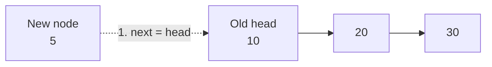

### Complexity

```text
Time:  O(1)
Space: O(1) additional pointer work
```

The new node itself requires memory, but the operation does not depend on the list size.

---

## 6.4 Insert After a Known Node

Before:

```text
10 → 20 → 30
```

Insert `25` after `20`.

The order of operations matters:

```go
newNode.Next = current.Next
current.Next = newNode
```

Result:

```text
10 → 20 → 25 → 30
```

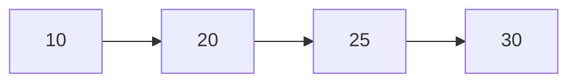

If you write:

```go
current.Next = newNode
```

before saving the original next node, you may lose access to the rest of the list.

### Complexity

When the node is already known:

```text
Time: O(1)
```

When you must search for the node first:

```text
Search: O(n)
Insert: O(1)
Total:  O(n)
```

---

## 6.5 Delete the First Node

Before:

```text
10 → 20 → 30
```

Move the head:

```go
head = head.Next
```

After:

```text
20 → 30
```

```go
func removeHead(head *ListNode) *ListNode {
    if head == nil {
        return nil
    }

    return head.Next
}
```

### Complexity

```text
Time:  O(1)
Space: O(1)
```

---

## 6.6 Delete a Node by Value

Suppose we want to remove `20`.

Before:

```text
10 → 20 → 30
```

Instead of making `10` point to `20`, make it point directly to `30`.

```text
10 ─────→ 30
```

```go
func deleteValue(head *ListNode, target int) *ListNode {
    if head == nil {
        return nil
    }

    if head.Val == target {
        return head.Next
    }

    current := head

    for current.Next != nil {
        if current.Next.Val == target {
            current.Next = current.Next.Next
            break
        }

        current = current.Next
    }

    return head
}
```

Notice that we inspect:

```go
current.Next.Val
```

This is because deletion usually requires access to the node before the node being deleted.

### Complexity

```text
Time:  O(n)
Space: O(1)
```

---

# 7. The Most Important Linked-List Patterns

Most linked-list interview problems are variations of a small number of patterns.

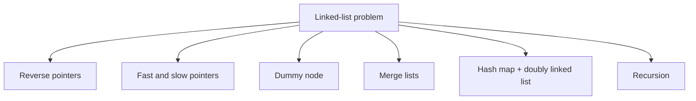

Learn these patterns rather than memorizing individual solutions.

---

# 8. Pattern 1: Fast and Slow Pointers

Use two pointers:

* `slow` moves one step.
* `fast` moves two steps.

```go
slow = slow.Next
fast = fast.Next.Next
```

## Mental model

Imagine a tortoise and a rabbit running along the list.

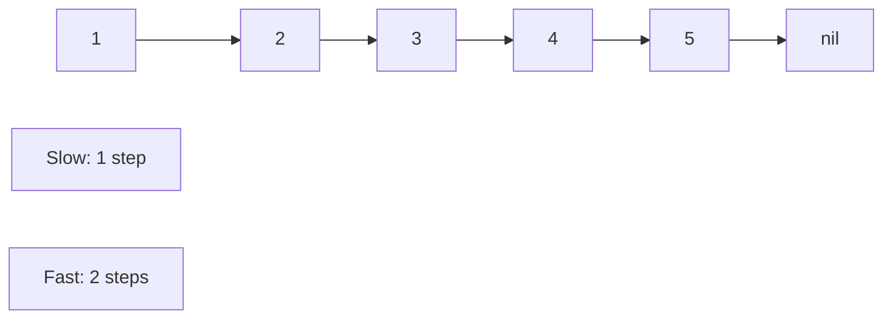

This pattern solves:

* Find the middle node.
* Detect a cycle.
* Find where a cycle begins.
* Check whether a linked list is a palindrome.
* Split a list into two halves.

---

## 8.1 Find the Middle Node

```go
func middleNode(head *ListNode) *ListNode {
    slow := head
    fast := head

    for fast != nil && fast.Next != nil {
        slow = slow.Next
        fast = fast.Next.Next
    }

    return slow
}
```

Example:

```text
1 → 2 → 3 → 4 → 5
```

| Round | Slow | Fast |
| ----- | ---: | ---: |
| Start |    1 |    1 |
| 1     |    2 |    3 |
| 2     |    3 |    5 |

When `fast` reaches the end, `slow` is in the middle.

### Why does it work?

Fast travels twice the distance of slow.

When fast has travelled approximately `n` nodes:

```text
slow has travelled approximately n / 2 nodes
```

Therefore, slow reaches the middle.

### Even-sized list

```text
1 → 2 → 3 → 4
```

This implementation returns `3`, the second middle node.

### Complexity

```text
Time:  O(n)
Space: O(1)
```

---

## 8.2 Detect a Cycle

A cycle means a node eventually points back to an earlier node.

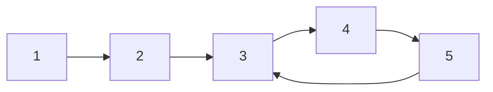

The list never reaches `nil`.

Use Floyd’s cycle detection algorithm:

```go
func hasCycle(head *ListNode) bool {
    slow := head
    fast := head

    for fast != nil && fast.Next != nil {
        slow = slow.Next
        fast = fast.Next.Next

        if slow == fast {
            return true
        }
    }

    return false
}
```

### Mental model

Imagine a circular running track.

A slow runner moves one step.

A fast runner moves two steps.

If both runners stay on the circular track, the faster runner must eventually catch the slower runner.

### Important comparison

Compare the nodes:

```go
slow == fast
```

Do not compare their values:

```go
slow.Val == fast.Val
```

Two different nodes may contain the same value.

### Complexity

```text
Time:  O(n)
Space: O(1)
```

---

## 8.3 Find the Beginning of a Cycle

After slow and fast meet:

1. Keep one pointer at the meeting point.
2. Move the other pointer back to the head.
3. Move both one step at a time.
4. Their next meeting point is the cycle entrance.

```go
func detectCycleStart(head *ListNode) *ListNode {
    slow := head
    fast := head

    for fast != nil && fast.Next != nil {
        slow = slow.Next
        fast = fast.Next.Next

        if slow == fast {
            start := head

            for start != slow {
                start = start.Next
                slow = slow.Next
            }

            return start
        }
    }

    return nil
}
```

This is frequently asked as a follow-up to cycle detection.

---

# 9. Pattern 2: Reverse a Linked List

Reversing a linked list is one of the most important interview questions.

Before:

```text
1 → 2 → 3 → nil
```

After:

```text
3 → 2 → 1 → nil
```

The values do not move. The arrows change direction.

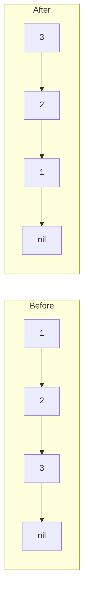

## 9.1 Iterative Reversal

We need three pointers:

```text
previous
current
next
```

```go
func reverseList(head *ListNode) *ListNode {
    var previous *ListNode
    current := head

    for current != nil {
        next := current.Next
        current.Next = previous
        previous = current
        current = next
    }

    return previous
}
```

## Step-by-step example

Initial state:

```text
previous = nil
current  = 1

nil    1 → 2 → 3 → nil
```

### First iteration

Save the next node:

```go
next := current.Next
```

```text
next = 2
```

Reverse the pointer:

```go
current.Next = previous
```

```text
1 → nil
```

Move `previous`:

```go
previous = current
```

Move `current`:

```go
current = next
```

State:

```text
1 → nil

2 → 3 → nil
```

### Second iteration

```text
2 → 1 → nil

3 → nil
```

### Third iteration

```text
3 → 2 → 1 → nil
```

## The critical rule

Always save the next node before changing the pointer:

```go
next := current.Next
```

Otherwise, when you write:

```go
current.Next = previous
```

you lose access to the remaining list.

### Complexity

```text
Time:  O(n)
Space: O(1)
```

---

## 9.2 Recursive Reversal

```go
func reverseListRecursive(head *ListNode) *ListNode {
    if head == nil || head.Next == nil {
        return head
    }

    newHead := reverseListRecursive(head.Next)

    head.Next.Next = head
    head.Next = nil

    return newHead
}
```

Mental model:

```text
reverse(1 → 2 → 3)

Wait for:
reverse(2 → 3)

Wait for:
reverse(3)

3 is already reversed.

Then connect:
3 → 2

Then connect:
3 → 2 → 1
```

### Complexity

```text
Time:  O(n)
Space: O(n)
```

The extra space comes from the recursion call stack.

The iterative solution is normally preferred because it uses constant extra space.

---

# 10. Pattern 3: Dummy Node

A dummy node is a temporary fake node placed before the real head.

Without a dummy node, deleting the head is a special case.

```text
Head → 10 → 20 → 30
```

With a dummy node:

```text
Dummy → 10 → 20 → 30
```

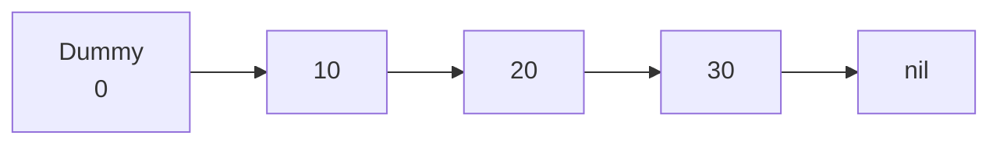

The dummy node makes every real node have a previous node.

This removes many edge cases.

```go
dummy := &ListNode{
    Val:  0,
    Next: head,
}
```

At the end:

```go
return dummy.Next
```

Use a dummy node when:

* The head might be deleted.
* A new head might be created.
* Two lists are being merged.
* Nodes are being rearranged.
* You see many `if head == ...` conditions.

## Mental model

The dummy node is temporary scaffolding around a building.

It makes construction easier. Once the work is complete, you remove the scaffolding.

---

# 11. Pattern 4: Merge Two Sorted Lists

Input:

```text
List 1: 1 → 3 → 5
List 2: 2 → 4 → 6
```

Output:

```text
1 → 2 → 3 → 4 → 5 → 6
```

Use:

* A dummy node.
* A `tail` pointer.
* Two pointers for the input lists.

```go
func mergeTwoLists(
    list1 *ListNode,
    list2 *ListNode,
) *ListNode {
    dummy := &ListNode{}
    tail := dummy

    for list1 != nil && list2 != nil {
        if list1.Val <= list2.Val {
            tail.Next = list1
            list1 = list1.Next
        } else {
            tail.Next = list2
            list2 = list2.Next
        }

        tail = tail.Next
    }

    if list1 != nil {
        tail.Next = list1
    } else {
        tail.Next = list2
    }

    return dummy.Next
}
```

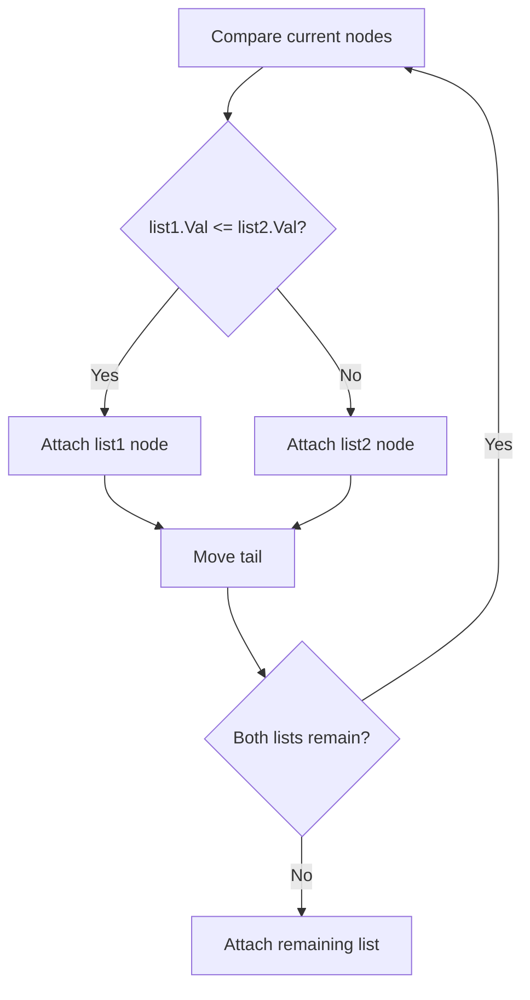

### Why attach the remainder directly?

Suppose:

```text
List 1: nil
List 2: 5 → 6 → 7
```

List 2 is already sorted. There is no need to process each remaining node separately.

### Complexity

If the lists contain `n` and `m` nodes:

```text
Time:  O(n + m)
Space: O(1)
```

The existing nodes are reused.

---

# 12. Pattern 5: Remove the Nth Node from the End

Example:

```text
1 → 2 → 3 → 4 → 5
```

Remove the second node from the end.

Result:

```text
1 → 2 → 3 → 5
```

A basic solution would:

1. Count the list length.
2. Calculate the node position.
3. Traverse again.
4. Delete it.

That works, but it requires two passes.

The preferred solution uses two pointers.

## Mental model: maintain a gap

Move `fast` ahead by `n` nodes.

Then move `slow` and `fast` together.

When `fast` reaches the end, `slow` is just before the node to remove.

```go
func removeNthFromEnd(head *ListNode, n int) *ListNode {
    dummy := &ListNode{Next: head}

    slow := dummy
    fast := dummy

    for i := 0; i < n; i++ {
        fast = fast.Next
    }

    for fast.Next != nil {
        slow = slow.Next
        fast = fast.Next
    }

    slow.Next = slow.Next.Next

    return dummy.Next
}
```

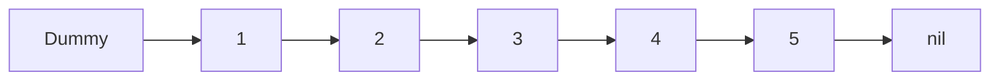

For `n = 2`, fast remains two nodes ahead.

### Why use a dummy node?

Suppose the list is:

```text
1 → 2
```

Remove the second node from the end.

That means removing the head.

The dummy node allows us to remove the head using the same logic as any other node.

### Complexity

```text
Time:  O(n)
Space: O(1)
```

---

# 13. Pattern 6: Add Two Numbers

The numbers are stored in reverse order.

```text
List 1: 2 → 4 → 3
Number: 342

List 2: 5 → 6 → 4
Number: 465
```

Addition:

```text
342 + 465 = 807
```

Output:

```text
7 → 0 → 8
```

The main idea is ordinary school addition:

```text
value = digit1 + digit2 + carry
newDigit = value % 10
newCarry = value / 10
```

```go
func addTwoNumbers(
    list1 *ListNode,
    list2 *ListNode,
) *ListNode {
    dummy := &ListNode{}
    tail := dummy
    carry := 0

    for list1 != nil || list2 != nil || carry != 0 {
        value1 := 0
        value2 := 0

        if list1 != nil {
            value1 = list1.Val
            list1 = list1.Next
        }

        if list2 != nil {
            value2 = list2.Val
            list2 = list2.Next
        }

        total := value1 + value2 + carry

        carry = total / 10
        digit := total % 10

        tail.Next = &ListNode{Val: digit}
        tail = tail.Next
    }

    return dummy.Next
}
```

Example:

| Position | Digit 1 | Digit 2 | Carry in | Total | Output digit | Carry out |
| -------- | ------: | ------: | -------: | ----: | -----------: | --------: |
| Ones     |       2 |       5 |        0 |     7 |            7 |         0 |
| Tens     |       4 |       6 |        0 |    10 |            0 |         1 |
| Hundreds |       3 |       4 |        1 |     8 |            8 |         0 |

### Complexity

```text
Time:  O(max(n, m))
Space: O(max(n, m))
```

The output requires a new list.

---

# 14. Pattern 7: LRU Cache

LRU means:

```text
Least Recently Used
```

When the cache is full, remove the item that has not been used for the longest time.

For example, capacity is `3`:

```text
Most recent                          Least recent
A → B → C
```

Access `C`:

```text
C → A → B
```

Insert `D`:

```text
D → C → A
```

`B` is removed because it is the least recently used item.

## Required performance

A good LRU cache must support:

```text
Get: O(1)
Put: O(1)
```

A hash map provides fast lookup:

```text
key → node
```

But a hash map does not maintain usage order efficiently.

A doubly linked list maintains the order:

```text
Most recently used ⇄ ... ⇄ Least recently used
```

Therefore, LRU uses both:

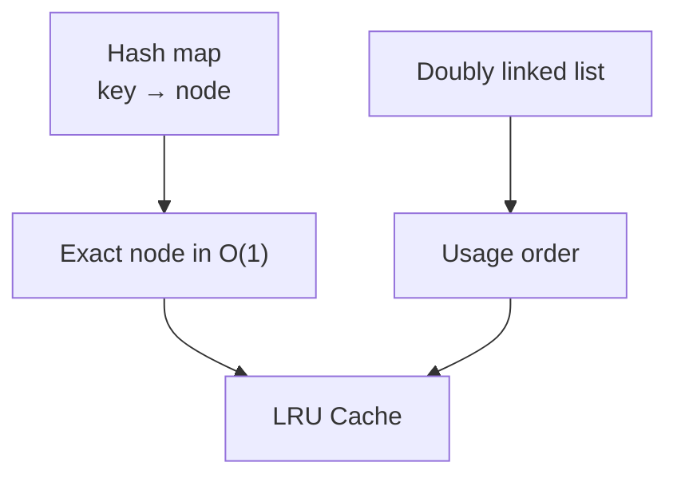

## Typical structure

```text
Head dummy ⇄ most recent ⇄ ... ⇄ least recent ⇄ tail dummy
```

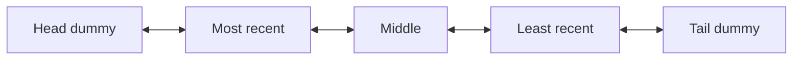

## Why doubly linked?

To remove a known node in `O(1)`, we need both:

```go
node.Prev
node.Next
```

Removal:

```go
node.Prev.Next = node.Next
node.Next.Prev = node.Prev
```

A singly linked list does not directly provide the previous node.

## LRU operation

### Get

1. Find the node using the hash map.
2. Remove it from its current list position.
3. Move it to the front.
4. Return its value.

### Put

1. Check whether the key already exists.
2. Update or create the node.
3. Move it to the front.
4. If over capacity, remove the node at the back.
5. Delete the removed key from the hash map.

### Complexity

```text
Get: O(1)
Put: O(1)
Space: O(capacity)
```

---

# 15. Linked-List Complexity Cheat Sheet

## Singly linked list

| Operation                   | Complexity | Explanation              |
| --------------------------- | ---------: | ------------------------ |
| Access index `k`            |     `O(k)` | Follow `k` pointers      |
| Search by value             |     `O(n)` | May inspect every node   |
| Insert at head              |     `O(1)` | Change the head pointer  |
| Delete head                 |     `O(1)` | Move head to `head.Next` |
| Insert after known node     |     `O(1)` | Change two pointers      |
| Delete after known node     |     `O(1)` | Skip one node            |
| Append without tail pointer |     `O(n)` | Find the last node       |
| Append with tail pointer    |     `O(1)` | Attach directly to tail  |
| Reverse                     |     `O(n)` | Reverse every pointer    |
| Find middle                 |     `O(n)` | Fast and slow pointers   |
| Detect cycle                |     `O(n)` | Floyd’s algorithm        |

## Doubly linked list

| Operation         |      Complexity |
| ----------------- | --------------: |
| Insert at head    |          `O(1)` |
| Insert at tail    |          `O(1)` |
| Delete known node |          `O(1)` |
| Move forward      | `O(1)` per step |
| Move backward     | `O(1)` per step |
| Search            |          `O(n)` |

---

# 16. How to Recognize the Correct Pattern

| Problem wording                  | Likely pattern                     |
| -------------------------------- | ---------------------------------- |
| “Find the middle”                | Fast and slow pointers             |
| “Does a cycle exist?”            | Fast and slow pointers             |
| “Find cycle entrance”            | Floyd’s algorithm                  |
| “Nth node from the end”          | Two pointers with a gap            |
| “Reverse the list”               | Previous, current and next         |
| “Merge sorted lists”             | Dummy node and tail                |
| “Delete or rearrange the head”   | Dummy node                         |
| “Palindrome linked list”         | Find middle, reverse half, compare |
| “Intersection of two lists”      | Align lengths or pointer switching |
| “Reorder the list”               | Middle, reverse, merge             |
| “Recently used cache”            | Hash map and doubly linked list    |
| “Deep copy with random pointers” | Hash map or interweaving nodes     |

---

# 17. Common Interview Problems

## 17.1 Reverse Linked List

### Core idea

Change every node’s next pointer to point backward.

```text
Pattern: previous, current, next
Time:    O(n)
Space:   O(1)
```

### Common mistake

Changing `current.Next` before saving the original next node.

---

## 17.2 Linked List Cycle

### Core idea

Slow moves one step and fast moves two steps.

```text
Pattern: fast and slow pointers
Time:    O(n)
Space:   O(1)
```

### Common mistake

Comparing values instead of node addresses.

---

## 17.3 Merge Two Sorted Lists

### Core idea

Repeatedly attach the smaller current node.

```text
Pattern: dummy node and tail
Time:    O(n + m)
Space:   O(1)
```

### Common mistake

Forgetting to attach the remaining non-empty list.

---

## 17.4 Remove Nth Node from End

### Core idea

Maintain an `n`-node gap between fast and slow.

```text
Pattern: dummy node and two pointers
Time:    O(n)
Space:   O(1)
```

### Common mistake

Not handling deletion of the original head.

---

## 17.5 Middle of the Linked List

### Core idea

Fast moves twice as quickly as slow.

```text
Pattern: fast and slow pointers
Time:    O(n)
Space:   O(1)
```

### Common mistake

Using an unsafe loop condition.

Correct:

```go
for fast != nil && fast.Next != nil
```

Incorrect:

```go
for fast.Next != nil
```

The incorrect version crashes when `fast` is `nil`.

---

## 17.6 Add Two Numbers

### Core idea

Perform digit-by-digit addition and maintain a carry.

```text
Pattern: simultaneous traversal and dummy node
Time:    O(max(n, m))
Space:   O(max(n, m))
```

### Common mistake

Forgetting the final carry.

Example:

```text
5 + 5 = 10
```

The output needs:

```text
0 → 1
```

---

## 17.7 LRU Cache

### Core idea

Combine:

```text
Hash map + doubly linked list
```

The hash map finds nodes quickly.

The doubly linked list maintains usage order.

```text
Get: O(1)
Put: O(1)
```

### Common mistake

Using only a list, which makes lookup `O(n)`, or only a map, which does not efficiently maintain recency order.

---

# 18. Additional High-Frequency Problems

## 18.1 Palindrome Linked List

Example:

```text
1 → 2 → 3 → 2 → 1
```

Approach:

1. Find the middle.
2. Reverse the second half.
3. Compare the first and second halves.
4. Optionally restore the list.

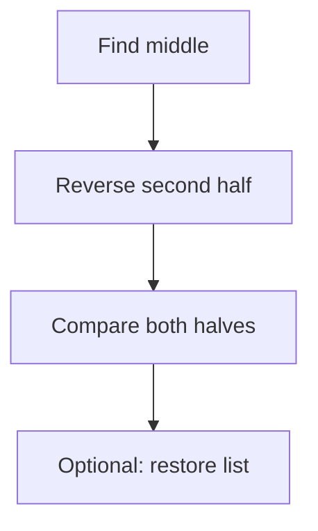

```text
Time:  O(n)
Space: O(1)
```

---

## 18.2 Intersection of Two Linked Lists

Two lists intersect when they share the same node object.

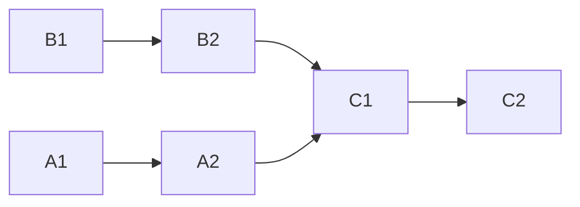

The shared node is `C1`.

A common solution uses pointer switching:

```go
func getIntersectionNode(
    headA *ListNode,
    headB *ListNode,
) *ListNode {
    pointerA := headA
    pointerB := headB

    for pointerA != pointerB {
        if pointerA == nil {
            pointerA = headB
        } else {
            pointerA = pointerA.Next
        }

        if pointerB == nil {
            pointerB = headA
        } else {
            pointerB = pointerB.Next
        }
    }

    return pointerA
}
```

Each pointer walks:

```text
Length of A + length of B
```

Therefore, their path lengths become equal.

```text
Time:  O(n + m)
Space: O(1)
```

---

## 18.3 Reorder List

Input:

```text
1 → 2 → 3 → 4 → 5
```

Output:

```text
1 → 5 → 2 → 4 → 3
```

Approach:

1. Find the middle.
2. Split the list.
3. Reverse the second half.
4. Merge the two halves alternately.

```mermaid
flowchart LR
    A["Find middle"] --> B["Split"]
    B --> C["Reverse second half"]
    C --> D["Merge alternately"]
```

This problem combines three linked-list patterns.

---

## 18.4 Reverse Nodes in K-Group

Example with `k = 3`:

```text
1 → 2 → 3 → 4 → 5 → 6
```

Result:

```text
3 → 2 → 1 → 6 → 5 → 4
```

This tests:

* Pointer discipline.
* Reversing a fixed section.
* Connecting reversed groups.
* Handling an incomplete final group.

It is significantly harder than basic linked-list reversal.

---

# 19. Common Linked-List Mistakes

## Mistake 1: Losing the Rest of the List

Wrong:

```go
current.Next = previous
current = current.Next
```

After changing `current.Next`, it no longer points to the original next node.

Correct:

```go
next := current.Next
current.Next = previous
current = next
```

---

## Mistake 2: Dereferencing `nil`

Dangerous:

```go
fast.Next.Next
```

Safe only after checking:

```go
fast != nil && fast.Next != nil
```

---

## Mistake 3: Forgetting to Update the Head

Operations such as these may change the head:

* Insert at beginning.
* Delete first node.
* Reverse list.
* Merge lists.
* Remove nth node from end.

Therefore, functions usually return a possibly new head:

```go
head = reverseList(head)
```

---

## Mistake 4: Comparing Values Instead of Nodes

These nodes have equal values but are not the same node:

```text
Node A: value 5
Node B: value 5
```

For cycle and intersection problems, compare pointer identity:

```go
nodeA == nodeB
```

---

## Mistake 5: Creating an Accidental Cycle

Suppose:

```text
1 → 2 → 3
```

A wrong pointer update can produce:

```text
1 → 2 → 3
    ↑     ↓
    └─────┘
```

Then traversal never terminates.

---

## Mistake 6: Forgetting Both Directions in a Doubly Linked List

When removing `node`:

```go
node.Prev.Next = node.Next
node.Next.Prev = node.Prev
```

Updating only one direction corrupts the structure.

---

## Mistake 7: Incorrect Loop Boundary

These two loops have different meanings.

Visit every node:

```go
for current != nil {
}
```

Inspect `current.Next` safely:

```go
for current.Next != nil {
}
```

The second loop does not process the final node as `current`.

---

# 20. Interview Thinking Framework

When given a linked-list problem, ask these questions mentally.

## Step 1: Can the head change?

If yes, consider a dummy node.

Examples:

* Delete a node.
* Merge lists.
* Reverse part of a list.
* Insert before the head.

## Step 2: Do I need information about the end?

Consider two pointers.

Examples:

* Nth node from the end.
* Middle node.
* Cycle detection.

## Step 3: Am I changing pointer directions?

Use:

```text
previous
current
next
```

Draw the pointers before coding.

## Step 4: Am I combining sorted lists?

Use:

```text
dummy + tail + one pointer per list
```

## Step 5: Do I need `O(1)` lookup and `O(1)` ordering?

Use:

```text
hash map + doubly linked list
```

## Step 6: What happens for the smallest inputs?

Always test:

```text
Empty list
One node
Two nodes
Head deletion
Tail deletion
Even number of nodes
Odd number of nodes
Cycle
No cycle
```

---

# 21. A Useful Pointer-Drawing Technique

Before modifying pointers, write down every connection involved.

Suppose we are reversing:

```text
previous ← current → next
```

The required operations are:

```text
1. Save next
2. Reverse current's pointer
3. Move previous
4. Move current
```

Mnemonic:

```text
Save → Reverse → Advance → Advance
```

Or:

```text
Save next.
Point back.
Move prev.
Move curr.
```

This prevents most reversal bugs.

---

# 22. Mock Interview Questions

## Question 1

Why is accessing the fifth element of a linked list `O(n)` rather than `O(1)`?

### Answer

A linked list does not store nodes in consecutive index-addressable positions. To reach the fifth node, we must start at the head and follow four next pointers.

---

## Question 2

When is inserting into a linked list `O(1)`?

### Answer

Insertion is `O(1)` when the insertion position or previous node is already known. If we must first search for that position, the full operation is `O(n)`.

---

## Question 3

Why does linked-list reversal require a temporary `next` pointer?

### Answer

Once `current.Next` is changed to point backward, the original connection to the remaining list is lost. Saving `current.Next` first preserves access to the unprocessed nodes.

---

## Question 4

How do fast and slow pointers find the middle?

### Answer

Fast moves two nodes for every one node moved by slow. When fast reaches the end after approximately `n` steps, slow has travelled approximately `n/2` steps.

---

## Question 5

Why does Floyd’s cycle detection work?

### Answer

Inside a cycle, fast gains one node on slow during each iteration because fast moves two steps while slow moves one. The distance between them eventually becomes zero, causing them to meet.

---

## Question 6

Can a cycle be detected with a hash set?

### Answer

Yes. Store each visited node in a set. If a node is seen again, a cycle exists.

```text
Time:  O(n)
Space: O(n)
```

Floyd’s algorithm is preferred because it uses:

```text
Time:  O(n)
Space: O(1)
```

---

## Question 7

Why use a dummy node?

### Answer

A dummy node removes special handling for the head. It gives the original head a previous node, allowing insertions and deletions to follow one uniform rule.

---

## Question 8

Why does an LRU cache need a doubly linked list?

### Answer

When a node is accessed, it must be removed from its current position and moved to the front in `O(1)`. A doubly linked list allows removal through direct access to both the previous and next nodes.

---

## Question 9

Can a singly linked list delete a known node in `O(1)`?

### Answer

It can delete the node after a known node in `O(1)`. Deleting the known node itself normally requires its previous node, unless it is not the tail and we copy the next node’s value and pointer into it.

---

## Question 10

How can you find the nth node from the end in one pass?

### Answer

Move a fast pointer `n` nodes ahead. Then move fast and slow together. When fast reaches the end, slow is at the required position or immediately before it, depending on initialization.

---

## Question 11

What happens if a linked list contains duplicate values during cycle detection?

### Answer

Duplicate values do not matter. Cycle detection compares node addresses, not values.

---

## Question 12

How would you determine whether a linked list is a palindrome using constant extra space?

### Answer

Find the middle using fast and slow pointers, reverse the second half, compare corresponding nodes, and optionally restore the second half afterward.

---

## Question 13

What is the difference between reversing values and reversing nodes?

### Answer

Reversing values changes the data stored inside the nodes. Reversing nodes changes the pointer relationships. Interviewers normally expect pointer reversal because the node order itself must change.

---

## Question 14

Why are linked lists less cache-friendly than arrays?

### Answer

Array elements are usually stored next to each other in memory. Linked-list nodes may be scattered across memory, causing more cache misses while following pointers.

---

## Question 15

What invariant should you maintain while reversing a linked list?

### Answer

At the beginning of every iteration:

```text
previous points to the already reversed part
current points to the first unprocessed node
```

Maintaining this invariant makes the algorithm easier to reason about.

---

# 23. Practice Questions by Difficulty

## Beginner

| Problem                | Main pattern           |
| ---------------------- | ---------------------- |
| Linked List Traversal  | Basic pointer movement |
| Find List Length       | Traversal              |
| Insert at Head         | Pointer update         |
| Delete by Value        | Previous and current   |
| Middle of Linked List  | Fast and slow          |
| Reverse Linked List    | Three pointers         |
| Merge Two Sorted Lists | Dummy and tail         |

## Intermediate

| Problem                   | Main pattern              |
| ------------------------- | ------------------------- |
| Linked List Cycle         | Fast and slow             |
| Cycle Start               | Floyd’s algorithm         |
| Remove Nth Node From End  | Pointer gap               |
| Palindrome Linked List    | Middle and reverse        |
| Intersection of Two Lists | Pointer switching         |
| Add Two Numbers           | Carry and traversal       |
| Odd Even Linked List      | Multiple tails            |
| Reorder List              | Middle, reverse and merge |

## Advanced

| Problem                               | Main pattern                    |
| ------------------------------------- | ------------------------------- |
| LRU Cache                             | Hash map and doubly linked list |
| Reverse Nodes in K-Group              | Section reversal                |
| Merge K Sorted Lists                  | Heap or divide and conquer      |
| Copy List with Random Pointer         | Hash map or node interweaving   |
| Sort List                             | Merge sort                      |
| Flatten Multilevel Doubly Linked List | DFS and pointer rewiring        |

---

# 24. Final Mental Model

A linked list is not primarily about values.

It is about connections.

```text
Array thinking:
Where is index 5?

Linked-list thinking:
Which node points to which node?
```

For every linked-list problem, draw arrows and identify:

```text
What points here now?
What should point here afterward?
Which connection could be lost?
Can the head change?
```

Remember the core tools:

```mermaid
mindmap
  root((Linked Lists))
    Nodes and pointers
      Head
      Next
      Prev
      Nil
    Fast and slow
      Middle
      Cycle
      Palindrome
    Reverse
      Previous
      Current
      Next
    Dummy node
      Insert
      Delete
      Merge
    Doubly linked list
      LRU cache
      O(1) removal
    Common combinations
      Middle + reverse
      Reverse + merge
      Hash map + doubly list
```

## One-line memory rules

```text
Need the middle? Use fast and slow.

Need something from the end? Maintain a pointer gap.

Need to reverse? Save next before changing current.Next.

Can the head change? Use a dummy node.

Need to merge? Use a dummy node and tail.

Need O(1) lookup and recency order? Use a hash map and doubly linked list.
```

## The seven essential linked-list problems

Master these first:

1. Reverse Linked List.
2. Middle of the Linked List.
3. Linked List Cycle.
4. Merge Two Sorted Lists.
5. Remove Nth Node From End.
6. Add Two Numbers.
7. LRU Cache.

Together, these cover most of the important linked-list interview patterns.

The most important skill is manually drawing pointer changes before writing code, particularly for reversal, deletion and list merging.
