# Queue / Deque Explained Like You Are a Baby

Imagine children waiting in a line for ice cream.

```text
Front                                  Back
  ↓                                      ↓
[Alice] → [Bob] → [Charlie] → [David]
```

Alice came first, so Alice gets ice cream first.

This is a **queue**.

> **First In, First Out — FIFO**

A **deque** is a special queue where children can enter or leave from **either end**.

```text
Front                                  Back
  ↓                                      ↓
[Alice] ⇄ [Bob] ⇄ [Charlie] ⇄ [David]
```

Deque is pronounced **“deck.”**

---

# 1. The Basic Mental Model

## Queue: A line at a ticket counter

People join at the back and leave from the front.

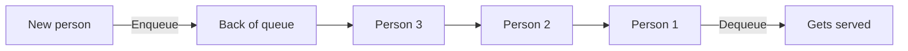

A normal queue supports:

| Operation             | Meaning                          |
| --------------------- | -------------------------------- |
| `enqueue(x)`          | Add `x` to the back              |
| `dequeue()`           | Remove the front item            |
| `front()` or `peek()` | Look at the front item           |
| `isEmpty()`           | Check whether the queue is empty |
| `size()`              | Number of items                  |

---

## Deque: A train with doors at both ends

A deque lets you add or remove elements from both sides.

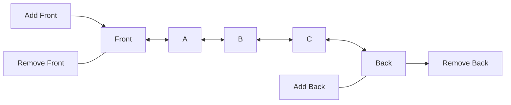

A deque supports:

| Operation      | Meaning               |
| -------------- | --------------------- |
| `pushFront(x)` | Add to the front      |
| `pushBack(x)`  | Add to the back       |
| `popFront()`   | Remove from the front |
| `popBack()`    | Remove from the back  |
| `front()`      | Read the front item   |
| `back()`       | Read the back item    |

---

# 2. Why Do We Need a Queue?

A queue is needed whenever things must be processed in the same order they arrived.

Examples:

| Real-world situation      | Why a queue fits                  |
| ------------------------- | --------------------------------- |
| Printer jobs              | First submitted job prints first  |
| Customer support requests | Earlier request is handled first  |
| Web server requests       | Requests wait to be processed     |
| Message processing        | Messages are consumed in order    |
| CPU task scheduling       | Tasks wait for execution          |
| BFS traversal             | Nodes are visited level by level  |
| Ride waiting line         | First person waiting enters first |

The central question is:

> “Who has been waiting the longest?”

The answer is always at the **front of the queue**.

---

# 3. Stack vs Queue

A stack and queue may look similar, but the removal order is different.

| Structure | Rule                | Mental model                  |
| --------- | ------------------- | ----------------------------- |
| Stack     | Last In, First Out  | Stack of plates               |
| Queue     | First In, First Out | Line of people                |
| Deque     | Both ends           | Train with doors at both ends |

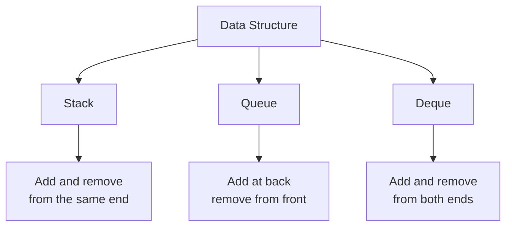

---

# 4. How Does a Queue Work Internally?

A queue normally keeps track of two positions:

* `front`: the next item to remove
* `rear`: the position where a new item is added

Consider this queue:

```text
Index:   0       1       2       3
       ┌─────┬─────┬─────┬─────┐
Array: │ 10  │ 20  │ 30  │     │
       └─────┴─────┴─────┴─────┘
          ↑             ↑
        front          rear
```

If we dequeue `10`, the `front` moves forward.

```text
Index:   0       1       2       3
       ┌─────┬─────┬─────┬─────┐
Array: │     │ 20  │ 30  │     │
       └─────┴─────┴─────┴─────┘
                  ↑       ↑
                front    rear
```

We do not need to physically move every element.

We only move the `front` pointer.

---

# 5. Queue Time Complexity

For a correctly implemented queue:

| Operation          |   Time |
| ------------------ | -----: |
| Enqueue            | `O(1)` |
| Dequeue            | `O(1)` |
| Peek front         | `O(1)` |
| Check empty        | `O(1)` |
| Search for a value | `O(n)` |
| Traverse all items | `O(n)` |

Space complexity for storing `n` elements:

```text
O(n)
```

## Why is enqueue `O(1)`?

Because we add one element at the back.

We do not inspect every other element.

## Why is dequeue `O(1)`?

Because we move the `front` pointer by one position.

```text
front = front + 1
```

## Common implementation mistake

Removing the first element from an array by shifting everything left costs `O(n)`.

```text
Before:
[10, 20, 30, 40]

Remove 10 and shift:
[20, 30, 40]
```

Three elements had to move.

For repeated queue operations, use:

* front index
* linked list
* circular buffer
* language-provided deque

---

# 6. Queue Implementation in Go

Go does not have a general-purpose queue type in the standard library. For interviews, a slice with a front index is usually enough.

```go
package main

import "fmt"

type Queue struct {
	items []int
	front int
}

func (q *Queue) Enqueue(value int) {
	q.items = append(q.items, value)
}

func (q *Queue) Dequeue() (int, bool) {
	if q.IsEmpty() {
		return 0, false
	}

	value := q.items[q.front]
	q.front++

	return value, true
}

func (q *Queue) Peek() (int, bool) {
	if q.IsEmpty() {
		return 0, false
	}

	return q.items[q.front], true
}

func (q *Queue) IsEmpty() bool {
	return q.front >= len(q.items)
}

func (q *Queue) Size() int {
	return len(q.items) - q.front
}

func main() {
	queue := Queue{}

	queue.Enqueue(10)
	queue.Enqueue(20)
	queue.Enqueue(30)

	value, _ := queue.Dequeue()
	fmt.Println(value) // 10

	front, _ := queue.Peek()
	fmt.Println(front) // 20
}
```

## Production concern

The consumed part of the slice may continue occupying memory.

Occasionally, compact the slice:

```go
func (q *Queue) Compact() {
	if q.front == 0 {
		return
	}

	q.items = append([]int(nil), q.items[q.front:]...)
	q.front = 0
}
```

For most coding interviews, this optimization is not necessary unless asked.

---

# 7. What Is a Deque?

A deque is a **double-ended queue**.

```text
Deque = Double-Ended Queue
```

You can operate on both ends.

```text
pushFront    pushBack
    ↓           ↓
   [1] [2] [3] [4]
    ↑           ↑
 popFront     popBack
```

## When is a deque useful?

A deque is especially useful when:

* you need a queue and a stack together
* old and useless elements must be removed from the front
* new elements are added at the back
* you need the largest or smallest item in a moving window
* you need zero-cost and one-cost graph traversal

---

# 8. Deque Time Complexity

For a proper deque implementation:

| Operation  |   Time |
| ---------- | -----: |
| Push front | `O(1)` |
| Push back  | `O(1)` |
| Pop front  | `O(1)` |
| Pop back   | `O(1)` |
| Read front | `O(1)` |
| Read back  | `O(1)` |
| Search     | `O(n)` |

The exact implementation may use:

* doubly linked list
* circular array
* dynamic circular buffer

---

# 9. The Most Important Queue Pattern: BFS

## BFS means Breadth-First Search

BFS visits things one level at a time.

Imagine dropping a stone into water. The waves spread outward.

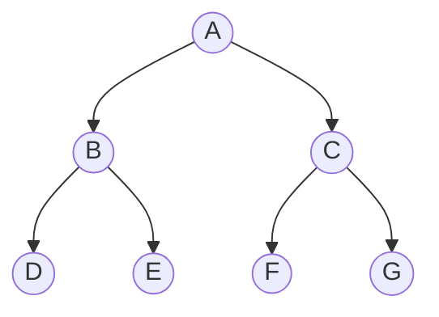

BFS visits:

```text
A
B, C
D, E, F, G
```

Full order:

```text
A → B → C → D → E → F → G
```

A queue is required because nodes discovered first must be processed first.

---

## BFS process

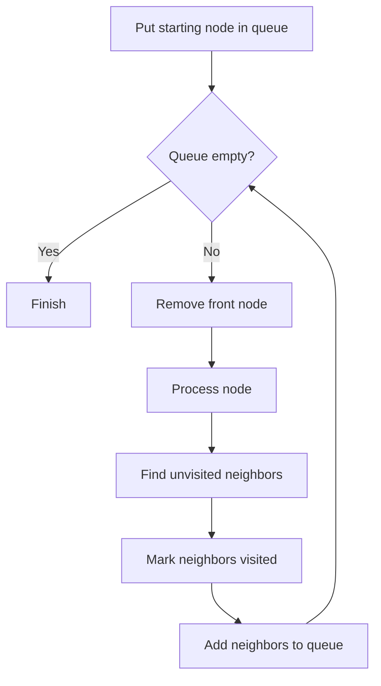

Generic BFS template:

```go
queue := []Node{start}
visited[start] = true

for len(queue) > 0 {
	current := queue[0]
	queue = queue[1:]

	for _, neighbor := range current.Neighbors {
		if !visited[neighbor] {
			visited[neighbor] = true
			queue = append(queue, neighbor)
		}
	}
}
```

---

# 10. Why Mark Visited Before Enqueuing?

This is an important interview detail.

Consider:

```text
A connects to B
C connects to B
```

If both `A` and `C` discover `B`, they may both insert `B` into the queue.

Bad:

```go
current := dequeue()

if !visited[current] {
	visited[current] = true
}
```

Better:

```go
if !visited[neighbor] {
	visited[neighbor] = true
	queue = append(queue, neighbor)
}
```

Marking a node when it is enqueued prevents duplicates.

> **BFS rule: mark visited when adding to the queue.**

---

# 11. BFS Complexity

For a graph:

* `V` = number of vertices
* `E` = number of edges

BFS visits each vertex once and examines each edge.

```text
Time:  O(V + E)
Space: O(V)
```

For a grid with `rows × columns`:

```text
Time:  O(rows × columns)
Space: O(rows × columns)
```

The space is used by:

* the queue
* the visited structure

---

# 12. Binary Tree Level-Order Traversal

## Problem

Given a binary tree, return values level by level.

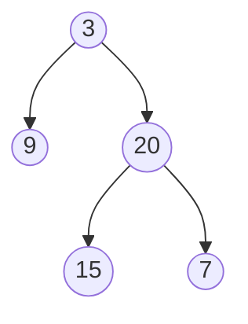

Expected result:

```text
[
  [3],
  [9, 20],
  [15, 7]
]
```

## Key observation

At the beginning of each loop:

```text
queue size = number of nodes in the current level
```

---

## Go solution

```go
type TreeNode struct {
	Val   int
	Left  *TreeNode
	Right *TreeNode
}

func levelOrder(root *TreeNode) [][]int {
	if root == nil {
		return [][]int{}
	}

	result := [][]int{}
	queue := []*TreeNode{root}

	for len(queue) > 0 {
		levelSize := len(queue)
		level := make([]int, 0, levelSize)

		for i := 0; i < levelSize; i++ {
			node := queue[0]
			queue = queue[1:]

			level = append(level, node.Val)

			if node.Left != nil {
				queue = append(queue, node.Left)
			}

			if node.Right != nil {
				queue = append(queue, node.Right)
			}
		}

		result = append(result, level)
	}

	return result
}
```

## Complexity

Every node enters and leaves the queue once.

```text
Time:  O(n)
Space: O(w)
```

Where `w` is the maximum width of the tree.

Worst case:

```text
Space: O(n)
```

---

# 13. Number of Islands

## Problem

A grid contains:

* `1` = land
* `0` = water

Count the number of separate islands.

```text
1 1 0 0
1 0 0 1
0 0 1 1
```

There are two islands.

## Mental model

When you find land that has not been visited:

1. Increase the island count.
2. Start BFS.
3. Visit all connected land.
4. Mark it as visited.
5. Continue scanning.

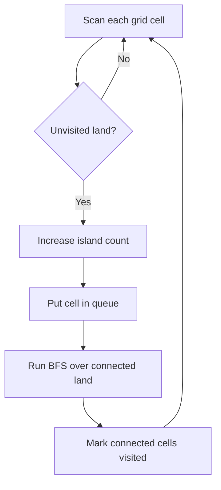

---

## Go solution

```go
func numIslands(grid [][]byte) int {
	if len(grid) == 0 {
		return 0
	}

	rows := len(grid)
	cols := len(grid[0])
	islands := 0

	directions := [][2]int{
		{-1, 0},
		{1, 0},
		{0, -1},
		{0, 1},
	}

	for row := 0; row < rows; row++ {
		for col := 0; col < cols; col++ {
			if grid[row][col] != '1' {
				continue
			}

			islands++
			queue := [][2]int{{row, col}}
			grid[row][col] = '0'

			for len(queue) > 0 {
				cell := queue[0]
				queue = queue[1:]

				for _, direction := range directions {
					nextRow := cell[0] + direction[0]
					nextCol := cell[1] + direction[1]

					insideGrid :=
						nextRow >= 0 &&
							nextRow < rows &&
							nextCol >= 0 &&
							nextCol < cols

					if insideGrid && grid[nextRow][nextCol] == '1' {
						grid[nextRow][nextCol] = '0'
						queue = append(queue, [2]int{nextRow, nextCol})
					}
				}
			}
		}
	}

	return islands
}
```

## Complexity

Each grid cell is processed at most once.

```text
Time:  O(rows × columns)
Space: O(rows × columns)
```

---

# 14. Rotting Oranges

## Problem

Each cell contains:

* `0` = empty
* `1` = fresh orange
* `2` = rotten orange

Every minute, rotten oranges infect adjacent fresh oranges.

Find the minimum number of minutes required to rot every orange.

## Important pattern: Multi-source BFS

Instead of starting BFS from one rotten orange, put **all initially rotten oranges** into the queue.

```text
Minute 0:
R . . R

Both rotten oranges spread simultaneously.
```

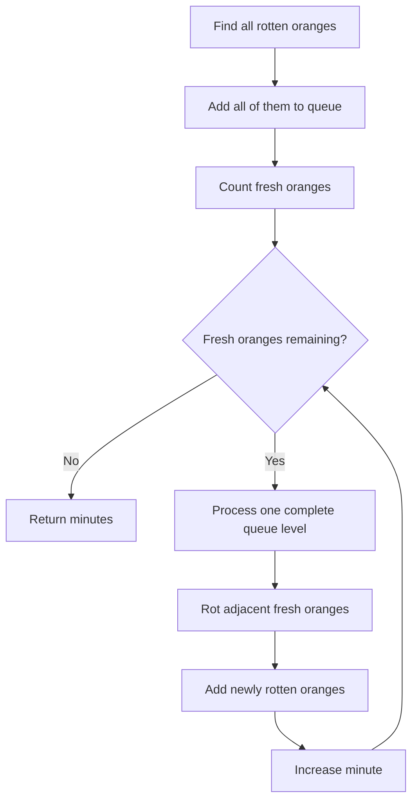

---

## Go solution

```go
func orangesRotting(grid [][]int) int {
	rows := len(grid)
	cols := len(grid[0])

	queue := [][2]int{}
	fresh := 0

	for row := 0; row < rows; row++ {
		for col := 0; col < cols; col++ {
			switch grid[row][col] {
			case 1:
				fresh++
			case 2:
				queue = append(queue, [2]int{row, col})
			}
		}
	}

	if fresh == 0 {
		return 0
	}

	directions := [][2]int{
		{-1, 0},
		{1, 0},
		{0, -1},
		{0, 1},
	}

	minutes := 0

	for len(queue) > 0 && fresh > 0 {
		levelSize := len(queue)

		for i := 0; i < levelSize; i++ {
			cell := queue[0]
			queue = queue[1:]

			for _, direction := range directions {
				nextRow := cell[0] + direction[0]
				nextCol := cell[1] + direction[1]

				insideGrid :=
					nextRow >= 0 &&
						nextRow < rows &&
						nextCol >= 0 &&
						nextCol < cols

				if !insideGrid || grid[nextRow][nextCol] != 1 {
					continue
				}

				grid[nextRow][nextCol] = 2
				fresh--
				queue = append(queue, [2]int{nextRow, nextCol})
			}
		}

		minutes++
	}

	if fresh > 0 {
		return -1
	}

	return minutes
}
```

## Why does one queue level represent one minute?

At the start of a level, the queue contains oranges that are already rotten.

During that level, they infect their neighbors.

Those newly infected oranges spread during the next level.

```text
Queue level 0 → Minute 0
Queue level 1 → Minute 1
Queue level 2 → Minute 2
```

---

# 15. Circular Queue

A normal array-based queue may eventually reach the end of its array.

Consider a queue with capacity five:

```text
[10, 20, 30, 40, 50]
```

After removing three elements:

```text
[_, _, _, 40, 50]
```

There is free space at the beginning, but `rear` has reached the end.

A circular queue wraps around.

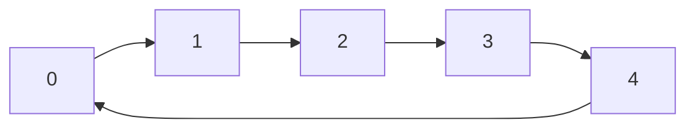

The array is mentally treated as a circle.

---

## Circular index calculation

Suppose the capacity is `5`.

To move forward:

```text
nextIndex = (currentIndex + 1) % capacity
```

Example:

```text
currentIndex = 4
capacity     = 5

nextIndex = (4 + 1) % 5
          = 5 % 5
          = 0
```

So the position wraps from index `4` back to index `0`.

---

# 16. Circular Queue State

A circular queue usually stores:

```text
data     = fixed-size array
front    = index of first element
rear     = index for insertion
size     = current number of elements
capacity = maximum number of elements
```

## Empty condition

```text
size == 0
```

## Full condition

```text
size == capacity
```

This is often easier to understand than trying to distinguish empty and full using only `front` and `rear`.

---

## Go circular queue implementation

```go
type CircularQueue struct {
	data     []int
	front    int
	rear     int
	size     int
	capacity int
}

func NewCircularQueue(capacity int) *CircularQueue {
	return &CircularQueue{
		data:     make([]int, capacity),
		capacity: capacity,
	}
}

func (q *CircularQueue) EnQueue(value int) bool {
	if q.IsFull() {
		return false
	}

	q.data[q.rear] = value
	q.rear = (q.rear + 1) % q.capacity
	q.size++

	return true
}

func (q *CircularQueue) DeQueue() bool {
	if q.IsEmpty() {
		return false
	}

	q.front = (q.front + 1) % q.capacity
	q.size--

	return true
}

func (q *CircularQueue) Front() (int, bool) {
	if q.IsEmpty() {
		return 0, false
	}

	return q.data[q.front], true
}

func (q *CircularQueue) Rear() (int, bool) {
	if q.IsEmpty() {
		return 0, false
	}

	index := (q.rear - 1 + q.capacity) % q.capacity
	return q.data[index], true
}

func (q *CircularQueue) IsEmpty() bool {
	return q.size == 0
}

func (q *CircularQueue) IsFull() bool {
	return q.size == q.capacity
}
```

## Why this rear calculation?

`rear` points to the next available insertion position.

The last inserted value is therefore one position behind it.

```text
rearValueIndex = rear - 1
```

But when `rear == 0`, `rear - 1` becomes negative.

Therefore:

```text
(rear - 1 + capacity) % capacity
```

---

# 17. Priority Queue

A priority queue does not necessarily follow normal FIFO behavior.

The highest-priority or lowest-priority item leaves first.

Example: Hospital emergency room.

```text
Patient A arrived first: mild fever
Patient B arrived later: severe breathing problem
```

Patient B may be treated first because the priority is higher.

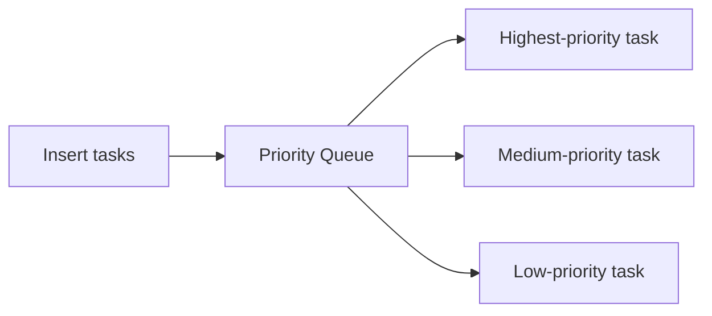

Priority queues are usually implemented using a **heap**.

| Operation                      | Typical complexity |
| ------------------------------ | -----------------: |
| Insert                         |         `O(log n)` |
| Remove highest/lowest priority |         `O(log n)` |
| Peek highest/lowest priority   |             `O(1)` |

Do not confuse:

| Queue type     | Removal rule               |
| -------------- | -------------------------- |
| Normal queue   | Oldest item                |
| Deque          | Either end                 |
| Priority queue | Highest or lowest priority |

---

# 18. Sliding Window Maximum

This is the most important deque interview problem.

## Problem

Given:

```text
nums = [1, 3, -1, -3, 5, 3, 6, 7]
k = 3
```

Find the maximum in every window of size `3`.

```text
[1, 3, -1]  → 3
[3, -1, -3] → 3
[-1, -3, 5] → 5
[-3, 5, 3]  → 5
[5, 3, 6]   → 6
[3, 6, 7]   → 7
```

Answer:

```text
[3, 3, 5, 5, 6, 7]
```

---

## Brute-force solution

For every window, inspect all `k` elements.

```text
Number of windows ≈ n
Work per window    = k

Time = O(n × k)
```

We want:

```text
O(n)
```

---

# 19. Monotonic Deque

A monotonic deque keeps useful candidates in sorted order.

For Sliding Window Maximum, maintain values in **decreasing order**.

```text
Front                         Back
largest → smaller → smaller → smallest
```

The front always stores the maximum candidate.

But in code, store **indices**, not just values.

Why indices?

Because we need to know when an element leaves the window.

---

## Three rules

For every index `i`:

### Rule 1: Remove expired indices from the front

Current window starts at:

```text
i - k + 1
```

Any index smaller than this has expired.

```go
if deque[0] < i-k+1 {
	popFront()
}
```

### Rule 2: Remove smaller values from the back

If the new value is larger, smaller values behind it can never become the maximum.

```text
Existing deque: [8, 6, 4]
New value:       7

Remove 4
Remove 6

New deque: [8, 7]
```

### Rule 3: The front is the maximum

Once the first full window is formed:

```text
maximum = nums[deque[0]]
```

---

## Why can smaller elements be removed?

Consider:

```text
Old value: 3
New value:  5
```

The new `5` is:

* larger than `3`
* newer than `3`

Therefore, as long as `3` remains inside the window, `5` will also remain inside the window and will always be a better maximum candidate.

The `3` is useless.

---

## Mermaid visualization

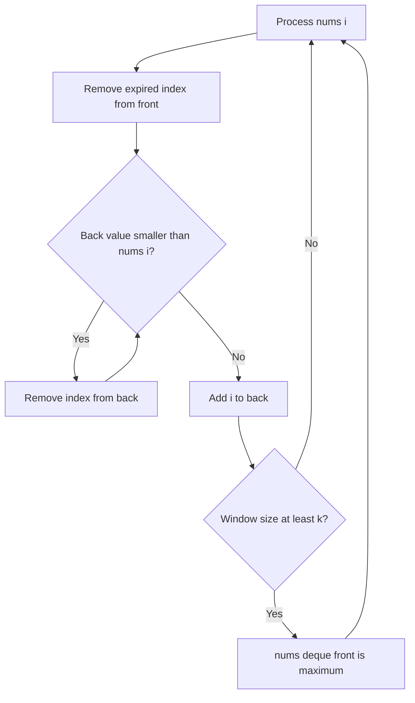

---

## Go solution

```go
func maxSlidingWindow(nums []int, k int) []int {
	if len(nums) == 0 || k <= 0 {
		return []int{}
	}

	result := make([]int, 0, len(nums)-k+1)
	deque := make([]int, 0)

	for i := 0; i < len(nums); i++ {
		windowStart := i - k + 1

		// Remove indices outside the current window.
		if len(deque) > 0 && deque[0] < windowStart {
			deque = deque[1:]
		}

		// Remove values smaller than the new value.
		for len(deque) > 0 &&
			nums[deque[len(deque)-1]] <= nums[i] {
			deque = deque[:len(deque)-1]
		}

		deque = append(deque, i)

		// Start recording after the first complete window.
		if i >= k-1 {
			result = append(result, nums[deque[0]])
		}
	}

	return result
}
```

## Complexity

At first glance, the inner `for` loop looks expensive.

But every index is:

* inserted once
* removed at most once

Therefore:

```text
Time:  O(n)
Space: O(k)
```

This is an example of **amortized analysis**.

---

# 20. Queue Problem Recognition

Use a queue when the problem contains language like:

| Problem clue                | Likely pattern   |
| --------------------------- | ---------------- |
| Level by level              | BFS queue        |
| Minimum number of steps     | BFS queue        |
| Nearest destination         | BFS queue        |
| Spread every minute         | Multi-source BFS |
| Process in arrival order    | Normal queue     |
| Fixed-size reusable storage | Circular queue   |
| Maximum in each window      | Monotonic deque  |
| Minimum in each window      | Monotonic deque  |
| Highest priority first      | Priority queue   |
| Add/remove from both sides  | Deque            |

---

# 21. BFS vs DFS

Both BFS and DFS can visit all nodes.

The important difference is the visitation order.

| BFS                                | DFS                                       |
| ---------------------------------- | ----------------------------------------- |
| Uses queue                         | Uses stack or recursion                   |
| Level by level                     | Goes deep first                           |
| Finds shortest unweighted path     | Does not automatically find shortest path |
| May use more memory on wide graphs | May use more memory on deep graphs        |

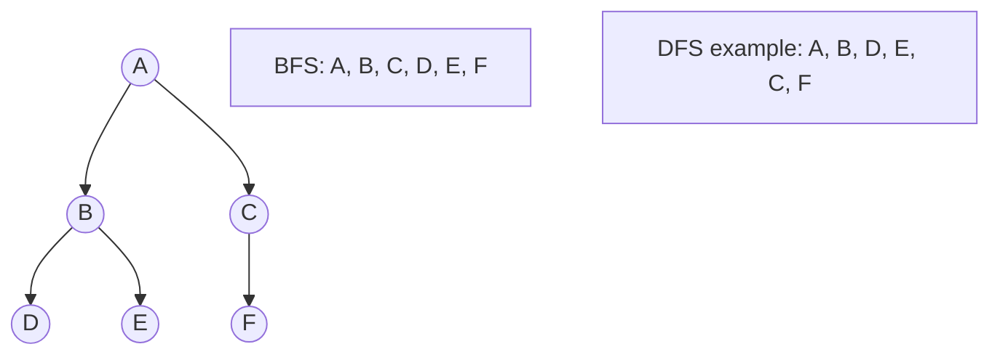

## Interview rule

For an **unweighted graph**:

> BFS finds the shortest path measured by number of edges.

Why?

Because BFS explores:

```text
distance 0
distance 1
distance 2
distance 3
```

It cannot reach a distance-three node before processing all distance-two nodes.

---

# 22. Common Queue Patterns

## Pattern 1: Standard BFS

```go
queue := []Node{start}
visited[start] = true

for len(queue) > 0 {
	current := queue[0]
	queue = queue[1:]

	for _, next := range neighbors(current) {
		if !visited[next] {
			visited[next] = true
			queue = append(queue, next)
		}
	}
}
```

Use for:

* graph traversal
* island traversal
* connected components
* shortest path in an unweighted graph

---

## Pattern 2: Level-order BFS

```go
for len(queue) > 0 {
	levelSize := len(queue)

	for i := 0; i < levelSize; i++ {
		current := queue[0]
		queue = queue[1:]

		// Process the current level.
	}
}
```

Use for:

* tree levels
* number of minutes
* number of moves
* distance from starting point

---

## Pattern 3: Multi-source BFS

```go
queue := []Position{}

for each starting source {
	queue = append(queue, source)
	visited[source] = true
}

for len(queue) > 0 {
	current := queue[0]
	queue = queue[1:]

	// Expand from all sources together.
}
```

Use for:

* Rotting Oranges
* nearest zero
* nearest hospital
* fire spreading
* infection spreading
* distance to nearest gate

---

## Pattern 4: Monotonic Deque

```go
for i := 0; i < len(nums); i++ {
	removeExpiredIndices()

	for backIsWorseThanCurrent() {
		removeBack()
	}

	addCurrentIndex()

	if windowIsComplete() {
		recordFront()
	}
}
```

Use for:

* sliding window maximum
* sliding window minimum
* shortest constrained subarray
* maximum equation value

---

# 23. Common Interview Mistakes

## Mistake 1: Using a stack for BFS

A stack goes deep first.

BFS requires a queue.

---

## Mistake 2: Marking visited too late

Mark a node when it enters the queue, not when it leaves.

---

## Mistake 3: Forgetting the level size

This code is dangerous:

```go
for i := 0; i < len(queue); i++ {
	// Add more elements to queue.
}
```

`len(queue)` changes while the loop runs.

Correct:

```go
levelSize := len(queue)

for i := 0; i < levelSize; i++ {
	// Process exactly the current level.
}
```

---

## Mistake 4: Storing values instead of indices in a monotonic deque

Values alone cannot tell you whether an element has left the window.

Store indices.

---

## Mistake 5: Using a normal queue for priorities

A normal queue processes the oldest item.

A priority queue processes the most important item.

---

## Mistake 6: Forgetting circular wraparound

Incorrect:

```go
rear++
```

Correct:

```go
rear = (rear + 1) % capacity
```

---

## Mistake 7: Treating every shortest-path problem as BFS

BFS finds shortest paths only when edges have equal weight.

| Graph type                   | Algorithm          |
| ---------------------------- | ------------------ |
| Unweighted graph             | BFS                |
| Equal edge weights           | BFS                |
| Edge weights `0` or `1`      | 0-1 BFS with deque |
| Non-negative varying weights | Dijkstra           |
| Negative weights             | Bellman-Ford       |

---

# 24. Interview Questions and Model Answers

## Question 1: What is a queue?

A queue is a linear data structure that follows FIFO: First In, First Out. Elements are inserted at the rear and removed from the front.

---

## Question 2: Why is queue insertion and removal `O(1)`?

A correctly implemented queue maintains front and rear pointers. Adding moves the rear pointer, and removing moves the front pointer. No traversal is required.

---

## Question 3: What is the difference between a queue and a deque?

A queue allows insertion at the back and removal from the front. A deque allows insertion and removal from both the front and back.

---

## Question 4: Why does BFS use a queue?

BFS must process nodes in the order they are discovered. Nodes discovered earlier are closer to the starting node, so they must be processed first. FIFO ordering guarantees this.

---

## Question 5: Why does BFS find the shortest path?

In an unweighted graph, BFS explores nodes in increasing distance from the source. It visits all nodes one edge away before nodes two edges away, so the first time it reaches a node is through a shortest path.

---

## Question 6: What is multi-source BFS?

Multi-source BFS starts with multiple source nodes in the queue. All sources expand simultaneously. It is useful for infection spread, nearest-distance problems, and Rotting Oranges.

---

## Question 7: What is a circular queue?

A circular queue is a fixed-size queue that treats its underlying array as circular. When an index reaches the end, it wraps back to the beginning using modulo arithmetic.

---

## Question 8: Why use a circular queue?

It reuses empty array positions created by dequeue operations and avoids shifting elements.

---

## Question 9: What is a monotonic deque?

A monotonic deque stores elements in consistently increasing or decreasing order. It allows the maximum or minimum candidate to be accessed from the front in `O(1)` time.

---

## Question 10: Why is Sliding Window Maximum `O(n)`?

Each index enters the deque once and leaves it at most once. Across the entire algorithm, the total number of deque operations is proportional to `n`.

---

## Question 11: Is a priority queue FIFO?

Not necessarily. A priority queue removes elements according to priority rather than insertion order. Items with equal priority may follow FIFO depending on the implementation.

---

## Question 12: Can a queue be implemented using two stacks?

Yes.

* One stack receives new elements.
* The second stack provides elements for removal.
* When the output stack is empty, move all elements from the input stack to the output stack.

This reverses their order and produces FIFO behavior.

Amortized complexity:

```text
Enqueue: O(1)
Dequeue: O(1) amortized
```

---

# 25. Mock Coding Questions

## Easy

### 1. Implement a Queue Using Two Stacks

Expected concepts:

* FIFO from LIFO structures
* amortized analysis
* transfer elements only when necessary

### 2. Binary Tree Level Order Traversal

Expected concepts:

* BFS
* queue size per level
* child insertion

### 3. Moving Average from Data Stream

Expected concepts:

* fixed-size queue
* running sum
* remove oldest item

---

## Medium

### 4. Number of Islands

Expected concepts:

* grid BFS
* connected components
* visited marking

### 5. Rotting Oranges

Expected concepts:

* multi-source BFS
* level equals time
* count remaining fresh oranges

### 6. Design Circular Queue

Expected concepts:

* front and rear indices
* modulo arithmetic
* full and empty conditions

### 7. Open the Lock

Expected concepts:

* shortest path
* BFS over states
* visited set

### 8. Clone Graph

Expected concepts:

* graph BFS
* map original nodes to cloned nodes
* avoid cloning nodes repeatedly

---

## Hard

### 9. Sliding Window Maximum

Expected concepts:

* monotonic decreasing deque
* remove expired indices
* remove weaker candidates

### 10. Shortest Subarray With Sum at Least K

Expected concepts:

* prefix sums
* monotonic deque
* careful handling of negative numbers

### 11. Minimum Cost to Make at Least One Valid Path in a Grid

Expected concepts:

* 0-1 BFS
* deque
* zero-cost moves at front
* one-cost moves at back

---

# 26. Mock Interview Walkthrough

## Problem

Given a binary matrix, return the shortest path from the top-left cell to the bottom-right cell. You may move in eight directions. A `0` cell is open and a `1` cell is blocked.

## What should you say?

### Step 1: Identify the graph

Each open cell is a graph node.

A cell connects to up to eight neighboring cells.

### Step 2: Identify the shortest-path requirement

All moves cost one.

Therefore, BFS is appropriate.

### Step 3: Define queue contents

Store:

```text
row
column
distance
```

Alternatively, process the queue level by level and let each level represent a distance.

### Step 4: Mark visited

Mark a cell visited when it enters the queue.

### Step 5: Complexity

For an `m × n` matrix:

```text
Time:  O(m × n)
Space: O(m × n)
```

Every cell is inserted into the queue at most once.

---

# 27. Queue and Deque Decision Tree

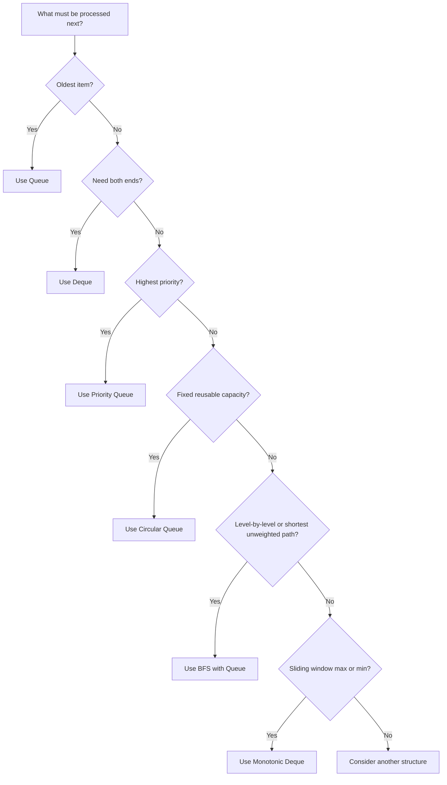

---

# 28. Final Mental Models

## Queue

> A queue is a line of people.

```text
Join at the back.
Leave from the front.
```

## BFS

> BFS is a wave expanding outward.

```text
Nearest first.
Then the next nearest.
```

## Level-order traversal

> Take a photograph of the queue before processing a level.

```go
levelSize := len(queue)
```

Process exactly that many nodes.

## Multi-source BFS

> Several fires start spreading at the same time.

Put all starting points into the queue first.

## Circular queue

> The end of the array connects back to the beginning.

```text
next = (current + 1) % capacity
```

## Monotonic deque

> Keep only candidates that still have a chance to win.

For Sliding Window Maximum:

* remove expired candidates from the front
* remove weaker candidates from the back
* the winner is at the front

---

# 29. What You Must Know for Interviews

| Topic            | Essential knowledge                        |
| ---------------- | ------------------------------------------ |
| FIFO             | Add at back, remove from front             |
| Queue complexity | Enqueue and dequeue are `O(1)`             |
| BFS              | Queue-based level-by-level traversal       |
| Graph BFS        | Mark visited while enqueuing               |
| Tree BFS         | Capture `levelSize` before processing      |
| Multi-source BFS | Start with every source in the queue       |
| Deque            | Add and remove from both ends              |
| Monotonic deque  | Maintain useful candidates in sorted order |
| Circular queue   | Use modulo for wraparound                  |
| Priority queue   | Usually implemented with a heap            |
| Shortest path    | BFS for unweighted graphs                  |

---

# 30. Recommended Practice Order

1. Implement Queue
2. Binary Tree Level Order Traversal
3. Number of Islands
4. Rotting Oranges
5. Design Circular Queue
6. Implement Queue Using Stacks
7. Open the Lock
8. Sliding Window Maximum
9. Shortest Subarray With Sum at Least K
10. 0-1 BFS problems

The main interview progression is:

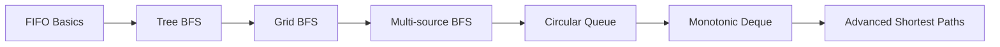
