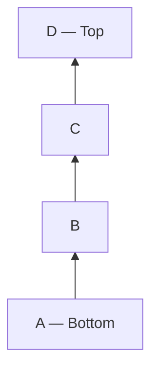
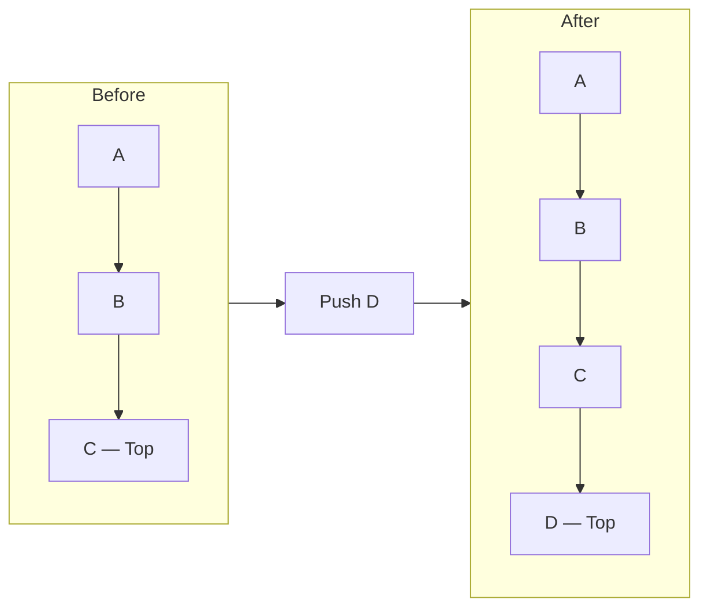
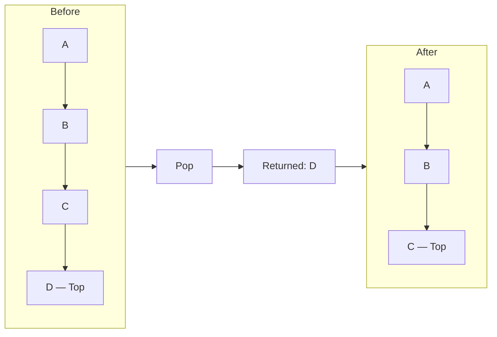
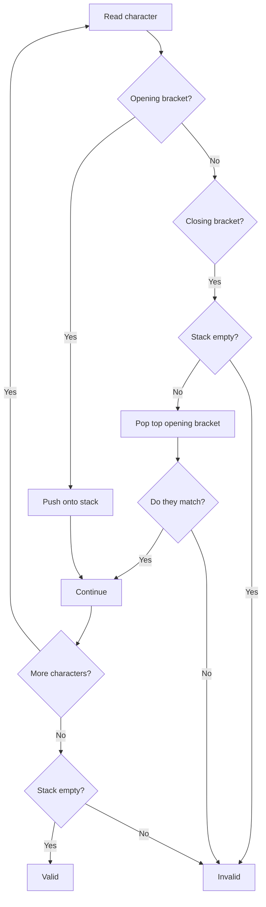
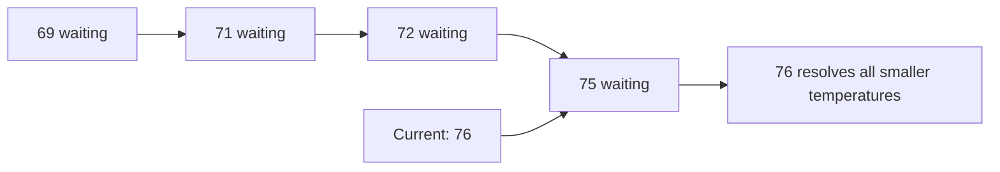
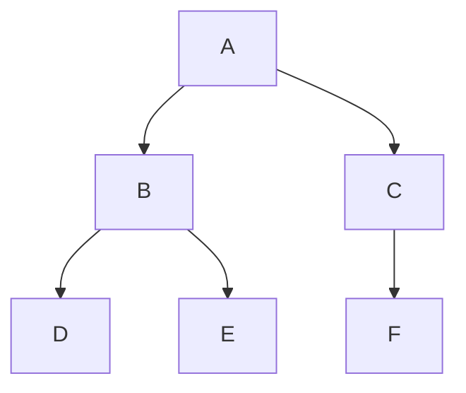
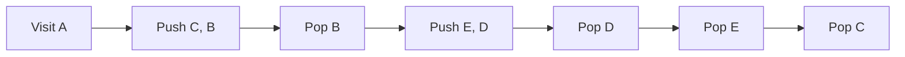
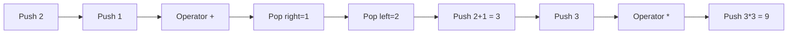
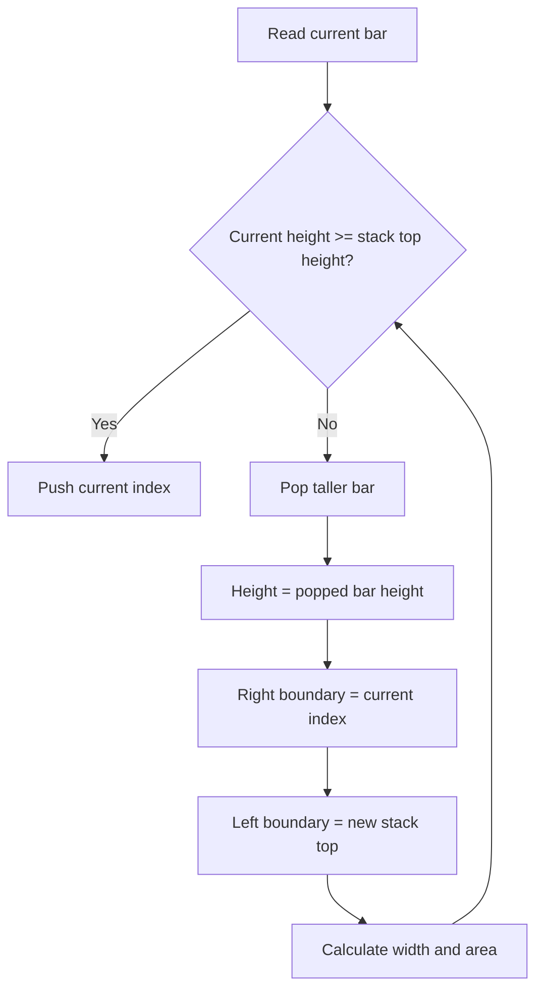

# Stack — Explained Like You Are Five

Imagine a pile of plates.

You place a new plate **on top**.

When you need a plate, you take the **top plate first**.

```text
Push plate D

Before:        After:

   C              D  ← top
   B              C
   A              B
                  A
```

You cannot conveniently remove plate **A** without first removing **D**, **C**, and **B**.

This behaviour is called:

> **LIFO — Last In, First Out**

The last item inserted is the first item removed.

---

# 1. What Is a Stack?

A stack is a data structure where insertion and removal happen from one end called the **top**.



The main operations are:

| Operation          | Meaning                                  |
| ------------------ | ---------------------------------------- |
| `push(x)`          | Add `x` to the top                       |
| `pop()`            | Remove and return the top item           |
| `peek()` / `top()` | Look at the top item without removing it |
| `isEmpty()`        | Check whether the stack is empty         |
| `size()`           | Number of items in the stack             |

---

# 2. Push and Pop

## Push

Push means placing an item on top.



## Pop

Pop removes the item at the top.



---

# 3. Why Do We Need a Stack?

A stack is useful whenever the most recent unfinished thing must be handled first.

## Real-life examples

### Undo

Suppose you perform:

```text
Type A
Type B
Delete C
Change font
```

When you press Undo, the most recent action—`Change font`—is reversed first.

```text
Stack:

Change font  ← undo first
Delete C
Type B
Type A
```

### Browser Back button

```text
Google
YouTube
Wikipedia
GitHub ← current page
```

Pressing Back returns to Wikipedia first.

### Function calls

When one function calls another function, the program remembers where to return.

```text
main()
  calls process()
    calls validate()
```

`validate()` finishes first, then `process()`, then `main()`.

### Nested structures

Stacks help process things that open and close:

```text
( )
[ ]
{ }
HTML tags
Function calls
Nested expressions
```

---

# 4. The Main Mental Model

Remember this sentence:

> **A stack stores unfinished work.**

When something starts, push it.

When something finishes, pop it.

Examples:

| Problem               | Push                | Pop                               |
| --------------------- | ------------------- | --------------------------------- |
| Parentheses           | Opening bracket     | Matching closing bracket          |
| DFS                   | Node to visit later | Node currently being visited      |
| Expression evaluation | Number/result       | Operands used by operator         |
| Monotonic stack       | Candidate answer    | Candidate that can no longer help |
| Undo                  | New action          | Action being undone               |
| Function calls        | New function call   | Completed function                |

Another useful question is:

> “Do I need to remember the most recent thing first?”

If yes, consider a stack.

---

# 5. How Is a Stack Implemented?

A stack can be implemented using:

1. An array or dynamic array
2. A linked list

In Go, stacks are commonly implemented using a **slice**.

```go
stack := []int{}
```

## Push

```go
stack = append(stack, 10)
stack = append(stack, 20)
stack = append(stack, 30)
```

The stack becomes:

```text
[10, 20, 30]
         ↑
        top
```

## Peek

```go
top := stack[len(stack)-1]
```

## Pop

```go
top := stack[len(stack)-1]
stack = stack[:len(stack)-1]
```

Complete example:

```go
package main

import "fmt"

func main() {
	stack := []int{}

	// Push
	stack = append(stack, 10)
	stack = append(stack, 20)
	stack = append(stack, 30)

	// Peek
	fmt.Println("Top:", stack[len(stack)-1]) // 30

	// Pop
	top := stack[len(stack)-1]
	stack = stack[:len(stack)-1]

	fmt.Println("Removed:", top) // 30
	fmt.Println("Stack:", stack) // [10 20]
}
```

---

# 6. Time and Space Complexity

| Operation | Array-backed stack |
| --------- | -----------------: |
| Push      |   `O(1)` amortized |
| Pop       |             `O(1)` |
| Peek      |             `O(1)` |
| Is empty  |             `O(1)` |
| Search    |             `O(n)` |
| Space     |             `O(n)` |

## Why is push “amortized O(1)”?

Most pushes simply place the new element at the end.

```text
[10, 20, _, _]
         ↑ add 30
```

That is `O(1)`.

But occasionally, the underlying array becomes full. The system must:

1. Allocate a larger array.
2. Copy all existing elements.
3. Add the new element.

That particular push may take `O(n)`.

However, resizing happens infrequently, so across many pushes, the average cost is approximately `O(1)`.

---

# 7. Stack Versus Queue

This is a common interview question.

## Stack

```text
Last In, First Out

Push:  A, B, C
Pop:   C, B, A
```

## Queue

```text
First In, First Out

Enqueue: A, B, C
Dequeue: A, B, C
```

| Data structure | Behaviour | Mental model           |
| -------------- | --------- | ---------------------- |
| Stack          | LIFO      | Pile of plates         |
| Queue          | FIFO      | People waiting in line |

---

# 8. Pattern 1: Parentheses Matching

Example:

```text
([]{})
```

Every closing bracket must match the most recent unmatched opening bracket.

That is exactly LIFO behaviour.



## Example walkthrough

Input:

```text
([{}])
```

| Character | Action  | Stack   |
| --------- | ------- | ------- |
| `(`       | Push    | `(`     |
| `[`       | Push    | `( [`   |
| `{`       | Push    | `( [ {` |
| `}`       | Pop `{` | `( [`   |
| `]`       | Pop `[` | `(`     |
| `)`       | Pop `(` | Empty   |

The final stack is empty, so the expression is valid.

## Go solution

```go
func isValid(s string) bool {
	stack := make([]rune, 0, len(s))

	matching := map[rune]rune{
		')': '(',
		']': '[',
		'}': '{',
	}

	for _, ch := range s {
		switch ch {
		case '(', '[', '{':
			stack = append(stack, ch)

		case ')', ']', '}':
			if len(stack) == 0 {
				return false
			}

			top := stack[len(stack)-1]
			stack = stack[:len(stack)-1]

			if top != matching[ch] {
				return false
			}
		}
	}

	return len(stack) == 0
}
```

Complexity:

```text
Time:  O(n)
Space: O(n)
```

---

# 9. Pattern 2: Monotonic Stack

A monotonic stack keeps elements in increasing or decreasing order.

It is commonly used for questions involving:

* Next greater element
* Next smaller element
* Previous greater element
* Previous smaller element
* Daily Temperatures
* Largest Rectangle in Histogram
* Stock Span

## Mental model

> The stack stores candidates that are still waiting for an answer.

Suppose the temperatures are:

```text
[73, 74, 75, 71, 69, 72, 76, 73]
```

At temperature `76`, several previous days finally find a warmer day.



## Why store indices instead of values?

For Daily Temperatures, the answer is the number of days waited:

```text
currentIndex - previousIndex
```

Therefore, store indices.

---

# 10. Daily Temperatures

Problem:

> For every day, return how many days must pass before a warmer temperature.

Input:

```text
[73, 74, 75, 71, 69, 72, 76, 73]
```

Output:

```text
[1, 1, 4, 2, 1, 1, 0, 0]
```

## Algorithm

Maintain a stack of indices whose temperatures are in decreasing order.

For every temperature:

1. Compare it with the temperature at the stack’s top.
2. While the current temperature is warmer:

   * Pop the previous index.
   * Calculate the distance.
3. Push the current index.

```go
func dailyTemperatures(temperatures []int) []int {
	result := make([]int, len(temperatures))
	stack := []int{} // Stores indices

	for current := 0; current < len(temperatures); current++ {
		for len(stack) > 0 {
			previous := stack[len(stack)-1]

			if temperatures[current] <= temperatures[previous] {
				break
			}

			stack = stack[:len(stack)-1]
			result[previous] = current - previous
		}

		stack = append(stack, current)
	}

	return result
}
```

Complexity:

```text
Time:  O(n)
Space: O(n)
```

## Why is it O(n), not O(n²)?

There is a loop inside another loop, but every index is:

* Pushed once
* Popped at most once

Therefore, the total number of stack operations is at most `2n`.

---

# 11. Next Greater Element

Problem:

> For each number, find the first greater number to its right.

Input:

```text
[2, 1, 2, 4, 3]
```

Output:

```text
[4, 2, 4, -1, -1]
```

## Stack idea

The stack stores indices waiting for a greater value.

```go
func nextGreater(nums []int) []int {
	result := make([]int, len(nums))
	for i := range result {
		result[i] = -1
	}

	stack := []int{}

	for i, num := range nums {
		for len(stack) > 0 {
			topIndex := stack[len(stack)-1]

			if nums[topIndex] >= num {
				break
			}

			stack = stack[:len(stack)-1]
			result[topIndex] = num
		}

		stack = append(stack, i)
	}

	return result
}
```

---

# 12. Monotonic Stack Direction Cheat Sheet

| Question asks for | Typical stack    |
| ----------------- | ---------------- |
| Next greater      | Decreasing stack |
| Next smaller      | Increasing stack |
| Previous greater  | Decreasing stack |
| Previous smaller  | Increasing stack |

The direction in which you scan determines whether the answer is “next” or “previous.”

Do not memorize this blindly. Ask:

> Which previous values are still waiting for the current value to resolve them?

---

# 13. Pattern 3: DFS Using a Stack

Depth-First Search explores one path as deeply as possible before returning.

Example tree:



Possible DFS order:

```text
A → B → D → E → C → F
```

## Why does DFS use a stack?

When visiting `A`, you need to remember that `C` must be visited later.

When visiting `B`, you must remember that `E` must be visited after `D`.

The stack stores work for later.



## Iterative DFS

```go
func dfs(graph map[int][]int, start int) []int {
	stack := []int{start}
	visited := map[int]bool{}
	order := []int{}

	for len(stack) > 0 {
		node := stack[len(stack)-1]
		stack = stack[:len(stack)-1]

		if visited[node] {
			continue
		}

		visited[node] = true
		order = append(order, node)

		neighbors := graph[node]

		// Reverse iteration preserves natural left-to-right order.
		for i := len(neighbors) - 1; i >= 0; i-- {
			neighbor := neighbors[i]
			if !visited[neighbor] {
				stack = append(stack, neighbor)
			}
		}
	}

	return order
}
```

Complexity:

```text
Time:  O(V + E)
Space: O(V)
```

---

# 14. Recursion Uses a Hidden Stack

Consider:

```go
func countdown(n int) {
	if n == 0 {
		return
	}

	countdown(n - 1)
}
```

Calling `countdown(3)` creates:

```text
countdown(3)
countdown(2)
countdown(1)
countdown(0)
```

The function calls are stored on the **call stack**.

They return in reverse order:

```text
countdown(0) finishes
countdown(1) finishes
countdown(2) finishes
countdown(3) finishes
```

This is why recursion and explicit stacks often solve the same problems.

| Recursive DFS                  | Iterative DFS                      |
| ------------------------------ | ---------------------------------- |
| Uses call stack                | Uses your own stack                |
| Usually shorter                | More control                       |
| Can cause stack overflow       | Can handle deep graphs more safely |
| State stored in function calls | State stored explicitly            |

---

# 15. Pattern 4: Expression Evaluation

Stacks are useful when operators depend on recently seen numbers.

## Reverse Polish Notation

Input:

```text
["2", "1", "+", "3", "*"]
```

Equivalent expression:

```text
(2 + 1) * 3 = 9
```

## Walkthrough

| Token | Action              | Stack    |
| ----- | ------------------- | -------- |
| `2`   | Push                | `[2]`    |
| `1`   | Push                | `[2, 1]` |
| `+`   | Pop 1 and 2, push 3 | `[3]`    |
| `3`   | Push                | `[3, 3]` |
| `*`   | Pop 3 and 3, push 9 | `[9]`    |



## Important operand order

For subtraction and division:

```text
left operator right
```

The first popped value is the **right operand**.

```go
right := pop()
left := pop()
result := left - right
```

Not:

```go
right - left
```

## Go solution

```go
import "strconv"

func evalRPN(tokens []string) int {
	stack := []int{}

	for _, token := range tokens {
		switch token {
		case "+", "-", "*", "/":
			right := stack[len(stack)-1]
			stack = stack[:len(stack)-1]

			left := stack[len(stack)-1]
			stack = stack[:len(stack)-1]

			var result int

			switch token {
			case "+":
				result = left + right
			case "-":
				result = left - right
			case "*":
				result = left * right
			case "/":
				result = left / right
			}

			stack = append(stack, result)

		default:
			value, err := strconv.Atoi(token)
			if err != nil {
				panic("invalid token")
			}

			stack = append(stack, value)
		}
	}

	return stack[0]
}
```

Complexity:

```text
Time:  O(n)
Space: O(n)
```

---

# 16. Min Stack

A normal stack can return its top in `O(1)`.

A Min Stack must also return the minimum value in `O(1)`.

Required operations:

```text
push(x)  → O(1)
pop()    → O(1)
top()    → O(1)
getMin() → O(1)
```

## Bad approach

Every time `getMin()` is called, scan the entire stack.

```text
getMin(): O(n)
```

That does not satisfy the requirement.

## Better mental model

Every value remembers the minimum value seen below it.

```text
Push 5 → minimum is 5
Push 3 → minimum is 3
Push 7 → minimum is still 3
Push 2 → minimum is 2
```

Store pairs:

```text
(value, minimumSoFar)
```

```text
(2, 2) ← top
(7, 3)
(3, 3)
(5, 5)
```

## Go implementation

```go
type entry struct {
	value int
	min   int
}

type MinStack struct {
	items []entry
}

func Constructor() MinStack {
	return MinStack{
		items: []entry{},
	}
}

func (s *MinStack) Push(value int) {
	minValue := value

	if len(s.items) > 0 {
		currentMin := s.items[len(s.items)-1].min
		if currentMin < minValue {
			minValue = currentMin
		}
	}

	s.items = append(s.items, entry{
		value: value,
		min:   minValue,
	})
}

func (s *MinStack) Pop() {
	s.items = s.items[:len(s.items)-1]
}

func (s *MinStack) Top() int {
	return s.items[len(s.items)-1].value
}

func (s *MinStack) GetMin() int {
	return s.items[len(s.items)-1].min
}
```

Complexity:

```text
Push:   O(1)
Pop:    O(1)
Top:    O(1)
GetMin: O(1)
Space:  O(n)
```

---

# 17. Largest Rectangle in Histogram

This is one of the hardest common stack questions.

Input:

```text
[2, 1, 5, 6, 2, 3]
```

Each number represents the height of a histogram bar.

```text
        █
      █ █
      █ █
      █ █   █
█     █ █ █ █
█ █   █ █ █ █
2 1   5 6 2 3
```

The largest rectangle has area:

```text
Height = 5
Width  = 2
Area   = 10
```

## Core idea

Maintain an increasing stack of bar indices.

When a shorter bar appears, the taller bars cannot extend any further to the right.

That means their maximum rectangle can now be calculated.



## Width calculation

After popping index `p`:

```text
rightBoundary = currentIndex
leftBoundary  = new stack top
```

Width:

```text
currentIndex - leftBoundary - 1
```

If the stack becomes empty:

```text
width = currentIndex
```

## Go solution

```go
func largestRectangleArea(heights []int) int {
	stack := []int{}
	maxArea := 0

	// Add a zero-height bar to flush all remaining bars.
	extended := append(append([]int{}, heights...), 0)

	for i, currentHeight := range extended {
		for len(stack) > 0 &&
			extended[stack[len(stack)-1]] > currentHeight {

			topIndex := stack[len(stack)-1]
			stack = stack[:len(stack)-1]

			height := extended[topIndex]

			width := i
			if len(stack) > 0 {
				width = i - stack[len(stack)-1] - 1
			}

			area := height * width
			if area > maxArea {
				maxArea = area
			}
		}

		stack = append(stack, i)
	}

	return maxArea
}
```

Complexity:

```text
Time:  O(n)
Space: O(n)
```

Again, every index is pushed once and popped once.

---

# 18. The Six Most Important Stack Problems

## 1. Valid Parentheses

**Pattern:** Matching nested structures

```text
Push opening brackets.
Pop when a matching closing bracket appears.
```

Important edge cases:

```text
")"      → invalid
"("      → invalid
"(]"     → invalid
"([])"   → valid
```

---

## 2. Min Stack

**Pattern:** Store additional information with every stack element.

```text
(value, minimumSoFar)
```

Key interview lesson:

> Sometimes a data structure stores both the original value and metadata.

---

## 3. Daily Temperatures

**Pattern:** Monotonic decreasing stack of indices.

```text
The current warmer temperature resolves previous colder temperatures.
```

---

## 4. Next Greater Element

**Pattern:** Store unresolved values or indices.

```text
When a greater value arrives, pop all smaller candidates.
```

---

## 5. Evaluate Reverse Polish Notation

**Pattern:** Push operands, pop operands when an operator appears.

Remember:

```text
right = first pop
left  = second pop
```

---

## 6. Largest Rectangle in Histogram

**Pattern:** Monotonic increasing stack.

```text
A shorter bar tells us that taller bars cannot extend further.
```

This question tests:

* Monotonic stack understanding
* Boundary calculations
* Index management
* Sentinel values

---

# 19. How to Recognize a Stack Problem

Consider a stack when the problem contains one of these signals.

## Signal 1: Nested structures

```text
Parentheses
HTML tags
Directories
Expressions
Function calls
```

## Signal 2: Most recent item matters

```text
Undo
Browser history
Matching opening bracket
```

## Signal 3: “Next greater” or “next smaller”

```text
Next warmer day
Next greater number
Previous smaller bar
```

This often means a monotonic stack.

## Signal 4: Depth-first exploration

```text
Tree DFS
Graph DFS
Backtracking state
```

## Signal 5: Operators and operands

```text
Expression evaluation
Calculator
Postfix notation
Infix conversion
```

## Signal 6: Repeatedly remove useless candidates

```text
While stack top cannot help anymore:
    pop it
```

This strongly suggests a monotonic stack.

---

# 20. Common Stack Mistakes

## Mistake 1: Pop from an empty stack

Bad:

```go
top := stack[len(stack)-1]
```

Safe:

```go
if len(stack) == 0 {
	return
}
```

---

## Mistake 2: Forgetting to remove the element

This only peeks:

```go
top := stack[len(stack)-1]
```

This pops:

```go
top := stack[len(stack)-1]
stack = stack[:len(stack)-1]
```

---

## Mistake 3: Wrong operand order

For:

```text
5 2 -
```

Correct:

```text
5 - 2 = 3
```

First pop gives `2`, not `5`.

---

## Mistake 4: Storing values when indices are needed

Daily Temperatures requires distance:

```text
currentIndex - previousIndex
```

Therefore, store indices.

---

## Mistake 5: Claiming nested loops automatically mean O(n²)

For a monotonic stack:

```text
Each element is pushed once.
Each element is popped once.
```

Therefore, total time is `O(n)`.

---

## Mistake 6: Forgetting unresolved elements

In Next Greater Element, elements left in the stack have no greater element.

Their answer should usually remain:

```text
-1
```

---

# 21. General Stack Template in Go

```go
stack := []int{}

for _, value := range values {
	// Pop elements that are no longer useful.
	for len(stack) > 0 && shouldPop(stack[len(stack)-1], value) {
		top := stack[len(stack)-1]
		stack = stack[:len(stack)-1]

		_ = top // Process popped value
	}

	// Push current value.
	stack = append(stack, value)
}
```

## Index-based monotonic stack template

```go
stack := []int{}

for i := 0; i < len(nums); i++ {
	for len(stack) > 0 &&
		nums[i] > nums[stack[len(stack)-1]] {

		previousIndex := stack[len(stack)-1]
		stack = stack[:len(stack)-1]

		// Current index resolves previousIndex.
		_ = previousIndex
	}

	stack = append(stack, i)
}
```

---

# 22. Interview Mental Framework

When you see a possible stack problem, ask these questions in order.

## Question 1: What does the stack represent?

Examples:

```text
Unmatched opening brackets
Nodes waiting to be visited
Indices waiting for a greater value
Intermediate calculation results
```

## Question 2: What do I push?

```text
Value?
Index?
Node?
Pair of value and metadata?
```

## Question 3: When do I pop?

```text
When brackets match?
When the current value is greater?
When a node is visited?
When an operator arrives?
```

## Question 4: What does popping mean?

```text
A match was found.
An answer was found.
A calculation can be completed.
A candidate is no longer useful.
```

## Question 5: What remains after processing?

```text
Invalid brackets?
Elements with no greater value?
Nodes not yet visited?
```

---

# 23. Mock Interview Questions

## Conceptual Questions

### Question 1

What is the defining property of a stack?

**Expected answer:**

A stack follows LIFO: the last element inserted is the first element removed.

---

### Question 2

What is the time complexity of push, pop, and peek?

**Expected answer:**

```text
Push: O(1) amortized
Pop:  O(1)
Peek: O(1)
```

---

### Question 3

Why is DFS naturally implemented with a stack?

**Expected answer:**

DFS explores the most recently discovered path first. The stack remembers nodes that should be visited later.

---

### Question 4

Why does BFS use a queue instead of a stack?

**Expected answer:**

BFS processes the earliest discovered nodes first, which is FIFO behaviour. DFS processes the most recently discovered nodes first, which is LIFO behaviour.

---

### Question 5

How does recursion relate to a stack?

**Expected answer:**

Every recursive call creates a call-stack frame containing local variables, parameters, and a return address. The most recent call finishes first.

---

### Question 6

What is a monotonic stack?

**Expected answer:**

A monotonic stack maintains its elements in increasing or decreasing order by removing elements that violate the required order.

---

### Question 7

Why are monotonic-stack algorithms often O(n)?

**Expected answer:**

Each element is pushed at most once and popped at most once, so the total number of operations is linear.

---

### Question 8

When should you store indices instead of values?

**Expected answer:**

Store indices when the answer depends on position, distance, width, or access to neighbouring boundaries.

---

# 24. Coding Interview Progression

A reasonable stack preparation order is:

## Beginner

1. Implement Stack Using Array
2. Valid Parentheses
3. Baseball Game
4. Remove All Adjacent Duplicates
5. Backspace String Compare

## Intermediate

6. Min Stack
7. Evaluate Reverse Polish Notation
8. Decode String
9. Simplify Path
10. Asteroid Collision
11. Daily Temperatures
12. Next Greater Element

## Advanced

13. Largest Rectangle in Histogram
14. Maximal Rectangle
15. Trapping Rain Water using stack
16. Basic Calculator
17. Remove K Digits
18. Sum of Subarray Minimums

---

# 25. Mock Coding Questions

## Mock Question 1: Remove Adjacent Duplicates

Input:

```text
"abbaca"
```

Output:

```text
"ca"
```

Reasoning:

```text
a → push
b → push
b → matches top, pop
a → matches top, pop
c → push
a → push
```

Final stack:

```text
c a
```

---

## Mock Question 2: Simplify Unix Path

Input:

```text
"/a/./b/../../c/"
```

Output:

```text
"/c"
```

Rules:

```text
"."  → ignore
".." → pop previous directory
name → push directory
```

This is a direct stack problem.

---

## Mock Question 3: Asteroid Collision

Input:

```text
[5, 10, -5]
```

Output:

```text
[5, 10]
```

The stack stores surviving asteroids.

A collision is possible when:

```text
stack top moves right: positive
current moves left:    negative
```

---

## Mock Question 4: Decode String

Input:

```text
"3[a2[c]]"
```

Output:

```text
"accaccacc"
```

The stack remembers:

* Previous string
* Repetition count
* Nested context

---

# 26. One-Minute Stack Cheat Sheet

```text
STACK = LIFO

Push:
    Add to top

Pop:
    Remove from top

Peek:
    Read top

Complexity:
    Push  O(1) amortized
    Pop   O(1)
    Peek  O(1)
    Space O(n)

Use stack for:
    Nested structures
    Undo/history
    DFS
    Expression evaluation
    Next greater/smaller
    Monotonic-stack problems

Monotonic-stack rule:
    Each item is pushed once and popped once
    Therefore total time is usually O(n)

Important question:
    Does the most recently seen unfinished item need attention first?
```

# Final Mental Model

Think of a stack as a pile of unfinished boxes:

```text
Start task A → push A
Start task B → push B
Start task C → push C

Finish C → pop C
Finish B → pop B
Finish A → pop A
```

The key rule is:

> **The last unfinished thing becomes the first thing you finish.**
