# Strings — Explained Like You Are Five

Imagine you have letter blocks:

```text
H  E  L  L  O
```

When you arrange these blocks in a line, you get a **string**:

```text
"HELLO"
```

A string is simply an **ordered sequence of characters**.

Characters can include:

```text
Letters:      a b c A B C
Numbers:      1 2 3
Symbols:      @ # $
Whitespace:   space, tab, newline
Unicode:      中 é 😀
```

---

## 1. What Is a String?

Consider:

```text
"APPLE"
```

You can imagine it as an array of characters:

```text
Index:       0    1    2    3    4
Character:   A    P    P    L    E
```

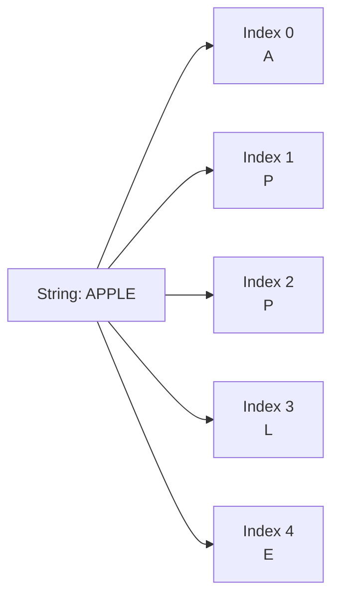

Like arrays:

* Characters have positions.
* Positions usually start at `0`.
* You can scan from left to right.
* You can use two pointers.
* You can use sliding windows.

Unlike normal arrays, strings are often **immutable**.

Immutable means:

> Once created, the original string cannot be changed directly.

For example, in Go:

```go
s := "cat"

// This is not allowed:
// s[0] = 'b'
```

To produce `"bat"`, you create a new value.

---

# 2. Why Do We Need Strings?

Computers need strings to represent text:

```text
Username:       "abhishek"
Email:          "user@example.com"
Password:       "secret123"
URL:            "https://example.com"
Search query:   "kubernetes interview"
File name:      "resume.pdf"
Log message:    "server failed"
```

String problems test whether you understand:

* Arrays
* Hash maps
* Two pointers
* Sliding windows
* Sorting
* Recursion
* Dynamic programming
* Tries

That is why strings are common in coding interviews.

---

# 3. The Basic Mental Model

Think of a string as a **train of character compartments**.

```text
┌───┬───┬───┬───┬───┐
│ H │ E │ L │ L │ O │
└───┴───┴───┴───┴───┘
  0   1   2   3   4
```

You can:

* Look inside a compartment.
* Move from one compartment to another.
* Compare two compartments.
* Count what is inside.
* Examine a continuous group of compartments.

But you often cannot replace a compartment directly because strings are immutable.

---

# 4. How Strings Are Stored

A computer does not really store `"ABC"` as visual letters. It stores numbers representing those characters.

For ASCII:

```text
A → 65
B → 66
C → 67
```

Conceptually:

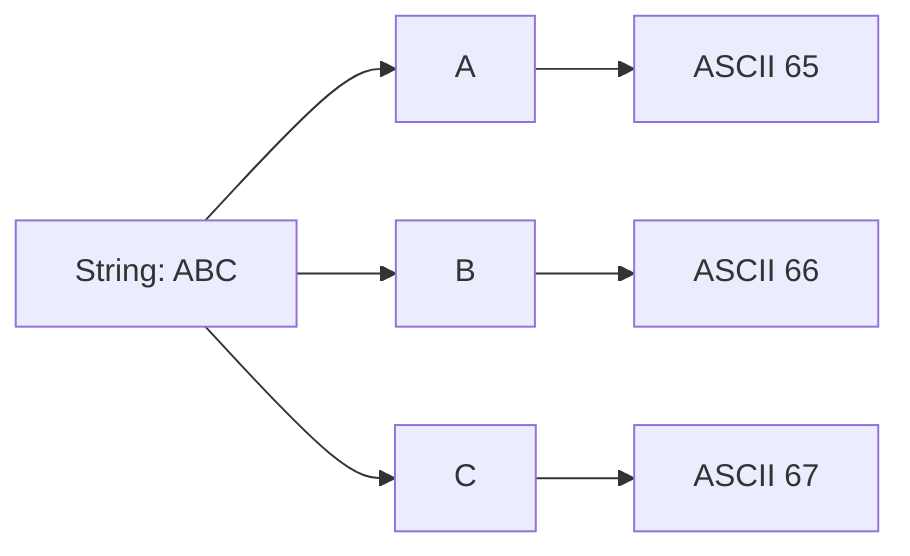

## ASCII versus Unicode

ASCII handles basic English characters.

Unicode handles characters from many languages and symbols:

```text
A
é
中
ह
😀
```

This matters especially in Go.

## Go-specific rule: bytes versus runes

Go strings contain bytes, usually UTF-8 encoded.

```go
s := "hello"

fmt.Println(len(s)) // 5 bytes
fmt.Println(s[0])   // 104, the byte value for 'h'
```

But Unicode characters can use multiple bytes:

```go
s := "é"

fmt.Println(len(s))         // 2 bytes
fmt.Println(len([]rune(s))) // 1 character
```

Mental model:

```text
byte  = one stored unit
rune  = one Unicode code point
```

For most coding interview questions, the interviewer assumes:

```text
lowercase English letters: a-z
```

Confirm that assumption before coding.

---

# 5. String Time Complexity

Let `n` be the number of characters in the string.

| Operation                      |       Typical complexity |
| ------------------------------ | -----------------------: |
| Access a byte by index         |                   `O(1)` |
| Scan the whole string          |                   `O(n)` |
| Compare two strings            |                   `O(n)` |
| Search for one character       |                   `O(n)` |
| Create a frequency map         |                   `O(n)` |
| Reverse a string               |                   `O(n)` |
| Concatenate strings            |       Usually `O(n + m)` |
| Sort characters                |             `O(n log n)` |
| Check palindrome               |                   `O(n)` |
| Generate every substring       |       `O(n²)` substrings |
| Copy every generated substring | Up to `O(n³)` total work |

## Why is scanning `O(n)`?

For:

```text
"HELLO"
```

You inspect each character once:

```text
H → E → L → L → O
```

For `n` characters, you perform approximately `n` operations.

Therefore:

```text
Time = O(n)
```

## Why can repeated concatenation become expensive?

Consider:

```go
result := ""

for _, word := range words {
    result += word
}
```

Strings are immutable. Each concatenation may create a new string and copy the old content.

Conceptually:

```text
""
"A"
"AB"
"ABC"
"ABCD"
```

The copying work becomes:

```text
1 + 2 + 3 + ... + n
```

That is approximately:

```text
n² / 2
```

Therefore, repeated concatenation can become:

```text
O(n²)
```

Use `strings.Builder` instead.

```go
var builder strings.Builder

for _, word := range words {
    builder.WriteString(word)
}

result := builder.String()
```

This is usually close to:

```text
O(n)
```

---

# 6. The Six Most Important String Patterns

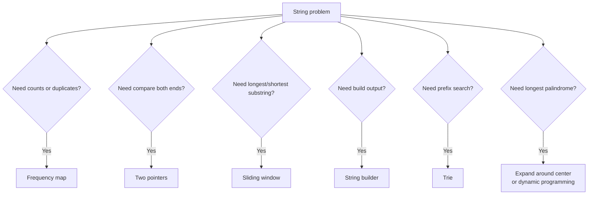

The most important mental associations are:

| Clue in question                 | Think about                    |
| -------------------------------- | ------------------------------ |
| Anagram, counts, duplicates      | Frequency map                  |
| Palindrome                       | Two pointers                   |
| Longest/shortest substring       | Sliding window                 |
| Many concatenations              | String builder                 |
| Prefix, dictionary, autocomplete | Trie                           |
| Palindromic substring            | Expand around center           |
| Group strings by characters      | Frequency signature or sorting |

---

# 7. Pattern 1: Character Frequency

Suppose you have:

```text
"banana"
```

Count each character:

```text
b → 1
a → 3
n → 2
```

This is called a **frequency map**.

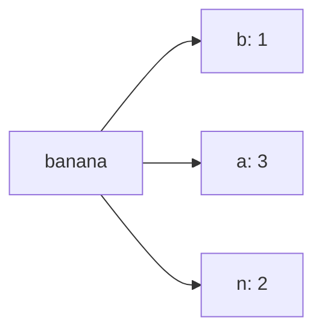

## Mental model: Inventory

Imagine a shopkeeper counting products:

```text
Apple  → 3
Banana → 2
Orange → 1
```

For strings, the products are characters.

```text
a → 3
b → 2
c → 1
```

## When to use it

Use frequency counting for:

* Anagrams
* Duplicate characters
* First unique character
* Character replacement
* Grouping anagrams
* Minimum window substring

## Go example

```go
func countCharacters(s string) map[rune]int {
    frequency := make(map[rune]int)

    for _, ch := range s {
        frequency[ch]++
    }

    return frequency
}
```

Complexity:

```text
Time:  O(n)
Space: O(k)
```

Where `k` is the number of distinct characters.

For lowercase English letters, `k ≤ 26`, so the auxiliary space may be considered `O(1)`.

---

# 8. Valid Anagram

Two strings are anagrams when they contain the same characters with the same frequencies.

```text
"listen"
"silent"
```

Both contain:

```text
l:1
i:1
s:1
t:1
e:1
n:1
```

## Approach 1: Sort both strings

```text
listen → eilnst
silent → eilnst
```

If the sorted versions match, they are anagrams.

Complexity:

```text
Time:  O(n log n)
Space: depends on sorting implementation
```

## Approach 2: Count characters

For every character in `s`:

```text
count++
```

For every character in `t`:

```text
count--
```

At the end, every count must be zero.

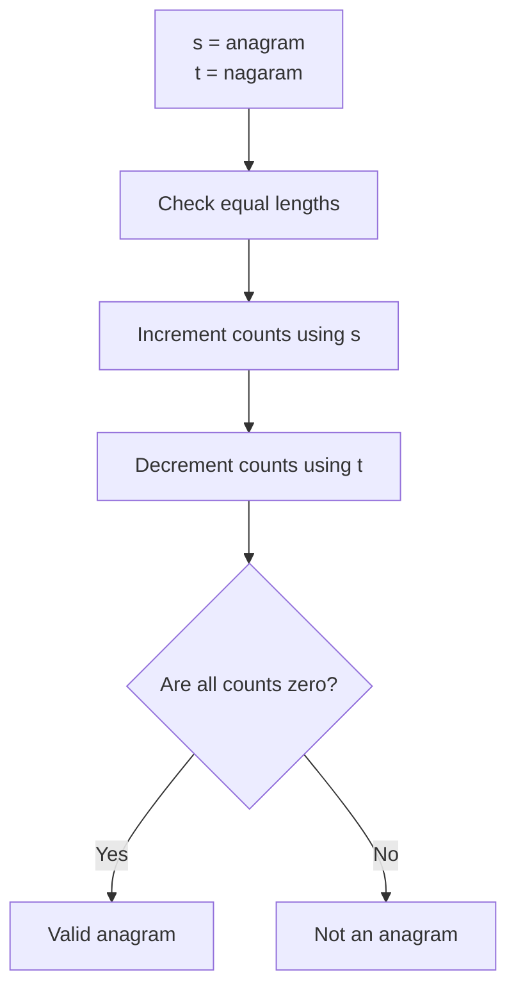

## Go solution

Assumption: lowercase English letters.

```go
func isAnagram(s, t string) bool {
    if len(s) != len(t) {
        return false
    }

    counts := [26]int{}

    for i := 0; i < len(s); i++ {
        counts[s[i]-'a']++
        counts[t[i]-'a']--
    }

    for _, count := range counts {
        if count != 0 {
            return false
        }
    }

    return true
}
```

Complexity:

```text
Time:  O(n)
Space: O(1)
```

---

# 9. Pattern 2: String Scanning

String scanning means checking characters one by one.

```text
"interview"
```

```text
i → n → t → e → r → v → i → e → w
```

## Example: Find the first occurrence of a character

```go
func findCharacter(s string, target byte) int {
    for i := 0; i < len(s); i++ {
        if s[i] == target {
            return i
        }
    }

    return -1
}
```

Complexity:

```text
Time:  O(n)
Space: O(1)
```

## Substring search

Suppose:

```text
Text:    "hello world"
Pattern: "world"
```

You want to find where `"world"` starts.

### Naive approach

Try matching the pattern at every possible starting position.

```text
hello world
world
 ^ no

hello world
 world
  ^ no

...

hello world
      world
      ^ match
```

If text length is `n` and pattern length is `m`:

```text
Time: O(n × m)
```

Advanced algorithms include:

* KMP: `O(n + m)`
* Rabin–Karp: average `O(n + m)`
* Z algorithm: `O(n + m)`

For most general interviews, understand the naive method first. Learn KMP when advanced substring matching is part of the expected syllabus.

---

# 10. Pattern 3: Two Pointers

Two pointers means maintaining two positions.

For palindrome problems:

* One pointer starts at the beginning.
* One pointer starts at the end.
* They move toward each other.

```text
R A C E C A R
↑           ↑
L           R
```

Compare:

```text
R == R
A == A
C == C
E is the middle
```

Therefore, it is a palindrome.

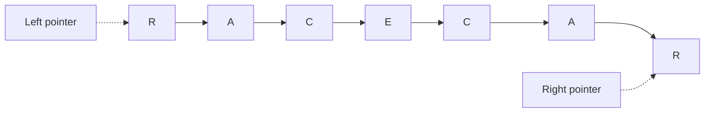

## Mental model: Two guards

Imagine two guards checking a hallway:

* One starts at the left door.
* One starts at the right door.
* They compare what they see.
* Both walk toward the middle.

If every pair matches, the string is symmetrical.

---

# 11. Valid Palindrome

A palindrome reads the same forward and backward.

```text
"racecar"
"madam"
"level"
```

The interview problem often says:

* Ignore punctuation.
* Ignore spaces.
* Ignore uppercase/lowercase differences.

Example:

```text
"A man, a plan, a canal: Panama"
```

After cleaning:

```text
amanaplanacanalpanama
```

This is a palindrome.

## Go solution

This version assumes ASCII input.

```go
func isPalindrome(s string) bool {
    left := 0
    right := len(s) - 1

    for left < right {
        for left < right && !isAlphaNumeric(s[left]) {
            left++
        }

        for left < right && !isAlphaNumeric(s[right]) {
            right--
        }

        if toLower(s[left]) != toLower(s[right]) {
            return false
        }

        left++
        right--
    }

    return true
}

func isAlphaNumeric(ch byte) bool {
    return (ch >= 'a' && ch <= 'z') ||
        (ch >= 'A' && ch <= 'Z') ||
        (ch >= '0' && ch <= '9')
}

func toLower(ch byte) byte {
    if ch >= 'A' && ch <= 'Z' {
        return ch + ('a' - 'A')
    }

    return ch
}
```

Complexity:

```text
Time:  O(n)
Space: O(1)
```

Notice that we do not need to construct a cleaned string.

That saves additional memory.

---

# 12. Pattern 4: Sliding Window

Sliding window is the most important string interview pattern.

Use it when the question asks about a:

* Substring
* Contiguous section
* Longest substring
* Shortest substring
* Window satisfying a condition

## Mental model: Camera frame

Imagine placing a camera frame over part of a string.

```text
a b c a b c b b
└─────┘
 window
```

You can:

* Expand the right side.
* Shrink the left side.
* Track information inside the frame.

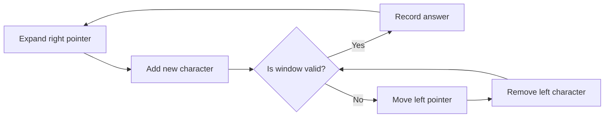

## Generic sliding-window template

```go
left := 0

for right := 0; right < len(s); right++ {
    // Add s[right] to the window.

    for windowIsInvalid {
        // Remove s[left] from the window.
        left++
    }

    // Update the answer.
}
```

The difficult part is defining:

```text
What makes the window valid or invalid?
```

---

# 13. Longest Substring Without Repeating Characters

Input:

```text
"abcabcbb"
```

The longest substring without repetition is:

```text
"abc"
```

Answer:

```text
3
```

## Brute force

Generate every substring and check whether it contains duplicate characters.

Number of substrings:

```text
O(n²)
```

Checking each substring can take `O(n)`.

Total:

```text
O(n³)
```

This is too slow.

## Sliding-window solution

Start with an empty window:

```text
a b c a b c b b
↑
L,R
```

Expand right:

```text
[a]
[a b]
[a b c]
```

When another `a` arrives:

```text
[a b c a]
```

The window is invalid because `a` appears twice.

Move `left` past the previous `a`:

```text
a [b c a]
```

Now the window is valid again.

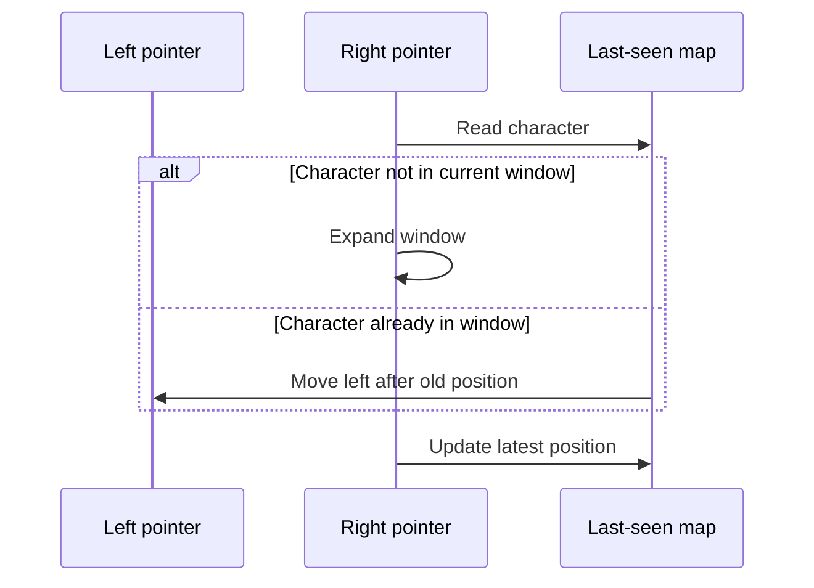

## Go solution

Assumption: ASCII characters.

```go
func lengthOfLongestSubstring(s string) int {
    lastSeen := make(map[byte]int)

    left := 0
    best := 0

    for right := 0; right < len(s); right++ {
        ch := s[right]

        if previousIndex, found := lastSeen[ch]; found &&
            previousIndex >= left {
            left = previousIndex + 1
        }

        lastSeen[ch] = right

        windowLength := right - left + 1
        if windowLength > best {
            best = windowLength
        }
    }

    return best
}
```

Complexity:

```text
Time:  O(n)
Space: O(k)
```

## Why is this `O(n)` and not `O(n²)`?

There are two pointers, but neither pointer moves backward.

```text
right moves at most n times
left moves at most n times
```

Therefore, total pointer movement is at most approximately:

```text
2n
```

Ignore the constant:

```text
O(2n) = O(n)
```

This is a major interview concept:

> Nested-looking pointer movement does not automatically mean `O(n²)`.

---

# 14. Fixed-Size versus Variable-Size Sliding Window

## Fixed-size window

Example:

> Find the maximum number of vowels in any substring of length `k`.

Window size always stays `k`.

```text
a b c i i d e
└─────┘
  k = 3
```

Typical template:

```go
for right := 0; right < len(s); right++ {
    add(s[right])

    if right-left+1 > k {
        remove(s[left])
        left++
    }

    if right-left+1 == k {
        updateAnswer()
    }
}
```

## Variable-size window

Example:

> Find the longest substring without repeated characters.

The window grows and shrinks depending on validity.

```go
for right := 0; right < len(s); right++ {
    add(s[right])

    for windowIsInvalid {
        remove(s[left])
        left++
    }

    updateAnswer()
}
```

---

# 15. Minimum Window Substring

Given:

```text
s = "ADOBECODEBANC"
t = "ABC"
```

Find the shortest substring of `s` containing all characters from `t`.

Answer:

```text
"BANC"
```

## Mental model: Shopping list

You need:

```text
A × 1
B × 1
C × 1
```

You walk through the string, adding characters to your basket.

Once the basket contains everything:

1. Record the current window.
2. Remove characters from the left.
3. Continue shrinking until an important character is lost.
4. Expand again.

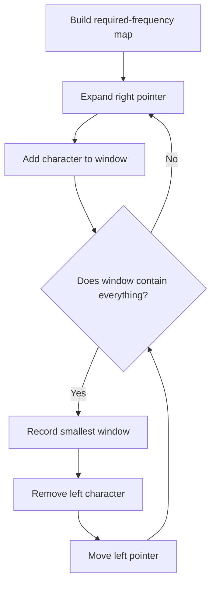

## Go solution

Assumption: byte-based input.

```go
func minWindow(s, t string) string {
    if len(t) == 0 || len(s) < len(t) {
        return ""
    }

    required := [256]int{}

    for i := 0; i < len(t); i++ {
        required[t[i]]++
    }

    remaining := len(t)
    left := 0

    bestStart := 0
    bestLength := len(s) + 1

    for right := 0; right < len(s); right++ {
        rightCharacter := s[right]

        if required[rightCharacter] > 0 {
            remaining--
        }

        required[rightCharacter]--

        for remaining == 0 {
            currentLength := right - left + 1

            if currentLength < bestLength {
                bestStart = left
                bestLength = currentLength
            }

            leftCharacter := s[left]
            required[leftCharacter]++

            if required[leftCharacter] > 0 {
                remaining++
            }

            left++
        }
    }

    if bestLength == len(s)+1 {
        return ""
    }

    return s[bestStart : bestStart+bestLength]
}
```

Complexity:

```text
Time:  O(n + m)
Space: O(1) for a fixed 256-byte alphabet
```

This is considered a difficult sliding-window problem.

---

# 16. Pattern 5: Efficient String Construction

Suppose you want to combine:

```text
["hello", " ", "world"]
```

Avoid repeatedly doing:

```go
result := ""

for _, part := range parts {
    result += part
}
```

Use `strings.Builder`.

```go
func joinParts(parts []string) string {
    var builder strings.Builder

    for _, part := range parts {
        builder.WriteString(part)
    }

    return builder.String()
}
```

## Mental model: Construction tray

Repeated concatenation is like:

1. Building a small house.
2. Destroying it.
3. Building a slightly larger house.
4. Destroying it again.
5. Repeating this process.

A builder is like preparing one construction area and adding materials to it.

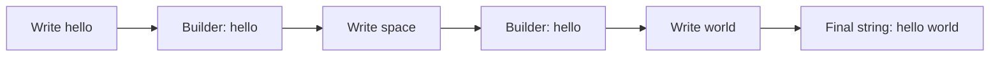

Useful Go methods:

```go
var builder strings.Builder

builder.Grow(100)
builder.WriteByte('A')
builder.WriteRune('界')
builder.WriteString("hello")

result := builder.String()
```

---

# 17. String Compression

Input:

```text
a a b b c c c
```

Compressed result:

```text
a 2 b 2 c 3
```

Mental process:

1. Find a group of identical characters.
2. Count the group.
3. Write the character.
4. Write the count when the count is greater than `1`.

Use two pointers:

```text
read  → examines input
write → writes compressed output
```

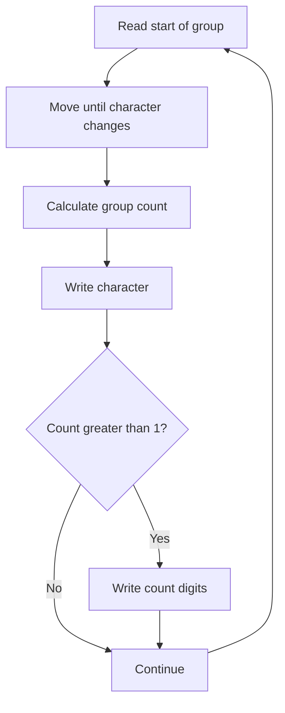

## Go solution

```go
func compress(chars []byte) int {
    write := 0
    read := 0

    for read < len(chars) {
        current := chars[read]
        groupStart := read

        for read < len(chars) && chars[read] == current {
            read++
        }

        count := read - groupStart

        chars[write] = current
        write++

        if count > 1 {
            countString := strconv.Itoa(count)

            for i := 0; i < len(countString); i++ {
                chars[write] = countString[i]
                write++
            }
        }
    }

    return write
}
```

Complexity:

```text
Time:  O(n)
Space: O(1), excluding temporary count conversion
```

---

# 18. Pattern 6: Grouping Strings by Signature

Consider:

```text
["eat", "tea", "tan", "ate", "nat", "bat"]
```

Anagram groups are:

```text
["eat", "tea", "ate"]
["tan", "nat"]
["bat"]
```

We need a common **signature** for all anagrams.

## Signature option 1: Sorted characters

```text
eat → aet
tea → aet
ate → aet
```

Group by the sorted result.

Complexity for `m` strings of average length `k`:

```text
O(m × k log k)
```

## Signature option 2: Character counts

```text
eat → a:1, e:1, t:1
tea → a:1, e:1, t:1
ate → a:1, e:1, t:1
```

For lowercase English letters, use a `[26]int` array as a map key.

## Go solution

```go
func groupAnagrams(words []string) [][]string {
    groups := make(map[[26]int][]string)

    for _, word := range words {
        signature := [26]int{}

        for i := 0; i < len(word); i++ {
            signature[word[i]-'a']++
        }

        groups[signature] = append(groups[signature], word)
    }

    result := make([][]string, 0, len(groups))

    for _, group := range groups {
        result = append(result, group)
    }

    return result
}
```

Complexity:

```text
Time:  O(m × k)
Space: O(m × k)
```

This solution assumes lowercase English letters.

---

# 19. Longest Palindromic Substring

Input:

```text
"babad"
```

Possible answer:

```text
"bab"
```

Another valid answer:

```text
"aba"
```

## Important distinction

### Subsequence

Characters do not need to be next to one another.

```text
"abcde"
"a  c  e"
```

### Substring

Characters must be continuous.

```text
"abcde"
 "bcd"
```

This problem asks for a **substring**.

---

## Expand Around Center

Every palindrome has a center.

Odd-length palindrome:

```text
r a c e c a r
      ↑
    center
```

Even-length palindrome:

```text
a b b a
   ↑
 center gap
```

For every index, try:

1. Odd center: `(i, i)`
2. Even center: `(i, i+1)`

Expand while both characters match.

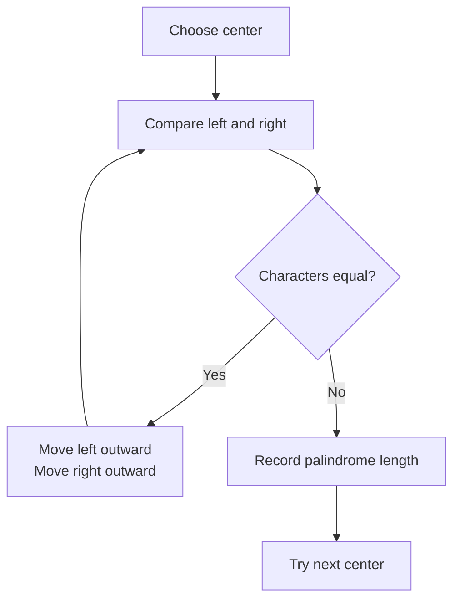

## Go solution

```go
func longestPalindrome(s string) string {
    if len(s) < 2 {
        return s
    }

    bestStart := 0
    bestEnd := 0

    expand := func(left, right int) (int, int) {
        for left >= 0 &&
            right < len(s) &&
            s[left] == s[right] {
            left--
            right++
        }

        return left + 1, right - 1
    }

    for center := 0; center < len(s); center++ {
        oddStart, oddEnd := expand(center, center)

        if oddEnd-oddStart > bestEnd-bestStart {
            bestStart = oddStart
            bestEnd = oddEnd
        }

        evenStart, evenEnd := expand(center, center+1)

        if evenEnd-evenStart > bestEnd-bestStart {
            bestStart = evenStart
            bestEnd = evenEnd
        }
    }

    return s[bestStart : bestEnd+1]
}
```

Complexity:

```text
Time:  O(n²)
Space: O(1)
```

Why `O(n²)`?

* There are `n` possible centers.
* Expansion from each center can take up to `n` comparisons.

Therefore:

```text
n × n = O(n²)
```

---

# 20. Trie Basics

A trie is a tree designed for strings and prefixes.

Suppose we store:

```text
cat
car
care
dog
```

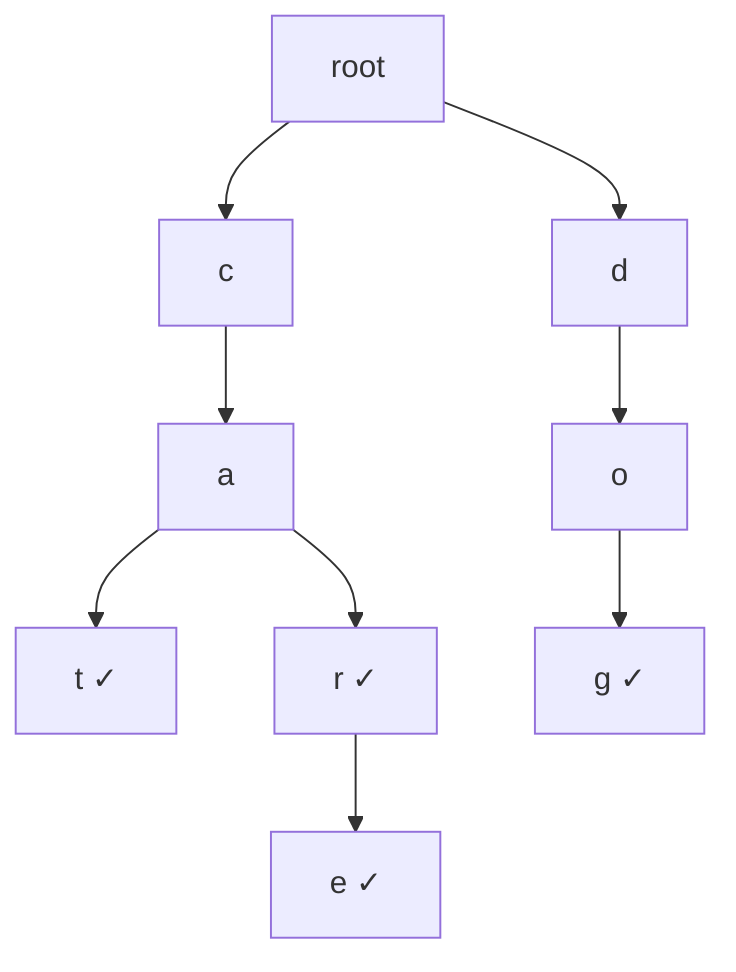

The checkmark means:

```text
A complete word ends here.
```

## Mental model: Dictionary corridors

Imagine walking through corridors:

```text
root → c → a
```

From `"ca"`, you can continue to:

```text
cat
car
care
```

This makes tries useful for:

* Autocomplete
* Prefix search
* Dictionaries
* Spell checking
* Search suggestions
* Word games
* IP routing concepts

## Trie complexity

For a word of length `L`:

| Operation        | Complexity |
| ---------------- | ---------: |
| Insert           |     `O(L)` |
| Search full word |     `O(L)` |
| Check prefix     |     `O(L)` |

The downside is memory consumption because every node stores child references.

## Go implementation

Assumption: lowercase English letters.

```go
type TrieNode struct {
    children [26]*TrieNode
    isWord   bool
}

type Trie struct {
    root *TrieNode
}

func NewTrie() *Trie {
    return &Trie{
        root: &TrieNode{},
    }
}

func (t *Trie) Insert(word string) {
    current := t.root

    for i := 0; i < len(word); i++ {
        index := word[i] - 'a'

        if current.children[index] == nil {
            current.children[index] = &TrieNode{}
        }

        current = current.children[index]
    }

    current.isWord = true
}

func (t *Trie) Search(word string) bool {
    node := t.findNode(word)
    return node != nil && node.isWord
}

func (t *Trie) StartsWith(prefix string) bool {
    return t.findNode(prefix) != nil
}

func (t *Trie) findNode(text string) *TrieNode {
    current := t.root

    for i := 0; i < len(text); i++ {
        index := text[i] - 'a'

        if current.children[index] == nil {
            return nil
        }

        current = current.children[index]
    }

    return current
}
```

---

# 21. Common String Problem Decision Tree

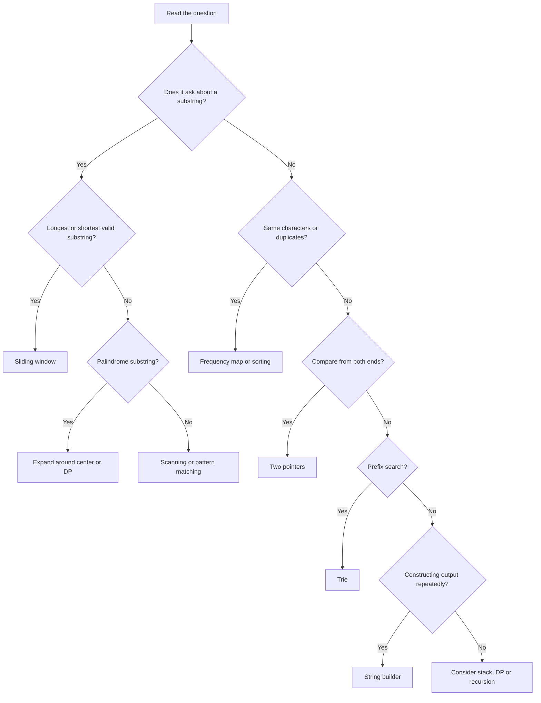

---

# 22. Important Interview Vocabulary

## Character

One logical text symbol:

```text
a
7
@
中
```

## String

A sequence of characters:

```text
"interview"
```

## Prefix

Starts from the beginning.

For `"coding"`:

```text
"c"
"co"
"cod"
"codi"
```

## Suffix

Ends at the end.

```text
"g"
"ng"
"ing"
"ding"
```

## Substring

A continuous section.

```text
"coding"
 "odi"
```

## Subsequence

Characters remain in order but do not have to be continuous.

```text
"coding"
 c d n
```

## Anagram

Same characters with the same frequencies, possibly in a different order.

```text
"eat"
"tea"
```

## Palindrome

Same forward and backward.

```text
"racecar"
```

---

# 23. Common Mistakes

## Mistake 1: Confusing substring and subsequence

```text
String:      abcde
Substring:   bcd
Subsequence: ace
```

Sliding window is mainly for **contiguous substrings**, not general subsequences.

---

## Mistake 2: Forgetting duplicate counts

These are not anagrams:

```text
"aab"
"abb"
```

Both use the same distinct characters, but the counts differ.

```text
First:  a:2, b:1
Second: a:1, b:2
```

A set is not enough. You need a frequency map.

---

## Mistake 3: Moving the left pointer backward

For longest substring without repetition:

```go
left = previousIndex + 1
```

Only do this when:

```go
previousIndex >= left
```

Otherwise, you may accidentally move `left` backward.

Correct:

```go
if previousIndex, found := lastSeen[ch];
    found && previousIndex >= left {
    left = previousIndex + 1
}
```

---

## Mistake 4: Using repeated string concatenation

Potentially inefficient:

```go
result += part
```

Inside a large loop, prefer:

```go
strings.Builder
```

---

## Mistake 5: Ignoring Unicode

In Go:

```go
s[i]
```

returns a byte, not necessarily a complete Unicode character.

Use:

```go
for _, r := range s
```

when logical Unicode characters matter.

---

## Mistake 6: Modifying a string directly

Go strings are immutable.

Convert to bytes or runes:

```go
characters := []byte(s)
characters[0] = 'B'
result := string(characters)
```

For Unicode:

```go
characters := []rune(s)
```

---

## Mistake 7: Calling every nested loop `O(n²)`

Sliding-window code may contain:

```go
for right < n {
    for windowInvalid {
        left++
    }
}
```

But if `left` and `right` each move at most `n` times, total complexity remains:

```text
O(n)
```

---

# 24. Complexity Cheat Sheet

Assume:

```text
n = string length
m = number of strings
k = average string length
```

| Problem                          | Typical approach         |          Time |            Space |
| -------------------------------- | ------------------------ | ------------: | ---------------: |
| Valid Anagram                    | Frequency array          |        `O(n)` |           `O(1)` |
| Valid Palindrome                 | Two pointers             |        `O(n)` |           `O(1)` |
| Longest substring without repeat | Sliding window           |        `O(n)` |           `O(k)` |
| Group Anagrams                   | Frequency signature      |       `O(mk)` |          `O(mk)` |
| Group Anagrams                   | Sorted signature         | `O(mk log k)` |          `O(mk)` |
| Longest Palindromic Substring    | Expand around center     |       `O(n²)` |           `O(1)` |
| Minimum Window Substring         | Sliding window           |    `O(n + m)` |           `O(k)` |
| String Compression               | Read/write pointers      |        `O(n)` |           `O(1)` |
| Trie insert/search               | Trie traversal           |        `O(L)` | Depends on nodes |
| Naive substring search           | Compare at each position |       `O(nm)` |           `O(1)` |

---

# 25. How to Solve a String Problem in an Interview

Use this sequence.

## Step 1: Clarify the input

Ask:

* Is the input ASCII or Unicode?
* Is it only lowercase English?
* Should matching be case-sensitive?
* Should spaces and punctuation be ignored?
* Can the string be empty?
* Can characters repeat?

## Step 2: Identify the keyword

```text
anagram       → frequency count
palindrome    → two pointers
substring     → sliding window
prefix        → trie
construct     → string builder
groups        → signature + hash map
```

## Step 3: Explain brute force

Even when inefficient, explain it.

Example:

> I could generate all substrings in `O(n²)` and check each one, but that would be too expensive.

## Step 4: Identify repeated work

Ask:

> What information am I repeatedly recalculating?

Possible answers:

* Character counts
* Duplicate status
* Window validity
* Last-seen positions
* Prefix structure

Store this information incrementally.

## Step 5: State invariants

An invariant is something that remains true during the algorithm.

For longest substring without repeating characters:

```text
The current window always contains unique characters.
```

For minimum window substring:

```text
When remaining == 0, the window contains every required character.
```

Interviewers value clear invariants.

## Step 6: Calculate complexity

Do not merely say `O(n)`. Explain why:

> The right pointer visits every character once, and the left pointer also moves forward at most `n` times. Therefore, total time is `O(n)`.

---

# 26. Mock Interview Questions

## Question 1: Reverse a string

Input:

```text
"hello"
```

Output:

```text
"olleh"
```

### Expected pattern

Two pointers or reverse traversal.

### Follow-up

How would you reverse Unicode text safely in Go?

### Answer

Use `[]rune`, not `[]byte`.

```go
func reverseString(s string) string {
    characters := []rune(s)

    left := 0
    right := len(characters) - 1

    for left < right {
        characters[left], characters[right] =
            characters[right], characters[left]

        left++
        right--
    }

    return string(characters)
}
```

Complexity:

```text
Time:  O(n)
Space: O(n)
```

---

## Question 2: Find the first non-repeating character

Input:

```text
"leetcode"
```

Output:

```text
0
```

Because `l` appears only once.

### Expected pattern

Two-pass frequency counting.

1. Count every character.
2. Scan again and return the first character with count `1`.

Complexity:

```text
Time:  O(n)
Space: O(k)
```

---

## Question 3: Check whether two strings are anagrams

Input:

```text
"listen", "silent"
```

Expected answer:

```text
true
```

### Expected pattern

Frequency counting.

### Follow-up questions

* What if the input contains Unicode?
* What if there are millions of possible characters?
* What if strings arrive as streams?

---

## Question 4: Longest substring without repeating characters

Input:

```text
"pwwkew"
```

Output:

```text
3
```

The substring is:

```text
"wke"
```

### Expected pattern

Variable-size sliding window.

### Interview invariant

```text
The current window contains no duplicate characters.
```

---

## Question 5: Valid palindrome

Input:

```text
"A man, a plan, a canal: Panama"
```

Output:

```text
true
```

### Expected pattern

Two pointers.

### Important constraint

Do not create a cleaned copy unless necessary.

---

## Question 6: Group anagrams

Input:

```text
["eat", "tea", "tan", "ate", "nat", "bat"]
```

Output:

```text
[
  ["eat", "tea", "ate"],
  ["tan", "nat"],
  ["bat"]
]
```

### Expected pattern

Hash map using:

* Sorted string key, or
* Frequency-array key

---

## Question 7: Longest palindromic substring

Input:

```text
"cbbd"
```

Output:

```text
"bb"
```

### Expected pattern

Expand around center.

### Follow-up

Can you solve it using dynamic programming?

DP complexity:

```text
Time:  O(n²)
Space: O(n²)
```

Expand-around-center usually has the same time but better space:

```text
Time:  O(n²)
Space: O(1)
```

---

## Question 8: Minimum window substring

Input:

```text
s = "ADOBECODEBANC"
t = "ABC"
```

Output:

```text
"BANC"
```

### Expected pattern

Sliding window with required-frequency counts.

### Main difficulty

Distinguishing between:

```text
A character appearing in the window
```

and:

```text
The required number of copies appearing in the window
```

---

## Question 9: String compression

Input:

```text
["a","a","b","b","c","c","c"]
```

Output:

```text
["a","2","b","2","c","3"]
```

Return:

```text
6
```

### Expected pattern

Read pointer and write pointer.

---

## Question 10: Implement a trie

Required methods:

```text
Insert(word)
Search(word)
StartsWith(prefix)
```

### Expected knowledge

* Trie nodes
* Child references
* End-of-word marker
* `O(L)` operations

---

# 27. Frequently Asked Conceptual Interview Questions

## Are strings arrays?

Conceptually, a string behaves like an array of characters. Internally, the exact representation depends on the language and encoding.

In Go, a string is an immutable sequence of bytes.

---

## Why are strings immutable?

Immutability provides benefits:

* Safer sharing between functions
* Easier concurrency
* Predictable hash values
* Prevents accidental modification
* Allows some runtime optimizations

The trade-off is that modification creates new values.

---

## What is the difference between `byte` and `rune` in Go?

```text
byte = uint8
rune = int32
```

A byte represents raw UTF-8 storage.

A rune represents a Unicode code point.

```go
for i := 0; i < len(s); i++ {
    // Iterates through bytes.
}

for _, r := range s {
    // Iterates through decoded runes.
}
```

---

## Why use a frequency array instead of a map?

For a small fixed alphabet such as `a-z`:

```go
counts := [26]int{}
```

Advantages:

* Less memory overhead
* Faster access
* No hashing
* Simple fixed-size storage

Use a map when the character set is large or unknown.

---

## What is the difference between a trie and a hash map?

A hash map efficiently checks complete keys:

```text
Does "apple" exist?
```

A trie efficiently works with prefixes:

```text
Which words begin with "app"?
```

A hash map may be simpler for exact lookup. A trie is stronger for prefix-based operations.

---

## Why is sliding window usually `O(n)`?

Because each character:

* Enters the window at most once.
* Leaves the window at most once.

Therefore:

```text
At most 2n significant operations → O(n)
```

---

# 28. Recommended Learning Order

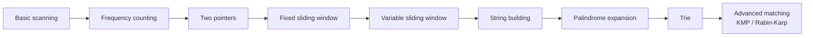

Study the problems in this order:

| Level        | Problems                                       |
| ------------ | ---------------------------------------------- |
| Beginner     | Reverse String, First Unique Character         |
| Beginner     | Valid Anagram, Valid Palindrome                |
| Intermediate | Longest Substring Without Repeating Characters |
| Intermediate | Group Anagrams, String Compression             |
| Intermediate | Longest Palindromic Substring                  |
| Advanced     | Minimum Window Substring                       |
| Advanced     | Implement Trie                                 |
| Advanced     | KMP substring search                           |

---

# 29. Final Mental Models

| Pattern              | Mental picture                   |
| -------------------- | -------------------------------- |
| String               | Train of character compartments  |
| Frequency map        | Inventory counter                |
| Two pointers         | Two guards walking inward        |
| Sliding window       | Camera frame moving over text    |
| String builder       | One reusable construction area   |
| Anagram signature    | Fingerprint for a word           |
| Palindrome expansion | Opening curtains from the center |
| Trie                 | Dictionary corridors             |
| String compression   | Read worker and write worker     |

The most important rule to remember is:

```text
Characters/counts      → Hash map
Both ends              → Two pointers
Contiguous section     → Sliding window
Repeated construction  → String builder
Prefix search          → Trie
Palindrome substring   → Expand around center
```
