# Trees in Data Structures — Explained Simply

A **tree** is a way to organize data where one item can have items below it.

Think of:

* A family tree
* Folders inside folders
* A company org chart
* Comments and replies
* HTML elements inside other HTML elements

Unlike an array, a tree is not a straight line.

```text
Array:

1 → 2 → 3 → 4 → 5
```

```text
Tree:

        1
       / \
      2   3
     / \   \
    4   5   6
```

---

## 1. The basic mental model

Imagine every tree node is a **room**.

Each room contains:

1. A value
2. A door to the left room
3. A door to the right room

```go
type TreeNode struct {
    Val   int
    Left  *TreeNode
    Right *TreeNode
}
```

For example:

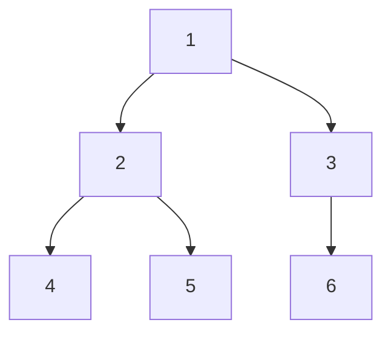

The corresponding Go objects are conceptually:

```go
root := &TreeNode{
    Val: 1,
    Left: &TreeNode{
        Val: 2,
        Left:  &TreeNode{Val: 4},
        Right: &TreeNode{Val: 5},
    },
    Right: &TreeNode{
        Val: 3,
        Right: &TreeNode{Val: 6},
    },
}
```

---

# 2. Tree vocabulary

Consider this tree:

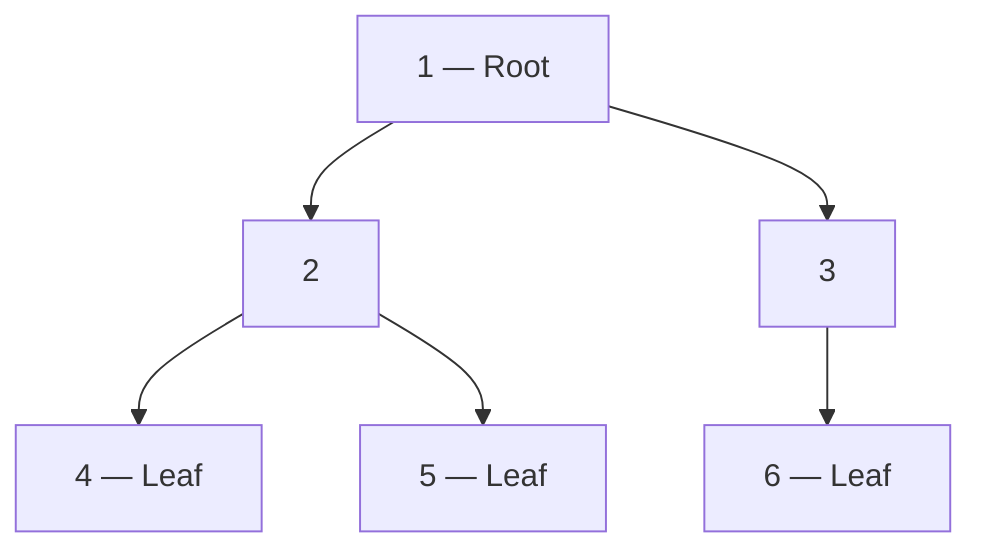

## Root

The top node.

```text
Root = 1
```

## Parent

A node directly above another node.

```text
Parent of 4 = 2
Parent of 2 = 1
```

## Child

A node directly below another node.

```text
Children of 2 = 4 and 5
```

## Leaf

A node with no children.

```text
Leaves = 4, 5, 6
```

## Sibling

Nodes with the same parent.

```text
4 and 5 are siblings
2 and 3 are siblings
```

## Subtree

A node together with everything below it.

The subtree rooted at `2` is:

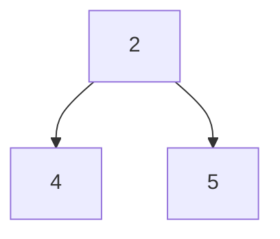

## Depth

The number of edges from the root to a node.

```text
Depth of 1 = 0
Depth of 2 = 1
Depth of 4 = 2
```

## Height

The distance from a node to its deepest leaf.

```text
Height of leaf 4 = 0 edges
Height of node 2 = 1 edge
Height of root 1 = 2 edges
```

LeetCode's **maximum depth** problems usually count nodes rather than edges:

```text
Maximum depth = 3 nodes
Path: 1 → 2 → 4
```

Always clarify the convention during an interview.

---

# 3. Why do we need trees?

Arrays and linked lists store data mostly in a line.

Trees represent **hierarchy** and support efficient searching, grouping and prioritization.

## File systems

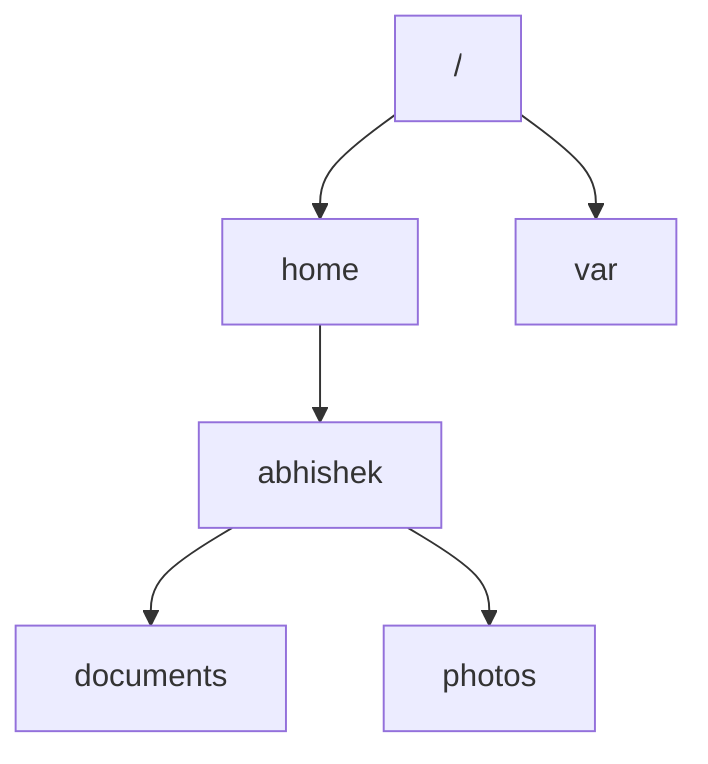

## Company hierarchy

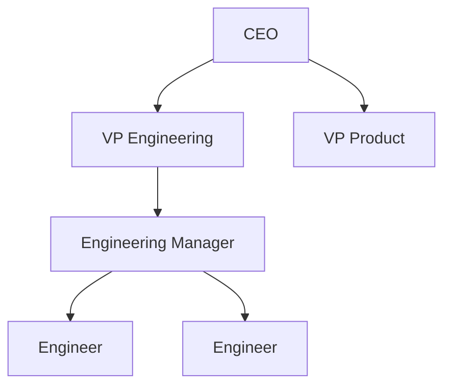

## HTML DOM

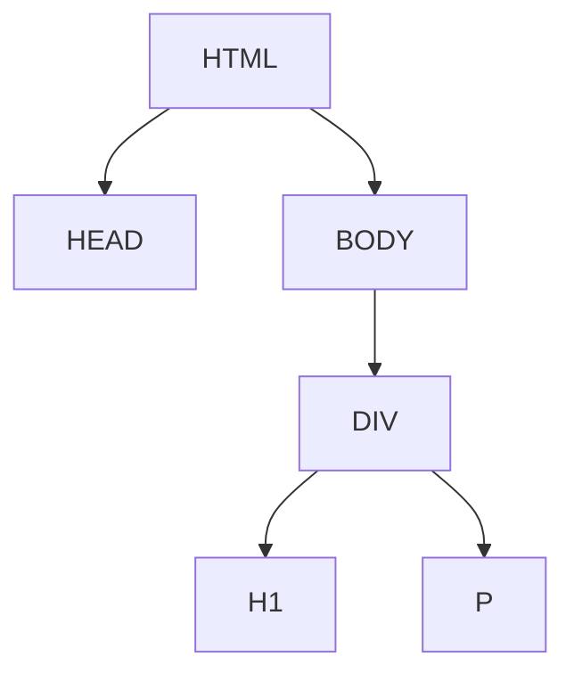

## Database indexes

Databases commonly use tree-based indexes such as B-trees to avoid scanning every row.

Instead of:

```text
Check item 1
Check item 2
Check item 3
...
Check item 1,000,000
```

A balanced search tree repeatedly removes large parts of the search space.

```text
1,000,000 items
→ 500,000
→ 250,000
→ 125,000
→ ...
```

That is why balanced tree search can be approximately `O(log n)` instead of `O(n)`.

---

# 4. Different types of trees

## Binary tree

Every node has at most two children.

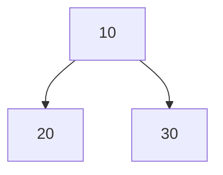

There is no ordering rule.

## Binary Search Tree

A Binary Search Tree, or BST, is a binary tree with an ordering rule:

```text
Values smaller than the node go left.
Values larger than the node go right.
```

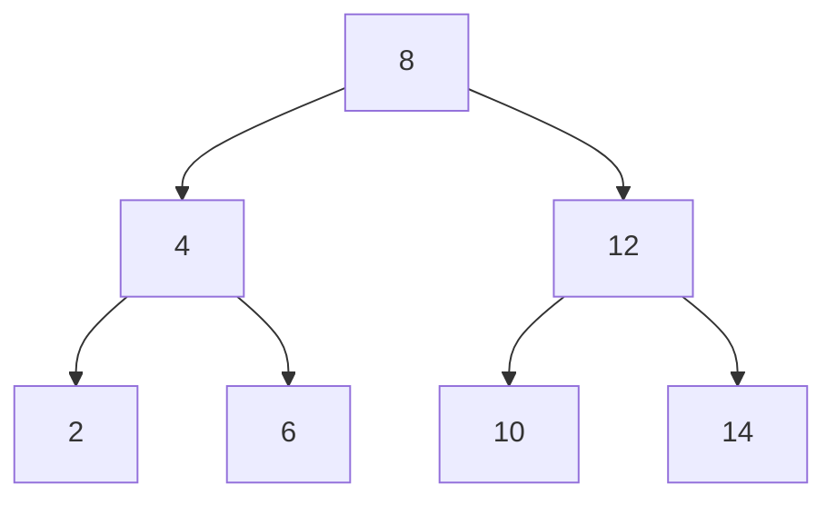

For node `8`:

```text
Left side:  2, 4, 6  < 8
Right side: 10, 12, 14 > 8
```

## Heap

A heap organizes nodes by priority.

In a max heap:

```text
Every parent is greater than or equal to its children.
```

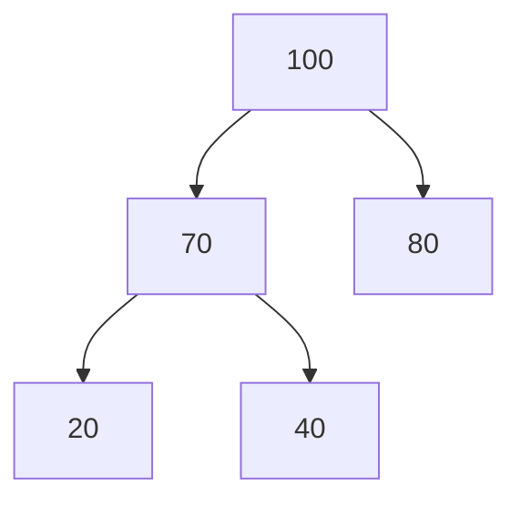

A heap is useful for:

* Priority queues
* Scheduling
* Finding minimum or maximum values
* Top-K problems

## Trie

A trie stores strings character by character.

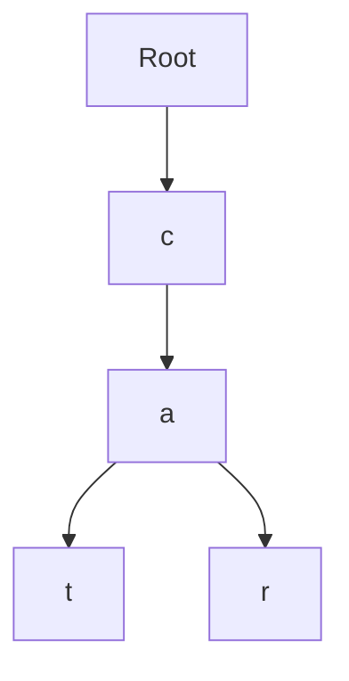

This stores:

```text
cat
car
```

Tries are useful for:

* Autocomplete
* Prefix search
* Dictionaries
* Routing tables

---

# 5. The most important tree mental model: recursion

A tree is made of smaller trees.

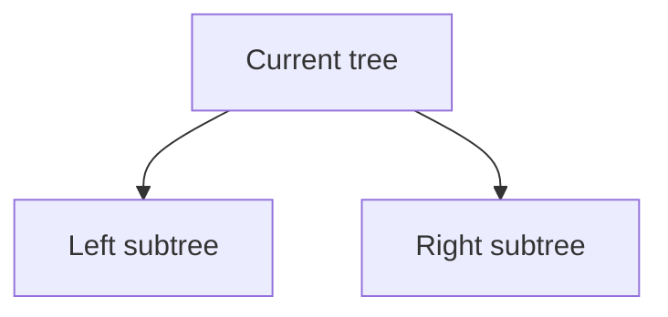

Therefore, most tree algorithms follow this pattern:

```go
func solve(root *TreeNode) Result {
    if root == nil {
        return baseResult
    }

    leftResult := solve(root.Left)
    rightResult := solve(root.Right)

    return combine(root, leftResult, rightResult)
}
```

The node asks:

> “Left child, solve your tree.”
> “Right child, solve your tree.”
> “Now I will combine both answers.”

For maximum depth:

```text
My depth =
1 + maximum(left subtree depth, right subtree depth)
```

For balanced tree:

```text
I am balanced if:
- my left subtree is balanced
- my right subtree is balanced
- their heights differ by at most 1
```

For diameter:

```text
Longest path through me =
left subtree height + right subtree height
```

This pattern solves a large percentage of tree interview questions.

---

# 6. Tree traversal

Traversal means visiting every node.

There are two major families:

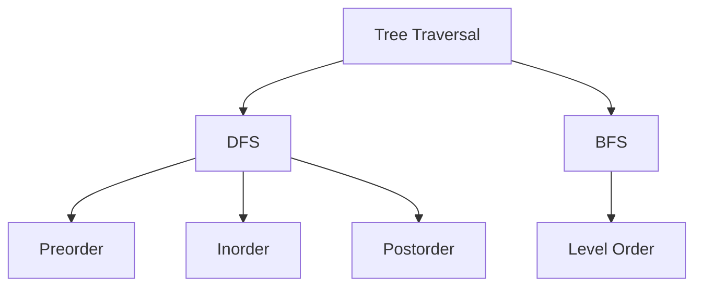

---

# 7. Depth-First Search

DFS goes deep into one branch before exploring another branch.


The three DFS traversals differ only in **when we process the current node**.

---

## 7.1 Preorder traversal

Order:

```text
Current node
Left subtree
Right subtree
```

Mnemonic:

```text
Node comes PRE — before its children.
```

For our tree:

```text
1, 2, 4, 5, 3, 6
```

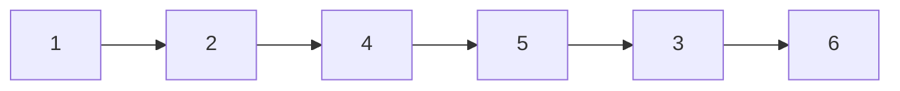

### Recursive preorder

```go
func preorder(root *TreeNode, result *[]int) {
    if root == nil {
        return
    }

    *result = append(*result, root.Val)
    preorder(root.Left, result)
    preorder(root.Right, result)
}
```

### Iterative preorder

Use a stack.

Push the right child first so that the left child is processed first.

```go
func preorderIterative(root *TreeNode) []int {
    if root == nil {
        return nil
    }

    result := []int{}
    stack := []*TreeNode{root}

    for len(stack) > 0 {
        node := stack[len(stack)-1]
        stack = stack[:len(stack)-1]

        result = append(result, node.Val)

        if node.Right != nil {
            stack = append(stack, node.Right)
        }

        if node.Left != nil {
            stack = append(stack, node.Left)
        }
    }

    return result
}
```

Preorder is commonly useful for:

* Copying a tree
* Serializing a tree
* Printing directory structures
* Processing a parent before children

---

## 7.2 Inorder traversal

Order:

```text
Left subtree
Current node
Right subtree
```

Mnemonic:

```text
Node is IN the middle.
```

For our tree:

```text
4, 2, 5, 1, 3, 6
```

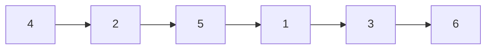

### Recursive inorder

```go
func inorder(root *TreeNode, result *[]int) {
    if root == nil {
        return
    }

    inorder(root.Left, result)
    *result = append(*result, root.Val)
    inorder(root.Right, result)
}
```

### Iterative inorder

```go
func inorderIterative(root *TreeNode) []int {
    result := []int{}
    stack := []*TreeNode{}
    current := root

    for current != nil || len(stack) > 0 {
        for current != nil {
            stack = append(stack, current)
            current = current.Left
        }

        current = stack[len(stack)-1]
        stack = stack[:len(stack)-1]

        result = append(result, current.Val)
        current = current.Right
    }

    return result
}
```

Important interview property:

> Inorder traversal of a valid BST produces sorted values.

For example:


Inorder:

```text
2, 4, 6, 8, 10, 12, 14
```

---

## 7.3 Postorder traversal

Order:

```text
Left subtree
Right subtree
Current node
```

Mnemonic:

```text
Node comes POST — after its children.
```

For our tree:

```text
4, 5, 2, 6, 3, 1
```

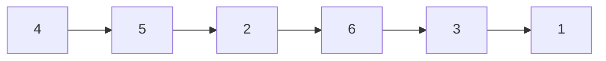

### Recursive postorder

```go
func postorder(root *TreeNode, result *[]int) {
    if root == nil {
        return
    }

    postorder(root.Left, result)
    postorder(root.Right, result)
    *result = append(*result, root.Val)
}
```

### Iterative postorder

One simple approach is:

1. Visit `node → right → left`
2. Reverse the result

```go
func postorderIterative(root *TreeNode) []int {
    if root == nil {
        return nil
    }

    reversed := []int{}
    stack := []*TreeNode{root}

    for len(stack) > 0 {
        node := stack[len(stack)-1]
        stack = stack[:len(stack)-1]

        reversed = append(reversed, node.Val)

        if node.Left != nil {
            stack = append(stack, node.Left)
        }

        if node.Right != nil {
            stack = append(stack, node.Right)
        }
    }

    result := make([]int, len(reversed))

    for i := range reversed {
        result[len(reversed)-1-i] = reversed[i]
    }

    return result
}
```

Postorder is extremely important because many tree problems need information from the children before calculating the parent's answer.

Examples:

* Maximum depth
* Balanced tree
* Diameter
* Delete a directory
* Calculate directory size

---

# 8. Breadth-First Search

BFS visits the tree one level at a time.

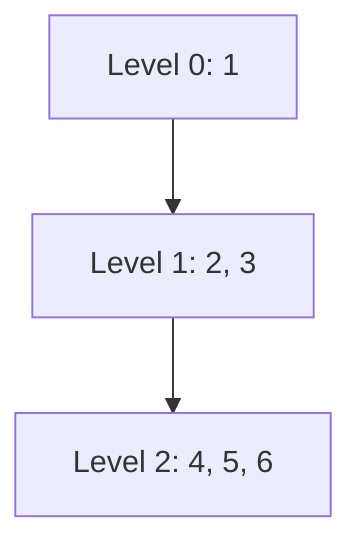

Traversal result:

```text
1, 2, 3, 4, 5, 6
```

BFS uses a **queue**.

```text
DFS → Stack or recursion
BFS → Queue
```

## Level-order traversal

```go
func levelOrder(root *TreeNode) [][]int {
    if root == nil {
        return nil
    }

    result := [][]int{}
    queue := []*TreeNode{root}

    for len(queue) > 0 {
        levelSize := len(queue)
        currentLevel := make([]int, 0, levelSize)

        for i := 0; i < levelSize; i++ {
            node := queue[0]
            queue = queue[1:]

            currentLevel = append(currentLevel, node.Val)

            if node.Left != nil {
                queue = append(queue, node.Left)
            }

            if node.Right != nil {
                queue = append(queue, node.Right)
            }
        }

        result = append(result, currentLevel)
    }

    return result
}
```

Output:

```text
[
  [1],
  [2, 3],
  [4, 5, 6]
]
```

The crucial line is:

```go
levelSize := len(queue)
```

It remembers how many nodes belong to the current level.

Newly added children belong to the next level.

---

# 9. DFS versus BFS

| Question characteristic     | Preferred approach |
| --------------------------- | ------------------ |
| Need tree height            | DFS                |
| Need subtree information    | DFS                |
| Need path from root         | DFS                |
| Need level-by-level output  | BFS                |
| Need closest node           | BFS                |
| Need right-side view        | BFS                |
| Need minimum depth          | Often BFS          |
| Need diameter               | DFS                |
| Need balance check          | DFS                |
| Need lowest common ancestor | DFS                |

Mental model:

```text
DFS = explore one branch deeply
BFS = explore one floor completely
```

---

# 10. How tree complexity is calculated

Let:

```text
n = total number of nodes
h = height of the tree
w = maximum width of the tree
```

## Traversing the entire tree

If every node is visited once:

```text
Time = O(n)
```

It does not matter whether traversal is preorder, inorder, postorder or level order. Every node is still processed once.

## Recursive DFS space

Recursive calls remain on the call stack.

```text
Space = O(h)
```

### Balanced tree

```text
h ≈ log n
Space = O(log n)
```

### Completely skewed tree

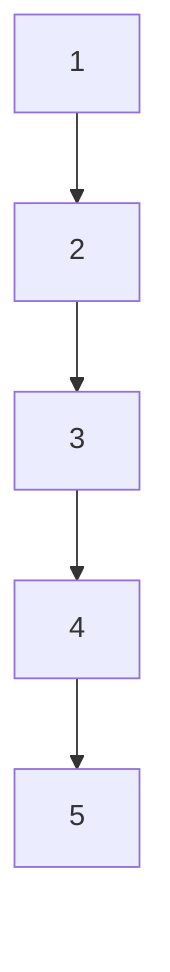

This tree behaves like a linked list.

```text
h = n
Space = O(n)
```

## BFS space

A queue may contain an entire level.

```text
Space = O(w)
```

In a wide complete binary tree:

```text
w can be approximately n / 2
```

Therefore worst-case BFS space is:

```text
O(n)
```

---

# 11. Maximum Depth of Binary Tree

## Problem

Find the number of nodes in the longest path from root to leaf.

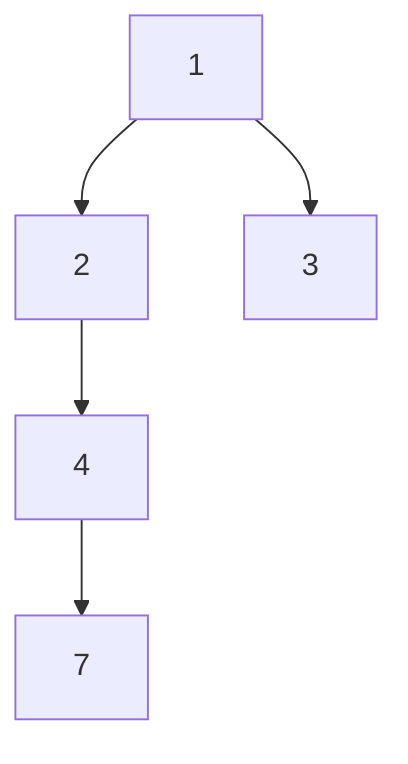

Longest path:

```text
1 → 2 → 4 → 7
```

Maximum depth:

```text
4
```

## Baby-level thinking

Ask both children:

```text
“How deep is your side?”
```

Then choose the deeper side and add yourself.

```text
depth(node) = 1 + max(depth(left), depth(right))
```

For an empty node:

```text
depth(nil) = 0
```

## Mermaid calculation

```mermaid
flowchart BT
    D["Node 7 returns 1"] --> C["Node 4 returns 2"]
    C --> B["Node 2 returns 3"]
    R["Node 3 returns 1"] --> A["Node 1 returns 4"]
    B --> A
```

## Go solution

```go
func maxDepth(root *TreeNode) int {
    if root == nil {
        return 0
    }

    leftDepth := maxDepth(root.Left)
    rightDepth := maxDepth(root.Right)

    return 1 + max(leftDepth, rightDepth)
}
```

```go
func max(a, b int) int {
    if a > b {
        return a
    }
    return b
}
```

## Complexity

```text
Time:  O(n)
Space: O(h)
```

Every node is visited once.

---

# 12. Invert Binary Tree

## Problem

Swap the left and right children of every node.

Before:

```mermaid
graph TD
    A["1"] --> B["2"]
    A --> C["3"]
    B --> D["4"]
    B --> E["5"]
```

After:

```mermaid
graph TD
    A["1"] --> C["3"]
    A --> B["2"]
    B --> E["5"]
    B --> D["4"]
```

## Mental model

At every node:

```text
Swap the two doors.
Then ask both children to do the same.
```

## Go solution

```go
func invertTree(root *TreeNode) *TreeNode {
    if root == nil {
        return nil
    }

    root.Left, root.Right = root.Right, root.Left

    invertTree(root.Left)
    invertTree(root.Right)

    return root
}
```

## Complexity

```text
Time:  O(n)
Space: O(h)
```

Every node must be swapped.

---

# 13. Same Tree

## Problem

Determine whether two trees are structurally identical and contain the same values.

```mermaid
graph TD
    subgraph Tree_A
        A1["1"] --> A2["2"]
        A1 --> A3["3"]
    end

    subgraph Tree_B
        B1["1"] --> B2["2"]
        B1 --> B3["3"]
    end
```

These trees are the same.

## Three cases

### Both nodes are nil

```text
They match.
```

### Only one node is nil

```text
They do not match.
```

### Both exist

They match only when:

```text
values match
AND left subtrees match
AND right subtrees match
```

## Go solution

```go
func isSameTree(p, q *TreeNode) bool {
    if p == nil && q == nil {
        return true
    }

    if p == nil || q == nil {
        return false
    }

    if p.Val != q.Val {
        return false
    }

    return isSameTree(p.Left, q.Left) &&
        isSameTree(p.Right, q.Right)
}
```

## Complexity

```text
Time:  O(n)
Space: O(h)
```

In the worst case, all corresponding nodes are compared.

---

# 14. Subtree of Another Tree

## Problem

Determine whether `subRoot` appears somewhere inside `root`.

Main tree:

```mermaid
graph TD
    A["3"] --> B["4"]
    A --> C["5"]
    B --> D["1"]
    B --> E["2"]
```

Candidate subtree:

```mermaid
graph TD
    B["4"] --> D["1"]
    B --> E["2"]
```

The answer is `true`.

## Mental model

At every node in the main tree, ask:

```text
“Does the tree starting here exactly match subRoot?”
```

If not:

```text
Try the left subtree.
Try the right subtree.
```

## Go solution

```go
func isSubtree(root, subRoot *TreeNode) bool {
    if subRoot == nil {
        return true
    }

    if root == nil {
        return false
    }

    if isSameTree(root, subRoot) {
        return true
    }

    return isSubtree(root.Left, subRoot) ||
        isSubtree(root.Right, subRoot)
}
```

Helper:

```go
func isSameTree(a, b *TreeNode) bool {
    if a == nil && b == nil {
        return true
    }

    if a == nil || b == nil {
        return false
    }

    return a.Val == b.Val &&
        isSameTree(a.Left, b.Left) &&
        isSameTree(a.Right, b.Right)
}
```

## Complexity

Let:

```text
n = number of nodes in root
m = number of nodes in subRoot
```

The straightforward solution may compare the subtree at many nodes.

```text
Time:  O(n × m)
Space: O(h)
```

More advanced solutions use tree serialization and hashing, but the recursive solution is usually expected first.

---

# 15. Binary Tree Level Order Traversal

## Problem

Return nodes grouped by their levels.

```mermaid
graph TD
    A["3"] --> B["9"]
    A --> C["20"]
    C --> D["15"]
    C --> E["7"]
```

Output:

```text
[
  [3],
  [9, 20],
  [15, 7]
]
```

## Mental model

Imagine people standing in a queue.

1. Process everyone currently in the queue.
2. Add their children.
3. The added children form the next level.

## Go solution

```go
func levelOrder(root *TreeNode) [][]int {
    if root == nil {
        return [][]int{}
    }

    result := [][]int{}
    queue := []*TreeNode{root}

    for len(queue) > 0 {
        levelSize := len(queue)
        level := make([]int, 0, levelSize)

        for i := 0; i < levelSize; i++ {
            node := queue[0]
            queue = queue[1:]

            level = append(level, node.Val)

            if node.Left != nil {
                queue = append(queue, node.Left)
            }

            if node.Right != nil {
                queue = append(queue, node.Right)
            }
        }

        result = append(result, level)
    }

    return result
}
```

## Complexity

```text
Time:  O(n)
Space: O(w)
```

`w` is the maximum number of nodes in one level.

Worst case:

```text
Space: O(n)
```

---

# 16. Balanced Binary Tree

## Problem

A tree is height-balanced when, for every node:

```text
|left height - right height| <= 1
```

Balanced:

```mermaid
graph TD
    A["1"] --> B["2"]
    A --> C["3"]
    B --> D["4"]
    B --> E["5"]
```

Unbalanced:

```mermaid
graph TD
    A["1"] --> B["2"]
    B --> C["3"]
    C --> D["4"]
```

## Slow approach

For every node:

1. Calculate left height
2. Calculate right height
3. Check the difference
4. Repeat for its children

This can repeatedly calculate the same heights.

Worst case:

```text
O(n²)
```

## Better mental model

Return two pieces of information together:

```text
- subtree height
- whether it is already unbalanced
```

A convenient trick is:

```text
Return -1 when a subtree is unbalanced.
Otherwise return its height.
```

## Go solution

```go
func isBalanced(root *TreeNode) bool {
    return balancedHeight(root) != -1
}

func balancedHeight(root *TreeNode) int {
    if root == nil {
        return 0
    }

    leftHeight := balancedHeight(root.Left)
    if leftHeight == -1 {
        return -1
    }

    rightHeight := balancedHeight(root.Right)
    if rightHeight == -1 {
        return -1
    }

    difference := leftHeight - rightHeight
    if difference < 0 {
        difference = -difference
    }

    if difference > 1 {
        return -1
    }

    return 1 + max(leftHeight, rightHeight)
}
```

## Complexity

```text
Time:  O(n)
Space: O(h)
```

Every node calculates its height once.

---

# 17. Lowest Common Ancestor

## Problem

Find the lowest node that has both `p` and `q` somewhere below it.

```mermaid
graph TD
    A["3"] --> B["5"]
    A --> C["1"]
    B --> D["6"]
    B --> E["2"]
    E --> F["7"]
    E --> G["4"]
    C --> H["0"]
    C --> I["8"]
```

For:

```text
p = 5
q = 1
```

The LCA is:

```text
3
```

For:

```text
p = 7
q = 4
```

The LCA is:

```text
2
```

## Baby-level mental model

Ask the left subtree:

```text
“Did you find p or q?”
```

Ask the right subtree:

```text
“Did you find p or q?”
```

Then:

```text
Found something on both sides → current node is the LCA
Found something on one side   → return that side
Found nothing                  → return nil
```

## Mermaid decision

```mermaid
flowchart TD
    A["Search current node"] --> B{"Current node is p or q?"}
    B -- Yes --> C["Return current node"]
    B -- No --> D["Search left"]
    D --> E["Search right"]
    E --> F{"Both returned non-nil?"}
    F -- Yes --> G["Current node is LCA"]
    F -- No --> H["Return whichever side is non-nil"]
```

## Go solution

```go
func lowestCommonAncestor(
    root *TreeNode,
    p *TreeNode,
    q *TreeNode,
) *TreeNode {
    if root == nil || root == p || root == q {
        return root
    }

    left := lowestCommonAncestor(root.Left, p, q)
    right := lowestCommonAncestor(root.Right, p, q)

    if left != nil && right != nil {
        return root
    }

    if left != nil {
        return left
    }

    return right
}
```

## Why returning `p` immediately is correct

Suppose the current node is `p`.

There are two possibilities:

1. `q` is somewhere below `p`
2. `q` is elsewhere, and a parent will combine the two answers

In either case, `p` is the correct candidate to return upward.

## Complexity

```text
Time:  O(n)
Space: O(h)
```

This solution is for a general binary tree.

For a BST, ordering can be used to find the LCA in `O(h)` without searching both subtrees.

---

# 18. Diameter of Binary Tree

## Problem

The diameter is the longest path between any two nodes.

The path does not have to pass through the root.

```mermaid
graph TD
    A["1"] --> B["2"]
    A --> C["3"]
    B --> D["4"]
    B --> E["5"]
    D --> F["6"]
```

One longest path is:

```text
6 → 4 → 2 → 1 → 3
```

Diameter:

```text
4 edges
```

## Key observation

At every node, calculate:

```text
left subtree height + right subtree height
```

That gives the longest path passing through the current node.

```mermaid
graph TD
    A["Current node"] --> B["Deepest left path"]
    A --> C["Deepest right path"]
    B -. "left height" .-> A
    C -. "right height" .-> A
```

## Important distinction

The recursive function returns:

```text
One downward path: height
```

But it also updates:

```text
The best complete path: diameter
```

This is a very common interview pattern.

## Go solution

```go
func diameterOfBinaryTree(root *TreeNode) int {
    diameter := 0

    var height func(node *TreeNode) int

    height = func(node *TreeNode) int {
        if node == nil {
            return 0
        }

        leftHeight := height(node.Left)
        rightHeight := height(node.Right)

        pathThroughNode := leftHeight + rightHeight
        if pathThroughNode > diameter {
            diameter = pathThroughNode
        }

        return 1 + max(leftHeight, rightHeight)
    }

    height(root)
    return diameter
}
```

## Why `leftHeight + rightHeight` gives edges

Suppose:

```text
leftHeight = 3 nodes downward
rightHeight = 2 nodes downward
```

The path contains:

```text
3 left-side edges/nodes contribution
+
2 right-side edges/nodes contribution
```

When `nil` returns `0`, adding the child heights directly gives the number of edges passing through the current node.

## Complexity

```text
Time:  O(n)
Space: O(h)
```

Every node returns its height once.

---

# 19. The most important tree interview pattern

A large number of tree questions are disguised versions of:

```go
func dfs(root *TreeNode) SomeValue {
    if root == nil {
        return baseValue
    }

    left := dfs(root.Left)
    right := dfs(root.Right)

    // Use left, right and root.Val.
    return answerForParent
}
```

The hard part is answering:

> What should each node return to its parent?

---

## Maximum depth

Each node returns:

```text
My subtree height
```

```go
return 1 + max(left, right)
```

## Balanced tree

Each node returns:

```text
My height, or -1 if unbalanced
```

## Diameter

Each node returns:

```text
My height
```

It separately updates:

```text
left height + right height
```

## Lowest common ancestor

Each node returns:

```text
A node representing something found below me
```

## Same tree

Each pair of nodes returns:

```text
Whether both subtrees are identical
```

---

# 20. Top-down versus bottom-up DFS

## Top-down DFS

Information flows from parent to child.

Examples:

* Current path
* Current depth
* Running sum
* Valid BST bounds

```go
func dfs(node *TreeNode, depth int) {
    if node == nil {
        return
    }

    dfs(node.Left, depth+1)
    dfs(node.Right, depth+1)
}
```

Mental model:

```text
“What information should my parent give me?”
```

## Bottom-up DFS

Information flows from children to parent.

Examples:

* Height
* Balance
* Diameter
* Maximum path sum

```go
func dfs(node *TreeNode) int {
    if node == nil {
        return 0
    }

    left := dfs(node.Left)
    right := dfs(node.Right)

    return 1 + max(left, right)
}
```

Mental model:

```text
“What information do I need from my children?”
```

Most of the questions in your list are bottom-up DFS problems.

---

# 21. How to identify the required traversal

Use this decision process:

```mermaid
flowchart TD
    A["Read the tree problem"] --> B{"Need level-by-level information?"}
    B -- Yes --> C["Use BFS with queue"]
    B -- No --> D{"Need child answers before parent?"}
    D -- Yes --> E["Use postorder DFS"]
    D -- No --> F{"Need parent before children?"}
    F -- Yes --> G["Use preorder DFS"]
    F -- No --> H{"Is it a BST or sorted result needed?"}
    H -- Yes --> I["Consider inorder DFS"]
    H -- No --> J["Start with general DFS"]
```

Examples:

```text
Level order              → BFS
Right-side view          → BFS
Maximum depth            → Postorder DFS
Balanced tree            → Postorder DFS
Diameter                 → Postorder DFS
Invert tree              → Preorder or postorder DFS
Validate BST             → Inorder or bounded DFS
Serialize tree           → Preorder
```

---

# 22. Common mistakes in tree interviews

## Mistake 1: Forgetting the nil base case

Wrong:

```go
func maxDepth(root *TreeNode) int {
    left := maxDepth(root.Left)
    right := maxDepth(root.Right)
    return 1 + max(left, right)
}
```

This crashes when `root == nil`.

Correct:

```go
if root == nil {
    return 0
}
```

---

## Mistake 2: Confusing depth and height

```text
Depth: root → current node
Height: current node → deepest leaf
```

Maximum depth of a tree and height of the root often represent the same quantity, depending on whether edges or nodes are counted.

---

## Mistake 3: Assuming every binary tree is a BST

This is a binary tree:

```mermaid
graph TD
    A["5"] --> B["20"]
    A --> C["1"]
```

It is not a BST because:

```text
20 is on the left but 20 > 5
1 is on the right but 1 < 5
```

---

## Mistake 4: Saying DFS always uses recursion

DFS can use:

* Recursion
* An explicit stack

BFS normally uses a queue.

---

## Mistake 5: Returning the wrong information

For diameter, returning diameter to the parent is usually incorrect.

The parent needs a single downward path, so the function must return height.

```text
Return to parent: height
Global answer: diameter
```

---

## Mistake 6: Recalculating subtree heights

An `O(n²)` balanced-tree solution repeatedly calculates height.

The optimized solution calculates height and balance in the same DFS.

---

## Mistake 7: Ignoring skewed trees

A recursive solution may use:

```text
O(log n) stack for balanced trees
O(n) stack for skewed trees
```

Always state worst-case complexity.

---

# 23. Most commonly asked tree questions

## Essential first group

These should become automatic:

1. Maximum Depth of Binary Tree
2. Invert Binary Tree
3. Same Tree
4. Subtree of Another Tree
5. Binary Tree Level Order Traversal
6. Balanced Binary Tree
7. Diameter of Binary Tree
8. Lowest Common Ancestor of a Binary Tree
9. Binary Tree Preorder Traversal
10. Binary Tree Inorder Traversal
11. Binary Tree Postorder Traversal

## Next group

After the first group:

1. Validate Binary Search Tree
2. Kth Smallest Element in a BST
3. Binary Tree Right Side View
4. Count Good Nodes in Binary Tree
5. Path Sum
6. Binary Tree Maximum Path Sum
7. Construct Binary Tree from Preorder and Inorder
8. Serialize and Deserialize Binary Tree
9. Lowest Common Ancestor of a BST
10. Symmetric Tree

## Advanced group

1. All Nodes Distance K in Binary Tree
2. Vertical Order Traversal
3. Binary Tree Cameras
4. House Robber III
5. Recover Binary Search Tree
6. Morris Traversal
7. Trie implementation
8. Segment tree
9. Fenwick tree
10. B-tree concepts

---

# 24. Mock interview questions

## Question 1: Why is maximum depth `O(n)`?

Expected answer:

> Every node is visited exactly once. At each node, we do constant work: compare the left and right depths and add one. Therefore, the total time complexity is `O(n)`.

---

## Question 2: What is the recursive space complexity of maximum depth?

Expected answer:

> It is `O(h)`, where `h` is the tree height. For a balanced tree, this is `O(log n)`. For a skewed tree, it becomes `O(n)`.

---

## Question 3: What is the difference between DFS and BFS?

Expected answer:

> DFS explores one branch deeply before returning and normally uses recursion or a stack. BFS explores one level at a time and uses a queue.

---

## Question 4: Which traversal produces sorted output for a BST?

Expected answer:

> Inorder traversal, because it visits the left subtree, then the current node, then the right subtree.

---

## Question 5: Can preorder traversal alone uniquely reconstruct a binary tree?

Expected answer:

> Not for a general binary tree. Multiple tree structures can produce the same preorder traversal. Preorder combined with inorder can uniquely reconstruct a tree when node values are unique.

---

## Question 6: Why is diameter not simply the height of the tree?

Expected answer:

> Height is one downward path from a node to a leaf. Diameter is a path between two nodes and may combine a left path and a right path. It may also occur completely inside a subtree without passing through the root.

---

## Question 7: Why does diameter DFS return height instead of diameter?

Expected answer:

> The parent can only extend one downward branch from each child. Therefore, the useful value for the parent is the child's height. The complete diameter is maintained separately.

---

## Question 8: What makes the balanced-tree optimized solution `O(n)`?

Expected answer:

> Height and balance are calculated in the same postorder traversal. Each node is processed only once, rather than repeatedly recalculating subtree heights.

---

## Question 9: Can BFS be used to calculate maximum depth?

Yes.

```go
func maxDepthBFS(root *TreeNode) int {
    if root == nil {
        return 0
    }

    depth := 0
    queue := []*TreeNode{root}

    for len(queue) > 0 {
        levelSize := len(queue)

        for i := 0; i < levelSize; i++ {
            node := queue[0]
            queue = queue[1:]

            if node.Left != nil {
                queue = append(queue, node.Left)
            }

            if node.Right != nil {
                queue = append(queue, node.Right)
            }
        }

        depth++
    }

    return depth
}
```

Expected comparison:

```text
DFS space: O(h)
BFS space: O(w)
```

DFS is often simpler for maximum depth.

---

## Question 10: What happens when one LCA target is an ancestor of the other?

Example:

```text
p = 5
q = 4
```

When DFS reaches `5`, it returns `5`.

Because `4` is inside `5`'s subtree, `5` is the lowest node that contains both nodes.

Therefore:

```text
LCA = 5
```

---

## Question 11: How would you detect whether two trees are mirror images?

Compare:

```text
left subtree of tree A
with
right subtree of tree B
```

And:

```text
right subtree of tree A
with
left subtree of tree B
```

This is the basis of the Symmetric Tree problem.

---

## Question 12: When would BFS be better than DFS?

Expected answer:

> BFS is better when the answer depends on levels or the nearest matching node. Examples include level-order traversal, minimum depth, right-side view and finding the closest node satisfying a condition.

---

# 25. Interview coding template

## DFS template

```go
func dfs(root *TreeNode) int {
    if root == nil {
        return 0
    }

    left := dfs(root.Left)
    right := dfs(root.Right)

    return combine(left, right)
}
```

Ask:

```text
1. What is the base case?
2. What should the left subtree return?
3. What should the right subtree return?
4. How do I combine those answers?
5. What do I return to my parent?
```

## BFS template

```go
func bfs(root *TreeNode) {
    if root == nil {
        return
    }

    queue := []*TreeNode{root}

    for len(queue) > 0 {
        levelSize := len(queue)

        for i := 0; i < levelSize; i++ {
            node := queue[0]
            queue = queue[1:]

            if node.Left != nil {
                queue = append(queue, node.Left)
            }

            if node.Right != nil {
                queue = append(queue, node.Right)
            }
        }
    }
}
```

Ask:

```text
1. Do I need nodes grouped by level?
2. What should I calculate for each node?
3. What should I calculate after each level?
4. Do I need the first or last node of each level?
```

---

# 26. Final mental model

Think of a tree problem as a conversation between nodes.

```mermaid
sequenceDiagram
    participant P as Parent
    participant L as Left Child
    participant R as Right Child

    P->>L: Solve your subtree
    L-->>P: Here is my answer
    P->>R: Solve your subtree
    R-->>P: Here is my answer
    P->>P: Combine both answers
```

For each problem, complete this sentence:

> “Every node should return __________ to its parent.”

| Problem                | Node returns              |
| ---------------------- | ------------------------- |
| Maximum depth          | Its height                |
| Balanced tree          | Height or failure         |
| Diameter               | Height                    |
| Same tree              | Boolean                   |
| Lowest common ancestor | Matching node or ancestor |
| Subtree                | Boolean                   |
| Invert tree            | Inverted subtree root     |
| Path sum               | Information about a path  |

The core formula to remember is:

```text
Tree problem
=
base case
+
solve left subtree
+
solve right subtree
+
combine answers
```

And the traversal mnemonic is:

```text
Preorder  = Node, Left, Right
Inorder   = Left, Node, Right
Postorder = Left, Right, Node
BFS       = Level by level
```

For interview preparation, solve the questions in this order:

```text
Maximum Depth
→ Invert Tree
→ Same Tree
→ Level Order
→ Balanced Tree
→ Diameter
→ Subtree
→ Lowest Common Ancestor
```

That sequence moves from simple recursion to the main tree patterns used in interviews.
