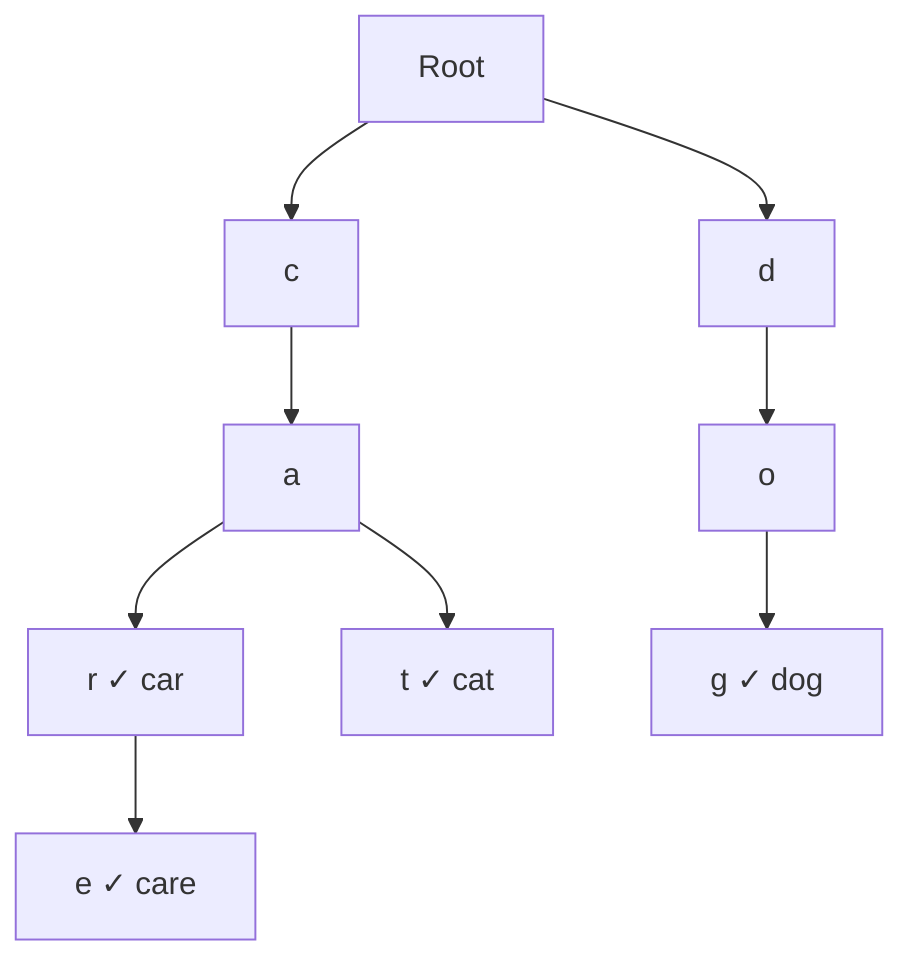
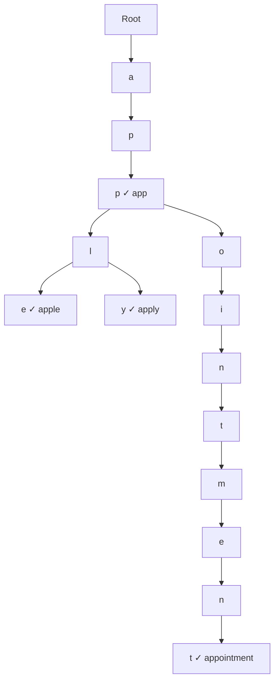
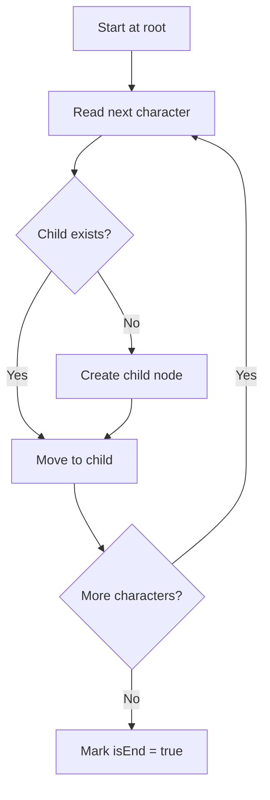
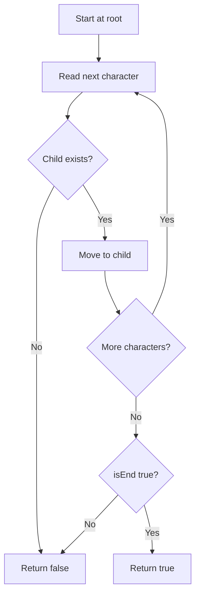
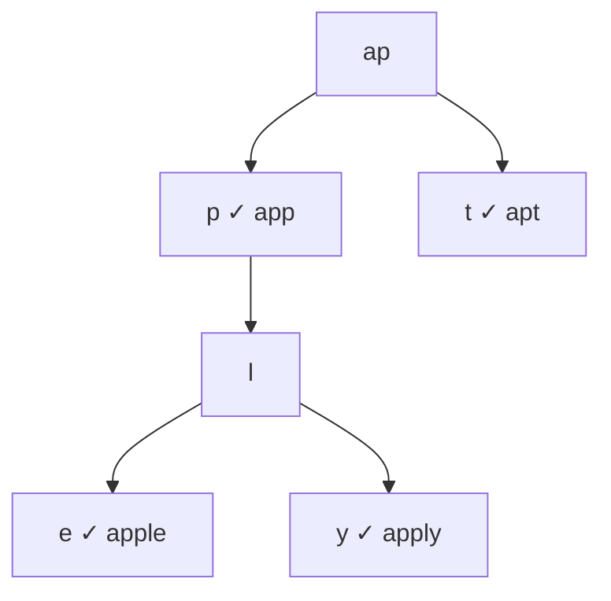
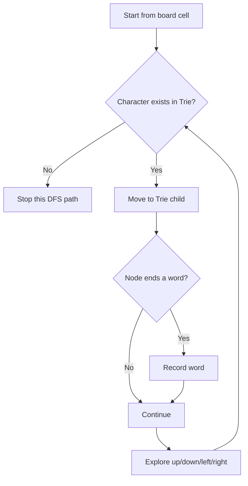
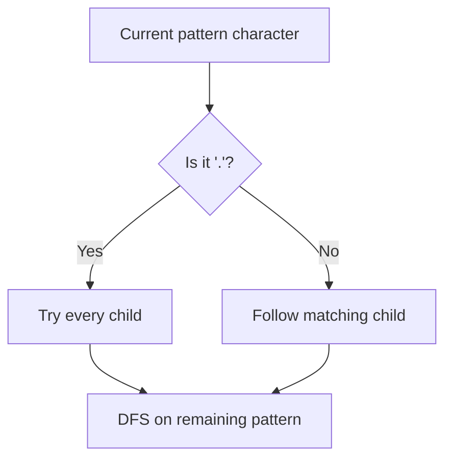
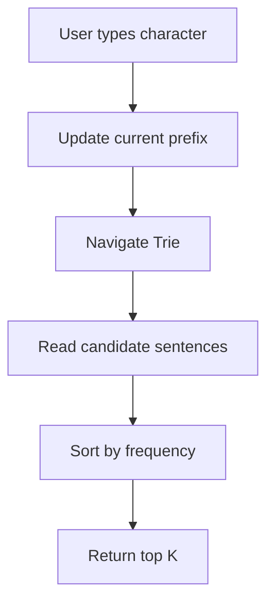
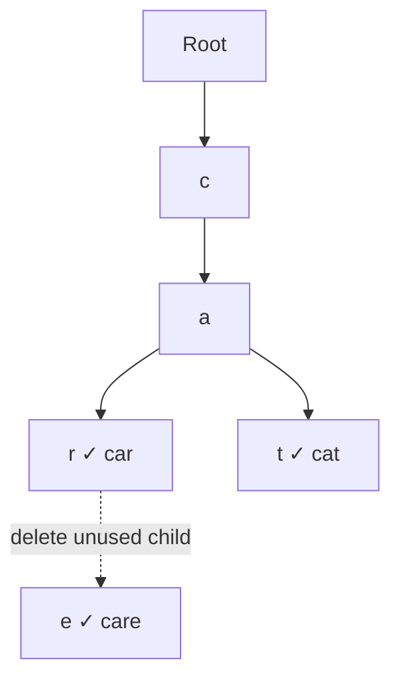

# Trie — Explained Like You’re Five

A **Trie**—pronounced “try”—is a tree used to store words **character by character**.

Imagine a cupboard with drawers:

* First drawer: first letter
* Inside it: drawer for the second letter
* Inside that: drawer for the third letter
* Continue until the word finishes

Suppose we store:

```text
car
cat
care
dog
```

Instead of storing each word independently, the Trie shares common beginnings:



The prefix `ca` is stored only once and shared by:

* `car`
* `cat`
* `care`

That shared-prefix structure is the main idea behind a Trie.

---

# 1. Why Do We Need a Trie?

Suppose you have one million words and someone types:

```text
app
```

You want to find:

```text
apple
application
apply
appointment
```

You could check every word:

```text
Does apple start with app?
Does banana start with app?
Does application start with app?
...
```

But that may require scanning the entire dictionary.

A Trie lets you directly follow:

```text
root → a → p → p
```

Once you reach the `app` node, everything below it starts with `app`.



A Trie is useful when the problem contains ideas such as:

* Prefix search
* Autocomplete
* Dictionary lookup
* Spell checking
* Word search on a board
* Routing by prefixes
* Searching many words simultaneously
* Wildcard word matching

---

# 2. The Baby Mental Model

Think of a Trie as a **word road map**.

Each letter is a road.

```text
Root
 └── c
      └── a
           ├── r
           └── t
```

To search for `cat`, walk along:

```text
root → c → a → t
```

If any road does not exist, the word does not exist.

However, reaching the last letter is not enough.

For example, suppose the Trie contains:

```text
apple
```

The path for `app` exists:

```text
root → a → p → p
```

But `app` may not itself be a stored word.

Therefore, every Trie node usually contains an `isEnd` marker:

```text
isEnd = true
```

This means:

> A complete word finishes at this node.

---

# 3. What Does a Trie Node Contain?

Every node normally contains two things:

```text
1. Children
2. End-of-word marker
```

Conceptually:

```go
type TrieNode struct {
    children map[rune]*TrieNode
    isEnd    bool
}
```

For English lowercase letters, children can also be stored in an array:

```go
type TrieNode struct {
    children [26]*TrieNode
    isEnd    bool
}
```

The array index is calculated as:

```go
index := character - 'a'
```

Examples:

```text
'a' - 'a' = 0
'b' - 'a' = 1
'c' - 'a' = 2
...
'z' - 'a' = 25
```

---

# 4. Trie Operations

The three essential operations are:

```text
Insert(word)
Search(word)
StartsWith(prefix)
```

---

## 4.1 Insert

Suppose we insert:

```text
cat
```

Start at the root:

```text
1. Look for child 'c'
2. Create it if missing
3. Move to 'c'
4. Look for child 'a'
5. Create it if missing
6. Move to 'a'
7. Look for child 't'
8. Create it if missing
9. Mark 't' as the end of a word
```



### Example

Before inserting `car`:

```text
root
```

After inserting `car`:

```text
root
 └── c
      └── a
           └── r*
```

The `*` means `isEnd = true`.

After inserting `cat`:

```text
root
 └── c
      └── a
           ├── r*
           └── t*
```

The nodes for `c` and `a` are reused.

---

## 4.2 Search

To search for `cat`:

```text
root → c → a → t
```

Two conditions must be true:

1. Every character path exists.
2. The final node has `isEnd = true`.



### Important distinction

Suppose only `apple` was inserted.

```text
Search("app")       → false
StartsWith("app")   → true
Search("apple")     → true
```

Why?

The path `a → p → p` exists, but `app` was not marked as a complete word.

---

## 4.3 StartsWith

`StartsWith` checks only whether the path exists.

It does not care whether the last node represents a complete word.

```text
Stored word: apple

StartsWith("app") → true
StartsWith("apx") → false
```

Mental model:

```text
Search:
"Is this exact house located here?"

StartsWith:
"Does any road continue from this location?"
```

---

# 5. Complete Trie Implementation in Go

This version supports Unicode characters because it uses `rune`.

```go
package main

import "fmt"

type TrieNode struct {
	children map[rune]*TrieNode
	isEnd    bool
}

type Trie struct {
	root *TrieNode
}

func NewTrie() *Trie {
	return &Trie{
		root: &TrieNode{
			children: make(map[rune]*TrieNode),
		},
	}
}

func (t *Trie) Insert(word string) {
	current := t.root

	for _, char := range word {
		child, exists := current.children[char]

		if !exists {
			child = &TrieNode{
				children: make(map[rune]*TrieNode),
			}
			current.children[char] = child
		}

		current = child
	}

	current.isEnd = true
}

func (t *Trie) Search(word string) bool {
	node := t.findNode(word)

	return node != nil && node.isEnd
}

func (t *Trie) StartsWith(prefix string) bool {
	return t.findNode(prefix) != nil
}

func (t *Trie) findNode(text string) *TrieNode {
	current := t.root

	for _, char := range text {
		child, exists := current.children[char]
		if !exists {
			return nil
		}

		current = child
	}

	return current
}

func main() {
	trie := NewTrie()

	trie.Insert("car")
	trie.Insert("cat")
	trie.Insert("care")

	fmt.Println(trie.Search("car"))       // true
	fmt.Println(trie.Search("ca"))        // false
	fmt.Println(trie.StartsWith("ca"))    // true
	fmt.Println(trie.Search("care"))      // true
	fmt.Println(trie.StartsWith("dog"))   // false
}
```

Notice that both `Search` and `StartsWith` reuse:

```go
findNode()
```

The only difference is:

```go
Search:
node != nil && node.isEnd

StartsWith:
node != nil
```

---

# 6. How Is Trie Complexity Calculated?

Let:

```text
L = number of characters in the word
```

For example:

```text
word = "apple"
L = 5
```

## Insert

We visit each character once:

```text
a → p → p → l → e
```

Therefore:

```text
Time: O(L)
```

## Search

Again, we visit each character once:

```text
Time: O(L)
```

## StartsWith

We visit each character in the prefix:

```text
Time: O(P)
```

Where `P` is the prefix length.

## Space

Suppose the inserted words contain a total of `N` characters.

In the worst case, no words share prefixes:

```text
dog
cat
sun
```

The Trie may create approximately one node for every character:

```text
Space: O(N)
```

More precisely:

```text
Space = O(total number of unique prefix nodes)
```

---

## Complexity Table

| Operation     |       Time | Reason                            |
| ------------- | ---------: | --------------------------------- |
| Insert word   |     `O(L)` | Visit every character             |
| Search word   |     `O(L)` | Follow every character            |
| Prefix search |     `O(P)` | Follow every prefix character     |
| Delete word   |     `O(L)` | Follow and possibly remove nodes  |
| Autocomplete  | `O(P + R)` | Find prefix, then collect results |
| Space         |     `O(N)` | Nodes for stored characters       |

Here:

```text
L = word length
P = prefix length
R = work required to collect matching results
N = total inserted characters
```

---

# 7. Trie vs Hash Map

You may ask:

> Why not store all words in a hash set?

A hash set is excellent for exact lookup:

```text
Does "apple" exist?
```

Average:

```text
O(1)
```

But it is not naturally designed for:

```text
Give me every word starting with "app"
```

You may need to scan all words.

| Requirement        |                     Hash Set |             Trie |
| ------------------ | ---------------------------: | ---------------: |
| Exact word lookup  |                    Excellent |        Excellent |
| Prefix lookup      |  Poor without extra indexing |        Excellent |
| Autocomplete       | Requires scanning or sorting |          Natural |
| Memory efficiency  |                 Often better |      Often worse |
| Shared prefixes    |                           No |              Yes |
| Wildcard traversal |                    Difficult | Natural with DFS |

A Trie trades extra memory for efficient prefix-based operations.

---

# 8. Trie vs Binary Search Tree

A balanced BST storing words can search in approximately:

```text
O(log W × L)
```

Where:

```text
W = number of words
L = string-comparison cost
```

A Trie searches based mostly on word length:

```text
O(L)
```

Trie performance does not directly depend on how many words are stored.

That is an important interview point.

---

# 9. Autocomplete

Suppose the Trie contains:

```text
app
apple
apply
apt
banana
```

Input prefix:

```text
ap
```

First, navigate to the node for `ap`.

Then run DFS below it.



Results:

```text
app
apple
apply
apt
```

The algorithm has two stages:

```text
1. Follow the prefix: O(P)
2. DFS through descendants: O(R)
```

Total:

```text
O(P + R)
```

Basic Go implementation:

```go
func (t *Trie) Autocomplete(prefix string) []string {
	node := t.findNode(prefix)
	if node == nil {
		return nil
	}

	results := make([]string, 0)
	t.collectWords(node, []rune(prefix), &results)

	return results
}

func (t *Trie) collectWords(
	node *TrieNode,
	current []rune,
	results *[]string,
) {
	if node.isEnd {
		*results = append(*results, string(current))
	}

	for char, child := range node.children {
		current = append(current, char)
		t.collectWords(child, current, results)
		current = current[:len(current)-1]
	}
}
```

The pattern:

```text
Choose character
Explore child
Remove character
```

is standard DFS/backtracking.

---

# 10. Word Search with a Trie

Consider this board:

```text
o a a n
e t a e
i h k r
i f l v
```

Dictionary:

```text
oath
pea
eat
rain
```

You could search for every word independently.

But that repeats a lot of work.

Instead:

1. Insert all words into a Trie.
2. Start DFS from every board cell.
3. Follow only characters that exist in the Trie.
4. Stop immediately when the current prefix is impossible.



This is called **prefix pruning**.

Suppose DFS has created:

```text
qzx
```

If no dictionary word begins with `qzx`, stop immediately.

Without a Trie, the algorithm may continue exploring a useless path.

---

# 11. The Core Trie Interview Patterns

## Pattern 1: Exact word and prefix lookup

Clues:

```text
insert
search
startsWith
dictionary
prefix
```

Use a normal Trie.

Typical problem:

```text
Implement Trie
```

---

## Pattern 2: Wildcard characters

Example:

```text
Search("b.d")
```

The `.` can represent any character.

If the character is normal:

```text
Follow one child
```

If the character is `.`:

```text
Try every child using DFS
```



Typical problem:

```text
Design Add and Search Words Data Structure
```

---

## Pattern 3: Prefix replacement

Dictionary roots:

```text
cat
bat
rat
```

Sentence:

```text
the cattle was rattled by the battery
```

Replace every word with its shortest matching root:

```text
the cat was rat by the bat
```

For each sentence word:

1. Walk through the Trie.
2. Stop at the first `isEnd`.
3. Return that shortest root.
4. If no root exists, keep the original word.

Typical problem:

```text
Replace Words
```

---

## Pattern 4: Board DFS plus Trie

Clues:

```text
2D board
dictionary of many words
adjacent cells
find all valid words
```

Use:

```text
Trie + DFS + backtracking
```

Typical problem:

```text
Word Search II
```

---

## Pattern 5: Ranked autocomplete

Basic autocomplete returns every word under a prefix.

A real autocomplete system may also need:

```text
frequency
popularity
recent searches
top K results
lexicographic order
```

Each Trie node may store extra information:

```go
type TrieNode struct {
	children map[rune]*TrieNode
	isEnd    bool

	topSuggestions []Suggestion
}
```

This avoids performing a full DFS for every keystroke.

Typical problem:

```text
Autocomplete System
```

---

# 12. Common Problem 1: Implement Trie

## Requirements

Implement:

```text
insert(word)
search(word)
startsWith(prefix)
```

## Main interview test

The interviewer wants to see whether you understand:

```text
Path exists ≠ complete word exists
```

Example:

```text
Insert("apple")

Search("app")       → false
StartsWith("app")   → true
```

## Common mistake

Returning `true` from `Search` simply because the path exists.

Incorrect:

```go
return node != nil
```

Correct:

```go
return node != nil && node.isEnd
```

---

# 13. Common Problem 2: Design Add and Search Words

Operations:

```text
addWord("bad")
addWord("dad")
addWord("mad")

search("pad") → false
search("bad") → true
search(".ad") → true
search("b..") → true
```

The important part is the wildcard.

## Mental model

For a normal character:

```text
There is one possible road.
```

For `.`:

```text
Every child road is possible.
```

Go-style recursive logic:

```go
func searchPattern(node *TrieNode, pattern []rune, index int) bool {
	if index == len(pattern) {
		return node.isEnd
	}

	char := pattern[index]

	if char != '.' {
		child, exists := node.children[char]
		if !exists {
			return false
		}

		return searchPattern(child, pattern, index+1)
	}

	for _, child := range node.children {
		if searchPattern(child, pattern, index+1) {
			return true
		}
	}

	return false
}
```

Worst-case complexity can become large because every `.` may branch into many children.

If the alphabet size is `A` and there are many wildcards:

```text
Worst case: O(A^L)
```

The actual search is often much smaller because nonexistent branches are pruned.

---

# 14. Common Problem 3: Replace Words

Dictionary:

```text
["cat", "bat", "rat"]
```

Sentence:

```text
"the cattle was rattled by the battery"
```

For `cattle`:

```text
c → a → t
```

The `t` node is a complete root, so return:

```text
cat
```

Do not continue to search for a longer root.

Important interview phrase:

> Stop at the first end-of-word node because the shortest root is required.

Complexity:

Let:

```text
C = total characters in the sentence
```

Trie lookup processes each character at most once until a root is found:

```text
Time: O(C)
```

Ignoring output construction details.

---

# 15. Common Problem 4: Word Search II

This is one of the most important Trie interview problems.

## Naive approach

For each dictionary word:

```text
Run board DFS to search for that word
```

If there are many words, board traversal is repeated.

## Better approach

```text
1. Put all words into one Trie.
2. Explore the board once using Trie paths.
3. Prune paths that cannot form any dictionary word.
```

## State needed during DFS

Usually:

```text
row
column
current Trie node
visited cells
current path or stored complete word
```

## Common optimization

Store the complete word at the terminal Trie node:

```go
type TrieNode struct {
	children map[byte]*TrieNode
	word     string
}
```

Instead of reconstructing the path, when you reach a word node:

```go
if node.word != "" {
	results = append(results, node.word)
	node.word = "" // prevent duplicates
}
```

## Another optimization

Remove empty Trie branches after they are fully explored.

This reduces future DFS work.

---

# 16. Common Problem 5: Autocomplete System

A production-like autocomplete problem is not merely:

```text
Find all words with prefix
```

It may ask:

```text
Return the top three sentences
Sort by frequency
Break ties lexicographically
Update frequency after input '#'
```

A possible design:



Two common designs exist.

## Design A: DFS on every query

At each keystroke:

1. Find prefix node.
2. DFS all descendants.
3. Sort candidates.
4. Return top K.

Simpler, but potentially expensive.

## Design B: Cache top K at every node

Each node stores its best suggestions.

Query:

```text
O(P)
```

But insertion and frequency updates become more expensive.

This is a common system-design trade-off:

```text
More memory and update cost
in exchange for
faster reads
```

---

# 17. Trie Deletion

Deletion is less frequently asked but worth understanding.

Suppose the Trie stores:

```text
car
care
cat
```

Delete:

```text
care
```

You cannot delete the shared nodes:

```text
c → a → r
```

because `car` still needs them.

Only the `e` node may be removed.



Deletion rules:

1. Find the word.
2. Mark its final node as not ending a word.
3. Walking backward, delete a node only when:

   * It has no children.
   * It does not end another word.

---

# 18. Array Children vs Map Children

## Array implementation

```go
children [26]*TrieNode
```

Advantages:

* Fast direct indexing
* Predictable lookup
* Good for lowercase English letters

Disadvantages:

* Every node reserves 26 child pointers
* Wastes memory when most nodes have few children
* Not suitable for arbitrary Unicode without a very large structure

## Map implementation

```go
children map[rune]*TrieNode
```

Advantages:

* Stores only existing children
* Supports larger character sets
* Easier for general input

Disadvantages:

* Hash map overhead
* Usually slower than direct array indexing
* More allocations

Interview choice:

```text
Lowercase English letters only → [26]*TrieNode
General characters or sparse alphabet → map
```

---

# 19. The Most Important Trie Mental Model

Remember this sentence:

> A Trie stores every prefix as a path.

For the word:

```text
apple
```

The Trie implicitly contains the paths:

```text
a
ap
app
appl
apple
```

But only selected paths are marked as complete words.

```text
Path exists      → prefix exists
isEnd is true    → complete word exists
```

This distinction solves most Trie confusion.

---

# 20. How to Recognize a Trie Problem

Consider using a Trie when the question includes:

```text
Many words
Repeated prefix queries
Autocomplete
Dictionary roots
Starts with
Wildcard word matching
Find several words on a board
Common prefixes
Prefix-based routing
```

Do not automatically use a Trie just because strings are involved.

For example:

```text
Two Sum with strings
Valid Anagram
Palindrome checking
```

These generally do not require a Trie.

---

# 21. Interview Solution Template

Use this thinking process.

## Step 1: Identify the repeated work

Ask:

```text
Are we repeatedly comparing the same prefixes?
```

## Step 2: Define TrieNode

Usually:

```text
children
isEnd
```

Sometimes also:

```text
word
frequency
top suggestions
count
```

## Step 3: Define the alphabet

Ask:

```text
Only lowercase English letters?
Case-sensitive?
Unicode?
```

This determines array versus map.

## Step 4: Implement navigation once

Create a helper:

```go
findNode(text)
```

Reuse it for:

```text
search
startsWith
autocomplete
```

## Step 5: Add DFS when necessary

DFS is needed for:

```text
wildcards
autocomplete
board search
finding all words
```

## Step 6: State complexity using word length

Say:

```text
Insert and search are O(L), where L is the word length.
```

Not simply:

```text
O(1)
```

---

# 22. Common Interview Mistakes

## Mistake 1: Forgetting `isEnd`

Without `isEnd`, you cannot distinguish:

```text
app
apple
```

when only `apple` was inserted.

---

## Mistake 2: Treating `Search` and `StartsWith` identically

```text
Search requires isEnd.
StartsWith does not.
```

---

## Mistake 3: Rebuilding common prefixes

The whole purpose is to reuse them.

---

## Mistake 4: Using an array without validating input

This calculation:

```go
index := char - 'a'
```

is only safe when `char` is between `a` and `z`.

---

## Mistake 5: Forgetting backtracking

During board search:

```text
Mark cell visited
Explore neighbors
Unmark cell before returning
```

Otherwise, the cell remains incorrectly blocked for other paths.

---

## Mistake 6: Returning duplicate words

In Word Search II, the same word may be found through multiple paths.

Common fixes:

```text
Use a set
or
clear the terminal node's stored word after finding it
```

---

## Mistake 7: Claiming Trie space is always smaller

Tries share prefixes, but each node has object and pointer overhead.

A Trie can consume substantially more memory than storing strings in a hash set.

---

# 23. Mock Interview Questions

## Question 1

You insert:

```text
apple
```

What are the results?

```text
Search("apple")
Search("app")
StartsWith("app")
StartsWith("apple")
```

### Answer

```text
Search("apple")       → true
Search("app")         → false
StartsWith("app")     → true
StartsWith("apple")   → true
```

---

## Question 2

Why do we need `isEnd`?

### Answer

Because a path may represent only a prefix.

If `apple` exists, the path for `app` exists, but `app` may not be a complete stored word.

---

## Question 3

What is the complexity of inserting a word?

### Answer

```text
O(L)
```

where `L` is the number of characters in the word.

Each character is processed once.

---

## Question 4

Does Trie search depend on the number of stored words?

### Answer

Not directly.

The search follows the characters of the query, so the complexity is primarily:

```text
O(L)
```

However, implementation details such as hash-map lookup, alphabet size and memory behavior affect constants.

---

## Question 5

How would you support `.` as any character?

### Answer

Use DFS.

For a normal character, follow one matching child.

For `.`, recursively try all children.

---

## Question 6

How would you return all words beginning with `app`?

### Answer

1. Navigate to the node for `app`.
2. Run DFS from that node.
3. Record every path ending at an `isEnd` node.

Complexity:

```text
O(P + R)
```

where `P` is the prefix length and `R` is the work required to collect results.

---

## Question 7

When should you use a map instead of an array for children?

### Answer

Use a map when:

* The alphabet is large.
* The Trie is sparse.
* Unicode or arbitrary characters are supported.

Use a fixed array when the alphabet is small and known, such as lowercase English letters.

---

## Question 8

Why is Trie useful for Word Search II?

### Answer

It allows many dictionary words to be searched together and stops DFS as soon as the current board path is not a prefix of any dictionary word.

This is called prefix pruning.

---

## Question 9

Can a hash set replace a Trie?

### Answer

For exact word lookup, often yes.

For efficient prefix lookup, autocomplete or wildcard traversal, a Trie is more natural.

---

## Question 10

How would you make autocomplete faster?

### Answer

Store top-ranked suggestions at every Trie node.

This increases memory and update cost but makes queries faster.

---

# 24. Coding Mock Question

Implement:

```go
type Trie interface {
	Insert(word string)
	Search(word string) bool
	StartsWith(prefix string) bool
}
```

Follow-up questions an interviewer may ask:

1. Support deletion.
2. Return the number of words with a prefix.
3. Return all matching words.
4. Support `.` wildcard.
5. Make it case-insensitive.
6. Support Unicode.
7. Return top five autocomplete suggestions.
8. Make it concurrency-safe.
9. Reduce memory consumption.
10. Serialize and deserialize the Trie.

---

# 25. Advanced Trie Variations

Once the normal Trie is clear, related structures become easier.

## Compressed Trie or Radix Tree

Chains with only one child are compressed.

Instead of:

```text
c → o → m → p → u → t → e
```

store:

```text
compute
```

as one edge.

This saves memory and traversal overhead.

---

## Ternary Search Tree

Each node contains:

```text
character
left child
equal child
right child
```

It combines ideas from:

```text
Trie + Binary Search Tree
```

---

## Bitwise Trie

Stores numbers bit by bit:

```text
0 or 1
```

Used in problems such as:

```text
Maximum XOR of Two Numbers
```

Mental model:

```text
Normal Trie → characters
Bitwise Trie → bits
```

---

# 26. Problem Priority for Interviews

Study them in this order:

| Priority | Problem                     | Main concept               |
| -------: | --------------------------- | -------------------------- |
|        1 | Implement Trie              | Insert, search, startsWith |
|        2 | Design Add and Search Words | Wildcard DFS               |
|        3 | Replace Words               | Shortest prefix            |
|        4 | Word Search II              | Trie + board DFS           |
|        5 | Autocomplete System         | Ranking and caching        |
|        6 | Maximum XOR of Two Numbers  | Bitwise Trie               |

---

# 27. Final Cheat Sheet

```text
TRIE = PREFIX TREE

Node contains:
- children
- isEnd

Insert:
- Follow/create one node per character
- Mark final node as isEnd

Search:
- Every character path must exist
- Final node must have isEnd = true

StartsWith:
- Every prefix character path must exist
- isEnd is irrelevant

Complexity:
- Insert: O(L)
- Search: O(L)
- Prefix search: O(P)
- Space: O(total unique prefix characters)

DFS with Trie:
- Autocomplete
- Wildcard search
- Word Search II

Main mental model:
- Path exists = prefix exists
- isEnd = complete word exists
```

The central interview insight is:

> A Trie avoids repeating prefix comparisons by turning each shared prefix into a shared path.
