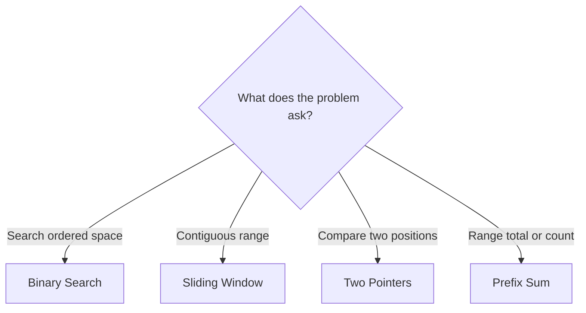
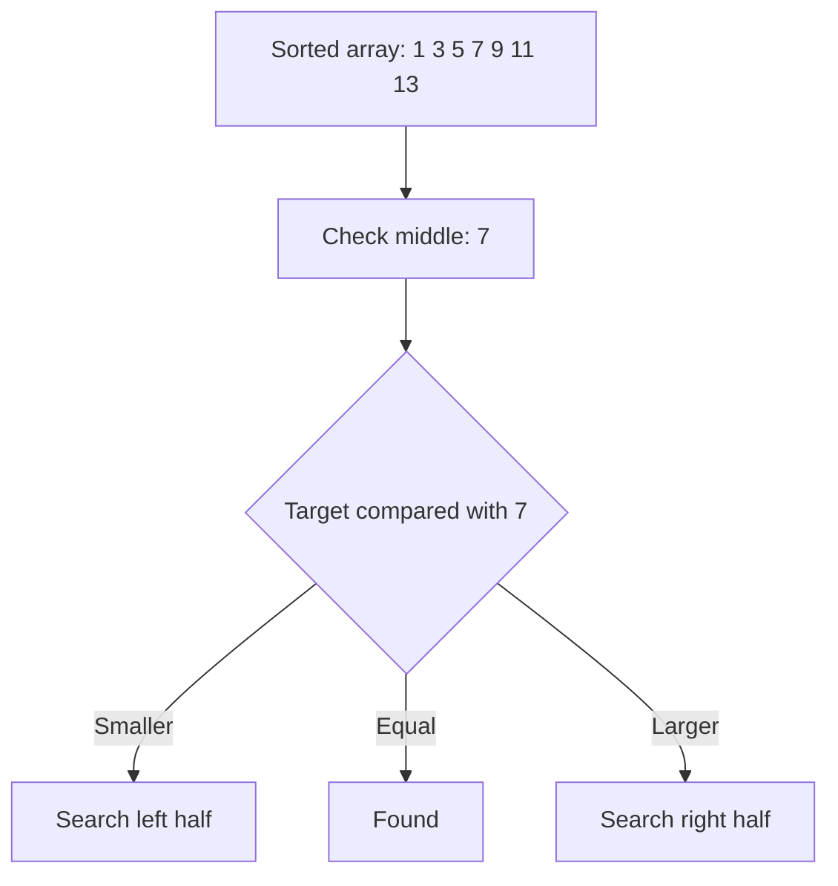
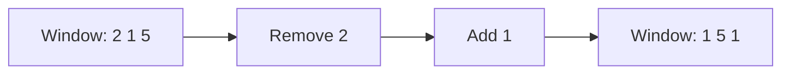
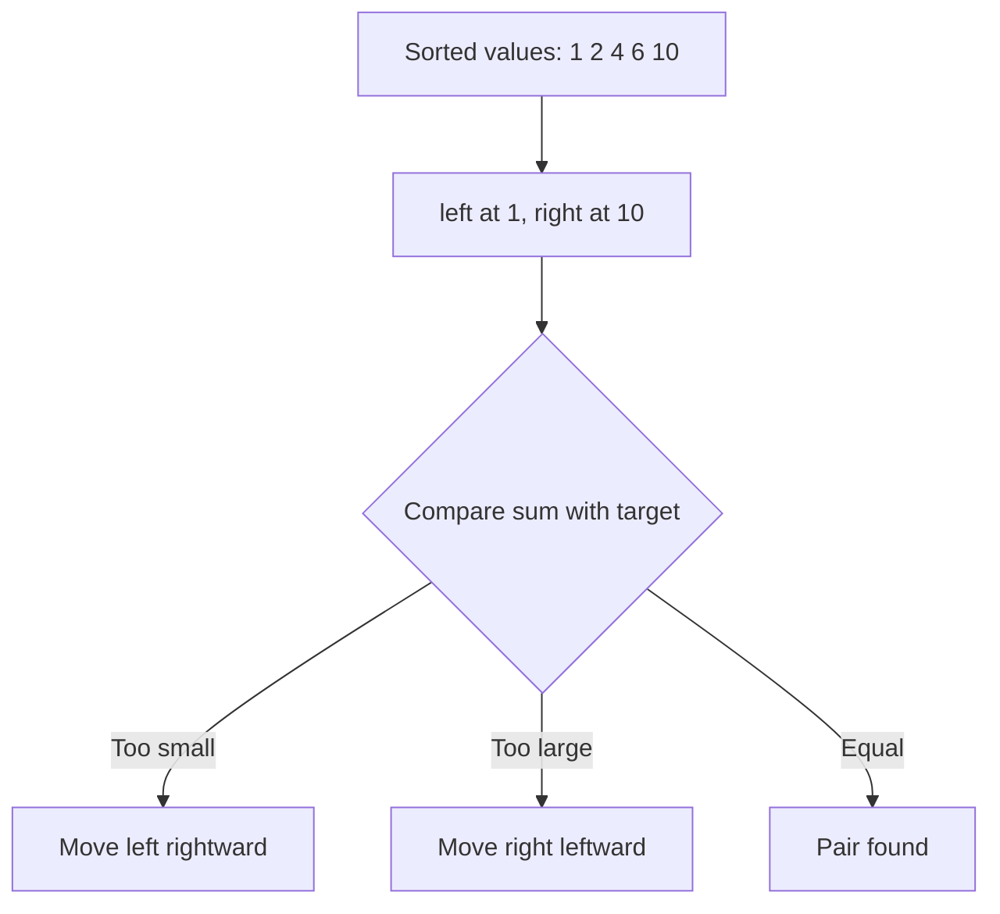
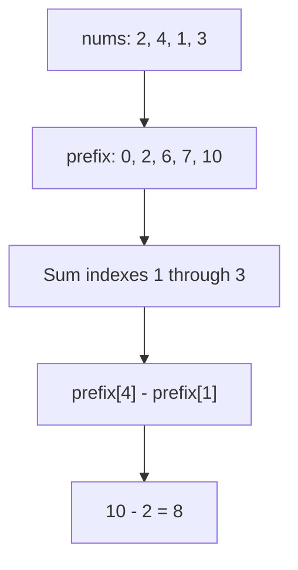
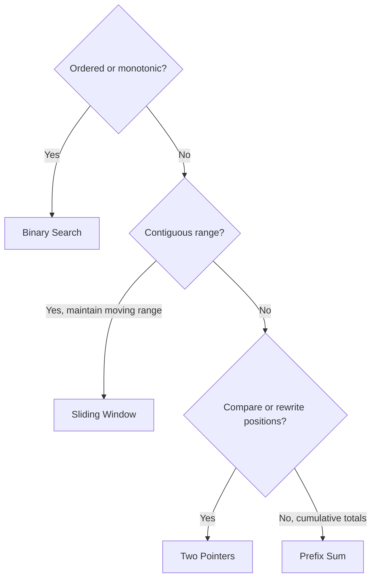

These four patterns solve a huge percentage of array and string interview problems. I’ll use Go and explicitly explain what each variable stores—index, value, or calculated result.

## The big mental model

| Pattern        | Baby-level idea                              | Use it when                                              |
| -------------- | -------------------------------------------- | -------------------------------------------------------- |
| Binary Search  | Throw away half the possibilities repeatedly | Data or answer space is sorted/monotonic                 |
| Sliding Window | Move a window across contiguous elements     | The problem asks about a substring/subarray              |
| Two Pointers   | Use two fingers instead of nested loops      | Elements can be compared or processed from two positions |
| Prefix Sum     | Remember the total up to every position      | You need repeated range sums or subarray counts          |



---

# 1. Binary Search

## What is Binary Search?

Imagine looking for a name in a telephone book.

You do not start from page one. You open the middle:

* If the name comes before the middle, discard the right half.
* If the name comes after the middle, discard the left half.
* Repeat.

Every comparison removes approximately half of the remaining possibilities.



## Complexity

If there are `n` elements:

* After one step: `n/2`
* After two steps: `n/4`
* After three steps: `n/8`

We stop when:

[
\frac{n}{2^k}=1
]

Therefore:

[
k=\log_2 n
]

Time complexity: **O(log n)**
Space complexity: **O(1)** for iterative binary search.

For one billion elements, binary search needs only around 30 comparisons.

---

## What do the variables hold?

```go
// Exact question: What do the variables hold?
//
// Possible answer: Use the fragment to execute the shown state update directly from top to bottom.
//
// Output format: This is a partial Go fragment; its surrounding function determines the final returned value.
//
// Inline descriptions:
// - The comments in this preface describe how the important expressions and state changes are used.
//
// Boundary checks:
// - No explicit boundary branch appears in this fragment; its caller or surrounding example supplies valid inputs.
//
// Key variables:
// - `left` marks the current left boundary or left-side value.
// - `right` marks the current right boundary or right-side value.
// - `mid` holds the intermediate value produced by `left + (right-left)/2`.
//
// Logic:
// 1. Execute the statements from top to bottom to perform the demonstrated operation.
left := 0
right := len(nums) - 1
mid := left + (right-left)/2

// time complexity: O(log n) -> each step reduces the remaining search or problem size by a constant factor.
// space complexity: O(1) -> only a fixed number of scalar variables or references is kept.
```

* `left`: an index
* `right`: an index
* `mid`: an index
* `nums[mid]`: the value stored at the middle index
* `target`: the value we want to find

## Example

```text
nums   = [1, 3, 5, 7, 9]
indexes = 0  1  2  3  4
target = 7
```

| Step | `left` | `right` | `mid` | `nums[mid]` | Action                        |
| ---: | -----: | ------: | ----: | ----------: | ----------------------------- |
|    1 |      0 |       4 |     2 |           5 | Target is bigger, move `left` |
|    2 |      3 |       4 |     3 |           7 | Found at index 3              |

---

## Question 1: Standard Binary Search

```go
// Exact question: How can Standard Binary Search be solved using binary search?
//
// Possible answer: Repeatedly compare the middle element and discard the half that cannot contain the answer.
//
// Output format: Return an `int` value from `binarySearch`; the function does not print the answer.
//
// Inline descriptions:
// - `nums` is a slice: the index identifies an element or state, and the stored item has type int.
// - `target` is the int input used by this example.
//
// Boundary checks:
// - `left <= right` keeps indexes or pointers within the portion of the input still being processed.
// - `nums[mid] == target` decides whether the branch or loop should continue for the current input.
// - `nums[mid] < target` decides whether the branch or loop should continue for the current input.
//
// Key variables:
// - `nums` is a slice: the index identifies an element or state, and the stored item has type int.
// - `target` is the int input used by this example.
// - `left` marks the current left boundary or left-side value.
// - `right` marks the current right boundary or right-side value.
// - `mid` holds the intermediate value produced by `left + (right-left)/2`.
//
// Logic:
// 1. Create or use a slice so indexes identify positions and elements store their data or state.
// 2. Iterate through the required elements or states in the order shown.
// 3. Return the value produced after the state updates are complete.
package main

// binarySearch returns the index where target is found.
//
// Example:
// nums   = [1, 3, 5, 7, 9]
// target = 7
// return = 3
//
// It returns -1 if target is not present.
func binarySearch(nums []int, target int) int {
	// left and right store indexes, not array values.
	left := 0
	right := len(nums) - 1

	// Because both left and right are valid possible positions,
	// continue while left <= right.
	for left <= right {
		// Calculate the middle INDEX.
		//
		// This is safer than:
		// mid := (left + right) / 2
		//
		// because left + right could overflow in some languages.
		mid := left + (right-left)/2

		// nums[mid] is the VALUE at the middle index.
		if nums[mid] == target {
			return mid
		}

		if nums[mid] < target {
			// The target cannot be at mid or anywhere to its left.
			left = mid + 1
		} else {
			// The target cannot be at mid or anywhere to its right.
			right = mid - 1
		}
	}

	return -1
}

// time complexity: O(log n) -> each step reduces the remaining search or problem size by a constant factor.
// space complexity: O(1) -> only a fixed number of scalar variables or references is kept.
```

---

## Question 2: Find the First Position Greater Than or Equal to Target

This is commonly called `lowerBound`.

```text
nums   = [1, 3, 3, 3, 7]
target = 3

Answer = index 1
```

A normal binary search might return index `1`, `2`, or `3`. A lower-bound search specifically finds the first valid position.

```go
// Exact question: How does `lowerBound` solve Find the First Position Greater Than or Equal to Target?
//
// Possible answer: Use `lowerBound` to iterate through the input once, updating the running state for each element.
//
// Output format: Return an `int` value from `lowerBound`; the function does not print the answer.
//
// Inline descriptions:
// - `nums` is a slice: the index identifies an element or state, and the stored item has type int.
// - `target` is the int input used by this example.
//
// Boundary checks:
// - `left < right` keeps indexes or pointers within the portion of the input still being processed.
// - `nums[mid] < target` decides whether the branch or loop should continue for the current input.
//
// Key variables:
// - `nums` is a slice: the index identifies an element or state, and the stored item has type int.
// - `target` is the int input used by this example.
// - `left` marks the current left boundary or left-side value.
// - `right` marks the current right boundary or right-side value.
// - `mid` holds the intermediate value produced by `left + (right-left)/2`.
//
// Logic:
// 1. Create or use a slice so indexes identify positions and elements store their data or state.
// 2. Iterate through the required elements or states in the order shown.
// 3. Return the value produced after the state updates are complete.
// lowerBound returns the first index i where nums[i] >= target.
//
// If every value is smaller than target, it returns len(nums).
//
// Examples:
// [1, 3, 3, 7], target 3 -> 1
// [1, 3, 3, 7], target 4 -> 3
// [1, 3, 3, 7], target 9 -> 4
func lowerBound(nums []int, target int) int {
	left := 0

	// Unlike standard binary search, right starts at len(nums).
	// We use a half-open search range: [left, right).
	right := len(nums)

	for left < right {
		mid := left + (right-left)/2

		if nums[mid] < target {
			// mid is definitely too small.
			left = mid + 1
		} else {
			// nums[mid] could be the answer.
			// Keep mid inside the remaining search space.
			right = mid
		}
	}

	return left
}

// time complexity: O(log n) -> each step reduces the remaining search or problem size by a constant factor.
// space complexity: O(1) -> only a fixed number of scalar variables or references is kept.
```

---

## Question 3: Search in a Rotated Sorted Array

```text
Original: [0, 1, 2, 4, 5, 6, 7]
Rotated:  [4, 5, 6, 7, 0, 1, 2]
```

At least one side of the middle will still be sorted.

```go
// Exact question: How does `searchRotated` solve Search in a Rotated Sorted Array?
//
// Possible answer: Use `searchRotated` to iterate through the input once, updating the running state for each element.
//
// Output format: Return an `int` value from `searchRotated`; the function does not print the answer.
//
// Inline descriptions:
// - `nums` is a slice: the index identifies an element or state, and the stored item has type int.
// - `target` is the int input used by this example.
//
// Boundary checks:
// - `left <= right` keeps indexes or pointers within the portion of the input still being processed.
// - `nums[mid] == target` decides whether the branch or loop should continue for the current input.
// - `nums[left] <= nums[mid]` keeps indexes or pointers within the portion of the input still being processed.
//
// Key variables:
// - `nums` is a slice: the index identifies an element or state, and the stored item has type int.
// - `target` is the int input used by this example.
// - `left` marks the current left boundary or left-side value.
// - `right` marks the current right boundary or right-side value.
// - `mid` holds the intermediate value produced by `left + (right-left)/2`.
//
// Logic:
// 1. Create or use a slice so indexes identify positions and elements store their data or state.
// 2. Iterate through the required elements or states in the order shown.
// 3. Return the value produced after the state updates are complete.
// searchRotated searches for target in a rotated sorted array.
// It returns the target's index or -1.
//
// Assumption: all values are unique.
func searchRotated(nums []int, target int) int {
	left := 0
	right := len(nums) - 1

	for left <= right {
		mid := left + (right-left)/2

		if nums[mid] == target {
			return mid
		}

		// Check whether the left half is sorted.
		if nums[left] <= nums[mid] {
			// Determine whether target is inside the sorted left half.
			if nums[left] <= target && target < nums[mid] {
				right = mid - 1
			} else {
				left = mid + 1
			}
		} else {
			// Otherwise, the right half must be sorted.
			if nums[mid] < target && target <= nums[right] {
				left = mid + 1
			} else {
				right = mid - 1
			}
		}
	}

	return -1
}

// time complexity: O(log n) -> each step reduces the remaining search or problem size by a constant factor.
// space complexity: O(1) -> only a fixed number of scalar variables or references is kept.
```

## Common Binary Search interview questions

### Beginner

* Binary Search
* Search Insert Position
* First Bad Version
* Sqrt(x)
* Valid Perfect Square

### Medium

* Find First and Last Position
* Search a 2D Matrix
* Search in Rotated Sorted Array
* Find Minimum in Rotated Sorted Array
* Find Peak Element
* Koko Eating Bananas
* Capacity to Ship Packages Within D Days

### Advanced

* Median of Two Sorted Arrays
* Split Array Largest Sum
* Aggressive Cows
* Minimize Maximum Distance to Gas Station

## Interview recognition clue

Think binary search when you hear:

* “sorted”
* “minimum possible”
* “maximum possible”
* “first valid”
* “last valid”
* “can we complete this within `x`?”
* “find the smallest capacity/speed/time”

The data does not always need to be sorted. Sometimes the **possible answers** are ordered.

---

# 2. Sliding Window

## What is a Sliding Window?

A window is a contiguous section of an array or string.

```text
Array:  [2, 1, 5, 1, 3, 2]
Window:        [5, 1, 3]
```

Instead of recalculating every window from scratch:

1. Remove the element leaving the window.
2. Add the element entering the window.



There are two major types:

| Type            | Window size         | Example                              |
| --------------- | ------------------- | ------------------------------------ |
| Fixed window    | Always `k` elements | Maximum sum of size `k`              |
| Variable window | Expands and shrinks | Longest substring without duplicates |

## What do the variables hold?

* `left`: index of the first element in the window
* `right`: index of the last element in the window
* `nums[left:right+1]`: values currently inside the window
* `windowSum`: sum of values inside the current window
* `right-left+1`: current window length

---

## Question 1: Maximum Sum Subarray of Size K

```text
nums = [2, 1, 5, 1, 3, 2]
k = 3

Windows:
[2, 1, 5] = 8
[1, 5, 1] = 7
[5, 1, 3] = 9  <- maximum
[1, 3, 2] = 6
```

### Brute force

Calculate every window separately: **O(n × k)**.

### Sliding window

Reuse the previous sum: **O(n)**.

```go
// Exact question: How does `maxSumSubarrayK` solve Sliding window?
//
// Possible answer: Expand and shrink a contiguous window while maintaining the state needed for its answer.
//
// Output format: Return the `(int, bool)` value from `maxSumSubarrayK`; the function does not print the answer.
//
// Inline descriptions:
// - `nums` is a slice: the index identifies an element or state, and the stored item has type int.
// - `k` is the int input used by this example.
//
// Boundary checks:
// - `k <= 0 || k > len(nums)` handles the smallest valid state or recursive base case.
// - `windowSum > maxSum` decides whether the branch or loop should continue for the current input.
//
// Key variables:
// - `nums` is a slice: the index identifies an element or state, and the stored item has type int.
// - `k` is the int input used by this example.
// - `windowSum` holds the intermediate value produced by `0`.
// - `maxSum` holds the intermediate value produced by `windowSum`.
//
// Logic:
// 1. Create or use a slice so indexes identify positions and elements store their data or state.
// 2. Iterate through the required elements or states in the order shown.
// 3. Return the value produced after the state updates are complete.
// maxSumSubarrayK returns the maximum sum of any
// contiguous subarray containing exactly k elements.
//
// The bool is false when k is invalid.
func maxSumSubarrayK(nums []int, k int) (int, bool) {
	if k <= 0 || k > len(nums) {
		return 0, false
	}

	windowSum := 0

	// Build the first window containing indexes 0 through k-1.
	for i := 0; i < k; i++ {
		windowSum += nums[i]
	}

	maxSum := windowSum

	// right is the INDEX of the new element entering the window.
	for right := k; right < len(nums); right++ {
		// nums[right] enters the window.
		windowSum += nums[right]

		// right-k is the INDEX of the element leaving the window.
		windowSum -= nums[right-k]

		if windowSum > maxSum {
			maxSum = windowSum
		}
	}

	return maxSum, true
}

// time complexity: O(n) -> the algorithm visits each of the `n` input elements or states once.
// space complexity: O(1) -> only a fixed number of scalar variables or references is kept.
```

---

## Question 2: Longest Substring Without Repeating Characters

```text
Input: "abcabcbb"

Longest valid substring: "abc"
Answer: 3
```

The window expands using `right`. If a duplicate appears, `left` moves forward.

```go
// Exact question: How does `lengthOfLongestSubstring` solve Longest Substring Without Repeating Characters?
//
// Possible answer: Use `lengthOfLongestSubstring` to scan the input while a map connects each lookup key to its stored value or state.
//
// Output format: Return an `int` value from `lengthOfLongestSubstring`; the function does not print the answer.
//
// Inline descriptions:
// - `s` is the string input used by this example.
//
// Boundary checks:
// - `found && previousIndex >= left` keeps indexes or pointers within the portion of the input still being processed.
// - `currentLength > maxLength` decides whether the branch or loop should continue for the current input.
//
// Key variables:
// - `s` is the string input used by this example.
// - `lastSeen` is a map whose keys are byte lookups and whose values are stored int results.
// - `left` marks the current left boundary or left-side value.
// - `maxLength` holds the intermediate value produced by `0`.
// - `char` holds the intermediate value produced by `s[right]`.
//
// Logic:
// 1. Create or use a map to associate each lookup key with its stored value.
// 2. Iterate through the required elements or states in the order shown.
// 3. Return the value produced after the state updates are complete.
// lengthOfLongestSubstring returns the length of the longest
// substring that contains no repeated bytes.
//
// This version is appropriate for common ASCII-based interview questions.
func lengthOfLongestSubstring(s string) int {
	// lastSeen stores:
	// key   = character value
	// value = most recent INDEX where the character appeared
	lastSeen := make(map[byte]int)

	left := 0
	maxLength := 0

	// right is an INDEX.
	// s[right] is the character VALUE at that index.
	for right := 0; right < len(s); right++ {
		char := s[right]

		previousIndex, found := lastSeen[char]

		// Move left only if the repeated character is still
		// inside the current window.
		if found && previousIndex >= left {
			left = previousIndex + 1
		}

		// Record the character's newest index.
		lastSeen[char] = right

		// Current window is s[left : right+1].
		currentLength := right - left + 1

		if currentLength > maxLength {
			maxLength = currentLength
		}
	}

	return maxLength
}

// time complexity: O(n) -> the algorithm visits each of the `n` input elements or states once.
// space complexity: O(n) -> the auxiliary slice, map, table, queue, or returned collection can grow with `n`.
```

### Important line

```go
// Exact question: How does this Go example demonstrate Important line?
//
// Possible answer: Use the fragment to execute the shown state update directly from top to bottom.
//
// Output format: This fragment demonstrates syntax or state updates and does not define a standalone output value.
//
// Inline descriptions:
// - The comments in this preface describe how the important expressions and state changes are used.
//
// Boundary checks:
// - No explicit boundary branch appears in this fragment; its caller or surrounding example supplies valid inputs.
//
// Key variables:
// - This fragment operates directly on the values named in each statement; it introduces no separate data structure.
//
// Logic:
// 1. Execute the statements from top to bottom to perform the demonstrated operation.
left = previousIndex + 1

// time complexity: O(1) -> the snippet performs a fixed number of operations independent of input size.
// space complexity: O(1) -> only a fixed number of scalar variables or references is kept.
```

We do not move `left` one position at a time. We jump directly past the previous duplicate.

---

## Question 3: Minimum Size Subarray Sum

Find the shortest contiguous subarray whose sum is at least `target`.

```go
// Exact question: How does `minSubarrayLen` solve Minimum Size Subarray Sum?
//
// Possible answer: Use `minSubarrayLen` with nested iteration to examine the required combinations or table states.
//
// Output format: Return an `int` value from `minSubarrayLen`; the function does not print the answer.
//
// Inline descriptions:
// - `target` is the int input used by this example.
// - `nums` is a slice: the index identifies an element or state, and the stored item has type int.
//
// Boundary checks:
// - `windowSum >= target` decides whether the branch or loop should continue for the current input.
// - `currentLength < minLength` decides whether the branch or loop should continue for the current input.
// - `minLength == len(nums)+1` decides whether the branch or loop should continue for the current input.
//
// Key variables:
// - `target` is the int input used by this example.
// - `nums` is a slice: the index identifies an element or state, and the stored item has type int.
// - `left` marks the current left boundary or left-side value.
// - `windowSum` holds the intermediate value produced by `0`.
// - `minLength` holds the intermediate value produced by `len(nums) + 1`.
//
// Logic:
// 1. Create or use a slice so indexes identify positions and elements store their data or state.
// 2. Iterate through the required elements or states in the order shown.
// 3. Return the value produced after the state updates are complete.
// minSubarrayLen returns the minimum length of a contiguous
// subarray whose sum is at least target.
//
// Important: this sliding-window solution assumes all numbers
// are positive. Negative values would break the shrinking logic.
func minSubarrayLen(target int, nums []int) int {
	left := 0
	windowSum := 0
	minLength := len(nums) + 1

	for right, value := range nums {
		// Expand the window.
		windowSum += value

		// While the window satisfies the condition,
		// shrink it to find the smallest valid window.
		for windowSum >= target {
			currentLength := right - left + 1

			if currentLength < minLength {
				minLength = currentLength
			}

			// Remove the leftmost value and move left.
			windowSum -= nums[left]
			left++
		}
	}

	if minLength == len(nums)+1 {
		return 0
	}

	return minLength
}

// time complexity: O(n^2) -> nested traversal can compare or process every pair of input elements.
// space complexity: O(1) -> only a fixed number of scalar variables or references is kept.
```

## Common Sliding Window interview questions

### Fixed-size windows

* Maximum Average Subarray I
* Maximum Sum Subarray of Size K
* Find All Anagrams in a String
* Permutation in String
* Maximum Number of Vowels in a Substring

### Variable-size windows

* Longest Substring Without Repeating Characters
* Minimum Size Subarray Sum
* Longest Repeating Character Replacement
* Max Consecutive Ones III
* Fruit Into Baskets

### Advanced

* Minimum Window Substring
* Sliding Window Maximum
* Subarrays with K Different Integers
* Minimum Operations to Reduce X to Zero

## Interview recognition clue

Think sliding window when the question says:

* substring
* contiguous subarray
* longest or shortest contiguous section
* exactly `k` consecutive elements
* at most `k` distinct values
* without repeating characters

---

# 3. Two Pointers

## What are Two Pointers?

Two pointers means keeping two indexes and moving them according to a rule.

Common forms:

| Form                | Starting positions       | Example              |
| ------------------- | ------------------------ | -------------------- |
| Opposite directions | One at start, one at end | Pair sum, palindrome |
| Same direction      | Both near the start      | Remove duplicates    |
| Fast and slow       | One moves faster         | Linked-list cycle    |
| Read and write      | One reads, one writes    | Move zeroes          |



---

## Question 1: Two Sum in a Sorted Array

```text
nums = [1, 2, 4, 6, 10]
target = 8
```

Trace:

| `left` value | `right` value | Sum | Action                  |
| -----------: | ------------: | --: | ----------------------- |
|            1 |            10 |  11 | Too large: move `right` |
|            1 |             6 |   7 | Too small: move `left`  |
|            2 |             6 |   8 | Found                   |

Why does this work?

* If the sum is too small, moving `right` left would make it even smaller.
* Therefore, only `left` should move.
* If the sum is too large, only `right` should move.

This reasoning depends on the array being sorted.

```go
// Exact question: Why does this work?
//
// Possible answer: Use `twoSumSorted` to iterate through the input once, updating the running state for each element.
//
// Output format: Return the `(int, int, bool)` value from `twoSumSorted`; the function does not print the answer.
//
// Inline descriptions:
// - `nums` is a slice: the index identifies an element or state, and the stored item has type int.
// - `target` is the int input used by this example.
//
// Boundary checks:
// - `left < right` keeps indexes or pointers within the portion of the input still being processed.
// - `sum == target` decides whether the branch or loop should continue for the current input.
// - `sum < target` decides whether the branch or loop should continue for the current input.
//
// Key variables:
// - `nums` is a slice: the index identifies an element or state, and the stored item has type int.
// - `target` is the int input used by this example.
// - `left` marks the current left boundary or left-side value.
// - `right` marks the current right boundary or right-side value.
// - `sum` holds the intermediate value produced by `nums[left] + nums[right]`.
//
// Logic:
// 1. Create or use a slice so indexes identify positions and elements store their data or state.
// 2. Iterate through the required elements or states in the order shown.
// 3. Return the value produced after the state updates are complete.
// twoSumSorted finds two numbers in a sorted array whose sum
// equals target.
//
// It returns their indexes and true when found.
func twoSumSorted(nums []int, target int) (int, int, bool) {
	// left and right store INDEXES.
	left := 0
	right := len(nums) - 1

	for left < right {
		// nums[left] and nums[right] are VALUES.
		sum := nums[left] + nums[right]

		if sum == target {
			return left, right, true
		}

		if sum < target {
			// We need a larger sum.
			// Move toward a larger left-side value.
			left++
		} else {
			// We need a smaller sum.
			// Move toward a smaller right-side value.
			right--
		}
	}

	return -1, -1, false
}

// time complexity: O(n) -> the algorithm visits each of the `n` input elements or states once.
// space complexity: O(1) -> only a fixed number of scalar variables or references is kept.
```

Complexity:

* Time: **O(n)**
* Space: **O(1)**

---

## Question 2: Remove Duplicates from a Sorted Array

```text
Input:  [1, 1, 2, 2, 3]
Result: [1, 2, 3, _, _]
Return: 3
```

We use:

* `read`: examines every element
* `write`: marks where the next unique value should go

```go
// Exact question: How does `removeDuplicates` solve Remove Duplicates from a Sorted Array?
//
// Possible answer: Use `removeDuplicates` to iterate through the input once, updating the running state for each element.
//
// Output format: Return an `int` value from `removeDuplicates`; the function does not print the answer.
//
// Inline descriptions:
// - `nums` is a slice: the index identifies an element or state, and the stored item has type int.
//
// Boundary checks:
// - `len(nums) == 0` handles empty input before any element is accessed.
// - `nums[read] != nums[read-1]` decides whether the branch or loop should continue for the current input.
//
// Key variables:
// - `nums` is a slice: the index identifies an element or state, and the stored item has type int.
// - `write` holds the intermediate value produced by `1`.
//
// Logic:
// 1. Create or use a slice so indexes identify positions and elements store their data or state.
// 2. Iterate through the required elements or states in the order shown.
// 3. Return the value produced after the state updates are complete.
// removeDuplicates modifies a sorted array in place.
//
// It returns the number of unique elements.
// The first returnedLength positions contain the unique values.
func removeDuplicates(nums []int) int {
	if len(nums) == 0 {
		return 0
	}

	// write is the INDEX where the next unique value should go.
	write := 1

	// read is the INDEX currently being examined.
	for read := 1; read < len(nums); read++ {
		// Compare the current value with the previous value.
		if nums[read] != nums[read-1] {
			// A new unique value was found.
			nums[write] = nums[read]
			write++
		}
	}

	// write is also the number of unique elements.
	return write
}

// time complexity: O(n) -> the algorithm visits each of the `n` input elements or states once.
// space complexity: O(1) -> only a fixed number of scalar variables or references is kept.
```

### Trace

| `read` | Value | Unique? | Action           | `write` |
| -----: | ----: | ------- | ---------------- | ------: |
|      1 |     1 | No      | Skip             |       1 |
|      2 |     2 | Yes     | Write at index 1 |       2 |
|      3 |     2 | No      | Skip             |       2 |
|      4 |     3 | Yes     | Write at index 2 |       3 |

---

## Question 3: Container With Most Water

```go
// Exact question: How does `maxArea` solve Container With Most Water?
//
// Possible answer: Use `maxArea` to iterate through the input once, updating the running state for each element.
//
// Output format: Return an `int` value from `maxArea`; the function does not print the answer.
//
// Inline descriptions:
// - `height` is a slice: the index identifies an element or state, and the stored item has type int.
//
// Boundary checks:
// - `left < right` keeps indexes or pointers within the portion of the input still being processed.
// - `height[right] < waterHeight` keeps indexes or pointers within the portion of the input still being processed.
// - `currentArea > bestArea` decides whether the branch or loop should continue for the current input.
//
// Key variables:
// - `height` is a slice: the index identifies an element or state, and the stored item has type int.
// - `left` marks the current left boundary or left-side value.
// - `right` marks the current right boundary or right-side value.
// - `bestArea` holds the intermediate value produced by `0`.
// - `width` holds the intermediate value produced by `right - left`.
//
// Logic:
// 1. Create or use a slice so indexes identify positions and elements store their data or state.
// 2. Iterate through the required elements or states in the order shown.
// 3. Return the value produced after the state updates are complete.
// maxArea finds the maximum amount of water that can be held
// between two vertical lines.
func maxArea(height []int) int {
	left := 0
	right := len(height) - 1
	bestArea := 0

	for left < right {
		// Width is the distance between the two indexes.
		width := right - left

		// Water height is limited by the shorter line.
		waterHeight := height[left]
		if height[right] < waterHeight {
			waterHeight = height[right]
		}

		currentArea := width * waterHeight

		if currentArea > bestArea {
			bestArea = currentArea
		}

		// Moving the taller line cannot improve the limiting height.
		// Therefore, move the shorter line and look for a taller one.
		if height[left] < height[right] {
			left++
		} else {
			right--
		}
	}

	return bestArea
}

// time complexity: O(n) -> the algorithm visits each of the `n` input elements or states once.
// space complexity: O(1) -> only a fixed number of scalar variables or references is kept.
```

## Common Two Pointers interview questions

### Opposite-direction pointers

* Two Sum II
* Valid Palindrome
* Reverse String
* Squares of a Sorted Array
* Container With Most Water
* 3Sum
* 4Sum
* Trapping Rain Water

### Same-direction pointers

* Remove Duplicates from Sorted Array
* Move Zeroes
* Remove Element
* Merge Sorted Array
* Sort Colors
* String Compression

### Fast and slow pointers

* Middle of the Linked List
* Linked List Cycle
* Find Duplicate Number
* Happy Number

## Interview recognition clue

Think two pointers when:

* The array is sorted.
* You need a pair or triplet.
* You must modify an array in place.
* You compare values from opposite ends.
* The brute-force solution contains two nested loops.

---

# 4. Prefix Sum

## What is Prefix Sum?

A prefix sum stores the total before every position.

Given:

```text
nums = [2, 4, 1, 3]
```

Build:

```text
prefix = [0, 2, 6, 7, 10]
```

Meaning:

| Prefix index | Meaning              | Value |
| -----------: | -------------------- | ----: |
|            0 | Sum of zero elements |     0 |
|            1 | `2`                  |     2 |
|            2 | `2 + 4`              |     6 |
|            3 | `2 + 4 + 1`          |     7 |
|            4 | `2 + 4 + 1 + 3`      |    10 |

The extra zero makes the calculation cleaner.



For an inclusive range `[left, right]`:

[
rangeSum = prefix[right+1] - prefix[left]
]

Why subtraction works:

```text
prefix[right+1] = unwanted beginning + wanted range
prefix[left]    = unwanted beginning

Subtract them and only the wanted range remains.
```

---

## Question 1: Range Sum Query

```go
// Exact question: How does `buildPrefixSum`, `rangeSum` solve Range Sum Query?
//
// Possible answer: Use `buildPrefixSum`, `rangeSum` to iterate through the input once, updating the running state for each element.
//
// Output format: Return the `[]int` value from `buildPrefixSum`; the function does not print the answer.
//
// Inline descriptions:
// - `nums` is a slice: the index identifies an element or state, and the stored item has type int.
//
// Boundary checks:
// - No explicit boundary branch appears in this fragment; its caller or surrounding example supplies valid inputs.
//
// Key variables:
// - `nums` is a slice: the index identifies an element or state, and the stored item has type int.
// - `prefix` is a slice; indexes identify positions and elements hold the corresponding values.
//
// Logic:
// 1. Create or use a slice so indexes identify positions and elements store their data or state.
// 2. Iterate through the required elements or states in the order shown.
// 3. Recursively reduce the current problem to smaller calls until a base condition is reached.
// buildPrefixSum builds a prefix array with one extra position.
//
// For nums = [2, 4, 1, 3]
// it returns [0, 2, 6, 7, 10].
func buildPrefixSum(nums []int) []int {
	prefix := make([]int, len(nums)+1)

	for i, value := range nums {
		// prefix[i] contains the sum before nums[i].
		// Add nums[i] to produce the next prefix.
		prefix[i+1] = prefix[i] + value
	}

	return prefix
}

// rangeSum returns the sum from index left through right,
// including both endpoints.
//
// Formula:
// prefix[right+1] - prefix[left]
func rangeSum(prefix []int, left int, right int) int {
	return prefix[right+1] - prefix[left]
}

// time complexity: O(n) -> the algorithm visits each of the `n` input elements or states once.
// space complexity: O(1) -> only a fixed number of scalar variables or references is kept.
```

Usage:

```go
// Exact question: How does this Go example demonstrate Range Sum Query?
//
// Possible answer: Use the fragment with a slice whose indexes identify positions and whose elements hold their values.
//
// Output format: This is a partial Go fragment; its surrounding function determines the final returned value.
//
// Inline descriptions:
// - The comments in this preface describe how the important expressions and state changes are used.
//
// Boundary checks:
// - No explicit boundary branch appears in this fragment; its caller or surrounding example supplies valid inputs.
//
// Key variables:
// - `nums` is a slice; indexes identify positions and elements hold the corresponding values.
// - `prefix` holds the intermediate value produced by `buildPrefixSum(nums`.
// - `answer` tracks the best or final answer found so far.
//
// Logic:
// 1. Create or use a slice so indexes identify positions and elements store their data or state.
nums := []int{2, 4, 1, 3}
prefix := buildPrefixSum(nums)

answer := rangeSum(prefix, 1, 3)
// nums[1] + nums[2] + nums[3]
// 4 + 1 + 3 = 8

// time complexity: O(1) -> the snippet performs a fixed number of operations independent of input size.
// space complexity: O(1) -> only a fixed number of scalar variables or references is kept.
```

Complexity:

* Building prefix sum: **O(n)**
* Each range query: **O(1)**
* Extra space: **O(n)**

Without prefix sum, each query could take **O(n)**.

---

## Question 2: Subarray Sum Equals K

```text
nums = [1, 1, 1]
k = 2

Valid subarrays:
indexes [0..1] = 2
indexes [1..2] = 2

Answer = 2
```

Suppose the running sum at the current position is `currentSum`.

We want:

[
currentSum - previousSum = k
]

Rearrange:

[
previousSum = currentSum - k
]

Therefore, we check how many times `currentSum-k` appeared earlier.

```go
// Exact question: How does `subarraySum` solve Subarray Sum Equals K?
//
// Possible answer: Use `subarraySum` to scan the input while a map connects each lookup key to its stored value or state.
//
// Output format: Return an `int` value from `subarraySum`; the function does not print the answer.
//
// Inline descriptions:
// - `nums` is a slice: the index identifies an element or state, and the stored item has type int.
// - `k` is the int input used by this example.
//
// Boundary checks:
// - No explicit boundary branch appears in this fragment; its caller or surrounding example supplies valid inputs.
//
// Key variables:
// - `nums` is a slice: the index identifies an element or state, and the stored item has type int.
// - `k` is the int input used by this example.
// - `prefixFrequency` is a map whose keys are int lookups and whose values are stored int results.
// - `runningSum` holds the intermediate value produced by `0`.
// - `result` holds the answer computed for the current operation.
//
// Logic:
// 1. Create or use a map to associate each lookup key with its stored value.
// 2. Create or use a slice so indexes identify positions and elements store their data or state.
// 3. Iterate through the required elements or states in the order shown.
// subarraySum counts how many contiguous subarrays have a sum
// exactly equal to k.
//
// This works with positive, zero, and negative numbers.
func subarraySum(nums []int, k int) int {
	// prefixFrequency stores:
	// key   = a prefix-sum VALUE
	// value = how many times that prefix sum has appeared
	//
	// Sum zero has appeared once before processing any elements.
	prefixFrequency := map[int]int{
		0: 1,
	}

	runningSum := 0
	result := 0

	for _, value := range nums {
		runningSum += value

		// We need an earlier prefix sum such that:
		//
		// runningSum - earlierPrefix = k
		//
		// Therefore:
		// earlierPrefix = runningSum - k
		neededPrefix := runningSum - k

		// Every occurrence of neededPrefix creates one valid
		// subarray ending at the current position.
		result += prefixFrequency[neededPrefix]

		// Record the current prefix sum for future positions.
		prefixFrequency[runningSum]++
	}

	return result
}

// time complexity: O(n) -> the algorithm visits each of the `n` input elements or states once.
// space complexity: O(n) -> the auxiliary slice, map, table, queue, or returned collection can grow with `n`.
```

### Why `{0: 1}` is necessary

Consider:

```text
nums = [2]
k = 2
```

At index `0`:

```text
runningSum = 2
neededPrefix = 2 - 2 = 0
```

The initial zero represents the sum before the array begins. It allows us to count subarrays starting at index `0`.

### Important ordering

Do this:

```go
// Exact question: How does this Go example demonstrate Important ordering?
//
// Possible answer: Use the fragment to execute the shown state update directly from top to bottom.
//
// Output format: This fragment demonstrates syntax or state updates and does not define a standalone output value.
//
// Inline descriptions:
// - The comments in this preface describe how the important expressions and state changes are used.
//
// Boundary checks:
// - No explicit boundary branch appears in this fragment; its caller or surrounding example supplies valid inputs.
//
// Key variables:
// - This fragment operates directly on the values named in each statement; it introduces no separate data structure.
//
// Logic:
// 1. Execute the statements from top to bottom to perform the demonstrated operation.
result += prefixFrequency[neededPrefix]
prefixFrequency[runningSum]++

// time complexity: O(1) -> the snippet performs a fixed number of operations independent of input size.
// space complexity: O(1) -> only a fixed number of scalar variables or references is kept.
```

Check first, record second. Otherwise, when `k == 0`, the current prefix could incorrectly match itself.

---

## Question 3: Find the Pivot Index

At a pivot index:

```text
sum on left == sum on right
```

```go
// Exact question: How does `pivotIndex` solve Find the Pivot Index?
//
// Possible answer: Use `pivotIndex` with nested iteration to examine the required combinations or table states.
//
// Output format: Return an `int` value from `pivotIndex`; the function does not print the answer.
//
// Inline descriptions:
// - `nums` is a slice: the index identifies an element or state, and the stored item has type int.
//
// Boundary checks:
// - `leftSum == rightSum` decides whether the branch or loop should continue for the current input.
//
// Key variables:
// - `nums` is a slice: the index identifies an element or state, and the stored item has type int.
// - `totalSum` holds the intermediate value produced by `0`.
// - `leftSum` marks the current left boundary or left-side value.
// - `rightSum` marks the current right boundary or right-side value.
//
// Logic:
// 1. Create or use a slice so indexes identify positions and elements store their data or state.
// 2. Iterate through the required elements or states in the order shown.
// 3. Return the value produced after the state updates are complete.
// pivotIndex returns an index where the sum of all values
// to its left equals the sum of all values to its right.
func pivotIndex(nums []int) int {
	totalSum := 0

	for _, value := range nums {
		totalSum += value
	}

	leftSum := 0

	for index, value := range nums {
		// Remove the left sum and current value from the total.
		rightSum := totalSum - leftSum - value

		if leftSum == rightSum {
			return index
		}

		// The current value becomes part of the left side
		// for the next iteration.
		leftSum += value
	}

	return -1
}

// time complexity: O(n) -> the algorithm visits each of the `n` input elements or states once.
// space complexity: O(1) -> only a fixed number of scalar variables or references is kept.
```

## Common Prefix Sum interview questions

### Beginner

* Running Sum of 1D Array
* Range Sum Query – Immutable
* Find Pivot Index
* Find the Middle Index
* Left and Right Sum Differences

### Medium

* Subarray Sum Equals K
* Contiguous Array
* Product of Array Except Self using prefix/suffix products
* Range Sum Query 2D
* Path Sum III
* Corporate Flight Bookings
* Car Pooling
* Number of Ways to Split Array

### Advanced

* Count of Range Sum
* Maximum Size Subarray Sum Equals K
* Submatrix Sum Equals Target
* Continuous Subarray Sum

## Interview recognition clue

Think prefix sum when the problem asks:

* Sum between indexes `left` and `right`
* Many range queries
* Number of subarrays whose sum equals `k`
* Equal left and right sums
* Cumulative totals
* Submatrix sums

---

# Sliding Window vs Two Pointers

These are related, but not identical.

| Sliding Window                           | Two Pointers                                     |
| ---------------------------------------- | ------------------------------------------------ |
| Usually represents a contiguous range    | Pointers may represent unrelated positions       |
| Maintains state such as sum or frequency | Usually compares or rewrites values              |
| Often expands right and shrinks left     | Can move inward, forward, or at different speeds |
| Example: longest valid substring         | Example: pair sum in sorted array                |

Every sliding window uses two boundaries, but not every two-pointer problem is a sliding-window problem.

```text
Sliding window:
The entire range between left and right matters.

Two pointers:
Usually the values at left and right matter.
```

---

# Prefix Sum vs Sliding Window

Consider finding a subarray sum:

* Fixed-size or condition-based moving range: sliding window
* Many independent range-sum queries: prefix sum
* Count subarrays equal to `k`, especially with negatives: prefix sum + hash map

Important limitation:

```text
Variable sliding windows based on sum generally require positive numbers.
```

With negative numbers, removing a number might increase the sum, so the normal expand/shrink rule becomes unreliable. Prefix sums can still handle negative numbers.

---

# Pattern-selection checklist

When reading an interview question, ask these questions in order:



## Quick templates to memorize

### Binary Search

```go
// Exact question: How does this Go example demonstrate Binary Search?
//
// Possible answer: Use the fragment to iterate through the input once, updating the running state for each element.
//
// Output format: This is a partial Go fragment; its surrounding function determines the final returned value.
//
// Inline descriptions:
// - The comments in this preface describe how the important expressions and state changes are used.
//
// Boundary checks:
// - `left <= right` keeps indexes or pointers within the portion of the input still being processed.
// - `nums[mid] == target` decides whether the branch or loop should continue for the current input.
//
// Key variables:
// - `mid` holds the intermediate value produced by `left + (right-left)/2`.
//
// Logic:
// 1. Iterate through the required elements or states in the order shown.
// 2. Return the value produced after the state updates are complete.
left, right := 0, len(nums)-1

for left <= right {
	mid := left + (right-left)/2

	if nums[mid] == target {
		return mid
	} else if nums[mid] < target {
		left = mid + 1
	} else {
		right = mid - 1
	}
}

// time complexity: O(log n) -> each step reduces the remaining search or problem size by a constant factor.
// space complexity: O(1) -> only a fixed number of scalar variables or references is kept.
```

### Fixed Sliding Window

```go
// Exact question: How can Fixed Sliding Window be solved using sliding window?
//
// Possible answer: Use the fragment to iterate through the input once, updating the running state for each element.
//
// Output format: This is a partial Go fragment; its surrounding function determines the final returned value.
//
// Inline descriptions:
// - The comments in this preface describe how the important expressions and state changes are used.
//
// Boundary checks:
// - `right >= k` keeps indexes or pointers within the portion of the input still being processed.
// - `right >= k-1` keeps indexes or pointers within the portion of the input still being processed.
//
// Key variables:
// - `windowSum` holds the intermediate value produced by `0`.
//
// Logic:
// 1. Iterate through the required elements or states in the order shown.
windowSum := 0

for right := 0; right < len(nums); right++ {
	windowSum += nums[right]

	if right >= k {
		windowSum -= nums[right-k]
	}

	if right >= k-1 {
		// Process the complete window.
	}
}

// time complexity: O(n) -> the algorithm visits each of the `n` input elements or states once.
// space complexity: O(1) -> only a fixed number of scalar variables or references is kept.
```

### Variable Sliding Window

```go
// Exact question: How can Variable Sliding Window be solved using sliding window?
//
// Possible answer: Use the fragment with nested iteration to examine the required combinations or table states.
//
// Output format: This is a partial Go fragment; its surrounding function determines the final returned value.
//
// Inline descriptions:
// - The comments in this preface describe how the important expressions and state changes are used.
//
// Boundary checks:
// - `/* window is invalid or can be minimized * /` decides whether the branch or loop should continue for the current input.
//
// Key variables:
// - `left` marks the current left boundary or left-side value.
//
// Logic:
// 1. Iterate through the required elements or states in the order shown.
left := 0

for right := 0; right < len(nums); right++ {
	// Add nums[right] to the window.

	for /* window is invalid or can be minimized */ {
		// Remove nums[left] from the window.
		left++
	}

	// Process window [left, right].
}

// time complexity: O(1) -> the snippet performs a fixed number of operations independent of input size.
// space complexity: O(1) -> only a fixed number of scalar variables or references is kept.
```

### Opposite Two Pointers

```go
// Exact question: How can Opposite Two Pointers be solved using two pointers?
//
// Possible answer: Use the fragment to iterate through the input once, updating the running state for each element.
//
// Output format: This is a partial Go fragment; its surrounding function determines the final returned value.
//
// Inline descriptions:
// - The comments in this preface describe how the important expressions and state changes are used.
//
// Boundary checks:
// - `left < right` keeps indexes or pointers within the portion of the input still being processed.
// - `/* condition satisfied * /` decides whether the branch or loop should continue for the current input.
//
// Key variables:
// - This fragment operates directly on the values named in each statement; it introduces no separate data structure.
//
// Logic:
// 1. Iterate through the required elements or states in the order shown.
// 2. Return the value produced after the state updates are complete.
left, right := 0, len(nums)-1

for left < right {
	if /* condition satisfied */ {
		return
	} else if /* need something larger */ {
		left++
	} else {
		right--
	}
}

// time complexity: O(1) -> the snippet performs a fixed number of operations independent of input size.
// space complexity: O(1) -> only a fixed number of scalar variables or references is kept.
```

### Prefix Sum

```go
// Exact question: How does this Go example demonstrate Prefix Sum?
//
// Possible answer: Use the fragment to iterate through the input once, updating the running state for each element.
//
// Output format: This is a partial Go fragment; its surrounding function determines the final returned value.
//
// Inline descriptions:
// - The comments in this preface describe how the important expressions and state changes are used.
//
// Boundary checks:
// - No explicit boundary branch appears in this fragment; its caller or surrounding example supplies valid inputs.
//
// Key variables:
// - `prefix` is a slice; indexes identify positions and elements hold the corresponding values.
// - `sum` holds the intermediate value produced by `prefix[right+1] - prefix[left]`.
//
// Logic:
// 1. Create or use a slice so indexes identify positions and elements store their data or state.
// 2. Iterate through the required elements or states in the order shown.
prefix := make([]int, len(nums)+1)

for i := 0; i < len(nums); i++ {
	prefix[i+1] = prefix[i] + nums[i]
}

// Inclusive range [left, right].
sum := prefix[right+1] - prefix[left]

// time complexity: O(n) -> the algorithm visits each of the `n` input elements or states once.
// space complexity: O(1) -> only a fixed number of scalar variables or references is kept.
```

---

# Recommended practice order

1. Binary Search
2. Search Insert Position
3. First and Last Position
4. Two Sum II
5. Valid Palindrome
6. Move Zeroes
7. Maximum Sum Subarray of Size K
8. Longest Substring Without Repeating Characters
9. Minimum Size Subarray Sum
10. Range Sum Query
11. Pivot Index
12. Subarray Sum Equals K
13. 3Sum
14. Search in Rotated Sorted Array
15. Minimum Window Substring

For every question, practise explaining these four things aloud:

1. What does each variable hold?
2. Why is it safe to move that pointer?
3. What invariant remains true?
4. What are the time and space complexities?
