# Arrays and Slices — A Compact Interview Guide

Arrays place values in indexed order. Go slices add a small descriptor over a backing array so the visible length can change while storage may still be shared.

- [Mental model](#mental-model)
- [Representation and core operations](#representation-and-core-operations)
- [Interview patterns and complexity](#interview-patterns-and-complexity)
- [Problem-solving checklist and common mistakes](#problem-solving-checklist-and-common-mistakes)
- [Top 10 Array Interview Questions](#top-10-array-interview-questions)
- [Interview checklist and next steps](#interview-checklist-and-next-steps)

> **Baby analogy:** Imagine numbered toy boxes in one straight row. The guide shows where every piece belongs before you start moving the pieces.

---

## Mental model

An index identifies a position, and the element at that position holds a value. Random access is fast because the address is calculated directly from the base address, element size, and index.

| Real system | How the topic appears |
| --- | --- |
| Image processing | Pixels stored in row-major order |
| Metrics | Time-series samples stored by time position |
| Databases | Contiguous pages and column batches |
| Networking | Packet bytes and buffers |

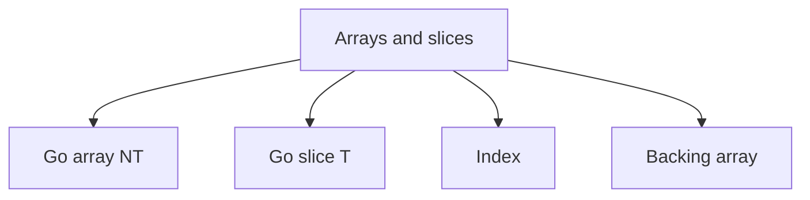

> **Baby analogy:** Imagine numbered toy boxes in one straight row. The box number is the index, while the toy inside is the value; do not confuse the label with the toy.

---

## Representation and core operations

Separate the logical slice from its physical backing array. Two slices can expose different ranges while still mutating the same storage.

| Representation | Role |
| --- | --- |
| Go array [N]T | Fixed length; assignment copies all elements |
| Go slice []T | Pointer, length, and capacity describing a backing array |
| Index | Zero-based position, not the stored value |
| Backing array | Contiguous element storage that slices may share |

| Operation | Typical cost | Meaning |
| --- | --- | --- |
| Read or write by index | O(1) | Calculate one element address |
| Append | Amortized O(1) | Reuse capacity or allocate and copy |
| Insert or delete in middle | O(n) | Shift later elements |
| Linear search | O(n) | Inspect values until a match |
| Copy n elements | O(n) | Duplicate the selected range |

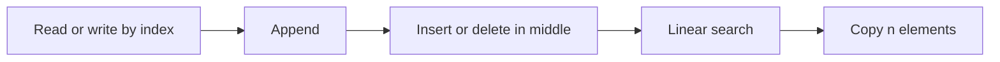

> **Baby analogy:** Imagine numbered toy boxes in one straight row. Opening one known box is immediate, but inserting a new box in the middle makes every later box slide over.

---

## Interview patterns and complexity

| Question clue | Pattern | Practice problems in this guide |
| --- | --- | --- |
| Pair or opposite ends | Two pointers | [Container With Most Water](#container-with-most-water), [Two Sum II](#two-sum-ii-on-a-sorted-array) |
| Contiguous range | Sliding window or prefix sum | [Maximum Subarray](#maximum-subarray), [Range Sum Query](#range-sum-query) |
| Best ending at each index | Kadane dynamic programming | [Best Time to Buy and Sell Stock](#best-time-to-buy-and-sell-stock), [Maximum Subarray](#maximum-subarray) |
| Value to earlier index | Hash map | [Two Sum](#two-sum) |
| In-place rearrangement | Read and write pointers | [Move Zeroes](#move-zeroes), [Rotate Array](#rotate-array), [Merge Sorted Array](#merge-sorted-array) |

| Work | Complexity | Reason |
| --- | --- | --- |
| Index access | O(1) | Address arithmetic is direct |
| Full scan | O(n) | Each element may be visited |
| Sort | O(n log n) | Comparison sorting |
| Returned array | O(n) | Output stores n values |

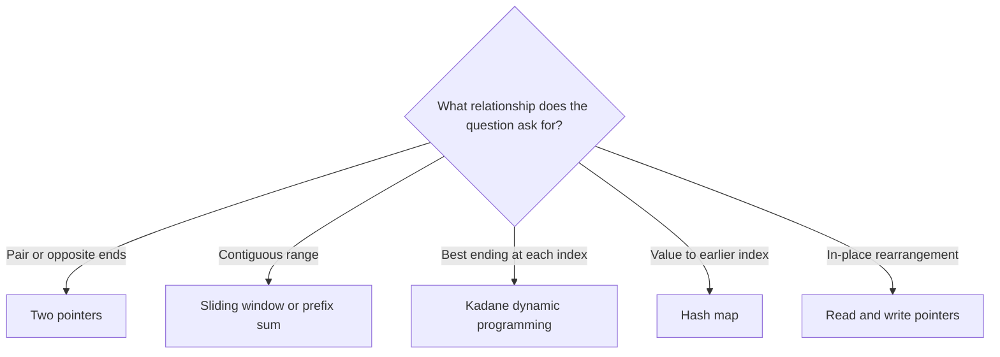

> **Baby analogy:** Imagine numbered toy boxes in one straight row. Different clues tell you whether to use two hands, a moving window, or a notebook of earlier positions.

---

## Problem-solving checklist and common mistakes

Before coding:

1. State exactly what the indexes, keys, pointers, states, or worklist elements represent.
2. Write the empty-input and smallest-input boundary behavior.
3. Choose the invariant that remains true after every step.
4. Trace one normal example and one edge case.
5. State whether output storage is included in space complexity.

Common mistakes:

- Using an index without checking bounds.
- Assuming copying a slice copies its elements.
- Forgetting that append may replace the backing array.
- Using zero as the initial best value when every input can be negative.
- Moving a pointer without proving discarded candidates cannot win.

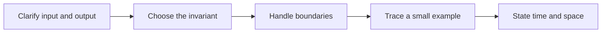

> **Baby analogy:** Imagine numbered toy boxes in one straight row. Check the first and last box labels before reaching, or your hand goes outside the shelf.

---

## Top 10 Array Interview Questions

These are the single authoritative implementations in this guide. Each solution keeps the required question, answer, output, boundary, variable-role, logic, and complexity comments.

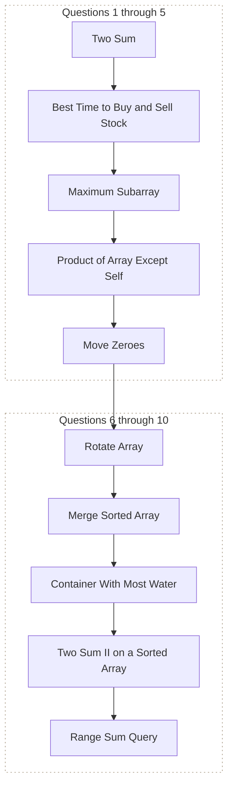

> **Baby analogy:** Imagine numbered toy boxes in one straight row. These ten puzzles are practice cards; each card teaches one reusable move.

### Two Sum

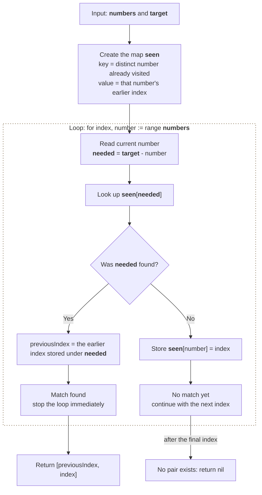

**Where it is used in real life:**

- Payment systems find two charges that reconcile to a target total.
- Inventory systems pair two item costs that fit an exact budget.

```go
// Exact question: Given an integer slice and a target, return the indexes of two distinct elements whose values add to the target, or return nil when no pair exists.
//
// Example: Input numbers = [2, 7, 11, 15] and target = 9 -> output [0, 1] because numbers[0] + numbers[1] = 9.
//
// Possible answer: Scan once while mapping each seen value to its index; before storing the current value, look up the complement `target-number`.
//
// Output format: Return the `[]int` value from `twoSum`; the function does not print the answer.
//
// Inline descriptions:
// - `numbers` is a slice: the index identifies an element or state, and the stored item has type int.
// - `target` is the int input used by this example.
//
// Boundary checks:
// - No explicit boundary branch appears in this fragment; its caller or surrounding example supplies valid inputs.
//
// Key variables:
// - `numbers` is a slice: the index identifies an element or state, and the stored item has type int.
// - `target` is the int input used by this example.
// - `seen` maps each previously visited number key to the index where that value appeared. seen[number_from_slice]= index_from_slice -> why do we want to store the number in the index? because the returned pair must be distinct.
// - `needed` holds the intermediate value produced by `target - number`.
//
// Logic:
// 1. Create or use a map to associate each lookup key with its stored value.
// 2. Create or use a slice so indexes identify positions and elements store their data or state.
// 3. Iterate through the required elements or states in the order shown.
func twoSum(numbers []int, target int) []int {
    seen := make(map[int]int)

    for index, number := range numbers {
        needed := target - number

        // previousIndex -> the value stored at seen[needed] which is the previous index in (numbers []int)
        if previousIndex, exists := seen[needed]; exists {
            return []int{previousIndex, index}
        }

        seen[number] = index
    }

    return nil
}

// time complexity: O(n) -> the algorithm visits each of the `n` input elements or states once.
// space complexity: O(n) -> the auxiliary slice, map, table, queue, or returned collection can grow with `n`.
```

> **Baby analogy:** Imagine numbered toy boxes in one straight row. "Two Sum" is one small game played with the same pieces and rules.

### Best Time to Buy and Sell Stock

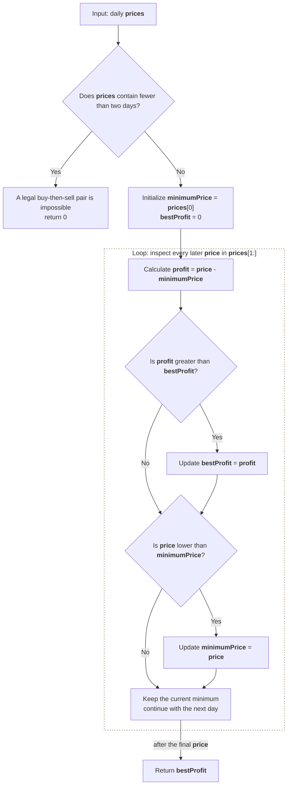

**Where it is used in real life:**

- Trading analysis finds the best historical single buy-and-sell interval.
- Capacity planners compare an earlier low demand point with a later peak.

```go
// Exact question: Given daily stock prices, return the maximum profit from buying once and selling once on a later day; return zero when no profit is possible.
//
// Example: Input prices = [7, 1, 5, 3, 6, 4] -> output 5 by buying at 1 and selling later at 6.
//
// Possible answer: Track the lowest earlier price and compare every current price with it to update the best legal sell profit.
//
// Output format: Return an `int` value from `maxProfit`; the function does not print the answer.
//
// Inline descriptions:
// - `prices` is a slice of daily prices: its index is the day, and `prices[day]` is the price stored for that day.
// - The slice order matters because the buy day must appear before the sell day.
//
// Boundary checks:
// - Fewer than two prices cannot form a buy-then-sell pair, so the function returns zero.
// - `profit > bestProfit` replaces the answer only when the current sell day produces a larger profit.
// - `price < minimumPrice` records a cheaper buying opportunity for future days, not the current day retroactively.
//
// Key variables:
// - `prices` holds price values; indexes represent chronological days rather than keys or IDs.
// - `price` is the selling price on the day currently being inspected.
// - `minimumPrice` is the lowest price seen strictly before or on the current scan position.
// - `profit` is the profit from selling at `price` after buying at `minimumPrice`.
// - `bestProfit` is the largest legal single-transaction profit found so far.
//
// Logic:
// 1. Reject an input that has no possible pair of days.
// 2. Treat the first price as the cheapest buying price known so far.
// 3. For every later day, calculate the profit from the cheapest earlier buy.
// 4. Update the best profit, then update the minimum price for future sell days.
// 5. Return zero when prices never rise; otherwise return the best profit.
func maxProfit(prices []int) int {
    if len(prices) < 2 {
        return 0
    }

    minimumPrice := prices[0]
    bestProfit := 0

    for _, price := range prices[1:] {
        // minimumPrice comes from an earlier day, so this profit always obeys buy-before-sell order.
        profit := price - minimumPrice

        if profit > bestProfit {
            bestProfit = profit
        }

        if price < minimumPrice {
            minimumPrice = price
        }
    }

    return bestProfit
}

// time complexity: O(n) -> each of the `n` daily prices is inspected at most once.
// space complexity: O(1) -> `minimumPrice`, `profit`, and `bestProfit` use a fixed amount of extra memory.
```

> **Baby analogy:** Imagine numbered toy boxes in one straight row. "Best Time to Buy and Sell Stock" is one small game played with the same pieces and rules.

### Maximum Subarray

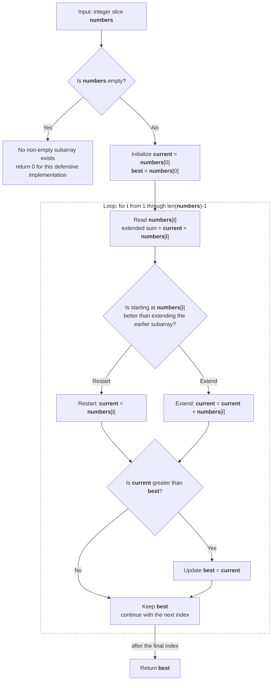

**Where it is used in real life:**

- Analytics finds the most profitable continuous time period.
- Monitoring finds the contiguous interval with the strongest cumulative signal.

```go
// Exact question: Given an integer slice, return the largest sum of any non-empty contiguous subarray.
//
// Example: Input numbers = [-2, 1, -3, 4, -1, 2, 1, -5, 4] -> output 6 from the contiguous subarray [4, -1, 2, 1].
//
// Possible answer: Apply Kadane's algorithm: at each index, either start a new subarray or extend the best subarray ending at the previous index.
//
// Output format: Return an `int` value from `maxSubArray`; the function does not print the answer.
//
// Inline descriptions:
// - `numbers` is a slice of signed values; an index is a position, and `numbers[index]` is the value stored there.
// - A valid subarray uses consecutive indexes and must contain at least one value.
//
// Boundary checks:
// - The LeetCode problem guarantees a non-empty slice; the defensive empty check returns zero before reading `numbers[0]`.
// - Initializing from `numbers[0]`, rather than zero, correctly handles an input containing only negative values.
//
// Key variables:
// - `numbers` holds array values; its indexes define which values are contiguous.
// - `i` is the index currently being considered as the end of a subarray.
// - `current` is the largest sum of a non-empty subarray that must end at index `i`.
// - `best` is the largest subarray sum found across every ending index inspected so far.
//
// Logic:
// 1. Seed both states with the first value so negative-only inputs remain valid.
// 2. At each later index, compare starting a new subarray with extending the previous one.
// 3. Store the better choice in `current`; this preserves the best sum ending exactly at this index.
// 4. Compare `current` with the global `best` and keep the larger value.
// 5. Return `best` after every possible ending index has been processed.
func maxSubArray(numbers []int) int {
    if len(numbers) == 0 {
        return 0
    }

    current := numbers[0]
    best := numbers[0]

    for i := 1; i < len(numbers); i++ {
        // Either discard the harmful earlier sum or extend it with the current value.
        current = max(numbers[i], current+numbers[i])
        best = max(best, current)
    }

    return best
}

// time complexity: O(n) -> each of the `n` values becomes the current subarray endpoint once.
// space complexity: O(1) -> the algorithm keeps only `current`, `best`, and the loop index.
```

> **Baby analogy:** Imagine numbered toy boxes in one straight row. "Maximum Subarray" is one small game played with the same pieces and rules.

### Product of Array Except Self

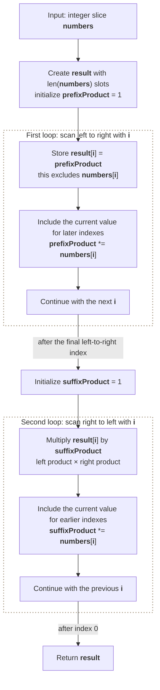

**Where it is used in real life:**

- Reliability models calculate combined factors while excluding one component at a time.
- Feature pipelines compute leave-one-out products without repeated full scans.

```go
// Exact question: Return an output slice where each index contains the product of every input value except the value at that index, without using division.
//
// Example: Input numbers = [1, 2, 3, 4] -> output [24, 12, 8, 6].
//
// Possible answer: Store each index's left-prefix product, then sweep from right to left while multiplying by a running suffix product.
//
// Output format: Return the `[]int` value from `productExceptSelf`; the function does not print the answer.
//
// Inline descriptions:
// - `numbers` is the input slice: each index identifies one input value that must be excluded from the matching output slot.
// - `result` is the output slice: `result[i]` stores the product of every input value except `numbers[i]`.
//
// Boundary checks:
// - An empty input returns an empty output because both loops execute zero times.
// - A one-element input returns `[1]`; one is the multiplicative identity of the empty set of other values.
// - The method does not divide, so inputs containing one or more zeroes are handled correctly.
//
// Key variables:
// - `numbers` holds input values; its indexes are positions, not keys.
// - `result[i]` stores the product of all input values except `numbers[i]`; its indexes match the input indexes.
// - `i` identifies the output slot being assembled during each directional scan.
// - `prefixProduct` is the product of every value strictly to the left of `i`.
// - `suffixProduct` is the product of every value strictly to the right of `i`.
//
// Logic:
// 1. Create an output slice with exactly one slot for every input index.
// 2. Scan left to right and store each index's product of values to its left.
// 3. Scan right to left while carrying the product of values to the current index's right.
// 4. Multiply the stored left product by the running right product.
// 5. Return the completed output without ever multiplying a slot by its own input value.
func productExceptSelf(numbers []int) []int {
    result := make([]int, len(numbers))

    prefixProduct := 1

    for i := 0; i < len(numbers); i++ {
        // Write before multiplying by numbers[i], so this slot excludes its own value.
        result[i] = prefixProduct
        prefixProduct *= numbers[i]
    }

    suffixProduct := 1

    for i := len(numbers) - 1; i >= 0; i-- {
        // suffixProduct still contains only values strictly to the right of i.
        result[i] *= suffixProduct
        suffixProduct *= numbers[i]
    }

    return result
}

// time complexity: O(n) -> two directional scans perform 2n iterations, which simplifies to O(n).
// space complexity: O(n) -> the returned `result` has n slots; auxiliary working space excluding the output is O(1).
```

> **Baby analogy:** Imagine numbered toy boxes in one straight row. "Product of Array Except Self" is one small game played with the same pieces and rules.

### Move Zeroes

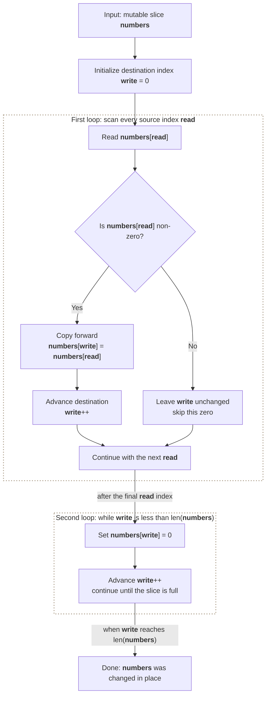

**Where it is used in real life:**

- Sparse-data pipelines compact meaningful values while preserving their order.
- Buffer cleanup moves empty slots behind active records.

```go
// Exact question: Move every zero to the end of the slice in place while preserving the relative order of all non-zero values.
//
// Example: Input numbers = [0, 1, 0, 3, 12] -> mutate it to [1, 3, 12, 0, 0].
//
// Possible answer: Write non-zero values forward with a write index, then fill every remaining position with zero.
//
// Output format: `moveZeroes` has no return value; its observable result is the mutation or output performed in the function body.
//
// Inline descriptions:
// - `numbers` is a mutable slice: indexes are positions, and each position stores an integer value.
// - The function changes the existing backing array and does not allocate or return another slice.
//
// Boundary checks:
// - An empty slice executes neither loop and remains unchanged.
// - `numbers[read] != 0` ensures only meaningful values are copied into the compacted prefix.
// - `write < len(numbers)` prevents the zero-filling pass from writing beyond the final valid index.
// - Inputs containing no zeroes or only zeroes preserve the required relative order.
//
// Key variables:
// - `numbers` holds values, not map keys; its indexes identify both source and destination positions.
// - `read` scans every original position exactly once.
// - `write` is the next destination index for a non-zero value, then the first position that must be filled with zero.
//
// Logic:
// 1. Start `write` at the first slice position.
// 2. Scan with `read`; copy each non-zero value to `numbers[write]` and advance `write`.
// 3. Because reads occur from left to right, copied non-zero values keep their original order.
// 4. After compaction, fill every slot from `write` through the end with zero.
// 5. Finish with the same slice length and backing array.
func moveZeroes(numbers []int) {
    write := 0

    for read := 0; read < len(numbers); read++ {
        if numbers[read] != 0 {
            // write never moves ahead of read, so this overwrite cannot destroy unread data.
            numbers[write] = numbers[read]
            write++
        }
    }

    for write < len(numbers) {
        numbers[write] = 0
        write++
    }
}

// time complexity: O(n) -> at most n reads compact values and at most n writes fill the remaining slots.
// space complexity: O(1) -> compaction uses only the `read` and `write` indexes beside the input slice.
```

> **Baby analogy:** Imagine numbered toy boxes in one straight row. "Move Zeroes" is one small game played with the same pieces and rules.

### Rotate Array

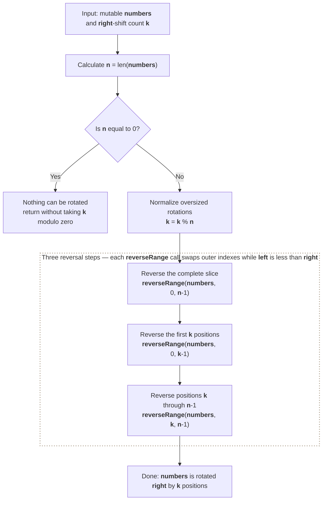

**Where it is used in real life:**

- Circular schedules shift assignments by a fixed offset.
- Ring-buffer views rotate the logical starting position.

```go
// Exact question: Rotate an integer slice to the right by `k` positions in place.
//
// Example: Input numbers = [1, 2, 3, 4, 5, 6, 7] and k = 3 -> mutate it to [5, 6, 7, 1, 2, 3, 4].
//
// Possible answer: Normalize `k`, reverse the entire slice, then reverse the first `k` values and the remaining values separately.
//
// Output format: `rotate` has no return value; its observable result is the mutation or output performed in the function body.
//
// Inline descriptions:
// - `numbers` is a mutable slice: each index is a position and each element is the integer value stored there.
// - `k` is the requested number of positions to shift every value to the right.
// - `reverseRange` reverses one inclusive index range within the same backing array.
//
// Boundary checks:
// - `n == 0` returns before `k %= n`, avoiding division by zero for an empty slice.
// - `k %= n` converts rotations larger than the slice into their equivalent in-range shift.
// - `left < right` stops each reversal when its two indexes meet or cross; it also makes an empty range such as `0..-1` safe.
//
// Key variables:
// - `numbers` holds the values being reordered; indexes describe positions rather than keys.
// - `k` is the normalized rotation distance in the range `0` through `n-1`.
// - `n` is the number of values and establishes the valid indexes `0` through `n-1`.
// - `left` and `right` identify the next pair of positions that `reverseRange` swaps.
//
// Logic:
// 1. Return immediately for an empty slice, then reduce `k` modulo the slice length.
// 2. Reverse the entire slice, moving the future rotated prefix to the front in reversed order.
// 3. Reverse the first `k` values to restore their internal order.
// 4. Reverse the remaining values to restore their internal order.
// 5. In each helper call, swap the outer pair and move both indexes inward until they meet.
func rotate(numbers []int, k int) {
    n := len(numbers)

    if n == 0 {
        return
    }

    k %= n

    // Example: [1 2 3 4 5], k=2 -> [5 4 3 2 1] -> [4 5 3 2 1] -> [4 5 1 2 3].
    reverseRange(numbers, 0, n-1)
    reverseRange(numbers, 0, k-1)
    reverseRange(numbers, k, n-1)
}

func reverseRange(numbers []int, left, right int) {
    for left < right {
        numbers[left], numbers[right] =
            numbers[right], numbers[left]

        left++
        right--
    }
}

// time complexity: O(n) -> the three reversals swap O(n) values in total.
// space complexity: O(1) -> rotation uses only `n`, `k`, and two helper indexes beside the input slice.
```

> **Baby analogy:** Imagine numbered toy boxes in one straight row. "Rotate Array" is one small game played with the same pieces and rules.

### Merge Sorted Array

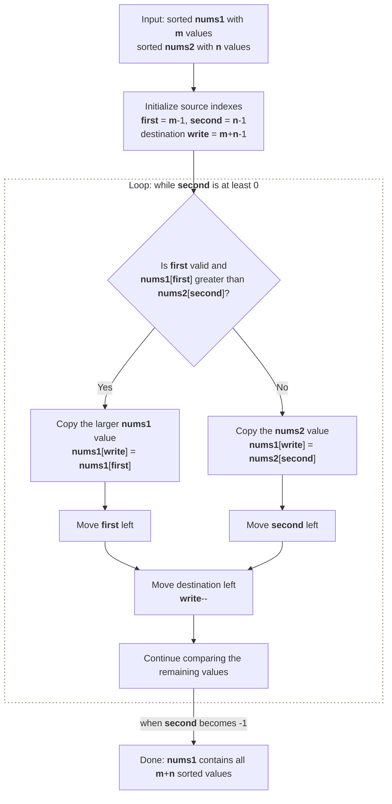

**Where it is used in real life:**

- Storage engines merge sorted runs during compaction.
- Event systems merge ordered batches by timestamp.

```go
// Exact question: Merge sorted `nums2` into sorted `nums1`, whose trailing capacity is large enough to hold both inputs.
//
// Example: Input nums1 = [1, 2, 3, 0, 0, 0], m = 3, nums2 = [2, 5, 6], n = 3 -> nums1 becomes [1, 2, 2, 3, 5, 6].
//
// Possible answer: Compare both slices from their ends and write the larger value into the final free position of `nums1`.
//
// Output format: `merge` has no return value; its observable result is the mutation or output performed in the function body.
//
// Inline descriptions:
// - `nums1` is the destination slice: indexes `0..m-1` hold sorted values and the trailing `n` slots are writable capacity.
// - `m` is the number of valid sorted values initially stored in `nums1`, not the total slice length.
// - `nums2` is the source slice: indexes `0..n-1` hold the other sorted values.
// - `n` is the number of valid values to read from `nums2`.
//
// Boundary checks:
// - `second >= 0` keeps merging until every `nums2` value has been copied.
// - `first >= 0` is checked before reading `nums1[first]`, preventing access to index -1 after nums1's original values are exhausted.
// - If `nums2` is exhausted first, the remaining `nums1` values are already in their correct positions.
// - Writing from the end prevents an unread value in the front of `nums1` from being overwritten.
//
// Key variables:
// - `nums1` holds destination values and spare slots; its indexes are positions, not lookup keys.
// - `nums2` holds source values that must all be inserted into `nums1`.
// - `m` and `n` are valid-value counts used to find each slice's last readable index.
// - `first` points to the largest unmerged original value in `nums1`.
// - `second` points to the largest unmerged value in `nums2`.
// - `write` points to the rightmost destination slot that has not been finalized.
//
// Logic:
// 1. Position both read indexes at the ends of their valid sorted values and `write` at the final destination slot.
// 2. Compare the largest values that have not yet been merged.
// 3. Copy the larger value into `nums1[write]` and move that value's source index left.
// 4. Move `write` left after every copy.
// 5. Stop after `nums2` is exhausted because any remaining original `nums1` values are already correctly placed.
func merge(nums1 []int, m int, nums2 []int, n int) {
    first := m - 1
    second := n - 1
    write := m + n - 1

    for second >= 0 {
        // Check first before indexing nums1 so an exhausted first slice safely falls into the else branch.
        if first >= 0 && nums1[first] > nums2[second] {
            nums1[write] = nums1[first]
            first--
        } else {
            nums1[write] = nums2[second]
            second--
        }

        write--
    }
}

// time complexity: O(m + n) -> in the worst case each of the m+n valid values is considered once.
// space complexity: O(1) -> merging reuses nums1's provided capacity and keeps only three indexes.
```

> **Baby analogy:** Imagine numbered toy boxes in one straight row. "Merge Sorted Array" is one small game played with the same pieces and rules.

### Container With Most Water

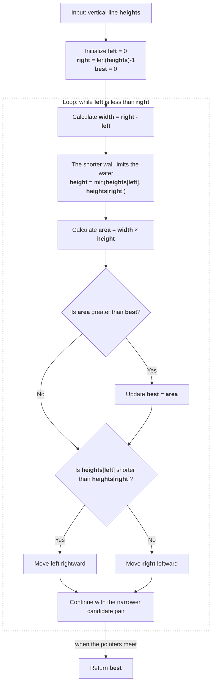

**Where it is used in real life:**

- Geometry tools maximize capacity between candidate boundaries.
- Signal analysis chooses two barriers maximizing distance times limiting height.

```go
// Exact question: Given vertical line heights, return the maximum water area formed by two lines and the x-axis.
//
// Example: Input heights = [1, 8, 6, 2, 5, 4, 8, 3, 7] -> output 49 from indexes 1 and 8.
//
// Possible answer: Start at both ends, calculate the current area, and move the shorter line because only a taller replacement can improve that limiting height.
//
// Output format: Return an `int` value from `maxArea`; the function does not print the answer.
//
// Inline descriptions:
// - `heights` is a slice of wall heights: each index is a horizontal position and its stored value is that wall's height.
// - Two indexes define a container whose width is their distance and whose usable height is the shorter wall.
//
// Boundary checks:
// - With fewer than two heights, `left < right` is false and the function safely returns zero.
// - `left < right` also guarantees two distinct wall indexes for every calculated area.
// - `area > best` replaces the answer only when the current pair holds more water.
// - Moving the shorter wall is the only move that can increase the limiting height enough to offset the reduced width.
//
// Key variables:
// - `heights` holds wall-height values; its indexes provide horizontal positions rather than keys.
// - `left` and `right` identify the current candidate pair of walls.
// - `width` is the distance between those two indexes.
// - `height` is the smaller of the two wall values and therefore the water-level limit.
// - `area` is the capacity of the current pair, and `best` is the largest capacity found so far.
//
// Logic:
// 1. Start with the widest possible pair: the first and last indexes.
// 2. Calculate its width, limiting height, and area, then update `best` when needed.
// 3. Discard the shorter wall by moving only its pointer inward.
// 4. Repeat until the pointers meet; every discarded pair is dominated by the shorter wall already examined.
// 5. Return the largest area encountered.
func maxArea(heights []int) int {
    left := 0
    right := len(heights) - 1
    best := 0

    for left < right {
        width := right - left
        height := min(heights[left], heights[right])
        area := width * height

        if area > best {
            best = area
        }

        // Keeping the shorter wall while reducing width cannot produce a larger area.
        if heights[left] < heights[right] {
            left++
        } else {
            right--
        }
    }

    return best
}

// time complexity: O(n) -> one pointer moves inward on every iteration, so there are at most n-1 iterations.
// space complexity: O(1) -> only two pointers and a fixed set of area variables are stored.
```

> **Baby analogy:** Imagine numbered toy boxes in one straight row. "Container With Most Water" is one small game played with the same pieces and rules.

### Two Sum II on a Sorted Array

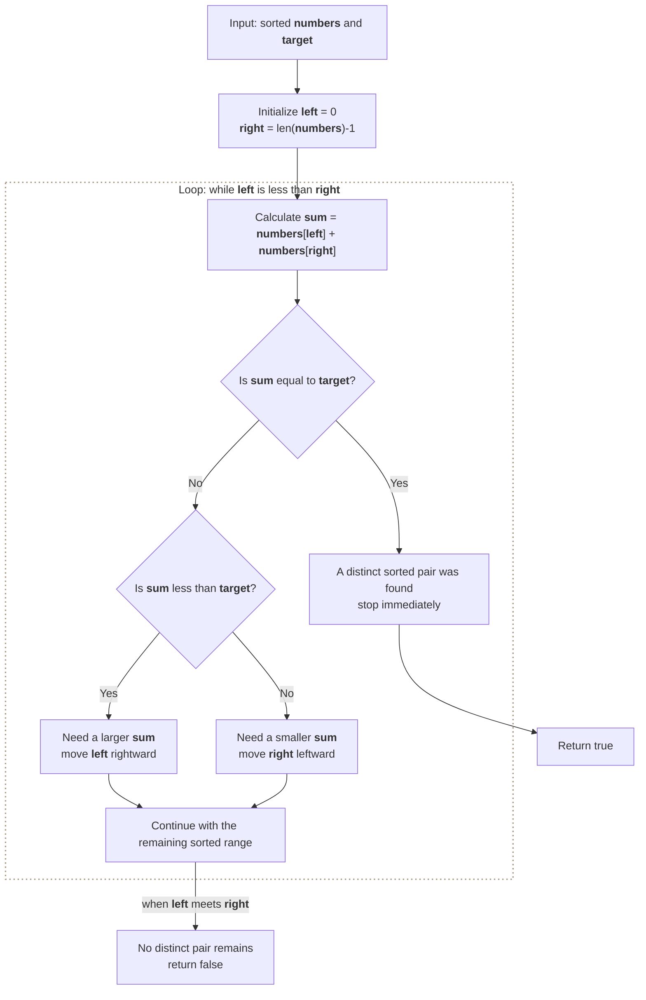

**Where it is used in real life:**

- Pricing systems find a target pair in an already ordered catalog.
- Sensor processing matches two sorted readings to a required total.

```go
// Exact question: Given a sorted integer slice and a target, return whether two distinct values add to the target.
//
// Example: Input numbers = [2, 7, 11, 15] and target = 9 -> output true because indexes 0 and 1 hold a valid pair.
//
// Possible answer: Compare the sum at left and right pointers; move left for a sum that is too small and right for a sum that is too large.
//
// Output format: Return a `bool` value from `hasPairWithSum`; the function does not print the answer.
//
// Inline descriptions:
// - `numbers` is a slice whose values are sorted in nondecreasing order; indexes identify positions in that order.
// - `target` is the required sum of two values stored at distinct indexes.
//
// Boundary checks:
// - Fewer than two values makes `left < right` false, so the function returns false without indexing the slice.
// - `left < right` guarantees the same element cannot be used twice.
// - The pointer-discarding logic is valid only because `numbers` is sorted.
// - Equality returns immediately; otherwise exactly one pointer moves, guaranteeing progress.
//
// Key variables:
// - `numbers` holds sorted values; indexes are positions rather than hash-map keys.
// - `target` is the value against which every candidate pair sum is compared.
// - `left` points to the smallest remaining candidate value.
// - `right` points to the largest remaining candidate value.
// - `sum` is the value of the current pair `numbers[left] + numbers[right]`.
//
// Logic:
// 1. Place pointers at the smallest and largest values.
// 2. Return true when their sum equals the target.
// 3. If the sum is too small, move `left` to the next larger value.
// 4. If the sum is too large, move `right` to the next smaller value.
// 5. Return false when the pointers meet without finding a pair.
func hasPairWithSum(numbers []int, target int) bool {
    left := 0
    right := len(numbers) - 1

    for left < right {
        sum := numbers[left] + numbers[right]

        if sum == target {
            return true
        }

        // Sorted order lets one comparison discard every pair using the pointer that moves.
        if sum < target {
            left++
        } else {
            right--
        }
    }

    return false
}

// time complexity: O(n) -> each pointer crosses the sorted slice at most once.
// space complexity: O(1) -> the search stores only two pointers and the current sum.
```

> **Baby analogy:** Imagine numbered toy boxes in one straight row. "Two Sum II on a Sorted Array" is one small game played with the same pieces and rules.

### Range Sum Query

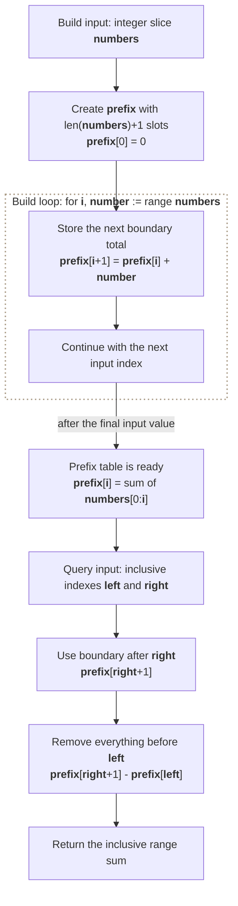

**Where it is used in real life:**

- Dashboards answer repeated totals over time intervals.
- Databases precompute cumulative counts for fast range reports.

```go
// Exact question: Build a prefix-sum table and use it to return the inclusive sum from index `left` through index `right`.
//
// Example: Input numbers = [-2, 0, 3, -5, 2, -1] builds prefix = [0, -2, -2, 1, -4, -2, -3]; querying left = 0 and right = 2 returns 1.
//
// Possible answer: Store cumulative sums at boundaries so subtracting `prefix[left]` from `prefix[right+1]` removes everything before the requested range.
//
// Output format: `buildPrefixSum` returns an `n+1` length `[]int`; `rangeSum` returns one inclusive range total as an `int`. Neither function prints.
//
// Inline descriptions:
// - `numbers` is the original value slice: its indexes identify elements included in later queries.
// - `prefix` is a boundary-sum slice: index `i` represents the boundary before `numbers[i]`, not that element's value.
// - `left` and `right` are inclusive indexes into the original `numbers` slice.
//
// Boundary checks:
// - An empty input builds `[0]`, which correctly represents a total of zero before any values.
// - `rangeSum` expects `0 <= left <= right < len(prefix)-1`; the caller must enforce this query contract.
// - The extra prefix slot makes `right+1` valid even when `right` is the final input index.
//
// Key variables:
// - `numbers` holds the original integer values; indexes are positions, not lookup keys.
// - `prefix[i]` stores the sum of the first `i` input values, so its indexes represent boundaries rather than input elements.
// - `i` is the current input index, `number` is `numbers[i]`, and `i+1` is the matching ending boundary.
// - `left` is the first included input index and `right` is the last included input index.
//
// Logic:
// 1. Allocate one extra leading prefix slot whose value is zero.
// 2. Build each next boundary by adding the current input value to the previous boundary total.
// 3. For a query, read the total through `right` from `prefix[right+1]`.
// 4. Subtract `prefix[left]`, which contains exactly the values before the requested range.
// 5. Reuse the same prefix table to answer later valid queries in constant time.
func buildPrefixSum(numbers []int) []int {
    prefix := make([]int, len(numbers)+1)

    for i, number := range numbers {
        // prefix[i] excludes numbers[i]; prefix[i+1] includes it.
        prefix[i+1] = prefix[i] + number
    }

    return prefix
}

func rangeSum(prefix []int, left, right int) int {
    // The subtraction cancels numbers[0:left] and keeps numbers[left:right+1].
    return prefix[right+1] - prefix[left]
}

// time complexity: O(n) -> building the prefix table visits all `n` values once; each later range query is O(1).
// space complexity: O(n) -> the returned prefix table stores n+1 boundary totals; each query needs O(1) extra space.
```

> **Baby analogy:** Imagine numbered toy boxes in one straight row. "Range Sum Query" is one small game played with the same pieces and rules.

---

## Interview checklist and next steps

Use this answer order during an interview:

1. Restate the input, output, and constraints.
2. Name the pattern and the invariant.
3. Explain the data structure roles before coding.
4. Handle boundary cases explicitly.
5. Walk through a small example.
6. Give time and space complexity with variable definitions.

Recommended practice order:

1. [Two Sum](#two-sum)
2. [Best Time to Buy and Sell Stock](#best-time-to-buy-and-sell-stock)
3. [Maximum Subarray](#maximum-subarray)
4. [Product of Array Except Self](#product-of-array-except-self)
5. [Move Zeroes](#move-zeroes)
6. [Rotate Array](#rotate-array)
7. [Merge Sorted Array](#merge-sorted-array)
8. [Container With Most Water](#container-with-most-water)
9. [Two Sum II on a Sorted Array](#two-sum-ii-on-a-sorted-array)
10. [Range Sum Query](#range-sum-query)

Continue with: 3Sum, Find Minimum in Rotated Sorted Array, Search in Rotated Sorted Array, Spiral Matrix, Set Matrix Zeroes.

```mermaid
flowchart LR
    Q0["Two Sum"]
    Q0 --> Q1["Best Time to Buy and Sell Stock"]
    Q1 --> Q2["Maximum Subarray"]
    Q2 --> Q3["Product of Array Except Self"]
    Q3 --> Q4["Move Zeroes"]
    Q4 --> Q5["Rotate Array"]
    Q5 --> Q6["Merge Sorted Array"]
    Q6 --> Q7["Container With Most Water"]
    Q7 --> Q8["Two Sum II on a Sorted Array"]
    Q8 --> Q9["Range Sum Query"]
```

> **Baby analogy:** Imagine numbered toy boxes in one straight row. Pack the same checklist every time so no important interview step is forgotten.
