# Complexity Analysis — A Compact Interview Guide

Complexity describes how resource usage grows as input grows. It is a model for comparison, not a stopwatch measurement.

- [Mental model](#mental-model)
- [Representation and core operations](#representation-and-core-operations)
- [Interview patterns and complexity](#interview-patterns-and-complexity)
- [Problem-solving checklist and common mistakes](#problem-solving-checklist-and-common-mistakes)
- [Top 10 Complexity Interview Exercises](#top-10-complexity-interview-exercises)
- [Interview checklist and next steps](#interview-checklist-and-next-steps)

> **Baby analogy:** Imagine counting footsteps needed to clean larger and larger playrooms. The guide shows where every piece belongs before you start moving the pieces.

---

## Mental model

Choose variables for the input dimensions, count dominant repeated work, and state auxiliary space separately from returned output.

| Real system | How the topic appears |
| --- | --- |
| API capacity planning | Estimate work as request size grows |
| Database queries | Compare scans, indexes, joins, and sorts |
| Batch jobs | Predict whether a workload fits a deadline |
| Memory budgeting | Estimate retained state and temporary buffers |

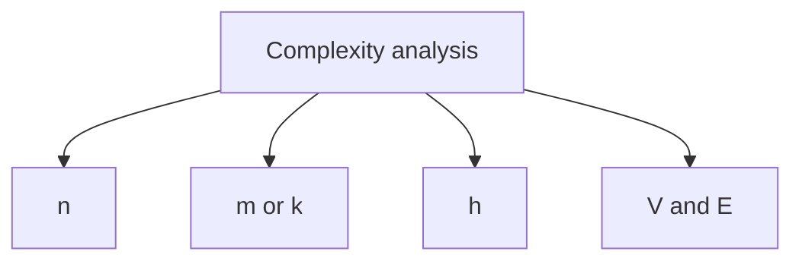

> **Baby analogy:** Imagine counting footsteps needed to clean larger and larger playrooms. Big O asks how the number of footsteps grows when the room doubles, not how fast one child walks.

---

## Representation and core operations

The variable must describe the real input. A matrix may need rows and columns; a graph normally needs both vertices and edges.

| Representation | Role |
| --- | --- |
| n | Primary input size |
| m or k | Independent second dimension |
| h | Tree height or recursion depth |
| V and E | Graph vertices and edges |

| Operation | Typical cost | Meaning |
| --- | --- | --- |
| Constant statement | O(1) | Fixed work |
| Single full pass | O(n) | One visit per item |
| Halving loop | O(log n) | Remaining search space repeatedly halves |
| Nested independent passes | O(n²) | All pairs may be examined |
| Sort | O(n log n) | Divide-and-combine comparison work |

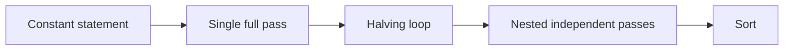

> **Baby analogy:** Imagine counting footsteps needed to clean larger and larger playrooms. One toy per step is linear; repeatedly splitting the pile in half is logarithmic; comparing every pair is quadratic.

---

## Interview patterns and complexity

| Question clue | Pattern | Practice exercises in this guide |
| --- | --- | --- |
| One pass | Add repeated constant work | [Linear Search](#analyze-linear-search), [Duplicate Detection](#analyze-duplicate-detection) |
| Repeated halving or doubling | Count logarithmic steps | [Binary Search](#analyze-binary-search), [Doubling Loop](#analyze-a-doubling-loop) |
| Nested loops | Multiply dependent iteration counts | [All Pairs](#analyze-all-pairs) |
| Consecutive loops | Add then keep dominant term | [Consecutive and Nested Work](#analyze-consecutive-and-nested-work) |
| Recursive calls | Count states, branches, and stack depth | [Recursive Sum](#analyze-recursive-sum), [Naive Fibonacci](#analyze-naive-fibonacci) |
| Expected constant-time lookup | State average-case assumptions | [Hash Set Lookup](#analyze-hash-set-lookup) |
| Occasional expensive resize | Use amortized cost | [Amortized Append](#analyze-amortized-append) |

| Work | Complexity | Reason |
| --- | --- | --- |
| Hash lookup | Average O(1) | Expected bounded bucket work |
| Binary search | O(log n) | Search interval halves |
| Merge sort | O(n log n) | Log levels with n work per level |
| Backtracking | Often exponential | Number of choices multiplies by depth |

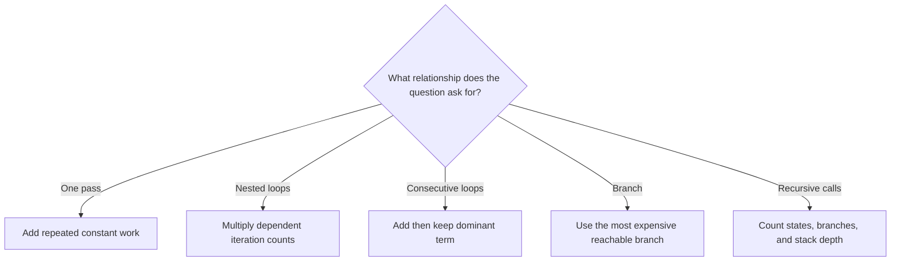

> **Baby analogy:** Imagine counting footsteps needed to clean larger and larger playrooms. Draw the loops as repeated chores and count which chore grows fastest.

---

## Problem-solving checklist and common mistakes

Before coding:

1. State exactly what the indexes, keys, pointers, states, or worklist elements represent.
2. Write the empty-input and smallest-input boundary behavior.
3. Choose the invariant that remains true after every step.
4. Trace one normal example and one edge case.
5. State whether output storage is included in space complexity.

Common mistakes:

- Calling every nested loop O(n²) without checking bounds.
- Multiplying consecutive loops instead of adding them.
- Dropping an independent variable such as m or E.
- Ignoring recursion stack space.
- Treating average hash-map behavior as a worst-case guarantee.
- Ignoring the complexity of library calls.

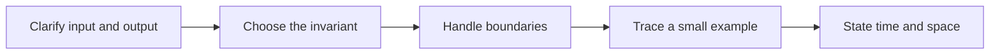

> **Baby analogy:** Imagine counting footsteps needed to clean larger and larger playrooms. Do not guess from the shape of the code; count how many times each line can actually run.

---

## Top 10 Complexity Interview Exercises

These are the single authoritative implementations in this guide. Each solution keeps the required question, answer, output, boundary, variable-role, logic, and complexity comments.

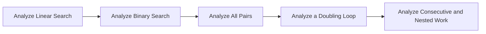

> **Baby analogy:** Imagine counting footsteps needed to clean larger and larger playrooms. These ten puzzles are practice cards; each card teaches one reusable move.

### Analyze Linear Search

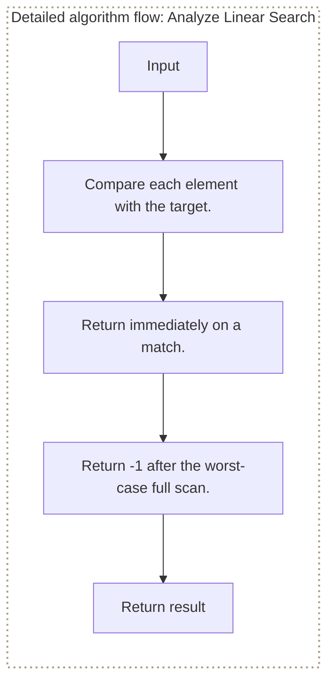

**Where it is used in real life:**

- Catalog scans estimate worst-case lookup work without an index.
- Log processors estimate work when searching an unsorted batch.

```go
// Exact question: Which simple Go search demonstrates worst-case O(n) growth?
//
// Example: Input values = [4, 8, 15] and target = 15 -> output index 2 after three comparisons in the worst position.
//
// Possible answer: Scan an unsorted slice until the target is found or every element is exhausted.
//
// Output format: Return the target index or -1 when absent.
//
// Inline descriptions:
// - `values` is a slice whose indexes are positions and whose elements are searchable integer values.
//
// Boundary checks:
// - Empty input naturally returns -1 without indexing the slice.
//
// Key variables:
// - `index` is the current position and `value` is the element stored there.
//
// Logic:
// 1. Compare each element with the target.
// 2. Return immediately on a match.
// 3. Return -1 after the worst-case full scan.
func complexityLinearSearch(values []int, target int) int {
	for index, value := range values {
		if value == target {
			return index
		}
	}
	return -1
}

// time complexity: O(n) -> an absent target requires checking all `n` elements.
// space complexity: O(1) -> the search uses fixed-size loop state.
```

> **Baby analogy:** Imagine counting footsteps needed to clean larger and larger playrooms. "Analyze Linear Search" is one small game played with the same pieces and rules.

### Analyze Binary Search

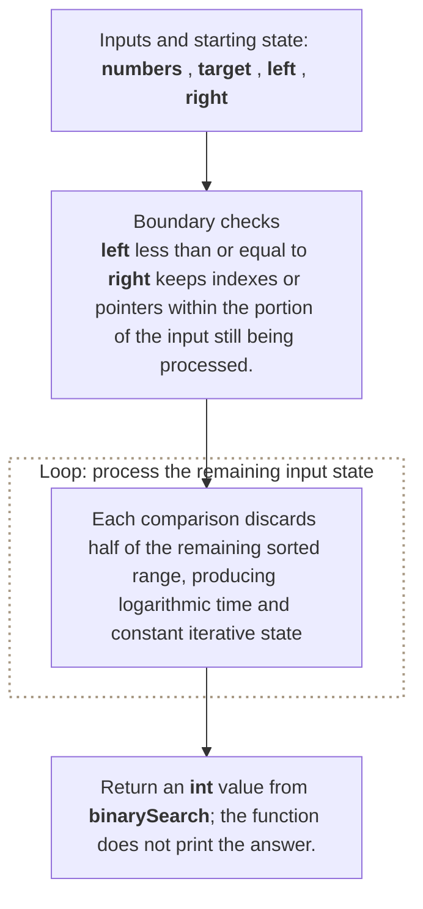

**Where it is used in real life:**

- Databases estimate ordered-index lookup depth.
- Configuration systems search sorted version lists.

```go
// Exact question: What are the time and space complexities of `binarySearch`?
//
// Example: Input sorted numbers = [1, 3, 5, 7] and target = 5 -> output index 2 after repeatedly halving the search range.
//
// Possible answer: Each comparison discards half of the remaining sorted range, producing logarithmic time and constant iterative state.
//
// Output format: Return an `int` value from `binarySearch`; the function does not print the answer.
//
// Inline descriptions:
// - `numbers` is a slice: the index identifies an element or state, and the stored item has type int.
// - `target` is the int input used by this example.
//
// Boundary checks:
// - `left <= right` keeps indexes or pointers within the portion of the input still being processed.
// - `numbers[middle] == target` decides whether the branch or loop should continue for the current input.
// - `numbers[middle] < target` decides whether the branch or loop should continue for the current input.
//
// Key variables:
// - `numbers` is a slice: the index identifies an element or state, and the stored item has type int.
// - `target` is the int input used by this example.
// - `left` marks the current left boundary or left-side value.
// - `right` marks the current right boundary or right-side value.
// - `middle` holds the intermediate value produced by `left + (right-left)/2`.
//
// Logic:
// 1. Create or use a slice so indexes identify positions and elements store their data or state.
// 2. Iterate through the required elements or states in the order shown.
// 3. Return the value produced after the state updates are complete.
func binarySearch(numbers []int, target int) int {
    left := 0
    right := len(numbers) - 1

    for left <= right {
        middle := left + (right-left)/2

        if numbers[middle] == target {
            return middle
        }

        if numbers[middle] < target {
            left = middle + 1
        } else {
            right = middle - 1
        }
    }

    return -1
}

// time complexity: O(log n) -> each step reduces the remaining search or problem size by a constant factor.
// space complexity: O(1) -> only a fixed number of scalar variables or references is kept.
```

> **Baby analogy:** Imagine counting footsteps needed to clean larger and larger playrooms. "Analyze Binary Search" is one small game played with the same pieces and rules.

### Analyze All Pairs

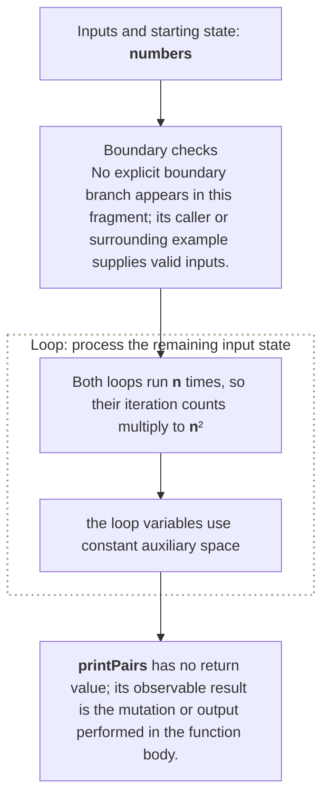

**Where it is used in real life:**

- Fraud systems compare every pair of transactions in a small batch.
- Geometry tools test every pair of points when no spatial index exists.

```go
// Exact question: What are the time and space complexities of `printPairs`?
//
// Example: Input numbers = [1, 2, 3] -> printPairs emits 3 x 3 = 9 ordered pairs.
//
// Possible answer: Both loops run `n` times, so their iteration counts multiply to `n²`; the loop variables use constant auxiliary space.
//
// Output format: `printPairs` has no return value; its observable result is the mutation or output performed in the function body.
//
// Inline descriptions:
// - `numbers` is a slice: the index identifies an element or state, and the stored item has type int.
//
// Boundary checks:
// - No explicit boundary branch appears in this fragment; its caller or surrounding example supplies valid inputs.
//
// Key variables:
// - `numbers` is a slice: the index identifies an element or state, and the stored item has type int.
//
// Logic:
// 1. Create or use a slice so indexes identify positions and elements store their data or state.
// 2. Iterate through the required elements or states in the order shown.
package main

import "fmt"

func printPairs(numbers []int) {
    for _, first := range numbers {
        for _, second := range numbers {
            fmt.Println(first, second)
        }
    }
}

// time complexity: O(n^2) -> nested traversal can compare or process every pair of input elements.
// space complexity: O(1) -> only a fixed number of scalar variables or references is kept.
```

> **Baby analogy:** Imagine counting footsteps needed to clean larger and larger playrooms. "Analyze All Pairs" is one small game played with the same pieces and rules.

### Analyze a Doubling Loop

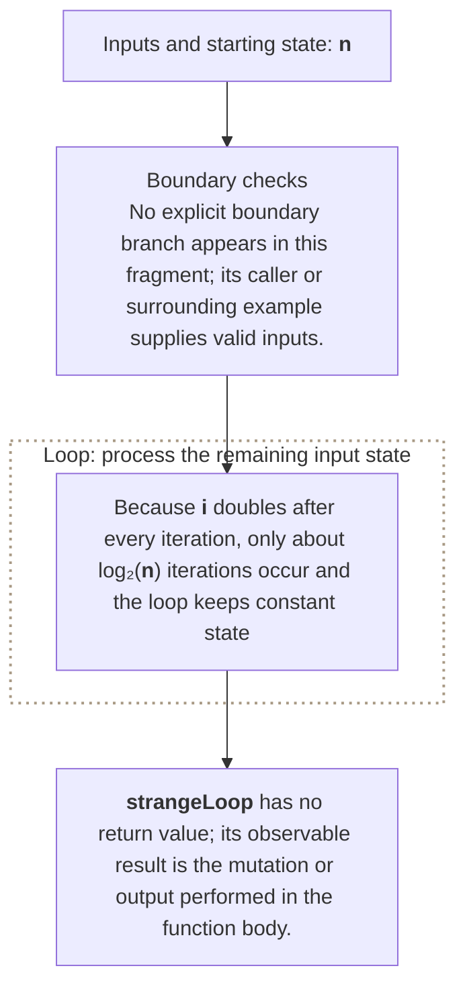

**Where it is used in real life:**

- Capacity planners model resources that double at each growth step.
- Search algorithms count how many halvings are needed to reach a base case.

```go
// Exact question: What are the time and space complexities of `strangeLoop`?
//
// Example: Input n = 16 -> print 1, 2, 4, 8, so only four loop iterations occur.
//
// Possible answer: Because `i` doubles after every iteration, only about `log₂(n)` iterations occur and the loop keeps constant state.
//
// Output format: `strangeLoop` has no return value; its observable result is the mutation or output performed in the function body.
//
// Inline descriptions:
// - `n` is the int input used by this example.
//
// Boundary checks:
// - No explicit boundary branch appears in this fragment; its caller or surrounding example supplies valid inputs.
//
// Key variables:
// - `n` is the int input used by this example.
//
// Logic:
// 1. Iterate through the required elements or states in the order shown.
package main

import "fmt"

func strangeLoop(n int) {
    for i := 1; i < n; i *= 2 {
        fmt.Println(i)
    }
}

// time complexity: O(log n) -> each step reduces the remaining search or problem size by a constant factor.
// space complexity: O(1) -> only a fixed number of scalar variables or references is kept.
```

> **Baby analogy:** Imagine doubling a row of toy blocks from one to two to four. "Analyze a Doubling Loop" counts how many doublings fit before the limit.

### Analyze Consecutive and Nested Work

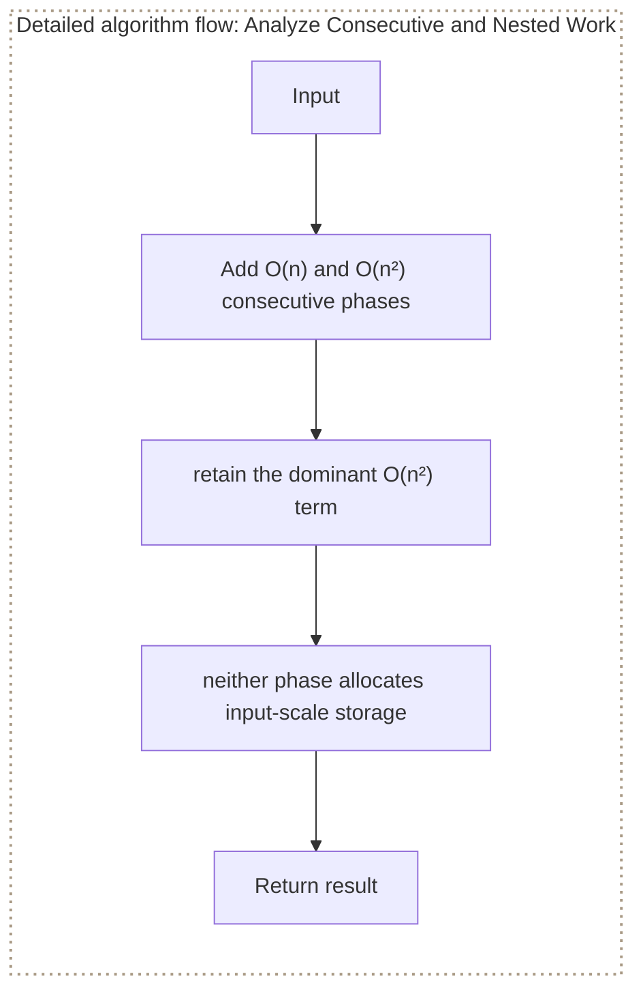

**Where it is used in real life:**

- Batch pipelines combine a linear preprocessing pass with a pairwise phase.
- Code reviews identify which phase dominates runtime.

```go
// Exact question: What are the time and space complexities of `mixed`?
//
// Example: Input numbers = [1, 2, 3] -> the linear phase performs 3 iterations and the nested phase performs 9, so the quadratic phase dominates.
//
// Possible answer: Add O(n) and O(n²) consecutive phases, then retain the dominant O(n²) term; neither phase allocates input-scale storage.
//
// Output format: `mixed` has no return value; its observable result is the mutation or output performed in the function body.
//
// Inline descriptions:
// - `numbers` is a slice: the index identifies an element or state, and the stored item has type int.
//
// Boundary checks:
// - No explicit boundary branch appears in this fragment; its caller or surrounding example supplies valid inputs.
//
// Key variables:
// - `numbers` is a slice: the index identifies an element or state, and the stored item has type int.
//
// Logic:
// 1. Create or use a slice so indexes identify positions and elements store their data or state.
// 2. Iterate through the required elements or states in the order shown.
package main

import "fmt"

func mixed(numbers []int) {
    for _, number := range numbers {
        fmt.Println(number)
    }

    for _, first := range numbers {
        for _, second := range numbers {
            fmt.Println(first, second)
        }
    }
}

// time complexity: O(n^2) -> nested traversal can compare or process every pair of input elements.
// space complexity: O(1) -> only a fixed number of scalar variables or references is kept.
```

> **Baby analogy:** Imagine counting footsteps needed to clean larger and larger playrooms. "Analyze Consecutive and Nested Work" is one small game played with the same pieces and rules.

### Analyze Recursive Sum

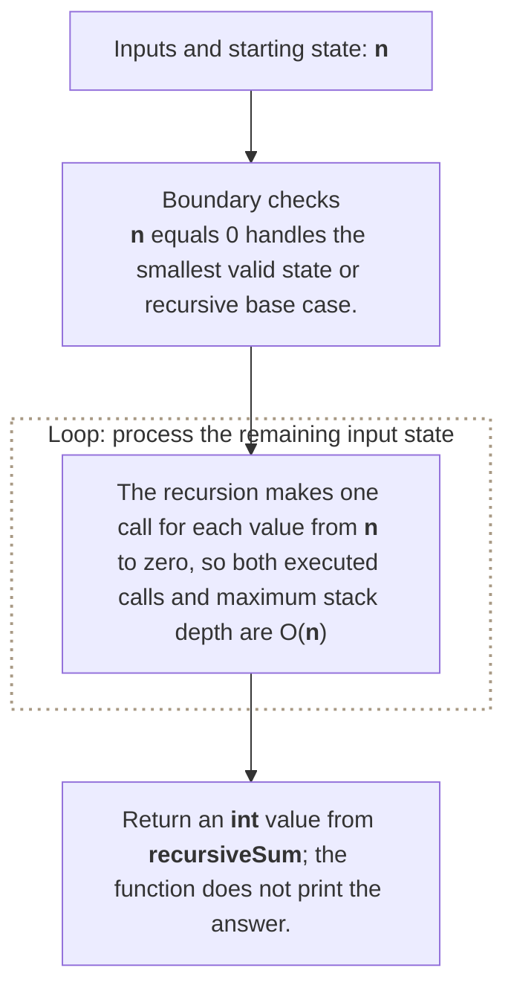

**Where it is used in real life:**

- Recursive workflows reveal stack usage even when total work is linear.
- Education tools demonstrate one recursive state per decreasing input.

```go
// Exact question: What are the time and space complexities of `recursiveSum`?
//
// Example: Input n = 4 -> output 10 from 4 + 3 + 2 + 1, with five call frames including the n = 0 base case.
//
// Possible answer: The recursion makes one call for each value from `n` to zero, so both executed calls and maximum stack depth are O(n).
//
// Output format: Return an `int` value from `recursiveSum`; the function does not print the answer.
//
// Inline descriptions:
// - `n` is the int input used by this example.
//
// Boundary checks:
// - `n == 0` handles the smallest valid state or recursive base case.
//
// Key variables:
// - `n` is the int input used by this example.
//
// Logic:
// 1. Recursively reduce the current problem to smaller calls until a base condition is reached.
// 2. Return the value produced after the state updates are complete.
func recursiveSum(n int) int {
    if n == 0 {
        return 0
    }

    return n + recursiveSum(n-1)
}

// time complexity: O(n) -> the algorithm visits each of the `n` input elements or states once.
// space complexity: O(n) -> the recursion stack and any cache can grow to one entry per input state.
```

> **Baby analogy:** Imagine counting footsteps needed to clean larger and larger playrooms. "Analyze Recursive Sum" is one small game played with the same pieces and rules.

### Analyze Naive Fibonacci

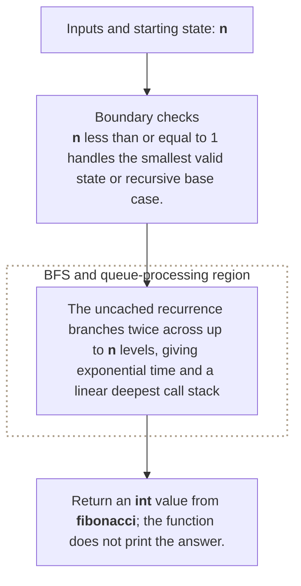

**Where it is used in real life:**

- Performance reviews identify duplicated recursive work.
- Memoization design starts by exposing repeated Fibonacci states.

```go
// Exact question: What are the time and space complexities of `fibonacci`?
//
// Example: Input n = 5 -> output 5, while repeated states such as fibonacci(3) are recalculated on different branches.
//
// Possible answer: The uncached recurrence branches twice across up to `n` levels, giving exponential time and a linear deepest call stack.
//
// Output format: Return an `int` value from `fibonacci`; the function does not print the answer.
//
// Inline descriptions:
// - `n` is the int input used by this example.
//
// Boundary checks:
// - `n <= 1` handles the smallest valid state or recursive base case.
//
// Key variables:
// - `n` is the int input used by this example.
//
// Logic:
// 1. Recursively reduce the current problem to smaller calls until a base condition is reached.
// 2. Return the value produced after the state updates are complete.
func fibonacci(n int) int {
    if n <= 1 {
        return n
    }

    return fibonacci(n-1) + fibonacci(n-2)
}

// time complexity: O(2^n) -> the recursion can branch into two choices at each of `n` levels.
// space complexity: O(n) -> the deepest recursive branch keeps at most `n` call frames on the stack.
```

> **Baby analogy:** Imagine counting footsteps needed to clean larger and larger playrooms. "Analyze Naive Fibonacci" is one small game played with the same pieces and rules.

### Analyze Hash Set Lookup

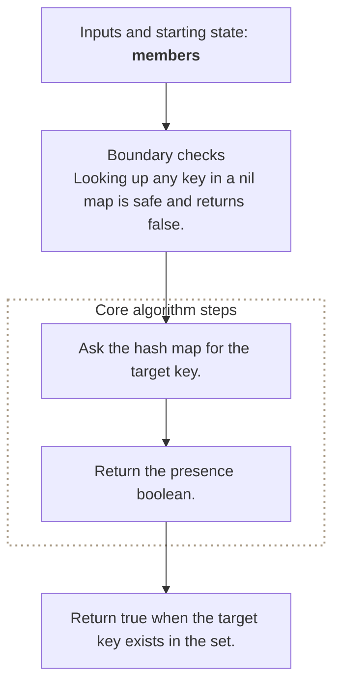

**Where it is used in real life:**

- Cache designs compare expected constant lookup with scan alternatives.
- Access-control checks model membership-test cost.

```go
// Exact question: Which Go data structure provides average O(1) membership lookup?
//
// Example: Input members = {2, 4, 6} and target = 4 -> output true from one average-case hash lookup.
//
// Possible answer: Store searchable values as hash-map keys with empty marker values.
//
// Output format: Return true when the target key exists in the set.
//
// Inline descriptions:
// - `members` is a map whose keys are stored integers and whose empty values carry no additional state.
//
// Boundary checks:
// - Looking up any key in a nil map is safe and returns false.
//
// Key variables:
// - The two-value lookup separates a missing key from a present key with an empty marker.
//
// Logic:
// 1. Ask the hash map for the target key.
// 2. Return the presence boolean.
func setContains(members map[int]struct{}, target int) bool {
	_, exists := members[target]
	return exists
}

// time complexity: O(1) -> hash lookup is constant time on average, though worst case can be O(n).
// space complexity: O(1) -> the lookup allocates no state beyond the existing set.
```

> **Baby analogy:** Imagine counting footsteps needed to clean larger and larger playrooms. "Analyze Hash Set Lookup" is one small game played with the same pieces and rules.

### Analyze Duplicate Detection

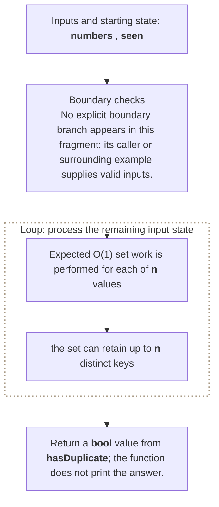

**Where it is used in real life:**

- Ingestion pipelines trade linear extra memory for fast duplicate checks.
- Data-quality systems compare hashing with sorting approaches.

```go
// Exact question: What are the time and space complexities of detecting duplicates by inserting visited integers into a hash set?
//
// Example: Input numbers = [1, 2, 3, 1] -> output true when the final 1 is already present in seen.
//
// Possible answer: Expected O(1) set work is performed for each of `n` values, while the set can retain up to `n` distinct keys.
//
// Output format: Return a `bool` value from `hasDuplicate`; the function does not print the answer.
//
// Inline descriptions:
// - `numbers` is a slice: the index identifies an element or state, and the stored item has type int.
//
// Boundary checks:
// - No explicit boundary branch appears in this fragment; its caller or surrounding example supplies valid inputs.
//
// Key variables:
// - `numbers` is a slice: the index identifies an element or state, and the stored item has type int.
// - `seen` is a set whose integer keys are visited values and whose empty `struct{}` values carry no additional data.
//
// Logic:
// 1. Create or use a map to associate each lookup key with its stored value.
// 2. Create or use a slice so indexes identify positions and elements store their data or state.
// 3. Iterate through the required elements or states in the order shown.
func hasDuplicate(numbers []int) bool {
    seen := make(map[int]struct{})

    for _, number := range numbers {
        if _, exists := seen[number]; exists {
            return true
        }

        seen[number] = struct{}{}
    }

    return false
}

// time complexity: O(n) -> the algorithm visits each of the `n` input elements or states once.
// space complexity: O(n) -> the auxiliary slice, map, table, queue, or returned collection can grow with `n`.
```

> **Baby analogy:** Imagine counting footsteps needed to clean larger and larger playrooms. "Analyze Duplicate Detection" is one small game played with the same pieces and rules.

### Analyze Amortized Append

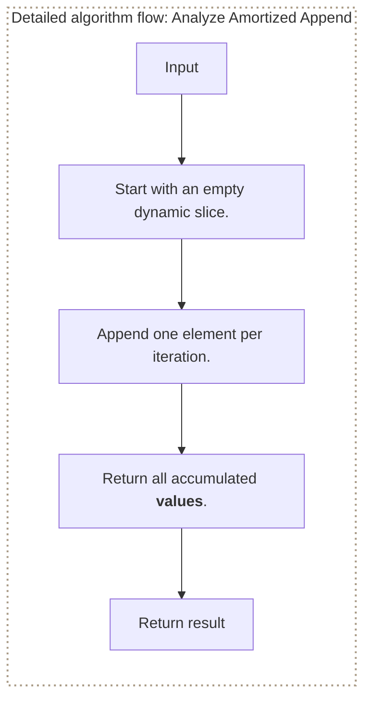

**Where it is used in real life:**

- Dynamic-array libraries spread occasional resize cost across many appends.
- Buffer planners explain why most appends remain cheap.

```go
// Exact question: How does repeated append demonstrate amortized O(1) work?
//
// Example: Input n = 5 -> output [0, 1, 2, 3, 4]; occasional slice growth is spread across all five appends.
//
// Possible answer: Append each value once while allowing occasional backing-array growth to be spread across all appends.
//
// Output format: Return a slice containing integers from zero through `n-1`.
//
// Inline descriptions:
// - `values` is a slice whose indexes are insertion positions and whose elements are appended integers.
//
// Boundary checks:
// - Non-positive `n` returns an empty slice.
//
// Key variables:
// - `value` is appended at the next index; slice capacity tracks available backing-array positions.
//
// Logic:
// 1. Start with an empty dynamic slice.
// 2. Append one element per iteration.
// 3. Return all accumulated values.
func appendSequence(n int) []int {
	values := []int{}
	for value := 0; value < n; value++ {
		values = append(values, value)
	}
	return values
}

// time complexity: O(n) -> `n` appends take O(1) amortized time each.
// space complexity: O(n) -> the returned backing array stores `n` elements.
```

> **Baby analogy:** Imagine counting footsteps needed to clean larger and larger playrooms. "Analyze Amortized Append" is one small game played with the same pieces and rules.

---

## Interview checklist and next steps

Use this answer order during an interview:

1. Restate the input, output, and constraints.
2. Name the pattern and the invariant.
3. Explain the data structure roles before coding.
4. Handle boundary cases explicitly.
5. Walk through a small example.
6. Give time and space complexity with variable definitions.

Recommended practice order:

1. [Analyze Linear Search](#analyze-linear-search)
2. [Analyze Binary Search](#analyze-binary-search)
3. [Analyze All Pairs](#analyze-all-pairs)
4. [Analyze a Doubling Loop](#analyze-a-doubling-loop)
5. [Analyze Consecutive and Nested Work](#analyze-consecutive-and-nested-work)
6. [Analyze Recursive Sum](#analyze-recursive-sum)
7. [Analyze Naive Fibonacci](#analyze-naive-fibonacci)
8. [Analyze Hash Set Lookup](#analyze-hash-set-lookup)
9. [Analyze Duplicate Detection](#analyze-duplicate-detection)
10. [Analyze Amortized Append](#analyze-amortized-append)

Continue with: Master theorem, Amortized analysis with potential functions, Cache complexity, Probabilistic hash analysis, Constraint-to-complexity estimation.

```mermaid
flowchart LR
    Q0["Analyze Linear Search"]
    Q0 --> Q1["Analyze Binary Search"]
    Q1 --> Q2["Analyze All Pairs"]
    Q2 --> Q3["Analyze a Doubling Loop"]
    Q3 --> Q4["Analyze Consecutive and Nested Work"]
    Q4 --> Q5["Analyze Recursive Sum"]
    Q5 --> Q6["Analyze Naive Fibonacci"]
    Q6 --> Q7["Analyze Hash Set Lookup"]
    Q7 --> Q8["Analyze Duplicate Detection"]
    Q8 --> Q9["Analyze Amortized Append"]
```

> **Baby analogy:** Imagine counting footsteps needed to clean larger and larger playrooms. Pack the same checklist every time so no important interview step is forgotten.
