# Data Structures and Algorithms for Interviews — A Compact Roadmap

This file is the hub for the topic guides in this directory. It explains what to study, how to recognize patterns, and where the authoritative implementations live.

- [Mental model](#mental-model)
- [Core data structures and algorithms](#core-data-structures-and-algorithms)
- [Pattern recognition and complexity](#pattern-recognition-and-complexity)
- [Interview workflow and common mistakes](#interview-workflow-and-common-mistakes)
- [Top 10 mixed interview questions](#top-10-mixed-interview-questions)
- [Six-week preparation plan](#six-week-preparation-plan)
- [Senior engineer and engineering manager focus](#senior-engineer-and-engineering-manager-focus)
- [Final checklist](#final-checklist)

> **Baby analogy:** Think of this directory as a school timetable: each subject has its own classroom, and this roadmap tells you which classroom to visit next.

---

## Mental model

Interview preparation is pattern training, not memorizing hundreds of unrelated answers. For each problem, identify the data relationship, choose an invariant, trace boundaries, then communicate complexity.

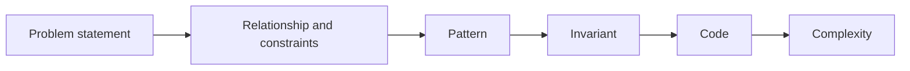

> **Baby analogy:** A puzzle box becomes easier when you first decide whether it needs a key, a map, a line, or a stack of pieces.

---

## Core data structures and algorithms

| Topic | Use it when | Guide |
| --- | --- | --- |
| Arrays and slices | Position, contiguous ranges, two pointers, windows | [Array guide](array.md) |
| Hash maps and sets | Membership, counts, key-to-value lookup | [Hash map guide](hash-map.md) |
| Linked lists | Pointer rewiring and sequential nodes | [Linked-list guide](linked-list.md) |
| Stacks | Nested work, reversal, nearest unresolved item | [Stack guide](stack.md) |
| Queues and deques | FIFO, levels, nearest distance, rolling windows | [Queue guide](queue.md) |
| Trees | Hierarchy and recursive child answers | [Tree guide](trees.md) |
| Graphs | General relationships, paths, components, dependencies | [Graph guide](graph.md) |
| Heaps | Repeated minimum, maximum, top-k, streaming rank | [Heap guide](heap-priority-queues.md) |
| Tries | Prefix navigation and dictionary pruning | [Trie guide](trie.md) |
| Strings | Text windows, counts, Unicode, construction | [String guide](strings.md) |
| Dynamic programming | Repeated states and optimal substructure | [DP guide](dynamic-programming.md) |
| Complexity | Growth, feasibility, and tradeoffs | [Complexity guide](complexity-analysis.md) |

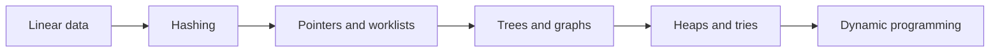

> **Baby analogy:** Each data structure is a different toy container: choose the container that makes the next toy easy to find or move.

---

## Pattern recognition and complexity

| Question clue | Likely pattern | Typical complexity | Practice links |
| --- | --- | --- | --- |
| Pair in sorted data | Two pointers | O(n) | [Two Sum II](array.md#two-sum-ii-on-a-sorted-array), [Container With Most Water](array.md#container-with-most-water) |
| Contiguous range | Sliding window or prefix sum | O(n) | [Range Sum Query](array.md#range-sum-query), [Minimum Window Substring](strings.md#minimum-window-substring) |
| Existence, count, or grouping | Hash map or set | O(n) expected | [Two Sum](hash-map.md#two-sum), [Group Anagrams](hash-map.md#group-anagrams) |
| Nested or recent unresolved work | Stack | O(n) | [Valid Parentheses](stack.md#valid-parentheses), [Daily Temperatures](stack.md#daily-temperatures) |
| Level or nearest unweighted state | BFS queue | O(V+E) | [Shortest Distances](graph.md#shortest-distances-in-an-unweighted-graph), [Rotting Oranges](queue.md#rotting-oranges) |
| Hierarchy or child result | DFS recursion | O(n) | [Maximum Depth](trees.md#maximum-depth-of-binary-tree), [Count Connected Components](graph.md#count-connected-components) |
| Repeated next minimum or maximum | Heap | O(n log k) or O(n log n) | [Kth Largest Element](heap-priority-queues.md#kth-largest-element-in-an-array), [Merge K Sorted Lists](heap-priority-queues.md#merge-k-sorted-lists) |
| Prefix query | Trie | O(query length) | [Implement Trie](trie.md#implement-trie), [Search Suggestions](trie.md#search-suggestions) |
| Repeated subproblem | Dynamic programming | states × transitions | [Climbing Stairs](dynamic-programming.md#climbing-stairs), [Coin Change](dynamic-programming.md#coin-change) |

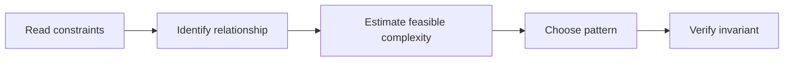

> **Baby analogy:** The words in the question are road signs; they point toward the right tool before you write any code.

---

## Interview workflow and common mistakes

Use this workflow:

1. Restate the input, output, and constraints.
2. Give a brute-force baseline.
3. Name the reusable pattern and invariant.
4. Describe every map, slice, stack, queue, pointer, or DP state.
5. Handle empty, one-element, duplicate, overflow, and skewed cases.
6. Trace one example before finishing the implementation.
7. State time and space complexity with variable definitions.

Common mistakes:

- Coding before clarifying whether input is sorted, mutable, connected, or unique.
- Naming a pattern without stating its invariant.
- Ignoring output space or recursion depth.
- Claiming average hash behavior as a worst-case guarantee.
- Memorizing code but being unable to explain why a pointer or state moves.
- Practicing only successful examples and skipping boundary cases.

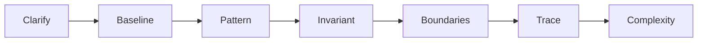

> **Baby analogy:** Before building a tower, count the blocks, choose the base, and decide what keeps every new layer from falling.

---

## Top 10 mixed interview questions

The code is not duplicated here. Each problem links to its single authoritative implementation in the corresponding topic guide.

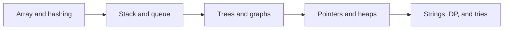

> **Baby analogy:** These ten cards sample every important toy box without copying the same toy into this roadmap.

### Two Sum

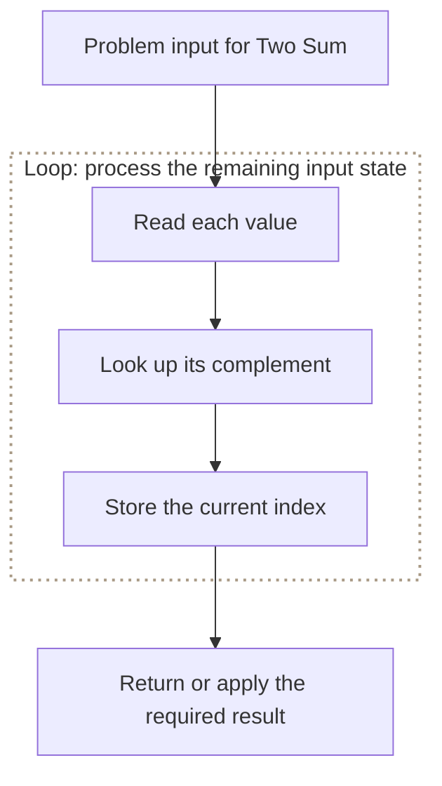

**Pattern:** Array plus hash map

**Where it is used in real life:**

- Payment reconciliation pairs two charges to a target.
- Catalog systems pair two prices that fit a budget.

[Open the full commented Go solution](array.md#two-sum)

> **Baby analogy:** Keep a notebook of toy prices already seen so the matching price is found immediately.

### Valid Parentheses

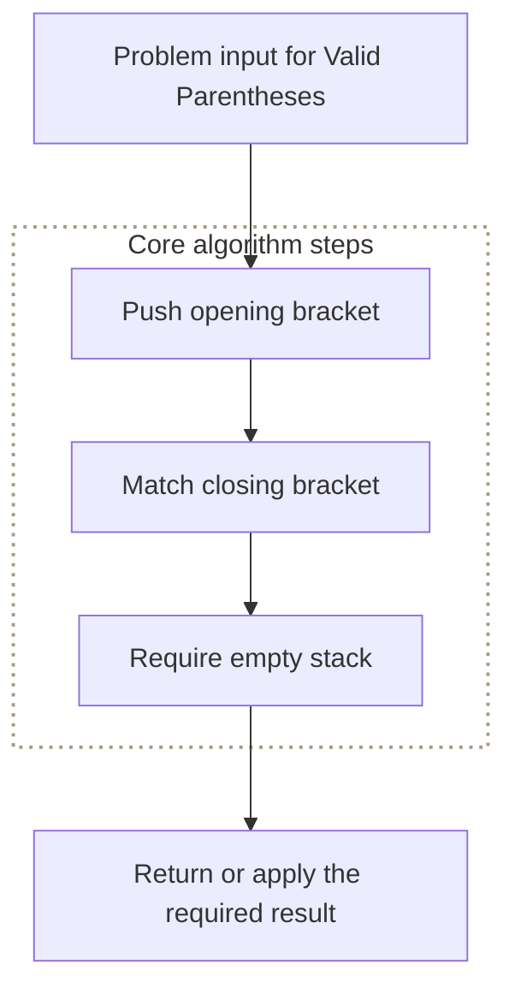

**Pattern:** Matching stack

**Where it is used in real life:**

- Compilers validate nested syntax.
- Configuration parsers reject malformed grouping.

[Open the full commented Go solution](stack.md#valid-parentheses)

> **Baby analogy:** Stack open boxes and close the newest box first.

### Binary Tree Level Order Traversal

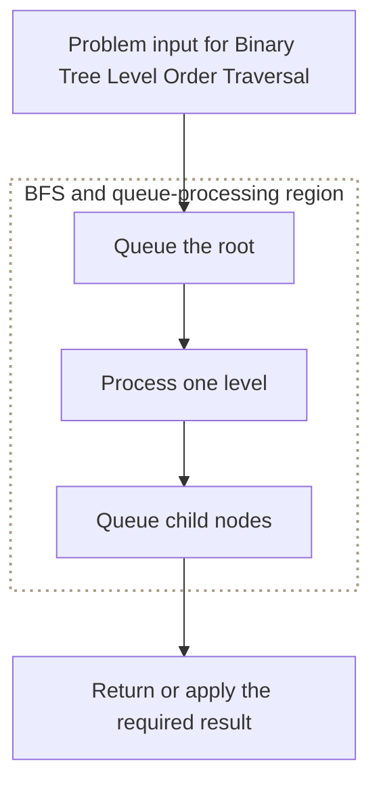

**Pattern:** BFS queue

**Where it is used in real life:**

- Organization charts render employees by level.
- Hierarchy tools group nodes by depth.

[Open the full commented Go solution](trees.md#binary-tree-level-order-traversal)

> **Baby analogy:** Call children row by row for a class photo.

### Number of Islands

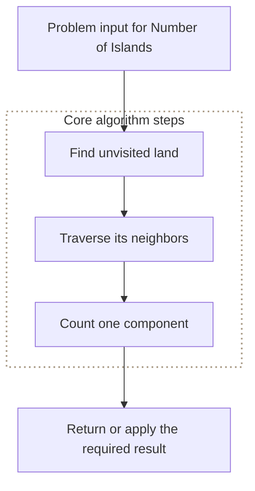

**Pattern:** Grid DFS or BFS

**Where it is used in real life:**

- Image processing groups connected regions.
- Monitoring groups neighboring failed cells.

[Open the full commented Go solution](graph.md#number-of-islands)

> **Baby analogy:** Color every touching square of one island before looking for another island.

### Reverse Linked List

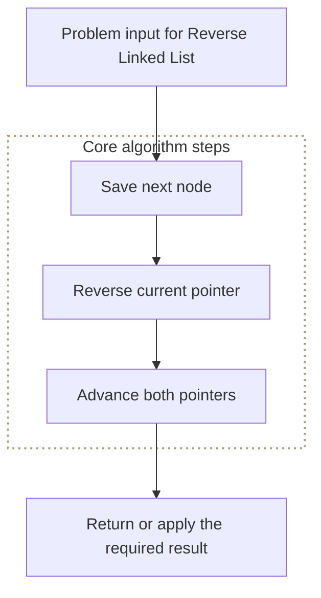

**Pattern:** Pointer rewiring

**Where it is used in real life:**

- Editors reverse history chains for replay.
- Pipelines reverse linked batches without copying values.

[Open the full commented Go solution](linked-list.md#reverse-linked-list)

> **Baby analogy:** Hold the next train car before reversing the current hook.

### Top K Frequent Elements

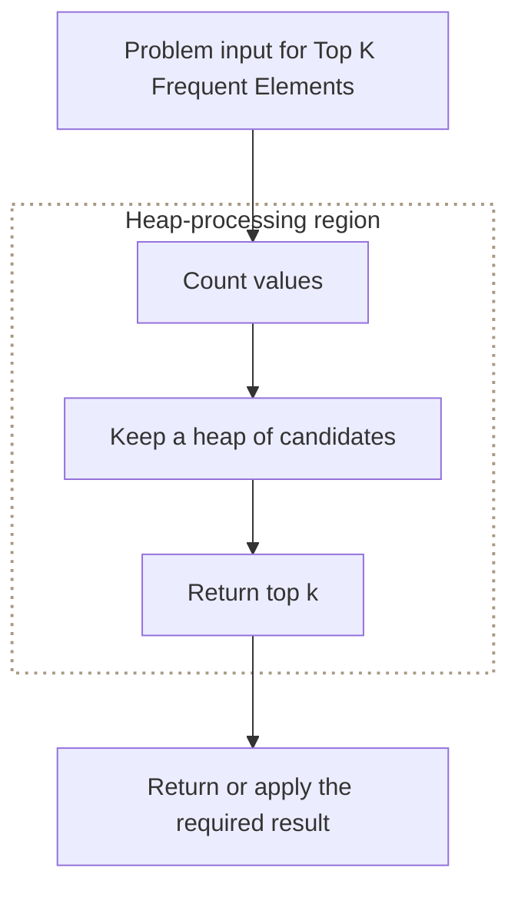

**Pattern:** Frequency map plus heap

**Where it is used in real life:**

- Search systems surface popular queries.
- Telemetry systems report busiest labels.

[Open the full commented Go solution](heap-priority-queues.md#top-k-frequent-elements)

> **Baby analogy:** Count every toy, then keep only the k fullest toy baskets.

### Longest Substring Without Repeating Characters

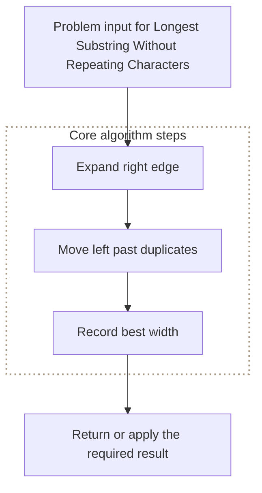

**Pattern:** Sliding window

**Where it is used in real life:**

- Session analysis finds spans without repeated events.
- Text analysis finds unique-character windows.

[Open the full commented Go solution](strings.md#longest-substring-without-repeating-characters)

> **Baby analogy:** Slide a picture frame over letter tiles and shrink it whenever a duplicate enters.

### Coin Change

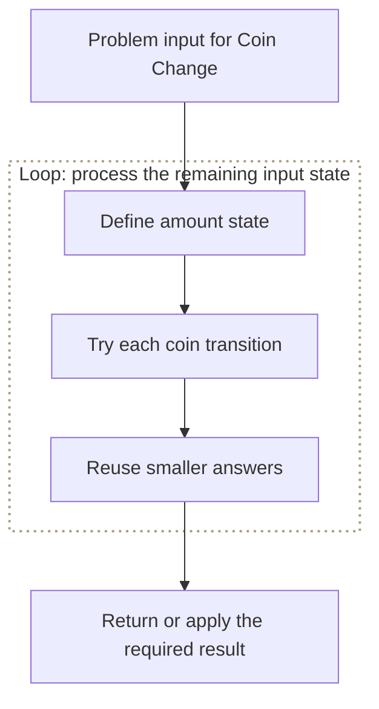

**Pattern:** Dynamic programming

**Where it is used in real life:**

- Payment systems minimize denominations.
- Resource packaging minimizes units needed for capacity.

[Open the full commented Go solution](dynamic-programming.md#coin-change)

> **Baby analogy:** Write the cheapest answer for every smaller amount on a sticker and reuse it.

### Group Anagrams

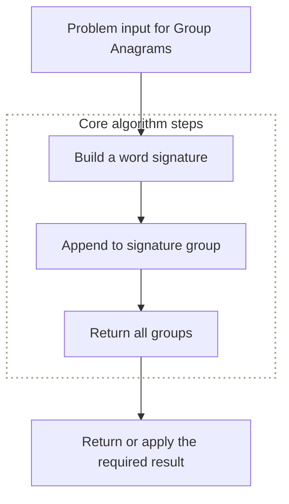

**Pattern:** Canonical key map

**Where it is used in real life:**

- Search systems group terms by letter inventory.
- Word games cluster rearrangements.

[Open the full commented Go solution](hash-map.md#group-anagrams)

> **Baby analogy:** Put words made from the same letter tiles into one labeled cubby.

### Implement Trie

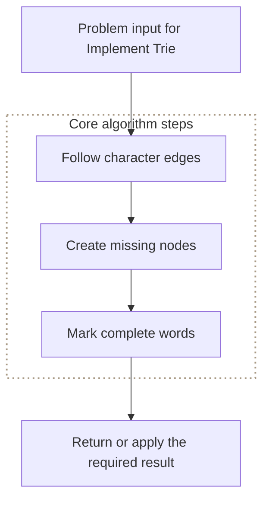

**Pattern:** Prefix tree

**Where it is used in real life:**

- Autocomplete stores searchable dictionaries.
- Routers organize prefix rules.

[Open the full commented Go solution](trie.md#implement-trie)

> **Baby analogy:** Words share the same letter branches until their spellings split.

---

## Six-week preparation plan

| Week | Focus | Expected outcome |
| --- | --- | --- |
| Week 1 | Arrays, strings, hash maps, complexity | Recognize scans, windows, two pointers, and counting |
| Week 2 | Linked lists, stacks, queues | Control pointers and explicit worklists |
| Week 3 | Trees, recursion, BFS, DFS | Explain child-return state and level traversal |
| Week 4 | Graphs, heaps, tries | Choose path, priority, component, and prefix tools |
| Week 5 | Dynamic programming and mixed medium problems | Define states and transitions without guessing |
| Week 6 | Timed mocks, review, communication | Produce correct, testable solutions under interview constraints |

Suggested minimum practice: 60 focused problems—about 20 easy, 32 medium, and 8 hard—plus repeated re-solves of missed patterns.

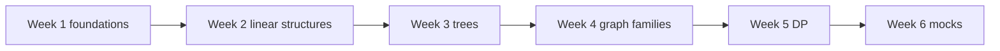

> **Baby analogy:** Learn one shelf of toys each week, then spend the final week practicing how quickly you can choose the right shelf.

---

## Senior engineer and engineering manager focus

Senior-level interviews add production judgment:

- Compare asymptotic and operational tradeoffs rather than reciting one answer.
- Discuss memory locality, concurrency, data ownership, failure behavior, and observability.
- Explain how constraints change the chosen algorithm.
- Identify when a standard library, database index, queue, cache, or search service should replace custom code.
- State how you would test correctness, load, skew, malformed input, and recovery.
- Communicate decisions so another engineer can maintain the implementation.

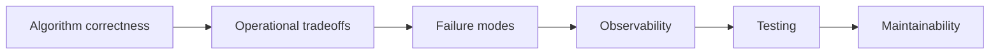

> **Baby analogy:** A senior builder explains not only how to make the toy bridge, but how it behaves when many children use it or one block breaks.

---

## Final checklist

Before the interview:

- Re-solve the top ten without notes.
- Review one-page complexity tables.
- Practice explaining maps, slices, pointers, worklists, and DP states.
- Run timed sessions with explicit boundary tests.
- Review failures by pattern rather than by problem title.

During the interview:

- Clarify first.
- Think aloud with an invariant.
- Write small, testable steps.
- Trace boundaries.
- Finish with complexity and tradeoffs.

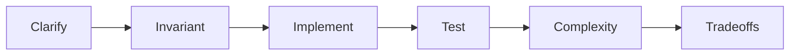

> **Baby analogy:** Pack the same school bag before every interview so the important tools are never left at home.
