# Dynamic Programming — A Compact Interview Guide

Dynamic programming solves repeated subproblems once and reuses their answers. The central design task is choosing a state that contains exactly enough information for the future.

- [Mental model](#mental-model)
- [Representation and core operations](#representation-and-core-operations)
- [Interview patterns and complexity](#interview-patterns-and-complexity)
- [Problem-solving checklist and common mistakes](#problem-solving-checklist-and-common-mistakes)
- [Top 10 Dynamic Programming Interview Questions](#top-10-dynamic-programming-interview-questions)
- [Interview checklist and next steps](#interview-checklist-and-next-steps)

> **Baby analogy:** Imagine a sticker notebook that records the answer to every smaller puzzle. The guide shows where every piece belongs before you start moving the pieces.

---

## Mental model

Define a state, write its transition from smaller states, establish base cases, and choose memoization or tabulation.

| Real system | How the topic appears |
| --- | --- |
| Route planning | Reuse best costs to intermediate locations |
| Resource allocation | Choose items under capacity constraints |
| Text comparison | Align, edit, or segment sequences |
| Scheduling | Reuse best results for prefixes of jobs |

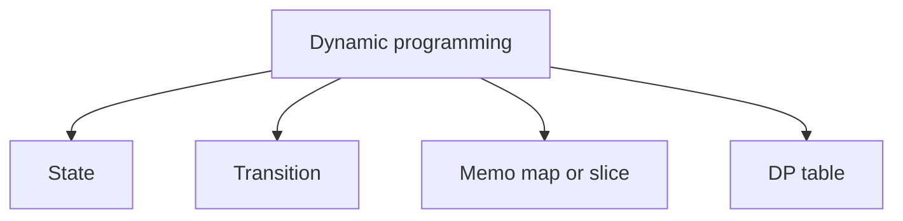

> **Baby analogy:** Imagine a sticker notebook that records the answer to every smaller puzzle. When the same puzzle appears again, read the sticker instead of rebuilding the answer.

---

## Representation and core operations

A state is not merely a loop index. It is the complete description required to answer the remaining subproblem.

| Representation | Role |
| --- | --- |
| State | Smallest information that uniquely identifies a subproblem |
| Transition | Rule combining smaller states |
| Memo map or slice | Keys are states; values are cached answers |
| DP table | Indexes select states; cells store their answers |

| Operation | Typical cost | Meaning |
| --- | --- | --- |
| Read cached state | O(1) typical | Reuse a previously solved answer |
| Compute one transition | O(k) | Inspect k predecessor choices |
| Fill S states | O(S·k) | Solve each state once |
| Space optimize | Problem-specific | Keep only predecessor rows or values |

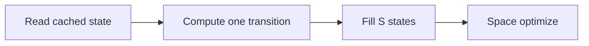

> **Baby analogy:** Imagine a sticker notebook that records the answer to every smaller puzzle. Each table box is one tiny question; fill it once using boxes that are already known.

---

## Interview patterns and complexity

| Question clue | Pattern | Practice problems in this guide |
| --- | --- | --- |
| Take or skip | Pick/not-pick DP | [House Robber](#house-robber), [Partition Equal Subset Sum](#partition-equal-subset-sum) |
| Prefix of one sequence | 1D DP | [Climbing Stairs](#climbing-stairs), [Decode Ways](#decode-ways), [Word Break](#word-break) |
| Prefixes of two sequences | 2D DP | [Longest Common Subsequence](#longest-common-subsequence) |
| Minimum coins or cost | Unbounded choice DP | [Coin Change](#coin-change), [Min Cost Climbing Stairs](#min-cost-climbing-stairs) |
| Grid paths | Row and column state | [Unique Paths](#unique-paths) |
| Best ordered subsequence | Sequence DP | [Longest Increasing Subsequence](#longest-increasing-subsequence) |

| Work | Complexity | Reason |
| --- | --- | --- |
| Memoized states | O(states × transitions) | Each state is solved once |
| 1D table | O(n) space | One answer per index |
| 2D table | O(rows × columns) space | One answer per state pair |
| Optimized rolling state | O(width) or O(1) | Discard unreachable history |

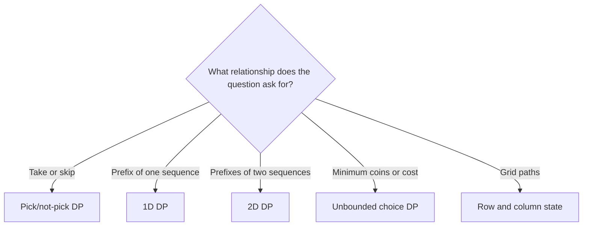

> **Baby analogy:** Imagine a sticker notebook that records the answer to every smaller puzzle. The clue tells you whether the notebook needs one page, a grid, or a take-or-skip choice.

---

## Problem-solving checklist and common mistakes

Before coding:

1. State exactly what the indexes, keys, pointers, states, or worklist elements represent.
2. Write the empty-input and smallest-input boundary behavior.
3. Choose the invariant that remains true after every step.
4. Trace one normal example and one edge case.
5. State whether output storage is included in space complexity.

Common mistakes:

- Starting with a table before defining the state meaning.
- Caching by an incomplete state key.
- Using greedy reasoning without proving it.
- Updating a 1D knapsack table in the wrong direction.
- Forgetting impossible-state sentinels.
- Counting recursive calls instead of unique memoized states.

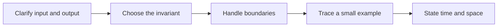

> **Baby analogy:** Imagine a sticker notebook that records the answer to every smaller puzzle. If the sticker label omits important information, you may reuse the right answer for the wrong puzzle.

---

## Top 10 Dynamic Programming Interview Questions

These are the single authoritative implementations in this guide. Each solution keeps the required question, answer, output, boundary, variable-role, logic, and complexity comments.

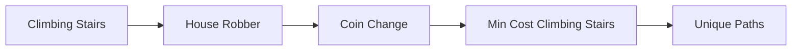

> **Baby analogy:** Imagine a sticker notebook that records the answer to every smaller puzzle. These ten puzzles are practice cards; each card teaches one reusable move.

### Climbing Stairs

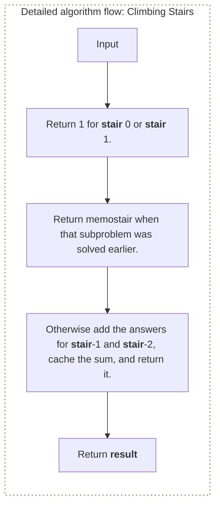

**Where it is used in real life:**

- Workflow planners count ways to reach a milestone using allowed step sizes.
- Protocol analysis counts valid sequences of incremental transitions.

```go
// Exact question: Given `n` stairs and moves of one or two stairs, return the number of distinct ways to reach the top.
//
// Example: Input n = 5 -> output 8 distinct sequences of one-step and two-step moves.
// at a time, how many distinct ways are there to reach the top?
//
// Possible answer: Use top-down recursion and cache each state so repeated subproblems are returned immediately.
//
// Output format: Return one `int`: the number of distinct ways to reach stair `n`.
//
// Inline descriptions:
// - `climbStairs` creates one cache and starts the recursive calculation at `n`.
// - `solve(stair)` returns the number of ways to reach that specific stair.
// - Each recursive call moves to a smaller stair until it reaches a base case.
//
// Boundary checks:
// - The function assumes `n >= 0`.
// - `stair <= 1` is the base case: stair 0 and stair 1 each have exactly one way.
//
// Key variables:
// - `n` is the target stair.
// - `memo` is a map: each key is a stair number, and its value is the already
//   calculated number of ways to reach that stair.
// - `stair` is the smaller subproblem currently being solved.
// - `result` is a cached number of ways; `exists` says whether the key was found.
//
// Logic:
// 1. Return 1 for stair 0 or stair 1.
// 2. Return `memo[stair]` when that subproblem was solved earlier.
// 3. Otherwise add the answers for `stair-1` and `stair-2`, cache the sum, and return it.
func climbStairs(n int) int {
	// Key = stair number; value = number of ways to reach that stair.
	memo := make(map[int]int)

	// Declare the function variable first so the function can call itself.
	var solve func(int) int
	solve = func(stair int) int {
		// There is one way to stay at stair 0 and one way to reach stair 1.
		if stair <= 1 {
			return 1
		}

		// Reuse the cached value instead of rebuilding the same recursion tree.
		if result, exists := memo[stair]; exists {
			return result
		}

		// The final move came from either one stair back or two stairs back.
		memo[stair] = solve(stair-1) + solve(stair-2)
		return memo[stair]
	}

	// Solve the original target after all smaller states are available on demand.
	return solve(n)
}

// time complexity: O(n) -> each of the `n` states is calculated once and then reused.
// space complexity: O(n) -> the recursion stack and any cache can grow to one entry per input state.
```

> **Baby analogy:** Imagine a sticker notebook that records the answer to every smaller puzzle. "Climbing Stairs" is one small game played with the same pieces and rules.

### House Robber

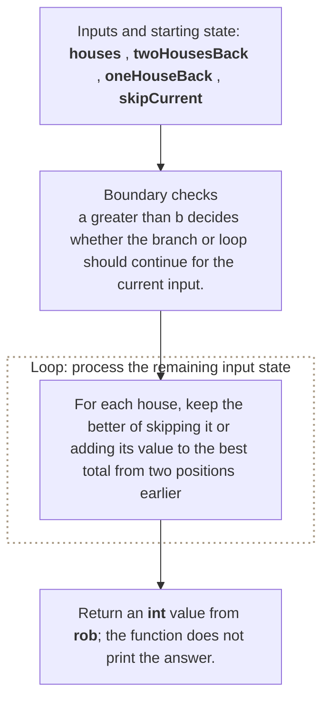

**Where it is used in real life:**

- Scheduling chooses non-adjacent jobs when neighboring jobs conflict.
- Ad placement maximizes value while preventing adjacent placements.

```go
// Exact question: Given non-negative values in houses along one street, return the maximum value that can be robbed without choosing adjacent houses.
//
// Example: Input houses = [2, 7, 9, 3, 1] -> output 12 by choosing 2, 9, and 1.
//
// Possible answer: For each house, keep the better of skipping it or adding its value to the best total from two positions earlier.
//
// Output format: Return an `int` value from `rob`; the function does not print the answer.
//
// Inline descriptions:
// - `houses` is a slice: the index identifies an element or state, and the stored item has type int.
//
// Boundary checks:
// - `a > b` decides whether the branch or loop should continue for the current input.
//
// Key variables:
// - `houses` is a slice: the index identifies an element or state, and the stored item has type int.
// - `twoHousesBack` holds the intermediate value produced by `0`.
// - `oneHouseBack` holds the intermediate value produced by `0`.
// - `skipCurrent` holds the value for the state currently being calculated.
// - `robCurrent` holds the value for the state currently being calculated.
//
// Logic:
// 1. Create or use a slice so indexes identify positions and elements store their data or state.
// 2. Iterate through the required elements or states in the order shown.
// 3. Recursively reduce the current problem to smaller calls until a base condition is reached.
func rob(houses []int) int {
	twoHousesBack := 0
	oneHouseBack := 0

	for _, money := range houses {
		skipCurrent := oneHouseBack
		robCurrent := twoHousesBack + money

		current := max(skipCurrent, robCurrent)

		twoHousesBack = oneHouseBack
		oneHouseBack = current
	}

	return oneHouseBack
}

func max(a, b int) int {
	if a > b {
		return a
	}
	return b
}

// time complexity: O(n) -> the algorithm visits each of the `n` input elements or states once.
// space complexity: O(1) -> only a fixed number of scalar variables or references is kept.
```

> **Baby analogy:** Imagine a sticker notebook that records the answer to every smaller puzzle. "House Robber" is one small game played with the same pieces and rules.

### Coin Change

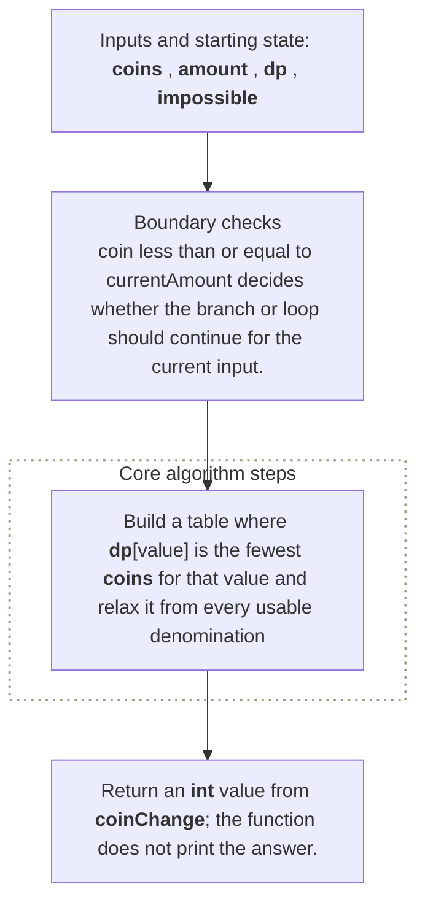

**Where it is used in real life:**

- Payment systems minimize denominations used for a target amount.
- Resource packaging minimizes units needed to satisfy capacity.

```go
// Exact question: Given coin denominations and an amount, return the minimum number of coins needed to form the amount, or `-1` when it is impossible.
//
// Example: Input coins = [1, 2, 5] and amount = 11 -> output 3 using 5 + 5 + 1.
//
// Possible answer: Build a table where `dp[value]` is the fewest coins for that value and relax it from every usable denomination.
//
// Output format: Return an `int` value from `coinChange`; the function does not print the answer.
//
// Inline descriptions:
// - `coins` is a slice: the index identifies an element or state, and the stored item has type int.
// - `amount` is the int input used by this example.
//
// Boundary checks:
// - `coin <= currentAmount` decides whether the branch or loop should continue for the current input.
// - `dp[amount] == impossible` decides whether the branch or loop should continue for the current input.
// - `a < b` decides whether the branch or loop should continue for the current input.
//
// Key variables:
// - `coins` is a slice: the index identifies an element or state, and the stored item has type int.
// - `amount` is the int input used by this example.
// - `dp` is indexed by a state and stores the computed answer for that state.
// - `impossible` holds the intermediate value produced by `amount + 1`.
//
// Logic:
// 1. Create or use a slice so indexes identify positions and elements store their data or state.
// 2. Iterate through the required elements or states in the order shown.
// 3. Recursively reduce the current problem to smaller calls until a base condition is reached.
func coinChange(coins []int, amount int) int {
	impossible := amount + 1

	dp := make([]int, amount+1)
	for currentAmount := 1; currentAmount <= amount; currentAmount++ {
		dp[currentAmount] = impossible
	}

	for currentAmount := 1; currentAmount <= amount; currentAmount++ {
		for _, coin := range coins {
			if coin <= currentAmount {
				dp[currentAmount] = min(
					dp[currentAmount],
					1+dp[currentAmount-coin],
				)
			}
		}
	}

	if dp[amount] == impossible {
		return -1
	}

	return dp[amount]
}

func min(a, b int) int {
	if a < b {
		return a
	}
	return b
}

// time complexity: O(amount * number of coins) -> the algorithm combines work across each dimension or choice represented in the product.
// space complexity: O(amount) -> the auxiliary storage grows according to this bound.
```

> **Baby analogy:** Imagine a sticker notebook that records the answer to every smaller puzzle. "Coin Change" is one small game played with the same pieces and rules.

### Min Cost Climbing Stairs

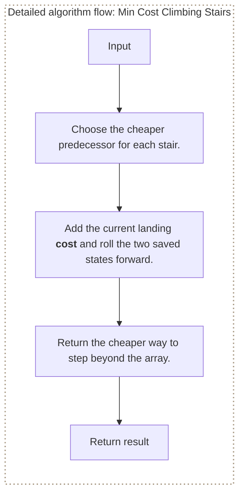

**Where it is used in real life:**

- Route planners minimize accumulated cost across permitted jumps.
- Workflow engines select the cheaper predecessor transition.

```go
// Exact question: Given the cost of stepping on each stair, return the minimum cost to move beyond the final stair when each move climbs one or two stairs.
//
// Example: Input cost = [10, 15, 20] -> output 15 by starting on the second stair and stepping beyond the end.
//
// Possible answer: Keep only the minimum costs to reach the previous two boundaries.
//
// Output format: Return the minimum cost to move beyond the final stair.
//
// Inline descriptions:
// - `cost` indexes are stair positions and elements are costs paid when stepping there.
//
// Boundary checks:
// - Zero or one stair can be skipped from the allowed starting positions and costs zero.
//
// Key variables:
// - `twoBack` and `oneBack` are the only predecessor DP states needed by the transition.
//
// Logic:
// 1. Choose the cheaper predecessor for each stair.
// 2. Add the current landing cost and roll the two saved states forward.
// 3. Return the cheaper way to step beyond the array.
func minCostClimbingStairs(cost []int) int {
	twoBack, oneBack := 0, 0
	for _, landingCost := range cost {
		bestPrevious := oneBack
		if twoBack < bestPrevious {
			bestPrevious = twoBack
		}
		twoBack, oneBack = oneBack, bestPrevious+landingCost
	}
	if twoBack < oneBack {
		return twoBack
	}
	return oneBack
}

// time complexity: O(n) -> each stair cost is processed once.
// space complexity: O(1) -> only two prior DP states are retained.
```

> **Baby analogy:** Imagine a sticker notebook that records the answer to every smaller puzzle. "Min Cost Climbing Stairs" is one small game played with the same pieces and rules.

### Unique Paths

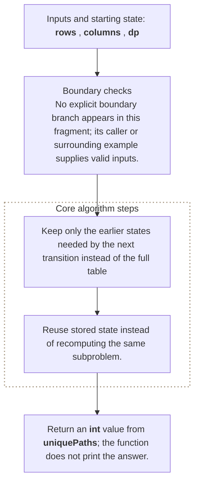

**Where it is used in real life:**

- Grid robots count monotonic routes through warehouse layouts.
- Combinatorial systems count valid right-and-down workflows.

```go
// Exact question: Given a grid with `rows` rows and `columns` columns, count paths from the top-left to the bottom-right when moves are only right or down.
//
// Example: Input rows = 3 and columns = 7 -> output 28 right-and-down paths.
//
// Possible answer: Keep only the earlier states needed by the next transition instead of the full table.
//
// Output format: Return an `int` value from `uniquePaths`; the function does not print the answer.
//
// Inline descriptions:
// - `rows` is the int input used by this example.
// - `columns` is the int input used by this example.
//
// Boundary checks:
// - No explicit boundary branch appears in this fragment; its caller or surrounding example supplies valid inputs.
//
// Key variables:
// - `rows` is the int input used by this example.
// - `columns` is the int input used by this example.
// - `dp` is indexed by a state and stores the computed answer for that state.
//
// Logic:
// 1. Create or use a slice so indexes identify positions and elements store their data or state.
// 2. Iterate through the required elements or states in the order shown.
// 3. Reuse stored state instead of recomputing the same subproblem.
func uniquePaths(rows, columns int) int {
	dp := make([]int, columns)

	for column := range dp {
		dp[column] = 1
	}

	for row := 1; row < rows; row++ {
		for column := 1; column < columns; column++ {
			dp[column] = dp[column] + dp[column-1]
		}
	}

	return dp[columns-1]
}

// time complexity: O(rows * columns) -> the algorithm processes every cell in the rows-by-columns state space.
// space complexity: O(columns) -> the auxiliary storage grows according to this bound.
```

> **Baby analogy:** Imagine a sticker notebook that records the answer to every smaller puzzle. "Unique Paths" is one small game played with the same pieces and rules.

### Longest Increasing Subsequence

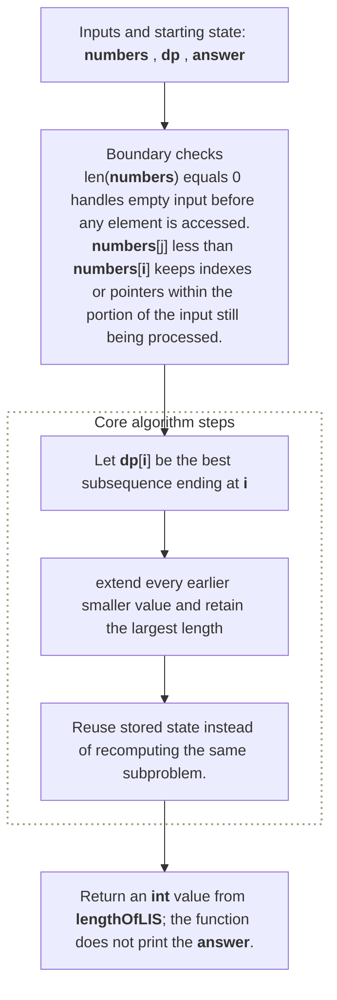

**Where it is used in real life:**

- Trend analysis finds the longest steadily improving sequence.
- Version analysis finds the largest order-preserving chain.

```go
// Exact question: Given an integer slice, return the length of its longest strictly increasing subsequence using O(n²) dynamic programming.
//
// Example: Input numbers = [10, 9, 2, 5, 3, 7, 101, 18] -> output length 4, for example [2, 3, 7, 101].
//
// Possible answer: Let `dp[i]` be the best subsequence ending at `i`; extend every earlier smaller value and retain the largest length.
//
// Output format: Return an `int` value from `lengthOfLIS`; the function does not print the answer.
//
// Inline descriptions:
// - `numbers` is a slice: the index identifies an element or state, and the stored item has type int.
//
// Boundary checks:
// - `len(numbers) == 0` handles empty input before any element is accessed.
// - `numbers[j] < numbers[i]` keeps indexes or pointers within the portion of the input still being processed.
//
// Key variables:
// - `numbers` is a slice: the index identifies an element or state, and the stored item has type int.
// - `dp` is indexed by a state and stores the computed answer for that state.
// - `answer` tracks the best or final answer found so far.
//
// Logic:
// 1. Create or use a slice so indexes identify positions and elements store their data or state.
// 2. Iterate through the required elements or states in the order shown.
// 3. Reuse stored state instead of recomputing the same subproblem.
func lengthOfLIS(numbers []int) int {
	if len(numbers) == 0 {
		return 0
	}

	dp := make([]int, len(numbers))
	answer := 1

	for i := range numbers {
		dp[i] = 1

		for j := 0; j < i; j++ {
			if numbers[j] < numbers[i] {
				dp[i] = max(dp[i], dp[j]+1)
			}
		}

		answer = max(answer, dp[i])
	}

	return answer
}

// time complexity: O(n^2) -> nested traversal can compare or process every pair of input elements.
// space complexity: O(n) -> the auxiliary slice, map, table, queue, or returned collection can grow with `n`.
```

> **Baby analogy:** Imagine a sticker notebook that records the answer to every smaller puzzle. "Longest Increasing Subsequence" is one small game played with the same pieces and rules.

### Longest Common Subsequence

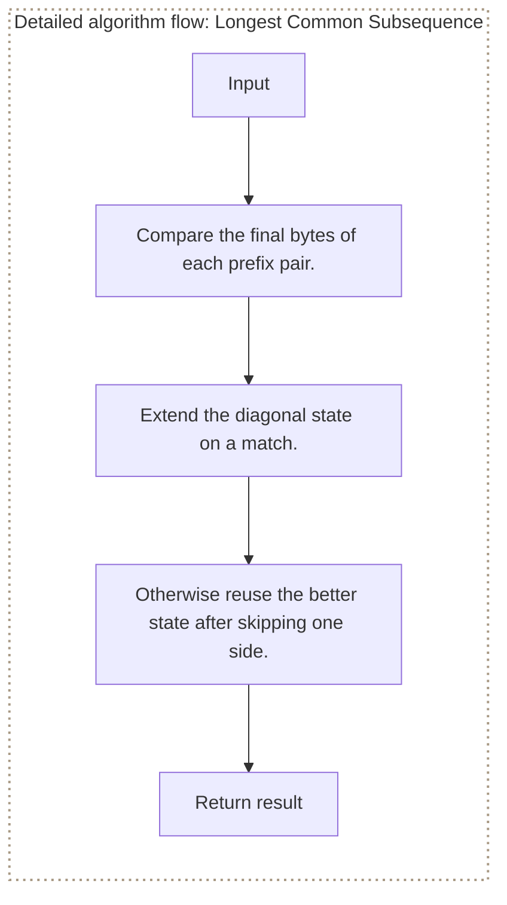

**Where it is used in real life:**

- Diff tools identify preserved ordered content between files.
- Bioinformatics aligns common symbol sequences.

```go
// Exact question: Given two strings, return the length of their longest subsequence that appears in both strings in the same relative order.
//
// Example: Input first = abcde and second = ace -> output 3 for the common subsequence ace.
//
// Possible answer: Match equal bytes diagonally or reuse the better state obtained by skipping one byte.
//
// Output format: Return the common-subsequence length.
//
// Inline descriptions:
// - String indexes identify byte positions; `best` row and column indexes are prefix lengths and elements are LCS lengths.
//
// Boundary checks:
// - An empty string creates only zero-valued base-prefix states.
//
// Key variables:
// - `best[i][j]` is the answer for `left[:i]` and `right[:j]`.
//
// Logic:
// 1. Compare the final bytes of each prefix pair.
// 2. Extend the diagonal state on a match.
// 3. Otherwise reuse the better state after skipping one side.
func longestCommonSubsequence(left, right string) int {
	best := make([][]int, len(left)+1)
	for row := range best {
		best[row] = make([]int, len(right)+1)
	}
	for i := 1; i <= len(left); i++ {
		for j := 1; j <= len(right); j++ {
			if left[i-1] == right[j-1] {
				best[i][j] = best[i-1][j-1] + 1
			} else {
				best[i][j] = best[i-1][j]
				if best[i][j-1] > best[i][j] {
					best[i][j] = best[i][j-1]
				}
			}
		}
	}
	return best[len(left)][len(right)]
}

// time complexity: O(n * m) -> every pair of prefix lengths is solved once.
// space complexity: O(n * m) -> the table stores an answer for every prefix pair.
```

> **Baby analogy:** Imagine a sticker notebook that records the answer to every smaller puzzle. "Longest Common Subsequence" is one small game played with the same pieces and rules.

### Word Break

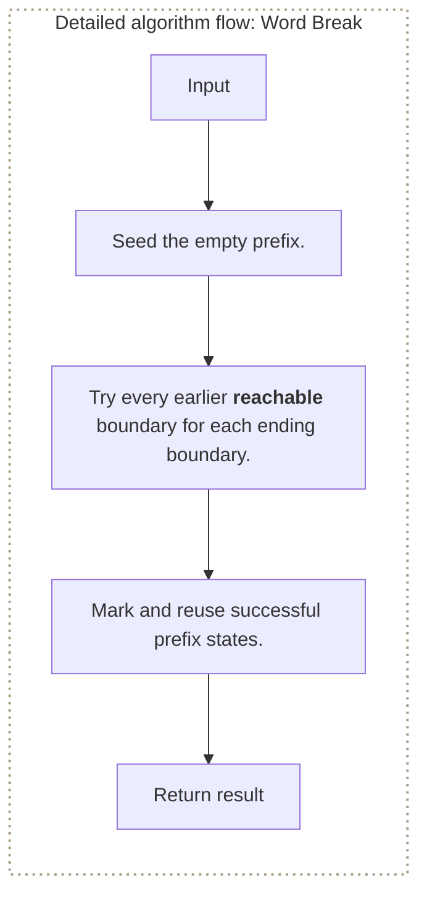

**Where it is used in real life:**

- Tokenizers determine whether text can be segmented into known vocabulary.
- URL and identifier parsers validate concatenated dictionary terms.

```go
// Exact question: Given a string and a dictionary, return whether the entire string can be segmented into one or more dictionary words.
//
// Example: Input text = leetcode and dictionary = [leet, code] -> output true.
//
// Possible answer: Mark prefix boundary `end` reachable when an earlier reachable boundary starts a dictionary word.
//
// Output format: Return true when the entire string can be segmented.
//
// Inline descriptions:
// - `dictionary` map keys are valid words and empty values carry membership state; `reachable` indexes are string boundaries and elements are booleans.
//
// Boundary checks:
// - Boundary zero is reachable by using no words; an empty dictionary cannot segment non-empty text.
//
// Key variables:
// - `reachable[end]` is true when some reachable `start` produces a dictionary-key substring.
//
// Logic:
// 1. Seed the empty prefix.
// 2. Try every earlier reachable boundary for each ending boundary.
// 3. Mark and reuse successful prefix states.
func wordBreak(text string, dictionary map[string]struct{}) bool {
	reachable := make([]bool, len(text)+1)
	reachable[0] = true
	for end := 1; end <= len(text); end++ {
		for start := 0; start < end; start++ {
			if !reachable[start] {
				continue
			}
			if _, exists := dictionary[text[start:end]]; exists {
				reachable[end] = true
				break
			}
		}
	}
	return reachable[len(text)]
}

// time complexity: O(n³) -> O(n²) boundaries may create O(n)-length substring keys in Go.
// space complexity: O(n + d) -> reachability stores `n + 1` states in addition to the supplied dictionary.
```

> **Baby analogy:** Imagine a sticker notebook that records the answer to every smaller puzzle. "Word Break" is one small game played with the same pieces and rules.

### Decode Ways

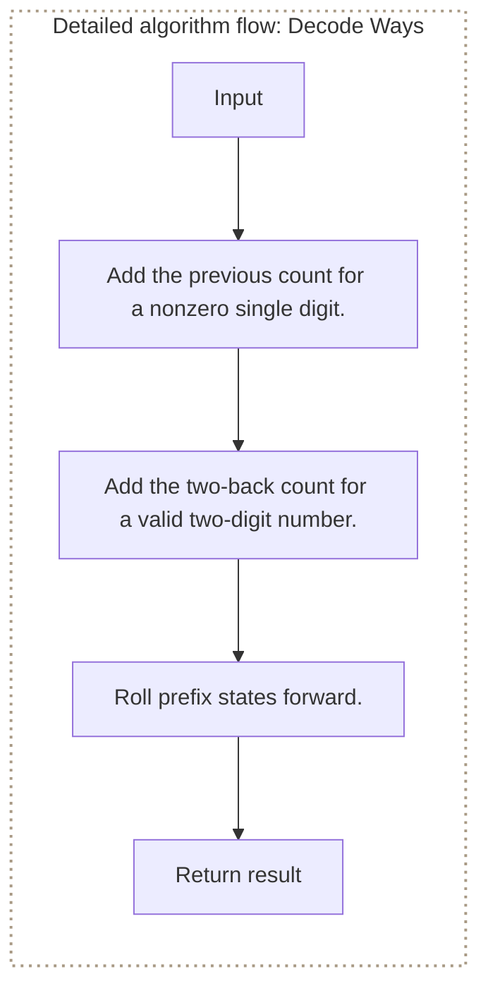

**Where it is used in real life:**

- Protocol decoders count interpretations of compact numeric encodings.
- Validation tools detect whether an encoded message has any legal parse.

```go
// Exact question: Given digits where `1` through `26` map to letters, return the number of valid decodings and reject encodings that begin a token with zero.
//
// Example: Input digits = 226 -> output 3 from 2|2|6, 22|6, and 2|26.
//
// Possible answer: Combine the saved counts for valid one-digit and two-digit endings.
//
// Output format: Return the number of decodings using `1` through `26` as letters.
//
// Inline descriptions:
// - `digits` indexes are byte positions and elements are digit bytes; rolling scalars store prefix-count states.
//
// Boundary checks:
// - Empty input and a leading zero return zero; only pairs from 10 through 26 are valid.
//
// Key variables:
// - `twoBack` and `oneBack` are decoding counts for the two preceding prefix boundaries.
//
// Logic:
// 1. Add the previous count for a nonzero single digit.
// 2. Add the two-back count for a valid two-digit number.
// 3. Roll prefix states forward.
func decodeWays(digits string) int {
	if len(digits) == 0 || digits[0] == '0' {
		return 0
	}
	twoBack, oneBack := 1, 1
	for index := 1; index < len(digits); index++ {
		current := 0
		if digits[index] != '0' {
			current += oneBack
		}
		pair := int(digits[index-1]-'0')*10 + int(digits[index]-'0')
		if pair >= 10 && pair <= 26 {
			current += twoBack
		}
		twoBack, oneBack = oneBack, current
	}
	return oneBack
}

// time complexity: O(n) -> each digit position performs constant transition work.
// space complexity: O(1) -> only two previous prefix states are retained.
```

> **Baby analogy:** Imagine a sticker notebook that records the answer to every smaller puzzle. "Decode Ways" is one small game played with the same pieces and rules.

### Partition Equal Subset Sum

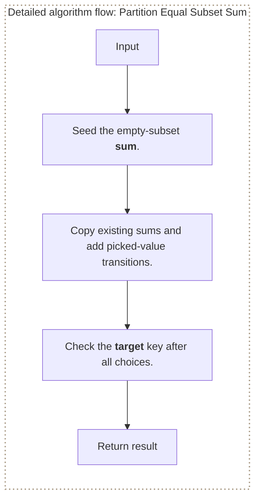

**Where it is used in real life:**

- Workload balancing divides items into equal-total groups.
- Finance reconciliation checks whether a subset matches half the total.

```go
// Exact question: Given positive integers, return whether they can be partitioned into two subsets with equal sums.
//
// Example: Input numbers = [1, 5, 11, 5] -> output true because [11] and [1, 5, 5] both sum to 11.
//
// Possible answer: Track reachable sum keys and add a new sum state for every picked value.
//
// Output format: Return true when some subset sums exactly to `target`.
//
// Inline descriptions:
// - `values` indexes are choice positions and elements are non-negative candidates; `reachable` map keys are sums and values are reachability state.
//
// Boundary checks:
// - Negative targets return false; target zero is reachable by picking nothing.
//
// Key variables:
// - Each `sum` key represents a not-pick state, while `sum+value` represents picking the current value.
//
// Logic:
// 1. Seed the empty-subset sum.
// 2. Copy existing sums and add picked-value transitions.
// 3. Check the target key after all choices.
func canReachSubsetSum(values []int, target int) bool {
	if target < 0 {
		return false
	}
	reachable := map[int]bool{0: true}
	for _, value := range values {
		next := make(map[int]bool, len(reachable)*2)
		for sum := range reachable {
			next[sum] = true
			if sum+value <= target {
				next[sum+value] = true
			}
		}
		reachable = next
	}
	return reachable[target]
}

// time complexity: O(n * target) -> each value can update every reachable sum through the target.
// space complexity: O(target) -> the maps retain at most one state per sum from zero through target.
```

> **Baby analogy:** Imagine a sticker notebook that records the answer to every smaller puzzle. "Partition Equal Subset Sum" is one small game played with the same pieces and rules.

---

## Interview checklist and next steps

Use this answer order during an interview:

1. Restate the input, output, and constraints.
2. Name the pattern and the invariant.
3. Explain the data structure roles before coding.
4. Handle boundary cases explicitly.
5. Walk through a small example.
6. Give time and space complexity with variable definitions.

Recommended practice order:

1. [Climbing Stairs](#climbing-stairs)
2. [House Robber](#house-robber)
3. [Coin Change](#coin-change)
4. [Min Cost Climbing Stairs](#min-cost-climbing-stairs)
5. [Unique Paths](#unique-paths)
6. [Longest Increasing Subsequence](#longest-increasing-subsequence)
7. [Longest Common Subsequence](#longest-common-subsequence)
8. [Word Break](#word-break)
9. [Decode Ways](#decode-ways)
10. [Partition Equal Subset Sum](#partition-equal-subset-sum)

Continue with: House Robber II, Edit Distance, 0/1 Knapsack, Target Sum, Burst Balloons.

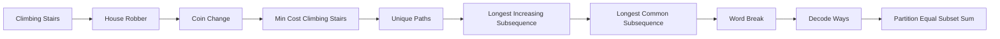

> **Baby analogy:** Imagine a sticker notebook that records the answer to every smaller puzzle. Pack the same checklist every time so no important interview step is forgotten.
