# Graphs — A Compact Interview Guide

A graph models objects and the relationships between them. Unlike a tree, a graph can contain cycles, multiple paths, and disconnected components.

- [Mental model](#mental-model)
- [Representation and core operations](#representation-and-core-operations)
- [Interview patterns and complexity](#interview-patterns-and-complexity)
- [Problem-solving checklist and common mistakes](#problem-solving-checklist-and-common-mistakes)
- [Top 10 Graph Interview Questions](#top-10-graph-interview-questions)
- [Interview checklist and next steps](#interview-checklist-and-next-steps)

> **Baby analogy:** Imagine a playground map with children as dots and paths as lines. The guide shows where every piece belongs before you start moving the pieces.

---

## Mental model

Vertices hold identities or values; edges hold relationships. Traversal needs a worklist and a visited state so cycles do not cause repeated processing.

| Real system | How the topic appears |
| --- | --- |
| Social networks | People are vertices and relationships are edges |
| Routing | Locations or routers connect through weighted links |
| Build systems | Tasks depend on other tasks |
| Grids | Cells become vertices connected to neighboring cells |

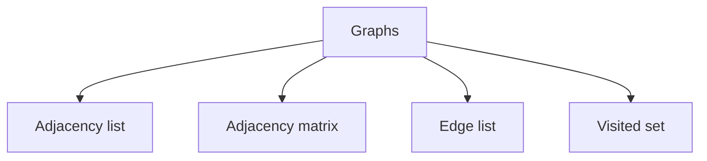

> **Baby analogy:** Imagine a playground map with children as dots and paths as lines. A dot is a place and a line says where you can walk next; some paths may loop back.

---

## Representation and core operations

Choose a representation from graph density and operations. Adjacency lists are normally best for sparse interview graphs.

| Representation | Role |
| --- | --- |
| Adjacency list | Vertex indexes or keys map to neighbor values |
| Adjacency matrix | Rows and columns are vertices; cells hold edge state or weight |
| Edge list | Each record stores endpoints and optional weight |
| Visited set | Keys are discovered vertices; values represent seen state |

| Operation | Typical cost | Meaning |
| --- | --- | --- |
| BFS or DFS | O(V+E) | Visit vertices and inspect adjacency entries |
| Add adjacency edge | O(1) amortized | Append a neighbor |
| Matrix edge lookup | O(1) | Read one cell |
| Topological sort | O(V+E) | Process dependency indegrees |
| Dijkstra with heap | O((V+E) log V) | Repeated minimum-distance extraction |

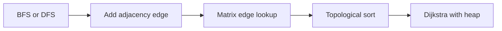

> **Baby analogy:** Imagine a playground map with children as dots and paths as lines. Keep a line or pile of places still to visit and a sticker on every place already seen.

---

## Interview patterns and complexity

| Question clue | Pattern | Practice problems in this guide |
| --- | --- | --- |
| Nearest in unweighted graph | BFS | [Shortest Distances](#shortest-distances-in-an-unweighted-graph) |
| Reachability or components | DFS or BFS | [Number of Islands](#number-of-islands), [Count Connected Components](#count-connected-components), [Pacific Atlantic Water Flow](#pacific-atlantic-water-flow) |
| Prerequisites | Topological sort | [Course Schedule](#course-schedule) |
| Undirected connectivity | DFS or Union-Find | [Detect a Cycle](#detect-a-cycle-in-an-undirected-graph), [Redundant Connection](#redundant-connection) |
| Nonnegative weighted path | Dijkstra | [Dijkstra Shortest Paths](#dijkstra-shortest-paths) |
| Weighted relationship | DFS with accumulated weight | [Evaluate Division](#evaluate-division) |
| Copy a connected structure | DFS plus old-to-new map | [Clone Graph](#clone-graph) |

| Work | Complexity | Reason |
| --- | --- | --- |
| Traversal | O(V+E) | Every vertex and adjacency entry is processed |
| Adjacency list space | O(V+E) | Vertices plus stored edges |
| Adjacency matrix space | O(V²) | Cell for every vertex pair |
| Union-Find operation | Almost O(1) amortized | Compression and union by rank |

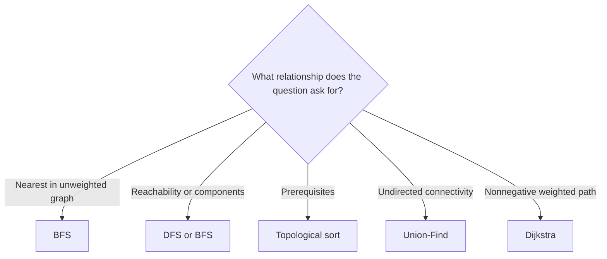

> **Baby analogy:** Imagine a playground map with children as dots and paths as lines. The clue decides whether to explore by distance, follow one path deeply, order chores, or join groups.

---

## Problem-solving checklist and common mistakes

Before coding:

1. State exactly what the indexes, keys, pointers, states, or worklist elements represent.
2. Write the empty-input and smallest-input boundary behavior.
3. Choose the invariant that remains true after every step.
4. Trace one normal example and one edge case.
5. State whether output storage is included in space complexity.

Common mistakes:
- Marking visited only when dequeuing and enqueuing duplicates.
- Forgetting disconnected components.
- Adding reverse edges to a directed graph.
- Using BFS for arbitrary weighted shortest paths.
- Treating a grid boundary check as optional.
- Ignoring stale heap entries in Dijkstra.

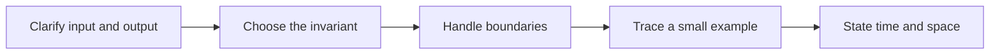

> **Baby analogy:** Imagine a playground map with children as dots and paths as lines. Without seen stickers, children can walk around the same playground loop forever.

---

## Top 10 Graph Interview Questions

These are the single authoritative implementations in this guide. Each solution keeps the required question, answer, output, boundary, variable-role, logic, and complexity comments.

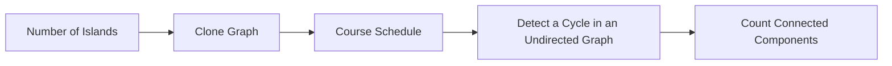

> **Baby analogy:** Imagine a playground map with children as dots and paths as lines. These ten puzzles are practice cards; each card teaches one reusable move.

### Number of Islands

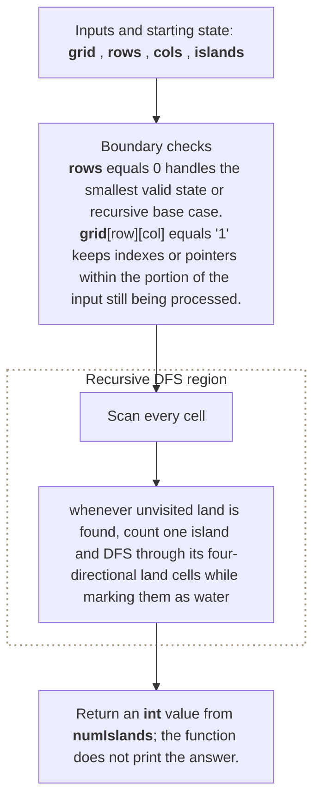

**Where it is used in real life:**

- Satellite imagery groups connected land pixels.
- Network monitoring groups adjacent failed cells into incidents.

```go
// Exact question: Given a rectangular grid of land (`'1'`) and water (`'0'`), return the number of four-directionally connected land components.
//
// Example: Input grid rows 11000, 11000, 00100, 00011 -> output 3 islands.
//
// Possible answer: Scan every cell; whenever unvisited land is found, count one island and DFS through its four-directional land cells while marking them as water.
//
// Output format: Return an `int` value from `numIslands`; the function does not print the answer.
//
// Inline descriptions:
// - `grid` is a two-dimensional slice: row and column indexes identify positions, and each cell stores a value.
//
// Boundary checks:
// - `rows == 0` handles the smallest valid state or recursive base case.
// - `grid[row][col] == '1'` keeps indexes or pointers within the portion of the input still being processed.
//
// Key variables:
// - `grid` is a two-dimensional slice: row and column indexes identify positions, and each cell stores a value.
// - `dfs(row, col)` marks every land cell connected to one discovered island.
// - `rows` and `cols` are the grid dimensions and define the valid coordinate boundaries.
// - `islands` counts how many DFS traversals start from previously unvisited land.
//
// Logic:
// 1. Create or use a slice so indexes identify positions and elements store their data or state.
// 2. Iterate through the required elements or states in the order shown.
// 3. Return the value produced after the state updates are complete.
func numIslands(grid [][]byte) int {
	rows := len(grid)
	if rows == 0 {
		return 0
	}

	cols := len(grid[0])
	islands := 0

	var dfs func(int, int)
	dfs = func(row, col int) {
		if row < 0 || row >= rows ||
			col < 0 || col >= cols ||
			grid[row][col] != '1' {
			return
		}

		// Modify the grid to mark the cell visited.
		grid[row][col] = '0'

		dfs(row-1, col)
		dfs(row+1, col)
		dfs(row, col-1)
		dfs(row, col+1)
	}

	for row := 0; row < rows; row++ {
		for col := 0; col < cols; col++ {
			if grid[row][col] == '1' {
				islands++
				dfs(row, col)
			}
		}
	}

	return islands
}

// time complexity: O(rows * columns) -> the algorithm processes every cell in the rows-by-columns state space.
// space complexity: O(rows * columns) -> although the grid is marked in place, the DFS stack can span all cells in the worst case.
```

> **Baby analogy:** Imagine a playground map with children as dots and paths as lines. "Number of Islands" is one small game played with the same pieces and rules.

### Clone Graph

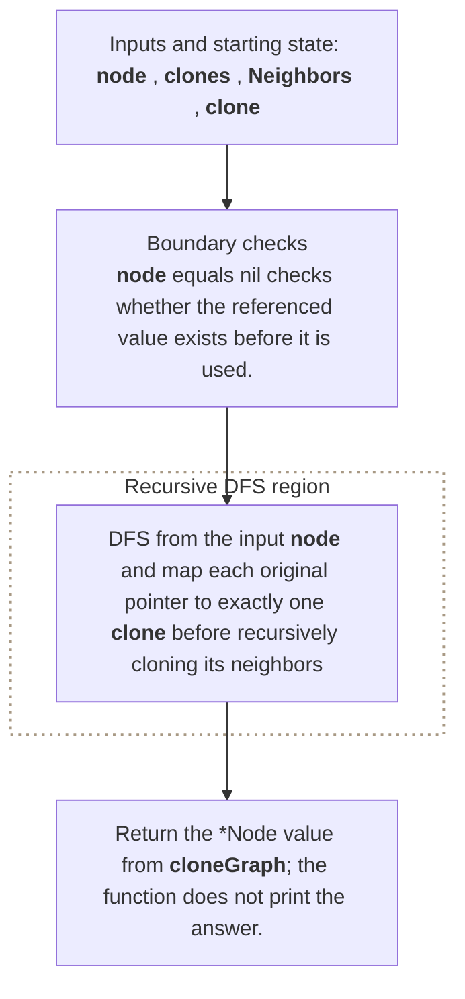

**Where it is used in real life:**

- Editors duplicate connected scene or workflow models.
- Test systems copy dependency graphs without sharing mutable nodes.

```go
// Exact question: Given a node in a connected undirected graph, return a deep copy with new nodes and the same adjacency relationships.
//
// Example: Input graph 1--2 -> output two new nodes with the same edge; changing a clone must not change the original.
//
// Possible answer: DFS from the input node and map each original pointer to exactly one clone before recursively cloning its neighbors.
//
// Output format: Return the `*Node` value from `cloneGraph`; the function does not print the answer.
//
// Inline descriptions:
// - `node` points to a Node value that the function reads or updates.
//
// Boundary checks:
// - `node == nil` checks whether the referenced value exists before it is used.
//
// Key variables:
// - `node` points to a Node value that the function reads or updates.
// - `clones` maps each original node-pointer key to its one corresponding cloned-node pointer.
// - `Neighbors` is a slice whose indexes are outgoing-edge positions and whose elements are pointers to adjacent nodes.
// - `clone` is the recursive helper that returns the unique clone for an original node.
// - `copyNode` is the newly allocated node whose neighbor slice is populated from cloned neighbors.
//
// Logic:
// 1. Create or use a map to associate each lookup key with its stored value.
// 2. Iterate through the required elements or states in the order shown.
// 3. Recursively reduce the current problem to smaller calls until a base condition is reached.
type Node struct {
	Val       int
	Neighbors []*Node
}

func cloneGraph(node *Node) *Node {
	if node == nil {
		return nil
	}

	clones := make(map[*Node]*Node)

	var clone func(*Node) *Node
	clone = func(current *Node) *Node {
		if existing, ok := clones[current]; ok {
			return existing
		}

		copyNode := &Node{Val: current.Val}
		clones[current] = copyNode

		for _, neighbor := range current.Neighbors {
			copyNode.Neighbors = append(
				copyNode.Neighbors,
				clone(neighbor),
			)
		}

		return copyNode
	}

	return clone(node)
}

// time complexity: O(V + E) -> cloning visits every reachable vertex once and copies every adjacency edge once.
// space complexity: O(V) -> the clone map and recursion stack can retain one entry per reachable vertex.
```

> **Baby analogy:** Imagine a playground map with children as dots and paths as lines. "Clone Graph" is one small game played with the same pieces and rules.

### Course Schedule

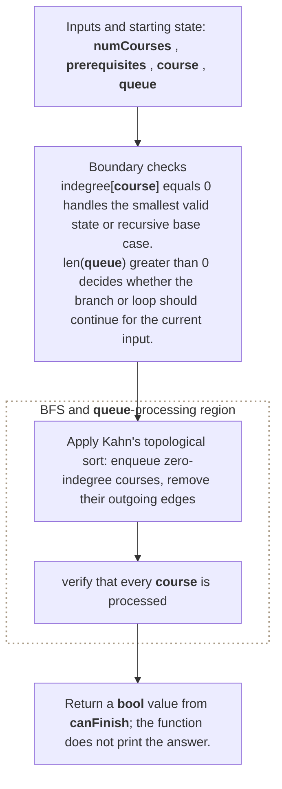

**Where it is used in real life:**

- Build systems detect circular task dependencies.
- Training platforms validate prerequisite plans.

```go
// Exact question: Given a course count and prerequisite pairs, return whether every course can be completed without a dependency cycle.
//
// Example: Input courseCount = 2 and prerequisites = [[1, 0]] -> output true; adding [0, 1] creates a cycle and returns false.
//
// Possible answer: Apply Kahn's topological sort: enqueue zero-indegree courses, remove their outgoing edges, and verify that every course is processed.
//
// Output format: Return a `bool` value from `canFinish`; the function does not print the answer.
//
// Inline descriptions:
// - `numCourses` is the int input used by this example.
// - `prerequisites` is a two-dimensional slice: row and column indexes identify positions, and each cell stores a value.
//
// Boundary checks:
// - `indegree[course] == 0` handles the smallest valid state or recursive base case.
// - `len(queue) > 0` decides whether the branch or loop should continue for the current input.
// - `indegree[nextCourse] == 0` handles the smallest valid state or recursive base case.
//
// Key variables:
// - `numCourses` is the int input used by this example.
// - `prerequisites` is a two-dimensional slice: row and column indexes identify positions, and each cell stores a value.
// - `graph[course]` stores the course IDs unlocked after `course` is completed; indexes are prerequisite course IDs.
// - `indegree[course]` stores how many prerequisites for that course remain unresolved.
// - `queue` stores zero-indegree course IDs in FIFO order.
//
// Logic:
// 1. Create or use a slice so indexes identify positions and elements store their data or state.
// 2. Iterate through the required elements or states in the order shown.
// 3. Return the value produced after the state updates are complete.
func canFinish(numCourses int, prerequisites [][]int) bool {
	graph := make([][]int, numCourses)
	indegree := make([]int, numCourses)

	for _, prerequisite := range prerequisites {
		course := prerequisite[0]
		requiredCourse := prerequisite[1]

		graph[requiredCourse] = append(
			graph[requiredCourse],
			course,
		)
		indegree[course]++
	}

	queue := make([]int, 0)

	for course := 0; course < numCourses; course++ {
		if indegree[course] == 0 {
			queue = append(queue, course)
		}
	}

	completed := 0

	for len(queue) > 0 {
		course := queue[0]
		queue = queue[1:]
		completed++

		for _, nextCourse := range graph[course] {
			indegree[nextCourse]--

			if indegree[nextCourse] == 0 {
				queue = append(queue, nextCourse)
			}
		}
	}

	return completed == numCourses
}

// time complexity: O(V + E) -> each reachable vertex is processed once and each edge is examined once.
// space complexity: O(V + E) -> the adjacency list stores all prerequisite edges, while indegrees and the queue store vertices.
```

> **Baby analogy:** Imagine a playground map with children as dots and paths as lines. "Course Schedule" is one small game played with the same pieces and rules.

### Detect a Cycle in an Undirected Graph

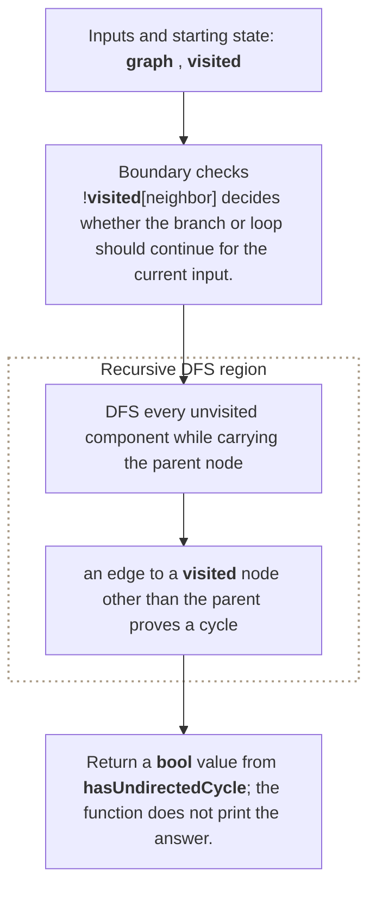

**Where it is used in real life:**

- Network planners detect redundant loops in tree-intended cabling.
- Relationship validators detect whether a hierarchy became cyclic.

```go
// Exact question: Given an undirected adjacency list, return whether any connected component contains a cycle.
//
// Example: Input adjacency 0:[1,2], 1:[0,2], 2:[0,1] -> output true because 0-1-2-0 is a cycle.
//
// Possible answer: DFS every unvisited component while carrying the parent node; an edge to a visited node other than the parent proves a cycle.
//
// Output format: Return a `bool` value from `hasUndirectedCycle`; the function does not print the answer.
//
// Inline descriptions:
// - `graph` is a two-dimensional slice: row and column indexes identify positions, and each cell stores a value.
//
// Boundary checks:
// - `!visited[neighbor]` decides whether the branch or loop should continue for the current input.
// - `dfs(neighbor, node)` decides whether the branch or loop should continue for the current input.
// - `neighbor != parent` decides whether the branch or loop should continue for the current input.
//
// Key variables:
// - `graph` is a two-dimensional slice: row and column indexes identify positions, and each cell stores a value.
// - `visited` is indexed by item or node and stores whether that item has been seen.
// - `dfs(node, parent)` explores one component while excluding the undirected edge back to the parent.
//
// Logic:
// 1. Create or use a slice so indexes identify positions and elements store their data or state.
// 2. Iterate through the required elements or states in the order shown.
// 3. Return the value produced after the state updates are complete.
func hasUndirectedCycle(graph [][]int) bool {
	visited := make([]bool, len(graph))

	var dfs func(node, parent int) bool
	dfs = func(node, parent int) bool {
		visited[node] = true

		for _, neighbor := range graph[node] {
			if !visited[neighbor] {
				if dfs(neighbor, node) {
					return true
				}
				continue
			}

			if neighbor != parent {
				return true
			}
		}

		return false
	}

	for node := range graph {
		if !visited[node] && dfs(node, -1) {
			return true
		}
	}

	return false
}

// time complexity: O(V + E) -> each reachable vertex is processed once and each edge is examined once.
// space complexity: O(V) -> the visited state, queue, stack, or result can hold one entry per vertex.
```

> **Baby analogy:** Imagine a playground map with children as dots and paths as lines. "Detect a Cycle in an Undirected Graph" is one small game played with the same pieces and rules.

### Count Connected Components

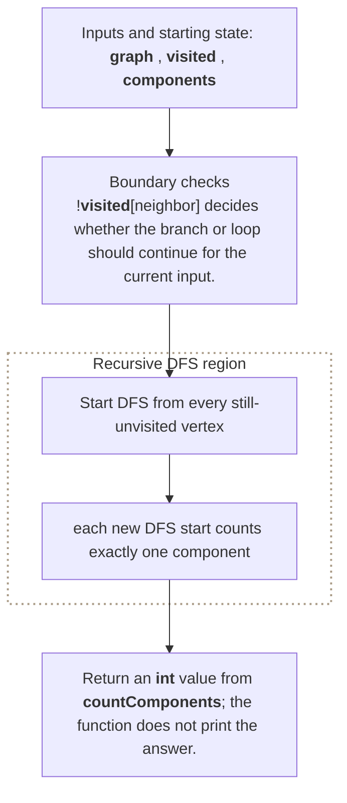

**Where it is used in real life:**

- Infrastructure tools count isolated network clusters.
- Identity systems group accounts connected by shared relationships.

```go
// Exact question: Given an undirected adjacency list, return the number of disconnected connected components.
//
// Example: Input adjacency 0:[1], 1:[0,2], 2:[1], 3:[4], 4:[3] -> output 2 components.
//
// Possible answer: Start DFS from every still-unvisited vertex; each new DFS start counts exactly one component.
//
// Output format: Return an `int` value from `countComponents`; the function does not print the answer.
//
// Inline descriptions:
// - `graph` is a two-dimensional slice: row and column indexes identify positions, and each cell stores a value.
//
// Boundary checks:
// - `!visited[neighbor]` decides whether the branch or loop should continue for the current input.
// - `visited[node]` decides whether the branch or loop should continue for the current input.
//
// Key variables:
// - `graph` is a two-dimensional slice: row and column indexes identify positions, and each cell stores a value.
// - `visited` is indexed by item or node and stores whether that item has been seen.
// - `dfs(node)` marks every vertex reachable inside the current component.
// - `components` counts DFS roots started from vertices not reached by earlier traversals.
//
// Logic:
// 1. Create or use a slice so indexes identify positions and elements store their data or state.
// 2. Iterate through the required elements or states in the order shown.
// 3. Return the value produced after the state updates are complete.
func countComponents(graph [][]int) int {
	visited := make([]bool, len(graph))
	components := 0

	var dfs func(int)
	dfs = func(node int) {
		visited[node] = true

		for _, neighbor := range graph[node] {
			if !visited[neighbor] {
				dfs(neighbor)
			}
		}
	}

	for node := range graph {
		if visited[node] {
			continue
		}

		components++
		dfs(node)
	}

	return components
}

// time complexity: O(V + E) -> each reachable vertex is processed once and each edge is examined once.
// space complexity: O(V) -> the visited state, queue, stack, or result can hold one entry per vertex.
```

> **Baby analogy:** Imagine a playground map with children as dots and paths as lines. "Count Connected Components" is one small game played with the same pieces and rules.

### Redundant Connection

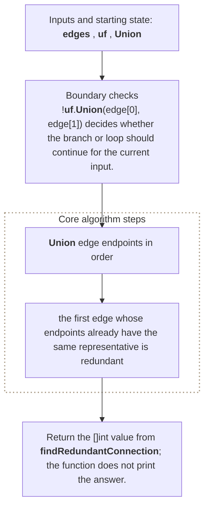

**Where it is used in real life:**

- Network provisioning finds the link that created a cycle.
- Topology repair removes one excess connection from a tree.

```go
// Exact question: Given edges that formed a tree plus one extra undirected edge, return the edge whose removal restores a tree.
//
// Example: Input edges = [[1, 2], [1, 3], [2, 3]] -> output [2, 3].
//
// Possible answer: Union edge endpoints in order; the first edge whose endpoints already have the same representative is redundant.
//
// Output format: Return the `[]int` value from `findRedundantConnection`; the function does not print the answer.
//
// Inline descriptions:
// - `edges` is a two-dimensional slice: row and column indexes identify positions, and each cell stores a value.
//
// Boundary checks:
// - `!uf.Union(edge[0], edge[1])` decides whether the branch or loop should continue for the current input.
//
// Key variables:
// - `edges` is a two-dimensional slice: row and column indexes identify positions, and each cell stores a value.
// - `uf` stores parent and rank values indexed by node label; `Union` returns false when an edge closes a cycle.
//
// Logic:
// 1. Create or use a slice so indexes identify positions and elements store their data or state.
// 2. Iterate through the required elements or states in the order shown.
// 3. Return the value produced after the state updates are complete.
type UnionFind struct {
	parent []int
	rank   []int
}

func NewUnionFind(size int) *UnionFind {
	parent := make([]int, size)
	rank := make([]int, size)
	for node := range parent {
		parent[node] = node
	}
	return &UnionFind{parent: parent, rank: rank}
}

func (uf *UnionFind) Find(node int) int {
	if uf.parent[node] != node {
		uf.parent[node] = uf.Find(uf.parent[node])
	}
	return uf.parent[node]
}

func (uf *UnionFind) Union(a, b int) bool {
	rootA := uf.Find(a)
	rootB := uf.Find(b)
	if rootA == rootB {
		return false
	}
	if uf.rank[rootA] < uf.rank[rootB] {
		rootA, rootB = rootB, rootA
	}
	uf.parent[rootB] = rootA
	if uf.rank[rootA] == uf.rank[rootB] {
		uf.rank[rootA]++
	}
	return true
}

func findRedundantConnection(edges [][]int) []int {
	uf := NewUnionFind(len(edges) + 1)

	for _, edge := range edges {
		if !uf.Union(edge[0], edge[1]) {
			return edge
		}
	}

	return nil
}

// time complexity: O(n * α(n)) -> `n` edges perform near-constant amortized Union-Find operations with path compression and union by rank.
// space complexity: O(n) -> parent and rank slices store one entry for every possible node label.
```

> **Baby analogy:** Imagine a playground map with children as dots and paths as lines. "Redundant Connection" is one small game played with the same pieces and rules.

### Dijkstra Shortest Paths

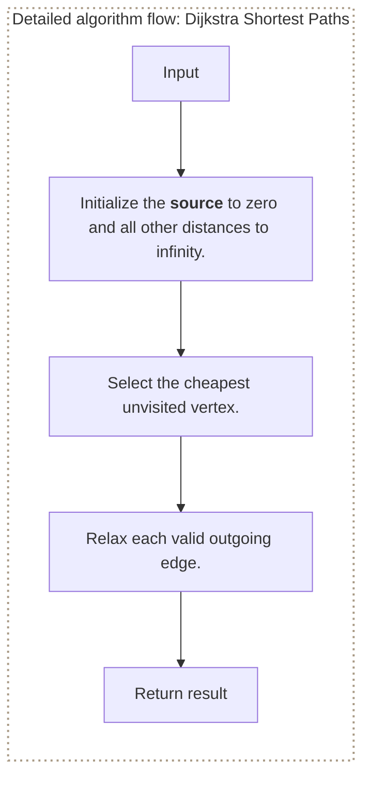

**Where it is used in real life:**

- Road routing finds lowest-cost travel paths.
- Network control planes find minimum-latency routes.

```go
// Exact question: How can Dijkstra compute shortest paths without a heap in a compact teaching example?
//
// Example: Input edges 0->1 cost 4, 0->2 cost 1, and 2->1 cost 2 -> distances from 0 are [0, 3, 1].
//
// Possible answer: Repeatedly select the unvisited vertex with the smallest known distance and relax its outgoing edges.
//
// Output format: Return shortest distances from `source`, or nil for an invalid matrix or negative weight.
//
// Inline descriptions:
// - `weights` row and column indexes are endpoint vertices and elements are edge weights; `distance` indexes are vertices and elements are best-known costs.
//
// Boundary checks:
// - Require a square matrix, valid source, non-negative edges, and use `-1` to represent no edge.
//
// Key variables:
// - `visited` indexes are vertices and values are finalized state; `next` is the cheapest unfinished vertex.
//
// Logic:
// 1. Initialize the source to zero and all other distances to infinity.
// 2. Select the cheapest unvisited vertex.
// 3. Relax each valid outgoing edge.
func dijkstraMatrix(weights [][]int, source int) []int {
	n := len(weights)
	if source < 0 || source >= n {
		return nil
	}
	for _, row := range weights {
		if len(row) != n {
			return nil
		}
	}
	infinity := int(^uint(0) >> 1)
	distance := make([]int, n)
	visited := make([]bool, n)
	for vertex := range distance {
		distance[vertex] = infinity
	}
	distance[source] = 0
	for range n {
		next := -1
		for vertex := 0; vertex < n; vertex++ {
			if !visited[vertex] && (next == -1 || distance[vertex] < distance[next]) {
				next = vertex
			}
		}
		if next == -1 || distance[next] == infinity {
			break
		}
		visited[next] = true
		for neighbor, weight := range weights[next] {
			if weight < -1 {
				return nil
			}
			if weight >= 0 && distance[next]+weight < distance[neighbor] {
				distance[neighbor] = distance[next] + weight
			}
		}
	}
	return distance
}

// time complexity: O(V²) -> linear vertex selection is repeated for every vertex in this heap-free teaching version.
// space complexity: O(V) -> distance and visited slices store one state per vertex.
```

> **Baby analogy:** Imagine a playground map with children as dots and paths as lines. "Dijkstra Shortest Paths" is one small game played with the same pieces and rules.

### Pacific Atlantic Water Flow

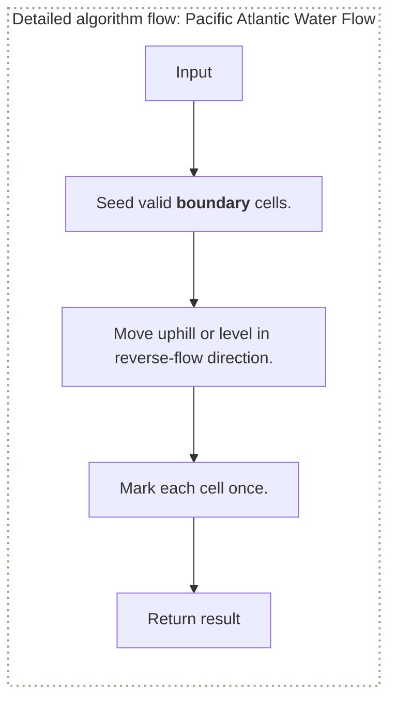

**Where it is used in real life:**

- Terrain analysis finds cells draining to selected boundaries.
- Dependency propagation finds states reachable from multiple targets.

```go
// Exact question: How can reverse traversal mark cells that can flow to an ocean boundary?
//
// Example: Input heights = [[1, 1], [1, 1]] -> every coordinate can reach both ocean boundaries.
//
// Possible answer: Start from ocean cells and move to neighbors whose heights are at least the current height.
//
// Output format: Return a boolean grid marking cells reachable from the supplied boundary cells.
//
// Inline descriptions:
// - `heights` row and column indexes are cells and elements are elevations; `boundary` elements are `[row,column]` starts.
// - `reachable` uses matching cell indexes and boolean elements for reverse-flow state.
//
// Boundary checks:
// - Empty or ragged grids return nil, and invalid boundary coordinates are ignored.
//
// Key variables:
// - `queue` indexes are FIFO positions and elements are cell coordinates awaiting expansion.
//
// Logic:
// 1. Seed valid boundary cells.
// 2. Move uphill or level in reverse-flow direction.
// 3. Mark each cell once.
func oceanReachable(heights [][]int, boundary [][2]int) [][]bool {
	if len(heights) == 0 || len(heights[0]) == 0 {
		return nil
	}
	columns := len(heights[0])
	reachable := make([][]bool, len(heights))
	for row := range heights {
		if len(heights[row]) != columns {
			return nil
		}
		reachable[row] = make([]bool, columns)
	}
	queue := [][2]int{}
	for _, cell := range boundary {
		row, column := cell[0], cell[1]
		if row >= 0 && row < len(heights) && column >= 0 && column < columns && !reachable[row][column] {
			reachable[row][column] = true
			queue = append(queue, cell)
		}
	}
	directions := [][2]int{{1, 0}, {-1, 0}, {0, 1}, {0, -1}}
	for front := 0; front < len(queue); front++ {
		cell := queue[front]
		for _, direction := range directions {
			nextRow, nextColumn := cell[0]+direction[0], cell[1]+direction[1]
			if nextRow >= 0 && nextRow < len(heights) && nextColumn >= 0 && nextColumn < columns && !reachable[nextRow][nextColumn] && heights[nextRow][nextColumn] >= heights[cell[0]][cell[1]] {
				reachable[nextRow][nextColumn] = true
				queue = append(queue, [2]int{nextRow, nextColumn})
			}
		}
	}
	return reachable
}

// time complexity: O(r * c) -> every grid cell is enqueued at most once.
// space complexity: O(r * c) -> reachability and queue state can cover the whole grid.
```

> **Baby analogy:** Imagine a playground map with children as dots and paths as lines. "Pacific Atlantic Water Flow" is one small game played with the same pieces and rules.

### Evaluate Division

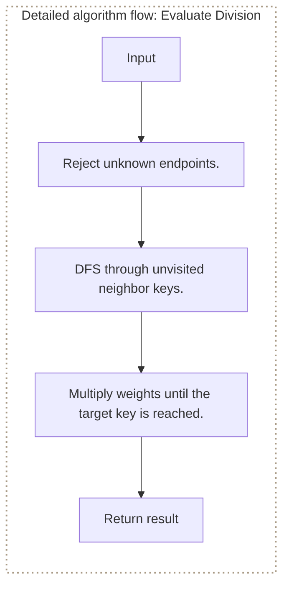

**Where it is used in real life:**

- Currency conversion composes exchange ratios across currencies.
- Unit-conversion systems derive indirect conversion factors.

```go
// Exact question: How can a weighted graph evaluate a division path such as `a / c`?
//
// Example: Input a/b = 2 and b/c = 3; query a/c -> output 6.
//
// Possible answer: Multiply edge weights while DFS follows variable keys from numerator to denominator.
//
// Output format: Return `(ratio, true)` when a path exists or `(0, false)` otherwise.
//
// Inline descriptions:
// - `graph` outer map keys are variables and values are neighbor maps; inner keys are adjacent variables and inner values are division ratios.
// - `visited` map keys are variables and boolean values prevent repeated DFS state.
//
// Boundary checks:
// - Missing variables fail, and reaching the target returns the accumulated ratio.
//
// Key variables:
// - `product` is the ratio accumulated along the current path.
//
// Logic:
// 1. Reject unknown endpoints.
// 2. DFS through unvisited neighbor keys.
// 3. Multiply weights until the target key is reached.
func evaluateRatio(graph map[string]map[string]float64, from, to string) (float64, bool) {
	if _, exists := graph[from]; !exists {
		return 0, false
	}
	visited := make(map[string]bool)
	var search func(string, float64) (float64, bool)
	search = func(current string, product float64) (float64, bool) {
		if current == to {
			return product, true
		}
		visited[current] = true
		for neighbor, ratio := range graph[current] {
			if !visited[neighbor] {
				if result, found := search(neighbor, product*ratio); found {
					return result, true
				}
			}
		}
		return 0, false
	}
	return search(from, 1)
}

// time complexity: O(V + E) -> DFS may inspect every variable and weighted edge.
// space complexity: O(V) -> visited state and recursion can contain every variable.
```

> **Baby analogy:** Imagine a playground map with children as dots and paths as lines. "Evaluate Division" is one small game played with the same pieces and rules.

### Shortest Distances in an Unweighted Graph

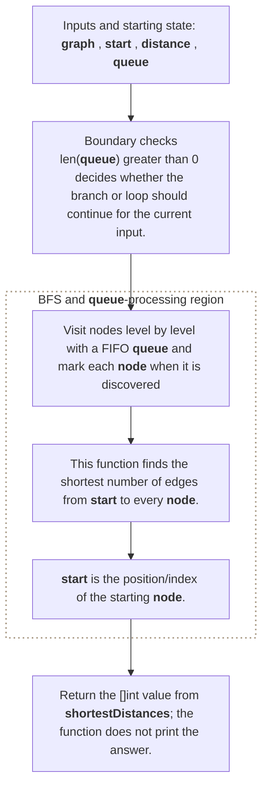

**Where it is used in real life:**

- Social networks compute degrees of separation.
- Service maps measure minimum hop counts.

```go
// Exact question: Given an unweighted adjacency list and a source vertex, return the minimum edge distance from the source to every vertex, using `-1` for unreachable vertices.
//
// Example: Input adjacency 0:[1], 1:[0,2], 2:[1], 3:[] and source = 0 -> output [0, 1, 2, -1].
//
// Possible answer: Visit nodes level by level with a FIFO queue and mark each node when it is discovered.
//
// Output format: Return the `[]int` value from `shortestDistances`; the function does not print the answer.
//
// Inline descriptions:
// - `graph` is a two-dimensional slice: row and column indexes identify positions, and each cell stores a value.
// - `start` is the int input used by this example.
//
// Boundary checks:
// - `len(queue) > 0` decides whether the branch or loop should continue for the current input.
// - `distance[neighbor] != -1` decides whether the branch or loop should continue for the current input.
//
// Key variables:
// - `graph` is a two-dimensional slice: row and column indexes identify positions, and each cell stores a value.
// - `start` is the int input used by this example.
// - `distance` is indexed by a state and stores the computed answer for that state.
// - `queue` is a slice whose elements hold the ordered values produced or awaiting processing.
// - `node` is the vertex removed from the queue; `distance[node]` is already its minimum source distance.
//
// Logic:
// 1. Create or use a slice so indexes identify positions and elements store their data or state.
// 2. Iterate through the required elements or states in the order shown.
// 3. Recursively reduce the current problem to smaller calls until a base condition is reached.
// This function finds the shortest number of edges from start to every node.
// start is the position/index of the starting node.
/* Input, eg:
 * graph := [][]int{
	{1, 2}, // 0 connects to 1 and 2
	{3},    // 1 connects to 3
	{3},    // 2 connects to 3
	{4},    // 3 connects to 4
	{},     // 4
 }
 */
 // returns -> [0 1 1 2 3]
 // distance from 0 to 0 = 0 edges
 // distance from 0 to 1 = 1 edge
 // distance from 0 to 2 = 1 edge
 // distance from 0 to 3 = 2 edges
 // distance from 0 to 4 = 3 edges
func shortestDistances(graph [][]int, start int) []int {
	// Creates a distance array filled with zeroes: initial value -> [0 0 0 0 0]
	distance := make([]int, len(graph))
	// [Boundary check] - But zero is a valid distance for the starting node, so it cannot represent “not visited.”
	// new value -> [-1 -1 -1 -1 -1] -> "We have not reached this node."
	// If the start position passed is 1 then also distance -> [-1 -1 -1 -1 -1]
	// Just initialize the distance array
	for i := range distance {
		distance[i] = -1
	}

	// Start the BFS
	// The starting node is placed in the queue and has distance 0. [Boundary check]
	// For start = 0:
	// queue    = [0]
	// distance = [0 -1 -1 -1 -1]
	// queue -> nodes index waiting to be processed
	queue := []int{start}
	distance[start] = 0

	// Take the first node from the queue. This gives BFS its FIFO behavior.
	// When the queue becomes empty: the loop stops.
	for len(queue) > 0 {
		// queue = nodes waiting to be processed
		// node  = the one node currently being processed
		node := queue[0] // Take the first node from the queue. Initially queue = [0], node  = 0
		queue = queue[1:] // Remove that first node logically: queue = []

		// graph[node] -> gives the neighbors of the current node.
		for _, neighbor := range graph[node] {
			// If a neighbor already has a distance, it has already been discovered. cyclic dependencies check
			if distance[neighbor] != -1 {
				continue
			}
			// Calculate the distance -> The neighbor is one edge farther than the current node.
			// distance[0] = 0
			// distance[1] = distance[0] + 1 = 1
			// distance[2] = distance[0] + 1 = 1
			// distance = [0 1 1 -1 -1]
			distance[neighbor] = distance[node] + 1
			// Add the neighbor to the queue
			// The newly discovered neighbor is added to the back of the queue:
			// queue = [1, 2]
			queue = append(queue, neighbor)
		}
	}

	return distance
}

// time complexity: O(V + E) -> each reachable vertex is processed once and each edge is examined once.
// space complexity: O(V) -> the visited state, queue, stack, or result can hold one entry per vertex.
```

> **Baby analogy:** Imagine a playground map with children as dots and paths as lines. "Shortest Distances in an Unweighted Graph" is one small game played with the same pieces and rules.

---

## Interview checklist and next steps

Use this answer order during an interview:

1. Restate the input, output, and constraints.
2. Name the pattern and the invariant.
3. Explain the data structure roles before coding.
4. Handle boundary cases explicitly.
5. Walk through a small example.
6. Give time and space complexity with variable definitions.

Recommended practice order:
1. [Number of Islands](#number-of-islands)
2. [Clone Graph](#clone-graph)
3. [Course Schedule](#course-schedule)
4. [Detect a Cycle in an Undirected Graph](#detect-a-cycle-in-an-undirected-graph)
5. [Count Connected Components](#count-connected-components)
6. [Redundant Connection](#redundant-connection)
7. [Dijkstra Shortest Paths](#dijkstra-shortest-paths)
8. [Pacific Atlantic Water Flow](#pacific-atlantic-water-flow)
9. [Evaluate Division](#evaluate-division)
10. [Shortest Distances in an Unweighted Graph](#shortest-distances-in-an-unweighted-graph)

Continue with: Course Schedule II, Word Ladder, Network Delay Time, Alien Dictionary, Minimum Spanning Tree.

```mermaid
flowchart LR
    Q0["Number of Islands"]
    Q0 --> Q1["Clone Graph"]
    Q1 --> Q2["Course Schedule"]
    Q2 --> Q3["Detect a Cycle in an Undirected Graph"]
    Q3 --> Q4["Count Connected Components"]
    Q4 --> Q5["Redundant Connection"]
    Q5 --> Q6["Dijkstra Shortest Paths"]
    Q6 --> Q7["Pacific Atlantic Water Flow"]
    Q7 --> Q8["Evaluate Division"]
    Q8 --> Q9["Shortest Distances in an Unweighted Graph"]
```

> **Baby analogy:** Imagine a playground map with children as dots and paths as lines. Pack the same checklist every time so no important interview step is forgotten.
