# Hash Maps and Hash Sets — A Compact Interview Guide

A hash map turns a key into a bucket location so values can usually be found without scanning every stored item. A hash set stores keys only for membership.

- [Mental model](#mental-model)
- [Representation and core operations](#representation-and-core-operations)
- [Interview patterns and complexity](#interview-patterns-and-complexity)
- [Problem-solving checklist and common mistakes](#problem-solving-checklist-and-common-mistakes)
- [Top 10 Hash Map Interview Questions](#top-10-hash-map-interview-questions)
- [Interview checklist and next steps](#interview-checklist-and-next-steps)

> **Baby analogy:** Imagine a wall of labeled cubbies. The guide shows where every piece belongs before you start moving the pieces.

---

## Mental model

The key identifies an entry, the hash chooses a bucket, and equality finds the exact key inside that bucket. Map values hold associated data; set values are empty state.

| Real system | How the topic appears |
| --- | --- |
| Caches | Keys identify cached objects |
| Databases | Hash indexes map keys to records |
| Compilers | Symbol names map to declarations |
| Monitoring | Labels map to counts or latest values |

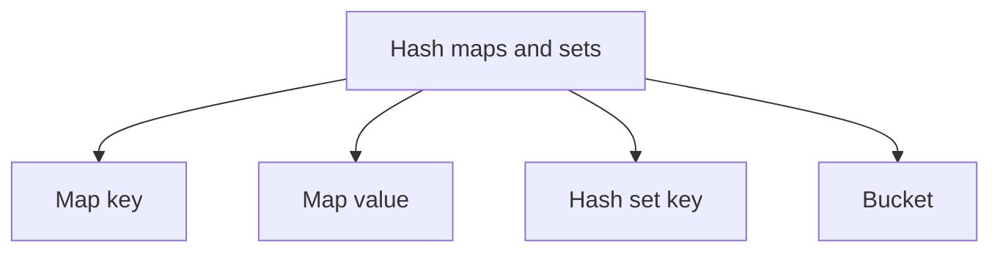

> **Baby analogy:** Imagine a wall of labeled cubbies. The label is the key, the cubby number comes from the hash, and the object inside is the value.

---

## Representation and core operations

Separate the key from the value and state what each map means. Frequency maps, index maps, and prefix-count maps store different values.

| Representation | Role |
| --- | --- |
| Map key | Identity used for hashing and equality |
| Map value | Data associated with the key |
| Hash set key | Member identity |
| Bucket | Entries sharing a hash location |

| Operation | Typical cost | Meaning |
| --- | --- | --- |
| Lookup | Average O(1) | Hash key and inspect a bucket |
| Insert or update | Average O(1) | Write by key |
| Delete | Average O(1) | Remove matching key |
| Iterate | O(n) | Visit every entry |
| Resize | O(n) occasionally | Rehash entries into more buckets |

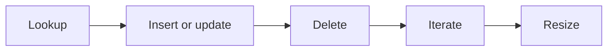

> **Baby analogy:** Imagine a wall of labeled cubbies. A good label sends you near the right cubby immediately; collisions mean checking a few objects in the same cubby.

---

## Interview patterns and complexity

| Question clue | Pattern | Practice problems in this guide |
| --- | --- | --- |
| Existence or duplicate | Hash set | [Contains Duplicate](#contains-duplicate), [Longest Consecutive Sequence](#longest-consecutive-sequence) |
| Count occurrences | Frequency map | [First Unique Character](#first-unique-character), [Build a Frequency Map](#build-a-frequency-map) |
| Find earlier partner | Value-to-index map | [Two Sum](#two-sum) |
| Group equivalent items | Canonical-key map | [Group Anagrams](#group-anagrams) |
| Count range totals | Prefix-sum frequency map | [Subarray Sum Equals K](#subarray-sum-equals-k) |
| Explain implementation behavior | Lookup, collision, and load-factor mechanics | [Safe Map Lookup](#safe-map-lookup-in-go), [Resolve a Hash Collision](#resolve-a-hash-collision), [Calculate Load Factor](#calculate-load-factor) |

| Work | Complexity | Reason |
| --- | --- | --- |
| Expected lookup | O(1) | Good distribution keeps buckets short |
| Worst-case lookup | O(n) | Many keys may collide |
| Storage | O(n) | One entry per distinct key |
| Group output | O(n) plus output | Every item enters a group |

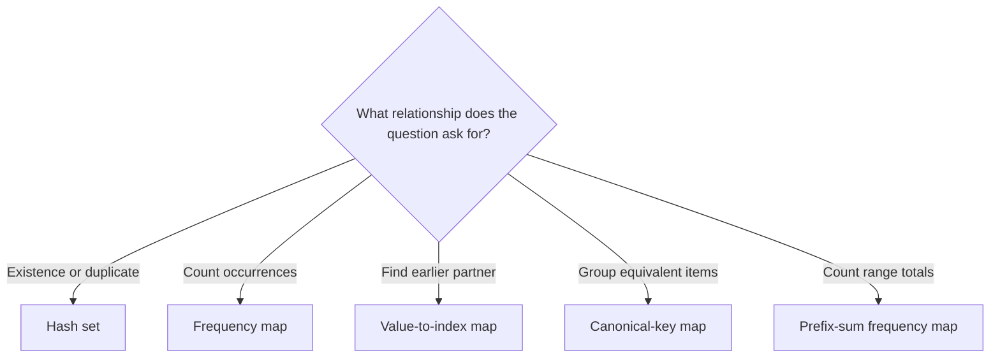

> **Baby analogy:** Imagine a wall of labeled cubbies. Use an empty cubby marker for membership, a counter for frequency, or a note with an earlier index.

---

## Problem-solving checklist and common mistakes

Before coding:

1. State exactly what the indexes, keys, pointers, states, or worklist elements represent.
2. Write the empty-input and smallest-input boundary behavior.
3. Choose the invariant that remains true after every step.
4. Trace one normal example and one edge case.
5. State whether output storage is included in space complexity.

Common mistakes:
- Assuming Go map iteration order is stable.
- Ignoring the comma-ok result for a missing key.
- Inserting the current Two Sum value before checking its complement.
- Forgetting the initial prefix frequency zero maps to one.
- Using a mutable or noncomparable Go value as a key.
- Calling expected O(1) behavior a worst-case guarantee.

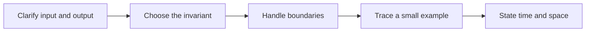

> **Baby analogy:** Imagine a wall of labeled cubbies. Never assume cubbies are visited alphabetically, and always check whether a requested label exists.

---

## Top 10 Hash Map Interview Questions

These are the single authoritative implementations in this guide. Each solution keeps the required question, answer, output, boundary, variable-role, logic, and complexity comments.

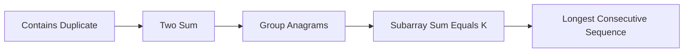

> **Baby analogy:** Imagine a wall of labeled cubbies. These ten puzzles are practice cards; each card teaches one reusable move.

### Contains Duplicate

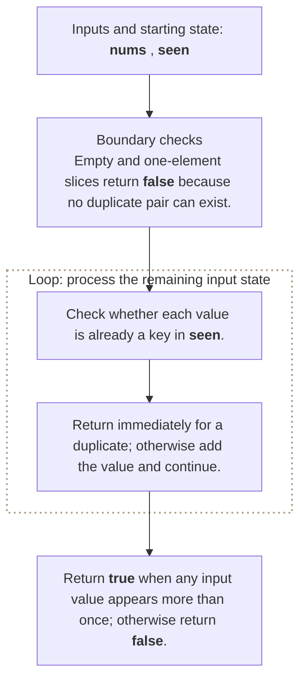

**Where it is used in real life:**

- Ingestion pipelines reject repeated identifiers.
- Reservation systems detect duplicate seat selections.

```go
// Exact question: How can a hash set detect a duplicate without repeatedly scanning earlier elements?
//
// Example: Input nums = [1, 2, 3, 1] -> output true when the second 1 is found in seen.
//
// Possible answer: Record every visited number in a set and stop when a number is already present.
//
// Output format: Return `true` when any input value appears more than once; otherwise return `false`.
//
// Inline descriptions:
// - Each membership lookup replaces a linear search through all previously visited values.
//
// Boundary checks:
// - Empty and one-element slices return `false` because no duplicate pair can exist.
//
// Key variables:
// - `nums` is a slice whose indexes are input positions and whose elements are integer values.
// - `seen` is a set represented by map keys; its empty struct values carry no additional data.
//
// Logic:
// 1. Check whether each value is already a key in `seen`.
// 2. Return immediately for a duplicate; otherwise add the value and continue.
func containsDuplicate(nums []int) bool {
	seen := make(map[int]struct{}, len(nums))
	for _, value := range nums {
		if _, exists := seen[value]; exists {
			return true
		}
		seen[value] = struct{}{}
	}
	return false
}

// time complexity: O(n) -> average-case hashing performs one lookup and at most one insertion for each of the `n` elements.
// space complexity: O(n) -> the set can contain every distinct input value.
```

> **Baby analogy:** Imagine a wall of labeled cubbies. "Contains Duplicate" is one small game played with the same pieces and rules.

### Two Sum

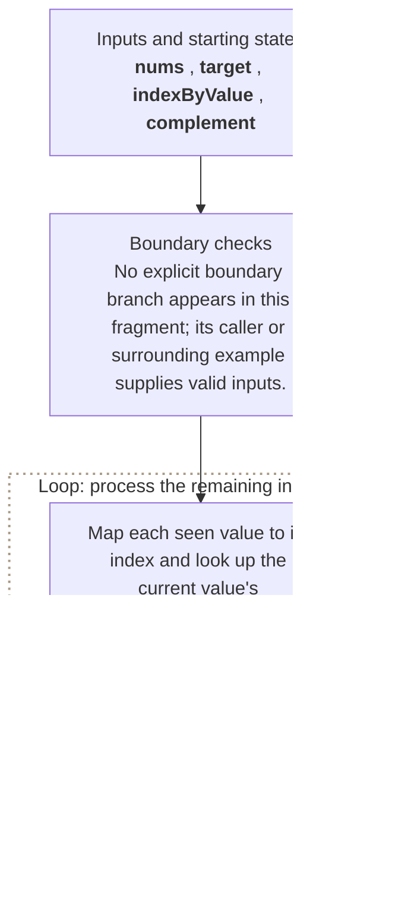

**Where it is used in real life:**

- Finance systems reconcile two transactions to a target.
- Catalog systems pair two prices that fit a budget.

```go
// Exact question: Given an integer slice and a target, return indexes of two distinct values whose sum equals the target, or nil when none exist.
//
// Example: Input nums = [2, 7, 11, 15] and target = 9 -> output [0, 1].
//
// Possible answer: Map each seen value to its index and look up the current value's complement before inserting the current entry.
//
// Output format: Return the `[]int` value from `twoSum`; the function does not print the answer.
//
// Inline descriptions:
// - `nums` is a slice: the index identifies an element or state, and the stored item has type int.
// - `target` is the int input used by this example.
//
// Boundary checks:
// - No explicit boundary branch appears in this fragment; its caller or surrounding example supplies valid inputs.
//
// Key variables:
// - `nums` is a slice: the index identifies an element or state, and the stored item has type int.
// - `target` is the int input used by this example.
// - `indexByValue` maps each previously seen number key to its earlier input index.
// - `complement` holds the intermediate value produced by `target - number`.
//
// Logic:
// 1. Create or use a map to associate each lookup key with its stored value.
// 2. Create or use a slice so indexes identify positions and elements store their data or state.
// 3. Iterate through the required elements or states in the order shown.
func twoSum(nums []int, target int) []int {
    indexByValue := make(map[int]int, len(nums))

    for index, number := range nums {
        complement := target - number

        if previousIndex, exists := indexByValue[complement]; exists {
            return []int{previousIndex, index}
        }

        indexByValue[number] = index
    }

    return nil
}

// time complexity: O(n) -> the algorithm visits each of the `n` input elements or states once.
// space complexity: O(n) -> the auxiliary slice, map, table, queue, or returned collection can grow with `n`.
```

> **Baby analogy:** Imagine a wall of labeled cubbies. "Two Sum" is one small game played with the same pieces and rules.

### Group Anagrams

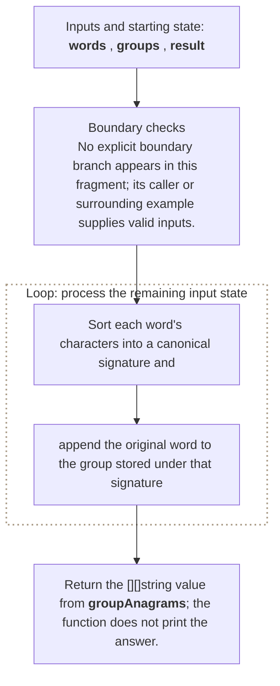

**Where it is used in real life:**

- Search systems group terms with the same letter signature.
- Word games cluster rearrangements of the same letters.

```go
// Exact question: Given a string slice, group strings that contain the same characters with the same multiplicities.
//
// Example: Input words = [eat, tea, tan, ate, nat, bat] -> groups [eat, tea, ate], [tan, nat], and [bat], in any group order.
//
// Possible answer: Sort each word's characters into a canonical signature and append the original word to the group stored under that signature.
//
// Output format: Return the `[][]string` value from `groupAnagrams`; the function does not print the answer.
//
// Inline descriptions:
// - `words` is a slice: the index identifies an element or state, and the stored item has type string.
//
// Boundary checks:
// - No explicit boundary branch appears in this fragment; its caller or surrounding example supplies valid inputs.
//
// Key variables:
// - `words` is a slice: the index identifies an element or state, and the stored item has type string.
// - `groups` maps each comparable `[26]int` frequency-signature key to its anagram word slice.
// - `result` contains the grouped word slices; group order is unspecified because map iteration is unordered.
// - `signature[letter-'a']` stores the current word's count for one lowercase English letter.
//
// Logic:
// 1. Create or use a map to associate each lookup key with its stored value.
// 2. Create or use a slice so indexes identify positions and elements store their data or state.
// 3. Iterate through the required elements or states in the order shown.
func groupAnagrams(words []string) [][]string {
    groups := make(map[[26]int][]string)

    for _, word := range words {
        var signature [26]int

        for _, character := range word {
            signature[character-'a']++
        }

        groups[signature] = append(groups[signature], word)
    }

    result := make([][]string, 0, len(groups))

    for _, group := range groups {
        result = append(result, group)
    }

    return result
}

// time complexity: O(n * k) -> the algorithm combines work across each dimension or choice represented in the product.
// space complexity: O(n * k) -> the auxiliary slice, map, table, queue, or returned collection can grow with `n`.
```

> **Baby analogy:** Imagine a wall of labeled cubbies. "Group Anagrams" is one small game played with the same pieces and rules.

### Subarray Sum Equals K

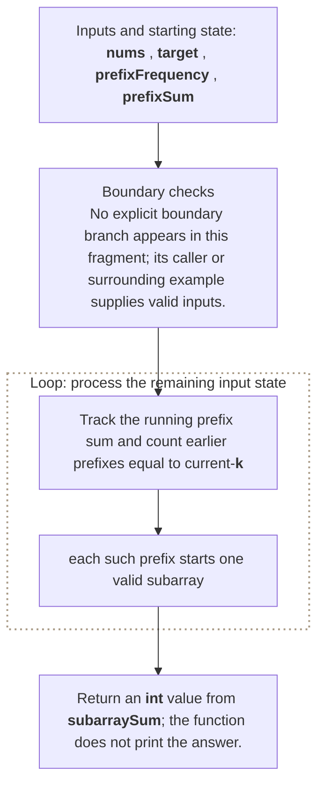

**Where it is used in real life:**

- Metrics systems count intervals with an exact cumulative change.
- Finance tools count contiguous transaction ranges matching a total.

```go
// Exact question: Given an integer slice and `k`, return the number of contiguous subarrays whose values sum to `k`.
//
// Example: Input nums = [1, 1, 1] and k = 2 -> output 2 contiguous subarrays.
//
// Possible answer: Track the running prefix sum and count earlier prefixes equal to `current-k`; each such prefix starts one valid subarray.
//
// Output format: Return an `int` value from `subarraySum`; the function does not print the answer.
//
// Inline descriptions:
// - `nums` is a slice: the index identifies an element or state, and the stored item has type int.
// - `target` is the int input used by this example.
//
// Boundary checks:
// - No explicit boundary branch appears in this fragment; its caller or surrounding example supplies valid inputs.
//
// Key variables:
// - `nums` is a slice: the index identifies an element or state, and the stored item has type int.
// - `target` is the int input used by this example.
// - `prefixFrequency` maps each earlier prefix-sum key to the number of boundaries having that sum.
// - `prefixSum` is the sum from the input start through the current index.
// - `result` holds the answer computed for the current operation.
//
// Logic:
// 1. Create or use a map to associate each lookup key with its stored value.
// 2. Create or use a slice so indexes identify positions and elements store their data or state.
// 3. Iterate through the required elements or states in the order shown.
func subarraySum(nums []int, target int) int {
    prefixFrequency := map[int]int{
        0: 1,
    }

    prefixSum := 0
    result := 0

    for _, number := range nums {
        prefixSum += number

        neededPrefix := prefixSum - target
        result += prefixFrequency[neededPrefix]

        prefixFrequency[prefixSum]++
    }

    return result
}

// time complexity: O(n) -> the algorithm visits each of the `n` input elements or states once.
// space complexity: O(n) -> the auxiliary slice, map, table, queue, or returned collection can grow with `n`.
```

> **Baby analogy:** Imagine a wall of labeled cubbies. "Subarray Sum Equals K" is one small game played with the same pieces and rules.

### Longest Consecutive Sequence

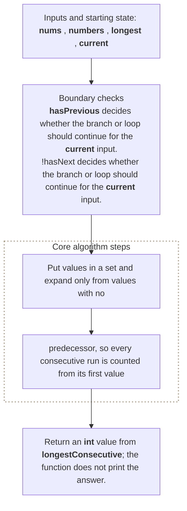

**Where it is used in real life:**

- Event processors find the longest uninterrupted sequence of IDs.
- Inventory tools identify the longest run of consecutive serial numbers.

```go
// Exact question: Given an unsorted integer slice, return the length of the longest run of consecutive values in O(n) expected time.
//
// Example: Input nums = [100, 4, 200, 1, 3, 2] -> output 4 for the run 1, 2, 3, 4.
//
// Possible answer: Put values in a set and expand only from values with no predecessor, so every consecutive run is counted from its first value.
//
// Output format: Return an `int` value from `longestConsecutive`; the function does not print the answer.
//
// Inline descriptions:
// - `nums` is a slice: the index identifies an element or state, and the stored item has type int.
//
// Boundary checks:
// - `hasPrevious` decides whether the branch or loop should continue for the current input.
// - `!hasNext` decides whether the branch or loop should continue for the current input.
// - `length > longest` decides whether the branch or loop should continue for the current input.
//
// Key variables:
// - `nums` is a slice: the index identifies an element or state, and the stored item has type int.
// - `numbers` is a set: integer keys are present values and empty `struct{}` values carry no extra data.
// - `longest` holds the intermediate value produced by `0`.
// - `current` holds the value for the state currently being calculated.
// - `length` holds the intermediate value produced by `1`.
//
// Logic:
// 1. Create or use a map to associate each lookup key with its stored value.
// 2. Create or use a slice so indexes identify positions and elements store their data or state.
// 3. Iterate through the required elements or states in the order shown.
func longestConsecutive(nums []int) int {
    numbers := make(map[int]struct{}, len(nums))

    for _, number := range nums {
        numbers[number] = struct{}{}
    }

    longest := 0

    for number := range numbers {
        _, hasPrevious := numbers[number-1]
        if hasPrevious {
            continue
        }

        current := number
        length := 1

        for {
            _, hasNext := numbers[current+1]
            if !hasNext {
                break
            }

            current++
            length++
        }

        if length > longest {
            longest = length
        }
    }

    return longest
}

// time complexity: O(n) -> the algorithm visits each of the `n` input elements or states once.
// space complexity: O(n) -> the auxiliary slice, map, table, queue, or returned collection can grow with `n`.
```

> **Baby analogy:** Imagine a wall of labeled cubbies. "Longest Consecutive Sequence" is one small game played with the same pieces and rules.

### First Unique Character

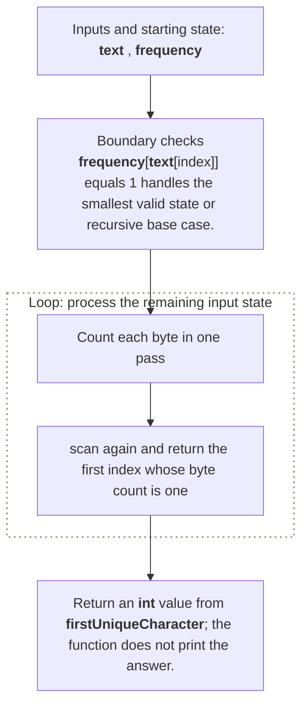

**Where it is used in real life:**

- Stream processors find the first nonrepeated token.
- Data cleanup selects the first identifier occurring exactly once.

```go
// Exact question: Given a string, return the byte index of its first non-repeating character, or `-1` when every character repeats.
//
// Example: Input text = leetcode -> output byte index 0 because l occurs once.
//
// Possible answer: Count each byte in one pass, then scan again and return the first index whose byte count is one.
//
// Output format: Return an `int` value from `firstUniqueCharacter`; the function does not print the answer.
//
// Inline descriptions:
// - `text` is the string input used by this example.
//
// Boundary checks:
// - `frequency[text[index]] == 1` handles the smallest valid state or recursive base case.
//
// Key variables:
// - `text` is the string input used by this example.
// - `frequency` maps each byte key to its total occurrence count in the string.
//
// Logic:
// 1. Create or use a map to associate each lookup key with its stored value.
// 2. Iterate through the required elements or states in the order shown.
// 3. Return the value produced after the state updates are complete.
func firstUniqueCharacter(text string) int {
    frequency := make(map[byte]int)

    for index := 0; index < len(text); index++ {
        frequency[text[index]]++
    }

    for index := 0; index < len(text); index++ {
        if frequency[text[index]] == 1 {
            return index
        }
    }

    return -1
}

// time complexity: O(n) -> the algorithm visits each of the `n` input elements or states once.
// space complexity: O(k) -> the auxiliary storage grows according to this bound.
```

> **Baby analogy:** Imagine a wall of labeled cubbies. "First Unique Character" is one small game played with the same pieces and rules.

### Build a Frequency Map

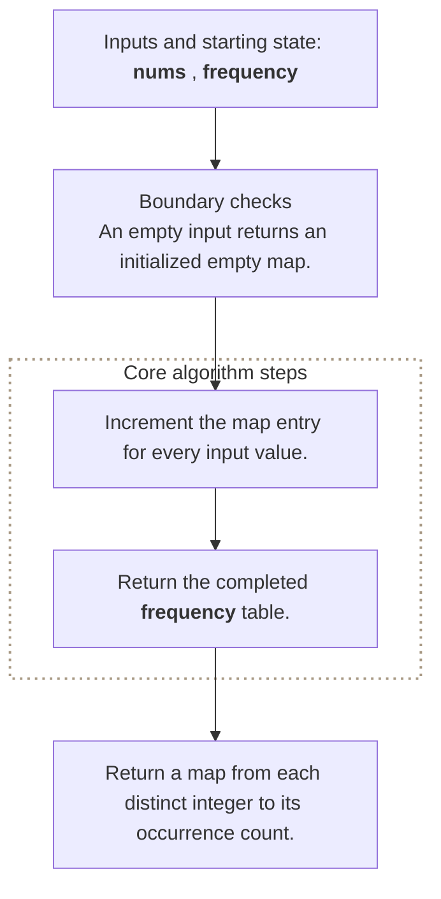

**Where it is used in real life:**

- Analytics counts events by category.
- Search indexing counts term occurrences.

```go
// Exact question: Given an integer slice, how can we build the frequency map used by many common interview problems?
//
// Example: Input nums = [1, 2, 2, 3, 3, 3] -> output map[1:1 2:2 3:3].
//
// Possible answer: Visit each value once and increment the count stored under that value's key.
//
// Output format: Return a map from each distinct integer to its occurrence count.
//
// Inline descriptions:
// - Go returns zero for a missing map key, so the first increment naturally changes it from zero to one.
//
// Boundary checks:
// - An empty input returns an initialized empty map.
//
// Key variables:
// - `nums` is a slice whose indexes are input positions and whose elements are values to count.
// - `frequency` is a map whose keys are distinct input values and whose values are occurrence counts.
//
// Logic:
// 1. Increment the map entry for every input value.
// 2. Return the completed frequency table.
func frequencyMap(nums []int) map[int]int {
	frequency := make(map[int]int, len(nums))
	for _, value := range nums {
		frequency[value]++
	}
	return frequency
}

// time complexity: O(n) -> average-case hashing processes all `n` input elements once.
// space complexity: O(n) -> the map can contain up to `n` distinct keys.
```

> **Baby analogy:** Imagine a wall of labeled cubbies. "Build a Frequency Map" is one small game played with the same pieces and rules.

### Safe Map Lookup in Go

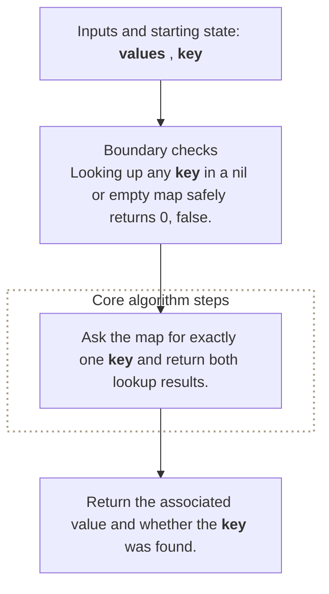

**Where it is used in real life:**

- Configuration loaders distinguish a missing key from a stored zero.
- Feature-flag systems distinguish disabled values from absent definitions.

```go
// Exact question: What operation demonstrates average O(1) hash-map lookup in Go?
//
// Example: Input values = {retries: 0} and key = retries -> output 0, true; a missing key returns 0, false.
//
// Possible answer: Perform one two-value map lookup using the requested key.
//
// Output format: Return the associated value and whether the key was found.
//
// Inline descriptions:
// - The second lookup result distinguishes a missing key from a key mapped to the zero value.
//
// Boundary checks:
// - Looking up any key in a nil or empty map safely returns `0, false`.
//
// Key variables:
// - `values` is a map whose string keys identify records and whose int values hold their data.
// - `key` is the record identifier being queried.
//
// Logic:
// 1. Ask the map for exactly one key and return both lookup results.
func lookupValue(values map[string]int, key string) (int, bool) {
	value, exists := values[key]
	return value, exists
}

// time complexity: O(1) -> average-case hashing selects one short bucket; the collision-heavy worst case is O(n).
// space complexity: O(1) -> the lookup allocates no collection proportional to the map size.
```

> **Baby analogy:** Imagine a wall of labeled cubbies. "Safe Map Lookup in Go" is one small game played with the same pieces and rules.

### Resolve a Hash Collision

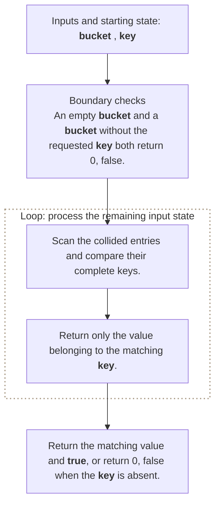

**Where it is used in real life:**

- Hash-table implementations search entries sharing one bucket.
- Storage engines resolve different keys with the same hash location.

```go
// Exact question: How can two different keys be stored safely when they collide in the same bucket?
//
// Example: Input bucket = [{ab, 10}, {ba, 20}] and key = ba -> output 20, true after comparing complete keys.
//
// Possible answer: Keep every colliding key-value entry in the bucket and compare keys during lookup.
//
// Output format: Return the matching value and `true`, or return `0, false` when the key is absent.
//
// Inline descriptions:
// - This example models separate chaining with a slice of entries inside one bucket.
//
// Boundary checks:
// - An empty bucket and a bucket without the requested key both return `0, false`.
//
// Key variables:
// - `bucket` is a slice whose indexes are collision-chain positions and whose elements hold keys and values.
// - `key` is the exact lookup key; equal bucket indexes alone do not prove equal keys.
//
// Logic:
// 1. Scan the collided entries and compare their complete keys.
// 2. Return only the value belonging to the matching key.
type bucketEntry struct {
	key   string
	value int
}

func findInBucket(bucket []bucketEntry, key string) (int, bool) {
	for _, entry := range bucket {
		if entry.key == key {
			return entry.value, true
		}
	}
	return 0, false
}

// time complexity: O(c) -> `c` is the number of colliding entries in this bucket.
// space complexity: O(1) -> the lookup uses no storage that grows with the bucket.
```

> **Baby analogy:** Imagine a wall of labeled cubbies. "Resolve a Hash Collision" is one small game played with the same pieces and rules.

### Calculate Load Factor

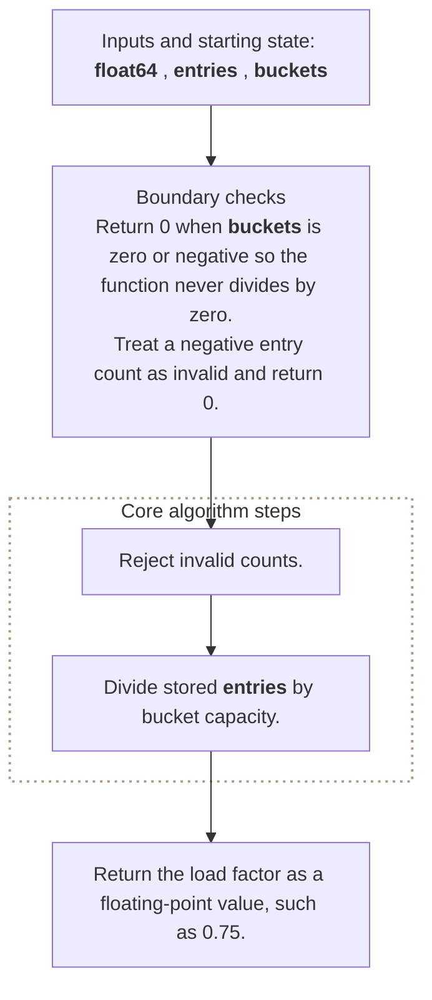

**Where it is used in real life:**

- Hash-table libraries decide when to resize.
- Capacity monitoring predicts collision growth from bucket occupancy.

```go
// Exact question: How do we calculate a hash table's load factor?
//
// Example: Input entries = 6 and buckets = 8 -> output 0.75.
//
// Possible answer: Divide the number of stored entries by the number of available buckets.
//
// Output format: Return the load factor as a floating-point value, such as `0.75`.
//
// Inline descriptions:
// - Converting both integers to `float64` prevents integer division from discarding the fraction.
//
// Boundary checks:
// - Return `0` when `buckets` is zero or negative so the function never divides by zero.
// - Treat a negative entry count as invalid and return `0`.
//
// Key variables:
// - `entries` is the number of key-value pairs currently stored.
// - `buckets` is the number of hash-table locations available.
//
// Logic:
// 1. Reject invalid counts.
// 2. Divide stored entries by bucket capacity.
func loadFactor(entries, buckets int) float64 {
	if entries < 0 || buckets <= 0 {
		return 0
	}
	return float64(entries) / float64(buckets)
}

// time complexity: O(1) -> the calculation performs a fixed number of checks and arithmetic operations.
// space complexity: O(1) -> only scalar parameters and the returned number are used.
```

> **Baby analogy:** Imagine a wall of labeled cubbies. "Calculate Load Factor" is one small game played with the same pieces and rules.

---

## Interview checklist and next steps

Use this answer order during an interview:

1. Restate the input, output, and constraints.
2. Name the pattern and the invariant.
3. Explain the data structure roles before coding.
4. Handle boundary cases explicitly.
5. Walk through a small example.
6. Give time and space complexity with variable definitions.

Recommended practice order:
1. [Contains Duplicate](#contains-duplicate)
2. [Two Sum](#two-sum)
3. [Group Anagrams](#group-anagrams)
4. [Subarray Sum Equals K](#subarray-sum-equals-k)
5. [Longest Consecutive Sequence](#longest-consecutive-sequence)
6. [First Unique Character](#first-unique-character)
7. [Build a Frequency Map](#build-a-frequency-map)
8. [Safe Map Lookup in Go](#safe-map-lookup-in-go)
9. [Resolve a Hash Collision](#resolve-a-hash-collision)
10. [Calculate Load Factor](#calculate-load-factor)

Continue with: Valid Anagram, Isomorphic Strings, Happy Number, LRU Cache, Design HashMap.

```mermaid
flowchart LR
    Q0["Contains Duplicate"]
    Q0 --> Q1["Two Sum"]
    Q1 --> Q2["Group Anagrams"]
    Q2 --> Q3["Subarray Sum Equals K"]
    Q3 --> Q4["Longest Consecutive Sequence"]
    Q4 --> Q5["First Unique Character"]
    Q5 --> Q6["Build a Frequency Map"]
    Q6 --> Q7["Safe Map Lookup in Go"]
    Q7 --> Q8["Resolve a Hash Collision"]
    Q8 --> Q9["Calculate Load Factor"]
```

> **Baby analogy:** Imagine a wall of labeled cubbies. Pack the same checklist every time so no important interview step is forgotten.
