# Heaps and Priority Queues — A Compact Interview Guide

A heap maintains the next minimum or maximum efficiently. A priority queue is the behavior; a heap is the usual implementation.

- [Mental model](#mental-model)
- [Representation and core operations](#representation-and-core-operations)
- [Interview patterns and complexity](#interview-patterns-and-complexity)
- [Problem-solving checklist and common mistakes](#problem-solving-checklist-and-common-mistakes)
- [Top 10 Heap Interview Questions](#top-10-heap-interview-questions)
- [Interview checklist and next steps](#interview-checklist-and-next-steps)

> **Baby analogy:** Imagine a prize line where the most important child is always called next. The guide shows where every piece belongs before you start moving the pieces.

---

## Mental model

A binary heap is a complete tree normally stored in an array. Parent and child indexes preserve shape, while sift operations restore priority order.

| Real system | How the topic appears |
| --- | --- |
| Schedulers | Run the highest-priority ready task |
| Routing | Expand the smallest tentative distance |
| Streaming | Retain top-k values or two median halves |
| Storage | Merge sorted runs efficiently |

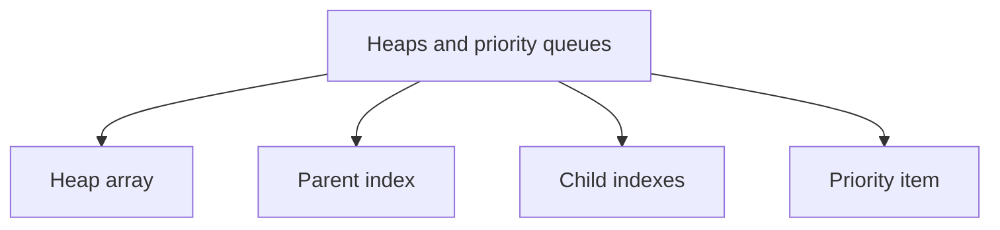

> **Baby analogy:** Imagine a prize line where the most important child is always called next. The line is not fully ordered, but the child at the front always has the winning priority.

---

## Representation and core operations

Heap order is partial, not fully sorted. The root is guaranteed best; arbitrary search still requires a scan.

| Representation | Role |
| --- | --- |
| Heap array | Indexes encode the complete tree |
| Parent index | For child i, usually (i-1)/2 |
| Child indexes | For parent i, usually 2i+1 and 2i+2 |
| Priority item | Value plus priority and optional tie-breaker |

| Operation | Typical cost | Meaning |
| --- | --- | --- |
| Peek root | O(1) | Read current min or max |
| Push | O(log n) | Append and sift upward |
| Pop root | O(log n) | Swap, remove, and sift downward |
| Build heap | O(n) | Bottom-up heapify |
| Search arbitrary value | O(n) | Heap order cannot choose one branch |

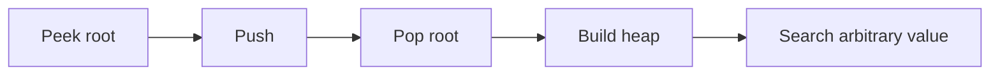

> **Baby analogy:** Imagine a prize line where the most important child is always called next. A new child bubbles toward the front; after the winner leaves, another child bubbles into the correct place.

---

## Interview patterns and complexity

| Question clue | Pattern | Practice problems in this guide |
| --- | --- | --- |
| Repeated next min or max | Heap | [Build a Min Heap](#build-a-min-heap), [Heap Sort](#heap-sort), [Connect Ropes](#minimum-cost-to-connect-ropes) |
| Keep largest k | Min-heap of size k | [Kth Largest Element](#kth-largest-element-in-an-array), [Top K Largest Values](#top-k-largest-values), [Top K Frequent Elements](#top-k-frequent-elements) |
| Merge sorted sources | Heap of current source heads | [Merge K Sorted Lists](#merge-k-sorted-lists) |
| Running median | Two heaps | [Find Median from a Data Stream](#find-median-from-a-data-stream) |
| Schedule earliest available work | Heap ordered by release time | [Meeting Rooms II](#meeting-rooms-ii), [Task Scheduler](#task-scheduler) |

| Work | Complexity | Reason |
| --- | --- | --- |
| Peek | O(1) | Best item is root |
| Push or pop | O(log n) | Move along one tree height |
| Build heap | O(n) | Subtree heights shrink near leaves |
| Heap storage | O(n) | Array stores all items |

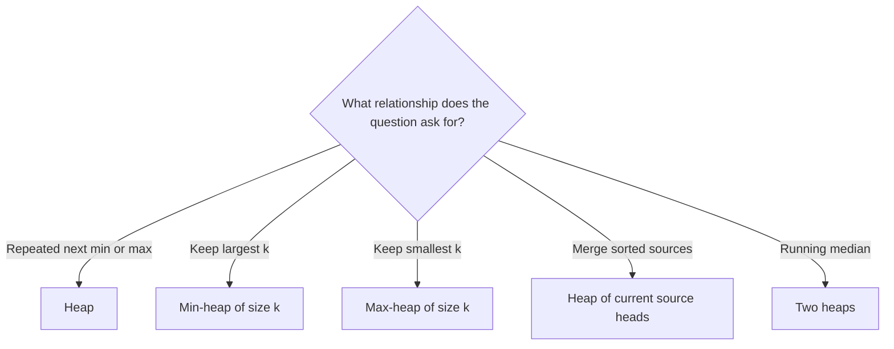

> **Baby analogy:** Imagine a prize line where the most important child is always called next. Repeated best-item requests need a heap; one final sorted list may only need sorting.

---

## Problem-solving checklist and common mistakes

Before coding:

1. State exactly what the indexes, keys, pointers, states, or worklist elements represent.
2. Write the empty-input and smallest-input boundary behavior.
3. Choose the invariant that remains true after every step.
4. Trace one normal example and one edge case.
5. State whether output storage is included in space complexity.

Common mistakes:
- Assuming a heap is fully sorted.
- Using the wrong heap direction for top-k.
- Forgetting container/heap methods use pointer receivers for mutation.
- Ignoring stable tie-breaking when equal priorities matter.
- Forgetting to discard stale priority-queue entries.
- Using a heap when one sort and scan is simpler.

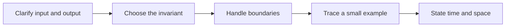

> **Baby analogy:** Imagine a prize line where the most important child is always called next. Do not expect the second child in line to be second-best unless the whole line was sorted.

---

## Top 10 Heap Interview Questions

These are the single authoritative implementations in this guide. Each solution keeps the required question, answer, output, boundary, variable-role, logic, and complexity comments.

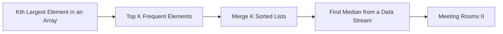

> **Baby analogy:** Imagine a prize line where the most important child is always called next. These ten puzzles are practice cards; each card teaches one reusable move.

### Kth Largest Element in an Array

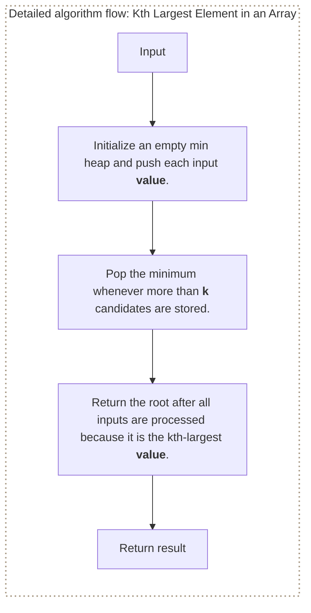

**Where it is used in real life:**

- Analytics retrieves a ranked threshold without fully sorting every update.
- Monitoring keeps the kth highest latency or load value.

```go
// Exact question: How do you find the kth-largest value with a size-`k` min heap in Go?
//
// Example: Input numbers = [3, 2, 1, 5, 6, 4] and k = 2 -> output 5.
//
// Possible answer: Push every input value and pop the minimum whenever the candidate heap grows beyond `k`.
//
// Output format: Return the kth-largest integer; for `[3,2,1,5,6,4]` and `k = 2`, return `5`.
//
// Inline descriptions:
// - `nums` is an input slice: indexes identify input positions and elements are the integer values being ranked.
// - `h` is a min-heap slice: indexes are heap positions and elements are the current Top-K candidate values.
//
// Boundary checks:
// - The function requires `1 <= k <= len(nums)`; `h.Len() > k` trims every extra candidate.
//
// Key variables:
// - `nums` supplies all candidate values, while `k` is both the requested rank and maximum heap size.
// - `number` is the current input value; `h[0]` is the weakest retained candidate and final kth-largest value.
// - `old` is the heap's backing slice, whose indexes are heap positions and whose elements are retained values.
// - `n` is the current heap length before the last element is removed.
// - `value` is the final heap element removed by the custom Pop method.
//
// Logic:
// 1. Initialize an empty min heap and push each input value.
// 2. Pop the minimum whenever more than `k` candidates are stored.
// 3. Return the root after all inputs are processed because it is the kth-largest value.
package main

import "container/heap"

type IntMinHeap []int

func (h IntMinHeap) Len() int           { return len(h) }
func (h IntMinHeap) Less(i, j int) bool { return h[i] < h[j] }
func (h IntMinHeap) Swap(i, j int)      { h[i], h[j] = h[j], h[i] }

func (h *IntMinHeap) Push(value any) {
	*h = append(*h, value.(int))
}

func (h *IntMinHeap) Pop() any {
	old := *h
	n := len(old)

	value := old[n-1]
	*h = old[:n-1]

	return value
}

func findKthLargest(nums []int, k int) int {
	h := &IntMinHeap{}
	heap.Init(h)

	for _, number := range nums {
		heap.Push(h, number)

		if h.Len() > k {
			heap.Pop(h)
		}
	}

	return (*h)[0]
}

// time complexity: O(n log k) -> each of the `n` input values may require a heap push or pop on at most `k` items.
// space complexity: O(k) -> the heap retains at most `k` values.
```

> **Baby analogy:** Imagine a prize line where the most important child is always called next. "Kth Largest Element in an Array" is one small game played with the same pieces and rules.

### Top K Frequent Elements

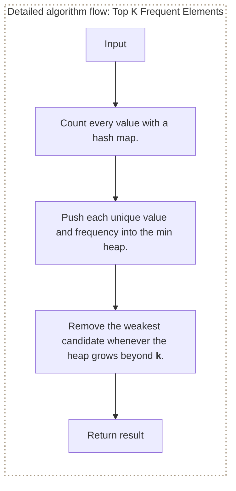

**Where it is used in real life:**

- Search systems surface the most common queries.
- Telemetry systems report the busiest labels.

```go
// Exact question: How do you find the `k` most frequent integers with a heap?
//
// Example: Input numbers = [1, 1, 1, 2, 2, 3] and k = 2 -> output values 1 and 2, in any order.
//
// Possible answer: Count values in a map, then keep a min heap containing the `k` largest frequencies.
//
// Output format: Return up to `k` values; their order in the result is not significant.
//
// Inline descriptions:
// - `counts` maps each input value to its frequency; `frequencyMinHeap` stores candidate value-count pairs.
// - `frequencyMinHeap` is a slice whose indexes are heap positions and whose elements are value-count states.
// - `heap.Init`, `heap.Push`, and `heap.Pop` come from Go's standard `container/heap` package.
//
// Boundary checks:
// - Non-positive `k` returns an empty slice, and `k` above the unique-value count returns every unique value.
//
// Key variables:
// - The heap root has the smallest frequency among the current Top-K candidates.
//
// Logic:
// 1. Count every value with a hash map.
// 2. Push each unique value and frequency into the min heap.
// 3. Remove the weakest candidate whenever the heap grows beyond `k`.
package main

import "container/heap"

type frequencyItem struct {
	value int
	count int
}

type frequencyMinHeap []frequencyItem

func (h frequencyMinHeap) Len() int           { return len(h) }
func (h frequencyMinHeap) Less(i, j int) bool { return h[i].count < h[j].count }
func (h frequencyMinHeap) Swap(i, j int)      { h[i], h[j] = h[j], h[i] }
func (h *frequencyMinHeap) Push(value any)    { *h = append(*h, value.(frequencyItem)) }
func (h *frequencyMinHeap) Pop() any {
	old := *h
	last := len(old) - 1
	value := old[last]
	*h = old[:last]
	return value
}

func topKFrequent(numbers []int, k int) []int {
	if k <= 0 {
		return []int{}
	}
	counts := make(map[int]int)
	for _, number := range numbers {
		counts[number]++
	}
	h := &frequencyMinHeap{}
	heap.Init(h)
	for value, count := range counts {
		heap.Push(h, frequencyItem{value: value, count: count})
		if h.Len() > k {
			heap.Pop(h)
		}
	}
	result := make([]int, 0, h.Len())
	for h.Len() > 0 {
		result = append(result, heap.Pop(h).(frequencyItem).value)
	}
	return result
}

// time complexity: O(n + m log k) -> counting visits `n` values and `m` unique values perform heap work on at most `k` items.
// space complexity: O(m + k) -> the frequency map stores `m` keys and the heap stores at most `k` candidates.
```

> **Baby analogy:** Imagine a prize line where the most important child is always called next. "Top K Frequent Elements" is one small game played with the same pieces and rules.

### Merge K Sorted Lists

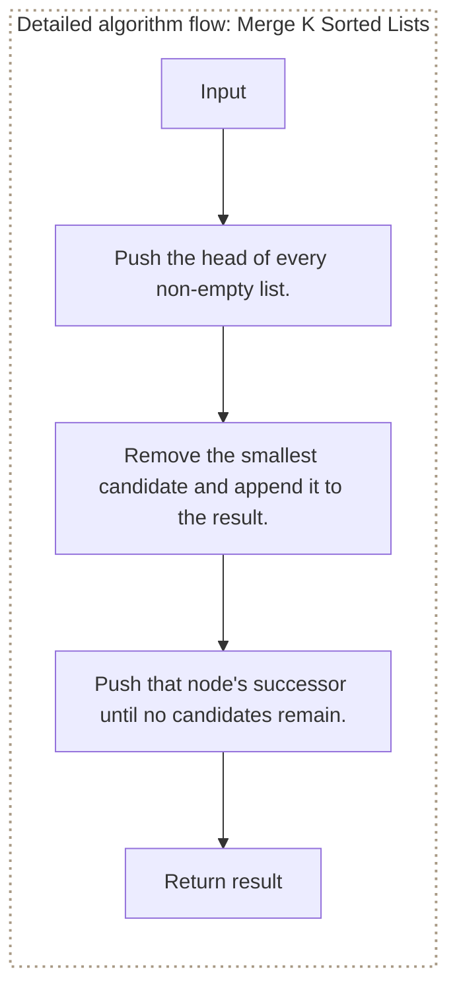

**Where it is used in real life:**

- Storage compaction merges sorted runs.
- Log aggregation merges timestamp-ordered streams.

```go
// Exact question: How do you merge `k` sorted linked lists with a min heap?
//
// Example: Input lists 1->4->5, 1->3->4, and 2->6 -> output 1->1->2->3->4->4->5->6.
//
// Possible answer: Keep one current node from each non-empty list in a heap ordered by node value.
//
// Output format: Return the head of one ascending linked list containing all input nodes.
//
// Inline descriptions:
// - `lists` is a slice whose indexes identify source lists and whose elements are head-node pointers.
// - `nodeMinHeap` is a slice whose indexes are heap positions and whose elements are current unmerged node pointers.
// - Heap operations use Go's standard `container/heap` package.
//
// Boundary checks:
// - Nil list heads are skipped, and an all-empty input returns nil.
//
// Key variables:
// - `tail` is the last node in the merged result; `smallest.Next` supplies the next candidate from its source list.
//
// Logic:
// 1. Push the head of every non-empty list.
// 2. Remove the smallest candidate and append it to the result.
// 3. Push that node's successor until no candidates remain.
package main

import "container/heap"

type ListNode struct {
	Value int
	Next  *ListNode
}

type nodeMinHeap []*ListNode

func (h nodeMinHeap) Len() int           { return len(h) }
func (h nodeMinHeap) Less(i, j int) bool { return h[i].Value < h[j].Value }
func (h nodeMinHeap) Swap(i, j int)      { h[i], h[j] = h[j], h[i] }
func (h *nodeMinHeap) Push(value any)    { *h = append(*h, value.(*ListNode)) }
func (h *nodeMinHeap) Pop() any {
	old := *h
	last := len(old) - 1
	value := old[last]
	*h = old[:last]
	return value
}

func mergeSortedLists(lists []*ListNode) *ListNode {
	h := &nodeMinHeap{}
	heap.Init(h)
	for _, head := range lists {
		if head != nil {
			heap.Push(h, head)
		}
	}
	dummy := &ListNode{}
	tail := dummy
	for h.Len() > 0 {
		smallest := heap.Pop(h).(*ListNode)
		tail.Next = smallest
		tail = smallest
		if smallest.Next != nil {
			heap.Push(h, smallest.Next)
		}
	}
	return dummy.Next
}

// time complexity: O(N log k) -> all `N` nodes are pushed and popped from a heap containing at most `k` list heads.
// space complexity: O(k) -> the candidate heap stores at most one node from each list.
```

> **Baby analogy:** Imagine a prize line where the most important child is always called next. "Merge K Sorted Lists" is one small game played with the same pieces and rules.

### Find Median from a Data Stream

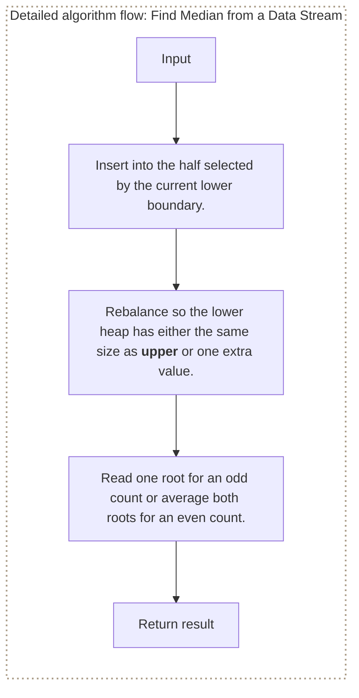

**Where it is used in real life:**

- Dashboards maintain a live median latency.
- Sensor systems track central tendency without retaining sorted order.

```go
// Exact question: How do two heaps maintain the median of a growing integer stream?
//
// Example: Add 1 -> median 1; add 2 -> median 1.5; add 3 -> median 2.
//
// Possible answer: Store the lower half as negated values in a min heap and the upper half in a normal min heap.
//
// Output format: Add records a value; Median returns `(median, true)` or `(0, false)` before any values arrive.
//
// Inline descriptions:
// - `lowerNeg` is a slice whose indexes are heap positions and whose elements are negated lower-half values.
// - `upper` is a slice whose indexes are heap positions and whose elements are normal upper-half values.
//
// Boundary checks:
// - Median checks for an empty stream; this compact negation technique assumes values are not the minimum machine integer.
//
// Key variables:
// - The two roots are the values closest to the boundary between the lower and upper halves.
//
// Logic:
// 1. Insert into the half selected by the current lower boundary.
// 2. Rebalance so the lower heap has either the same size as upper or one extra value.
// 3. Read one root for an odd count or average both roots for an even count.
type MedianFinder struct {
	lowerNeg []int
	upper    []int
}

func pushMinHeap(values []int, value int) []int {
	values = append(values, value)
	child := len(values) - 1
	for child > 0 {
		parent := (child - 1) / 2
		if values[parent] <= values[child] {
			break
		}
		values[parent], values[child] = values[child], values[parent]
		child = parent
	}
	return values
}

func popMinHeap(values []int) ([]int, int, bool) {
	if len(values) == 0 {
		return values, 0, false
	}
	minimum := values[0]
	last := len(values) - 1
	values[0] = values[last]
	values = values[:last]
	parent := 0
	for {
		left := 2*parent + 1
		if left >= len(values) {
			break
		}
		smaller := left
		right := left + 1
		if right < len(values) && values[right] < values[left] {
			smaller = right
		}
		if values[parent] <= values[smaller] {
			break
		}
		values[parent], values[smaller] = values[smaller], values[parent]
		parent = smaller
	}
	return values, minimum, true
}

func (m *MedianFinder) Add(value int) {
	if len(m.lowerNeg) == 0 || value <= -m.lowerNeg[0] {
		m.lowerNeg = pushMinHeap(m.lowerNeg, -value)
	} else {
		m.upper = pushMinHeap(m.upper, value)
	}
	if len(m.lowerNeg) > len(m.upper)+1 {
		var negative int
		m.lowerNeg, negative, _ = popMinHeap(m.lowerNeg)
		m.upper = pushMinHeap(m.upper, -negative)
	} else if len(m.upper) > len(m.lowerNeg) {
		var smallestUpper int
		m.upper, smallestUpper, _ = popMinHeap(m.upper)
		m.lowerNeg = pushMinHeap(m.lowerNeg, -smallestUpper)
	}
}

func (m *MedianFinder) Median() (float64, bool) {
	if len(m.lowerNeg) == 0 {
		return 0, false
	}
	lowerRoot := -m.lowerNeg[0]
	if len(m.lowerNeg) > len(m.upper) {
		return float64(lowerRoot), true
	}
	return (float64(lowerRoot) + float64(m.upper[0])) / 2, true
}

// time complexity: O(log n) -> Add performs a constant number of heap operations; Median itself is O(1).
// space complexity: O(n) -> both heaps together retain all `n` stream values.
```

> **Baby analogy:** Imagine a prize line where the most important child is always called next. "Find Median from a Data Stream" is one small game played with the same pieces and rules.

### Meeting Rooms II

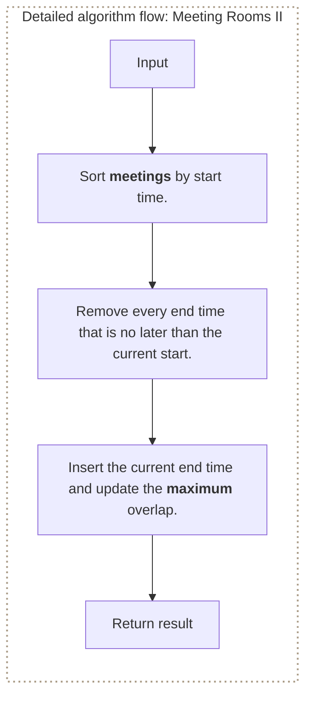

**Where it is used in real life:**

- Calendars compute simultaneous room demand.
- Cluster schedulers estimate peak concurrent resource use.

```go
// Exact question: How do you calculate the maximum number of simultaneously active meetings with a min heap?
//
// Example: Input intervals = [[0, 30], [5, 10], [15, 20]] -> output 2 rooms.
//
// Possible answer: Sort by start time and keep a min heap containing the end times of meetings still running.
//
// Output format: Return the minimum number of rooms required for all intervals.
//
// Inline descriptions:
// - `meetings` is a slice whose indexes identify input intervals and whose elements are `[start, end]` values.
// - `endTimes` is a slice whose indexes are heap positions and whose elements are active meeting end times.
// - `sort.Slice` comes from Go's standard `sort` package.
//
// Boundary checks:
// - Empty input returns zero, and all ended meetings are removed before the current meeting is added.
//
// Key variables:
// - `endTimes[0]` is the earliest active end time; `maximum` records the largest active-heap size.
//
// Logic:
// 1. Sort meetings by start time.
// 2. Remove every end time that is no later than the current start.
// 3. Insert the current end time and update the maximum overlap.
package main

import "sort"

func pushMinHeap(values []int, value int) []int {
	values = append(values, value)
	child := len(values) - 1
	for child > 0 {
		parent := (child - 1) / 2
		if values[parent] <= values[child] {
			break
		}
		values[parent], values[child] = values[child], values[parent]
		child = parent
	}
	return values
}

func popMinHeap(values []int) ([]int, int, bool) {
	if len(values) == 0 {
		return values, 0, false
	}
	minimum := values[0]
	last := len(values) - 1
	values[0] = values[last]
	values = values[:last]
	parent := 0
	for {
		left := 2*parent + 1
		if left >= len(values) {
			break
		}
		smaller := left
		right := left + 1
		if right < len(values) && values[right] < values[left] {
			smaller = right
		}
		if values[parent] <= values[smaller] {
			break
		}
		values[parent], values[smaller] = values[smaller], values[parent]
		parent = smaller
	}
	return values, minimum, true
}

func minimumMeetingRooms(meetings [][2]int) int {
	sort.Slice(meetings, func(i, j int) bool {
		return meetings[i][0] < meetings[j][0]
	})
	endTimes := []int{}
	maximum := 0
	for _, meeting := range meetings {
		for len(endTimes) > 0 && endTimes[0] <= meeting[0] {
			endTimes, _, _ = popMinHeap(endTimes)
		}
		endTimes = pushMinHeap(endTimes, meeting[1])
		if len(endTimes) > maximum {
			maximum = len(endTimes)
		}
	}
	return maximum
}

// time complexity: O(n log n) -> sorting and at most one heap push and pop per meeting dominate the work.
// space complexity: O(n) -> the end-time heap can hold all overlapping meetings.
```

> **Baby analogy:** Imagine a prize line where the most important child is always called next. "Meeting Rooms II" is one small game played with the same pieces and rules.

### Task Scheduler

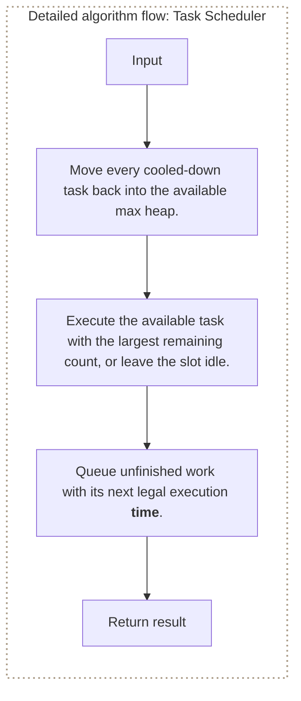

**Where it is used in real life:**

- CPU schedulers enforce cooldowns between repeated task types.
- Rate-limited workers space repeated jobs.

```go
// Exact question: How can a max heap and cooldown queue simulate the task scheduler?
//
// Example: Input tasks = [A, A, A, B, B, B] and cooldown = 2 -> output 8 time slots.
//
// Possible answer: Store remaining task counts as negative min-heap values and queue unfinished tasks until their ready time.
//
// Output format: Return the minimum number of task and idle slots needed to finish the schedule.
//
// Inline descriptions:
// - `counts` maps task letters to remaining occurrences; `availableNeg` stores negated counts for max-priority behavior.
// - `availableNeg` is a slice whose indexes are heap positions and whose elements are negated remaining counts.
// - `waiting` is a slice-backed FIFO queue whose indexes preserve ready-time order and whose elements store cooldown state.
//
// Boundary checks:
// - Empty tasks return zero, and negative cooldown is treated as zero.
//
// Key variables:
// - `time` counts schedule slots; `readyAt` prevents a task from returning before its cooldown expires.
//
// Logic:
// 1. Move every cooled-down task back into the available max heap.
// 2. Execute the available task with the largest remaining count, or leave the slot idle.
// 3. Queue unfinished work with its next legal execution time.
func pushMinHeap(values []int, value int) []int {
	values = append(values, value)
	child := len(values) - 1
	for child > 0 {
		parent := (child - 1) / 2
		if values[parent] <= values[child] {
			break
		}
		values[parent], values[child] = values[child], values[parent]
		child = parent
	}
	return values
}

func popMinHeap(values []int) ([]int, int, bool) {
	if len(values) == 0 {
		return values, 0, false
	}
	minimum := values[0]
	last := len(values) - 1
	values[0] = values[last]
	values = values[:last]
	parent := 0
	for {
		left := 2*parent + 1
		if left >= len(values) {
			break
		}
		smaller := left
		right := left + 1
		if right < len(values) && values[right] < values[left] {
			smaller = right
		}
		if values[parent] <= values[smaller] {
			break
		}
		values[parent], values[smaller] = values[smaller], values[parent]
		parent = smaller
	}
	return values, minimum, true
}

type coolingTask struct {
	remaining int
	readyAt   int
}

func leastTaskIntervals(tasks []byte, cooldown int) int {
	if cooldown < 0 {
		cooldown = 0
	}
	counts := make(map[byte]int)
	for _, task := range tasks {
		counts[task]++
	}
	availableNeg := []int{}
	for _, count := range counts {
		availableNeg = pushMinHeap(availableNeg, -count)
	}
	waiting := []coolingTask{}
	time := 0
	for len(availableNeg) > 0 || len(waiting) > 0 {
		time++
		for len(waiting) > 0 && waiting[0].readyAt <= time {
			availableNeg = pushMinHeap(availableNeg, -waiting[0].remaining)
			waiting = waiting[1:]
		}
		if len(availableNeg) == 0 {
			continue
		}
		var negativeCount int
		availableNeg, negativeCount, _ = popMinHeap(availableNeg)
		remaining := -negativeCount - 1
		if remaining > 0 {
			waiting = append(waiting, coolingTask{remaining: remaining, readyAt: time + cooldown + 1})
		}
	}
	return time
}

// time complexity: O(T log m) -> each of the `T` scheduled slots performs at most constant heap work over `m` task types.
// space complexity: O(m) -> the heap, map, and cooldown queue store state for at most `m` distinct task types.
```

> **Baby analogy:** Imagine a prize line where the most important child is always called next. "Task Scheduler" is one small game played with the same pieces and rules.

### Top K Largest Values

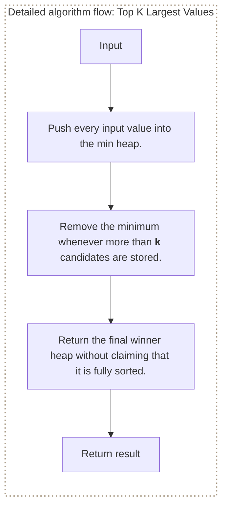

**Where it is used in real life:**

- Leaderboards retain current highest scores.
- Observability systems retain worst outliers.

```go
// Exact question: Given an integer slice and `k`, return the `k` largest values while storing no more than `k` heap candidates.
//
// Example: Input numbers = [3, 2, 1, 5, 6, 4] and k = 2 -> return a two-item min heap containing 5 and 6.
//
// Possible answer: Keep a min heap of at most `k` winners and remove its smallest value whenever it grows too large.
//
// Output format: Return the `k` largest values in heap order, with the kth-largest value at index zero.
//
// Inline descriptions:
// - `numbers` is the input stream; `winners` contains at most `k` retained values.
//
// Boundary checks:
// - Non-positive `k` returns an empty result; `k` larger than the input retains every value.
//
// Key variables:
// - `winners[0]` is the weakest retained winner and therefore the next value discarded.
//
// Logic:
// 1. Push every input value into the min heap.
// 2. Remove the minimum whenever more than `k` candidates are stored.
// 3. Return the final winner heap without claiming that it is fully sorted.
func pushMinHeap(values []int, value int) []int {
	values = append(values, value)
	child := len(values) - 1
	for child > 0 {
		parent := (child - 1) / 2
		if values[parent] <= values[child] {
			break
		}
		values[parent], values[child] = values[child], values[parent]
		child = parent
	}
	return values
}

func popMinHeap(values []int) ([]int, int, bool) {
	if len(values) == 0 {
		return values, 0, false
	}
	minimum := values[0]
	last := len(values) - 1
	values[0] = values[last]
	values = values[:last]
	parent := 0
	for {
		left := 2*parent + 1
		if left >= len(values) {
			break
		}
		smaller := left
		right := left + 1
		if right < len(values) && values[right] < values[left] {
			smaller = right
		}
		if values[parent] <= values[smaller] {
			break
		}
		values[parent], values[smaller] = values[smaller], values[parent]
		parent = smaller
	}
	return values, minimum, true
}

func topKLargest(numbers []int, k int) []int {
	if k <= 0 {
		return []int{}
	}
	winners := make([]int, 0, k)
	for _, number := range numbers {
		winners = pushMinHeap(winners, number)
		if len(winners) > k {
			winners, _, _ = popMinHeap(winners)
		}
	}
	return winners
}

// time complexity: O(n log k) -> each of the `n` values performs heap work on at most `k` winners.
// space complexity: O(k) -> the winner heap never retains more than `k` values.
```

> **Baby analogy:** Imagine a prize line where the most important child is always called next. "Top K Largest Values" is one small game played with the same pieces and rules.

### Build a Min Heap

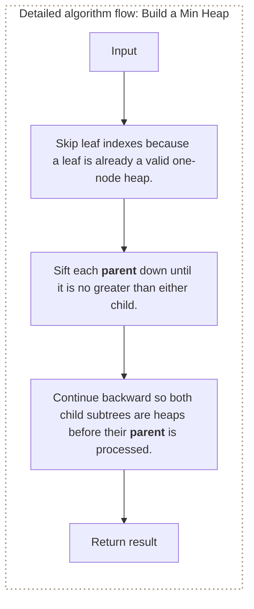

**Where it is used in real life:**

- Priority-queue libraries initialize from a batch efficiently.
- Schedulers load queued work from storage on startup.

```go
// Exact question: How do you build a min heap with bottom-up heapification in Go?
//
// Example: Input values = [5, 3, 8, 1, 2] -> one valid in-place result is [1, 2, 8, 3, 5].
//
// Possible answer: Start at `len(values)/2 - 1` and sift every parent downward in reverse index order.
//
// Output format: Return the supplied slice rearranged into valid min-heap order.
//
// Inline descriptions:
// - `values` is both the unsorted input array and the in-place heap storage.
//
// Boundary checks:
// - Empty and one-item slices have no parent to process and are returned unchanged.
//
// Key variables:
// - `parent` walks from the last non-leaf index to zero; `smaller` chooses the better child.
//
// Logic:
// 1. Skip leaf indexes because a leaf is already a valid one-node heap.
// 2. Sift each parent down until it is no greater than either child.
// 3. Continue backward so both child subtrees are heaps before their parent is processed.
func buildMinHeap(values []int) []int {
	for parent := len(values)/2 - 1; parent >= 0; parent-- {
		siftDownMin(values, parent)
	}
	return values
}

func siftDownMin(values []int, parent int) {
	for {
		left := 2*parent + 1
		if left >= len(values) {
			return
		}
		right, smaller := left+1, left
		if right < len(values) && values[right] < values[left] {
			smaller = right
		}
		if values[parent] <= values[smaller] {
			return
		}
		values[parent], values[smaller] = values[smaller], values[parent]
		parent = smaller
	}
}

// time complexity: O(n) -> most of the `n` nodes start near the leaves and can move only a few levels.
// space complexity: O(1) -> heapification rearranges the input slice using only indexes.
```

> **Baby analogy:** Imagine a prize line where the most important child is always called next. "Build a Min Heap" is one small game played with the same pieces and rules.

### Heap Sort

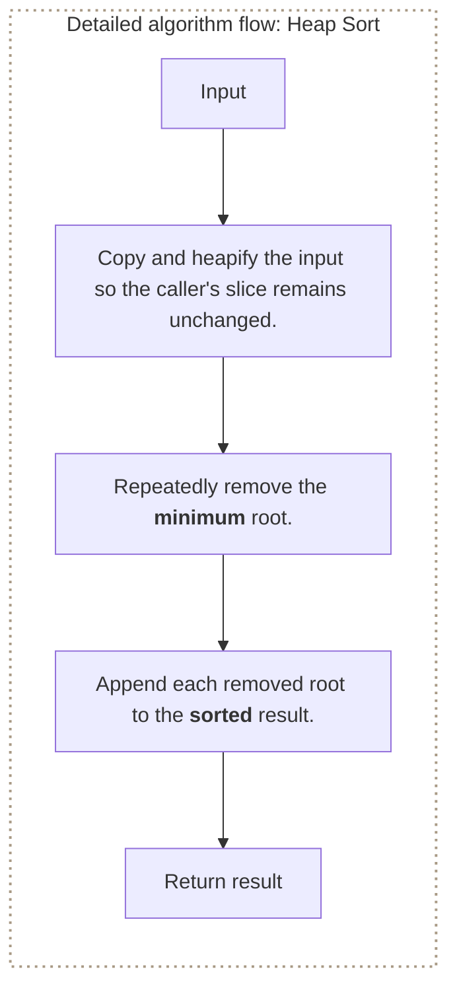

**Where it is used in real life:**

- Embedded systems sort in place with bounded auxiliary memory.
- Selection pipelines repeatedly extract priority order.

```go
// Exact question: Given an integer slice, return a new slice containing all values in ascending order using heap sort.
//
// Example: Input values = [4, 10, 3, 5, 1] -> output [1, 3, 4, 5, 10].
//
// Possible answer: Build a min heap and repeatedly remove its root to produce ascending heap-sort output.
//
// Output format: Return a new slice containing all input values in ascending order.
//
// Inline descriptions:
// - `heapValues` is a slice whose indexes are heap positions and whose elements are priority values.
// - `sorted` is a slice whose indexes are output positions and whose elements are removed minimum values.
// - `buildMinHeap` and `popMinHeap` are implemented in the heap-operation sections of this document.
//
// Boundary checks:
// - Empty input returns an empty slice and never attempts a Pop.
//
// Key variables:
// - `minimum` is the root removed during the current iteration.
//
// Logic:
// 1. Copy and heapify the input so the caller's slice remains unchanged.
// 2. Repeatedly remove the minimum root.
// 3. Append each removed root to the sorted result.
func buildMinHeap(values []int) []int {
	for parent := len(values)/2 - 1; parent >= 0; parent-- {
		siftDownMin(values, parent)
	}
	return values
}

func siftDownMin(values []int, parent int) {
	for {
		left := 2*parent + 1
		if left >= len(values) {
			return
		}
		smaller := left
		right := left + 1
		if right < len(values) && values[right] < values[left] {
			smaller = right
		}
		if values[parent] <= values[smaller] {
			return
		}
		values[parent], values[smaller] = values[smaller], values[parent]
		parent = smaller
	}
}

func popMinHeap(values []int) ([]int, int, bool) {
	if len(values) == 0 {
		return values, 0, false
	}
	minimum := values[0]
	last := len(values) - 1
	values[0] = values[last]
	values = values[:last]
	if len(values) > 0 {
		siftDownMin(values, 0)
	}
	return values, minimum, true
}

func heapSortAscending(values []int) []int {
	heapValues := buildMinHeap(append([]int(nil), values...))
	sorted := make([]int, 0, len(values))
	for len(heapValues) > 0 {
		var minimum int
		heapValues, minimum, _ = popMinHeap(heapValues)
		sorted = append(sorted, minimum)
	}
	return sorted
}

// time complexity: O(n log n) -> heap construction is O(n), followed by `n` root removals of at most O(log n).
// space complexity: O(n) -> the copied heap and returned sorted slice each grow with the input size.
```

> **Baby analogy:** Imagine a prize line where the most important child is always called next. "Heap Sort" is one small game played with the same pieces and rules.

### Minimum Cost to Connect Ropes

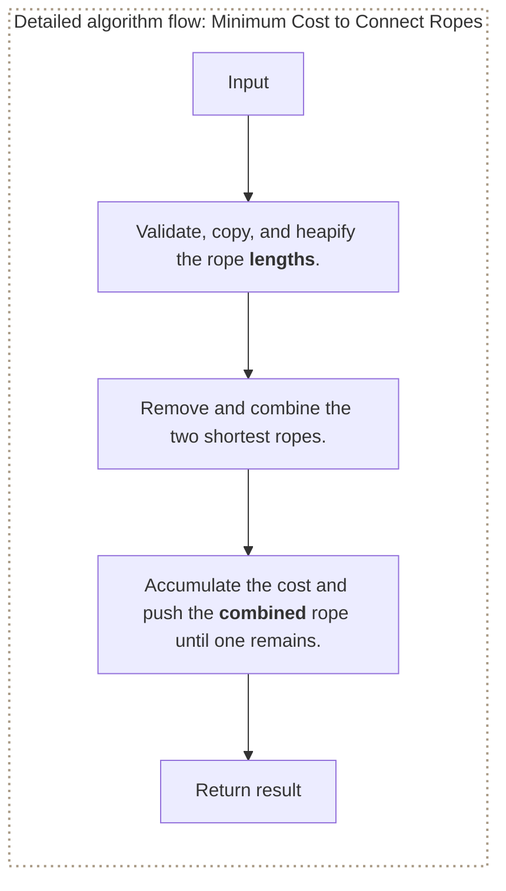

**Where it is used in real life:**

- Compression trees repeatedly combine the cheapest items.
- Batch-merging systems minimize total pairwise merge cost.

```go
// Exact question: How do you minimize the total cost of connecting ropes?
//
// Example: Input lengths = [4, 3, 2, 6] -> output cost 29 by combining 2+3, then 4+5, then 6+9.
//
// Possible answer: Repeatedly remove the two shortest ropes, add their sum to the cost, and push the combined rope.
//
// Output format: Return `(minimumCost, true)` or `(0, false)` if a rope length is negative.
//
// Inline descriptions:
// - `lengths` is a slice whose indexes are input positions and whose elements are rope-length values.
// - `ropeHeap` is a slice whose indexes are heap positions and whose elements are current rope lengths.
//
// Boundary checks:
// - Empty and one-rope inputs cost zero; negative lengths are rejected.
//
// Key variables:
// - `first` and `second` are the two shortest ropes; `combined` is their replacement rope.
//
// Logic:
// 1. Validate, copy, and heapify the rope lengths.
// 2. Remove and combine the two shortest ropes.
// 3. Accumulate the cost and push the combined rope until one remains.
func buildMinHeap(values []int) []int {
	for parent := len(values)/2 - 1; parent >= 0; parent-- {
		siftDownMin(values, parent)
	}
	return values
}

func siftDownMin(values []int, parent int) {
	for {
		left := 2*parent + 1
		if left >= len(values) {
			return
		}
		smaller := left
		right := left + 1
		if right < len(values) && values[right] < values[left] {
			smaller = right
		}
		if values[parent] <= values[smaller] {
			return
		}
		values[parent], values[smaller] = values[smaller], values[parent]
		parent = smaller
	}
}

func pushMinHeap(values []int, value int) []int {
	values = append(values, value)
	child := len(values) - 1
	for child > 0 {
		parent := (child - 1) / 2
		if values[parent] <= values[child] {
			break
		}
		values[parent], values[child] = values[child], values[parent]
		child = parent
	}
	return values
}

func popMinHeap(values []int) ([]int, int, bool) {
	if len(values) == 0 {
		return values, 0, false
	}
	minimum := values[0]
	last := len(values) - 1
	values[0] = values[last]
	values = values[:last]
	if len(values) > 0 {
		siftDownMin(values, 0)
	}
	return values, minimum, true
}

func minimumRopeConnectionCost(lengths []int) (int, bool) {
	for _, length := range lengths {
		if length < 0 {
			return 0, false
		}
	}
	ropeHeap := buildMinHeap(append([]int(nil), lengths...))
	total := 0
	for len(ropeHeap) > 1 {
		var first, second int
		ropeHeap, first, _ = popMinHeap(ropeHeap)
		ropeHeap, second, _ = popMinHeap(ropeHeap)
		combined := first + second
		total += combined
		ropeHeap = pushMinHeap(ropeHeap, combined)
	}
	return total, true
}

// time complexity: O(n log n) -> `n - 1` combinations perform a constant number of logarithmic heap operations.
// space complexity: O(n) -> the copied rope heap stores all input lengths and their replacements.
```

> **Baby analogy:** Imagine a prize line where the most important child is always called next. "Minimum Cost to Connect Ropes" is one small game played with the same pieces and rules.

---

## Interview checklist and next steps

Use this answer order during an interview:

1. Restate the input, output, and constraints.
2. Name the pattern and the invariant.
3. Explain the data structure roles before coding.
4. Handle boundary cases explicitly.
5. Walk through a small example.
6. Give time and space complexity with variable definitions.

Recommended practice order:
1. [Kth Largest Element in an Array](#kth-largest-element-in-an-array)
2. [Top K Frequent Elements](#top-k-frequent-elements)
3. [Merge K Sorted Lists](#merge-k-sorted-lists)
4. [Find Median from a Data Stream](#find-median-from-a-data-stream)
5. [Meeting Rooms II](#meeting-rooms-ii)
6. [Task Scheduler](#task-scheduler)
7. [Top K Largest Values](#top-k-largest-values)
8. [Build a Min Heap](#build-a-min-heap)
9. [Heap Sort](#heap-sort)
10. [Minimum Cost to Connect Ropes](#minimum-cost-to-connect-ropes)

Continue with: K Closest Points, Reorganize String, Smallest Range Covering K Lists, Kth Largest in a Stream, Dijkstra with a Heap.

```mermaid
flowchart LR
    Q0["Kth Largest Element in an Array"]
    Q0 --> Q1["Top K Frequent Elements"]
    Q1 --> Q2["Merge K Sorted Lists"]
    Q2 --> Q3["Find Median from a Data Stream"]
    Q3 --> Q4["Meeting Rooms II"]
    Q4 --> Q5["Task Scheduler"]
    Q5 --> Q6["Top K Largest Values"]
    Q6 --> Q7["Build a Min Heap"]
    Q7 --> Q8["Heap Sort"]
    Q8 --> Q9["Minimum Cost to Connect Ropes"]
```

> **Baby analogy:** Imagine a prize line where the most important child is always called next. Pack the same checklist every time so no important interview step is forgotten.
