# Linked Lists — A Compact Interview Guide

A linked list stores values in nodes connected by pointers. Position comes from following links rather than calculating an array index.

- [Mental model](#mental-model)
- [Representation and core operations](#representation-and-core-operations)
- [Interview patterns and complexity](#interview-patterns-and-complexity)
- [Problem-solving checklist and common mistakes](#problem-solving-checklist-and-common-mistakes)
- [Top 10 Linked List Interview Questions](#top-10-linked-list-interview-questions)
- [Interview checklist and next steps](#interview-checklist-and-next-steps)

> **Baby analogy:** Imagine a toy train whose cars are connected by hooks. The guide shows where every piece belongs before you start moving the pieces.

---

## Mental model

Each node holds a value and a pointer to the next node. A doubly linked node also points backward. The head is the first node pointer, not a copied value.

| Real system | How the topic appears |
| --- | --- |
| LRU caches | A map finds nodes and a doubly linked list maintains recency |
| Operating systems | Intrusive lists connect kernel objects |
| Media playlists | Items link to the next and previous entries |
| Memory allocators | Free blocks can be chained without contiguous storage |

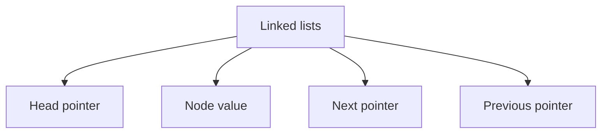

> **Baby analogy:** Imagine a toy train whose cars are connected by hooks. A car knows the next car, but it cannot jump directly to car number ten.

---

## Representation and core operations

Draw pointer identities, not only values. Two nodes may store equal values while representing different positions.

| Representation | Role |
| --- | --- |
| Head pointer | Identity of the first node |
| Node value | Data stored at one position |
| Next pointer | Connection to the following node |
| Previous pointer | Optional connection to the preceding node |

| Operation | Typical cost | Meaning |
| --- | --- | --- |
| Read kth node | O(k) | Follow k links |
| Insert at known node | O(1) | Reconnect a constant number of pointers |
| Delete known successor | O(1) | Bypass one node |
| Search by value | O(n) | Traverse until match |
| Reverse | O(n) | Redirect every next pointer |

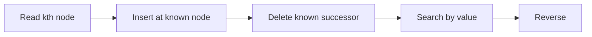

> **Baby analogy:** Imagine a toy train whose cars are connected by hooks. Adding or removing a known car changes only nearby hooks; finding that car may require walking the whole train.

---

## Interview patterns and complexity

| Question clue | Pattern | Practice problems in this guide |
| --- | --- | --- |
| Middle or cycle | Fast and slow pointers | [Middle of the Linked List](#middle-of-the-linked-list), [Linked List Cycle](#linked-list-cycle), [Linked List Cycle II](#linked-list-cycle-ii) |
| Reverse direction | Previous-current-next pointers | [Reverse Linked List](#reverse-linked-list) |
| Deletion near head | Dummy node | [Remove Nth Node From End](#remove-nth-node-from-end), [Delete a Node by Value](#delete-a-node-by-value) |
| Two sorted lists | Merge pointers | [Merge Two Sorted Lists](#merge-two-sorted-lists) |
| Fixed gap or equalized path length | Two coordinated pointers | [Remove Nth Node From End](#remove-nth-node-from-end), [Intersection of Two Linked Lists](#intersection-of-two-linked-lists) |
| Digit-by-digit arithmetic | Carry plus output tail | [Add Two Numbers](#add-two-numbers) |
| Constant-time prepend | New head pointer | [Insert at the Head](#insert-at-the-head) |

| Work | Complexity | Reason |
| --- | --- | --- |
| Head insertion | O(1) | No traversal |
| Tail insertion without tail pointer | O(n) | Find last node |
| Traversal | O(n) | Follow every node |
| Auxiliary iterative reversal | O(1) | Three pointers only |

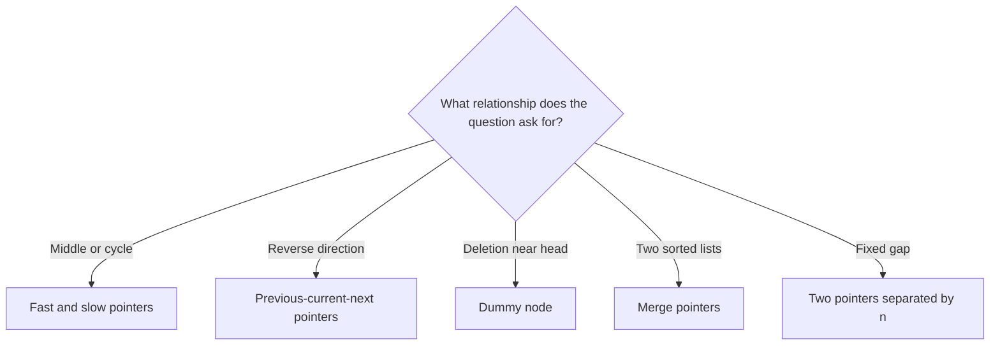

> **Baby analogy:** Imagine a toy train whose cars are connected by hooks. Use two runners for cycles, three hands for reversal, and an empty engine car as a dummy node.

---

## Problem-solving checklist and common mistakes

Before coding:

1. State exactly what the indexes, keys, pointers, states, or worklist elements represent.
2. Write the empty-input and smallest-input boundary behavior.
3. Choose the invariant that remains true after every step.
4. Trace one normal example and one edge case.
5. State whether output storage is included in space complexity.

Common mistakes:
- Losing the remaining list before saving next.
- Dereferencing next from a nil pointer.
- Comparing node values when identity matters.
- Forgetting that a function may need to return a new head.
- Creating a cycle accidentally during rewiring.
- Updating only one direction of a doubly linked list.

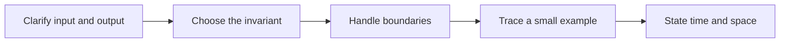

> **Baby analogy:** Imagine a toy train whose cars are connected by hooks. Hold the next car before unhooking the current one, or the rest of the train rolls away.

---

## Top 10 Linked List Interview Questions

These are the single authoritative implementations in this guide. Each solution keeps the required question, answer, output, boundary, variable-role, logic, and complexity comments.

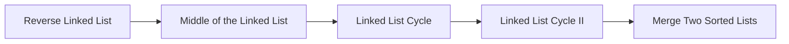

> **Baby analogy:** Imagine a toy train whose cars are connected by hooks. These ten puzzles are practice cards; each card teaches one reusable move.

### Reverse Linked List

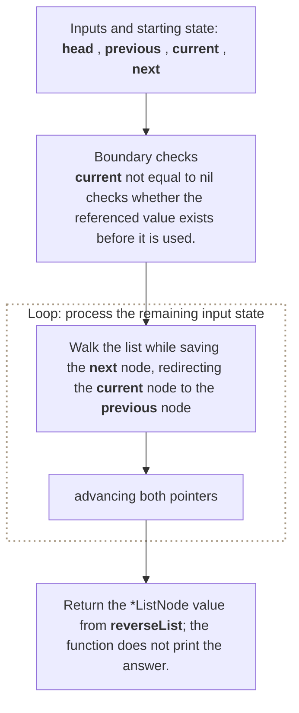

**Where it is used in real life:**

- Editors reverse undo-history chains for replay.
- Data pipelines reverse singly linked batches without copying values.

```go
// Exact question: Given the head of a singly linked list, reverse every `Next` pointer and return the new head.
//
// Example: Input 1->2->3->nil -> output 3->2->1->nil.
//
// Possible answer: Walk the list while saving the next node, redirecting the current node to the previous node, and advancing both pointers.
//
// Output format: Return the `*ListNode` value from `reverseList`; the function does not print the answer.
//
// Inline descriptions:
// - `head` points to a ListNode value that the function reads or updates.
//
// Boundary checks:
// - `current != nil` checks whether the referenced value exists before it is used.
//
// Key variables:
// - `head` points to a ListNode value that the function reads or updates.
// - `previous` points to the head of the already reversed prefix.
// - `current` points to the next node whose link must be reversed.
// - `next` temporarily preserves the unread remainder before `current.Next` is overwritten.
//
// Logic:
// 1. Iterate through the required elements or states in the order shown.
// 2. Return the value produced after the state updates are complete.
type ListNode struct {
	Val  int
	Next *ListNode
}

func reverseList(head *ListNode) *ListNode {
    var previous *ListNode
    current := head

    for current != nil {
        next := current.Next
        current.Next = previous
        previous = current
        current = next
    }

    return previous
}

// time complexity: O(n) -> the algorithm visits each of the `n` input elements or states once.
// space complexity: O(1) -> only a fixed number of scalar variables or references is kept.
```

> **Baby analogy:** Imagine a toy train whose cars are connected by hooks. "Reverse Linked List" is one small game played with the same pieces and rules.

### Middle of the Linked List

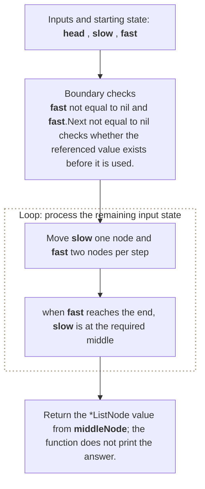

**Where it is used in real life:**

- Streaming lists split work into two halves.
- Pagination tools locate a midpoint without knowing length first.

```go
// Exact question: Given a singly linked list, return its middle node; when there are two middle nodes, return the second one.
//
// Example: Input 1->2->3->4->5->6 -> output the node containing 4, the second middle.
//
// Possible answer: Move `slow` one node and `fast` two nodes per step; when `fast` reaches the end, `slow` is at the required middle.
//
// Output format: Return the `*ListNode` value from `middleNode`; the function does not print the answer.
//
// Inline descriptions:
// - `head` points to a ListNode value that the function reads or updates.
//
// Boundary checks:
// - `fast != nil && fast.Next != nil` checks whether the referenced value exists before it is used.
//
// Key variables:
// - `head` points to a ListNode value that the function reads or updates.
// - `slow` advances one node per iteration and becomes the requested middle.
// - `fast` advances two nodes per iteration and determines when `slow` must stop.
//
// Logic:
// 1. Iterate through the required elements or states in the order shown.
// 2. Return the value produced after the state updates are complete.
type ListNode struct {
	Val  int
	Next *ListNode
}

func middleNode(head *ListNode) *ListNode {
    slow := head
    fast := head

    for fast != nil && fast.Next != nil {
        slow = slow.Next
        fast = fast.Next.Next
    }

    return slow
}

// time complexity: O(n) -> the algorithm visits each of the `n` input elements or states once.
// space complexity: O(1) -> only a fixed number of scalar variables or references is kept.
```

> **Baby analogy:** Imagine a toy train whose cars are connected by hooks. "Middle of the Linked List" is one small game played with the same pieces and rules.

### Linked List Cycle

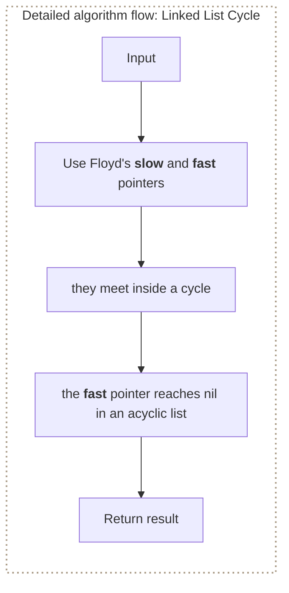

**Where it is used in real life:**

- Memory diagnostics detect corrupted pointer loops.
- Workflow engines detect tasks that eventually point back to earlier tasks.

```go
// Exact question: Given a singly linked list, return whether following `Next` pointers eventually revisits a node.
//
// Example: Input 1->2->3 with node 3 pointing back to node 2 -> output true.
//
// Possible answer: Use Floyd's slow and fast pointers; they meet inside a cycle, while the fast pointer reaches nil in an acyclic list.
//
// Output format: Return a `bool` value from `hasCycle`; the function does not print the answer.
//
// Inline descriptions:
// - `head` points to a ListNode value that the function reads or updates.
//
// Boundary checks:
// - `fast != nil && fast.Next != nil` checks whether the referenced value exists before it is used.
// - `slow == fast` decides whether the branch or loop should continue for the current input.
//
// Key variables:
// - `head` points to a ListNode value that the function reads or updates.
// - `slow` advances one node per iteration inside the candidate path.
// - `fast` advances two nodes; meeting `slow` proves a cycle and reaching nil disproves one.
//
// Logic:
// 1. Iterate through the required elements or states in the order shown.
// 2. Return the value produced after the state updates are complete.
type ListNode struct {
	Val  int
	Next *ListNode
}

func hasCycle(head *ListNode) bool {
    slow := head
    fast := head

    for fast != nil && fast.Next != nil {
        slow = slow.Next
        fast = fast.Next.Next

        if slow == fast {
            return true
        }
    }

    return false
}

// time complexity: O(n) -> the algorithm visits each of the `n` input elements or states once.
// space complexity: O(1) -> only a fixed number of scalar variables or references is kept.
```

> **Baby analogy:** Imagine a toy train whose cars are connected by hooks. "Linked List Cycle" is one small game played with the same pieces and rules.

### Linked List Cycle II

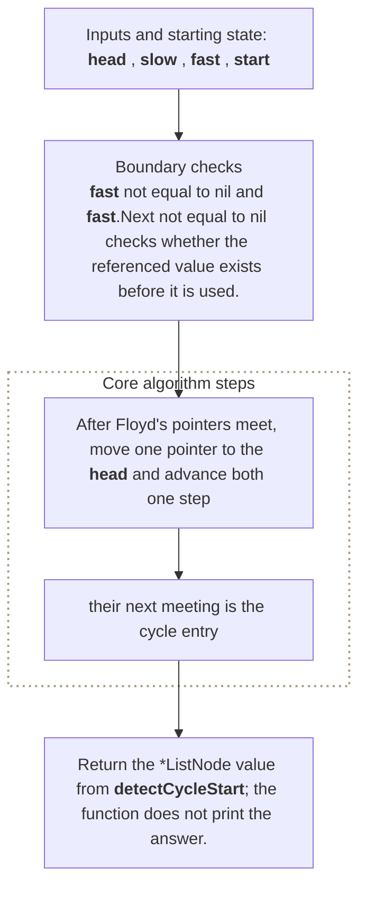

**Where it is used in real life:**

- Diagnostics identify the exact object where a corrupted cycle begins.
- Process tracing finds the first repeated state in deterministic transitions.

```go
// Exact question: Given a singly linked list, return the first node in its cycle, or nil when the list has no cycle.
//
// Example: Input 3->2->0->-4 with the tail pointing to the node containing 2 -> return that node.
//
// Possible answer: After Floyd's pointers meet, move one pointer to the head and advance both one step; their next meeting is the cycle entry.
//
// Output format: Return the `*ListNode` value from `detectCycleStart`; the function does not print the answer.
//
// Inline descriptions:
// - `head` points to a ListNode value that the function reads or updates.
//
// Boundary checks:
// - `fast != nil && fast.Next != nil` checks whether the referenced value exists before it is used.
// - `slow == fast` decides whether the branch or loop should continue for the current input.
// - `start != slow` keeps indexes or pointers within the portion of the input still being processed.
//
// Key variables:
// - `head` points to a ListNode value that the function reads or updates.
// - `slow` and `fast` first detect a meeting point inside the cycle.
// - `start` begins at the head and then advances with `slow` until both reach the cycle entry.
//
// Logic:
// 1. Iterate through the required elements or states in the order shown.
// 2. Return the value produced after the state updates are complete.
type ListNode struct {
	Val  int
	Next *ListNode
}

func detectCycleStart(head *ListNode) *ListNode {
    slow := head
    fast := head

    for fast != nil && fast.Next != nil {
        slow = slow.Next
        fast = fast.Next.Next

        if slow == fast {
            start := head

            for start != slow {
                start = start.Next
                slow = slow.Next
            }

            return start
        }
    }

    return nil
}

// time complexity: O(n) -> Floyd's pointers traverse at most a constant number of passes over the `n` nodes.
// space complexity: O(1) -> only a fixed number of scalar variables or references is kept.
```

> **Baby analogy:** Imagine a toy train whose cars are connected by hooks. "Linked List Cycle II" is one small game played with the same pieces and rules.

### Merge Two Sorted Lists

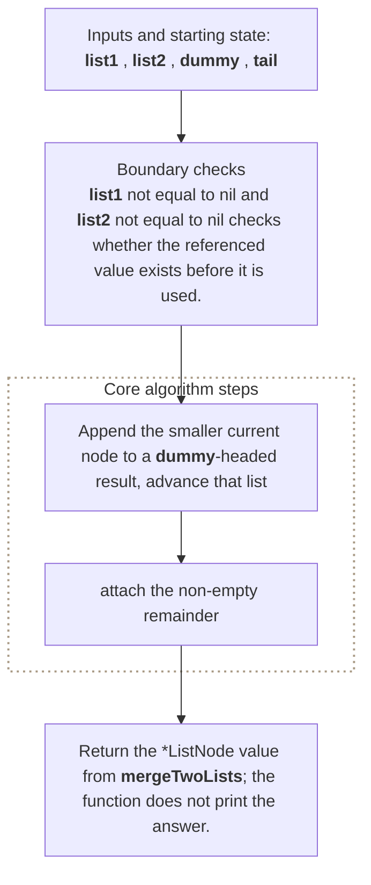

**Where it is used in real life:**

- Storage systems merge ordered linked runs.
- Event systems combine two time-ordered streams.

```go
// Exact question: Given two ascending singly linked lists, merge their existing nodes into one ascending list and return its head.
//
// Example: Input 1->2->4 and 1->3->4 -> output 1->1->2->3->4->4.
//
// Possible answer: Append the smaller current node to a dummy-headed result, advance that list, then attach the non-empty remainder.
//
// Output format: Return the `*ListNode` value from `mergeTwoLists`; the function does not print the answer.
//
// Inline descriptions:
// - `list1` points to a ListNode value that the function reads or updates.
// - `list2` points to a ListNode value that the function reads or updates.
//
// Boundary checks:
// - `list1 != nil && list2 != nil` checks whether the referenced value exists before it is used.
// - `list1.Val <= list2.Val` decides whether the branch or loop should continue for the current input.
// - `list1 != nil` checks whether the referenced value exists before it is used.
//
// Key variables:
// - `list1` points to a ListNode value that the function reads or updates.
// - `list2` points to a ListNode value that the function reads or updates.
// - `dummy` holds the intermediate value produced by `&ListNode{}`.
// - `tail` holds the intermediate value produced by `dummy`.
//
// Logic:
// 1. Iterate through the required elements or states in the order shown.
// 2. Return the value produced after the state updates are complete.
type ListNode struct {
	Val  int
	Next *ListNode
}

func mergeTwoLists(
    list1 *ListNode,
    list2 *ListNode,
) *ListNode {
    dummy := &ListNode{}
    tail := dummy

    for list1 != nil && list2 != nil {
        if list1.Val <= list2.Val {
            tail.Next = list1
            list1 = list1.Next
        } else {
            tail.Next = list2
            list2 = list2.Next
        }

        tail = tail.Next
    }

    if list1 != nil {
        tail.Next = list1
    } else {
        tail.Next = list2
    }

    return dummy.Next
}

// time complexity: O(n + m) -> each node from both sorted lists is linked into the result at most once.
// space complexity: O(1) -> only a fixed number of scalar variables or references is kept.
```

> **Baby analogy:** Imagine a toy train whose cars are connected by hooks. "Merge Two Sorted Lists" is one small game played with the same pieces and rules.

### Remove Nth Node From End

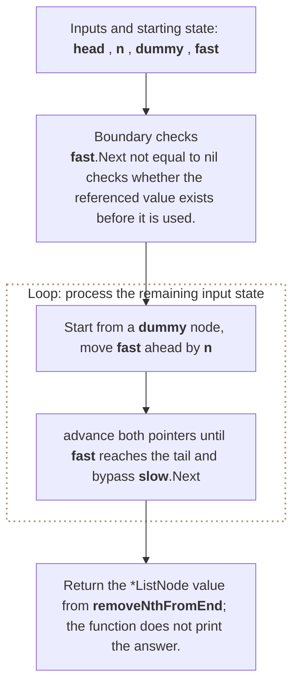

**Where it is used in real life:**

- Retention lists remove an item relative to the newest end.
- History tools delete the nth most recent linked record in one pass.

```go
// Exact question: Given a linked-list head and valid one-based `n`, remove the nth node from the end and return the possibly new head.
//
// Example: Input 1->2->3->4->5 and n = 2 -> output 1->2->3->5.
//
// Possible answer: Start from a dummy node, move `fast` ahead by `n`, then advance both pointers until `fast` reaches the tail and bypass `slow.Next`.
//
// Output format: Return the `*ListNode` value from `removeNthFromEnd`; the function does not print the answer.
//
// Inline descriptions:
// - `head` points to a ListNode value that the function reads or updates.
// - `n` is the int input used by this example.
//
// Boundary checks:
// - `fast.Next != nil` checks whether the referenced value exists before it is used.
//
// Key variables:
// - `head` points to a ListNode value that the function reads or updates.
// - `n` is the int input used by this example.
// - `dummy` is a sentinel before the real head, allowing deletion of the original first node.
// - `fast` stays `n` nodes ahead of `slow`; when it reaches the tail, `slow.Next` is the deletion target.
//
// Logic:
// 1. Iterate through the required elements or states in the order shown.
// 2. Return the value produced after the state updates are complete.
type ListNode struct {
	Val  int
	Next *ListNode
}

func removeNthFromEnd(head *ListNode, n int) *ListNode {
    dummy := &ListNode{Next: head}

    slow := dummy
    fast := dummy

    for i := 0; i < n; i++ {
        fast = fast.Next
    }

    for fast.Next != nil {
        slow = slow.Next
        fast = fast.Next
    }

    slow.Next = slow.Next.Next

    return dummy.Next
}

// time complexity: O(n) -> the algorithm visits each of the `n` input elements or states once.
// space complexity: O(1) -> only a fixed number of scalar variables or references is kept.
```

> **Baby analogy:** Imagine a toy train whose cars are connected by hooks. "Remove Nth Node From End" is one small game played with the same pieces and rules.

### Add Two Numbers

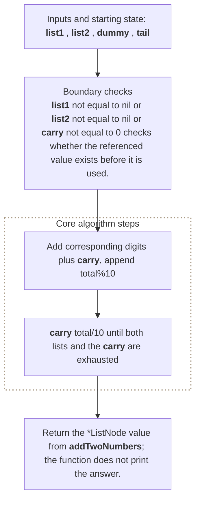

**Where it is used in real life:**

- Arbitrary-precision arithmetic stores digits as linked chunks.
- Streaming arithmetic combines numbers whose digits arrive node by node.

```go
// Exact question: Given two reverse-order linked lists of decimal digits, return a reverse-order list representing their sum.
//
// Example: Input 2->4->3 and 5->6->4 -> output 7->0->8 because 342 + 465 = 807.
//
// Possible answer: Add corresponding digits plus carry, append `total%10`, and carry `total/10` until both lists and the carry are exhausted.
//
// Output format: Return the `*ListNode` value from `addTwoNumbers`; the function does not print the answer.
//
// Inline descriptions:
// - `list1` points to a ListNode value that the function reads or updates.
// - `list2` points to a ListNode value that the function reads or updates.
//
// Boundary checks:
// - `list1 != nil || list2 != nil || carry != 0` checks whether the referenced value exists before it is used.
// - `list1 != nil` checks whether the referenced value exists before it is used.
// - `list2 != nil` checks whether the referenced value exists before it is used.
//
// Key variables:
// - `list1` points to a ListNode value that the function reads or updates.
// - `list2` points to a ListNode value that the function reads or updates.
// - `dummy` holds the intermediate value produced by `&ListNode{}`.
// - `tail` holds the intermediate value produced by `dummy`.
// - `carry` holds the intermediate value produced by `0`.
//
// Logic:
// 1. Iterate through the required elements or states in the order shown.
// 2. Return the value produced after the state updates are complete.
type ListNode struct {
	Val  int
	Next *ListNode
}

func addTwoNumbers(
    list1 *ListNode,
    list2 *ListNode,
) *ListNode {
    dummy := &ListNode{}
    tail := dummy
    carry := 0

    for list1 != nil || list2 != nil || carry != 0 {
        value1 := 0
        value2 := 0

        if list1 != nil {
            value1 = list1.Val
            list1 = list1.Next
        }

        if list2 != nil {
            value2 = list2.Val
            list2 = list2.Next
        }

        total := value1 + value2 + carry

        carry = total / 10
        digit := total % 10

        tail.Next = &ListNode{Val: digit}
        tail = tail.Next
    }

    return dummy.Next
}

// time complexity: O(max(n, m)) -> the number of executed operations grows according to this bound.
// space complexity: O(max(n, m)) -> the auxiliary storage grows according to this bound.
```

> **Baby analogy:** Imagine a toy train whose cars are connected by hooks. "Add Two Numbers" is one small game played with the same pieces and rules.

### Intersection of Two Linked Lists

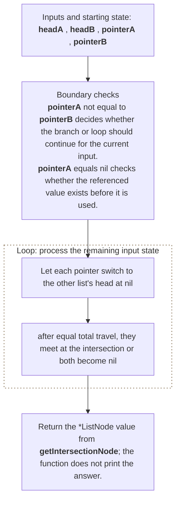

**Where it is used in real life:**

- Memory analysis finds two chains sharing the same tail objects.
- Version histories identify the first shared linked record.

```go
// Exact question: Given heads of two acyclic singly linked lists, return their first shared node by pointer identity, or nil when they do not intersect.
//
// Example: Input lists that first share the node containing 8 -> return that exact shared node pointer, not a new node with value 8.
//
// Possible answer: Let each pointer switch to the other list's head at nil; after equal total travel, they meet at the intersection or both become nil.
//
// Output format: Return the `*ListNode` value from `getIntersectionNode`; the function does not print the answer.
//
// Inline descriptions:
// - `headA` points to a ListNode value that the function reads or updates.
// - `headB` points to a ListNode value that the function reads or updates.
//
// Boundary checks:
// - `pointerA != pointerB` decides whether the branch or loop should continue for the current input.
// - `pointerA == nil` checks whether the referenced value exists before it is used.
// - `pointerB == nil` checks whether the referenced value exists before it is used.
//
// Key variables:
// - `headA` points to a ListNode value that the function reads or updates.
// - `headB` points to a ListNode value that the function reads or updates.
// - `pointerA` traverses list A then list B, while `pointerB` traverses list B then list A.
// - Equal total path lengths make the pointers meet by identity at the shared node or at nil.
//
// Logic:
// 1. Iterate through the required elements or states in the order shown.
// 2. Return the value produced after the state updates are complete.
type ListNode struct {
	Val  int
	Next *ListNode
}

func getIntersectionNode(
    headA *ListNode,
    headB *ListNode,
) *ListNode {
    pointerA := headA
    pointerB := headB

    for pointerA != pointerB {
        if pointerA == nil {
            pointerA = headB
        } else {
            pointerA = pointerA.Next
        }

        if pointerB == nil {
            pointerB = headA
        } else {
            pointerB = pointerB.Next
        }
    }

    return pointerA
}

// time complexity: O(n + m) -> each pointer traverses at most both lists once.
// space complexity: O(1) -> only a fixed number of scalar variables or references is kept.
```

> **Baby analogy:** Imagine a toy train whose cars are connected by hooks. "Intersection of Two Linked Lists" is one small game played with the same pieces and rules.

### Insert at the Head

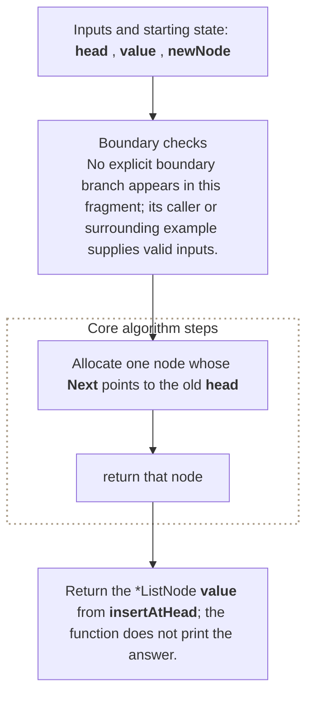

**Where it is used in real life:**

- Free lists return blocks to the front in constant time.
- Event buffers prepend the newest record.

```go
// Exact question: Insert a value before the current singly linked-list head and return the new head.
//
// Example: Input head 2->3 and value = 1 -> output 1->2->3.
//
// Possible answer: Allocate one node whose `Next` points to the old head, then return that node.
//
// Output format: Return the `*ListNode` value from `insertAtHead`; the function does not print the answer.
//
// Inline descriptions:
// - `head` points to a ListNode value that the function reads or updates.
// - `value` is the int input used by this example.
//
// Boundary checks:
// - No explicit boundary branch appears in this fragment; its caller or surrounding example supplies valid inputs.
//
// Key variables:
// - `head` points to a ListNode value that the function reads or updates.
// - `value` is the int input used by this example.
// - `newNode` holds the intermediate value produced by `&ListNode`.
//
// Logic:
// 1. Return the value produced after the state updates are complete.
type ListNode struct {
	Val  int
	Next *ListNode
}

func insertAtHead(head *ListNode, value int) *ListNode {
    newNode := &ListNode{
        Val:  value,
        Next: head,
    }

    return newNode
}

// time complexity: O(1) -> the snippet performs a fixed number of operations independent of input size.
// space complexity: O(1) -> only a fixed number of scalar variables or references is kept.
```

> **Baby analogy:** Imagine a toy train whose cars are connected by hooks. "Insert at the Head" is one small game played with the same pieces and rules.

### Delete a Node by Value

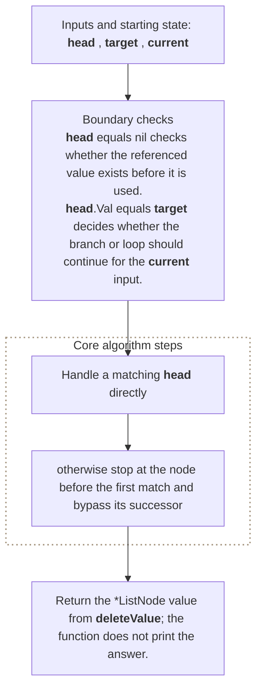

**Where it is used in real life:**

- Playlist tools remove the first matching track.
- Object registries unlink a matching record from a chain.

```go
// Exact question: Delete the first node whose value equals the target and return the possibly changed list head.
//
// Example: Input 1->2->3 and target = 2 -> output 1->3.
//
// Possible answer: Handle a matching head directly; otherwise stop at the node before the first match and bypass its successor.
//
// Output format: Return the `*ListNode` value from `deleteValue`; the function does not print the answer.
//
// Inline descriptions:
// - `head` points to a ListNode value that the function reads or updates.
// - `target` is the int input used by this example.
//
// Boundary checks:
// - `head == nil` checks whether the referenced value exists before it is used.
// - `head.Val == target` decides whether the branch or loop should continue for the current input.
// - `current.Next != nil` checks whether the referenced value exists before it is used.
//
// Key variables:
// - `head` points to a ListNode value that the function reads or updates.
// - `target` is the int input used by this example.
// - `current` holds the value for the state currently being calculated.
//
// Logic:
// 1. Iterate through the required elements or states in the order shown.
// 2. Return the value produced after the state updates are complete.
type ListNode struct {
	Val  int
	Next *ListNode
}

func deleteValue(head *ListNode, target int) *ListNode {
    if head == nil {
        return nil
    }

    if head.Val == target {
        return head.Next
    }

    current := head

    for current.Next != nil {
        if current.Next.Val == target {
            current.Next = current.Next.Next
            break
        }

        current = current.Next
    }

    return head
}

// time complexity: O(n) -> the algorithm visits each of the `n` input elements or states once.
// space complexity: O(1) -> only a fixed number of scalar variables or references is kept.
```

> **Baby analogy:** Imagine a toy train whose cars are connected by hooks. "Delete a Node by Value" is one small game played with the same pieces and rules.

---

## Interview checklist and next steps

Use this answer order during an interview:

1. Restate the input, output, and constraints.
2. Name the pattern and the invariant.
3. Explain the data structure roles before coding.
4. Handle boundary cases explicitly.
5. Walk through a small example.
6. Give time and space complexity with variable definitions.

Recommended practice order:
1. [Reverse Linked List](#reverse-linked-list)
2. [Middle of the Linked List](#middle-of-the-linked-list)
3. [Linked List Cycle](#linked-list-cycle)
4. [Linked List Cycle II](#linked-list-cycle-ii)
5. [Merge Two Sorted Lists](#merge-two-sorted-lists)
6. [Remove Nth Node From End](#remove-nth-node-from-end)
7. [Add Two Numbers](#add-two-numbers)
8. [Intersection of Two Linked Lists](#intersection-of-two-linked-lists)
9. [Insert at the Head](#insert-at-the-head)
10. [Delete a Node by Value](#delete-a-node-by-value)

Continue with: Palindrome Linked List, Reorder List, Copy List with Random Pointer, Merge K Sorted Lists, LRU Cache.

```mermaid
flowchart LR
    Q0["Reverse Linked List"]
    Q0 --> Q1["Middle of the Linked List"]
    Q1 --> Q2["Linked List Cycle"]
    Q2 --> Q3["Linked List Cycle II"]
    Q3 --> Q4["Merge Two Sorted Lists"]
    Q4 --> Q5["Remove Nth Node From End"]
    Q5 --> Q6["Add Two Numbers"]
    Q6 --> Q7["Intersection of Two Linked Lists"]
    Q7 --> Q8["Insert at the Head"]
    Q8 --> Q9["Delete a Node by Value"]
```

> **Baby analogy:** Imagine a toy train whose cars are connected by hooks. Pack the same checklist every time so no important interview step is forgotten.
