# Queues and Deques — A Compact Interview Guide

A queue processes items in first-in, first-out order. A deque supports insertion and removal at both ends.

- [Mental model](#mental-model)
- [Representation and core operations](#representation-and-core-operations)
- [Interview patterns and complexity](#interview-patterns-and-complexity)
- [Problem-solving checklist and common mistakes](#problem-solving-checklist-and-common-mistakes)
- [Top 10 Queue and Deque Interview Questions](#top-10-queue-and-deque-interview-questions)
- [Interview checklist and next steps](#interview-checklist-and-next-steps)

> **Baby analogy:** Imagine children waiting in a lunch line. The guide shows where every piece belongs before you start moving the pieces.

---

## Mental model

The front identifies the next item to remove; the back receives new items. BFS uses a queue because discovery order matches increasing distance.

| Real system | How the topic appears |
| --- | --- |
| Web servers | Requests wait in arrival order |
| Messaging | Consumers receive queued events |
| Operating systems | Runnable tasks wait for scheduling |
| Graph search | Discovered nodes wait by distance level |

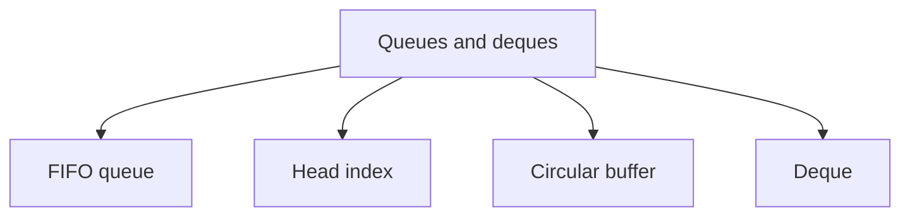

> **Baby analogy:** Imagine children waiting in a lunch line. The child who arrived first is served first; a deque also has a door at the back.

---

## Representation and core operations

Avoid repeatedly deleting slice index zero in production Go code because retained backing storage and shifting choices matter. Use a head index, ring buffer, or deque.

| Representation | Role |
| --- | --- |
| FIFO queue | Elements are pending values in arrival order |
| Head index | Position of the next element to remove |
| Circular buffer | Fixed storage with wrapped front and rear indexes |
| Deque | Both ends support push and pop |

| Operation | Typical cost | Meaning |
| --- | --- | --- |
| Enqueue | O(1) amortized | Append at back |
| Dequeue with head index | O(1) | Advance front position |
| Peek | O(1) | Read front without removal |
| Deque end operation | O(1) | Modify front or back |
| BFS | O(V+E) | Process graph work in discovery order |

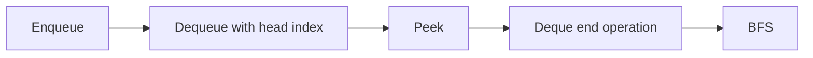

> **Baby analogy:** Imagine children waiting in a lunch line. Joining and leaving happen at opposite ends, so nobody in the middle needs to move.

---

## Interview patterns and complexity

| Question clue | Pattern | Practice problems in this guide |
| --- | --- | --- |
| Level or nearest | BFS queue | [Binary Tree Level Order Traversal](#binary-tree-level-order-traversal), [Number of Islands with BFS](#number-of-islands-with-bfs), [Minimum Jumps](#minimum-jumps) |
| Many starting points | Multi-source BFS | [Rotting Oranges](#rotting-oranges), [Multi-Source BFS](#multi-source-bfs) |
| Window maximum | Monotonic deque | [Sliding Window Maximum](#sliding-window-maximum) |
| Fixed storage | Circular queue or deque | [Design a Circular Queue](#design-a-circular-queue), [Implement a Deque](#implement-a-deque) |
| Arrival-order simulation | FIFO queue | [Queue with a Head Index](#implement-a-queue-with-a-head-index), [Recent Request Counter](#recent-request-counter) |

| Work | Complexity | Reason |
| --- | --- | --- |
| Queue operation | O(1) amortized | One end update |
| BFS time | O(V+E) | Visit vertices and edges |
| BFS space | O(V) | Queue and visited state |
| Sliding-window deque | O(n) | Each index enters and leaves once |

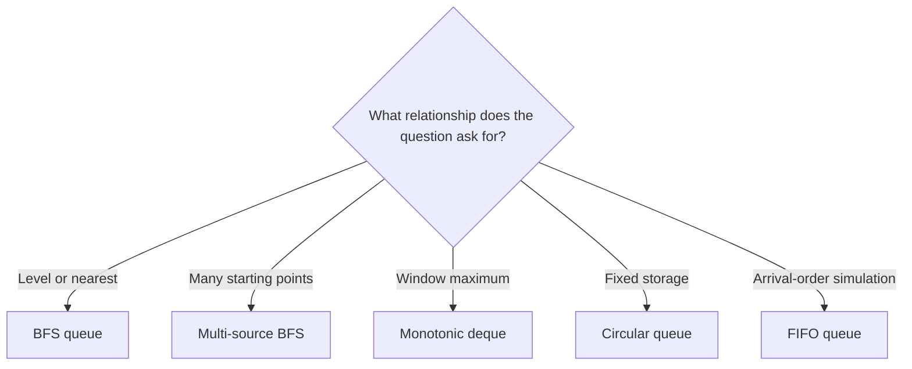

> **Baby analogy:** Imagine children waiting in a lunch line. Use a normal line for arrival order, several starting children for multi-source BFS, and a two-door line for windows.

---

## Problem-solving checklist and common mistakes

Before coding:

1. State exactly what the indexes, keys, pointers, states, or worklist elements represent.
2. Write the empty-input and smallest-input boundary behavior.
3. Choose the invariant that remains true after every step.
4. Trace one normal example and one edge case.
5. State whether output storage is included in space complexity.

Common mistakes:
- Removing slice index zero by shifting every item.
- Marking graph nodes visited only after dequeue.
- Mixing current and next BFS levels.
- Forgetting circular wraparound.
- Storing values in a monotonic deque when indexes are needed for expiry.
- Using a queue where priority order is required.

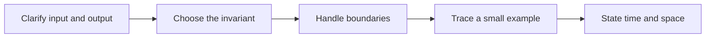

> **Baby analogy:** Imagine children waiting in a lunch line. Give a child a seen sticker before joining the line, or the same child may join many times.

---

## Top 10 Queue and Deque Interview Questions

These are the single authoritative implementations in this guide. Each solution keeps the required question, answer, output, boundary, variable-role, logic, and complexity comments.

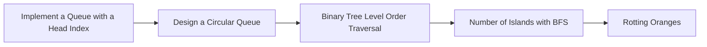

> **Baby analogy:** Imagine children waiting in a lunch line. These ten puzzles are practice cards; each card teaches one reusable move.

### Implement a Queue with a Head Index

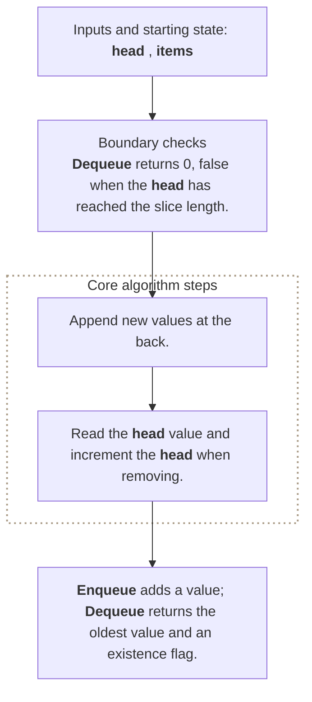

**Where it is used in real life:**

- Go services buffer work without shifting a slice on every dequeue.
- Event processors retain arrival order with an advancing read position.

```go
// Exact question: How can a slice-backed queue avoid shifting every element during dequeue?
//
// Example: Enqueue 10 and 20, then dequeue -> return 10 while 20 remains at the live head.
//
// Possible answer: Keep a head index that marks the first live element and increment it after removal.
//
// Output format: `Enqueue` adds a value; `Dequeue` returns the oldest value and an existence flag.
//
// Inline descriptions:
// - Old values remain before `head` until optional compaction; they are no longer logically in the queue.
//
// Boundary checks:
// - `Dequeue` returns `0, false` when the head has reached the slice length.
//
// Key variables:
// - `items` is a slice whose indexes are storage positions and whose elements are queued integer values.
// - `head` is the storage index of the oldest live element.
//
// Logic:
// 1. Append new values at the back.
// 2. Read the head value and increment the head when removing.
type IndexedQueue struct {
	items []int
	head  int
}

func (queue *IndexedQueue) Enqueue(value int) {
	queue.items = append(queue.items, value)
}

func (queue *IndexedQueue) Dequeue() (int, bool) {
	if queue.head >= len(queue.items) {
		return 0, false
	}
	value := queue.items[queue.head]
	queue.head++
	return value, true
}

// time complexity: O(1) -> amortized enqueue appends and dequeue advances an index without shifting elements.
// space complexity: O(n) -> the backing slice can store `n` queued values.
```

> **Baby analogy:** Imagine children waiting in a lunch line. "Implement a Queue with a Head Index" is one small game played with the same pieces and rules.

### Design a Circular Queue

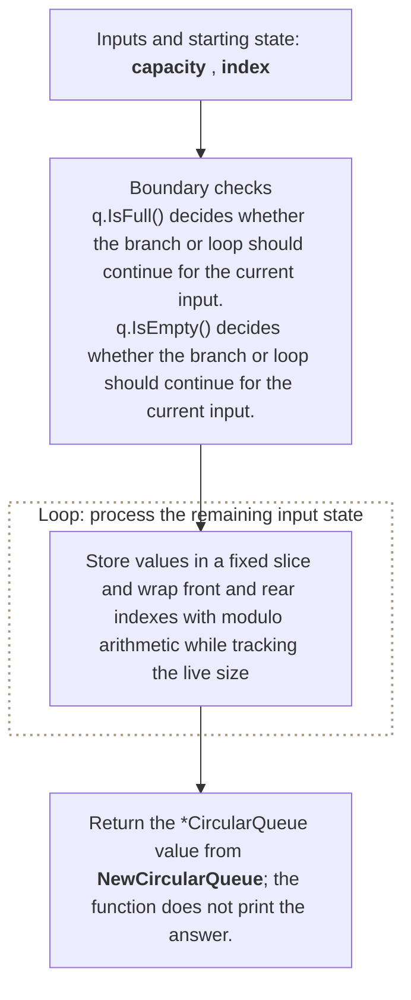

**Where it is used in real life:**

- Network devices use fixed-size packet rings.
- Audio systems reuse bounded sample buffers.

```go
// Exact question: Implement a fixed-capacity circular queue with O(1) enqueue, dequeue, front, rear, empty, and full operations.
//
// Example: Capacity 3: enqueue 1, 2, 3 succeeds, enqueue 4 fails, Front returns 1, and Rear returns 3.
//
// Possible answer: Store values in a fixed slice and wrap front and rear indexes with modulo arithmetic while tracking the live size.
//
// Output format: Return the `*CircularQueue` value from `NewCircularQueue`; the function does not print the answer.
//
// Inline descriptions:
// - `capacity` is the int input used by this example.
//
// Boundary checks:
// - `q.IsFull()` decides whether the branch or loop should continue for the current input.
// - `q.IsEmpty()` decides whether the branch or loop should continue for the current input.
//
// Key variables:
// - `capacity` is the int input used by this example.
// - `index` holds the intermediate value produced by `(q.rear - 1 + q.capacity) % q.capacity`.
//
// Logic:
// 1. Create or use a slice so indexes identify positions and elements store their data or state.
// 2. Recursively reduce the current problem to smaller calls until a base condition is reached.
// 3. Return the value produced after the state updates are complete.
type CircularQueue struct {
	data     []int
	front    int
	rear     int
	size     int
	capacity int
}

func NewCircularQueue(capacity int) *CircularQueue {
	return &CircularQueue{
		data:     make([]int, capacity),
		capacity: capacity,
	}
}

func (q *CircularQueue) EnQueue(value int) bool {
	if q.IsFull() {
		return false
	}

	q.data[q.rear] = value
	q.rear = (q.rear + 1) % q.capacity
	q.size++

	return true
}

func (q *CircularQueue) DeQueue() bool {
	if q.IsEmpty() {
		return false
	}

	q.front = (q.front + 1) % q.capacity
	q.size--

	return true
}

func (q *CircularQueue) Front() (int, bool) {
	if q.IsEmpty() {
		return 0, false
	}

	return q.data[q.front], true
}

func (q *CircularQueue) Rear() (int, bool) {
	if q.IsEmpty() {
		return 0, false
	}

	index := (q.rear - 1 + q.capacity) % q.capacity
	return q.data[index], true
}

func (q *CircularQueue) IsEmpty() bool {
	return q.size == 0
}

func (q *CircularQueue) IsFull() bool {
	return q.size == q.capacity
}

// time complexity: O(1) -> each enqueue, dequeue, front, and rear operation updates or reads a fixed number of indexes.
// space complexity: O(k) -> construction reserves a fixed backing slice for the queue capacity `k`.
```

> **Baby analogy:** Imagine children waiting in a lunch line. "Design a Circular Queue" is one small game played with the same pieces and rules.

### Binary Tree Level Order Traversal

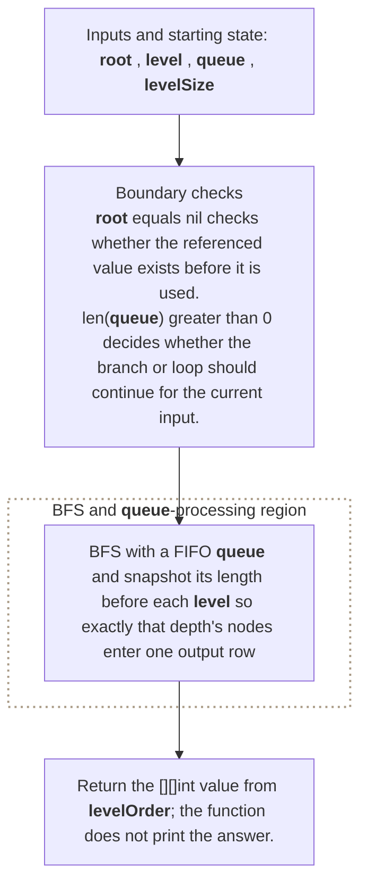

**Where it is used in real life:**

- Organization charts render employees level by level.
- Hierarchy tools group nodes by depth.

```go
// Exact question: Given a binary-tree root, return node values grouped by depth from left to right.
//
// Example: Input tree [3, 9, 20, nil, nil, 15, 7] -> output [[3], [9, 20], [15, 7]].
//
// Possible answer: BFS with a FIFO queue and snapshot its length before each level so exactly that depth's nodes enter one output row.
//
// Output format: Return the `[][]int` value from `levelOrder`; the function does not print the answer.
//
// Inline descriptions:
// - `root` points to a TreeNode value that the function reads or updates.
//
// Boundary checks:
// - `root == nil` checks whether the referenced value exists before it is used.
// - `len(queue) > 0` decides whether the branch or loop should continue for the current input.
// - `node.Left != nil` checks whether the referenced value exists before it is used.
//
// Key variables:
// - `root` points to a TreeNode value that the function reads or updates.
// - `level` stores node values for one depth in left-to-right dequeue order.
// - `result[depth]` stores the complete value slice for that tree level.
// - `queue` stores pending tree-node pointers in FIFO order.
// - `levelSize` freezes the number of nodes belonging to the current depth before their children are enqueued.
//
// Logic:
// 1. Create or use a slice so indexes identify positions and elements store their data or state.
// 2. Iterate through the required elements or states in the order shown.
// 3. Recursively reduce the current problem to smaller calls until a base condition is reached.
type TreeNode struct {
	Val   int
	Left  *TreeNode
	Right *TreeNode
}

func levelOrder(root *TreeNode) [][]int {
	if root == nil {
		return [][]int{}
	}

	result := [][]int{}
	queue := []*TreeNode{root}

	for len(queue) > 0 {
		levelSize := len(queue)
		level := make([]int, 0, levelSize)

		for i := 0; i < levelSize; i++ {
			node := queue[0]
			queue = queue[1:]

			level = append(level, node.Val)

			if node.Left != nil {
				queue = append(queue, node.Left)
			}

			if node.Right != nil {
				queue = append(queue, node.Right)
			}
		}

		result = append(result, level)
	}

	return result
}

// time complexity: O(n) -> the algorithm visits each of the `n` input elements or states once.
// space complexity: O(w) -> the BFS queue can hold every node on the tree's widest level.
```

> **Baby analogy:** Imagine children waiting in a lunch line. "Binary Tree Level Order Traversal" is one small game played with the same pieces and rules.

### Number of Islands with BFS

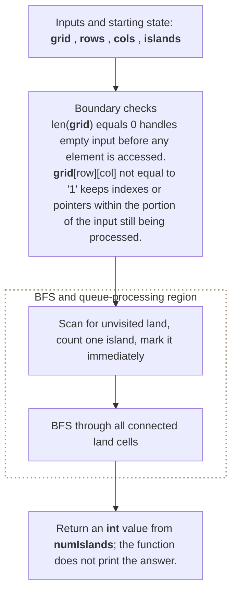

**Where it is used in real life:**

- Image processing groups connected foreground regions.
- Monitoring groups neighboring failed grid cells.

```go
// Exact question: Given a land-and-water grid, return the number of four-directionally connected land components using BFS.
//
// Example: Input grid rows 110, 010, 001 -> output 2 four-directional islands.
//
// Possible answer: Scan for unvisited land, count one island, mark it immediately, and BFS through all connected land cells.
//
// Output format: Return an `int` value from `numIslands`; the function does not print the answer.
//
// Inline descriptions:
// - `grid` is a two-dimensional slice: row and column indexes identify positions, and each cell stores a value.
//
// Boundary checks:
// - `len(grid) == 0` handles empty input before any element is accessed.
// - `grid[row][col] != '1'` keeps indexes or pointers within the portion of the input still being processed.
// - `len(queue) > 0` decides whether the branch or loop should continue for the current input.
//
// Key variables:
// - `grid` is a two-dimensional slice: row and column indexes identify positions, and each cell stores a value.
// - `rows` and `cols` define valid grid-coordinate boundaries.
// - `islands` counts BFS traversals started from previously unvisited land.
// - `directions` stores four row-column offsets for orthogonal neighbors.
//
// Logic:
// 1. Create or use a slice so indexes identify positions and elements store their data or state.
// 2. Iterate through the required elements or states in the order shown.
// 3. Return the value produced after the state updates are complete.
func numIslands(grid [][]byte) int {
	if len(grid) == 0 {
		return 0
	}

	rows := len(grid)
	cols := len(grid[0])
	islands := 0

	directions := [][2]int{
		{-1, 0},
		{1, 0},
		{0, -1},
		{0, 1},
	}

	for row := 0; row < rows; row++ {
		for col := 0; col < cols; col++ {
			if grid[row][col] != '1' {
				continue
			}

			islands++
			queue := [][2]int{{row, col}}
			grid[row][col] = '0'

			for len(queue) > 0 {
				cell := queue[0]
				queue = queue[1:]

				for _, direction := range directions {
					nextRow := cell[0] + direction[0]
					nextCol := cell[1] + direction[1]

					insideGrid :=
						nextRow >= 0 &&
							nextRow < rows &&
							nextCol >= 0 &&
							nextCol < cols

					if insideGrid && grid[nextRow][nextCol] == '1' {
						grid[nextRow][nextCol] = '0'
						queue = append(queue, [2]int{nextRow, nextCol})
					}
				}
			}
		}
	}

	return islands
}

// time complexity: O(rows * columns) -> the algorithm processes every cell in the rows-by-columns state space.
// space complexity: O(rows * columns) -> the BFS queue can hold cells from a grid-sized island in the worst case.
```

> **Baby analogy:** Imagine children waiting in a lunch line. "Number of Islands with BFS" is one small game played with the same pieces and rules.

### Rotting Oranges

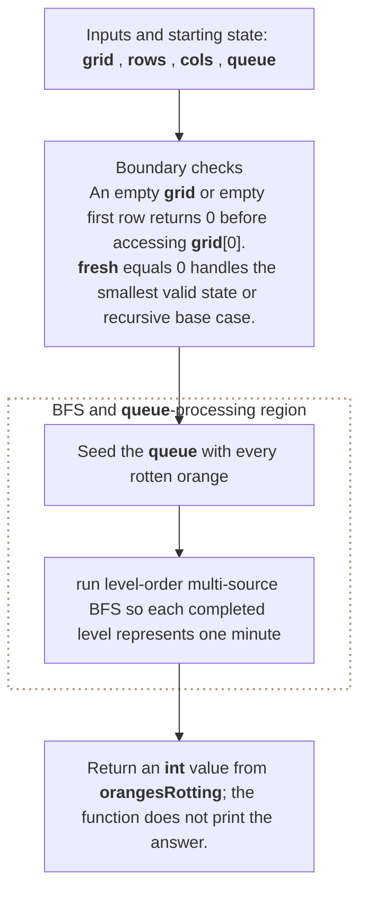

**Where it is used in real life:**

- Simulations model wave propagation over time steps.
- Incident tools model contamination or failure spreading from many sources.

```go
// Exact question: Given empty, fresh, and rotten grid cells, return the minutes until every reachable fresh orange rots, or `-1` if some remain fresh.
//
// Example: Input grid [[2,1,1],[1,1,0],[0,1,1]] -> output 4 minutes.
//
// Possible answer: Seed the queue with every rotten orange, then run level-order multi-source BFS so each completed level represents one minute.
//
// Output format: Return an `int` value from `orangesRotting`; the function does not print the answer.
//
// Inline descriptions:
// - `grid` is a two-dimensional slice: row and column indexes identify positions, and each cell stores a value.
//
// Boundary checks:
// - An empty grid or empty first row returns `0` before accessing `grid[0]`.
// - `fresh == 0` handles the smallest valid state or recursive base case.
// - `len(queue) > 0 && fresh > 0` decides whether the branch or loop should continue for the current input.
// - `!insideGrid || grid[nextRow][nextCol] != 1` decides whether the branch or loop should continue for the current input.
//
// Key variables:
// - `grid` is a two-dimensional slice: row and column indexes identify positions, and each cell stores a value.
// - `rows` and `cols` define valid grid-coordinate boundaries.
// - `queue` stores rotten-cell coordinates in FIFO wavefront order.
// - `fresh` counts fresh oranges not yet reached by the spreading wave.
//
// Logic:
// 1. Create or use a slice so indexes identify positions and elements store their data or state.
// 2. Iterate through the required elements or states in the order shown.
// 3. Return the value produced after the state updates are complete.
func orangesRotting(grid [][]int) int {
	if len(grid) == 0 || len(grid[0]) == 0 {
		return 0
	}

	rows := len(grid)
	cols := len(grid[0])

	queue := [][2]int{}
	fresh := 0

	for row := 0; row < rows; row++ {
		for col := 0; col < cols; col++ {
			switch grid[row][col] {
			case 1:
				fresh++
			case 2:
				queue = append(queue, [2]int{row, col})
			}
		}
	}

	if fresh == 0 {
		return 0
	}

	directions := [][2]int{
		{-1, 0},
		{1, 0},
		{0, -1},
		{0, 1},
	}

	minutes := 0

	for len(queue) > 0 && fresh > 0 {
		levelSize := len(queue)

		for i := 0; i < levelSize; i++ {
			cell := queue[0]
			queue = queue[1:]

			for _, direction := range directions {
				nextRow := cell[0] + direction[0]
				nextCol := cell[1] + direction[1]

				insideGrid :=
					nextRow >= 0 &&
						nextRow < rows &&
						nextCol >= 0 &&
						nextCol < cols

				if !insideGrid || grid[nextRow][nextCol] != 1 {
					continue
				}

				grid[nextRow][nextCol] = 2
				fresh--
				queue = append(queue, [2]int{nextRow, nextCol})
			}
		}

		minutes++
	}

	if fresh > 0 {
		return -1
	}

	return minutes
}

// time complexity: O(rows * columns) -> the algorithm processes every cell in the rows-by-columns state space.
// space complexity: O(rows * columns) -> the multi-source BFS queue can hold a grid-sized wavefront in the worst case.
```

> **Baby analogy:** Imagine children waiting in a lunch line. "Rotting Oranges" is one small game played with the same pieces and rules.

### Sliding Window Maximum

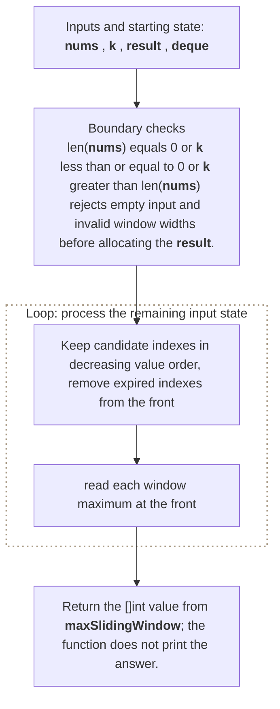

**Where it is used in real life:**

- Monitoring reports peak latency in each rolling interval.
- Trading systems track rolling high prices.

```go
// Exact question: Given an integer slice and window width `k`, return the maximum value in every contiguous window.
//
// Example: Input numbers = [1,3,-1,-3,5,3,6,7] and k = 3 -> output [3,3,5,5,6,7].
//
// Possible answer: Keep candidate indexes in decreasing value order, remove expired indexes from the front, and read each window maximum at the front.
//
// Output format: Return the `[]int` value from `maxSlidingWindow`; the function does not print the answer.
//
// Inline descriptions:
// - `nums` is a slice: the index identifies an element or state, and the stored item has type int.
// - `k` is the int input used by this example.
//
// Boundary checks:
// - `len(nums) == 0 || k <= 0 || k > len(nums)` rejects empty input and invalid window widths before allocating the result.
// - `len(deque) > 0 && deque[0] < windowStart` decides whether the branch or loop should continue for the current input.
// - `i >= k-1` keeps indexes or pointers within the portion of the input still being processed.
//
// Key variables:
// - `nums` is a slice: the index identifies an element or state, and the stored item has type int.
// - `k` is the int input used by this example.
// - `result` stores one maximum per complete window in left-to-right window order.
// - `deque` stores input indexes, not values; their referenced values decrease from front to back.
// - `windowStart` holds the intermediate value produced by `i - k + 1`.
//
// Logic:
// 1. Create or use a slice so indexes identify positions and elements store their data or state.
// 2. Iterate through the required elements or states in the order shown.
// 3. Return the value produced after the state updates are complete.
func maxSlidingWindow(nums []int, k int) []int {
	if len(nums) == 0 || k <= 0 || k > len(nums) {
		return []int{}
	}

	result := make([]int, 0, len(nums)-k+1)
	deque := make([]int, 0)

	for i := 0; i < len(nums); i++ {
		windowStart := i - k + 1

		// Remove indices outside the current window.
		if len(deque) > 0 && deque[0] < windowStart {
			deque = deque[1:]
		}

		// Remove values smaller than the new value.
		for len(deque) > 0 &&
			nums[deque[len(deque)-1]] <= nums[i] {
			deque = deque[:len(deque)-1]
		}

		deque = append(deque, i)

		// Start recording after the first complete window.
		if i >= k-1 {
			result = append(result, nums[deque[0]])
		}
	}

	return result
}

// time complexity: O(n) -> the algorithm visits each of the `n` input elements or states once.
// space complexity: O(k) -> the auxiliary storage grows according to this bound.
```

> **Baby analogy:** Imagine children waiting in a lunch line. "Sliding Window Maximum" is one small game played with the same pieces and rules.

### Multi-Source BFS

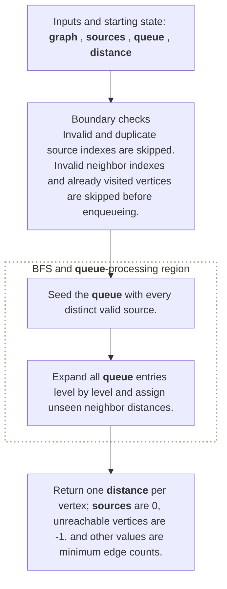

**Where it is used in real life:**

- Maps compute distance to the nearest hospital or charger.
- Infrastructure tools calculate distance from every node to the closest replica.

```go
// Exact question: Given an unweighted graph and multiple source vertices, return every vertex's minimum edge distance to any valid source.
//
// Example: Input chain 0-1-2-3 with sources [0, 3] -> output distances [0, 1, 1, 0].
//
// Possible answer: Enqueue all distinct valid sources at distance zero, then perform one BFS so the first discovery of each vertex is its nearest-source distance.
//
// Output format: Return one distance per vertex; sources are `0`, unreachable vertices are `-1`, and other values are minimum edge counts.
//
// Inline descriptions:
// - The comments in this preface describe how the important expressions and state changes are used.
//
// Boundary checks:
// - Invalid and duplicate source indexes are skipped.
// - Invalid neighbor indexes and already visited vertices are skipped before enqueueing.
//
// Key variables:
// - `graph` is an adjacency-list slice whose indexes are vertex IDs and whose elements are neighbor-ID slices.
// - `sources` is a slice whose indexes are source positions and whose elements are starting vertex IDs.
// - `queue` stores discovered vertex IDs in FIFO order.
// - `distance` is a parallel slice whose indexes are vertex IDs and whose values are nearest-source edge counts.
//
// Logic:
// 1. Seed the queue with every distinct valid source.
// 2. Expand all queue entries level by level and assign unseen neighbor distances.
func multiSourceDistances(graph [][]int, sources []int) []int {
	distance := make([]int, len(graph))
	for vertex := range distance {
		distance[vertex] = -1
	}
	queue := make([]int, 0, len(graph))
	for _, source := range sources {
		if source < 0 || source >= len(graph) || distance[source] != -1 {
			continue
		}
		distance[source] = 0
		queue = append(queue, source)
	}
	for head := 0; head < len(queue); head++ {
		current := queue[head]
		for _, neighbor := range graph[current] {
			if neighbor < 0 || neighbor >= len(graph) || distance[neighbor] != -1 {
				continue
			}
			distance[neighbor] = distance[current] + 1
			queue = append(queue, neighbor)
		}
	}
	return distance
}

// time complexity: O(V + E) -> each reachable vertex is processed once and each edge is examined once.
// space complexity: O(V) -> the visited state, queue, stack, or result can hold one entry per vertex.
```

> **Baby analogy:** Imagine children waiting in a lunch line. "Multi-Source BFS" is one small game played with the same pieces and rules.

### Recent Request Counter

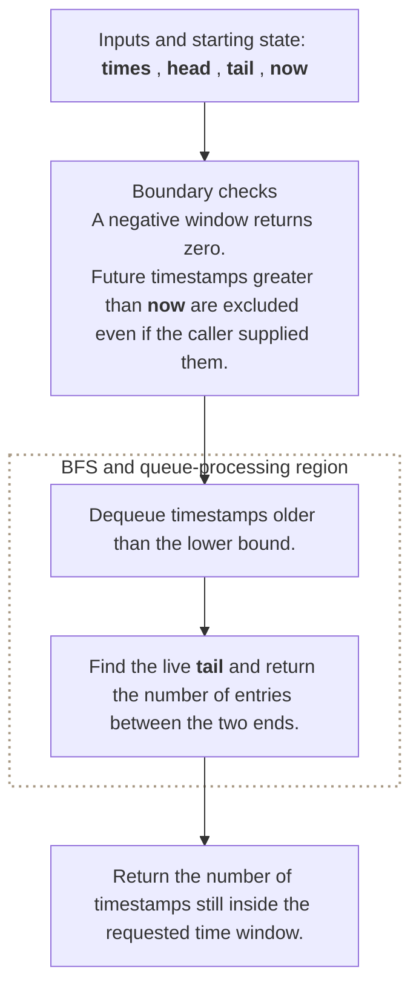

**Where it is used in real life:**

- Rate limiters count requests inside a rolling time window.
- Observability systems track recent event volume.

```go
// Exact question: Given sorted request times, how many requests occurred in the inclusive interval `[now-window, now]`?
//
// Example: Input times = [1, 100, 3001, 3002], now = 3002, and window = 3000 -> output 3.
//
// Possible answer: Keep request times in a queue and advance its head past expired entries.
//
// Output format: Return the number of timestamps still inside the requested time window.
//
// Inline descriptions:
// - Advancing the head models dequeuing expired requests without shifting later timestamps.
//
// Boundary checks:
// - A negative window returns zero.
// - Future timestamps greater than `now` are excluded even if the caller supplied them.
//
// Key variables:
// - `times` is a sorted slice whose indexes are arrival order and whose elements are request timestamps.
// - `head` becomes the index of the first request that has not expired.
// - `tail` is one past the last timestamp no later than `now`.
//
// Logic:
// 1. Dequeue timestamps older than the lower bound.
// 2. Find the live tail and return the number of entries between the two ends.
func recentRequestCount(times []int, now, window int) int {
	if window < 0 {
		return 0
	}
	lowerBound := now - window
	head := 0
	for head < len(times) && times[head] < lowerBound {
		head++
	}
	tail := head
	for tail < len(times) && times[tail] <= now {
		tail++
	}
	return tail - head
}

// time complexity: O(n) -> each of the `n` timestamps is inspected at most once by a queue boundary.
// space complexity: O(1) -> the queue is represented by indexes into the supplied slice.
```

> **Baby analogy:** Imagine children waiting in a lunch line. "Recent Request Counter" is one small game played with the same pieces and rules.

### Minimum Jumps

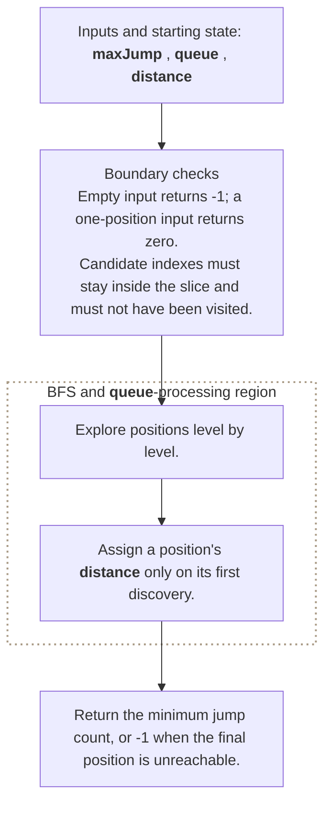

**Where it is used in real life:**

- Routing finds the fewest transitions between states.
- Game engines compute minimum moves under jump constraints.

```go
// Exact question: Given allowed forward jumps, what is the minimum number of jumps from position zero to the final position?
//
// Example: Input maxJump = [2, 3, 1, 1, 4] -> output 2 using positions 0->1->4.
//
// Possible answer: Run BFS because every jump is one unweighted step and the first visit has the minimum distance.
//
// Output format: Return the minimum jump count, or `-1` when the final position is unreachable.
//
// Inline descriptions:
// - Each queue element is a position, and `distance[position]` records its BFS level.
//
// Boundary checks:
// - Empty input returns `-1`; a one-position input returns zero.
// - Candidate indexes must stay inside the slice and must not have been visited.
//
// Key variables:
// - `maxJump` is a slice whose indexes are positions and whose elements are the maximum forward step from that position.
// - `queue` stores discovered position indexes in FIFO order.
// - `distance` is a slice whose indexes are positions and whose values are minimum jump counts; `-1` means unseen.
//
// Logic:
// 1. Explore positions level by level.
// 2. Assign a position's distance only on its first discovery.
func minimumJumps(maxJump []int) int {
	if len(maxJump) == 0 {
		return -1
	}
	distance := make([]int, len(maxJump))
	for index := range distance {
		distance[index] = -1
	}
	distance[0] = 0
	queue := []int{0}
	for head := 0; head < len(queue); head++ {
		position := queue[head]
		if position == len(maxJump)-1 {
			return distance[position]
		}
		for step := 1; step <= maxJump[position]; step++ {
			next := position + step
			if next >= len(maxJump) {
				break
			}
			if distance[next] != -1 {
				continue
			}
			distance[next] = distance[position] + 1
			queue = append(queue, next)
		}
	}
	return -1
}

// time complexity: O(n^2) -> in the worst case a position considers O(n) forward jumps, although the BFS queue processes each position once.
// space complexity: O(n) -> the distance slice and queue can contain every position.
```

> **Baby analogy:** Imagine children waiting in a lunch line. "Minimum Jumps" is one small game played with the same pieces and rules.

### Implement a Deque

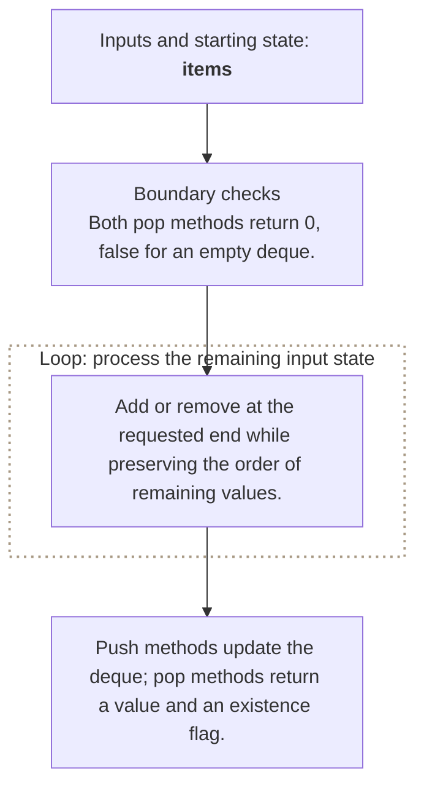

**Where it is used in real life:**

- Schedulers add urgent work at the front and normal work at the back.
- Window algorithms expire old indexes at one end and add candidates at the other.

```go
// Exact question: How can a deque accept and remove values at both ends?
//
// Example: PushBack(2), PushFront(1), PopFront() -> 1, and PopBack() -> 2.
//
// Possible answer: Store values in a slice and expose front and back operations.
//
// Output format: Push methods update the deque; pop methods return a value and an existence flag.
//
// Inline descriptions:
// - This teaching implementation favors clarity; removing the front copies remaining elements.
//
// Boundary checks:
// - Both pop methods return `0, false` for an empty deque.
//
// Key variables:
// - `items` is a slice whose indexes represent deque positions and whose elements are stored values.
// - Index zero is the front and index `len(items)-1` is the back.
//
// Logic:
// 1. Add or remove at the requested end while preserving the order of remaining values.
type TeachingDeque struct {
	items []int
}

func (deque *TeachingDeque) PushFront(value int) {
	deque.items = append([]int{value}, deque.items...)
}

func (deque *TeachingDeque) PushBack(value int) {
	deque.items = append(deque.items, value)
}

func (deque *TeachingDeque) PopFront() (int, bool) {
	if len(deque.items) == 0 {
		return 0, false
	}
	value := deque.items[0]
	deque.items = deque.items[1:]
	return value, true
}

func (deque *TeachingDeque) PopBack() (int, bool) {
	if len(deque.items) == 0 {
		return 0, false
	}
	last := len(deque.items) - 1
	value := deque.items[last]
	deque.items = deque.items[:last]
	return value, true
}

// time complexity: O(n) -> `PushFront` copies existing elements; the other shown deque operations are O(1).
// space complexity: O(n) -> the deque stores up to `n` live values.
```

> **Baby analogy:** Imagine children waiting in a lunch line. "Implement a Deque" is one small game played with the same pieces and rules.

---

## Interview checklist and next steps

Use this answer order during an interview:

1. Restate the input, output, and constraints.
2. Name the pattern and the invariant.
3. Explain the data structure roles before coding.
4. Handle boundary cases explicitly.
5. Walk through a small example.
6. Give time and space complexity with variable definitions.

Recommended practice order:
1. [Implement a Queue with a Head Index](#implement-a-queue-with-a-head-index)
2. [Design a Circular Queue](#design-a-circular-queue)
3. [Binary Tree Level Order Traversal](#binary-tree-level-order-traversal)
4. [Number of Islands with BFS](#number-of-islands-with-bfs)
5. [Rotting Oranges](#rotting-oranges)
6. [Sliding Window Maximum](#sliding-window-maximum)
7. [Multi-Source BFS](#multi-source-bfs)
8. [Recent Request Counter](#recent-request-counter)
9. [Minimum Jumps](#minimum-jumps)
10. [Implement a Deque](#implement-a-deque)

Continue with: Implement Queue Using Stacks, Open the Lock, Walls and Gates, Shortest Path in Binary Matrix, Task Scheduler.

```mermaid
flowchart LR
    Q0["Implement a Queue with a Head Index"]
    Q0 --> Q1["Design a Circular Queue"]
    Q1 --> Q2["Binary Tree Level Order Traversal"]
    Q2 --> Q3["Number of Islands with BFS"]
    Q3 --> Q4["Rotting Oranges"]
    Q4 --> Q5["Sliding Window Maximum"]
    Q5 --> Q6["Multi-Source BFS"]
    Q6 --> Q7["Recent Request Counter"]
    Q7 --> Q8["Minimum Jumps"]
    Q8 --> Q9["Implement a Deque"]
```

> **Baby analogy:** Imagine children waiting in a lunch line. Pack the same checklist every time so no important interview step is forgotten.
