# Stacks — A Compact Interview Guide

A stack processes the most recently added item first. It models unfinished nested work, reversal, and nearest unresolved relationships.

- [Mental model](#mental-model)
- [Representation and core operations](#representation-and-core-operations)
- [Interview patterns and complexity](#interview-patterns-and-complexity)
- [Problem-solving checklist and common mistakes](#problem-solving-checklist-and-common-mistakes)
- [Top 10 Stack Interview Questions](#top-10-stack-interview-questions)
- [Interview checklist and next steps](#interview-checklist-and-next-steps)

> **Baby analogy:** Imagine a pile of dinner plates. The guide shows where every piece belongs before you start moving the pieces.

---

## Mental model

Push adds to the top, pop removes from the top, and peek reads the top. The last-in, first-out rule matches recursion and nested structures.

| Real system | How the topic appears |
| --- | --- |
| Compilers | Parse nested expressions and blocks |
| Editors | Undo the most recent command |
| Runtimes | Call stacks remember active functions |
| Browsers | Back navigation returns to recent pages |

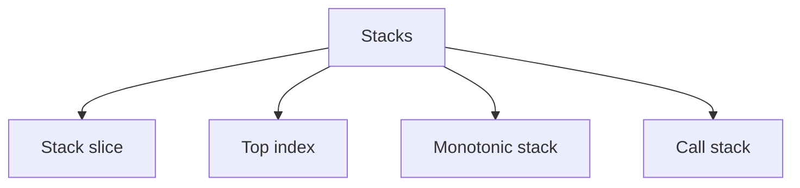

> **Baby analogy:** Imagine a pile of dinner plates. The last plate placed on top is the first plate you can take.

---

## Representation and core operations

State whether the stack holds values, indexes, operators, nodes, or complete state records. The element role determines how it is used.

| Representation | Role |
| --- | --- |
| Stack slice | Indexes are depth positions; elements are pending values |
| Top index | Position of the most recent element |
| Monotonic stack | Pending indexes kept in increasing or decreasing value order |
| Call stack | Hidden frames for recursive work |

| Operation | Typical cost | Meaning |
| --- | --- | --- |
| Push | O(1) amortized | Append to top |
| Pop | O(1) | Remove last element |
| Peek | O(1) | Read last element |
| Monotonic scan | O(n) | Each item is pushed and popped at most once |
| Iterative DFS | O(V+E) | Stack stores pending vertices |

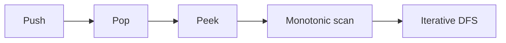

> **Baby analogy:** Imagine a pile of dinner plates. Only the top plate moves, so push and pop do not disturb plates below.

---

## Interview patterns and complexity

| Question clue | Pattern | Practice problems in this guide |
| --- | --- | --- |
| Nested delimiters | Matching stack | [Valid Parentheses](#valid-parentheses) |
| Nearest greater or smaller | Monotonic stack | [Daily Temperatures](#daily-temperatures), [Next Greater Element](#next-greater-element), [Largest Rectangle](#largest-rectangle-in-a-histogram) |
| Undo, reversal, or collision history | History stack | [Undo Latest Action](#undo-latest-action), [Reverse Text](#reverse-text-with-a-stack), [Asteroid Collision](#asteroid-collision) |
| Expression evaluation | Operand stack | [Evaluate Reverse Polish Notation](#evaluate-reverse-polish-notation) |
| Deep traversal | Explicit DFS stack | [Iterative Graph DFS](#iterative-graph-dfs) |
| Constant-time minimum | Value and minimum stack | [Min Stack](#min-stack) |

| Work | Complexity | Reason |
| --- | --- | --- |
| Basic operation | O(1) amortized | Only top changes |
| Stored stack | O(n) | Pending items may all remain |
| Recursive depth | O(h) | One frame per active level |
| Monotonic algorithm | O(n) | Each index enters and leaves once |

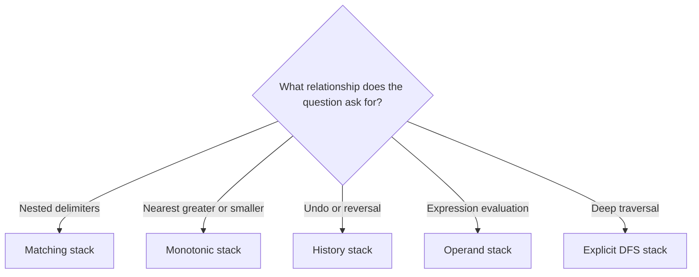

> **Baby analogy:** Imagine a pile of dinner plates. Stacks remember unfinished openings, recent history, and items waiting for a greater or smaller neighbor.

---

## Problem-solving checklist and common mistakes

Before coding:

1. State exactly what the indexes, keys, pointers, states, or worklist elements represent.
2. Write the empty-input and smallest-input boundary behavior.
3. Choose the invariant that remains true after every step.
4. Trace one normal example and one edge case.
5. State whether output storage is included in space complexity.

Common mistakes:
- Popping without checking emptiness.
- Forgetting operator operand order in postfix evaluation.
- Storing values when an expiring index is required.
- Using the wrong monotonic direction.
- Forgetting to remove resolved items.
- Assuming recursion uses constant space.

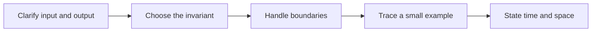

> **Baby analogy:** Imagine a pile of dinner plates. Look before taking a plate, or you may grab from an empty table.

---

## Top 10 Stack Interview Questions

These are the single authoritative implementations in this guide. Each solution keeps the required question, answer, output, boundary, variable-role, logic, and complexity comments.

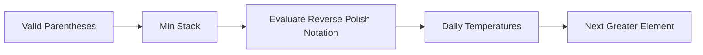

> **Baby analogy:** Imagine a pile of dinner plates. These ten puzzles are practice cards; each card teaches one reusable move.

### Valid Parentheses

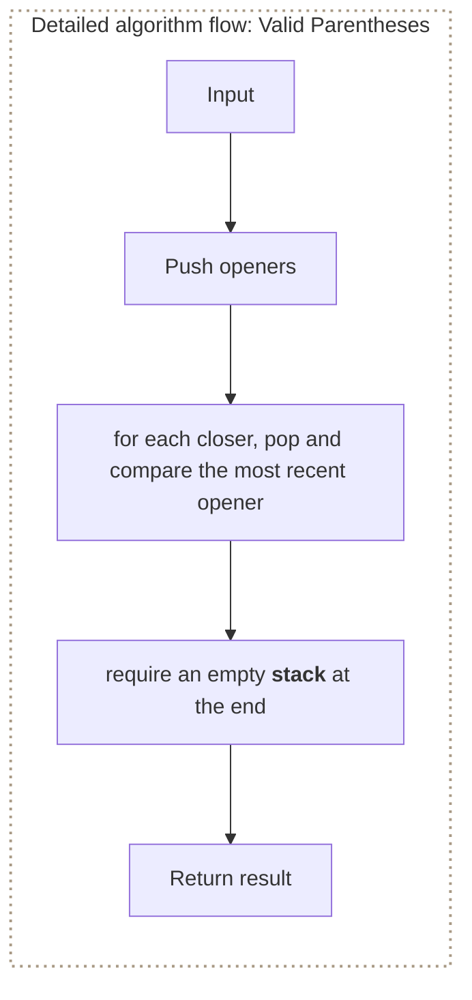

**Where it is used in real life:**

- Compilers validate nested brackets.
- Configuration parsers reject malformed grouping.

```go
// Exact question: Given a string containing only parentheses, brackets, and braces, return whether every opener is closed by the correct type in the correct order.
//
// Example: Input text = ([]{}) -> output true; input ([)] -> output false.
//
// Possible answer: Push openers; for each closer, pop and compare the most recent opener, then require an empty stack at the end.
//
// Output format: Return a `bool` value from `isValid`; the function does not print the answer.
//
// Inline descriptions:
// - `s` is the string input used by this example.
//
// Boundary checks:
// - `len(stack) == 0` handles empty input before any element is accessed.
// - `top != matching[ch]` decides whether the branch or loop should continue for the current input.
//
// Key variables:
// - `s` is the string input used by this example.
// - `stack` is a slice whose elements hold the ordered values produced or awaiting processing.
// - `matching` maps each closing-delimiter key to the opening rune required at the stack top.
// - `top` holds the intermediate value produced by `stack[len(stack)-1]`.
//
// Logic:
// 1. Create or use a map to associate each lookup key with its stored value.
// 2. Create or use a slice so indexes identify positions and elements store their data or state.
// 3. Iterate through the required elements or states in the order shown.
func isValid(s string) bool {
	stack := make([]rune, 0, len(s))

	matching := map[rune]rune{
		')': '(',
		']': '[',
		'}': '{',
	}

	for _, ch := range s {
		switch ch {
		case '(', '[', '{':
			stack = append(stack, ch)

		case ')', ']', '}':
			if len(stack) == 0 {
				return false
			}

			top := stack[len(stack)-1]
			stack = stack[:len(stack)-1]

			if top != matching[ch] {
				return false
			}
		}
	}

	return len(stack) == 0
}

// time complexity: O(n) -> the algorithm visits each of the `n` input elements or states once.
// space complexity: O(n) -> the auxiliary slice, map, table, queue, or returned collection can grow with `n`.
```

> **Baby analogy:** Imagine a pile of dinner plates. "Valid Parentheses" is one small game played with the same pieces and rules.

### Min Stack

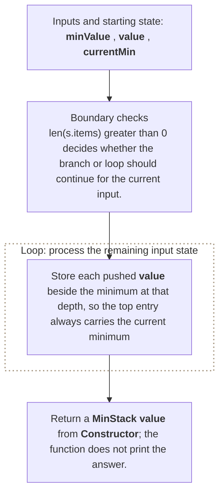

**Where it is used in real life:**

- Monitoring stacks retrieve the current minimum alongside recent samples.
- Algorithms maintain a running minimum with rollback.

```go
// Exact question: Design a stack that supports push, pop, top, and retrieving the minimum value in O(1) time per operation.
//
// Example: Push 3, 1, 2 -> GetMin returns 1; Pop removes 2 and Top returns 1.
//
// Possible answer: Store each pushed value beside the minimum at that depth, so the top entry always carries the current minimum.
//
// Output format: Return a `MinStack` value from `Constructor`; the function does not print the answer.
//
// Inline descriptions:
// - The comments in this preface describe how the important expressions and state changes are used.
//
// Boundary checks:
// - `len(s.items) > 0` decides whether the branch or loop should continue for the current input.
// - `currentMin < minValue` decides whether the branch or loop should continue for the current input.
//
// Key variables:
// - `minValue` holds the intermediate value produced by `value`.
// - `currentMin` holds the value for the state currently being calculated.
//
// Logic:
// 1. Create or use a slice so indexes identify positions and elements store their data or state.
// 2. Recursively reduce the current problem to smaller calls until a base condition is reached.
// 3. Return the value produced after the state updates are complete.
type entry struct {
	value int
	min   int
}

type MinStack struct {
	items []entry
}

func Constructor() MinStack {
	return MinStack{
		items: []entry{},
	}
}

func (s *MinStack) Push(value int) {
	minValue := value

	if len(s.items) > 0 {
		currentMin := s.items[len(s.items)-1].min
		if currentMin < minValue {
			minValue = currentMin
		}
	}

	s.items = append(s.items, entry{
		value: value,
		min:   minValue,
	})
}

func (s *MinStack) Pop() {
	s.items = s.items[:len(s.items)-1]
}

func (s *MinStack) Top() int {
	return s.items[len(s.items)-1].value
}

func (s *MinStack) GetMin() int {
	return s.items[len(s.items)-1].min
}

// time complexity: O(1) -> the amortized stack operation performs fixed work except for occasional slice growth.
// space complexity: O(n) -> the auxiliary slice, map, table, queue, or returned collection can grow with `n`.
```

> **Baby analogy:** Imagine a pile of dinner plates. "Min Stack" is one small game played with the same pieces and rules.

### Evaluate Reverse Polish Notation

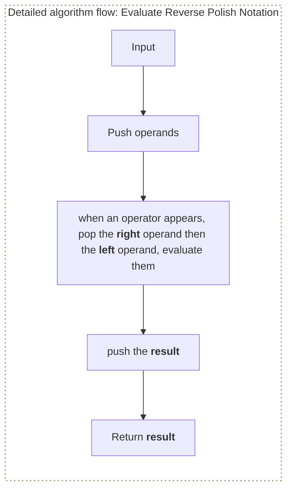

**Where it is used in real life:**

- Expression engines evaluate postfix bytecode.
- Calculators execute stack-oriented formulas.

```go
// Exact question: Evaluate an arithmetic expression supplied as valid Reverse Polish Notation tokens with integer division truncating toward zero.
//
// Example: Input tokens = [2, 1, +, 3, *] -> output 9 because (2 + 1) * 3 = 9.
//
// Possible answer: Push operands; when an operator appears, pop the right operand then the left operand, evaluate them, and push the result.
//
// Output format: Return an `int` value from `evalRPN`; the function does not print the answer.
//
// Inline descriptions:
// - `tokens` is a slice: the index identifies an element or state, and the stored item has type string.
//
// Boundary checks:
// - `err != nil` checks whether the referenced value exists before it is used.
//
// Key variables:
// - `tokens` is a slice: the index identifies an element or state, and the stored item has type string.
// - `result` holds the answer computed for the current operation.
// - `stack` is a slice whose elements hold the ordered values produced or awaiting processing.
// - `right` marks the current right boundary or right-side value.
// - `left` marks the current left boundary or left-side value.
//
// Logic:
// 1. Create or use a slice so indexes identify positions and elements store their data or state.
// 2. Iterate through the required elements or states in the order shown.
// 3. Return the value produced after the state updates are complete.
package main

import "strconv"

func evalRPN(tokens []string) int {
	stack := []int{}

	for _, token := range tokens {
		switch token {
		case "+", "-", "*", "/":
			right := stack[len(stack)-1]
			stack = stack[:len(stack)-1]

			left := stack[len(stack)-1]
			stack = stack[:len(stack)-1]

			var result int

			switch token {
			case "+":
				result = left + right
			case "-":
				result = left - right
			case "*":
				result = left * right
			case "/":
				result = left / right
			}

			stack = append(stack, result)

		default:
			value, err := strconv.Atoi(token)
			if err != nil {
				panic("invalid token")
			}

			stack = append(stack, value)
		}
	}

	return stack[0]
}

// time complexity: O(n) -> the algorithm visits each of the `n` input elements or states once.
// space complexity: O(n) -> the auxiliary slice, map, table, queue, or returned collection can grow with `n`.
```

> **Baby analogy:** Imagine a pile of dinner plates. "Evaluate Reverse Polish Notation" is one small game played with the same pieces and rules.

### Daily Temperatures

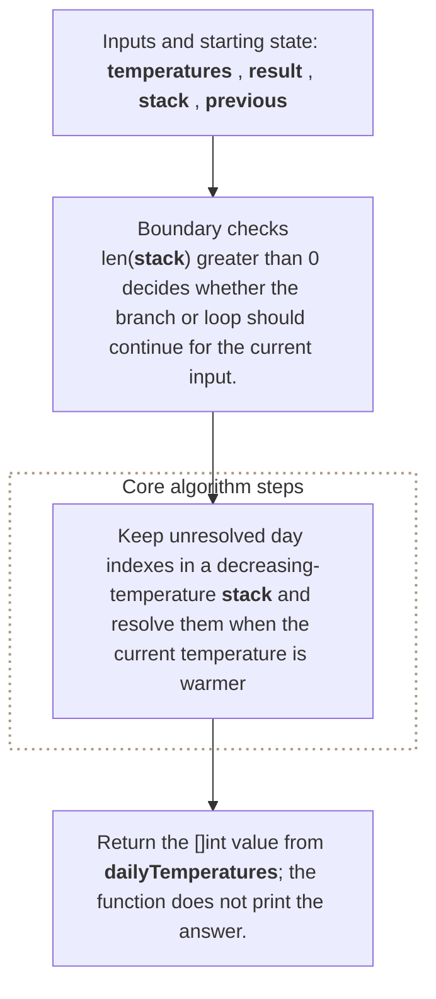

**Where it is used in real life:**

- Forecast analysis finds the next warmer future observation.
- Monitoring finds the next time a metric exceeds the current value.

```go
// Exact question: For each daily temperature, return how many days must pass before a warmer temperature, or zero if none occurs.
//
// Example: Input [73,74,75,71,69,72,76,73] -> output [1,1,4,2,1,1,0,0].
//
// Possible answer: Keep unresolved day indexes in a decreasing-temperature stack and resolve them when the current temperature is warmer.
//
// Output format: Return the `[]int` value from `dailyTemperatures`; the function does not print the answer.
//
// Inline descriptions:
// - `temperatures` is a slice: the index identifies an element or state, and the stored item has type int.
//
// Boundary checks:
// - `len(stack) > 0` decides whether the branch or loop should continue for the current input.
// - `temperatures[current] <= temperatures[previous]` decides whether the branch or loop should continue for the current input.
//
// Key variables:
// - `temperatures` is a slice: the index identifies an element or state, and the stored item has type int.
// - `result` is a slice whose elements hold the ordered values produced or awaiting processing.
// - `stack` is a slice whose elements hold the ordered values produced or awaiting processing.
// - `previous` holds the intermediate value produced by `stack[len(stack)-1]`.
//
// Logic:
// 1. Create or use a slice so indexes identify positions and elements store their data or state.
// 2. Iterate through the required elements or states in the order shown.
// 3. Return the value produced after the state updates are complete.
func dailyTemperatures(temperatures []int) []int {
	result := make([]int, len(temperatures))
	stack := []int{} // Stores indices

	for current := 0; current < len(temperatures); current++ {
		for len(stack) > 0 {
			previous := stack[len(stack)-1]

			if temperatures[current] <= temperatures[previous] {
				break
			}

			stack = stack[:len(stack)-1]
			result[previous] = current - previous
		}

		stack = append(stack, current)
	}

	return result
}

// time complexity: O(n) -> the algorithm visits each of the `n` input elements or states once.
// space complexity: O(n) -> the auxiliary slice, map, table, queue, or returned collection can grow with `n`.
```

> **Baby analogy:** Imagine a pile of dinner plates. "Daily Temperatures" is one small game played with the same pieces and rules.

### Next Greater Element

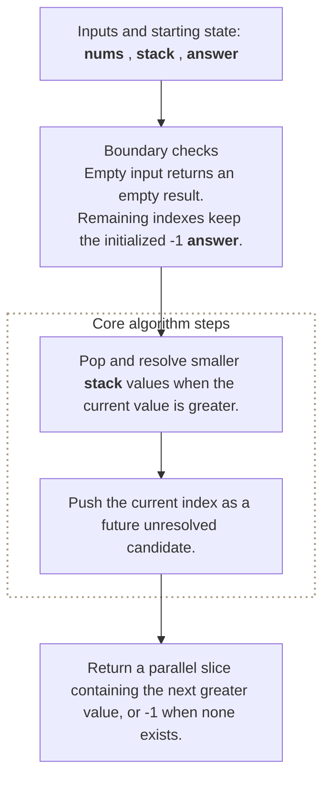

**Where it is used in real life:**

- Pricing finds the next later higher value.
- Capacity analysis finds when demand next exceeds each observation.

```go
// Exact question: For every number, what is the first greater value to its right?
//
// Example: Input [2,1,2,4,3] -> output [4,2,4,-1,-1].
//
// Possible answer: Keep unresolved indexes in a decreasing stack and resolve them when a greater value appears.
//
// Output format: Return a parallel slice containing the next greater value, or `-1` when none exists.
//
// Inline descriptions:
// - An index stays on the stack only while its answer has not been found.
//
// Boundary checks:
// - Empty input returns an empty result.
// - Remaining indexes keep the initialized `-1` answer.
//
// Key variables:
// - `nums` is a slice whose indexes are positions and whose elements are compared values.
// - `stack` stores unresolved indexes; their referenced values decrease toward the top.
// - `answer` is a parallel slice whose indexes match `nums` and whose elements are next-greater values.
//
// Logic:
// 1. Pop and resolve smaller stack values when the current value is greater.
// 2. Push the current index as a future unresolved candidate.
func nextGreaterValues(nums []int) []int {
	answer := make([]int, len(nums))
	for index := range answer {
		answer[index] = -1
	}
	stack := []int{}
	for index, value := range nums {
		for len(stack) > 0 && nums[stack[len(stack)-1]] < value {
			unresolved := stack[len(stack)-1]
			stack = stack[:len(stack)-1]
			answer[unresolved] = value
		}
		stack = append(stack, index)
	}
	return answer
}

// time complexity: O(n) -> every index is pushed once and popped at most once.
// space complexity: O(n) -> the unresolved-index stack can contain all input positions, excluding returned output.
```

> **Baby analogy:** Imagine a pile of dinner plates. "Next Greater Element" is one small game played with the same pieces and rules.

### Largest Rectangle in a Histogram

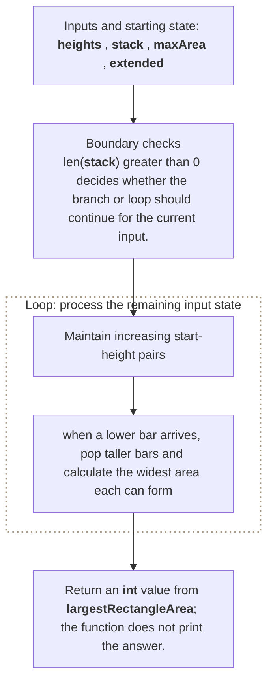

**Where it is used in real life:**

- Image processing finds largest rectangular regions in binary rows.
- Capacity planning finds maximum area under limiting heights.

```go
// Exact question: Given histogram bar heights of unit width, return the largest rectangular area contained in the histogram.
//
// Example: Input heights = [2,1,5,6,2,3] -> output area 10 from the bars of heights 5 and 6.
//
// Possible answer: Maintain increasing start-height pairs; when a lower bar arrives, pop taller bars and calculate the widest area each can form.
//
// Output format: Return an `int` value from `largestRectangleArea`; the function does not print the answer.
//
// Inline descriptions:
// - `heights` is a slice: the index identifies an element or state, and the stored item has type int.
//
// Boundary checks:
// - `len(stack) > 0` decides whether the branch or loop should continue for the current input.
// - `area > maxArea` decides whether the branch or loop should continue for the current input.
//
// Key variables:
// - `heights` is a slice: the index identifies an element or state, and the stored item has type int.
// - `stack` is a slice whose elements hold the ordered values produced or awaiting processing.
// - `maxArea` holds the intermediate value produced by `0`.
// - `extended` holds the intermediate value produced by `append(append([]int{}, heights...), 0`.
// - `topIndex` holds the intermediate value produced by `stack[len(stack)-1]`.
//
// Logic:
// 1. Create or use a slice so indexes identify positions and elements store their data or state.
// 2. Iterate through the required elements or states in the order shown.
// 3. Return the value produced after the state updates are complete.
func largestRectangleArea(heights []int) int {
	stack := []int{}
	maxArea := 0

	// Add a zero-height bar to flush all remaining bars.
	extended := append(append([]int{}, heights...), 0)

	for i, currentHeight := range extended {
		for len(stack) > 0 &&
			extended[stack[len(stack)-1]] > currentHeight {

			topIndex := stack[len(stack)-1]
			stack = stack[:len(stack)-1]

			height := extended[topIndex]

			width := i
			if len(stack) > 0 {
				width = i - stack[len(stack)-1] - 1
			}

			area := height * width
			if area > maxArea {
				maxArea = area
			}
		}

		stack = append(stack, i)
	}

	return maxArea
}

// time complexity: O(n) -> the algorithm visits each of the `n` input elements or states once.
// space complexity: O(n) -> the auxiliary slice, map, table, queue, or returned collection can grow with `n`.
```

> **Baby analogy:** Imagine a pile of dinner plates. "Largest Rectangle in a Histogram" is one small game played with the same pieces and rules.

### Iterative Graph DFS

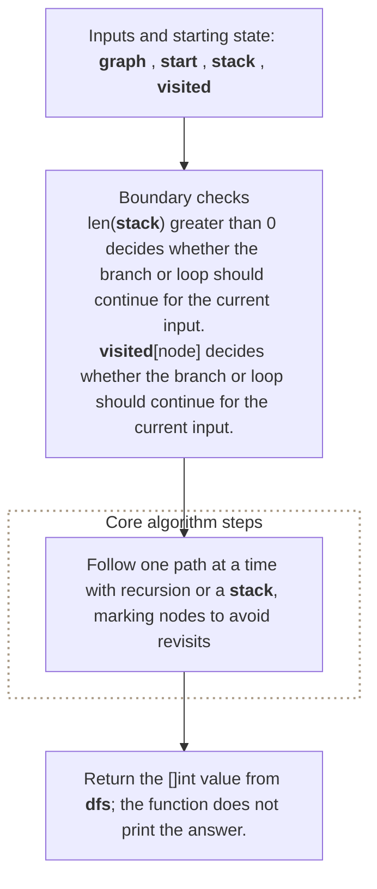

**Where it is used in real life:**

- Graph tools avoid recursion limits on deep traversals.
- Workflow engines explicitly manage pending dependency exploration.

```go
// Exact question: Given an adjacency list and a start vertex, return vertices in iterative depth-first traversal order without revisiting a vertex.
//
// Example: Input chain adjacency 0:[1], 1:[2], 2:[] and start = 0 -> output traversal [0,1,2].
//
// Possible answer: Follow one path at a time with recursion or a stack, marking nodes to avoid revisits.
//
// Output format: Return the `[]int` value from `dfs`; the function does not print the answer.
//
// Inline descriptions:
// - `graph` is a map: each key is int, and each value is []int.
// - `start` is the int input used by this example.
//
// Boundary checks:
// - `len(stack) > 0` decides whether the branch or loop should continue for the current input.
// - `visited[node]` decides whether the branch or loop should continue for the current input.
// - `!visited[neighbor]` decides whether the branch or loop should continue for the current input.
//
// Key variables:
// - `graph` is a map: each key is int, and each value is []int.
// - `start` is the int input used by this example.
// - `stack` is a slice whose elements hold the ordered values produced or awaiting processing.
// - `visited` maps vertex-ID keys to booleans recording whether that vertex has already been discovered.
// - `order` is a slice whose elements hold the ordered values produced or awaiting processing.
//
// Logic:
// 1. Create or use a map to associate each lookup key with its stored value.
// 2. Create or use a slice so indexes identify positions and elements store their data or state.
// 3. Iterate through the required elements or states in the order shown.
func dfs(graph map[int][]int, start int) []int {
	stack := []int{start}
	visited := map[int]bool{}
	order := []int{}

	for len(stack) > 0 {
		node := stack[len(stack)-1]
		stack = stack[:len(stack)-1]

		if visited[node] {
			continue
		}

		visited[node] = true
		order = append(order, node)

		neighbors := graph[node]

		// Reverse iteration preserves natural left-to-right order.
		for i := len(neighbors) - 1; i >= 0; i-- {
			neighbor := neighbors[i]
			if !visited[neighbor] {
				stack = append(stack, neighbor)
			}
		}
	}

	return order
}

// time complexity: O(V + E) -> each reachable vertex is processed once and each edge is examined once.
// space complexity: O(V) -> the visited state, queue, stack, or result can hold one entry per vertex.
```

> **Baby analogy:** Imagine a pile of dinner plates. "Iterative Graph DFS" is one small game played with the same pieces and rules.

### Asteroid Collision

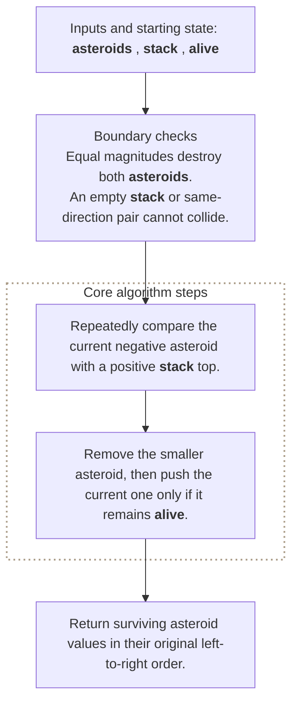

**Where it is used in real life:**

- Physics simulations resolve one-dimensional opposing events.
- Stream processors cancel incompatible adjacent states.

```go
// Exact question: Given moving asteroids, which values remain after all head-on collisions?
//
// Example: Input asteroids = [5, 10, -5] -> output [5, 10].
//
// Possible answer: Keep stable asteroids on a stack and resolve collisions against its positive top.
//
// Output format: Return surviving asteroid values in their original left-to-right order.
//
// Inline descriptions:
// - A collision is possible only when a positive stack top meets a negative current asteroid.
//
// Boundary checks:
// - Equal magnitudes destroy both asteroids.
// - An empty stack or same-direction pair cannot collide.
//
// Key variables:
// - `asteroids` is a slice whose indexes are positions and whose signed elements encode direction and size.
// - `stack` stores survivor values in left-to-right order.
// - `alive` records whether the current asteroid survives all collisions.
//
// Logic:
// 1. Repeatedly compare the current negative asteroid with a positive stack top.
// 2. Remove the smaller asteroid, then push the current one only if it remains alive.
func asteroidCollision(asteroids []int) []int {
	stack := []int{}
	for _, asteroid := range asteroids {
		alive := true
		for alive && asteroid < 0 && len(stack) > 0 && stack[len(stack)-1] > 0 {
			top := stack[len(stack)-1]
			if top < -asteroid {
				stack = stack[:len(stack)-1]
				continue
			}
			if top == -asteroid {
				stack = stack[:len(stack)-1]
			}
			alive = false
		}
		if alive {
			stack = append(stack, asteroid)
		}
	}
	return stack
}

// time complexity: O(n) -> each asteroid is pushed once and popped at most once.
// space complexity: O(n) -> every asteroid may survive on the stack.
```

> **Baby analogy:** Imagine a pile of dinner plates. "Asteroid Collision" is one small game played with the same pieces and rules.

### Undo Latest Action

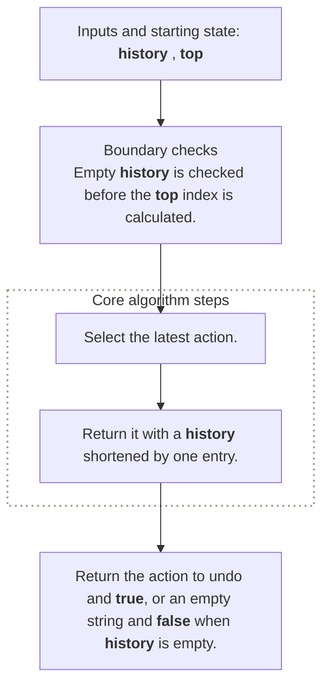

**Where it is used in real life:**

- Editors restore the most recent command.
- Transactional tools roll back the newest reversible operation.

```go
// Exact question: How can a stack implement undo so the latest action is reversed first?
//
// Example: Input history = [type A, delete B] -> undo returns delete B and leaves [type A].
//
// Possible answer: Append each action and remove the final stored action when undo is requested.
//
// Output format: Return the action to undo and `true`, or an empty string and `false` when history is empty.
//
// Inline descriptions:
// - The final slice element represents the most recently completed action.
//
// Boundary checks:
// - Empty history is checked before the top index is calculated.
//
// Key variables:
// - `history` is a slice whose indexes are action order and whose elements are action descriptions.
// - `top` is the most recent action's index.
//
// Logic:
// 1. Select the latest action.
// 2. Return it with a history shortened by one entry.
func undoLatest(history []string) ([]string, string, bool) {
	if len(history) == 0 {
		return history, "", false
	}
	top := len(history) - 1
	action := history[top]
	return history[:top], action, true
}

// time complexity: O(1) -> the function reads and removes one final slice element.
// space complexity: O(1) -> the returned slice header shares the existing backing storage.
```

> **Baby analogy:** Imagine a pile of dinner plates. "Undo Latest Action" is one small game played with the same pieces and rules.

### Reverse Text with a Stack

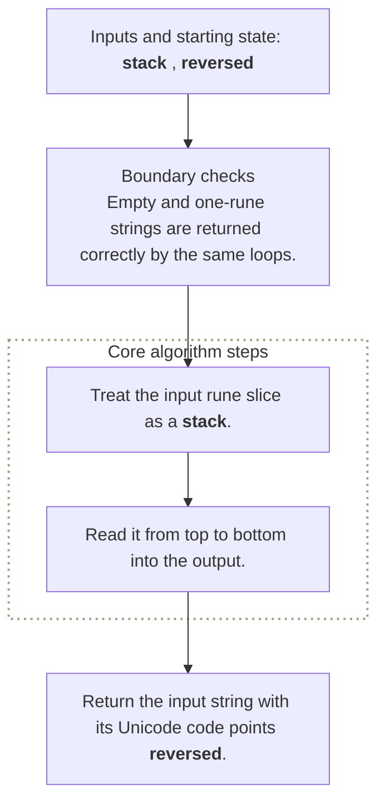

**Where it is used in real life:**

- Education tools demonstrate LIFO reversal.
- Parsers reverse token order during transformations.

```go
// Exact question: Given UTF-8 text, return its Unicode code points in reverse order without corrupting multibyte characters.
//
// Example: Input text = Go🙂 -> output 🙂oG without splitting the emoji's UTF-8 bytes.
//
// Possible answer: Push runes in reading order and pop them into the result from the end.
//
// Output format: Return the input string with its Unicode code points reversed.
//
// Inline descriptions:
// - Using runes avoids splitting a multi-byte UTF-8 code point into invalid bytes.
//
// Boundary checks:
// - Empty and one-rune strings are returned correctly by the same loops.
//
// Key variables:
// - `stack` is a rune slice whose indexes are depths and whose elements are Unicode code points.
// - `reversed` is a rune slice whose indexes are output positions and whose elements are popped runes.
//
// Logic:
// 1. Treat the input rune slice as a stack.
// 2. Read it from top to bottom into the output.
func reverseWithStack(text string) string {
	stack := []rune(text)
	reversed := make([]rune, 0, len(stack))
	for index := len(stack) - 1; index >= 0; index-- {
		reversed = append(reversed, stack[index])
	}
	return string(reversed)
}

// time complexity: O(n) -> each of the `n` runes is read and written once.
// space complexity: O(n) -> rune storage and the returned reversed text grow with input length.
```

> **Baby analogy:** Imagine a pile of dinner plates. "Reverse Text with a Stack" is one small game played with the same pieces and rules.

---

## Interview checklist and next steps

Use this answer order during an interview:

1. Restate the input, output, and constraints.
2. Name the pattern and the invariant.
3. Explain the data structure roles before coding.
4. Handle boundary cases explicitly.
5. Walk through a small example.
6. Give time and space complexity with variable definitions.

Recommended practice order:
1. [Valid Parentheses](#valid-parentheses)
2. [Min Stack](#min-stack)
3. [Evaluate Reverse Polish Notation](#evaluate-reverse-polish-notation)
4. [Daily Temperatures](#daily-temperatures)
5. [Next Greater Element](#next-greater-element)
6. [Largest Rectangle in a Histogram](#largest-rectangle-in-a-histogram)
7. [Iterative Graph DFS](#iterative-graph-dfs)
8. [Asteroid Collision](#asteroid-collision)
9. [Undo Latest Action](#undo-latest-action)
10. [Reverse Text with a Stack](#reverse-text-with-a-stack)

Continue with: Car Fleet, Decode String, Simplify Path, Basic Calculator, Remove K Digits.

```mermaid
flowchart LR
    Q0["Valid Parentheses"]
    Q0 --> Q1["Min Stack"]
    Q1 --> Q2["Evaluate Reverse Polish Notation"]
    Q2 --> Q3["Daily Temperatures"]
    Q3 --> Q4["Next Greater Element"]
    Q4 --> Q5["Largest Rectangle in a Histogram"]
    Q5 --> Q6["Iterative Graph DFS"]
    Q6 --> Q7["Asteroid Collision"]
    Q7 --> Q8["Undo Latest Action"]
    Q8 --> Q9["Reverse Text with a Stack"]
```

> **Baby analogy:** Imagine a pile of dinner plates. Pack the same checklist every time so no important interview step is forgotten.
