# Strings in Go — A Compact Interview Guide

A Go string is an immutable sequence of bytes, usually containing UTF-8 text. Interview solutions must deliberately choose byte indexing or rune processing.

- [Mental model](#mental-model)
- [Representation and core operations](#representation-and-core-operations)
- [Interview patterns and complexity](#interview-patterns-and-complexity)
- [Problem-solving checklist and common mistakes](#problem-solving-checklist-and-common-mistakes)
- [Top 10 String Interview Questions](#top-10-string-interview-questions)
- [Interview checklist and next steps](#interview-checklist-and-next-steps)

> **Baby analogy:** Imagine letter tiles laid in a row. The guide shows where every piece belongs before you start moving the pieces.

---

## Mental model

Indexes into a string are byte offsets. Range iteration decodes runes. The correct unit depends on whether the problem promises ASCII or accepts general Unicode text.

| Real system | How the topic appears |
| --- | --- |
| Search | Queries, tokens, prefixes, and matching |
| Compilers | Source text becomes tokens and syntax |
| Protocols | Messages are parsed from byte sequences |
| Internationalized UI | UTF-8 text contains variable-width characters |

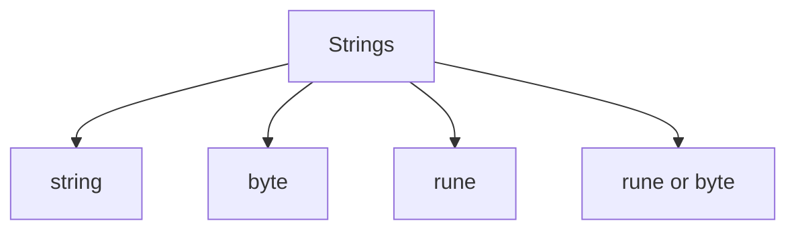

> **Baby analogy:** Imagine letter tiles laid in a row. A byte is one tiny tile; some Unicode letters need several byte tiles but become one rune card.

---

## Representation and core operations

State whether positions are byte offsets or rune positions. A rune is not always a complete user-perceived character, but it is safer than bytes for code-point logic.

| Representation | Role |
| --- | --- |
| string | Immutable byte sequence |
| byte | One raw octet; suitable for ASCII constraints |
| rune | One Unicode code point |
| []rune or []byte | Mutable indexed working representation |

| Operation | Typical cost | Meaning |
| --- | --- | --- |
| Byte access | O(1) | Read one byte offset |
| Rune conversion | O(n) | Decode the full string |
| Substring scan | O(length) | Inspect selected bytes |
| Builder append | Amortized O(1) | Accumulate output efficiently |
| Repeated concatenation | Can reach O(n²) | Copy growing prefixes repeatedly |

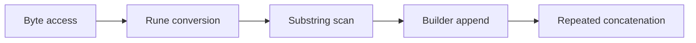

> **Baby analogy:** Imagine letter tiles laid in a row. Reading a known byte tile is immediate, while rebuilding a growing word repeatedly copies earlier tiles.

---

## Interview patterns and complexity

| Question clue | Pattern | Practice problems in this guide |
| --- | --- | --- |
| Palindrome or ordered comparison | Two pointers or center expansion | [Valid Palindrome](#valid-palindrome), [Longest Palindromic Substring](#longest-palindromic-substring), [Is Subsequence](#is-subsequence) |
| Longest or smallest valid substring | Sliding window | [Longest Substring Without Repeating Characters](#longest-substring-without-repeating-characters), [Minimum Window Substring](#minimum-window-substring) |
| Character counts | Frequency array or map | [Valid Anagram](#valid-anagram) |
| Equivalent groups | Canonical signature | [Group Anagrams](#group-anagrams) |
| Mutable output | Read and write indexes | [String Compression](#string-compression), [Reverse a String](#reverse-a-string) |
| Unicode-safe character work | Rune conversion | [Rune-Safe Character Access](#rune-safe-character-access) |

| Work | Complexity | Reason |
| --- | --- | --- |
| Full scan | O(n) | Inspect each byte or rune |
| Fixed alphabet counts | O(1) auxiliary | Array size is constant |
| Unicode frequency map | O(k) | One key per distinct rune |
| Returned text | O(n) | Output contains copied bytes |

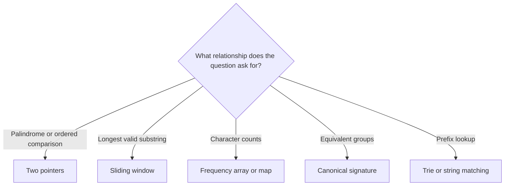

> **Baby analogy:** Imagine letter tiles laid in a row. Use two hands from the ends, a moving frame for substrings, or labeled cups for character counts.

---

## Problem-solving checklist and common mistakes

Before coding:

1. State exactly what the indexes, keys, pointers, states, or worklist elements represent.
2. Write the empty-input and smallest-input boundary behavior.
3. Choose the invariant that remains true after every step.
4. Trace one normal example and one edge case.
5. State whether output storage is included in space complexity.

Common mistakes:
- Treating byte indexes as character indexes for Unicode.
- Trying to mutate a Go string directly.
- Moving a sliding-window left pointer backward.
- Using repeated concatenation for large output.
- Forgetting to remove counts as a window shrinks.
- Calling nested-looking two-pointer work O(n²) without counting pointer movement.

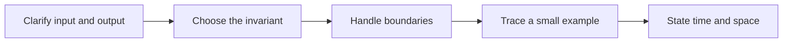

> **Baby analogy:** Imagine letter tiles laid in a row. First decide whether the game counts tiny byte tiles or complete rune cards.

---

## Top 10 String Interview Questions

These are the single authoritative implementations in this guide. Each solution keeps the required question, answer, output, boundary, variable-role, logic, and complexity comments.

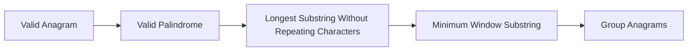

> **Baby analogy:** Imagine letter tiles laid in a row. These ten puzzles are practice cards; each card teaches one reusable move.

### Valid Anagram

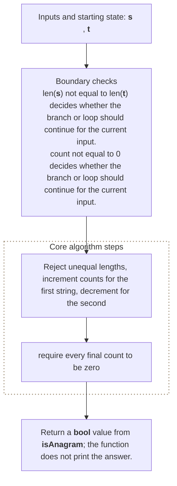

**Where it is used in real life:**

- Search systems normalize and compare letter inventories.
- Word games validate rearrangements.

```go
// Exact question: Given two strings, return whether one is an anagram of the other with identical byte frequencies.
//
// Example: Input first = anagram and second = nagaram -> output true.
//
// Possible answer: Reject unequal lengths, increment counts for the first string, decrement for the second, and require every final count to be zero.
//
// Output format: Return a `bool` value from `isAnagram`; the function does not print the answer.
//
// Inline descriptions:
// - `s` is the string input used by this example.
// - `t` is the string input used by this example.
//
// Boundary checks:
// - `len(s) != len(t)` decides whether the branch or loop should continue for the current input.
// - `count != 0` decides whether the branch or loop should continue for the current input.
//
// Key variables:
// - `s` is the string input used by this example.
// - `t` is the string input used by this example.
// - `counts[letter-'a']` stores the net frequency difference for one lowercase English letter.
//
// Logic:
// 1. Iterate through the required elements or states in the order shown.
// 2. Return the value produced after the state updates are complete.
func isAnagram(s, t string) bool {
    if len(s) != len(t) {
        return false
    }

    counts := [26]int{}

    for i := 0; i < len(s); i++ {
        counts[s[i]-'a']++
        counts[t[i]-'a']--
    }

    for _, count := range counts {
        if count != 0 {
            return false
        }
    }

    return true
}

// time complexity: O(n) -> the algorithm visits each of the `n` input elements or states once.
// space complexity: O(1) -> only a fixed number of scalar variables or references is kept.
```

> **Baby analogy:** Imagine letter tiles laid in a row. "Valid Anagram" is one small game played with the same pieces and rules.

### Valid Palindrome

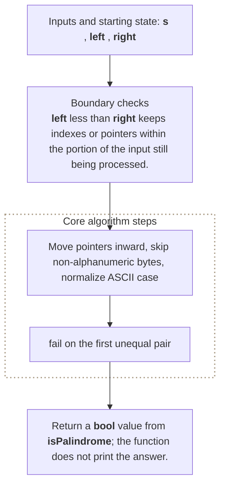

**Where it is used in real life:**

- Data cleaning recognizes mirrored identifiers after normalization.
- Sequence validation checks symmetric tokens.

```go
// Exact question: Return whether a string reads the same forward and backward after ignoring non-alphanumeric bytes and ASCII letter case.
//
// Example: Input A man, a plan, a canal: Panama -> output true after filtering and case folding.
//
// Possible answer: Move pointers inward, skip non-alphanumeric bytes, normalize ASCII case, and fail on the first unequal pair.
//
// Output format: Return a `bool` value from `isPalindrome`; the function does not print the answer.
//
// Inline descriptions:
// - `s` is the string input used by this example.
//
// Boundary checks:
// - `left < right` keeps indexes or pointers within the portion of the input still being processed.
// - `left < right && !isAlphaNumeric(s[left])` keeps indexes or pointers within the portion of the input still being processed.
// - `left < right && !isAlphaNumeric(s[right])` keeps indexes or pointers within the portion of the input still being processed.
//
// Key variables:
// - `s` is the string input used by this example.
// - `left` marks the current left boundary or left-side value.
// - `right` marks the current right boundary or right-side value.
//
// Logic:
// 1. Iterate through the required elements or states in the order shown.
// 2. Recursively reduce the current problem to smaller calls until a base condition is reached.
// 3. Return the value produced after the state updates are complete.
func isPalindrome(s string) bool {
    left := 0
    right := len(s) - 1

    for left < right {
        for left < right && !isAlphaNumeric(s[left]) {
            left++
        }

        for left < right && !isAlphaNumeric(s[right]) {
            right--
        }

        if toLower(s[left]) != toLower(s[right]) {
            return false
        }

        left++
        right--
    }

    return true
}

func isAlphaNumeric(ch byte) bool {
    return (ch >= 'a' && ch <= 'z') ||
        (ch >= 'A' && ch <= 'Z') ||
        (ch >= '0' && ch <= '9')
}

func toLower(ch byte) byte {
    if ch >= 'A' && ch <= 'Z' {
        return ch + ('a' - 'A')
    }

    return ch
}

// time complexity: O(n) -> the algorithm visits each of the `n` input elements or states once.
// space complexity: O(1) -> only a fixed number of scalar variables or references is kept.
```

> **Baby analogy:** Imagine letter tiles laid in a row. "Valid Palindrome" is one small game played with the same pieces and rules.

### Longest Substring Without Repeating Characters

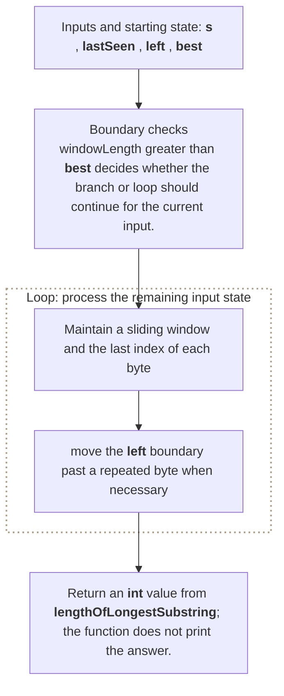

**Where it is used in real life:**

- Session analysis finds the longest span without repeated events.
- Text analysis finds maximal unique-character windows.

```go
// Exact question: Return the length of the longest contiguous substring containing no repeated byte.
//
// Example: Input text = abcabcbb -> output 3 for abc.
//
// Possible answer: Maintain a sliding window and the last index of each byte; move the left boundary past a repeated byte when necessary.
//
// Output format: Return an `int` value from `lengthOfLongestSubstring`; the function does not print the answer.
//
// Inline descriptions:
// - `s` is the string input used by this example.
//
// Boundary checks:
// - `windowLength > best` decides whether the branch or loop should continue for the current input.
//
// Key variables:
// - `s` is the string input used by this example.
// - `lastSeen` maps each byte key to the latest input index where that byte occurred.
// - `left` marks the current left boundary or left-side value.
// - `best` holds the intermediate value produced by `0`.
// - `ch` holds the intermediate value produced by `s[right]`.
//
// Logic:
// 1. Create or use a map to associate each lookup key with its stored value.
// 2. Iterate through the required elements or states in the order shown.
// 3. Return the value produced after the state updates are complete.
func lengthOfLongestSubstring(s string) int {
    lastSeen := make(map[byte]int)

    left := 0
    best := 0

    for right := 0; right < len(s); right++ {
        ch := s[right]

        if previousIndex, found := lastSeen[ch]; found &&
            previousIndex >= left {
            left = previousIndex + 1
        }

        lastSeen[ch] = right

        windowLength := right - left + 1
        if windowLength > best {
            best = windowLength
        }
    }

    return best
}

// time complexity: O(n) -> the algorithm visits each of the `n` input elements or states once.
// space complexity: O(n) -> the frequency map can store up to one entry for each distinct character in the input.
```

> **Baby analogy:** Imagine letter tiles laid in a row. "Longest Substring Without Repeating Characters" is one small game played with the same pieces and rules.

### Minimum Window Substring

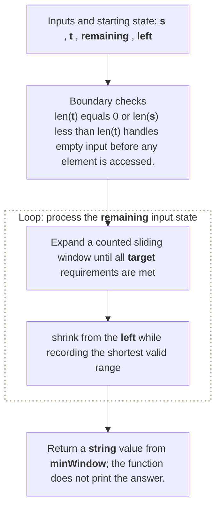

**Where it is used in real life:**

- Log analysis finds the smallest interval containing all required markers.
- Document search finds the tightest passage covering query terms.

```go
// Exact question: Given strings `source` and `target`, return the shortest source substring containing every target byte with its required multiplicity.
//
// Example: Input source = ADOBECODEBANC and target = ABC -> output BANC.
//
// Possible answer: Expand a counted sliding window until all target requirements are met, then shrink from the left while recording the shortest valid range.
//
// Output format: Return a `string` value from `minWindow`; the function does not print the answer.
//
// Inline descriptions:
// - `s` is the string input used by this example.
// - `t` is the string input used by this example.
//
// Boundary checks:
// - `len(t) == 0 || len(s) < len(t)` handles empty input before any element is accessed.
// - `required[rightCharacter] > 0` decides whether the branch or loop should continue for the current input.
// - `remaining == 0` handles the smallest valid state or recursive base case.
//
// Key variables:
// - `s` is the string input used by this example.
// - `t` is the string input used by this example.
// - `required[byteValue]` stores how many more copies the current window still needs; negative values are surplus copies.
// - `remaining` counts target bytes not yet satisfied by the current window.
// - `left` marks the current left boundary or left-side value.
//
// Logic:
// 1. Iterate through the required elements or states in the order shown.
// 2. Return the value produced after the state updates are complete.
func minWindow(s, t string) string {
    if len(t) == 0 || len(s) < len(t) {
        return ""
    }

    required := [256]int{}

    for i := 0; i < len(t); i++ {
        required[t[i]]++
    }

    remaining := len(t)
    left := 0

    bestStart := 0
    bestLength := len(s) + 1

    for right := 0; right < len(s); right++ {
        rightCharacter := s[right]

        if required[rightCharacter] > 0 {
            remaining--
        }

        required[rightCharacter]--

        for remaining == 0 {
            currentLength := right - left + 1

            if currentLength < bestLength {
                bestStart = left
                bestLength = currentLength
            }

            leftCharacter := s[left]
            required[leftCharacter]++

            if required[leftCharacter] > 0 {
                remaining++
            }

            left++
        }
    }

    if bestLength == len(s)+1 {
        return ""
    }

    return s[bestStart : bestStart+bestLength]
}

// time complexity: O(n + m) -> the algorithm visits each of the `n` input elements or states once.
// space complexity: O(1) -> only a fixed number of scalar variables or references is kept.
```

> **Baby analogy:** Imagine letter tiles laid in a row. "Minimum Window Substring" is one small game played with the same pieces and rules.

### Group Anagrams

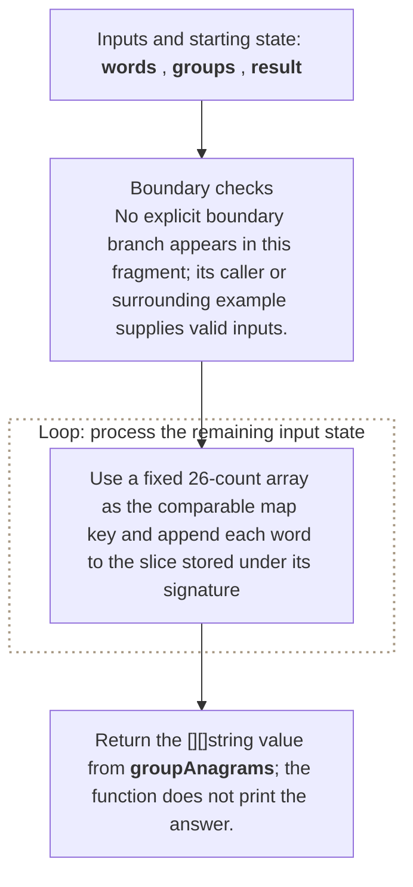

**Where it is used in real life:**

- Search indexing groups terms with the same character signature.
- Puzzle systems cluster letter rearrangements.

```go
// Exact question: Group strings whose lowercase English letters have identical frequencies.
//
// Example: Input words = [eat, tea, tan, ate, nat, bat] -> return three anagram groups.
//
// Possible answer: Use a fixed 26-count array as the comparable map key and append each word to the slice stored under its signature.
//
// Output format: Return the `[][]string` value from `groupAnagrams`; the function does not print the answer.
//
// Inline descriptions:
// - `words` is a slice: the index identifies an element or state, and the stored item has type string.
//
// Boundary checks:
// - No explicit boundary branch appears in this fragment; its caller or surrounding example supplies valid inputs.
//
// Key variables:
// - `words` is a slice: the index identifies an element or state, and the stored item has type string.
// - `groups` maps a comparable `[26]int` frequency-signature key to the words sharing that signature.
// - `result` stores the grouped word slices; group order is unspecified because map iteration is unordered.
// - `signature[letter-'a']` stores one word's frequency for that lowercase English letter.
//
// Logic:
// 1. Create or use a map to associate each lookup key with its stored value.
// 2. Create or use a slice so indexes identify positions and elements store their data or state.
// 3. Iterate through the required elements or states in the order shown.
func groupAnagrams(words []string) [][]string {
    groups := make(map[[26]int][]string)

    for _, word := range words {
        signature := [26]int{}

        for i := 0; i < len(word); i++ {
            signature[word[i]-'a']++
        }

        groups[signature] = append(groups[signature], word)
    }

    result := make([][]string, 0, len(groups))

    for _, group := range groups {
        result = append(result, group)
    }

    return result
}

// time complexity: O(m * k) -> the algorithm combines work across each dimension or choice represented in the product.
// space complexity: O(m * k) -> the auxiliary storage grows according to this bound.
```

> **Baby analogy:** Imagine letter tiles laid in a row. "Group Anagrams" is one small game played with the same pieces and rules.

### Longest Palindromic Substring

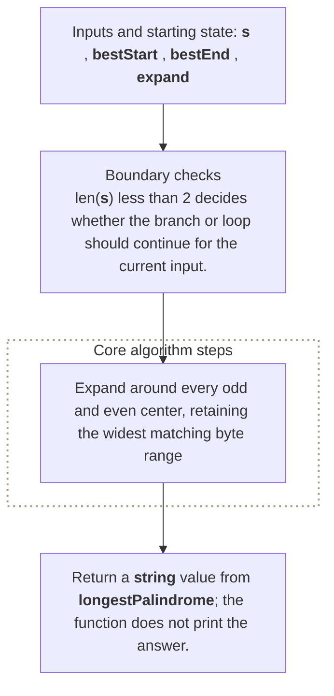

**Where it is used in real life:**

- DNA and sequence tools find symmetric regions.
- Text tools identify the longest mirrored segment.

```go
// Exact question: Given a string, return its longest contiguous palindromic substring.
//
// Example: Input text = cbbd -> output bb.
//
// Possible answer: Expand around every odd and even center, retaining the widest matching byte range.
//
// Output format: Return a `string` value from `longestPalindrome`; the function does not print the answer.
//
// Inline descriptions:
// - `s` is the string input used by this example.
//
// Boundary checks:
// - `len(s) < 2` decides whether the branch or loop should continue for the current input.
// - `oddEnd-oddStart > bestEnd-bestStart` decides whether the branch or loop should continue for the current input.
// - `evenEnd-evenStart > bestEnd-bestStart` decides whether the branch or loop should continue for the current input.
//
// Key variables:
// - `s` is the string input used by this example.
// - `bestStart` holds the intermediate value produced by `0`.
// - `bestEnd` holds the intermediate value produced by `0`.
// - `expand` holds the intermediate value produced by `func(left, right int) (int, int)`.
//
// Logic:
// 1. Iterate through the required elements or states in the order shown.
// 2. Return the value produced after the state updates are complete.
func longestPalindrome(s string) string {
    if len(s) < 2 {
        return s
    }

    bestStart := 0
    bestEnd := 0

    expand := func(left, right int) (int, int) {
        for left >= 0 &&
            right < len(s) &&
            s[left] == s[right] {
            left--
            right++
        }

        return left + 1, right - 1
    }

    for center := 0; center < len(s); center++ {
        oddStart, oddEnd := expand(center, center)

        if oddEnd-oddStart > bestEnd-bestStart {
            bestStart = oddStart
            bestEnd = oddEnd
        }

        evenStart, evenEnd := expand(center, center+1)

        if evenEnd-evenStart > bestEnd-bestStart {
            bestStart = evenStart
            bestEnd = evenEnd
        }
    }

    return s[bestStart : bestEnd+1]
}

// time complexity: O(n^2) -> nested traversal can compare or process every pair of input elements.
// space complexity: O(1) -> only a fixed number of scalar variables or references is kept.
```

> **Baby analogy:** Imagine letter tiles laid in a row. "Longest Palindromic Substring" is one small game played with the same pieces and rules.

### String Compression

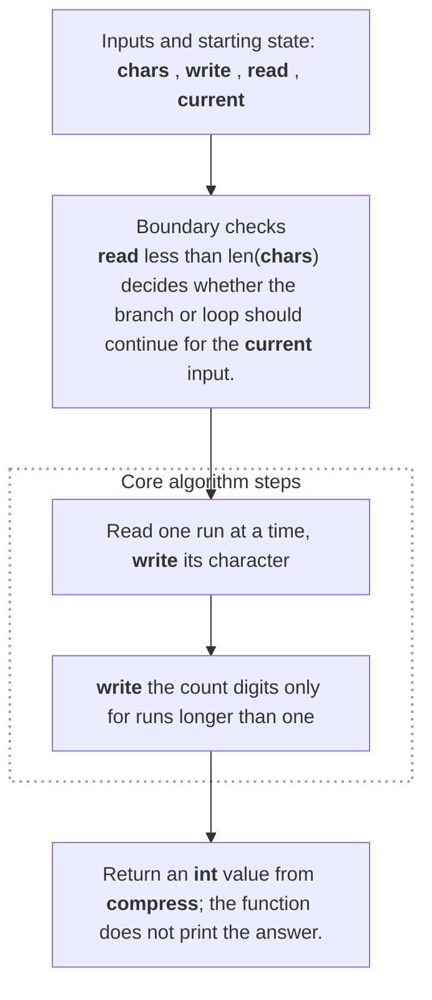

**Where it is used in real life:**

- Telemetry reduces repeated-symbol runs.
- Storage formats encode consecutive repeated values compactly.

```go
// Exact question: Compress consecutive character runs in place as the character followed by its decimal count when the count exceeds one, and return the new length.
//
// Example: Input characters = [a,a,b,b,c,c,c] -> new length 6 and written prefix [a,2,b,2,c,3].
//
// Possible answer: Read one run at a time, write its character, and write the count digits only for runs longer than one.
//
// Output format: Return an `int` value from `compress`; the function does not print the answer.
//
// Inline descriptions:
// - `chars` is a slice: the index identifies an element or state, and the stored item has type byte.
//
// Boundary checks:
// - `read < len(chars)` decides whether the branch or loop should continue for the current input.
// - `read < len(chars) && chars[read] == current` decides whether the branch or loop should continue for the current input.
// - `count > 1` decides whether the branch or loop should continue for the current input.
//
// Key variables:
// - `chars` is a slice: the index identifies an element or state, and the stored item has type byte.
// - `write` holds the intermediate value produced by `0`.
// - `read` holds the intermediate value produced by `0`.
// - `current` holds the value for the state currently being calculated.
// - `groupStart` holds the intermediate value produced by `read`.
//
// Logic:
// 1. Create or use a slice so indexes identify positions and elements store their data or state.
// 2. Iterate through the required elements or states in the order shown.
// 3. Return the value produced after the state updates are complete.
package main

import "strconv"

func compress(chars []byte) int {
    write := 0
    read := 0

    for read < len(chars) {
        current := chars[read]
        groupStart := read

        for read < len(chars) && chars[read] == current {
            read++
        }

        count := read - groupStart

        chars[write] = current
        write++

        if count > 1 {
            countString := strconv.Itoa(count)

            for i := 0; i < len(countString); i++ {
                chars[write] = countString[i]
                write++
            }
        }
    }

    return write
}

// time complexity: O(n) -> the algorithm visits each of the `n` input elements or states once.
// space complexity: O(1) -> only a fixed number of scalar variables or references is kept.
```

> **Baby analogy:** Imagine letter tiles laid in a row. "String Compression" is one small game played with the same pieces and rules.

### Is Subsequence

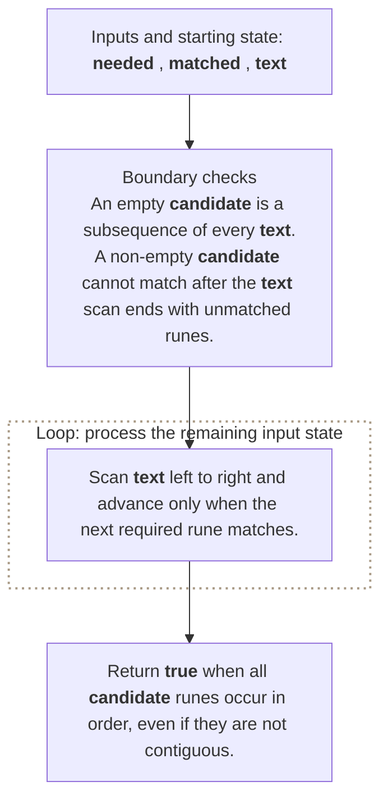

**Where it is used in real life:**

- Diff tools check whether an ordered sequence was preserved.
- Workflow auditing checks whether required events occurred in order.

```go
// Exact question: Is `candidate` a subsequence of `text`?
//
// Example: Input candidate = ace and text = abcde -> output true.
//
// Possible answer: Advance a candidate pointer whenever the next required rune appears while scanning the text.
//
// Output format: Return `true` when all candidate runes occur in order, even if they are not contiguous.
//
// Inline descriptions:
// - A subsequence preserves order but may skip positions; a substring may not skip positions.
//
// Boundary checks:
// - An empty candidate is a subsequence of every text.
// - A non-empty candidate cannot match after the text scan ends with unmatched runes.
//
// Key variables:
// - `needed` is a rune slice whose indexes are required subsequence positions and whose elements are candidate runes.
// - `matched` is the index of the next needed rune.
// - `text` supplies scanned runes in their original order.
//
// Logic:
// 1. Scan text left to right and advance only when the next required rune matches.
func isSubsequence(candidate, text string) bool {
	needed := []rune(candidate)
	matched := 0
	for _, character := range text {
		if matched < len(needed) && needed[matched] == character {
			matched++
		}
	}
	return matched == len(needed)
}

// time complexity: O(n + m) -> `n` text bytes and `m` candidate bytes are decoded and scanned.
// space complexity: O(m) -> the candidate's decoded rune slice is stored.
```

> **Baby analogy:** Imagine letter tiles laid in a row. "Is Subsequence" is one small game played with the same pieces and rules.

### Reverse a String

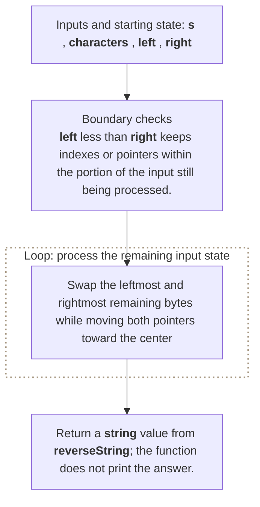

**Where it is used in real life:**

- Text transformations reverse token or rune order.
- Education tools demonstrate mutable rune buffers.

```go
// Exact question: Reverse a mutable byte slice in place.
//
// Example: Input bytes = [h,e,l,l,o] -> mutate them to [o,l,l,e,h].
//
// Possible answer: Swap the leftmost and rightmost remaining bytes while moving both pointers toward the center.
//
// Output format: Return a `string` value from `reverseString`; the function does not print the answer.
//
// Inline descriptions:
// - `s` is the string input used by this example.
//
// Boundary checks:
// - `left < right` keeps indexes or pointers within the portion of the input still being processed.
//
// Key variables:
// - `s` is the string input used by this example.
// - `characters` is the mutable byte slice; its indexes are byte positions and its elements are swapped in place.
// - `left` marks the current left boundary or left-side value.
// - `right` marks the current right boundary or right-side value.
//
// Logic:
// 1. Create or use a slice so indexes identify positions and elements store their data or state.
// 2. Iterate through the required elements or states in the order shown.
// 3. Return the value produced after the state updates are complete.
func reverseString(s string) string {
    characters := []rune(s)

    left := 0
    right := len(characters) - 1

    for left < right {
        characters[left], characters[right] =
            characters[right], characters[left]

        left++
        right--
    }

    return string(characters)
}

// time complexity: O(n) -> the algorithm visits each of the `n` input elements or states once.
// space complexity: O(n) -> the auxiliary slice, map, table, queue, or returned collection can grow with `n`.
```

> **Baby analogy:** Imagine letter tiles laid in a row. "Reverse a String" is one small game played with the same pieces and rules.

### Rune-Safe Character Access

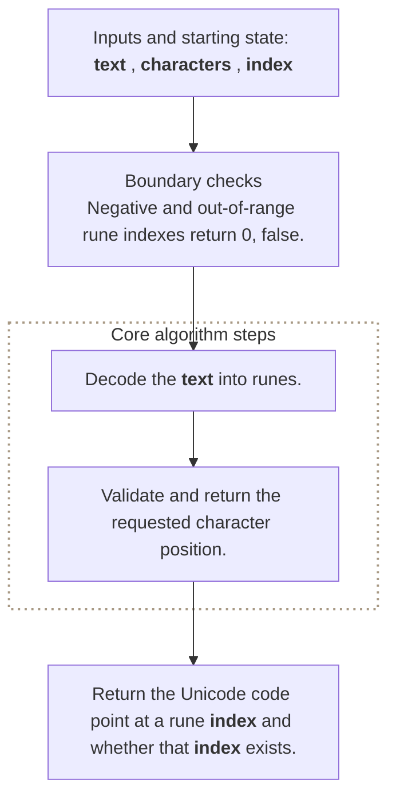

**Where it is used in real life:**

- Internationalized applications retrieve code points safely.
- Text editors distinguish rune positions from UTF-8 byte offsets.

```go
// Exact question: How can Go expose the character positions of UTF-8 text safely?
//
// Example: Input text = A🙂B and rune index = 1 -> output the rune 🙂 and true.
//
// Possible answer: Convert the string to runes before indexing human-readable Unicode code points.
//
// Output format: Return the Unicode code point at a rune index and whether that index exists.
//
// Inline descriptions:
// - Byte indexes and rune indexes differ when a character uses multiple UTF-8 bytes.
//
// Boundary checks:
// - Negative and out-of-range rune indexes return `0, false`.
//
// Key variables:
// - `text` stores UTF-8 bytes.
// - `characters` is a rune slice whose indexes are code-point positions and whose elements are Unicode values.
// - `index` is a rune position, not a byte offset.
//
// Logic:
// 1. Decode the text into runes.
// 2. Validate and return the requested character position.
func runeAt(text string, index int) (rune, bool) {
	characters := []rune(text)
	if index < 0 || index >= len(characters) {
		return 0, false
	}
	return characters[index], true
}

// time complexity: O(n) -> converting the string decodes all `n` bytes.
// space complexity: O(r) -> `r` decoded runes are stored.
```

> **Baby analogy:** Imagine letter tiles laid in a row. "Rune-Safe Character Access" is one small game played with the same pieces and rules.

---

## Interview checklist and next steps

Use this answer order during an interview:

1. Restate the input, output, and constraints.
2. Name the pattern and the invariant.
3. Explain the data structure roles before coding.
4. Handle boundary cases explicitly.
5. Walk through a small example.
6. Give time and space complexity with variable definitions.

Recommended practice order:
1. [Valid Anagram](#valid-anagram)
2. [Valid Palindrome](#valid-palindrome)
3. [Longest Substring Without Repeating Characters](#longest-substring-without-repeating-characters)
4. [Minimum Window Substring](#minimum-window-substring)
5. [Group Anagrams](#group-anagrams)
6. [Longest Palindromic Substring](#longest-palindromic-substring)
7. [String Compression](#string-compression)
8. [Is Subsequence](#is-subsequence)
9. [Reverse a String](#reverse-a-string)
10. [Rune-Safe Character Access](#rune-safe-character-access)

Continue with: Character Replacement, Encode and Decode Strings, String to Integer, Find All Anagrams, Regular Expression Matching.

```mermaid
flowchart LR
    Q0["Valid Anagram"]
    Q0 --> Q1["Valid Palindrome"]
    Q1 --> Q2["Longest Substring Without Repeating Characters"]
    Q2 --> Q3["Minimum Window Substring"]
    Q3 --> Q4["Group Anagrams"]
    Q4 --> Q5["Longest Palindromic Substring"]
    Q5 --> Q6["String Compression"]
    Q6 --> Q7["Is Subsequence"]
    Q7 --> Q8["Reverse a String"]
    Q8 --> Q9["Rune-Safe Character Access"]
```

> **Baby analogy:** Imagine letter tiles laid in a row. Pack the same checklist every time so no important interview step is forgotten.
