# Trees in Data Structures — A Compact Interview Guide

A tree stores values in a hierarchy. Each node can point to child subtrees, so the same small idea repeats from the root down to every leaf.

- [Mental model and vocabulary](#mental-model-and-vocabulary)
- [Why trees and common families](#why-trees-and-common-families)
- [Recursion and the node conversation](#recursion-and-the-node-conversation)
- [Depth-First Search](#depth-first-search-dfs)
- [Breadth-First Search](#breadth-first-search-bfs)
- [Complexity](#complexity-tree-shape-and-space)
- [Problem-solving checklist](#problem-solving-checklist-and-common-mistakes)
- [Top 10 LeetCode questions](#top-10-leetcode-tree-interview-questions)
- [Interview quick answers](#interview-checklist-and-quick-answers)

> **Baby analogy:** Think of a toy organizer with one big box, smaller boxes inside it, and even smaller boxes inside those. A tree is the map of which box belongs inside which other box.

---

## Mental model and vocabulary

A binary-tree node contains three things:

1. A value.
2. A pointer to a left child.
3. A pointer to a right child.

Either child pointer may be nil. The pointer describes structure; the value is the data stored at that position.

        1
       / \
      2   3
     / \   \
    4   5   6

| Term | Meaning | Example above |
| --- | --- | --- |
| Root | Top node with no parent | 1 |
| Parent | Node directly above a child | 2 is parent of 4 |
| Child | Node directly below a parent | 4 is a child of 2 |
| Leaf | Node with no children | 4, 5, 6 |
| Sibling | Nodes with the same parent | 4 and 5 |
| Subtree | A node and everything below it | 2, 4, 5 |
| Depth | Edges from the root down to a node | Depth of 4 is 2 |
| Height | Edges on the longest path from a node down to a leaf | Height of 2 is 1 |

Interview questions sometimes use **maximum depth** to mean the number of nodes, not edges, on the longest root-to-leaf path. State which convention you are using.

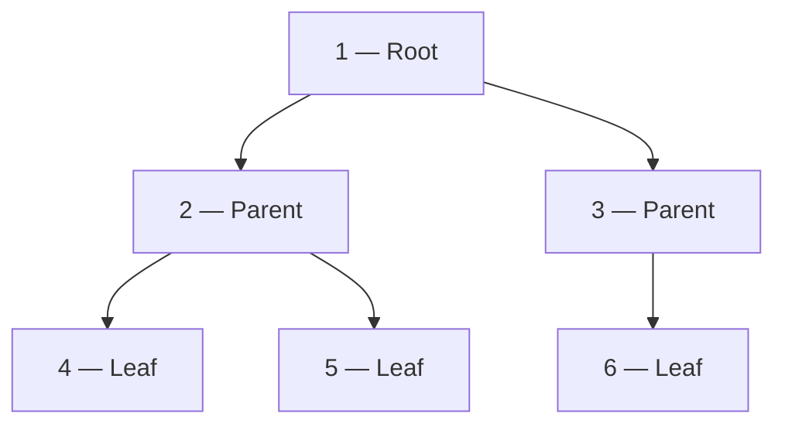
```mermaid
graph TD
    A["1 — Root"] --> B["2 — Parent"]
    A --> C["3 — Parent"]
    B --> D["4 — Leaf"]
    B --> E["5 — Leaf"]
    C --> F["6 — Leaf"]
```

> **Baby analogy:** Imagine a family photo. The oldest person stands at the top, children stand below their parent, and people on the same row with the same parent are siblings. Depth asks how many steps you walked down; height asks how many steps remain to the lowest child.

---

## Why trees and common families

Trees are useful when data has hierarchy, order, priority, or shared prefixes.

| Real system | What the tree represents |
| --- | --- |
| File system | Folders containing files and folders |
| Company chart | Managers containing reporting teams |
| HTML DOM | Elements containing child elements |
| Database index | Ordered keys used to avoid scanning every row |
| Scheduler | Priorities organized in a heap |
| Autocomplete | Words sharing prefixes in a trie |

| Tree family | Rule | Typical use |
| --- | --- | --- |
| Binary tree | At most two children (0,1,2) | General recursive problems |
| Full binary tree | Every node has zero or two children | Shape constraints |
| Complete binary tree | Levels fill left to right | Binary heaps |
| Perfect binary tree | Every internal node has two children and all leaves share a level | Exact shape reasoning |
| Balanced tree | Height stays near logarithmic | Fast search |
| Skewed tree | Every node has only one child | Worst-case recursion |
| Binary Search Tree | All left keys are smaller and all right keys are larger | Ordered lookup |
| Heap | Parent has higher or lower priority than its children | Priority queues |
| Trie | Edges represent characters and prefixes share paths | Prefix search |

A Binary Search Tree rule applies to the **entire subtree**, not only to a node and its immediate children. Inorder traversal therefore visits a valid BST in sorted order.

Related problems:

- [Validate Binary Search Tree](#validate-binary-search-tree)
- [Kth Smallest Element in a BST](#kth-smallest-element-in-a-bst)

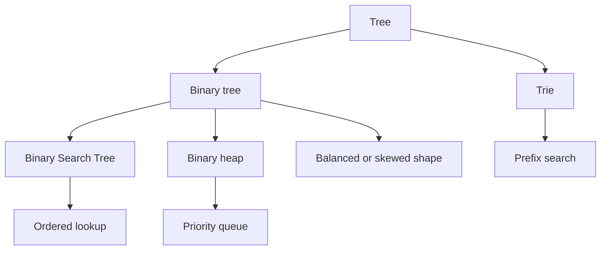
```mermaid
flowchart TD
    T["Tree"] --> B["Binary tree"]
    T --> R["Trie"]
    B --> BST["Binary Search Tree"]
    B --> H["Binary heap"]
    B --> BAL["Balanced or skewed shape"]
    BST --> O["Ordered lookup"]
    H --> P["Priority queue"]
    R --> X["Prefix search"]
```

> **Baby analogy:** A normal toy shelf lets you put toys anywhere. A BST shelf says smaller toys always go left and bigger toys always go right. A heap shelf keeps the favorite toy on top. A trie shelf groups every word beginning with the same first letters.

---

## Recursion and the node conversation

A tree is made of smaller trees, so a recursive function can treat every child as a complete problem of the same kind.

    solve(node)
    =
    handle the empty subtree
    + solve the left subtree
    + solve the right subtree
    + combine both answers

Every recursive solution should answer five questions:

1. What does a nil node return?
2. What information should the left child return?
3. What information should the right child return?
4. How does the current node combine those answers?
5. What must the current node return to its parent?

| Pattern | Information returned upward |
| --- | --- |
| Maximum depth | Subtree height |
| Balanced tree | Height or an unbalanced sentinel |
| Diameter | Height; best diameter is tracked separately |
| Same tree | Whether paired subtrees match |
| Lowest common ancestor | A found target or resolved ancestor |
| Invert tree | Root of the inverted subtree |
| Path sum | Path state or remaining sum |

**Top-down DFS** passes parent state into a child, such as current depth or a valid BST range. **Bottom-up DFS** waits for child answers, such as height or balance, before calculating the parent answer.

Related recursive problems:

- [Maximum Depth](#maximum-depth-of-binary-tree)
- [Invert Tree](#invert-binary-tree)
- [Same Tree](#same-tree)
- [Subtree](#subtree-of-another-tree)
- [Balanced Tree](#balanced-binary-tree)
- [Diameter](#diameter-of-binary-tree)
- [Lowest Common Ancestor](#lowest-common-ancestor-of-a-binary-tree)
- [Validate BST](#validate-binary-search-tree)

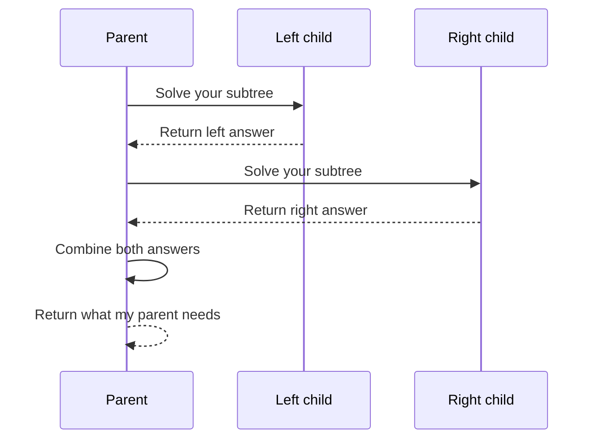
```mermaid
sequenceDiagram
    participant P as Parent
    participant L as Left child
    participant R as Right child
    P->>L: Solve your subtree
    L-->>P: Return left answer
    P->>R: Solve your subtree
    R-->>P: Return right answer
    P->>P: Combine both answers
    P-->>P: Return what my parent needs
```

> **Baby analogy:** A parent asks both children, “What answer did your side get?” The children ask their children the same question. Answers travel back upward until the parent can combine them.

---

## Depth-First Search (DFS)

DFS follows one branch deeply before returning to try another branch. Recursion uses the call stack automatically; iterative DFS uses an explicit stack.

For the sample tree in section 1:

| Traversal | Order | Output | Common use |
| --- | --- | --- | --- |
| Preorder | Node, Left, Right | 1, 2, 4, 5, 3, 6 | Parent before children, copy, serialize |
| Inorder | Left, Node, Right | 4, 2, 5, 1, 3, 6 | Sorted BST values |
| Postorder | Left, Right, Node | 4, 5, 2, 6, 3, 1 | Height, balance, diameter, deletion |

When using an explicit stack, push children in reverse order because the last item pushed is processed first. For preorder that visits left before right, push right first and then left.

DFS-related interview problems:

- **General DFS:** [Maximum Depth](#maximum-depth-of-binary-tree), [Invert Tree](#invert-binary-tree), [Same Tree](#same-tree), [Subtree](#subtree-of-another-tree), [Balanced Tree](#balanced-binary-tree), [Diameter](#diameter-of-binary-tree), [Lowest Common Ancestor](#lowest-common-ancestor-of-a-binary-tree), [Validate BST](#validate-binary-search-tree), and [Kth Smallest](#kth-smallest-element-in-a-bst).
- **Inorder:** [Validate BST](#validate-binary-search-tree) and [Kth Smallest](#kth-smallest-element-in-a-bst).
- **Postorder:** [Maximum Depth](#maximum-depth-of-binary-tree), [Invert Tree](#invert-binary-tree), [Balanced Tree](#balanced-binary-tree), [Diameter](#diameter-of-binary-tree), and [Lowest Common Ancestor](#lowest-common-ancestor-of-a-binary-tree).

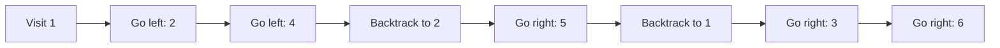
```mermaid
flowchart LR
    A["Visit 1"] --> B["Go left: 2"]
    B --> C["Go left: 4"]
    C --> D["Backtrack to 2"]
    D --> E["Go right: 5"]
    E --> F["Backtrack to 1"]
    F --> G["Go right: 3"]
    G --> H["Go right: 6"]
```

> **Baby analogy:** You explore a maze by walking down one hallway until it ends, then walking backward to the last unopened door. Preorder writes down a room when entering, inorder writes it between the left and right doors, and postorder writes it when leaving.

---

## Breadth-First Search (BFS)

BFS visits the tree one level at a time with a FIFO queue.

1. Put the root in the queue.
2. Record the current queue length as the size of this level.
3. Remove exactly that many nodes.
4. Append each existing child to the back of the queue.
5. Repeat for the next level.

Use BFS when the question asks about levels, nearest nodes, minimum depth, right-side view, or left-to-right grouping.

The queue is a slice whose indexes preserve arrival order and whose elements are node pointers awaiting processing. It does not store tree keys unless the implementation intentionally stores values instead of nodes.

Related problem:

- [Binary Tree Level Order Traversal](#binary-tree-level-order-traversal)

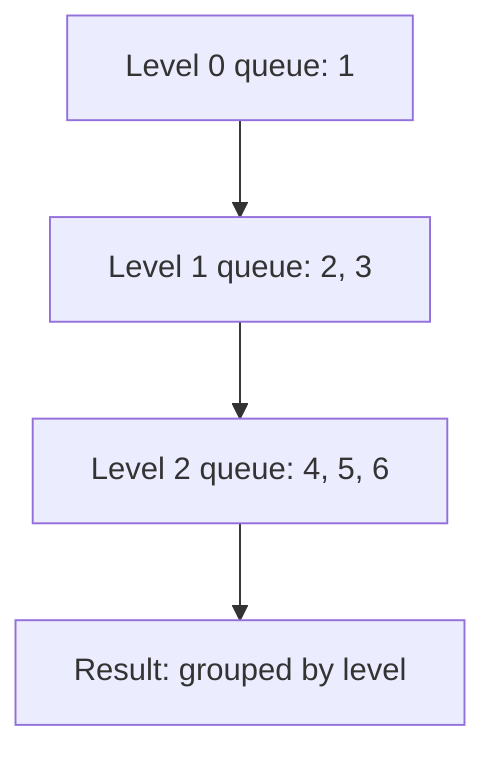
```mermaid
graph TD
    L0["Level 0 queue: 1"] --> L1["Level 1 queue: 2, 3"]
    L1 --> L2["Level 2 queue: 4, 5, 6"]
    L2 --> OUT["Result: grouped by level"]
```

> **Baby analogy:** A teacher calls children row by row for a photo. Everyone in the front row goes first, then everyone in the second row, and nobody from the third row can cut ahead.

---

## Complexity, tree shape, and space

Use these variables during analysis:

| Symbol | Meaning |
| --- | --- |
| n | Number of nodes |
| h | Tree height |
| w | Maximum number of nodes on one level |
| m | Number of nodes in a second tree or pattern |

A traversal that may inspect every node is usually O(n) time.

| Shape or technique | Auxiliary space |
| --- | --- |
| Recursive DFS | O(h) call stack |
| Balanced-tree DFS | O(log n), because h is logarithmic |
| Skewed-tree DFS | O(n), because h can equal n |
| BFS | O(w) queue |
| Returned traversal values | O(n) output |

Always say whether output storage is included. A level-order result contains all n values even though its auxiliary queue is O(w).

Avoid recalculating subtree heights. For example, the optimized balanced-tree solution returns height and balance state in one traversal, producing O(n) time instead of repeatedly scanning subtrees.

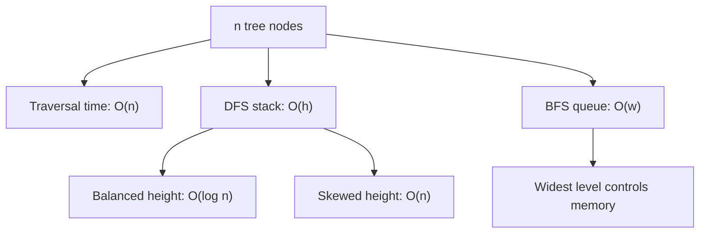
```mermaid
flowchart TD
    N["n tree nodes"] --> T["Traversal time: O(n)"]
    N --> D["DFS stack: O(h)"]
    N --> B["BFS queue: O(w)"]
    D --> BAL["Balanced height: O(log n)"]
    D --> SKEW["Skewed height: O(n)"]
    B --> WIDE["Widest level controls memory"]
```

> **Baby analogy:** A short, bushy tree is like a wide staircase: you carry many names at one level for BFS, but DFS does not walk very deep. A tall, skinny tree is like a ladder: BFS holds few names, but DFS needs a very tall stack of reminders.

---

## Problem-solving checklist and common mistakes

Choose a traversal from the relationship the question asks for:

| Clue | Likely approach |
| --- | --- |
| Level, nearest, minimum number of edges | BFS |
| Root-to-leaf path or inherited range | Top-down DFS |
| Height, balance, diameter, child result | Postorder DFS |
| Sorted BST order or kth ranked key | Inorder DFS |
| Parent before children or serialization | Preorder DFS |

Before coding, say out loud:

1. What does the function return?
2. What is the nil base case?
3. Are node values unique, or must nodes be compared by pointer?
4. Does the result count nodes or edges?
5. Is the tree guaranteed to be a BST?
6. Can the tree be completely skewed?
7. Is output space included in complexity?

Common mistakes:

- Forgetting the nil base case before reading a node.
- Checking only a BST node against its parent instead of all ancestor bounds.
- Confusing depth from the root with height returned from children.
- Calling recursive height repeatedly and accidentally creating O(n²) work.
- Treating DFS as recursion-only; a stack is equivalent.
- Using BFS when only one root-to-leaf stack is needed.
- Returning the final global answer when the parent actually needs a smaller state such as height.
- Comparing LCA targets by value when duplicate values are possible.

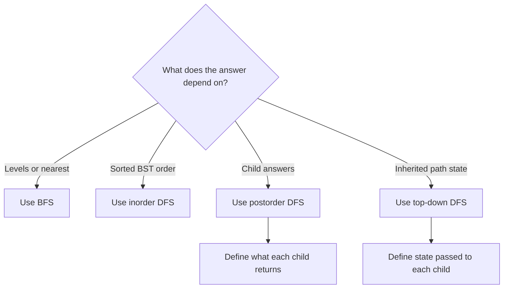
```mermaid
flowchart TD
    Q{"What does the answer depend on?"}
    Q -->|"Levels or nearest"| BFS["Use BFS"]
    Q -->|"Sorted BST order"| IN["Use inorder DFS"]
    Q -->|"Child answers"| POST["Use postorder DFS"]
    Q -->|"Inherited path state"| TOP["Use top-down DFS"]
    POST --> R["Define what each child returns"]
    TOP --> S["Define state passed to each child"]
```

> **Baby analogy:** Before building a block tower, decide what each helper must hand you: a block, a height number, or a yes/no card. If helpers return the wrong thing, the tower cannot be assembled even when every helper worked hard.

---

## Top 10 LeetCode Tree Interview Questions

These ten solutions are the single authoritative implementations in this guide. Each one names the traversal, boundary cases, variable roles, logic, and complexity.

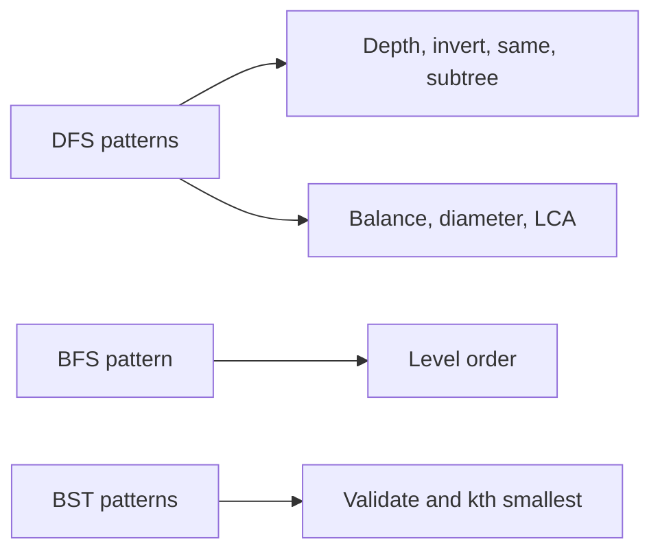
```mermaid
flowchart LR
    DFS["DFS patterns"] --> P1["Depth, invert, same, subtree"]
    DFS --> P2["Balance, diameter, LCA"]
    BFS["BFS pattern"] --> P3["Level order"]
    BST["BST patterns"] --> P4["Validate and kth smallest"]
```

> **Baby analogy:** This is a sticker book with ten important tree puzzles. Each puzzle teaches one reusable trick, so later puzzles feel like rearrangements of stickers you already know.

### Maximum Depth of Binary Tree

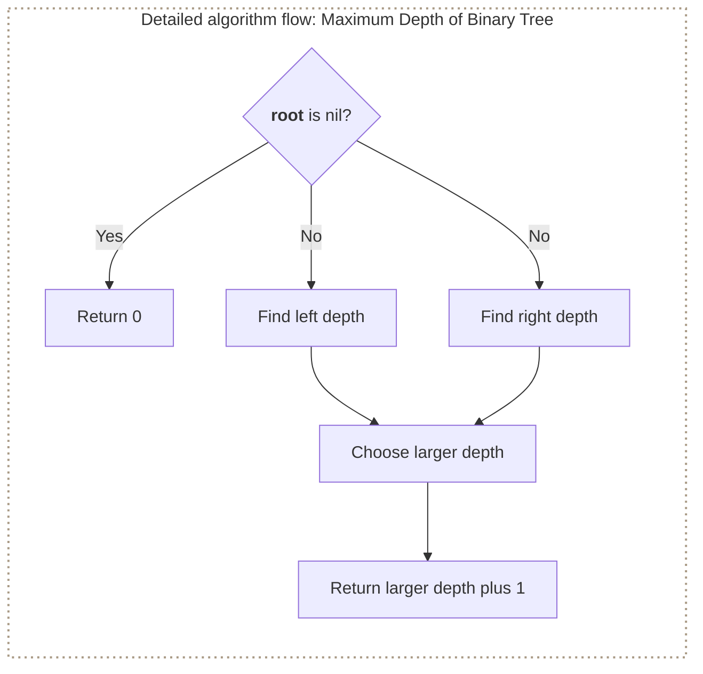
```mermaid
flowchart TD
    subgraph PROCESS["Detailed algorithm flow: Maximum Depth of Binary Tree"]
        direction TD
        A{"<strong>root</strong> is nil?"} -->|"Yes"| Z["Return 0"]
        A -->|"No"| L["Find left depth"]
        A -->|"No"| R["Find right depth"]
        L --> M["Choose larger depth"]
        R --> M
        M --> O["Return larger depth plus 1"]
    end

    style PROCESS fill:transparent,stroke:#a89984,stroke-width:2px,stroke-dasharray:2 4
```

**Where it is used in real life:**

- File systems use depth to measure the longest nested folder path or enforce a nesting limit.
- Organization charts use it to count the longest reporting chain from an executive to an individual contributor.
- UI and HTML analysis tools use it to detect component or DOM trees that are nested deeply enough to hurt readability or rendering.

The same height calculation generalizes to real-world trees with more than two children.

```go
// Exact question: LeetCode 104 — Given the root of a binary tree, return its maximum depth, measured as the number of nodes on the longest root-to-leaf path.
//
// Example: Input tree [3, 9, 20, nil, nil, 15, 7] -> output depth 3.
//
// Possible answer: Use postorder DFS to get the depth of both child subtrees, then add the current node to the larger child depth.
//
// Output format: Return one integer; return `0` for an empty tree, `1` for a leaf, and otherwise return the longest root-to-leaf node count.
//
// Inline descriptions:
// - Each recursive call treats its node as the root of a smaller tree.
// - A parent can form its deepest path by extending only the deeper child path.
//
// Boundary checks:
// - If `root == nil`, the subtree contains no nodes, so its depth is `0`.
// - A leaf has two nil children, so both recursive depths are `0` and the function returns `1`.
//
// Key variables description:
// - `root` points to the current subtree root; `root.Val` holds data and does not affect depth.
// - `root.Left` and `root.Right` hold pointers to child subtrees, not array indexes.
// - `leftDepth` and `rightDepth` hold the node counts returned by the child subtrees.
//
// Logic:
// 1. Return `0` for a nil subtree.
// 2. Recursively calculate the left and right subtree depths.
// 3. Return `1` plus the larger child depth.
type TreeNode struct {
	Val         int
	Left, Right *TreeNode
}

func maxDepth(root *TreeNode) int {
	if root == nil {
		return 0
	}

	leftDepth := maxDepth(root.Left)
	rightDepth := maxDepth(root.Right)
	if leftDepth > rightDepth {
		return leftDepth + 1
	}
	return rightDepth + 1
}

// time complexity: O(n) -> DFS visits each of the `n` nodes exactly once.
// space complexity: O(h) -> the recursion stack contains at most one root-to-leaf path of height `h`.
```

> **Baby analogy:** Finding maximum depth is like comparing two block towers and keeping the taller tower, then adding the block you are standing on.

### Invert Binary Tree

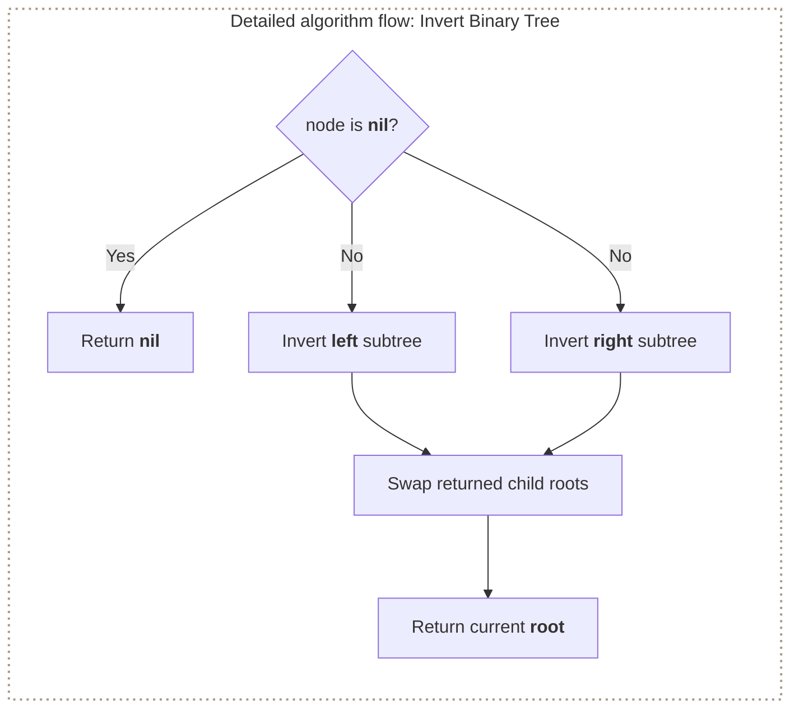
```mermaid
flowchart TD
    subgraph PROCESS["Detailed algorithm flow: Invert Binary Tree"]
        direction TD
        A{"node is <strong>nil</strong>?"} -->|"Yes"| Z["Return <strong>nil</strong>"]
        A -->|"No"| L["Invert <strong>left</strong> subtree"]
        A -->|"No"| R["Invert <strong>right</strong> subtree"]
        L --> S["Swap returned child roots"]
        R --> S
        S --> O["Return current <strong>root</strong>"]
    end

    style PROCESS fill:transparent,stroke:#a89984,stroke-width:2px,stroke-dasharray:2 4
```

**Where it is used in real life:**

- Right-to-left interfaces can mirror a left-oriented menu or component hierarchy for languages such as Arabic or Hebrew.
- Graphics and game tools can generate a mirrored scene or decision-tree layout by swapping left and right branches.
- Test tools can mirror a structure and then mirror it again to verify that the transformation restores the original tree.

Exact whole-tree inversion is uncommon in business systems, but the child-pointer transformation is useful in layout and symmetry operations.

```go
// Exact question: LeetCode 226 — Given the root of a binary tree, swap every node's left and right subtrees and return the inverted root.
//
// Example: Input tree [4,2,7,1,3,6,9] -> output [4,7,2,9,6,3,1].
//
// Possible answer: Recursively invert both child subtrees, then attach the inverted right subtree on the left and the inverted left subtree on the right.
//
// Output format: Return a pointer to the same root after in-place inversion; return `nil` when the input tree is empty.
//
// Inline descriptions:
// - Postorder DFS finishes both child inversions before reconnecting them to their parent.
// - The algorithm changes child pointers but preserves every node value.
//
// Boundary checks:
// - If `root == nil`, there is no node or child pointer to swap.
// - A leaf is returned unchanged because both inverted child pointers remain nil.
//
// Key variables description:
// - `root` points to the node currently being inverted; `root.Val` holds unchanged data.
// - `left` holds the root pointer of the already inverted original left subtree.
// - `right` holds the root pointer of the already inverted original right subtree.
//
// Logic:
// 1. Return nil at the end of an empty branch.
// 2. Invert the original left and right subtrees recursively.
// 3. Assign the inverted right subtree to `root.Left` and the inverted left subtree to `root.Right`.
type TreeNode struct {
	Val         int
	Left, Right *TreeNode
}

func invertTree(root *TreeNode) *TreeNode {
	if root == nil {
		return nil
	}

	left := invertTree(root.Left)
	right := invertTree(root.Right)
	root.Left = right
	root.Right = left
	return root
}

// time complexity: O(n) -> every node is visited once and performs one constant-time pointer swap.
// space complexity: O(h) -> recursive calls grow with the tree height `h`.
```

> **Baby analogy:** Inverting a tree is like holding it up to a mirror: every left hand becomes a right hand at every level.

### Same Tree

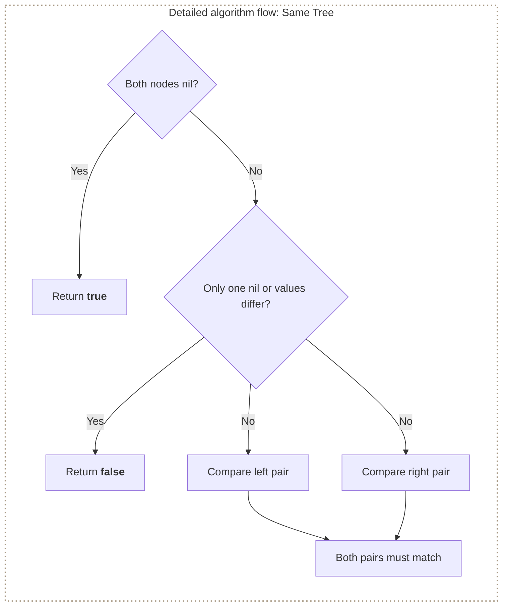
```mermaid
flowchart TD
    subgraph PROCESS["Detailed algorithm flow: Same Tree"]
        direction TD
        A{"Both nodes nil?"} -->|"Yes"| T["Return <strong>true</strong>"]
        A -->|"No"| B{"Only one nil or values differ?"}
        B -->|"Yes"| F["Return <strong>false</strong>"]
        B -->|"No"| L["Compare left pair"]
        B -->|"No"| R["Compare right pair"]
        L --> C["Both pairs must match"]
        R --> C
    end

    style PROCESS fill:transparent,stroke:#a89984,stroke-width:2px,stroke-dasharray:2 4
```

**Where it is used in real life:**

- Deployment tools compare an expected configuration tree with the tree reconstructed from a running system.
- Compilers compare Abstract Syntax Trees to verify that a rewrite preserved the program structure.
- Migration tests compare old and new menu, directory, or organization hierarchies to confirm that nothing moved or changed.

```go
// Exact question: LeetCode 100 — Given roots `p` and `q`, return whether both binary trees have the same structure and the same value at every matching node.
//
// Example: Input p = [1,2,3] and q = [1,2,3] -> output true; changing q's right value returns false.
//
// Possible answer: Compare matching nodes with DFS; a pair matches only when both are nil or both values match and both child pairs match.
//
// Output format: Return `true` only when the complete trees are identical; otherwise return `false`.
//
// Inline descriptions:
// - DFS compares nodes in pairs, so neither tree needs a separate visited collection.
// - Pointer position represents structure, while `Val` represents the data that must match at that position.
//
// Boundary checks:
// - If both pointers are nil, the two empty subtrees match.
// - If exactly one pointer is nil, the structures differ.
// - If both nodes exist but their values differ, no child comparison can make the trees equal.
//
// Key variables description:
// - `p` points to the current node in the first tree.
// - `q` points to the structurally corresponding node in the second tree.
// - `p.Left` is paired with `q.Left`, and `p.Right` is paired with `q.Right`.
//
// Logic:
// 1. Resolve the both-nil and one-nil boundary cases.
// 2. Reject unequal values.
// 3. Require both the left pair and the right pair to be the same.
type TreeNode struct {
	Val         int
	Left, Right *TreeNode
}

func isSameTree(p, q *TreeNode) bool {
	if p == nil && q == nil {
		return true
	}
	if p == nil || q == nil {
		return false
	}
	if p.Val != q.Val {
		return false
	}
	return isSameTree(p.Left, q.Left) && isSameTree(p.Right, q.Right)
}

// time complexity: O(n) -> at most `n` matching node positions are compared before success or the first mismatch.
// space complexity: O(h) -> the recursion stack follows corresponding paths up to maximum height `h`.
```

> **Baby analogy:** Comparing two trees is like comparing two Lego models position by position: both the block shape and the color number must match.

### Subtree of Another Tree

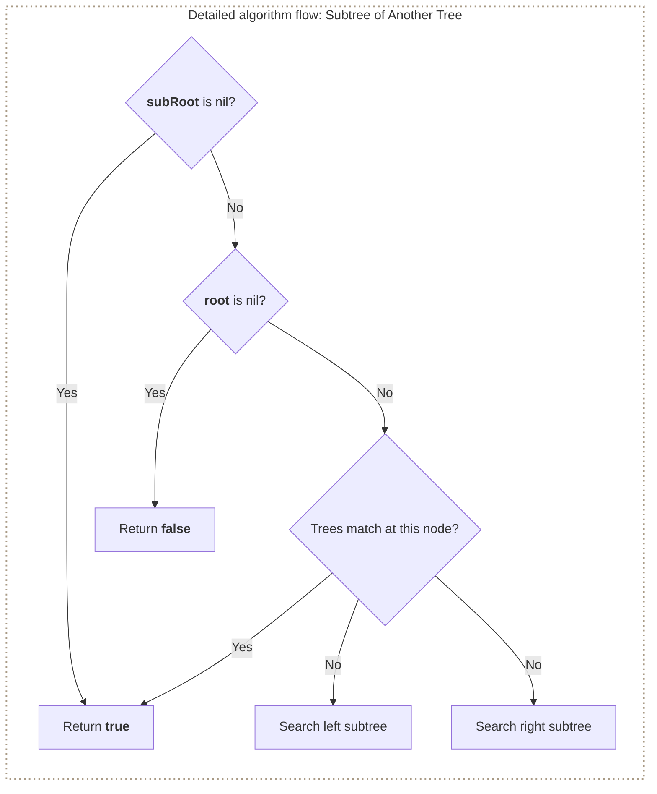
```mermaid
flowchart TD
    subgraph PROCESS["Detailed algorithm flow: Subtree of Another Tree"]
        direction TD
        A{"<strong>subRoot</strong> is nil?"} -->|"Yes"| T["Return <strong>true</strong>"]
        A -->|"No"| B{"<strong>root</strong> is nil?"}
        B -->|"Yes"| F["Return <strong>false</strong>"]
        B -->|"No"| C{"Trees match at this node?"}
        C -->|"Yes"| T
        C -->|"No"| L["Search left subtree"]
        C -->|"No"| R["Search right subtree"]
    end

    style PROCESS fill:transparent,stroke:#a89984,stroke-width:2px,stroke-dasharray:2 4
```

**Where it is used in real life:**

- Static-analysis tools search a large Abstract Syntax Tree for a smaller code pattern.
- UI testing tools check whether a required component hierarchy exists somewhere inside a complete page tree.
- File-management tools can look for a known folder-template structure inside a larger directory hierarchy.

```go
// Exact question: LeetCode 572 — Given roots `root` and `subRoot`, return whether `root` contains a subtree with exactly the same structure and values as `subRoot`.
//
// Example: Input root = [3,4,5,1,2] and subRoot = [4,1,2] -> output true.
//
// Possible answer: Use DFS to consider every node in `root` as a possible match, and use a second DFS to compare the two candidate trees exactly.
//
// Output format: Return `true` when an identical subtree is found; otherwise return `false`.
//
// Inline descriptions:
// - `isSameSubtree` checks one candidate root for an exact structural and value match.
// - `isSubtree` searches both child branches when the current candidate does not match.
//
// Boundary checks:
// - An empty `subRoot` is a subtree of every tree.
// - A nil `root` cannot contain a non-nil `subRoot`.
// - During comparison, both nil pointers match, while exactly one nil pointer fails.
//
// Key variables description:
// - `root` points to the current candidate node in the larger tree.
// - `subRoot` points to the fixed root of the pattern tree being searched for.
// - `a` and `b` are paired node pointers used only by the exact-tree comparison.
//
// Logic:
// 1. Handle empty-tree boundaries.
// 2. Compare the complete subtree at the current `root` with `subRoot`.
// 3. If it does not match, search for a candidate in the left or right subtree.
type TreeNode struct {
	Val         int
	Left, Right *TreeNode
}

func isSameSubtree(a, b *TreeNode) bool {
	if a == nil && b == nil {
		return true
	}
	if a == nil || b == nil || a.Val != b.Val {
		return false
	}
	return isSameSubtree(a.Left, b.Left) && isSameSubtree(a.Right, b.Right)
}

func isSubtree(root, subRoot *TreeNode) bool {
	if subRoot == nil {
		return true
	}
	if root == nil {
		return false
	}
	if isSameSubtree(root, subRoot) {
		return true
	}
	return isSubtree(root.Left, subRoot) || isSubtree(root.Right, subRoot)
}

// time complexity: O(n*m) -> in the worst case, each of `n` candidate nodes starts a comparison of up to `m` pattern nodes.
// space complexity: O(h+s) -> nested DFS calls can retain a search path of height `h` plus a comparison path of height `s`.
```

> **Baby analogy:** A subtree is like checking whether a small Lego model appears intact somewhere inside a larger model.

### Binary Tree Level Order Traversal

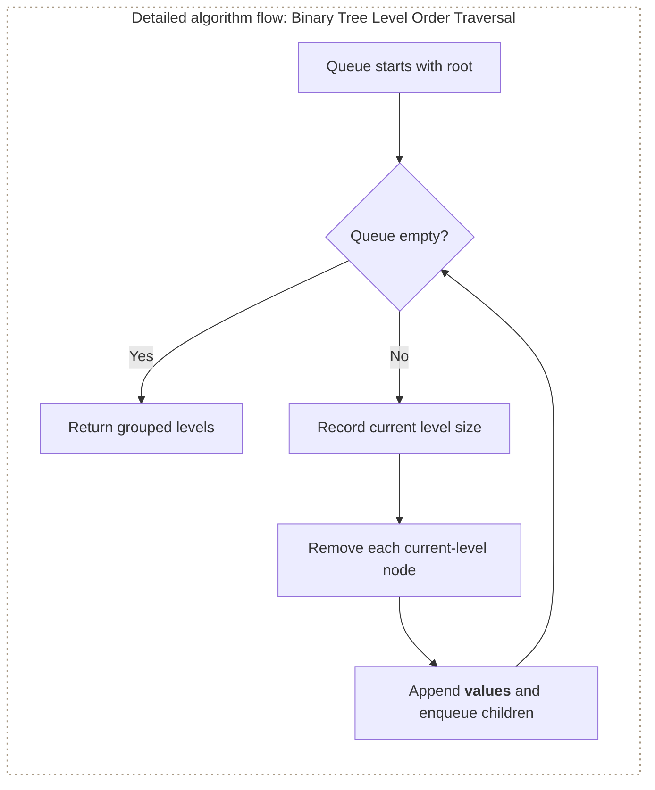
```mermaid
flowchart TD
    subgraph PROCESS["Detailed algorithm flow: Binary Tree Level Order Traversal"]
        direction TD
        A["Queue starts with root"] --> B{"Queue empty?"}
        B -->|"Yes"| O["Return grouped levels"]
        B -->|"No"| C["Record current level size"]
        C --> D["Remove each current-level node"]
        D --> E["Append <strong>values</strong> and enqueue children"]
        E --> B
    end

    style PROCESS fill:transparent,stroke:#a89984,stroke-width:2px,stroke-dasharray:2 4
```

**Where it is used in real life:**

- Organization-chart software displays employees one management level at a time.
- Dependency rollout systems process services tier by tier so parents or prerequisites are handled before the next level.
- Hierarchy serializers and visualizers group nodes by depth for output, dashboards, or debugging.

```go
// Exact question: LeetCode 102 — Given the root of a binary tree, return its node values level by level from left to right.
//
// Example: Input tree [3,9,20,nil,nil,15,7] -> output [[3],[9,20],[15,7]].
//
// Possible answer: Use BFS with a FIFO queue, process exactly the current queue length as one level, and enqueue those nodes' children for the next level.
//
// Output format: Return a `[][]int`; each outer-slice index is a zero-based tree depth, and each inner slice holds that level's values from left to right.
//
// Inline descriptions:
// - BFS processes all nodes at depth `d` before any node at depth `d+1`.
// - A separate `nextLevel` queue prevents children from being mixed into the level currently being recorded.
//
// Boundary checks:
// - If `root == nil`, return an empty result because the tree has no levels.
// - Enqueue a child only when its pointer is non-nil.
//
// Key variables description:
// - `result` is a two-dimensional slice: outer indexes are depths, inner indexes are left-to-right positions, and elements are node values.
// - `queue` is a slice whose indexes preserve FIFO order and whose elements are pointers to nodes on the current level.
// - `nextLevel` holds pointers to children for the next BFS level, not node values or tree depths.
// - `values` holds integer node values for one level in output order.
//
// Logic:
// 1. Seed the queue with the root.
// 2. Record every current-level node and append its existing children to `nextLevel`.
// 3. Append the current values to the result and replace the queue with `nextLevel`.
type TreeNode struct {
	Val         int
	Left, Right *TreeNode
}

func levelOrder(root *TreeNode) [][]int {
	if root == nil {
		return [][]int{}
	}

	result := [][]int{}
	queue := []*TreeNode{root}
	for len(queue) > 0 {
		values := make([]int, 0, len(queue))
		nextLevel := make([]*TreeNode, 0, len(queue)*2)
		for _, node := range queue {
			values = append(values, node.Val)
			if node.Left != nil {
				nextLevel = append(nextLevel, node.Left)
			}
			if node.Right != nil {
				nextLevel = append(nextLevel, node.Right)
			}
		}
		result = append(result, values)
		queue = nextLevel
	}
	return result
}

// time complexity: O(n) -> BFS records and enqueues each of the `n` nodes once.
// space complexity: O(n) -> the returned values contain all `n` nodes; excluding output, the current and next-level queues use O(w) auxiliary space for maximum width `w`.
```

> **Baby analogy:** Level-order traversal is like visiting every classroom on the first floor before taking the stairs to the second floor.

### Balanced Binary Tree

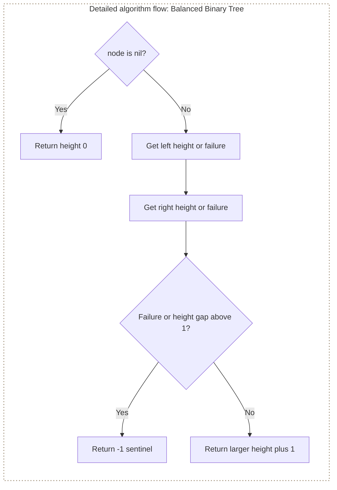
```mermaid
flowchart TD
    subgraph PROCESS["Detailed algorithm flow: Balanced Binary Tree"]
        direction TD
        A{"node is nil?"} -->|"Yes"| Z["Return height 0"]
        A -->|"No"| L["Get left height or failure"]
        L --> R["Get right height or failure"]
        R --> C{"Failure or height gap above 1?"}
        C -->|"Yes"| F["Return -1 sentinel"]
        C -->|"No"| H["Return larger height plus 1"]
    end

    style PROCESS fill:transparent,stroke:#a89984,stroke-width:2px,stroke-dasharray:2 4
```

**Where it is used in real life:**

- Database and in-memory indexes monitor balanced search trees so lookups do not degrade from logarithmic time toward linear time.
- AVL-tree implementations use the same child-height comparison before deciding whether a rotation is required.
- Storage engines and libraries can validate a tree after loading it from disk or receiving it over a network.

```go
// Exact question: LeetCode 110 — Given the root of a binary tree, return whether every node's left and right subtree heights differ by at most one.
//
// Example: Input tree [3,9,20,nil,nil,15,7] -> output true; a chain of three nodes on one side returns false.
//
// Possible answer: Use one postorder DFS that returns each subtree height, but return `-1` immediately when that subtree is already unbalanced.
//
// Output format: Return `true` when the whole tree is height-balanced; otherwise return `false`.
//
// Inline descriptions:
// - Postorder traversal computes child heights before the parent checks their difference.
// - The `-1` sentinel carries failure upward, so no subtree height is recalculated.
//
// Boundary checks:
// - A nil subtree has height `0` and is balanced.
// - If either child returns `-1`, the current subtree is also unbalanced.
// - If the absolute height difference is greater than `1`, return the failure sentinel.
//
// Key variables description:
// - `root` points to the current subtree root; node values do not affect balance.
// - `leftHeight` and `rightHeight` hold child heights, or `-1` to represent an unbalanced child.
// - The integer returned by `balancedHeight` represents either a height or failure state, never a node key.
//
// Logic:
// 1. Compute the left height and stop if it reports failure.
// 2. Compute the right height and stop if it reports failure.
// 3. Reject a difference greater than one; otherwise return one plus the larger height.
type TreeNode struct {
	Val         int
	Left, Right *TreeNode
}

func balancedHeight(root *TreeNode) int {
	if root == nil {
		return 0
	}

	leftHeight := balancedHeight(root.Left)
	if leftHeight == -1 {
		return -1
	}
	rightHeight := balancedHeight(root.Right)
	if rightHeight == -1 {
		return -1
	}

	difference := leftHeight - rightHeight
	if difference < -1 || difference > 1 {
		return -1
	}
	if leftHeight > rightHeight {
		return leftHeight + 1
	}
	return rightHeight + 1
}

func isBalanced(root *TreeNode) bool {
	return balancedHeight(root) != -1
}

// time complexity: O(n) -> each of the `n` nodes computes its height and balance state once.
// space complexity: O(h) -> postorder recursion holds at most `h` calls for tree height `h`.
```

> **Baby analogy:** A balanced tree is like a seesaw: at every seat, the left and right sides may differ a little, but not by more than one level.

### Diameter of Binary Tree

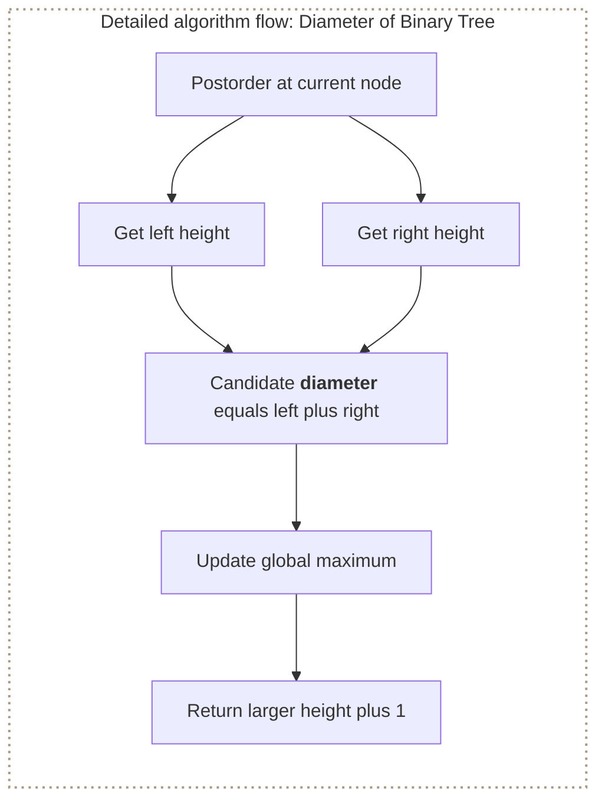
```mermaid
flowchart TD
    subgraph PROCESS["Detailed algorithm flow: Diameter of Binary Tree"]
        direction TD
        A["Postorder at current node"] --> L["Get left height"]
        A --> R["Get right height"]
        L --> D["Candidate <strong>diameter</strong> equals left plus right"]
        R --> D
        D --> U["Update global maximum"]
        U --> H["Return larger height plus 1"]
    end

    style PROCESS fill:transparent,stroke:#a89984,stroke-width:2px,stroke-dasharray:2 4
```

**Where it is used in real life:**

- Network planners use the longest path in a tree-shaped topology to estimate worst-case communication distance or cable length.
- Organization analysis can measure the longest communication chain between two people in a reporting hierarchy.
- Build and dependency tools can find the longest path between two tasks when the dependency structure is a tree.

```go
// Exact question: LeetCode 543 — Given the root of a binary tree, return the greatest number of edges on a path between any two nodes; the path need not pass through the root.
//
// Example: Input tree [1,2,3,4,5] -> output 3 edges along 4-2-1-3 or 5-2-1-3.
//
// Possible answer: Use postorder DFS to return subtree heights while updating a shared maximum with the left height plus the right height at every node.
//
// Output format: Return one integer edge count; return `0` for an empty tree or a one-node tree.
//
// Inline descriptions:
// - A parent can extend only one child branch upward, so DFS returns one subtree height.
// - A complete path through the current node can join both child branches, so it is a diameter candidate.
//
// Boundary checks:
// - A nil subtree has height `0`.
// - A leaf produces candidate `0 + 0 = 0` edges and returns height `1` node to its parent.
//
// Key variables description:
// - `diameter` stores the largest edge count found anywhere; it is shared by all DFS calls in this invocation only.
// - `leftHeight` and `rightHeight` store downward heights measured in nodes.
// - `leftHeight + rightHeight` is an edge count because each child height contributes the edges from the current node down that branch.
//
// Logic:
// 1. Return zero height for a nil child.
// 2. Compute both child heights and update the best through-current-node path.
// 3. Return one plus the larger child height for use by the parent.
type TreeNode struct {
	Val         int
	Left, Right *TreeNode
}

func diameterOfBinaryTree(root *TreeNode) int {
	diameter := 0

	var height func(*TreeNode) int
	height = func(node *TreeNode) int {
		if node == nil {
			return 0
		}

		leftHeight := height(node.Left)
		rightHeight := height(node.Right)
		if leftHeight+rightHeight > diameter {
			diameter = leftHeight + rightHeight
		}
		if leftHeight > rightHeight {
			return leftHeight + 1
		}
		return rightHeight + 1
	}

	height(root)
	return diameter
}

// time complexity: O(n) -> the height DFS processes each of the `n` nodes once.
// space complexity: O(h) -> recursion grows to the tree height `h`, while `diameter` uses constant extra space.
```

> **Baby analogy:** The diameter is the longest rope you can stretch between any two playground spots, even when the rope does not pass through the main gate.

### Lowest Common Ancestor of a Binary Tree

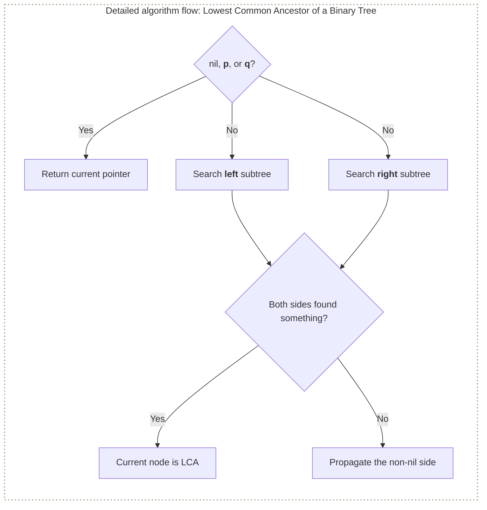
```mermaid
flowchart TD
    subgraph PROCESS["Detailed algorithm flow: Lowest Common Ancestor of a Binary Tree"]
        direction TD
        A{"nil, <strong>p</strong>, or <strong>q</strong>?"} -->|"Yes"| B["Return current pointer"]
        A -->|"No"| L["Search <strong>left</strong> subtree"]
        A -->|"No"| R["Search <strong>right</strong> subtree"]
        L --> C{"Both sides found something?"}
        R --> C
        C -->|"Yes"| O["Current node is LCA"]
        C -->|"No"| P["Propagate the non-nil side"]
    end

    style PROCESS fill:transparent,stroke:#a89984,stroke-width:2px,stroke-dasharray:2 4
```

**Where it is used in real life:**

- File systems use the lowest common ancestor to find the nearest directory shared by two files.
- Organization charts use it to find the nearest manager responsible for two employees or teams.
- Permission systems can find the closest shared policy scope inherited by two resources in a hierarchy.

```go
// Exact question: LeetCode 236 — Given a binary tree and existing nodes `p` and `q`, return their lowest common ancestor, where a node may be an ancestor of itself.
//
// Example: Input tree [3,5,1,6,2,0,8,nil,nil,7,4], p = 5, q = 1 -> return node 3.
//
// Possible answer: Use postorder DFS; return a target when found, and return the current node when the left and right subtrees each report a target.
//
// Output format: Return a pointer to the lowest node whose subtree contains both targets.
//
// Inline descriptions:
// - Each subtree reports either no target, one target, or the already resolved lowest common ancestor.
// - Pointer identity is compared because two different nodes may legally store the same integer value.
//
// Boundary checks:
// - A nil subtree contains neither target and returns nil.
// - If `root` is `p` or `q`, return it immediately; this also handles one target being an ancestor of the other.
// - The LeetCode question guarantees both targets exist, so a non-nil answer is expected.
//
// Key variables description:
// - `p` and `q` are target node pointers, not target values.
// - `left` and `right` hold the node pointer reported by each child subtree.
// - `root` becomes the answer when both child sides return non-nil pointers.
//
// Logic:
// 1. Stop at nil or at either target.
// 2. Search both child subtrees.
// 3. Return `root` if targets were reported from both sides; otherwise propagate the one non-nil report.
type TreeNode struct {
	Val         int
	Left, Right *TreeNode
}

func lowestCommonAncestor(root, p, q *TreeNode) *TreeNode {
	if root == nil || root == p || root == q {
		return root
	}

	left := lowestCommonAncestor(root.Left, p, q)
	right := lowestCommonAncestor(root.Right, p, q)
	if left != nil && right != nil {
		return root
	}
	if left != nil {
		return left
	}
	return right
}

// time complexity: O(n) -> in the worst case, DFS examines every one of the `n` nodes.
// space complexity: O(h) -> recursive search keeps at most one call per tree level.
```

> **Baby analogy:** The lowest common ancestor is the youngest shared grandparent in a family tree: go upward from both people until their family lines first meet.

### Validate Binary Search Tree

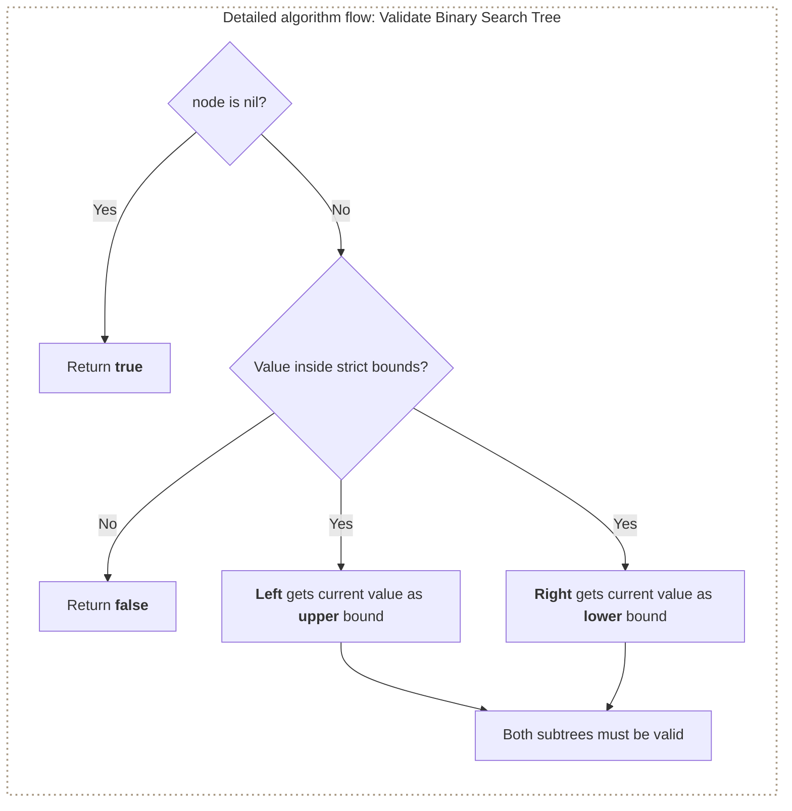
```mermaid
flowchart TD
    subgraph PROCESS["Detailed algorithm flow: Validate Binary Search Tree"]
        direction TD
        A{"node is nil?"} -->|"Yes"| T["Return <strong>true</strong>"]
        A -->|"No"| B{"Value inside strict bounds?"}
        B -->|"No"| F["Return <strong>false</strong>"]
        B -->|"Yes"| L["<strong>Left</strong> gets current value as <strong>upper</strong> bound"]
        B -->|"Yes"| R["<strong>Right</strong> gets current value as <strong>lower</strong> bound"]
        L --> C["Both subtrees must be valid"]
        R --> C
    end

    style PROCESS fill:transparent,stroke:#a89984,stroke-width:2px,stroke-dasharray:2 4
```

**Where it is used in real life:**

- Storage engines validate an ordered index after recovery, deserialization, or suspected corruption.
- In-memory caches and libraries use validation checks in tests after insertions, deletions, or tree rotations.
- Import pipelines can reject externally supplied search-tree data whose keys violate ancestor ordering constraints.

```go
// Exact question: LeetCode 98 — Given the root of a binary tree, return whether every node satisfies the strict Binary Search Tree ordering rule for its entire subtree.
//
// Example: Input tree [2,1,3] -> output true; [5,1,4,nil,nil,3,6] -> output false.
//
// Possible answer: Carry optional lower and upper bounds through DFS, narrowing the valid interval when moving left or right.
//
// Output format: Return `true` for a valid BST, including an empty tree; return `false` after the first ordering violation.
//
// Inline descriptions:
// - Checking only a node against its parent is insufficient because every descendant must respect all ancestor bounds.
// - Pointer bounds represent optional constraints without inventing numeric sentinels that could collide with valid integer values.
//
// Boundary checks:
// - A nil subtree is valid.
// - If a lower bound exists, `node.Val` must be strictly greater than it.
// - If an upper bound exists, `node.Val` must be strictly less than it; duplicate values are therefore rejected.
//
// Key variables description:
// - `lower` points to the smallest allowed ancestor value, or is nil when no lower bound exists.
// - `upper` points to the largest allowed ancestor value, or is nil when no upper bound exists.
// - `node.Val` is the BST key; `Left` and `Right` are subtree pointers rather than array positions.
//
// Logic:
// 1. Validate the current key against both inherited bounds.
// 2. Recurse left with the current key as the new upper bound.
// 3. Recurse right with the current key as the new lower bound and require both sides to pass.
type TreeNode struct {
	Val         int
	Left, Right *TreeNode
}

func isValidBST(root *TreeNode) bool {
	var validate func(*TreeNode, *int, *int) bool
	validate = func(node *TreeNode, lower, upper *int) bool {
		if node == nil {
			return true
		}
		if lower != nil && node.Val <= *lower {
			return false
		}
		if upper != nil && node.Val >= *upper {
			return false
		}
		return validate(node.Left, lower, &node.Val) &&
			validate(node.Right, &node.Val, upper)
	}

	return validate(root, nil, nil)
}

// time complexity: O(n) -> each of the `n` nodes is checked against its inherited bounds once.
// space complexity: O(h) -> DFS stores one bounds frame per level of tree height `h`.
```

> **Baby analogy:** Validating a BST is like giving every shelf a permitted number range; each smaller shelf gets a tighter upper limit and each larger shelf gets a tighter lower limit.

### Kth Smallest Element in a BST

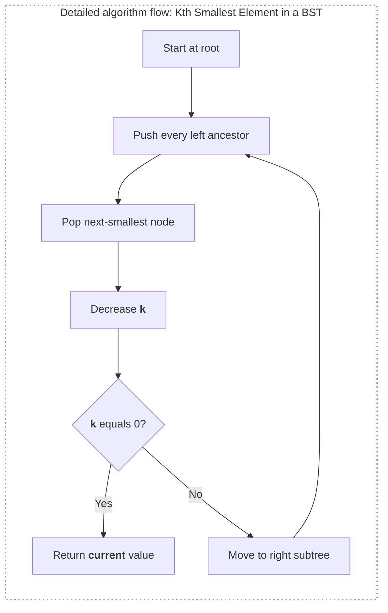
```mermaid
flowchart TD
    subgraph PROCESS["Detailed algorithm flow: Kth Smallest Element in a BST"]
        direction TD
        A["Start at root"] --> L["Push every left ancestor"]
        L --> P["Pop next-smallest node"]
        P --> K["Decrease <strong>k</strong>"]
        K --> Q{"<strong>k</strong> equals 0?"}
        Q -->|"Yes"| O["Return <strong>current</strong> value"]
        Q -->|"No"| R["Move to right subtree"]
        R --> L
    end

    style PROCESS fill:transparent,stroke:#a89984,stroke-width:2px,stroke-dasharray:2 4
```

**Where it is used in real life:**

- Ordered databases and indexes answer rank queries such as “return the 100th smallest key.”
- Leaderboards can retrieve the kth lowest score or, with reversed ordering, the kth highest score.
- Analytics systems use rank selection as a building block for medians and percentiles.

For frequent production queries, each node is usually augmented with its subtree size so the kth value can be found in O(h) time without visiting the first k nodes.

```go
// Exact question: LeetCode 230 — Given the root of a BST and a valid one-based integer `k`, return the value of its kth smallest node.
//
// Example: Input BST [3,1,4,nil,2] and k = 1 -> output 1.
//
// Possible answer: Perform iterative inorder traversal because a BST's inorder sequence is sorted, and stop when the kth node is popped from the stack.
//
// Output format: Return one integer node value; the first popped node is the smallest, so counter value `k` identifies the answer.
//
// Inline descriptions:
// - Inorder traversal visits every BST key in ascending order: left subtree, node, then right subtree.
// - The explicit stack simulates recursive calls and allows traversal to stop as soon as the kth value is reached.
//
// Boundary checks:
// - Descend only while `current != nil`.
// - Pop only while the stack contains a pending ancestor.
// - LeetCode guarantees `1 <= k <= number of nodes`; the final `return 0` is unreachable for valid input.
//
// Key variables description:
// - `stack` is a slice whose indexes represent LIFO positions and whose elements are pointers to pending BST nodes, not node values.
// - `current` points to the subtree currently being explored.
// - `k` begins as the requested one-based rank and is decremented once per node visited in sorted order.
//
// Logic:
// 1. Push the current node and all of its left ancestors.
// 2. Pop the next-smallest node and decrement `k`.
// 3. Return its key when `k == 0`; otherwise continue from its right subtree.
type TreeNode struct {
	Val         int
	Left, Right *TreeNode
}

func kthSmallest(root *TreeNode, k int) int {
	stack := []*TreeNode{}
	current := root

	for current != nil || len(stack) > 0 {
		for current != nil {
			stack = append(stack, current)
			current = current.Left
		}

		current = stack[len(stack)-1]
		stack = stack[:len(stack)-1]
		k--
		if k == 0 {
			return current.Val
		}
		current = current.Right
	}

	return 0
}

// time complexity: O(h+k) -> traversal descends at most height `h` and visits only the first `k` inorder nodes; worst case is O(n).
// space complexity: O(h) -> the explicit stack stores at most one root-to-leaf path of height `h`.
```

> **Baby analogy:** The kth smallest search is like reading numbered books from the smallest shelf upward and stopping as soon as you count to k.

---

## Interview checklist and quick answers

| Interview question | Compact answer |
| --- | --- |
| Why is a full traversal O(n)? | Each node is processed once with constant local work. |
| What is recursive DFS space? | O(h): O(log n) when balanced and O(n) when skewed. |
| When is BFS better? | When the result depends on levels, distance, or the nearest match. |
| Which BST traversal is sorted? | Inorder: Left, Node, Right. |
| Can preorder alone rebuild a general tree? | No; combine it with inorder when values are unique. |
| Why is diameter not height? | Diameter can join two child branches or live entirely inside a subtree. |
| Why does diameter DFS return height? | A parent can extend only one downward child branch. |
| Why is optimized balance checking O(n)? | Height and failure are computed together once per node. |
| What if one LCA target is an ancestor of the other? | That target is the LCA when both nodes are guaranteed to exist. |
| How do you test symmetry? | Compare the left side of one subtree with the right side of the other, and vice versa. |

Recommended practice order:

1. Maximum Depth
2. Invert Tree
3. Same Tree
4. Level Order
5. Balanced Tree
6. Diameter
7. Subtree
8. Lowest Common Ancestor
9. Validate BST
10. Kth Smallest

After these, continue with Path Sum, Right Side View, Construct Tree from Traversals, Serialize and Deserialize, Binary Tree Maximum Path Sum, Nodes at Distance K, and Trie problems.

The final mental model is:

    base case
    + solve child subtrees
    + combine their answers
    + return exactly what the parent needs

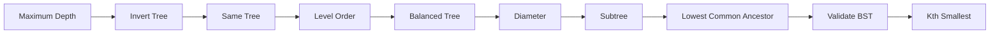
```mermaid
flowchart LR
    A["Maximum Depth"] --> B["Invert Tree"]
    B --> C["Same Tree"]
    C --> D["Level Order"]
    D --> E["Balanced Tree"]
    E --> F["Diameter"]
    F --> G["Subtree"]
    G --> H["Lowest Common Ancestor"]
    H --> I["Validate BST"]
    I --> J["Kth Smallest"]
```

> **Baby analogy:** An interview is like packing a school bag: check the lunch box, books, pencil case, and water bottle in the same order every time. A reliable checklist keeps one forgotten item from ruining the whole day.
