# Tries — A Compact Interview Guide

A trie stores strings by sharing their prefixes. Each path represents a prefix, and a terminal marker distinguishes a complete word from a path that merely exists.

- [Mental model](#mental-model)
- [Representation and core operations](#representation-and-core-operations)
- [Interview patterns and complexity](#interview-patterns-and-complexity)
- [Problem-solving checklist and common mistakes](#problem-solving-checklist-and-common-mistakes)
- [Top 10 Trie Interview Questions](#top-10-trie-interview-questions)
- [Interview checklist and next steps](#interview-checklist-and-next-steps)

> **Baby analogy:** Imagine a word tree made from shared letter branches. The guide shows where every piece belongs before you start moving the pieces.

---

## Mental model

Trie edges are character keys and child pointers are values. Traversal cost depends on query length rather than the total number of stored words.

| Real system | How the topic appears |
| --- | --- |
| Autocomplete | Complete words from a typed prefix |
| Routers | Longest-prefix matching |
| Spell checking | Detect words and candidate prefixes |
| Security | Match domain or path prefix rules |

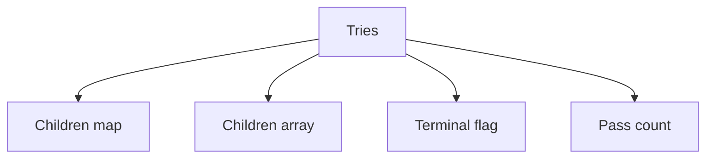

> **Baby analogy:** Imagine a word tree made from shared letter branches. Words beginning with the same letters walk together until they need different branches.

---

## Representation and core operations

The path and endpoint state are separate. Reaching all query characters proves a prefix exists; exact search also requires a terminal marker.

| Representation | Role |
| --- | --- |
| Children map | Rune keys map to child-node pointers |
| Children array | Alphabet indexes map to child pointers |
| Terminal flag | Endpoint represents a complete stored word |
| Pass count | Number of inserted words sharing a prefix |

| Operation | Typical cost | Meaning |
| --- | --- | --- |
| Insert word | O(L) | Create or follow L character edges |
| Exact search | O(L) | Follow path and check terminal |
| Prefix search | O(P) | Follow P prefix characters |
| Autocomplete | O(P+output) | Find prefix then enumerate descendants |
| Delete | O(L) | Clear terminal and prune unused nodes |

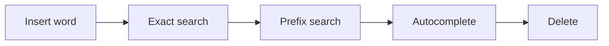

> **Baby analogy:** Imagine a word tree made from shared letter branches. Follow one letter branch at a time; a finish sticker says whether the path is a whole word.

---

## Interview patterns and complexity

| Question clue | Pattern | Practice problems in this guide |
| --- | --- | --- |
| Many prefix queries | Trie | [Implement Trie](#implement-trie), [Search Suggestions](#search-suggestions), [Count Words with a Prefix](#count-words-with-a-prefix) |
| Wildcard characters | DFS over matching child edges | [Add and Search Words with Wildcards](#add-and-search-words-with-wildcards) |
| Board dictionary search | Trie-pruned backtracking | [Word Search II](#word-search-ii) |
| Shortest dictionary root | Stop at first terminal prefix | [Replace Words](#replace-words) |
| Bitwise maximum XOR | Binary bit trie | [Maximum XOR of Two Numbers](#maximum-xor-of-two-numbers) |
| Mutation or structure choice | Prune nodes or compare alternatives | [Delete a Trie Word](#delete-a-trie-word), [Exact Search versus Prefix Search](#exact-search-versus-prefix-search), [Choose Trie or Hash Map](#choose-trie-or-hash-map) |

| Work | Complexity | Reason |
| --- | --- | --- |
| Insert or search | O(L) | One edge per query character |
| Node storage | O(total characters) | Unshared suffix characters create nodes |
| Array children | Large fixed factor | One slot per alphabet symbol |
| Map children | Sparse dynamic factor | Only existing edges stored |

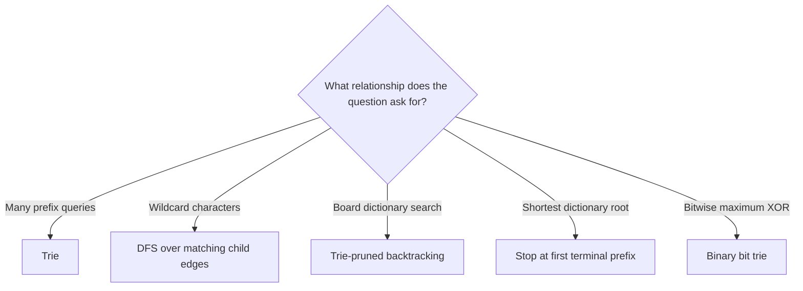

> **Baby analogy:** Imagine a word tree made from shared letter branches. Prefix clues suggest a trie, wildcard clues branch, and board clues combine the trie with backtracking.

---

## Problem-solving checklist and common mistakes

Before coding:

1. State exactly what the indexes, keys, pointers, states, or worklist elements represent.
2. Write the empty-input and smallest-input boundary behavior.
3. Choose the invariant that remains true after every step.
4. Trace one normal example and one edge case.
5. State whether output storage is included in space complexity.

Common mistakes:
- Treating a prefix endpoint as a complete word without checking terminal.
- Using a fixed array without validating the alphabet.
- Deleting nodes still shared by another word.
- Returning map-based autocomplete in a claimed deterministic order.
- Forgetting to restore board cells during backtracking.
- Ignoring Unicode when indexing letters.

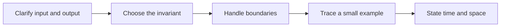

> **Baby analogy:** Imagine a word tree made from shared letter branches. A path can exist without a finish sticker, just as cat can be a prefix path without being stored as a word.

---

## Top 10 Trie Interview Questions

These are the single authoritative implementations in this guide. Each solution keeps the required question, answer, output, boundary, variable-role, logic, and complexity comments.

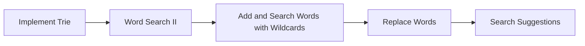

> **Baby analogy:** Imagine a word tree made from shared letter branches. These ten puzzles are practice cards; each card teaches one reusable move.

### Implement Trie

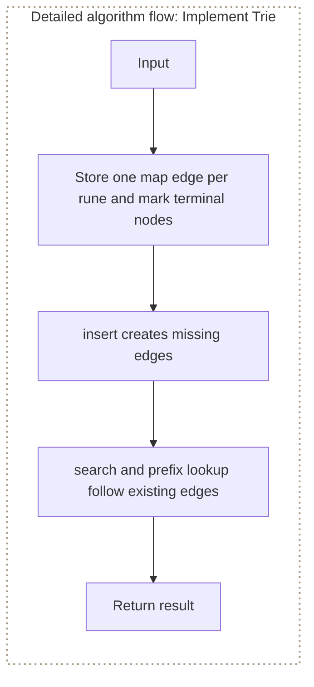

**Where it is used in real life:**

- Autocomplete services store searchable dictionaries.
- Routing systems organize prefix rules.

```go
// Exact question: Implement a trie that inserts words, tests exact-word membership, and tests whether any stored word starts with a prefix.
//
// Example: Insert car, cat, and care -> Search(car) is true, Search(ca) is false, and StartsWith(ca) is true.
//
// Possible answer: Store one map edge per rune and mark terminal nodes; insert creates missing edges, while search and prefix lookup follow existing edges.
//
// Output format: Return the `*Trie` value from `NewTrie`; the function does not print the answer.
//
// Inline descriptions:
// - The comments in this preface describe how the important expressions and state changes are used.
//
// Boundary checks:
// - `!exists` decides whether the branch or loop should continue for the current input.
//
// Key variables:
// - `current` holds the value for the state currently being calculated.
// - `node` is the endpoint reached after following every rune edge in the exact word.
// - `trie` owns the root node; its child-map keys are runes and its values are pointers to the next prefix nodes.
//
// Logic:
// 1. Create or use a map to associate each lookup key with its stored value.
// 2. Iterate through the required elements or states in the order shown.
// 3. Recursively reduce the current problem to smaller calls until a base condition is reached.
package main

import "fmt"

type TrieNode struct {
	children map[rune]*TrieNode
	isEnd    bool
}

type Trie struct {
	root *TrieNode
}

func NewTrie() *Trie {
	return &Trie{
		root: &TrieNode{
			children: make(map[rune]*TrieNode),
		},
	}
}

func (t *Trie) Insert(word string) {
	current := t.root

	for _, char := range word {
		child, exists := current.children[char]

		if !exists {
			child = &TrieNode{
				children: make(map[rune]*TrieNode),
			}
			current.children[char] = child
		}

		current = child
	}

	current.isEnd = true
}

func (t *Trie) Search(word string) bool {
	node := t.findNode(word)

	return node != nil && node.isEnd
}

func (t *Trie) StartsWith(prefix string) bool {
	return t.findNode(prefix) != nil
}

func (t *Trie) findNode(text string) *TrieNode {
	current := t.root

	for _, char := range text {
		child, exists := current.children[char]
		if !exists {
			return nil
		}

		current = child
	}

	return current
}

func main() {
	trie := NewTrie()

	trie.Insert("car")
	trie.Insert("cat")
	trie.Insert("care")

	fmt.Println(trie.Search("car"))       // true
	fmt.Println(trie.Search("ca"))        // false
	fmt.Println(trie.StartsWith("ca"))    // true
	fmt.Println(trie.Search("care"))      // true
	fmt.Println(trie.StartsWith("dog"))   // false
}

// time complexity: O(L) -> each insert, exact search, or prefix search follows one edge per rune in a length-`L` input.
// space complexity: O(L) -> insertion can create one trie node per new rune; lookup itself uses O(1) auxiliary space.
```

> **Baby analogy:** Imagine a word tree made from shared letter branches. "Implement Trie" is one small game played with the same pieces and rules.

### Word Search II

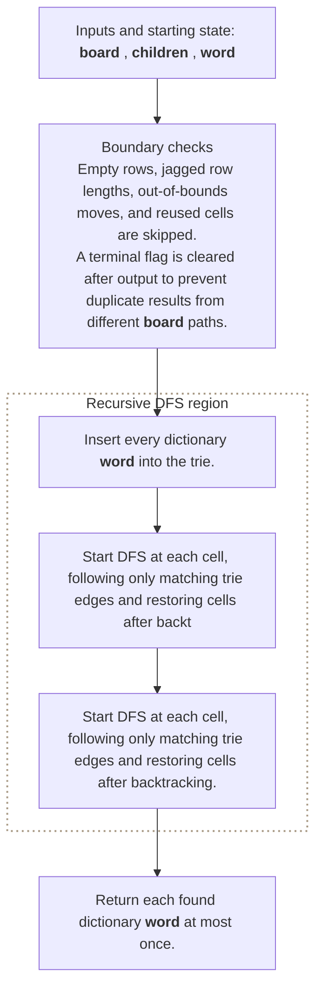

**Where it is used in real life:**

- Puzzle engines find dictionary words on letter boards.
- OCR cleanup searches plausible words across neighboring character cells.

```go
// Exact question: Which dictionary words can be formed by adjacent board cells without reusing a cell in one word?
//
// Example: Input board [[o,a,a,n],[e,t,a,e],[i,h,k,r],[i,f,l,v]] and words [oath, pea, eat, rain] -> output oath and eat.
//
// Possible answer: Build a trie of all words and run DFS while pruning any board path absent from the trie.
//
// Output format: Return each found dictionary word at most once.
//
// Inline descriptions:
// - Trie nodes represent only dictionary prefixes, so DFS abandons impossible character paths immediately.
//
// Boundary checks:
// - Empty rows, jagged row lengths, out-of-bounds moves, and reused cells are skipped.
// - A terminal flag is cleared after output to prevent duplicate results from different board paths.
//
// Key variables:
// - `board` is a two-dimensional slice whose row and column indexes are cells and whose elements are runes.
// - `children` is a map whose rune keys are next letters and whose values are trie-node pointers.
// - `word` stores a complete dictionary value only at terminal nodes.
// - Rune zero temporarily marks a board cell as used by the current DFS path.
//
// Logic:
// 1. Insert every dictionary word into the trie.
// 2. Start DFS at each cell, following only matching trie edges and restoring cells after backtracking.
type BoardTrieNode struct {
	children map[rune]*BoardTrieNode
	word     string
}

func findBoardWords(board [][]rune, words []string) []string {
	root := &BoardTrieNode{children: make(map[rune]*BoardTrieNode)}
	for _, word := range words {
		node := root
		for _, character := range word {
			if node.children[character] == nil {
				node.children[character] = &BoardTrieNode{children: make(map[rune]*BoardTrieNode)}
			}
			node = node.children[character]
		}
		node.word = word
	}

	result := []string{}
	directions := [][2]int{{1, 0}, {-1, 0}, {0, 1}, {0, -1}}
	var search func(int, int, *BoardTrieNode)
	search = func(row, column int, parent *BoardTrieNode) {
		if row < 0 || row >= len(board) || column < 0 || column >= len(board[row]) {
			return
		}
		character := board[row][column]
		if character == 0 {
			return
		}
		node := parent.children[character]
		if node == nil {
			return
		}
		if node.word != "" {
			result = append(result, node.word)
			node.word = ""
		}
		board[row][column] = 0
		for _, direction := range directions {
			search(row+direction[0], column+direction[1], node)
		}
		board[row][column] = character
	}

	for row := range board {
		for column := range board[row] {
			search(row, column, root)
		}
	}
	return result
}

// time complexity: O(W + R*C*4^L) -> in the worst case `W` builds the trie and DFS branches four ways to maximum word length `L`.
// space complexity: O(W + L) -> trie nodes store dictionary runes and DFS uses at most one word-length path.
```

> **Baby analogy:** Imagine a word tree made from shared letter branches. "Word Search II" is one small game played with the same pieces and rules.

### Add and Search Words with Wildcards

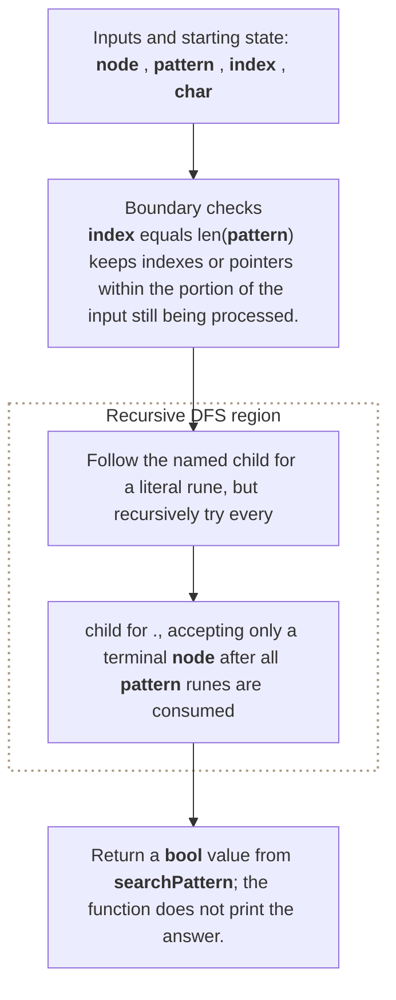

**Where it is used in real life:**

- Dictionary tools support unknown-character queries.
- Security scanners match path patterns with wildcard positions.

```go
// Exact question: Given a trie and a pattern where `.` matches any one rune, return whether the pattern matches a complete stored word.
//
// Example: Add bad, dad, and mad -> Search(.ad) and Search(b..) are true, while Search(pad) is false.
//
// Possible answer: Follow the named child for a literal rune, but recursively try every child for `.`, accepting only a terminal node after all pattern runes are consumed.
//
// Output format: Return a `bool` value from `searchPattern`; the function does not print the answer.
//
// Inline descriptions:
// - `node` points to a TrieNode value that the function reads or updates.
// - `pattern` is a slice: the index identifies an element or state, and the stored item has type rune.
// - `index` is the int input used by this example.
//
// Boundary checks:
// - `index == len(pattern)` keeps indexes or pointers within the portion of the input still being processed.
// - `char != '.'` decides whether the branch or loop should continue for the current input.
// - `!exists` decides whether the branch or loop should continue for the current input.
//
// Key variables:
// - `node` points to a TrieNode value that the function reads or updates.
// - `pattern` is a slice: the index identifies an element or state, and the stored item has type rune.
// - `char` holds the intermediate value produced by `pattern[index]`.
//
// Logic:
// 1. Create or use a slice so indexes identify positions and elements store their data or state.
// 2. Iterate through the required elements or states in the order shown.
// 3. Recursively reduce the current problem to smaller calls until a base condition is reached.
type TrieNode struct {
	children map[rune]*TrieNode
	isEnd    bool
}

func searchPattern(node *TrieNode, pattern []rune, index int) bool {
	if index == len(pattern) {
		return node.isEnd
	}

	char := pattern[index]

	if char != '.' {
		child, exists := node.children[char]
		if !exists {
			return false
		}

		return searchPattern(child, pattern, index+1)
	}

	for _, child := range node.children {
		if searchPattern(child, pattern, index+1) {
			return true
		}
	}

	return false
}

// time complexity: O(b^L) -> in the worst case, `L` wildcard positions explore up to `b` child branches at each level.
// space complexity: O(L) -> recursion keeps at most one call frame per pattern rune along the current path.
```

> **Baby analogy:** Imagine a word tree made from shared letter branches. "Add and Search Words with Wildcards" is one small game played with the same pieces and rules.

### Replace Words

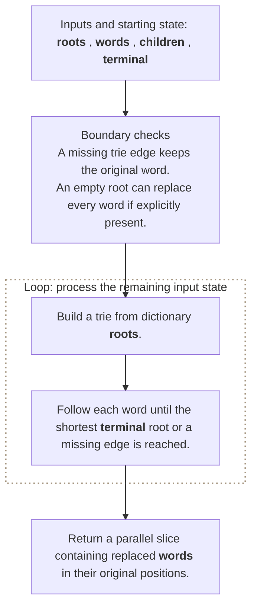

**Where it is used in real life:**

- Text normalization replaces derived terms with canonical roots.
- Search preprocessing reduces words to known dictionary stems.

```go
// Exact question: Replace every word with the shortest dictionary root that is its prefix.
//
// Example: Input roots [cat, bat, rat] and sentence 'the cattle was rattled by the battery' -> output 'the cat was rat by the bat'.
//
// Possible answer: Insert roots into a trie and stop each word traversal at the first terminal node.
//
// Output format: Return a parallel slice containing replaced words in their original positions.
//
// Inline descriptions:
// - First terminal endpoint means shortest root because traversal advances one rune at a time.
//
// Boundary checks:
// - A missing trie edge keeps the original word.
// - An empty root can replace every word if explicitly present.
//
// Key variables:
// - `roots` and `words` are slices whose indexes are input positions and whose elements are string values.
// - `children` maps rune edge keys to child-node pointers; `terminal` marks a complete root.
// - `prefix` stores runes followed for the current candidate replacement.
//
// Logic:
// 1. Build a trie from dictionary roots.
// 2. Follow each word until the shortest terminal root or a missing edge is reached.
type ReplacementTrieNode struct {
	children map[rune]*ReplacementTrieNode
	terminal bool
}

func replaceWithRoots(roots, words []string) []string {
	root := &ReplacementTrieNode{children: make(map[rune]*ReplacementTrieNode)}
	for _, dictionaryRoot := range roots {
		node := root
		for _, character := range dictionaryRoot {
			if node.children[character] == nil {
				node.children[character] = &ReplacementTrieNode{children: make(map[rune]*ReplacementTrieNode)}
			}
			node = node.children[character]
		}
		node.terminal = true
	}

	replaced := make([]string, len(words))
	for index, word := range words {
		node := root
		prefix := []rune{}
		found := node.terminal
		for _, character := range word {
			if found || node.children[character] == nil {
				break
			}
			node = node.children[character]
			prefix = append(prefix, character)
			found = node.terminal
		}
		replaced[index] = word
		if found {
			replaced[index] = string(prefix)
		}
	}
	return replaced
}

// time complexity: O(D + T) -> average-case child-map access inserts `D` dictionary runes and follows at most `T` word runes.
// space complexity: O(D + T) -> trie nodes store roots and returned strings can contain input-scale text.
```

> **Baby analogy:** Imagine a word tree made from shared letter branches. "Replace Words" is one small game played with the same pieces and rules.

### Search Suggestions

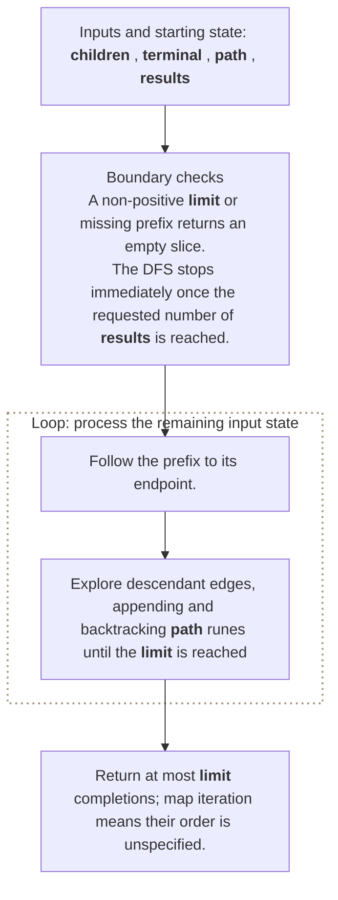

**Where it is used in real life:**

- Search boxes suggest completions after each prefix.
- Command palettes filter actions from partial input.

```go
// Exact question: Return up to `limit` stored words that begin with a supplied prefix.
//
// Example: Input words [car, card, care, cat], prefix = car, and limit = 3 -> output contains car, card, and care in any order.
//
// Possible answer: Walk to the prefix node, then DFS through its descendants to collect terminal paths.
//
// Output format: Return at most `limit` completions; map iteration means their order is unspecified.
//
// Inline descriptions:
// - Prefix lookup avoids traversing branches that cannot produce a matching completion.
//
// Boundary checks:
// - A non-positive limit or missing prefix returns an empty slice.
// - The DFS stops immediately once the requested number of results is reached.
//
// Key variables:
// - `children` maps next-rune keys to child-node pointer values.
// - `terminal` marks paths that are complete stored words.
// - `path` is a rune slice whose indexes are word positions and whose elements form the current completion.
// - `results` stores completed string values.
//
// Logic:
// 1. Follow the prefix to its endpoint.
// 2. Explore descendant edges, appending and backtracking path runes until the limit is reached.
type AutocompleteTrieNode struct {
	children map[rune]*AutocompleteTrieNode
	terminal bool
}

func autocomplete(root *AutocompleteTrieNode, prefix string, limit int) []string {
	results := []string{}
	if root == nil || limit <= 0 {
		return results
	}
	node := root
	path := []rune(prefix)
	for _, character := range path {
		node = node.children[character]
		if node == nil {
			return results
		}
	}
	var collect func(*AutocompleteTrieNode)
	collect = func(current *AutocompleteTrieNode) {
		if current == nil || len(results) >= limit {
			return
		}
		if current.terminal {
			results = append(results, string(path))
		}
		for character, child := range current.children {
			path = append(path, character)
			collect(child)
			path = path[:len(path)-1]
		}
	}
	collect(node)
	return results
}

// time complexity: O(P + S) -> average-case child-map access follows `P` prefix runes and explores `S` descendant nodes.
// space complexity: O(L + K) -> DFS path length is at most `L` and up to `K` completion strings are returned.
```

> **Baby analogy:** Imagine a word tree made from shared letter branches. "Search Suggestions" is one small game played with the same pieces and rules.

### Delete a Trie Word

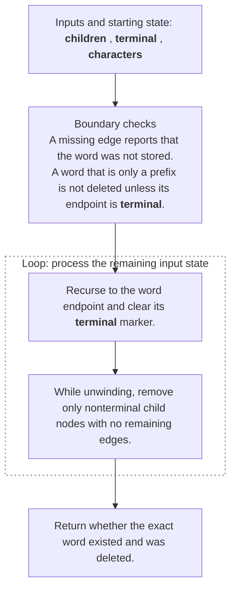

**Where it is used in real life:**

- Dictionaries remove entries while preserving shared prefixes.
- Rule engines retire one prefix rule without deleting related rules.

```go
// Exact question: How can a trie delete one word without removing prefixes still needed by other words?
//
// Example: Insert car, care, and cat, then delete car -> Search(car) is false while care and cat remain searchable.
//
// Possible answer: Clear the terminal marker, then prune a node only when it has no children and represents no other word.
//
// Output format: Return whether the exact word existed and was deleted.
//
// Inline descriptions:
// - Recursive return state tells the parent whether a now-unused child edge can be removed.
//
// Boundary checks:
// - A missing edge reports that the word was not stored.
// - A word that is only a prefix is not deleted unless its endpoint is terminal.
//
// Key variables:
// - `children` maps rune keys to child-node pointers and preserves paths shared by other words.
// - `terminal` records exact-word membership at an endpoint.
// - `characters` is a rune slice whose indexes are word positions and whose elements select edges.
//
// Logic:
// 1. Recurse to the word endpoint and clear its terminal marker.
// 2. While unwinding, remove only nonterminal child nodes with no remaining edges.
type DeletionTrieNode struct {
	children map[rune]*DeletionTrieNode
	terminal bool
}

func deleteTrieWord(root *DeletionTrieNode, word string) bool {
	characters := []rune(word)
	var remove func(*DeletionTrieNode, int) (bool, bool)
	remove = func(node *DeletionTrieNode, index int) (bool, bool) {
		if node == nil {
			return false, false
		}
		if index == len(characters) {
			if !node.terminal {
				return false, false
			}
			node.terminal = false
			return true, len(node.children) == 0
		}
		character := characters[index]
		deleted, pruneChild := remove(node.children[character], index+1)
		if !deleted {
			return false, false
		}
		if pruneChild {
			delete(node.children, character)
		}
		return true, !node.terminal && len(node.children) == 0
	}
	deleted, _ := remove(root, 0)
	return deleted
}

// time complexity: O(L) -> average-case child-map access follows and may unwind across the `L` word runes once.
// space complexity: O(L) -> recursion holds at most one frame per word rune.
```

> **Baby analogy:** Imagine a word tree made from shared letter branches. "Delete a Trie Word" is one small game played with the same pieces and rules.

### Maximum XOR of Two Numbers

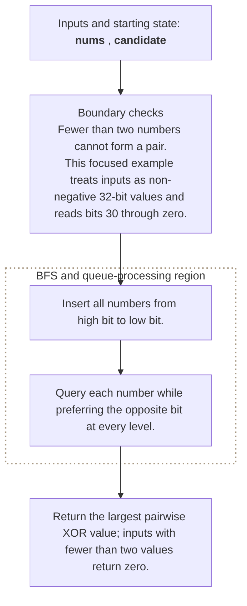

**Where it is used in real life:**

- Network and numeric analytics maximize bitwise difference.
- Compression research compares values through bit-prefix structure.

```go
// Exact question: What is the maximum XOR obtainable from any two non-negative integers using a bitwise trie?
//
// Example: Input numbers = [3,10,5,25,2,8] -> output 28 from 5 XOR 25.
//
// Possible answer: Insert every number by bits, then greedily follow the opposite bit when querying each number.
//
// Output format: Return the largest pairwise XOR value; inputs with fewer than two values return zero.
//
// Inline descriptions:
// - Opposite bits set the current XOR bit to one, so they are preferred from most significant to least significant.
//
// Boundary checks:
// - Fewer than two numbers cannot form a pair.
// - This focused example treats inputs as non-negative 32-bit values and reads bits 30 through zero.
//
// Key variables:
// - `nums` is a slice whose indexes are input positions and whose elements are non-negative integer keys.
// - `child[0]` and `child[1]` are trie edges keyed by bit value and pointing to the next bit-level node.
// - `candidate` accumulates the XOR value produced by one query path.
//
// Logic:
// 1. Insert all numbers from high bit to low bit.
// 2. Query each number while preferring the opposite bit at every level.
type BitTrieNode struct {
	child [2]*BitTrieNode
}

func maximumPairXOR(nums []int) int {
	if len(nums) < 2 {
		return 0
	}
	root := &BitTrieNode{}
	for _, number := range nums {
		node := root
		for bit := 30; bit >= 0; bit-- {
			value := (number >> bit) & 1
			if node.child[value] == nil {
				node.child[value] = &BitTrieNode{}
			}
			node = node.child[value]
		}
	}
	best := 0
	for _, number := range nums {
		node, candidate := root, 0
		for bit := 30; bit >= 0; bit-- {
			value := (number >> bit) & 1
			opposite := value ^ 1
			if node.child[opposite] != nil {
				candidate |= 1 << bit
				node = node.child[opposite]
			} else {
				node = node.child[value]
			}
		}
		if candidate > best {
			best = candidate
		}
	}
	return best
}

// time complexity: O(n * B) -> each of `n` numbers is inserted and queried across fixed bit width `B=31`.
// space complexity: O(n * B) -> insertion may create one bit-trie node per number per bit.
```

> **Baby analogy:** Imagine a word tree made from shared letter branches. "Maximum XOR of Two Numbers" is one small game played with the same pieces and rules.

### Count Words with a Prefix

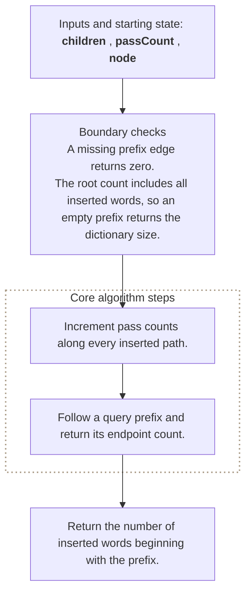

**Where it is used in real life:**

- Search analytics counts indexed terms under a prefix.
- Autocomplete ranks prefixes by dictionary volume.

```go
// Exact question: How many stored words share a requested prefix?
//
// Example: Insert app, apple, ape, and bat; prefix ap -> output 3.
//
// Possible answer: Store a pass count in every trie node and return the count at the prefix endpoint.
//
// Output format: Return the number of inserted words beginning with the prefix.
//
// Inline descriptions:
// - Updating counts during insertion makes the later prefix query depend only on prefix length.
//
// Boundary checks:
// - A missing prefix edge returns zero.
// - The root count includes all inserted words, so an empty prefix returns the dictionary size.
//
// Key variables:
// - `children` is a map whose rune keys label edges and whose pointer values identify prefix nodes.
// - `passCount` is the number of inserted words whose paths include a node.
// - `node` is the current endpoint while inserting or querying.
//
// Logic:
// 1. Increment pass counts along every inserted path.
// 2. Follow a query prefix and return its endpoint count.
type CountingTrieNode struct {
	children  map[rune]*CountingTrieNode
	passCount int
}

func (root *CountingTrieNode) InsertForCounting(word string) {
	if root.children == nil {
		root.children = make(map[rune]*CountingTrieNode)
	}
	root.passCount++
	node := root
	for _, character := range word {
		if node.children[character] == nil {
			node.children[character] = &CountingTrieNode{children: make(map[rune]*CountingTrieNode)}
		}
		node = node.children[character]
		node.passCount++
	}
}

func (root *CountingTrieNode) CountPrefix(prefix string) int {
	if root == nil {
		return 0
	}
	node := root
	for _, character := range prefix {
		node = node.children[character]
		if node == nil {
			return 0
		}
	}
	return node.passCount
}

// time complexity: O(L) -> average-case child-map access follows the `L` supplied runes once.
// space complexity: O(L) -> insertion may create one node per new rune, while a query uses O(1) auxiliary space.
```

> **Baby analogy:** Imagine a word tree made from shared letter branches. "Count Words with a Prefix" is one small game played with the same pieces and rules.

### Exact Search versus Prefix Search

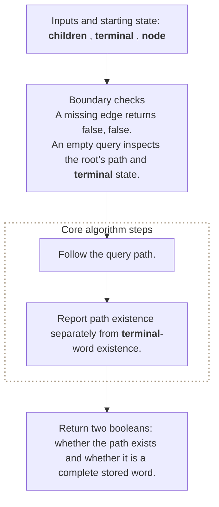

**Where it is used in real life:**

- Routers distinguish a complete route from an intermediate prefix.
- Spell checkers distinguish complete words from valid beginnings.

```go
// Exact question: What is the difference between exact search and prefix search in a trie?
//
// Example: After storing car, query ca -> path exists true and complete word false; query car -> true, true.
//
// Possible answer: Both follow the same character path, but exact search also requires the endpoint's terminal marker.
//
// Output format: Return two booleans: whether the path exists and whether it is a complete stored word.
//
// Inline descriptions:
// - The pair makes the endpoint-state distinction explicit for an interview answer.
//
// Boundary checks:
// - A missing edge returns `false, false`.
// - An empty query inspects the root's path and terminal state.
//
// Key variables:
// - `children` maps rune edge keys to child-node pointer values.
// - `terminal` records complete-word membership at the endpoint.
// - `node` is the state after consuming all query runes.
//
// Logic:
// 1. Follow the query path.
// 2. Report path existence separately from terminal-word existence.
type MockTrieNode struct {
	children map[rune]*MockTrieNode
	terminal bool
}

func triePathAndWord(root *MockTrieNode, query string) (bool, bool) {
	if root == nil {
		return false, false
	}
	node := root
	for _, character := range query {
		node = node.children[character]
		if node == nil {
			return false, false
		}
	}
	return true, node.terminal
}

// time complexity: O(L) -> average-case child-map access follows one edge for each of `L` runes.
// space complexity: O(1) -> only one current-node pointer is retained.
```

> **Baby analogy:** Imagine a word tree made from shared letter branches. "Exact Search versus Prefix Search" is one small game played with the same pieces and rules.

### Choose Trie or Hash Map

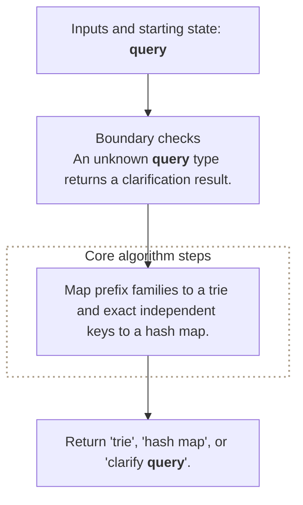

**Where it is used in real life:**

- System designers choose between exact lookup and prefix navigation.
- Memory planning compares shared prefixes with direct whole-key indexing.

```go
// Exact question: Should a word problem use a trie or a hash map?
//
// Example: Input query = autocomplete -> output trie; input query = exact key -> output hash map.
//
// Possible answer: Use a trie for shared-prefix traversal and a hash map for independent exact-key lookup.
//
// Output format: Return `"trie"`, `"hash map"`, or `"clarify query"`.
//
// Inline descriptions:
// - Exact membership alone does not need character-by-character prefix state.
//
// Boundary checks:
// - An unknown query type returns a clarification result.
//
// Key variables:
// - `query` describes whether keys are requested as full independent values or reusable prefixes.
// - The returned string names the most direct lookup structure.
//
// Logic:
// 1. Map prefix families to a trie and exact independent keys to a hash map.
func chooseTrieOrHashMap(query string) string {
	switch query {
	case "prefix", "autocomplete", "wildcard characters":
		return "trie"
	case "exact key", "frequency by full word":
		return "hash map"
	default:
		return "clarify query"
	}
}

// time complexity: O(1) -> a fixed set of query labels is checked.
// space complexity: O(1) -> selection allocates neither structure.
```

> **Baby analogy:** Imagine a word tree made from shared letter branches. "Choose Trie or Hash Map" is one small game played with the same pieces and rules.

---

## Interview checklist and next steps

Use this answer order during an interview:

1. Restate the input, output, and constraints.
2. Name the pattern and the invariant.
3. Explain the data structure roles before coding.
4. Handle boundary cases explicitly.
5. Walk through a small example.
6. Give time and space complexity with variable definitions.

Recommended practice order:
1. [Implement Trie](#implement-trie)
2. [Word Search II](#word-search-ii)
3. [Add and Search Words with Wildcards](#add-and-search-words-with-wildcards)
4. [Replace Words](#replace-words)
5. [Search Suggestions](#search-suggestions)
6. [Delete a Trie Word](#delete-a-trie-word)
7. [Maximum XOR of Two Numbers](#maximum-xor-of-two-numbers)
8. [Count Words with a Prefix](#count-words-with-a-prefix)
9. [Exact Search versus Prefix Search](#exact-search-versus-prefix-search)
10. [Choose Trie or Hash Map](#choose-trie-or-hash-map)

Continue with: Concatenated Words, Stream of Characters, Palindrome Pairs, Longest Word in Dictionary, Compressed Radix Tree.

```mermaid
flowchart LR
    Q0["Implement Trie"]
    Q0 --> Q1["Word Search II"]
    Q1 --> Q2["Add and Search Words with Wildcards"]
    Q2 --> Q3["Replace Words"]
    Q3 --> Q4["Search Suggestions"]
    Q4 --> Q5["Delete a Trie Word"]
    Q5 --> Q6["Maximum XOR of Two Numbers"]
    Q6 --> Q7["Count Words with a Prefix"]
    Q7 --> Q8["Exact Search versus Prefix Search"]
    Q8 --> Q9["Choose Trie or Hash Map"]
```

> **Baby analogy:** Imagine a word tree made from shared letter branches. Pack the same checklist every time so no important interview step is forgotten.
