# Kubernetes configuration: the complete mental model

The linked Kubernetes v1.36 configuration section covers five areas:

1. ConfigMaps
2. Secrets
3. Pod and container resource management
4. kubeconfig files
5. Windows node resource management

Operationally, Kubernetes configuration is broader. It includes application settings, API objects, control-plane component settings, kubelet configuration, container-runtime settings, and operating-system configuration. ([Kubernetes][1])

The most important distinction is:

> **API-backed configuration describes the desired state of the cluster. Host-level configuration controls how Kubernetes processes and machines implement that state.**

---

# 1. The configuration layers

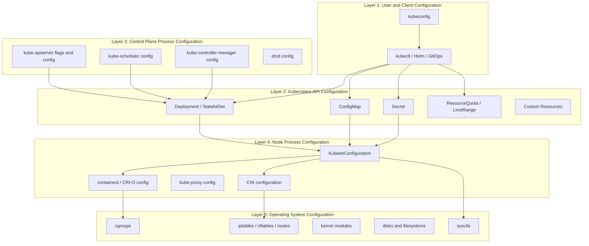

These layers have different lifecycles:

| Layer                  | Typical storage                          | Applied by                      | Change behavior                          |
| ---------------------- | ---------------------------------------- | ------------------------------- | ---------------------------------------- |
| kubeconfig             | User or component filesystem             | kubectl/client library          | Used on next client request              |
| API objects            | etcd through API server                  | Controllers, scheduler, kubelet | Continuously reconciled                  |
| Control-plane config   | Local files, flags, static Pod manifests | kubeadm, systemd, kubelet       | Usually requires component restart       |
| Kubelet/runtime config | Node filesystem                          | systemd, kubelet, runtime       | Usually requires process or node restart |
| OS configuration       | Node filesystem/kernel                   | OS automation                   | May require service or node restart      |

---

# 2. How an API configuration change flows

Suppose you run:

```bash
kubectl apply -f deployment.yaml
```

The configuration does not go directly to a worker node.

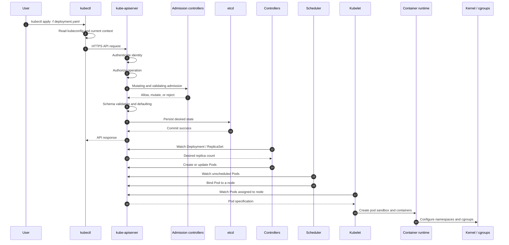

The API server is the central interface for manipulating Kubernetes objects. Requests pass through authentication, authorization, admission control, validation, and persistence. The serialized desired state is stored in etcd. Controllers, schedulers, and kubelets watch the API and react asynchronously. ([Kubernetes][2])

This creates a **reconciliation model**:

```text
Desired state in API
        ↓
Controller observes difference
        ↓
Controller performs an action
        ↓
Actual state moves toward desired state
        ↓
Status written back to API
```

For example:

```yaml
spec:
  replicas: 5
```

is not an instruction saying “create five Pods immediately.” It is a declaration that Kubernetes should keep trying to maintain five replicas.

---

# 3. Ways to manage Kubernetes objects

Kubernetes supports three main object-management styles.

| Method                    | Example                                     | Best use                                              |
| ------------------------- | ------------------------------------------- | ----------------------------------------------------- |
| Imperative command        | `kubectl scale deployment api --replicas=5` | Debugging and one-time operations                     |
| Imperative file operation | `kubectl create -f app.yaml`                | Simple workflows with one writer                      |
| Declarative configuration | `kubectl apply -f app.yaml`                 | Production, GitOps and multiple configuration writers |

Imperative commands operate directly on live objects and are convenient for development, but they provide weak configuration history. Declarative management calculates patches and better preserves fields owned by other actors. ([Kubernetes][3])

A useful rule:

```text
Experiment or emergency:
    kubectl command

Repeatable production deployment:
    YAML + kubectl apply

Large production platform:
    Git + GitOps controller + declarative APIs
```

---

# 4. ConfigMaps

A ConfigMap stores **non-sensitive configuration** separately from the container image.

Examples include:

* Log levels
* Feature switches
* Service endpoints
* Application configuration files
* Command-line arguments
* Environment-specific values

A ConfigMap supports UTF-8 strings in `data` and binary values in `binaryData`. A single ConfigMap is limited to 1 MiB. ConfigMaps are namespace-scoped and cannot be referenced by static Pods. ([Kubernetes][4])

## 4.1 ConfigMap consumption methods

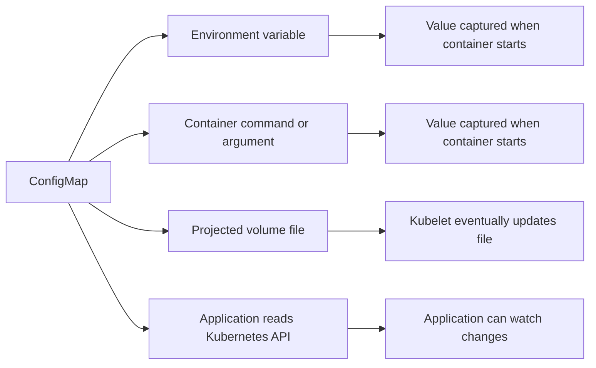

| Method                | Updates automatically? | Appropriate use                               |
| --------------------- | ---------------------: | --------------------------------------------- |
| Environment variable  |                     No | Small startup-time settings                   |
| Command or argument   |                     No | Process startup options                       |
| Volume-mounted file   |             Eventually | Applications that read configuration files    |
| Direct Kubernetes API | Application-controlled | Controllers and dynamic configuration systems |

For a mounted ConfigMap, the kubelet eventually refreshes the projected files. Environment variables are fixed when the container starts and require container recreation to change. A ConfigMap mounted using `subPath` does not receive projected updates. ([Kubernetes][4])

Kubernetes updates the file; it does not force the application to reread it. The application must support one of the following:

* File watching
* Periodic rereading
* SIGHUP-based reload
* Sidecar-triggered reload
* Pod restart

## 4.2 Example

```yaml
apiVersion: v1
kind: ConfigMap
metadata:
  name: checkout-config-v3
  namespace: payments
data:
  LOG_LEVEL: "info"

  application.yaml: |
    server:
      port: 8080
    payment:
      timeout: 2s
      retryCount: 3
---
apiVersion: apps/v1
kind: Deployment
metadata:
  name: checkout
  namespace: payments
spec:
  replicas: 3

  selector:
    matchLabels:
      app: checkout

  template:
    metadata:
      labels:
        app: checkout

    spec:
      containers:
        - name: checkout
          image: registry.example.com/checkout:3.2.0

          env:
            - name: LOG_LEVEL
              valueFrom:
                configMapKeyRef:
                  name: checkout-config-v3
                  key: LOG_LEVEL

          volumeMounts:
            - name: application-config
              mountPath: /etc/checkout
              readOnly: true

      volumes:
        - name: application-config
          configMap:
            name: checkout-config-v3
```

Here:

* `LOG_LEVEL` is copied into the process environment when the container starts.
* `/etc/checkout/application.yaml` is projected as a file.
* Updating `LOG_LEVEL` will not update the running process.
* Updating `application.yaml` will eventually update the file, but the application must reload it.

## 4.3 Immutable ConfigMaps

```yaml
apiVersion: v1
kind: ConfigMap
metadata:
  name: checkout-config-v3
immutable: true
data:
  LOG_LEVEL: "info"
```

Immutable ConfigMaps protect against accidental mutation and reduce kube-apiserver and kubelet watch activity in large clusters. An immutable ConfigMap cannot be modified; replace it with a new named object and update the workload reference. ([Kubernetes][4])

A strong release pattern is:

```text
checkout-config-v1
checkout-config-v2
checkout-config-v3
```

The Deployment points to a specific version. Changing the ConfigMap name in the Pod template also triggers a controlled rollout.

---

# 5. Secrets

A Secret stores small pieces of sensitive information such as credentials, keys, certificates and tokens.

A Kubernetes Secret is **not automatically equivalent to a secure vault**. Secret data is base64-encoded in YAML, not encrypted merely because it is base64. By default, Secret data can be stored unencrypted in etcd unless encryption at rest is configured. Kubernetes recommends encryption at rest, restrictive RBAC, limiting which Pods receive Secrets, and considering external secret-management systems. ([Kubernetes][5])

## 5.1 Secret types

| Type                                  | Use                                                   |
| ------------------------------------- | ----------------------------------------------------- |
| `Opaque`                              | Generic passwords, tokens and application credentials |
| `kubernetes.io/tls`                   | TLS certificate and private key                       |
| `kubernetes.io/dockerconfigjson`      | Private container-registry credentials                |
| `kubernetes.io/basic-auth`            | Username/password credentials                         |
| `kubernetes.io/ssh-auth`              | SSH private key                                       |
| `kubernetes.io/service-account-token` | Legacy long-lived service-account token               |
| `bootstrap.kubernetes.io/token`       | Node bootstrap and cluster joining                    |

For service-account authentication, short-lived, rotating tokens obtained through the TokenRequest mechanism are preferred over manually created long-lived service-account-token Secrets. ([Kubernetes][5])

## 5.2 Secret delivery

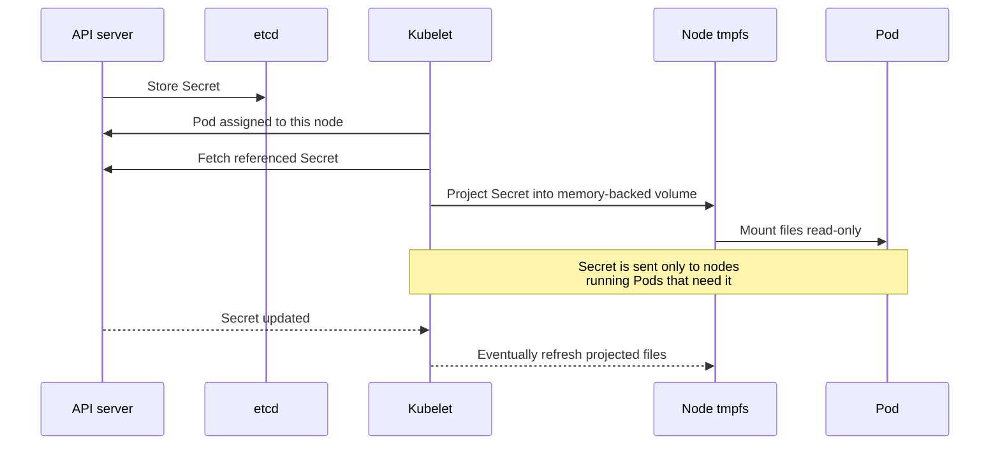

The kubelet sends a Secret only to a node that runs a Pod requiring it. Secret volumes are stored using memory-backed storage on the node and removed when the Pod is deleted. Secret volume updates are eventual; a Secret mounted with `subPath` does not receive automatic updates. ([Kubernetes][5])

## 5.3 Example: use a mounted Secret

```yaml
apiVersion: v1
kind: Secret
metadata:
  name: checkout-db
  namespace: payments
type: Opaque
stringData:
  username: checkout-service
  password: replace-through-secret-manager
---
apiVersion: apps/v1
kind: Deployment
metadata:
  name: checkout
  namespace: payments
spec:
  replicas: 3

  selector:
    matchLabels:
      app: checkout

  template:
    metadata:
      labels:
        app: checkout

    spec:
      containers:
        - name: checkout
          image: registry.example.com/checkout:3.2.0

          volumeMounts:
            - name: database-credentials
              mountPath: /var/run/secrets/checkout-db
              readOnly: true

      volumes:
        - name: database-credentials
          secret:
            secretName: checkout-db
            defaultMode: 0400
```

The container receives files such as:

```text
/var/run/secrets/checkout-db/username
/var/run/secrets/checkout-db/password
```

Mounted files are generally preferable when an application supports credential reload. Environment-variable Secrets are simpler, but the process receives only the value captured at startup and usually needs a restart during rotation.

Do not commit a real plaintext password into Git. The `stringData` example only demonstrates object structure.

## 5.4 Recommended production design

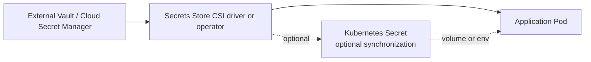

Use native Kubernetes Secrets when:

* The credential is small.
* Rotation requirements are moderate.
* Encryption at rest and RBAC are properly configured.
* You accept the Secret being represented in the Kubernetes API.

Use an external secret store when:

* Credentials rotate frequently.
* Central audit and revocation are required.
* Multiple clusters share secret-management infrastructure.
* Kubernetes administrators should not automatically have access to source credentials.
* Regulatory or organizational policy requires a dedicated secrets system.

---

# 6. Resource configuration

Resource configuration controls scheduling, isolation and eviction.

```yaml
resources:
  requests:
    cpu: 250m
    memory: 256Mi
  limits:
    cpu: "1"
    memory: 512Mi
```

## 6.1 Requests versus limits

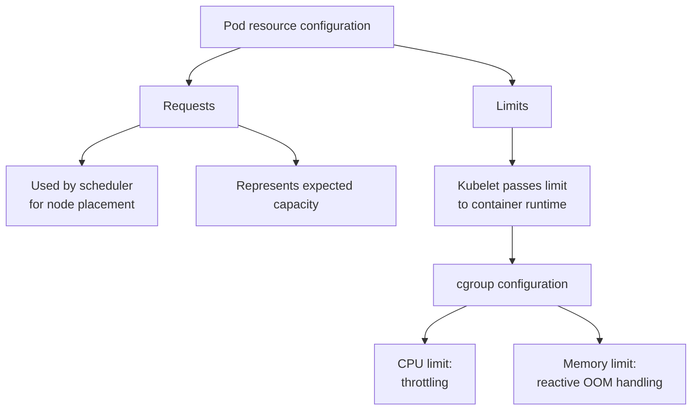

Resource requests influence scheduler placement. Limits are passed by the kubelet to the container runtime and implemented through mechanisms such as Linux cgroups. CPU limits are enforced through throttling; memory limits are reactive and can result in an out-of-memory termination when the container exceeds available memory. ([Kubernetes][6])

Kubernetes supports resource management for:

* CPU
* Memory
* Local ephemeral storage
* Huge pages
* Extended resources such as GPUs

## 6.2 Practical interpretation

| Configuration            | Scheduler behavior                   | Runtime behavior                               |
| ------------------------ | ------------------------------------ | ---------------------------------------------- |
| No request, no limit     | Little placement protection          | Container can compete for available resources  |
| Request only             | Capacity considered during placement | Can burst above request while capacity exists  |
| Request and CPU limit    | Predictable placement                | CPU throttled above limit                      |
| Request and memory limit | Predictable placement                | Container may be OOM-killed above memory limit |
| Request equals limit     | Strongest QoS eligibility            | Least burst flexibility                        |

Example:

```yaml
resources:
  requests:
    cpu: 500m
    memory: 512Mi
  limits:
    cpu: "2"
    memory: 1Gi
```

Interpretation:

* Scheduler needs a node with at least 0.5 CPU and 512 MiB allocatable.
* The container can use more CPU when available, up to two CPUs.
* The container is constrained near 1 GiB of memory.
* Under pressure, the request helps Kubernetes decide which workloads are less protected.

## 6.3 QoS classes

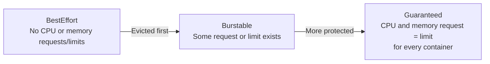

Kubernetes assigns one of three QoS classes:

| QoS class  | Typical use                                              |
| ---------- | -------------------------------------------------------- |
| Guaranteed | Critical infrastructure, latency-sensitive services      |
| Burstable  | Most production applications                             |
| BestEffort | Disposable jobs, experiments and non-critical batch work |

During node pressure, BestEffort Pods are generally considered before Burstable and Guaranteed Pods for eviction. Guaranteed requires CPU and memory requests to equal their corresponding limits for all containers, subject to Pod-level resource configuration rules. ([Kubernetes][7])

Do not automatically set a low CPU limit merely for consistency. A latency-sensitive service can suffer severe throttling even when the node has idle CPU. Set CPU limits based on workload behavior and organizational policy.

## 6.4 LimitRange and ResourceQuota

A `LimitRange` controls individual objects in a namespace:

```yaml
apiVersion: v1
kind: LimitRange
metadata:
  name: container-defaults
  namespace: payments
spec:
  limits:
    - type: Container

      defaultRequest:
        cpu: 100m
        memory: 128Mi

      default:
        cpu: "1"
        memory: 1Gi

      min:
        cpu: 50m
        memory: 64Mi

      max:
        cpu: "4"
        memory: 4Gi
```

A `ResourceQuota` controls total namespace consumption:

```yaml
apiVersion: v1
kind: ResourceQuota
metadata:
  name: payments-budget
  namespace: payments
spec:
  hard:
    requests.cpu: "20"
    requests.memory: 40Gi
    limits.cpu: "40"
    limits.memory: 80Gi
    pods: "100"
    persistentvolumeclaims: "20"
```

`LimitRange` applies per-object defaults and constraints during admission. `ResourceQuota` restricts aggregate namespace resource usage and object counts. They are commonly used together: LimitRange prevents malformed individual workloads, while ResourceQuota prevents one namespace or team from consuming the entire cluster. ([Kubernetes][8])

---

# 7. kubeconfig

A kubeconfig file tells a Kubernetes client:

* Which API server to contact
* Which certificate authority to trust
* Which user identity or authentication mechanism to use
* Which namespace to use by default
* Which cluster/user combination is the active context

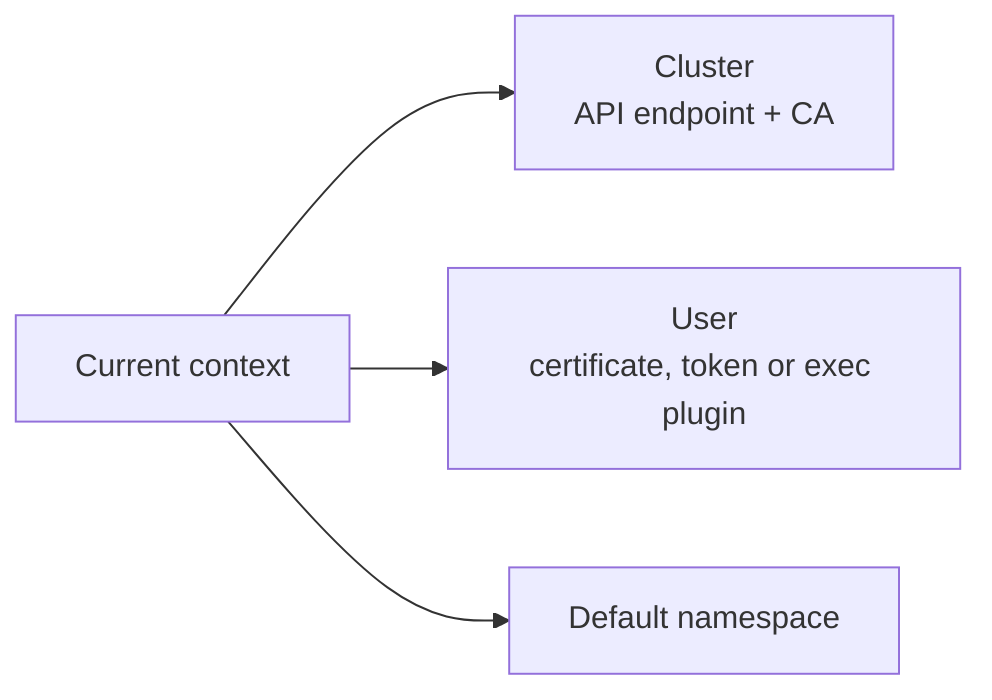

Example:

```yaml
apiVersion: v1
kind: Config

clusters:
  - name: production
    cluster:
      server: https://api.example.com:6443
      certificate-authority: /home/user/.kube/prod-ca.crt

users:
  - name: platform-admin
    user:
      client-certificate: /home/user/.kube/admin.crt
      client-key: /home/user/.kube/admin.key

contexts:
  - name: platform-admin@production
    context:
      cluster: production
      user: platform-admin
      namespace: platform-system

current-context: platform-admin@production
```

By default, kubectl reads `~/.kube/config`. A different file can be selected using `KUBECONFIG` or `--kubeconfig`. A context groups a cluster, user and optional namespace. Kubeconfig files must be treated as trusted sensitive content because authentication plug-ins and file references can expose information or execute external credential helpers. ([Kubernetes][9])

## kubeconfig is not a ConfigMap

These are different mechanisms:

| kubeconfig                                           | ConfigMap                                       |
| ---------------------------------------------------- | ----------------------------------------------- |
| Client-side connection and identity configuration    | API object containing application configuration |
| Usually stored on a user's or component's filesystem | Stored through the API server in etcd           |
| Used before an API request is made                   | Retrieved after authenticating to the API       |
| Contains cluster endpoints and credentials           | Should not contain confidential credentials     |

kubeadm commonly creates component-specific kubeconfigs such as:

* `admin.conf`
* `controller-manager.conf`
* `scheduler.conf`
* `kubelet.conf`
* Bootstrap kubelet configuration

These files are confidential because they provide identities and permissions to cluster components. ([Kubernetes][10])

---

# 8. Control-plane-level configuration

There are two different categories of control-plane configuration.

## 8.1 API state processed by the control plane

Examples:

* Deployments
* Services
* ConfigMaps
* Secrets
* NetworkPolicies
* RBAC
* ResourceQuotas
* Admission-policy resources

These are stored in etcd and continuously reconciled.

## 8.2 Configuration of the control-plane components themselves

Examples:

* API server authentication and authorization
* Admission plug-ins
* Audit policy
* Encryption-at-rest provider configuration
* API feature gates
* Scheduler profiles and plug-ins
* Controller-manager behavior
* etcd TLS, storage and compaction settings

```mermaid
flowchart TB
    KADM[kubeadm configuration]

    KADM --> APIM[/etc/kubernetes/manifests/<br/>kube-apiserver.yaml]
    KADM --> SCM[/etc/kubernetes/manifests/<br/>kube-scheduler.yaml]
    KADM --> CMM[/etc/kubernetes/manifests/<br/>kube-controller-manager.yaml]
    KADM --> ETCDM[/etc/kubernetes/manifests/<br/>etcd.yaml]

    KUBELET[Local kubelet] -->|Watches directory| APIM
    KUBELET --> SCM
    KUBELET --> CMM
    KUBELET --> ETCDM

    APIM --> APIPOD[kube-apiserver static Pod]
    SCM --> SCHPOD[kube-scheduler static Pod]
    CMM --> CMPOD[kube-controller-manager static Pod]
    ETCDM --> ETCDPOD[etcd static Pod]
```

In a kubeadm-managed control plane, kubeadm writes static Pod manifests into `/etc/kubernetes/manifests`. The local kubelet watches this directory and starts or restarts the control-plane containers when manifests change. During upgrades, kubeadm can rewrite these manifests and the kubelet restarts the affected components. ([Kubernetes][10])

## 8.3 Why static Pods are special

A control-plane static Pod starts before or independently of normal scheduler-driven workloads.

Consequently:

* The kubelet manages it directly from a local manifest.
* The scheduler does not schedule it.
* Its configuration must be available locally.
* It cannot directly reference ConfigMaps or Secrets as normal API-backed Pods do.
* Certificates, audit policies and component config files are commonly mounted from host paths.

The inability of static Pods to refer to API objects prevents a circular dependency where the API server would need the API server to obtain its own startup configuration. ([Kubernetes][5])

## 8.4 kubeadm control-plane configuration example

```yaml
apiVersion: kubeadm.k8s.io/v1beta4
kind: ClusterConfiguration

apiServer:
  extraArgs:
    - name: audit-policy-file
      value: /etc/kubernetes/audit/policy.yaml
    - name: audit-log-path
      value: /var/log/kubernetes/audit.log
    - name: audit-log-maxage
      value: "30"

  extraVolumes:
    - name: audit-policy
      hostPath: /etc/kubernetes/audit
      mountPath: /etc/kubernetes/audit
      readOnly: true
      pathType: DirectoryOrCreate

    - name: audit-logs
      hostPath: /var/log/kubernetes
      mountPath: /var/log/kubernetes
      readOnly: false
      pathType: DirectoryOrCreate

scheduler:
  extraArgs:
    - name: config
      value: /etc/kubernetes/scheduler-config.yaml

  extraVolumes:
    - name: scheduler-config
      hostPath: /etc/kubernetes/scheduler-config.yaml
      mountPath: /etc/kubernetes/scheduler-config.yaml
      readOnly: true
      pathType: File
```

kubeadm supports component flags, configuration files, patches and additional volume mounts for the API server, scheduler, controller manager and local etcd. Scheduler configuration is commonly mounted into the scheduler static Pod through an extra volume. ([Kubernetes][11])

## 8.5 Control-plane component responsibilities

### kube-apiserver

Configuration commonly controls:

* Listening addresses and TLS
* Authentication mechanisms
* Authorization modes
* Admission controllers
* Audit logging
* Encryption at rest
* API enablement
* Request limits and timeouts
* Service network range

A mistake here can prevent all clients and controllers from communicating with the cluster.

### kube-scheduler

Configuration commonly controls:

* Scheduling profiles
* Filter and score plug-ins
* Plug-in weights
* Extenders
* Leader election
* Percentage of nodes evaluated
* Queueing and backoff behavior

Scheduler configuration affects **new placement decisions**. It normally does not move already-running Pods merely because the scoring configuration changed.

### kube-controller-manager

Configuration controls controllers such as:

* Deployment and ReplicaSet reconciliation
* Node lifecycle
* EndpointSlice management
* Namespace lifecycle
* Service-account token handling
* Certificate signing
* Cluster CIDR allocation
* Leader election

### etcd

Configuration controls:

* Client and peer TLS
* Data directory
* Peer membership
* Snapshot and restore
* Compaction and defragmentation
* Storage limits
* Quorum behavior

etcd must not be edited as if it were a generic database. Kubernetes state should be changed through the API server, while etcd operations should be limited to cluster lifecycle, maintenance and recovery.

---

# 9. Node and host-level configuration

The node is where desired state becomes running processes.

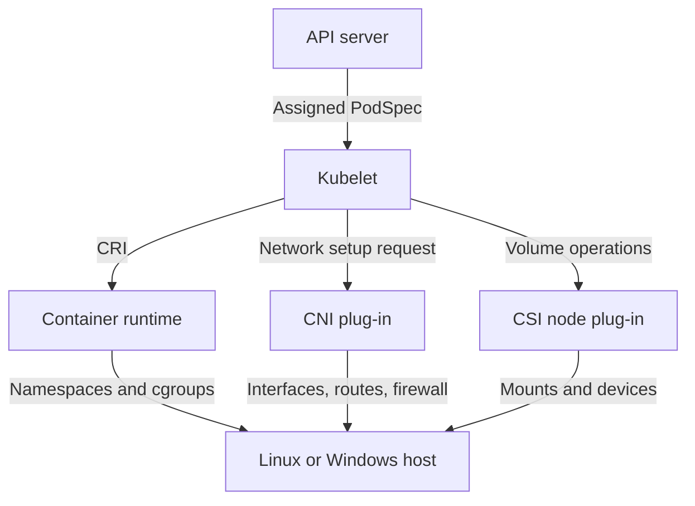

## 9.1 Kubelet configuration

The kubelet can load a versioned `KubeletConfiguration` YAML or JSON file using the `--config` flag. Command-line flags can override file settings. In kubeadm-managed clusters, the active file is commonly `/var/lib/kubelet/config.yaml`. ([Kubernetes][12])

Example:

```yaml
apiVersion: kubelet.config.k8s.io/v1beta1
kind: KubeletConfiguration

cgroupDriver: systemd

serializeImagePulls: false

kubeReserved:
  cpu: 500m
  memory: 1Gi
  ephemeral-storage: 1Gi

systemReserved:
  cpu: 500m
  memory: 1Gi
  ephemeral-storage: 1Gi

enforceNodeAllocatable:
  - pods
  - kube-reserved
  - system-reserved

evictionHard:
  memory.available: 500Mi
  nodefs.available: 10%
  nodefs.inodesFree: 5%
  imagefs.available: 15%

mergeDefaultEvictionSettings: true

configMapAndSecretChangeDetectionStrategy: Watch

maxPods: 110
```

This configuration controls several independent concerns:

| Field                                       | Purpose                                                |
| ------------------------------------------- | ------------------------------------------------------ |
| `cgroupDriver`                              | Places processes under the correct cgroup hierarchy    |
| `kubeReserved`                              | Reserves capacity for kubelet and container runtime    |
| `systemReserved`                            | Reserves capacity for operating-system services        |
| `enforceNodeAllocatable`                    | Enforces resource boundaries using cgroups             |
| `evictionHard`                              | Triggers Pod eviction before the node becomes unusable |
| `maxPods`                                   | Limits the number of Pods on the node                  |
| `configMapAndSecretChangeDetectionStrategy` | Controls how the kubelet notices object changes        |
| `serializeImagePulls`                       | Controls concurrent versus serial image pulls          |

The kubelet supports `Get`, `Cache`, and `Watch` strategies for ConfigMap and Secret change detection; `Watch` is the default. ([Kubernetes][13])

## 9.2 Node allocatable

A useful conceptual formula is:

```text
Node allocatable
  ≈ Node capacity
    - kubeReserved
    - systemReserved
    - eviction safety margin
```

Example:

```text
Physical node:
    CPU:     16 cores
    Memory:  32 GiB

kubeReserved:
    CPU:      0.5 cores
    Memory:   1 GiB

systemReserved:
    CPU:      0.5 cores
    Memory:   1 GiB

Eviction headroom:
    Memory:   0.5 GiB

Approximate Pod capacity:
    CPU:      15 cores
    Memory:   29.5 GiB
```

The scheduler uses the Node's allocatable capacity rather than treating all physical capacity as available to Pods. `kubeReserved` protects Kubernetes node processes, while `systemReserved` protects operating-system daemons. The kubelet can enforce these reservations through cgroups. ([Kubernetes][14])

Without reservations, Pods may consume nearly all CPU or memory, starving:

* kubelet
* container runtime
* systemd
* journald
* SSH
* networking daemons
* storage daemons

The node can then become `NotReady` even though individual application containers appear healthy.

## 9.3 cgroup driver matching

The kubelet and container runtime must use compatible cgroup drivers.

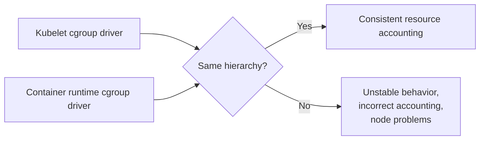

On systemd-based Linux distributions, the `systemd` cgroup driver is generally recommended. kubeadm defaults the kubelet to `systemd` on modern Kubernetes versions. Changing the cgroup driver on an existing node should be performed through a controlled drain, service stop, configuration change, restart, validation and uncordon process. ([Kubernetes][15])

## 9.4 Container runtime configuration

The runtime is responsible for turning kubelet CRI requests into containers.

Typical settings include:

* cgroup driver
* Registry mirrors
* Private registry certificates
* Sandbox image
* Runtime handlers
* Default runtime
* Image garbage collection
* Snapshotter
* Log limits
* Proxy configuration

Example relationship:

```text
PodSpec.resources.limits
        ↓
kubelet
        ↓ CRI request
containerd / CRI-O
        ↓
Linux cgroup files
        ↓
Kernel scheduler and memory controller
```

Kubernetes stores the requested desired state. The runtime and kernel perform the actual CPU, memory and process isolation.

## 9.5 CNI configuration

CNI configuration controls node-side Pod networking, including:

* Pod interface creation
* IP allocation
* Routes
* Overlay tunnels
* Network-policy enforcement
* Encapsulation
* MTU
* eBPF or iptables rules

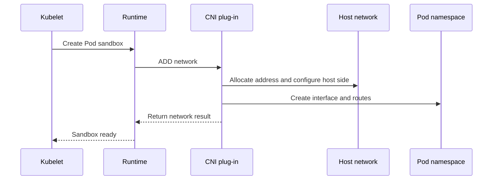

Changing CNI configuration can affect new Pod sandboxes immediately while leaving existing Pods with older networking state. Platform teams therefore normally roll networking changes carefully across drained or controlled nodes.

## 9.6 OS and kernel configuration

Kubernetes depends on host-level configuration that is not stored as Kubernetes API objects:

* cgroup hierarchy
* Kernel modules
* Forwarding and bridge settings
* Swap policy
* Filesystem capacity
* Time synchronization
* DNS configuration
* Firewall and routing behavior
* File descriptor and process limits
* Disk mount options

These settings should usually be managed using immutable node images, image-building pipelines, cloud-init, configuration management, or an operating-system management platform—not by manually logging into each node.

---

# 10. Safe node-configuration rollout

A node-level configuration change has a larger blast radius than changing a ConfigMap.

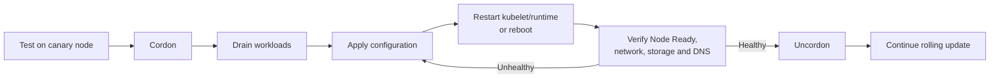

Example commands:

```bash
kubectl cordon worker-01

kubectl drain worker-01 \
  --ignore-daemonsets \
  --delete-emptydir-data

# Change kubelet/runtime/OS configuration.
sudo systemctl restart containerd
sudo systemctl restart kubelet

kubectl get node worker-01
kubectl describe node worker-01

kubectl uncordon worker-01
```

Validate at least:

```text
Node Ready condition
Container runtime health
CNI and Pod IP assignment
Cluster DNS
Service connectivity
Volume mounting
Resource allocatable values
Kubelet errors
Container restart rate
```

---

# 11. Windows node resource configuration

Windows resource behavior differs from Linux.

Notably:

* Windows does not use Linux cgroups.
* Memory behavior and overcommit semantics differ.
* Windows may page memory instead of following Linux OOM behavior.
* CPU and memory limits should be explicitly considered.
* Kubernetes guidance recommends reserving sufficient memory for Windows, commonly at least 2 GiB depending on workload and node size. ([Kubernetes][16])

Do not copy Linux node-reservation and eviction assumptions directly onto Windows nodes. Maintain separate node pools and platform defaults where possible.

---

# 12. Which configuration mechanism should you use?

| Requirement                                              | Use                                          |
| -------------------------------------------------------- | -------------------------------------------- |
| Non-sensitive startup setting                            | ConfigMap environment variable               |
| Non-sensitive configuration file                         | ConfigMap volume                             |
| Dynamic configuration with custom reload logic           | ConfigMap volume or direct API watch         |
| Password or application token                            | Secret volume                                |
| TLS certificate and key                                  | `kubernetes.io/tls` Secret                   |
| Private image registry credentials                       | `imagePullSecrets`                           |
| High-security centralized credentials                    | External secret manager                      |
| API endpoint, client identity and context                | kubeconfig                                   |
| Scheduler placement capacity                             | Resource requests                            |
| Runtime resource boundary                                | Resource limits                              |
| Per-container namespace defaults                         | LimitRange                                   |
| Total team or namespace budget                           | ResourceQuota                                |
| Control-plane bootstrap configuration                    | kubeadm `ClusterConfiguration`               |
| Scheduler framework and profiles                         | `KubeSchedulerConfiguration`                 |
| Node reservations and eviction thresholds                | `KubeletConfiguration`                       |
| Runtime registry, cgroups or snapshotter                 | Container-runtime configuration              |
| Pod networking behavior                                  | CNI configuration                            |
| Kernel, filesystem and networking fundamentals           | Host image or OS configuration               |
| Versioned application release configuration              | Immutable, version-named ConfigMap or Secret |
| Custom platform configuration interpreted by an operator | Custom Resource                              |

---

# 13. Common configuration mistakes

## Mistake 1: Putting secrets in ConfigMaps

```yaml
kind: ConfigMap
data:
  DB_PASSWORD: super-secret
```

ConfigMaps have no confidentiality semantics. Use a Secret or external secret manager.

## Mistake 2: Assuming environment variables update

Updating this ConfigMap:

```bash
kubectl edit configmap checkout-config
```

does not modify the environment of already-running processes. Restart or roll out the Pods.

## Mistake 3: Assuming mounted-file updates reload the application

The file may change, but the application may continue using the old in-memory configuration.

## Mistake 4: Using `subPath` and expecting updates

ConfigMap and Secret `subPath` mounts do not receive projected updates. ([Kubernetes][4])

## Mistake 5: Editing etcd directly

The API server owns validation, version conversion, authorization and admission. Direct etcd modification bypasses these guarantees.

## Mistake 6: Editing kubeadm static Pod manifests without preserving the change

A manual edit may restart a control-plane component, but a later kubeadm upgrade can regenerate the manifest. Store durable customization in kubeadm configuration or supported patches. ([Kubernetes][10])

## Mistake 7: Setting resource limits without measurement

Very low CPU limits cause throttling. Very low memory limits cause repeated OOM termination.

## Mistake 8: Leaving node resources unreserved

Without `kubeReserved` and `systemReserved`, workloads can starve kubelet and operating-system services.

## Mistake 9: Mismatching kubelet and runtime cgroup drivers

This can create inconsistent resource management and unstable nodes. ([Kubernetes][15])

## Mistake 10: Treating node changes like application changes

A bad application ConfigMap normally affects one workload. A bad kubelet, runtime, CNI or kernel configuration can make an entire node unavailable.

---

# Final mental model

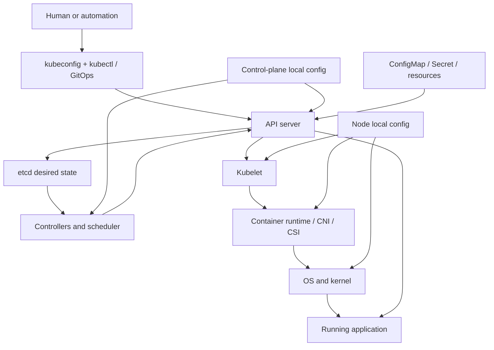

Think of Kubernetes configuration as three interacting systems:

1. **Desired-state configuration**
   API objects such as Deployments, ConfigMaps, Secrets and resource policies.

2. **Kubernetes process configuration**
   API server, scheduler, controller manager, kubelet, kube-proxy and runtime settings.

3. **Machine configuration**
   cgroups, networking, storage, kernel and operating-system resources.

The API configuration says **what should exist**. Control-plane configuration determines **how Kubernetes makes decisions**. Host configuration determines **how those decisions are executed on a machine**.

[1]: https://kubernetes.io/docs/concepts/configuration/ "Configuration | Kubernetes"
[2]: https://kubernetes.io/docs/concepts/overview/kubernetes-api/ "The Kubernetes API | Kubernetes"
[3]: https://kubernetes.io/docs/concepts/overview/working-with-objects/object-management/ "Kubernetes Object Management | Kubernetes"
[4]: https://kubernetes.io/docs/concepts/configuration/configmap/ "ConfigMaps | Kubernetes"
[5]: https://kubernetes.io/docs/concepts/configuration/secret/ "Secrets | Kubernetes"
[6]: https://kubernetes.io/docs/concepts/configuration/manage-resources-containers/ "Resource Management for Pods and Containers | Kubernetes"
[7]: https://kubernetes.io/docs/concepts/workloads/pods/pod-qos/ "Pod Quality of Service Classes | Kubernetes"
[8]: https://kubernetes.io/docs/concepts/policy/limit-range/ "Limit Ranges | Kubernetes"
[9]: https://kubernetes.io/docs/concepts/configuration/organize-cluster-access-kubeconfig/ "Organizing Cluster Access Using kubeconfig Files | Kubernetes"
[10]: https://kubernetes.io/docs/reference/setup-tools/kubeadm/implementation-details/ "Implementation details | Kubernetes"
[11]: https://kubernetes.io/docs/setup/production-environment/tools/kubeadm/control-plane-flags/ "Customizing components with the kubeadm API | Kubernetes"
[12]: https://kubernetes.io/docs/tasks/administer-cluster/kubelet-config-file/ "Set Kubelet Parameters Via A Configuration File | Kubernetes"
[13]: https://kubernetes.io/docs/reference/config-api/kubelet-config.v1beta1/ "Kubelet Configuration (v1beta1) | Kubernetes"
[14]: https://kubernetes.io/docs/tasks/administer-cluster/reserve-compute-resources/ "Reserve Compute Resources for System Daemons | Kubernetes"
[15]: https://kubernetes.io/docs/tasks/administer-cluster/kubeadm/configure-cgroup-driver/ "Configuring a cgroup driver | Kubernetes"
[16]: https://kubernetes.io/docs/concepts/configuration/windows-resource-management/ "Resource Management for Windows nodes | Kubernetes"
