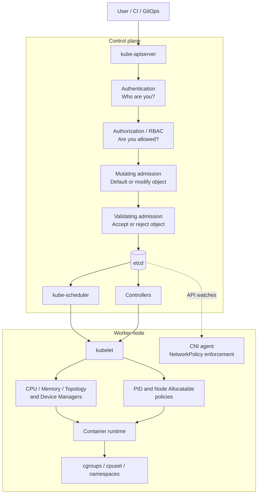
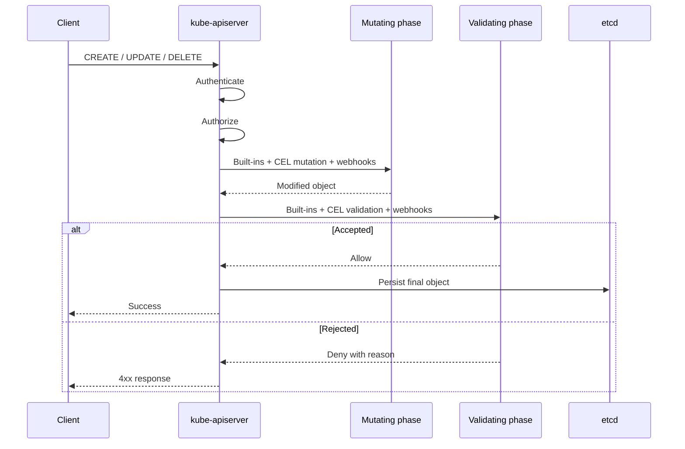
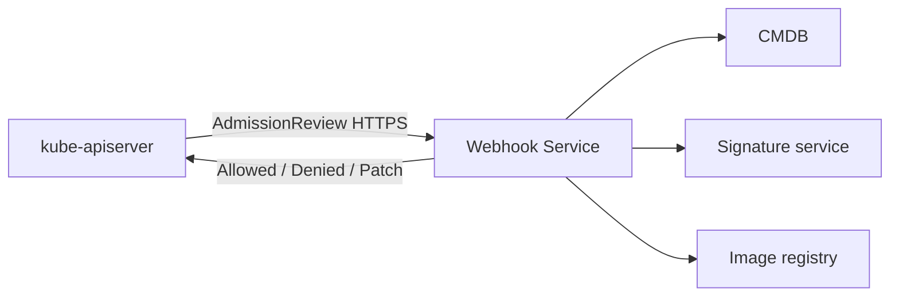
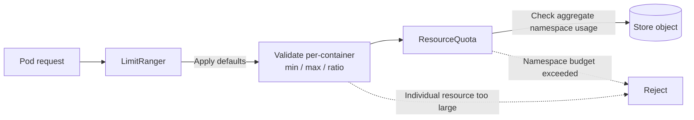
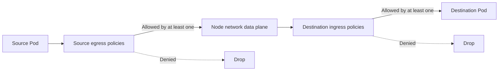
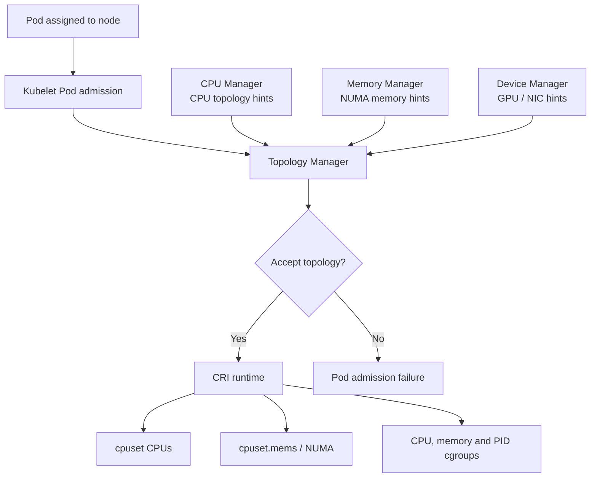
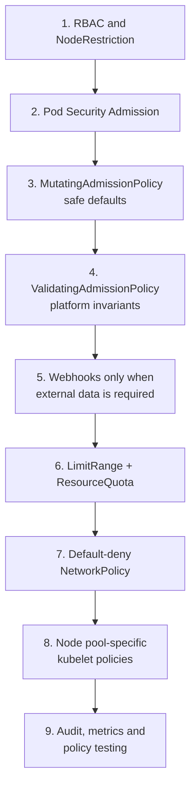

# Kubernetes Policy: the core idea

Kubernetes does **not** have one centralized “policy engine.” Policy is enforced at several points:

1. **Before an API object is stored** — admission control.
2. **After objects are stored** — controllers and runtime components reconcile policy.
3. **On each worker node** — kubelet, container runtime, cgroups and resource managers enforce host-level constraints.
4. **Inside the network data plane** — the CNI plugin enforces `NetworkPolicy`.

The Kubernetes policy overview groups policy into API policy objects, built-in admission controllers, declarative admission policies, dynamic admission webhooks and kubelet configuration. The current Kubernetes 1.36 documentation also includes stable `MutatingAdmissionPolicy`, which was not covered by the older policy overview text. ([Kubernetes][1])

---

# 1. End-to-end policy architecture



Admission control runs **after authentication and authorization**, but before an object is persisted. Mutating admission runs before validating admission. Admission normally affects create, update and delete operations, not read operations. If any validating admission component rejects a request, the object is not stored. ([Kubernetes][2])

This creates an important distinction:

* **RBAC** controls who may submit a request.
* **Admission policy** controls whether that request is acceptable and whether it should be modified.
* **Runtime policy** controls how an accepted workload behaves.
* **Node policy** controls how resources are physically allocated and constrained.

---

# 2. Policy types

| Policy mechanism            | Enforcement location               | Primary use                                      |
| --------------------------- | ---------------------------------- | ------------------------------------------------ |
| `LimitRange`                | API admission                      | Per-container or per-PVC defaults and boundaries |
| `ResourceQuota`             | API admission and quota controller | Aggregate namespace consumption                  |
| `NetworkPolicy`             | Worker-node CNI data plane         | Pod ingress and egress segmentation              |
| Built-in admission plugins  | `kube-apiserver`                   | Standard Kubernetes guardrails                   |
| `ValidatingAdmissionPolicy` | In-process API server CEL          | Custom validation without a webhook              |
| `MutatingAdmissionPolicy`   | In-process API server CEL          | Custom defaults and mutations                    |
| Admission webhooks          | External HTTPS services            | Complex or external-data-based decisions         |
| Pod Security Admission      | Built-in API admission             | Pod security standards                           |
| PID policy                  | Kubelet                            | Fork-bomb and host PID protection                |
| CPU Manager                 | Kubelet                            | Exclusive and pinned CPU allocation              |
| Memory Manager              | Kubelet                            | NUMA-aware memory allocation                     |
| Topology Manager            | Kubelet                            | Coordinate CPU, memory and devices               |
| Node Allocatable            | Kubelet                            | Reserve resources for the OS and Kubernetes      |

---

# 3. Control-plane admission policy

## 3.1 Request flow



Admission policy is synchronous. Every matching API request must complete the relevant admission checks before the request can be committed.

Admission policy is also generally **not retroactive**. For example, enabling a validation policy does not automatically delete or modify existing non-compliant resources. A controller is needed when continuous remediation is required. ([Kubernetes][3])

---

## 3.2 Built-in admission controllers

Kubernetes ships admission plugins inside `kube-apiserver`. They are enabled or disabled using API server configuration, including `--enable-admission-plugins`. Examples include:

* `LimitRanger`
* `ResourceQuota`
* `PodSecurity`
* `NodeRestriction`
* `AlwaysPullImages`
* `DefaultStorageClass`
* `ServiceAccount`
* `RuntimeClass`
* `MutatingAdmissionPolicy`
* `ValidatingAdmissionPolicy`
* Mutating and validating webhooks

([Kubernetes][2])

Built-in admission should be preferred where Kubernetes already provides the required control. It avoids deploying another service and normally has predictable performance and availability.

### Important examples

**PodSecurity**

Enforces predefined Pod Security Standards using namespace labels. It supports:

* `enforce`: reject violations.
* `warn`: return warnings to the client.
* `audit`: admit but annotate the audit event.

A practical rollout is to begin with `audit` and `warn`, remediate violations, and then enable `enforce`. ([Kubernetes][4])

```yaml
apiVersion: v1
kind: Namespace
metadata:
  name: payments
  labels:
    pod-security.kubernetes.io/enforce: baseline
    pod-security.kubernetes.io/enforce-version: latest

    pod-security.kubernetes.io/warn: restricted
    pod-security.kubernetes.io/warn-version: latest

    pod-security.kubernetes.io/audit: restricted
    pod-security.kubernetes.io/audit-version: latest
```

**NodeRestriction**

Restricts what an authenticated kubelet can modify. With Node authorization and `NodeRestriction`, a kubelet is limited primarily to its own `Node` and its assigned workloads. This prevents a compromised kubelet from arbitrarily modifying security-sensitive node labels or other nodes. ([Kubernetes][5])

---

# 4. ValidatingAdmissionPolicy

`ValidatingAdmissionPolicy`, stable since Kubernetes 1.30, provides in-process validation using CEL. It avoids an external network call and can deny, warn or audit matching requests. A working policy generally consists of:

1. `ValidatingAdmissionPolicy` — reusable logic.
2. An optional parameter object.
3. `ValidatingAdmissionPolicyBinding` — activates and scopes the policy.

([Kubernetes][6])

## Example: limit Deployment replicas

```yaml
apiVersion: admissionregistration.k8s.io/v1
kind: ValidatingAdmissionPolicy
metadata:
  name: deployment-replica-limit.example.com
spec:
  failurePolicy: Fail

  matchConstraints:
    resourceRules:
      - apiGroups: ["apps"]
        apiVersions: ["v1"]
        operations: ["CREATE", "UPDATE"]
        resources: ["deployments"]

  validations:
    - expression: >
        !has(object.spec.replicas) ||
        object.spec.replicas <= 20
      message: "A Deployment cannot request more than 20 replicas."
---
apiVersion: admissionregistration.k8s.io/v1
kind: ValidatingAdmissionPolicyBinding
metadata:
  name: deployment-replica-limit-production
spec:
  policyName: deployment-replica-limit.example.com

  validationActions:
    - Deny
    - Audit

  matchResources:
    namespaceSelector:
      matchLabels:
        environment: production
```

The same policy could initially use:

```yaml
validationActions:
  - Warn
  - Audit
```

After observing violations, the binding can be changed to `Deny`.

## When to use it

Use `ValidatingAdmissionPolicy` when the decision can be expressed from:

* The new object.
* The old object.
* Request information.
* Namespace information.
* A Kubernetes parameter resource.
* CEL authorization checks.

Typical examples:

* Production Deployments must have at least two replicas.
* Services may not use `type: LoadBalancer` in development namespaces.
* A protected namespace cannot be deleted.
* Approved labels must be present.
* Resource limits must satisfy organizational rules.
* Only specific storage classes or ingress classes may be used.

Do not use it when validation requires calls to an external system such as an image-signing service, vulnerability database or corporate CMDB.

---

# 5. MutatingAdmissionPolicy

`MutatingAdmissionPolicy` became stable and enabled by default in Kubernetes 1.36. It uses CEL and executes inside the API server, providing an alternative to many mutating webhooks. It supports server-side apply-style patches and JSON Patch. ([Kubernetes][7])

## Example: default Pod Security on new namespaces

```yaml
apiVersion: admissionregistration.k8s.io/v1
kind: MutatingAdmissionPolicy
metadata:
  name: default-pod-security-baseline
spec:
  reinvocationPolicy: IfNeeded

  matchConstraints:
    resourceRules:
      - apiGroups: [""]
        apiVersions: ["v1"]
        operations: ["CREATE"]
        resources: ["namespaces"]

  matchConditions:
    - name: exclude-system-namespaces
      expression: "!object.metadata.name.startsWith('kube-')"

    - name: label-not-specified
      expression: >
        !('pod-security.kubernetes.io/enforce'
          in object.metadata.labels)

  mutations:
    - patchType: ApplyConfiguration
      applyConfiguration:
        expression: >
          Object{
            metadata: Object.metadata{
              labels: {
                'pod-security.kubernetes.io/enforce': 'baseline'
              }
            }
          }
---
apiVersion: admissionregistration.k8s.io/v1
kind: MutatingAdmissionPolicyBinding
metadata:
  name: default-pod-security-baseline
spec:
  policyName: default-pod-security-baseline
```

This is a **default**, not an enforcement rule. Someone who can update the namespace could replace the label. Pair the mutation with Pod Security Admission or a validating policy when the value must be mandatory. ([Kubernetes][3])

## When to use it

Good use cases:

* Default labels and annotations.
* Add standard tolerations.
* Default security-related namespace labels.
* Inject common configuration fields.
* Normalize a submitted API object.
* Add an init container or sidecar where the mutation is deterministic.

Avoid large, opaque mutations. A user should be able to understand how their submitted manifest will change.

---

# 6. Admission webhooks

Admission webhooks are external HTTPS services invoked by the API server.

There are two types:

* `MutatingWebhookConfiguration`
* `ValidatingWebhookConfiguration`

Mutating webhooks execute in the mutating phase. Validating webhooks execute after mutation, so they validate the final form of the object. Webhooks can use arbitrary code and external data, but they add a network and availability dependency to the control plane request path. ([Kubernetes][8])



## Example configuration fragment

```yaml
apiVersion: admissionregistration.k8s.io/v1
kind: ValidatingWebhookConfiguration
metadata:
  name: image-policy.example.com
webhooks:
  - name: images.image-policy.example.com

    clientConfig:
      service:
        namespace: policy-system
        name: image-policy-webhook
        path: /validate

    rules:
      - apiGroups: [""]
        apiVersions: ["v1"]
        operations: ["CREATE", "UPDATE"]
        resources: ["pods"]

    admissionReviewVersions: ["v1"]
    sideEffects: None
    timeoutSeconds: 2
    failurePolicy: Fail
```

## `Fail` versus `Ignore`

**`failurePolicy: Fail`**

Rejects the API request if the webhook cannot be reached or returns an internal failure.

Use it for mandatory security rules, but only when the webhook is highly available and narrowly scoped.

**`failurePolicy: Ignore`**

Allows the request when the webhook is unavailable.

Use it for advisory checks, observability or controls where API availability is more important than enforcement.

## When webhooks are appropriate

Use a webhook for:

* Image signature verification.
* External vulnerability information.
* Organization-wide tenancy databases.
* Complex custom logic not practical in CEL.
* Existing policy engines such as Gatekeeper or Kyverno.
* Cross-system approval or ownership rules.

Prefer CEL policies for simple object-based validation or mutation. They eliminate the external network hop.

---

# 7. LimitRange

A `LimitRange` applies limits and defaults to individual objects in one namespace. It can:

* Default CPU or memory requests.
* Default CPU or memory limits.
* Enforce minimum and maximum values.
* Enforce request-to-limit ratios.
* Restrict PVC storage requests.

The `LimitRanger` admission controller applies defaults and then validates the submitted object. Violations are rejected. Changes are not retroactively applied to existing Pods. ([Kubernetes][9])

```yaml
apiVersion: v1
kind: LimitRange
metadata:
  name: workload-defaults
  namespace: payments
spec:
  limits:
    - type: Container

      defaultRequest:
        cpu: 100m
        memory: 128Mi

      default:
        cpu: 500m
        memory: 512Mi

      min:
        cpu: 50m
        memory: 64Mi

      max:
        cpu: "4"
        memory: 8Gi

      maxLimitRequestRatio:
        cpu: "10"
        memory: "4"
```

### Example transformation

Submitted Pod:

```yaml
containers:
  - name: api
    image: example/api:v1
```

After `LimitRanger` mutation:

```yaml
containers:
  - name: api
    image: example/api:v1
    resources:
      requests:
        cpu: 100m
        memory: 128Mi
      limits:
        cpu: 500m
        memory: 512Mi
```

The scheduler sees the final defaulted resource request.

## Use LimitRange when

* Application teams frequently omit requests and limits.
* You need namespace-specific defaults.
* Individual containers must stay inside defined bounds.
* PVCs need minimum or maximum sizes.

Do not use it as a namespace budget. That is the purpose of `ResourceQuota`.

---

# 8. ResourceQuota

A `ResourceQuota` limits aggregate namespace consumption. The ResourceQuota controller tracks current usage, and the admission plugin rejects requests that would exceed the quota. Kubernetes can quota compute resources, storage and object counts. ([Kubernetes][10])

```yaml
apiVersion: v1
kind: ResourceQuota
metadata:
  name: payments-budget
  namespace: payments
spec:
  hard:
    requests.cpu: "20"
    requests.memory: 40Gi

    limits.cpu: "40"
    limits.memory: 80Gi

    pods: "200"
    persistentvolumeclaims: "30"

    count/secrets: "500"
    count/configmaps: "500"
```

## Combined admission flow



### LimitRange versus ResourceQuota

| Question                              | LimitRange | ResourceQuota |
| ------------------------------------- | ---------- | ------------- |
| Is one container too large?           | Yes        | Indirectly    |
| Should missing requests be defaulted? | Yes        | No            |
| Is the namespace using too much CPU?  | No         | Yes           |
| Limit number of Secrets or Jobs?      | No         | Yes           |
| Restrict PVC size per claim?          | Yes        | No            |
| Limit total requested storage?        | No         | Yes           |

ResourceQuota does not reserve capacity on a particular node and does not guarantee that the requested capacity exists. Multiple namespaces can have quota totals greater than physical cluster capacity. ([Kubernetes][10])

---

# 9. NetworkPolicy

`NetworkPolicy` describes allowed L3/L4 traffic for selected Pods. Enforcement is performed by a compatible network plugin; creating a policy has no useful enforcement effect if the installed CNI does not implement NetworkPolicy. ([Kubernetes][11])

## Important mental model



For a connection to succeed:

1. The source Pod's egress policies must allow it.
2. The destination Pod's ingress policies must allow it.

Policies are **additive**. There is no first-match or priority ordering. The allowed traffic is the union of all matching policies. A Pod starts non-isolated in a direction until at least one policy selects it for that direction. ([Kubernetes][11])

## Default deny

```yaml
apiVersion: networking.k8s.io/v1
kind: NetworkPolicy
metadata:
  name: default-deny
  namespace: backend
spec:
  podSelector: {}
  policyTypes:
    - Ingress
    - Egress
```

This selects every Pod in `backend` and provides no allow rules.

## Allow frontend to backend API

Destination ingress policy:

```yaml
apiVersion: networking.k8s.io/v1
kind: NetworkPolicy
metadata:
  name: allow-web-to-api
  namespace: backend
spec:
  podSelector:
    matchLabels:
      app: api

  policyTypes:
    - Ingress

  ingress:
    - from:
        - namespaceSelector:
            matchLabels:
              kubernetes.io/metadata.name: frontend
          podSelector:
            matchLabels:
              app: web

      ports:
        - protocol: TCP
          port: 8080
```

Source egress policy:

```yaml
apiVersion: networking.k8s.io/v1
kind: NetworkPolicy
metadata:
  name: allow-web-to-api
  namespace: frontend
spec:
  podSelector:
    matchLabels:
      app: web

  policyTypes:
    - Egress

  egress:
    - to:
        - namespaceSelector:
            matchLabels:
              kubernetes.io/metadata.name: backend
          podSelector:
            matchLabels:
              app: api

      ports:
        - protocol: TCP
          port: 8080
```

A default-deny egress policy normally also requires explicit DNS access.

## NetworkPolicy is not suitable for

Standard `NetworkPolicy` is mainly L3/L4. It does not natively express rules such as:

* Allow only `GET /health`.
* Require a particular JWT claim.
* Permit traffic based on HTTP host.
* Apply TLS identity authorization.
* Explicitly deny one source while allowing everything else.

Those require a service mesh, gateway, application authorization or CNI-specific extensions. ([Kubernetes][11])

---

# 10. Worker-node and host-level policy

Control-plane admission decides whether a Pod object may exist. The kubelet independently decides whether and how that Pod can run on a particular machine.



---

## 10.1 PID limits

PID exhaustion can destabilize the entire Linux host. Kubernetes provides:

* `podPidsLimit`: maximum processes per Pod.
* `systemReserved.pid`: PIDs reserved for OS daemons.
* `kubeReserved.pid`: PIDs reserved for kubelet and container runtime components.
* `pid.available`: node-pressure eviction signal.

A hard per-Pod PID limit directly constrains process creation. The eviction signal is periodic and therefore is not equivalent to a hard limit. ([Kubernetes][12])

```yaml
apiVersion: kubelet.config.k8s.io/v1beta1
kind: KubeletConfiguration

podPidsLimit: 4096

systemReserved:
  cpu: "1"
  memory: 1Gi
  pid: "1000"

kubeReserved:
  cpu: "1"
  memory: 1Gi
  pid: "1000"
```

Use this on shared clusters, CI worker nodes and platforms where untrusted workloads could accidentally or deliberately create excessive processes.

---

## 10.2 CPU Manager

CPU Manager supports:

* `none`: normal shared CPU scheduling.
* `static`: selected workloads receive exclusive logical CPUs.

With `static`, a container generally qualifies for exclusive CPUs when:

* It belongs to a `Guaranteed` QoS Pod.
* CPU request equals CPU limit.
* The CPU value is an integer, such as `2`, rather than `1500m`.

The assigned CPUs are enforced through cpusets and reconciled through the container runtime. ([Kubernetes][13])

```yaml
resources:
  requests:
    cpu: "4"
    memory: 8Gi
  limits:
    cpu: "4"
    memory: 8Gi
```

Use CPU Manager for:

* Low-latency services.
* High-frequency trading.
* Network packet processing.
* Telco/NFV.
* CPU-sensitive databases.
* Workloads affected by cache misses or CPU migration.

Changing CPU Manager policy requires operational care. Kubernetes recommends draining the node, stopping kubelet, removing the old CPU Manager state and then restarting kubelet with the new configuration. ([Kubernetes][14])

---

## 10.3 Memory Manager

Memory Manager coordinates NUMA-aware memory allocation. With the Linux `Static` policy, Guaranteed Pods can receive memory associated with selected NUMA nodes, and the kubelet enforces the decision using `cpuset.mems`. Static Memory Manager requires an appropriate `reservedMemory` configuration. ([Kubernetes][15])

Use it when remote-NUMA memory access produces unacceptable latency or bandwidth variation.

---

## 10.4 Topology Manager

Topology Manager combines hints from:

* CPU Manager.
* Memory Manager.
* Device Manager.
* Other topology-aware hint providers.

Supported policies include:

| Policy             | Behaviour                                              |
| ------------------ | ------------------------------------------------------ |
| `none`             | No topology alignment                                  |
| `best-effort`      | Prefer alignment but admit when it is unavailable      |
| `restricted`       | Reject when a preferred alignment is unavailable       |
| `single-numa-node` | Require all relevant resources to fit on one NUMA node |

Topology scope can be:

* `container`: align each container independently.
* `pod`: align the whole Pod to a common NUMA topology.

`pod` scope plus `single-numa-node` is useful for tightly coupled, latency-sensitive containers. However, the scheduler is not fully topology-aware; a Pod can be scheduled to a node and later rejected by the kubelet's Topology Manager. ([Kubernetes][16])

---

## 10.5 Example performance-oriented node configuration

The following is illustrative and must be adapted to the node's actual CPU and NUMA layout:

```yaml
apiVersion: kubelet.config.k8s.io/v1beta1
kind: KubeletConfiguration

# Process protection
podPidsLimit: 4096

# Reserve capacity for Kubernetes and the OS
kubeReserved:
  cpu: "4"
  memory: 4Gi
  pid: "1000"

systemReserved:
  cpu: "1"
  memory: 1Gi
  pid: "1000"

evictionHard:
  memory.available: 100Mi

# Keep CPUs 0-4 for system and Kubernetes processes
reservedSystemCPUs: "0-4"

# Exclusive CPU assignment
cpuManagerPolicy: static

# NUMA coordination
topologyManagerPolicy: single-numa-node
topologyManagerScope: pod

# NUMA-aware memory
memoryManagerPolicy: Static
reservedMemory:
  - numaNode: 0
    limits:
      memory: 3Gi
  - numaNode: 1
    limits:
      memory: 2148Mi
```

`reservedSystemCPUs` identifies CPUs intended for system and Kubernetes daemons. Node Allocatable reservations protect the kubelet, runtime and OS from workload resource exhaustion. These values should be based on node profiling rather than copied uniformly across different hardware profiles. ([Kubernetes][17])

A common design is to create separate node pools:

```text
general-purpose
  CPU Manager: none
  Topology Manager: none

latency-optimized
  CPU Manager: static
  Topology Manager: single-numa-node
  Memory Manager: Static

GPU
  Topology-aware CPU, memory and device allocation

untrusted-builds
  Lower podPidsLimit
  Stronger system reservations
```

Use labels, taints and tolerations to direct workloads to the correct policy profile.

---

# 11. Control-plane policy cannot replace host security

Admission control only sees requests made through the Kubernetes API server. Static Pods are managed directly by the kubelet, without normal control-plane management. Direct access to the kubelet API is also not subject to API-server admission control and can bypass Kubernetes audit logging. ([Kubernetes][18])

Therefore, policy design must also include:

* Restricted SSH and host access.
* Kubelet authentication and authorization.
* Avoiding broad `nodes/proxy` RBAC permissions.
* Node authorization and `NodeRestriction`.
* Protecting static Pod manifest directories.
* Securing bootstrap credentials.
* OS hardening and patch management.
* Runtime and kernel security.

A user with root access to a worker node is outside the protection boundary of most API admission policies.

---

# 12. Which policy should you use?

| Requirement                                      | Recommended mechanism                  |
| ------------------------------------------------ | -------------------------------------- |
| Control which users can create Pods              | RBAC                                   |
| Stop kubelets modifying other nodes              | Node authorization + `NodeRestriction` |
| Enforce baseline or restricted Pod security      | Pod Security Admission                 |
| Reject an invalid field combination              | `ValidatingAdmissionPolicy`            |
| Require labels, limits or approved classes       | `ValidatingAdmissionPolicy`            |
| Add deterministic defaults or labels             | `MutatingAdmissionPolicy`              |
| Check image signatures externally                | Validating webhook                     |
| Inject a complex service-mesh sidecar            | Mutating policy or webhook             |
| Default resource requests and limits             | `LimitRange`                           |
| Limit total namespace consumption                | `ResourceQuota`                        |
| Isolate Pod traffic                              | `NetworkPolicy`                        |
| Protect node PID capacity                        | `podPidsLimit` and PID reservations    |
| Allocate exclusive CPU cores                     | CPU Manager `static`                   |
| Keep CPU, memory and devices NUMA-aligned        | Topology and Memory Managers           |
| Continuously repair existing resources           | A Kubernetes controller                |
| Protect availability during voluntary disruption | `PodDisruptionBudget`                  |

---

# 13. Recommended production model



A sound implementation sequence is:

1. Establish RBAC and node authorization boundaries.
2. Apply Pod Security Admission in audit and warn modes.
3. Introduce safe mutation defaults.
4. Add CEL validation for platform rules.
5. Use webhooks only for decisions that genuinely require arbitrary code or external data.
6. Combine `LimitRange` with `ResourceQuota`.
7. Start networking from default deny and add explicit communication paths.
8. Configure PID and resource-manager policies by node-pool hardware profile.
9. Test policy changes against existing manifests before changing from warn to deny.

---

# Interview-ready distinctions

**Admission versus authorization:** authorization decides whether the identity may perform an operation; admission decides whether the specific object is acceptable.

**LimitRange versus ResourceQuota:** LimitRange constrains or defaults an individual object; ResourceQuota limits aggregate namespace consumption.

**CEL policy versus webhook:** CEL is in-process and avoids external availability dependencies; webhooks support arbitrary code and external lookups.

**Admission versus controller:** admission handles a request once; a controller continuously reconciles desired state.

**NetworkPolicy ordering:** there is no priority or first-match rule. Matching policies are additive.

**Scheduler versus Topology Manager:** the scheduler chooses a node from advertised allocatable resources; the kubelet's Topology Manager handles hardware-local NUMA alignment and can still reject the Pod.

**Policy updates and existing resources:** most admission policy changes do not automatically remediate existing objects.

[1]: https://kubernetes.io/docs/concepts/policy/ "Policies | Kubernetes"
[2]: https://kubernetes.io/docs/reference/access-authn-authz/admission-controllers/ "Admission Control in Kubernetes | Kubernetes"
[3]: https://kubernetes.io/docs/tutorials/cluster-management/admission-policies/ "Explore Validating and Mutating Admission Policies | Kubernetes"
[4]: https://kubernetes.io/docs/concepts/security/pod-security-admission/?utm_source=chatgpt.com "Pod Security Admission | Kubernetes"
[5]: https://kubernetes.io/docs/reference/access-authn-authz/node/?utm_source=chatgpt.com "Using Node Authorization | Kubernetes"
[6]: https://kubernetes.io/docs/reference/access-authn-authz/validating-admission-policy/ "Validating Admission Policy | Kubernetes"
[7]: https://kubernetes.io/docs/reference/access-authn-authz/mutating-admission-policy/ "Mutating Admission Policy | Kubernetes"
[8]: https://kubernetes.io/docs/reference/access-authn-authz/extensible-admission-controllers/?source=post_page-----623f40c2adda--------------------------------------- "Dynamic Admission Control | Kubernetes"
[9]: https://kubernetes.io/docs/concepts/policy/limit-range/ "Limit Ranges | Kubernetes"
[10]: https://kubernetes.io/docs/concepts/policy/resource-quotas/ "Resource Quotas | Kubernetes"
[11]: https://kubernetes.io/docs/concepts/services-networking/network-policies/ "Network Policies | Kubernetes"
[12]: https://kubernetes.io/docs/concepts/policy/pid-limiting/ "Process ID Limits And Reservations | Kubernetes"
[13]: https://kubernetes.io/docs/concepts/workloads/resource-managers/ "Resource managers | Kubernetes"
[14]: https://kubernetes.io/docs/tasks/administer-cluster/cpu-management-policies/ "Control CPU Management Policies on the Node | Kubernetes"
[15]: https://kubernetes.io/docs/tasks/administer-cluster/memory-manager/ "Control Memory Management Policies on a Node | Kubernetes"
[16]: https://kubernetes.io/docs/tasks/administer-cluster/topology-manager/ "Control Topology Management Policies on a node | Kubernetes"
[17]: https://kubernetes.io/docs/tasks/administer-cluster/reserve-compute-resources/ "Reserve Compute Resources for System Daemons | Kubernetes"
[18]: https://kubernetes.io/docs/concepts/security/api-server-bypass-risks/?utm_source=chatgpt.com "Kubernetes API Server Bypass Risks | Kubernetes"
