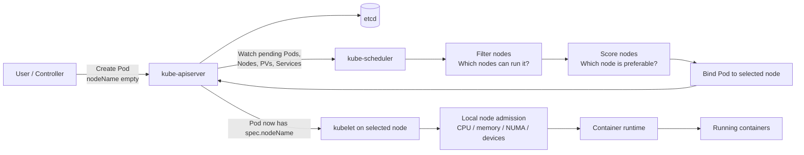
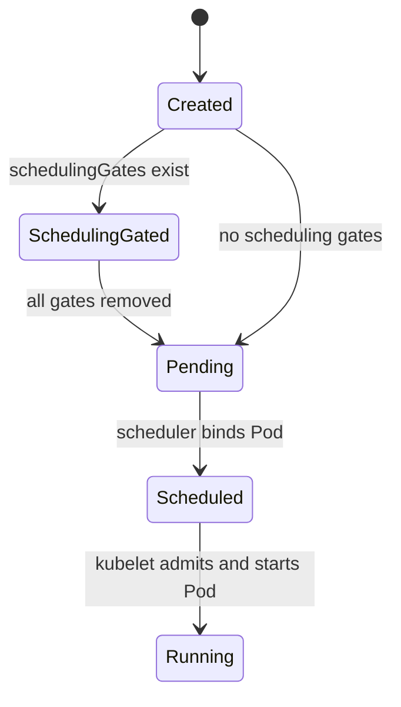
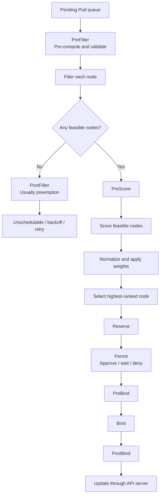
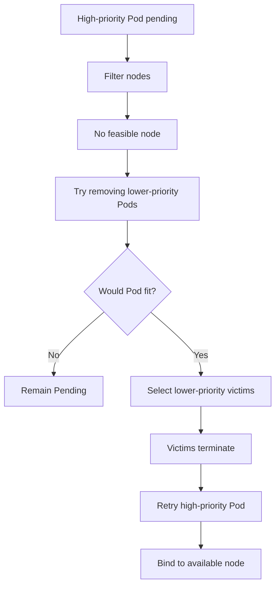
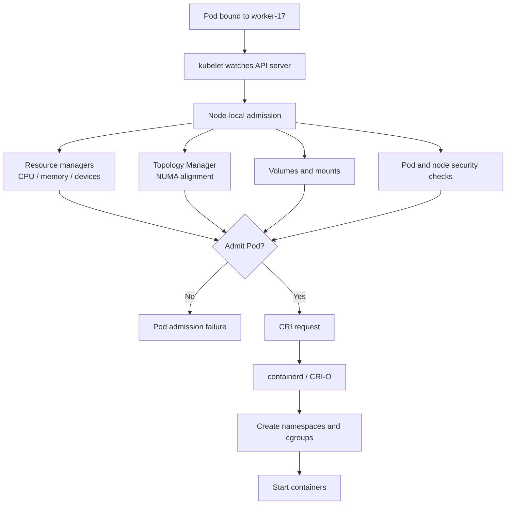
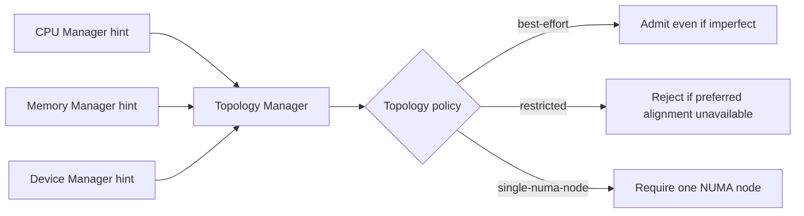
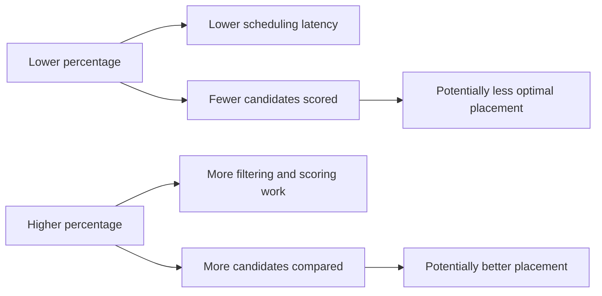
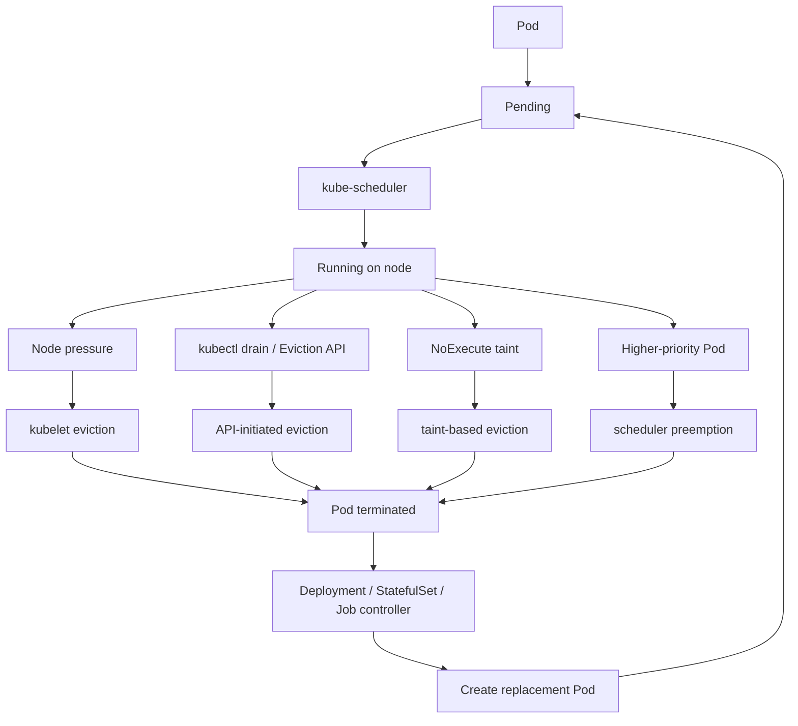
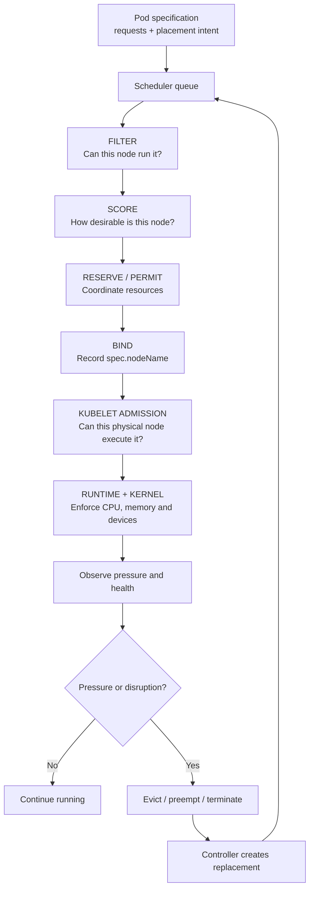

# Kubernetes scheduling: the core mental model

Kubernetes scheduling answers one question:

> **Which node should run this Pod?**

The default `kube-scheduler` is a control-plane component. It observes Pods that do not yet have a node assigned, removes nodes that cannot run each Pod, ranks the remaining nodes, and records the selected node through the API server. The kubelet on that node then performs local admission and starts the containers. Scheduling, preemption, and eviction are related but distinct:

* **Scheduling:** assign a pending Pod to a node.
* **Preemption:** remove lower-priority Pods so a higher-priority Pod can be scheduled.
* **Eviction:** terminate running Pods, usually because of node pressure, maintenance, taints, or an API request. ([Kubernetes][1])



The most important distinction is:

```text
kube-scheduler: cluster-wide placement
kubelet:        node-local admission and execution
Linux kernel:   resource enforcement through cgroups
```

The scheduler uses Pod requests and Node Allocatable when deciding placement. Limits are primarily enforced later by the kubelet, container runtime, and operating system. ([Kubernetes][2])

---

# 1. End-to-end scheduling flow

## Step 1: A Pod is created without a node assignment

A Deployment, StatefulSet, Job, or user creates a Pod similar to:

```yaml
apiVersion: v1
kind: Pod
metadata:
  name: payments-api
spec:
  containers:
    - name: payments-api
      image: example.com/payments:v4
      resources:
        requests:
          cpu: "500m"
          memory: "512Mi"
        limits:
          cpu: "2"
          memory: "1Gi"
```

Initially:

```yaml
spec:
  nodeName: ""
```

The Pod usually appears as:

```text
STATUS: Pending
NODE:   <none>
```

The scheduler does not normally schedule based on current CPU utilisation from metrics-server. It primarily reasons about declared resource requests, node allocatable resources, placement constraints, storage, devices, ports, taints, and other scheduler plugin inputs. A node can be almost idle and still reject a Pod if existing Pod requests have consumed its schedulable capacity. ([Kubernetes][2])

## Step 2: Admission may hold the Pod behind scheduling gates

A Pod can be created with `spec.schedulingGates`. While any gate remains, the Pod is not placed into normal scheduling consideration.

```yaml
spec:
  schedulingGates:
    - name: platform.example.com/capacity-approved
```

A controller can prepare external resources, apply stricter scheduling directives, and then remove the gate. Gates can be removed after creation, but new gates cannot be added later. ([Kubernetes][3])



Use scheduling gates when an external controller must complete work before scheduling, such as:

* Provisioning capacity.
* Reserving a license.
* Coordinating a batch workload.
* Injecting final placement restrictions.
* Waiting for an external dependency.

## Step 3: The Pod enters the scheduler queue

The scheduler maintains an internal queue rather than continuously retrying every Pod in a tight loop.

Conceptually, Pods can be:

* Ready for scheduling in the active queue.
* Waiting in a backoff queue.
* Known to be unschedulable until relevant cluster state changes.
* Explicitly gated.

The scheduling framework provides `PreEnqueue`, `QueueSort`, `EnqueueExtension`, and `QueueingHint` mechanisms. `QueueingHint`, stable from Kubernetes 1.34, lets plugins decide whether a cluster event might make a rejected Pod schedulable again. For example, deleting a Pod may make an `Insufficient cpu` Pod worth retrying, while changing an unrelated ConfigMap would not. ([Kubernetes][4])

The default `PrioritySort` plugin orders pending Pods primarily according to Pod priority. A high-priority Pod is considered before lower-priority Pods, although the scheduler can continue with other Pods when the high-priority Pod remains unschedulable. ([Kubernetes][5])

## Step 4: The scheduler obtains its cluster view

The scheduler needs information about:

* Pending and running Pods.
* Nodes and Node Allocatable.
* Node labels, taints, and conditions.
* PersistentVolumes and PersistentVolumeClaims.
* Storage classes and CSI topology.
* Services and requested host ports.
* Priority classes.
* Pod affinity and topology relationships.
* Extended resources and devices.

It uses a cached view of API objects so that every scheduling decision does not require a large number of synchronous API calls.

The decision for one Pod is divided into:

1. **Scheduling cycle:** select a node.
2. **Binding cycle:** apply that decision.

Scheduling cycles run serially, while binding cycles can run concurrently. A failed attempt returns the Pod to the scheduling queue for later retry. ([Kubernetes][4])

---

# 2. The scheduling framework pipeline



The scheduler’s major extension points are configurable through plugins. ([Kubernetes][5])

## 2.1 PreFilter

`PreFilter` performs calculations that can be shared while evaluating nodes.

Examples:

* Calculate the Pod’s total resource request.
* Process node affinity terms.
* Collect Pods matching an anti-affinity rule.
* Calculate topology-spread counts.
* Examine PVC requirements.

It can also reject the Pod before checking every node.

## 2.2 Filter: remove impossible nodes

Every candidate node is passed through filter plugins. As soon as one filter marks a node infeasible, the remaining filters do not need to run for that node. Different nodes may be evaluated concurrently. ([Kubernetes][4])

Common default filter plugins include:

| Plugin              | What it checks                                                    |
| ------------------- | ----------------------------------------------------------------- |
| `NodeResourcesFit`  | CPU, memory, ephemeral storage and extended-resource requests fit |
| `NodeAffinity`      | `nodeSelector` and required node-affinity rules                   |
| `TaintToleration`   | Pod tolerates node’s `NoSchedule` and relevant taints             |
| `NodeUnschedulable` | Node has not been cordoned                                        |
| `NodePorts`         | Requested host ports are available                                |
| `InterPodAffinity`  | Required Pod affinity or anti-affinity                            |
| `PodTopologySpread` | Hard topology-spread constraints                                  |
| `VolumeBinding`     | Required volumes can bind on that node                            |
| `VolumeZone`        | Volume and node topology are compatible                           |
| `NodeVolumeLimits`  | CSI attachment limits are not exceeded                            |

These plugins are part of the current default scheduler configuration. ([Kubernetes][5])

### Example filtering decision

Suppose the cluster has:

```text
Node A:
  zone=sg-a
  allocatable: 4 CPU, 8 GiB
  requested:   3 CPU, 6 GiB

Node B:
  zone=sg-b
  allocatable: 8 CPU, 16 GiB
  requested:   2 CPU, 4 GiB
  taint: dedicated=gpu:NoSchedule

Node C:
  zone=sg-a
  allocatable: 8 CPU, 16 GiB
  requested:   4 CPU, 8 GiB
```

The incoming Pod requests:

```text
2 CPU
4 GiB
required zone=sg-a
no GPU toleration
```

Filter outcome:

```text
Node A: rejected — only 1 CPU and 2 GiB unrequested capacity remain
Node B: rejected — wrong zone and untolerated taint
Node C: feasible
```

No scoring contest is needed because only Node C survived.

## 2.3 PostFilter and preemption

If no nodes survive filtering, `PostFilter` plugins run. The default implementation is `DefaultPreemption`. ([Kubernetes][5])

For a high-priority pending Pod, the scheduler asks:

> Could this Pod fit on a node if some lower-priority Pods were removed?

If yes, it chooses victims and initiates preemption. The pending Pod’s `status.nominatedNodeName` may temporarily point to the proposed node, but the final `spec.nodeName` can differ if circumstances change. ([Kubernetes][6])



Preemption is not guaranteed to solve every constraint. For example:

* Removing Pods does not fix an incompatible node label.
* It does not create an unavailable GPU.
* It does not fix volume-zone incompatibility.
* Kubernetes does not perform general cross-node preemption to resolve cross-node anti-affinity.
* PDB handling during scheduler preemption is best effort, not absolute. ([Kubernetes][6])

## 2.4 Score: rank feasible nodes

When multiple nodes survive filtering, scoring plugins rank them.

The scheduler normalises plugin scores, applies configured plugin weights, combines the results, and selects the highest-ranked node. ([Kubernetes][4])

Typical scoring concerns include:

* Prefer less-allocated nodes.
* Prefer more-allocated nodes for bin packing.
* Balance CPU and memory utilisation.
* Prefer nodes that already contain the image.
* Satisfy preferred node affinity.
* Improve topology spread.
* Prefer or avoid co-location with other Pods.
* Consider storage capacity when the relevant feature is enabled.

`NodeResourcesFit` supports three scoring strategies:

* `LeastAllocated`: spread workloads toward emptier nodes; this is the default.
* `MostAllocated`: pack Pods onto more-utilised nodes.
* `RequestedToCapacityRatio`: define a custom utilisation-to-score curve. ([Kubernetes][5])

## 2.5 Reserve

After selecting a node, stateful plugins can reserve resources logically before binding. If a later stage fails, `Unreserve` rolls back that plugin state.

This reduces races where two concurrent binding operations might otherwise believe the same resource is available. ([Kubernetes][4])

## 2.6 Permit

A Permit plugin can:

* Approve binding.
* Deny binding.
* Make the Pod wait until a condition is met or a timeout expires.

This is useful for coordinated scheduling and gang-style behaviour. A denied or timed-out Pod returns to the scheduling queue and reserved state is undone. ([Kubernetes][4])

## 2.7 PreBind and Bind

`PreBind` performs work that must finish before the binding becomes visible. Volume binding is an important example.

The Bind plugin then records the Pod-to-node assignment through the API server. `DefaultBinder` provides the standard binding mechanism. ([Kubernetes][5])

Once binding succeeds:

```yaml
spec:
  nodeName: worker-17
```

The kubelet on `worker-17` now becomes responsible for the Pod.

---

# 3. What happens on the worker node

Scheduling is not the end of placement. It is the hand-off from the control plane to the node.



## 3.1 Node Capacity versus Node Allocatable

A machine might physically have:

```text
16 CPU
64 GiB memory
```

But not all of that should be assigned to Pods. The node also needs resources for:

* The operating system.
* `kubelet`.
* Container runtime.
* Node networking.
* Log and monitoring agents.
* Filesystem cache and kernel activity.
* Emergency eviction headroom.

A useful conceptual formula is:

```text
Node Allocatable
  ≈ Node Capacity
    - systemReserved
    - kubeReserved
    - eviction headroom
```

The scheduler treats Node Allocatable as the capacity available to Pods. The kubelet can enforce these reservations using cgroups and eviction. ([Kubernetes][7])

Example:

```text
Physical capacity:             16 CPU, 64 GiB
systemReserved:                 1 CPU,  4 GiB
kubeReserved:                   1 CPU,  2 GiB
eviction protection/headroom:           1 GiB
------------------------------------------------
Approximate Pod allocatable:   14 CPU, 57 GiB
```

A Pod may therefore fail scheduling even though the operating system reports free physical memory.

## 3.2 Resource requests drive scheduling

For each resource, the scheduler effectively evaluates:

```text
sum(existing scheduled Pod requests)
+ incoming Pod request
<= node allocatable
```

This applies to CPU, memory, ephemeral storage, and extended resources.

Extended resources such as GPUs cannot normally be overcommitted; when both request and limit are specified, they must match. ([Kubernetes][2])

## 3.3 Limits are enforced locally

After admission, the kubelet sends resource configuration to the container runtime. On Linux, the runtime configures cgroups.

Generally:

* CPU limits are enforced through throttling.
* CPU requests influence relative CPU allocation under contention.
* Memory limits can result in an OOM kill when exceeded.
* Ephemeral-storage excess can lead to eviction.
* Device allocations are handled through device-management mechanisms. ([Kubernetes][2])

---

# 4. Host-level scheduling and resource policies

These are not alternative cluster schedulers. They control **where and how resources are allocated inside a selected node**.

## 4.1 CPU Manager

The kubelet supports:

* `none`: default shared CPU behaviour.
* `static`: provides stronger CPU affinity and exclusive CPUs for qualifying Pods.

The static policy is useful for latency-sensitive workloads where CPU migration, cache misses, and scheduling jitter matter. ([Kubernetes][8])

Typical qualifying workload:

```yaml
resources:
  requests:
    cpu: "4"
    memory: "8Gi"
  limits:
    cpu: "4"
    memory: "8Gi"
```

Because CPU and memory requests equal limits, this is a `Guaranteed` QoS Pod. The integer CPU request allows CPU Manager static policy to assign exclusive cores under the relevant configuration.

Use cases:

* Telecom and NFV.
* Low-latency trading.
* Real-time stream processing.
* High-performance databases.
* CPU-sensitive inference.

Do not use exclusive CPUs for ordinary web services; it reduces packing flexibility.

## 4.2 Topology Manager

On multi-socket and NUMA machines, CPU, memory, and devices can be physically closer to some NUMA nodes than others.

A bad allocation could look like:

```text
Container CPU  -> NUMA node 0
Container RAM  -> NUMA node 1
GPU / NIC      -> NUMA node 2
```

That may introduce cross-socket traffic and latency.

Topology Manager combines hints from resource managers and tries to produce aligned allocations. It supports:

* `none`
* `best-effort`
* `restricted`
* `single-numa-node`

It can operate at container or Pod scope. ([Kubernetes][9])



A significant limitation is that normal cluster scheduling is not fully aware of every local NUMA allocation detail. A Pod can pass scheduler filtering, be bound to a node, and then fail local Topology Manager admission. ([Kubernetes][9])

This is one reason hardware pools should be homogeneous and carefully labelled.

## 4.3 Memory Manager

Memory Manager supports guaranteed memory and hugepage allocation for qualifying Pods and provides topology hints to Topology Manager.

Use it when:

* NUMA-local memory is important.
* Hugepages are required.
* Memory latency must be predictable.
* The workload belongs in `Guaranteed` QoS.

It is usually unnecessary for normal stateless applications. ([Kubernetes][10])

## 4.4 Device scheduling and DRA

Traditional device scheduling commonly exposes extended resources such as:

```yaml
resources:
  limits:
    nvidia.com/gpu: "1"
```

Dynamic Resource Allocation, or DRA, offers a richer model where drivers and administrators define device classes and workloads claim suitable devices. Kubernetes then places Pods on nodes that can access the allocated device. It is intended for hardware such as accelerators and other specialised devices. ([Kubernetes][11])

---

# 5. Main scheduling mechanisms and when to use them

## 5.1 Default resource-aware scheduling

Without explicit placement rules, the default scheduler:

* Ensures requests fit.
* Rejects unsuitable nodes.
* Generally favours sensible resource distribution.
* Considers topology, volumes and other default plugins.

Use this for most ordinary stateless services.

```yaml
resources:
  requests:
    cpu: 250m
    memory: 256Mi
```

Always declare realistic requests. Missing or severely understated requests make capacity planning and placement unreliable.

---

## 5.2 `nodeSelector`

The simplest hard node constraint:

```yaml
spec:
  nodeSelector:
    workload-class: general-purpose
```

The Pod can only run on nodes carrying every specified label. Kubernetes recommends label-based placement; `nodeSelector` is the simplest form. ([Kubernetes][12])

Use it for:

* Operating system or architecture.
* Dedicated hardware generation.
* Compliance zones.
* Storage-optimised nodes.
* Simple workload pools.

Avoid using unstable details such as exact hostnames unless the workload genuinely belongs to one host.

For security-sensitive labels, use labels protected by Node authorisation and the `NodeRestriction` admission plugin so a compromised kubelet cannot simply label itself as compliant. ([Kubernetes][12])

---

## 5.3 Node affinity

Node affinity provides richer matching and supports both hard and preferred rules.

```yaml
affinity:
  nodeAffinity:
    requiredDuringSchedulingIgnoredDuringExecution:
      nodeSelectorTerms:
        - matchExpressions:
            - key: node.example.com/cpu-family
              operator: In
              values:
                - amd-genoa
                - amd-turin

    preferredDuringSchedulingIgnoredDuringExecution:
      - weight: 80
        preference:
          matchExpressions:
            - key: topology.kubernetes.io/zone
              operator: In
              values:
                - ap-southeast-1a
```

Use:

* `required...` for true technical or regulatory requirements.
* `preferred...` for optimisation.

A practical rule:

> Hard constraints protect correctness. Preferred constraints improve placement.

Too many hard constraints frequently create permanently pending Pods.

---

## 5.4 Taints and tolerations

A taint repels Pods:

```bash
kubectl taint node gpu-1 dedicated=gpu:NoSchedule
```

A matching toleration lets a Pod be considered for that node:

```yaml
tolerations:
  - key: dedicated
    operator: Equal
    value: gpu
    effect: NoSchedule
```

Toleration does not attract the Pod to the GPU node; it merely removes the taint-based rejection. Combine it with node affinity when the Pod must run there. ([Kubernetes][13])

Recommended dedicated-pool pattern:

```text
Node affinity:       attracts the workload to the pool
Taint/toleration:    keeps unrelated workloads out
```

Taint effects:

* `NoSchedule`: do not schedule new non-tolerating Pods.
* `PreferNoSchedule`: try to avoid placement.
* `NoExecute`: reject new Pods and evict existing non-tolerating Pods.

---

## 5.5 Inter-Pod affinity

Pod affinity places Pods near matching Pods.

```yaml
affinity:
  podAffinity:
    requiredDuringSchedulingIgnoredDuringExecution:
      - topologyKey: topology.kubernetes.io/zone
        labelSelector:
          matchLabels:
            app: data-cache
```

Use for:

* Latency-sensitive service and cache placement.
* Data-processing workers near a local service.
* Components that benefit from zone co-location.

Risk: hard Pod affinity can deadlock deployments when the target Pod does not yet exist.

---

## 5.6 Pod anti-affinity

Anti-affinity separates matching Pods.

```yaml
affinity:
  podAntiAffinity:
    preferredDuringSchedulingIgnoredDuringExecution:
      - weight: 100
        podAffinityTerm:
          topologyKey: kubernetes.io/hostname
          labelSelector:
            matchLabels:
              app: payments-api
```

Use for:

* Avoiding multiple replicas on one node.
* Separating active and standby components.
* Reducing correlated failure.

Prefer soft anti-affinity unless strict separation is essential. Hard anti-affinity can block rollouts when nodes are scarce.

---

## 5.7 Topology-spread constraints

Topology spread controls replica skew across nodes, zones, regions, racks, or custom topology domains. It is generally the strongest declarative mechanism for high-availability spreading. ([Kubernetes][14])

```yaml
topologySpreadConstraints:
  - maxSkew: 1
    topologyKey: topology.kubernetes.io/zone
    whenUnsatisfiable: DoNotSchedule
    labelSelector:
      matchLabels:
        app: payments-api

  - maxSkew: 1
    topologyKey: kubernetes.io/hostname
    whenUnsatisfiable: ScheduleAnyway
    labelSelector:
      matchLabels:
        app: payments-api
```

Interpretation:

* Keep zone counts within a difference of one.
* Strictly reject a placement that violates zone spreading.
* Prefer node spreading, but allow imbalance if necessary.

Use topology spread for:

* Multi-zone availability.
* Node-level replica distribution.
* Rolling deployments.
* Large autoscaled services.

The scheduler applies constraints to new placement decisions; it does not continuously move already-running Pods to maintain perfect balance. A descheduler can be used when active rebalancing is required. ([Kubernetes][14])

---

## 5.8 Priority and preemption

Define a priority class:

```yaml
apiVersion: scheduling.k8s.io/v1
kind: PriorityClass
metadata:
  name: platform-critical
value: 100000
globalDefault: false
preemptionPolicy: PreemptLowerPriority
description: Critical platform workloads
```

Use it in a Pod:

```yaml
spec:
  priorityClassName: platform-critical
```

Priority affects queue ordering. When no node can run the Pod, preemption may remove lower-priority Pods. `preemptionPolicy: Never` creates a high queue-priority Pod that does not itself preempt other workloads. ([Kubernetes][6])

Use priority for:

* DNS and networking infrastructure.
* Cluster control agents.
* Critical gateways.
* Emergency or safety workloads.
* Batch workload tiers.

Do not assign high priority to every production Pod. If everything is critical, priority no longer represents an ordering policy.

---

## 5.9 Storage-aware scheduling

Storage can limit placement because:

* A local PV exists only on one node.
* A volume exists only in one zone.
* A CSI driver is not installed on every node.
* The node has reached its volume attachment limit.
* Delayed binding must select storage compatible with the chosen node.

The default scheduler includes `VolumeBinding`, `VolumeZone`, `VolumeRestrictions`, and volume-limit plugins for these decisions. ([Kubernetes][5])

For topology-constrained storage, prefer:

```yaml
volumeBindingMode: WaitForFirstConsumer
```

This lets the scheduler consider Pod placement before finalising volume provisioning, reducing situations where a volume is created in the wrong zone.

---

## 5.10 Bin-packing scheduling

Default `LeastAllocated` behaviour tends to spread workloads. Bin packing intentionally fills fewer nodes.

Use it for:

* Improving utilisation.
* Allowing a node autoscaler to remove empty nodes.
* Reducing infrastructure cost.
* Packing batch workloads.
* Consolidating GPU or expensive hardware usage.

Avoid aggressive bin packing for:

* Large failure-sensitive replicas.
* Workloads prone to correlated resource spikes.
* Nodes without sufficient eviction headroom.
* Latency-sensitive noisy-neighbour environments.

---

## 5.11 Multiple scheduler profiles

A single kube-scheduler process can expose multiple profiles. Each profile has a different `schedulerName` and plugin configuration. Pods select a profile through `.spec.schedulerName`. ([Kubernetes][5])

Use profiles when:

* Most workloads need standard scheduling.
* Batch workloads need bin packing.
* A special class needs different scoring weights.
* You want custom plugins without operating a completely separate scheduler.

---

## 5.12 Separate or custom schedulers

Kubernetes can run multiple scheduler processes. A Pod chooses one through:

```yaml
spec:
  schedulerName: specialised-scheduler
```

Use a separate custom scheduler when:

* The scheduling algorithm requires external business data.
* The workload needs domain-specific optimisation.
* Placement requires a CRD-specific model.
* The standard framework plugins cannot represent the requirement.

Operating a second scheduler introduces:

* High-availability requirements.
* RBAC and security concerns.
* Upgrade compatibility.
* Metrics and debugging complexity.
* Potential conflicts over shared resources.

Profiles or scheduler-framework plugins are usually simpler than building a scheduler from scratch. Kubernetes explicitly supports multiple schedulers alongside the default scheduler. ([Kubernetes][15])

---

## 5.13 PodGroup and gang scheduling

Current Kubernetes documentation includes PodGroup-based scheduling and alpha gang scheduling.

Gang scheduling follows an all-or-nothing or minimum-count model:

```text
Need 8 workers
Cluster can fit only 5
Result: schedule none rather than leave 5 workers waiting uselessly
```

This is useful for:

* MPI.
* Distributed training.
* Parallel batch processing.
* Workloads that cannot progress until a minimum group starts.

Gang scheduling is alpha and disabled by default in the current documentation. It depends on PodGroup and workload-related feature gates and APIs. ([Kubernetes][16])

Do not treat it as a universally enabled production feature without checking your Kubernetes distribution and version.

---

## 5.14 Direct `nodeName`

You can bypass normal scheduling:

```yaml
spec:
  nodeName: worker-01
```

This sends the Pod directly to one node. It bypasses the scheduler, including normal `NoSchedule` taint filtering. A `NoExecute` taint can still cause the kubelet to eject the Pod. ([Kubernetes][13])

Use only for:

* Controlled debugging.
* Special system components.
* Very narrow administrative workflows.

Do not use it as a normal placement policy. Labels and affinity survive node replacement; hostnames generally do not.

---

# 6. Control-plane scheduler configuration

The scheduler is configured using `KubeSchedulerConfiguration` and the `--config` argument. The stable configuration API is:

```yaml
apiVersion: kubescheduler.config.k8s.io/v1
kind: KubeSchedulerConfiguration
```

The older `v1beta3` API was removed in Kubernetes 1.29. ([Kubernetes][5])

## Example: default and bin-packing profiles

```yaml
apiVersion: kubescheduler.config.k8s.io/v1
kind: KubeSchedulerConfiguration

profiles:
  - schedulerName: default-scheduler

  - schedulerName: binpack-scheduler
    plugins:
      score:
        disabled:
          - name: NodeResourcesFit
        enabled:
          - name: NodeResourcesFit
            weight: 5

    pluginConfig:
      - name: NodeResourcesFit
        args:
          scoringStrategy:
            type: MostAllocated
            resources:
              - name: cpu
                weight: 1
              - name: memory
                weight: 1
```

A batch Pod can select the second profile:

```yaml
apiVersion: v1
kind: Pod
metadata:
  name: batch-worker
spec:
  schedulerName: binpack-scheduler
  containers:
    - name: worker
      image: example.com/batch:v2
      resources:
        requests:
          cpu: "2"
          memory: "4Gi"
```

All profiles in one scheduler process share the same pending-Pod queue, so their `QueueSort` plugin must be consistent. ([Kubernetes][5])

## Performance tuning for large clusters

`percentageOfNodesToScore` controls how many nodes the scheduler tries to find before moving from filtering to scoring.

```yaml
apiVersion: kubescheduler.config.k8s.io/v1
kind: KubeSchedulerConfiguration
percentageOfNodesToScore: 20
```

A lower percentage improves scheduling throughput but can miss a better node. For clusters with only a few hundred nodes, Kubernetes recommends leaving the default in place. Extremely low values can result in poor placement. ([Kubernetes][17])

This is a latency-versus-placement-quality trade-off:



---

# 7. Worker-node kubelet configuration example

A node prepared for latency-sensitive workloads might use:

```yaml
apiVersion: kubelet.config.k8s.io/v1beta1
kind: KubeletConfiguration

systemReserved:
  cpu: "500m"
  memory: "1Gi"

kubeReserved:
  cpu: "500m"
  memory: "1Gi"

evictionHard:
  memory.available: "500Mi"
  nodefs.available: "10%"
  nodefs.inodesFree: "5%"
  imagefs.available: "15%"

enforceNodeAllocatable:
  - pods
  - system-reserved
  - kube-reserved

reservedSystemCPUs: "0-1"

cpuManagerPolicy: static

topologyManagerPolicy: single-numa-node
topologyManagerScope: pod
```

Conceptually:

```text
CPUs 0-1:
  OS, kubelet, runtime, interrupts

Remaining CPUs:
  workload CPU pool

Guaranteed integer-CPU Pod:
  may receive exclusive cores

Topology policy:
  CPU, memory and devices must align on one NUMA node
```

This configuration should not be copied unchanged. Reservations depend on:

* Node size.
* Pod density.
* Runtime overhead.
* DaemonSet footprint.
* Kernel and network workload.
* Monitoring/logging agents.
* Required failure headroom.

Changing CPU Manager policies on an existing node normally requires draining the node, stopping kubelet, clearing the CPU Manager checkpoint, updating configuration, and restarting kubelet. ([Kubernetes][8])

---

# 8. Scheduling versus eviction



## Scheduler preemption

* Initiated by the scheduler.
* Triggered by an unschedulable higher-priority Pod.
* Removes lower-priority Pods.
* PDB is considered on a best-effort basis. ([Kubernetes][6])

## API-initiated eviction

Used by operations such as `kubectl drain`.

* Creates an Eviction API request.
* Uses graceful Pod termination.
* Normally observes applicable PDB constraints. ([Kubernetes][18])

## Node-pressure eviction

Initiated by kubelet when local resources become critically low.

Signals include:

* `memory.available`
* `nodefs.available`
* `nodefs.inodesFree`
* `imagefs.available`
* Filesystem-related signals depending on runtime layout

The kubelet first attempts node-level reclamation, such as removing dead containers or unused images. It then evicts Pods if necessary. Node-pressure eviction does not honour PDBs; hard eviction thresholds can use immediate termination. ([Kubernetes][19])

Kubelet eviction ordering considers:

1. Whether usage exceeds requests.
2. Pod priority.
3. Usage relative to requests.

This means QoS class alone does not completely determine the eviction order. ([Kubernetes][6])

---

# 9. Production example: highly available API

```yaml
apiVersion: apps/v1
kind: Deployment
metadata:
  name: payments-api
spec:
  replicas: 6
  selector:
    matchLabels:
      app: payments-api

  template:
    metadata:
      labels:
        app: payments-api

    spec:
      priorityClassName: business-critical

      containers:
        - name: api
          image: example.com/payments:v4
          resources:
            requests:
              cpu: "500m"
              memory: "512Mi"
            limits:
              cpu: "2"
              memory: "1Gi"

      topologySpreadConstraints:
        - maxSkew: 1
          topologyKey: topology.kubernetes.io/zone
          whenUnsatisfiable: DoNotSchedule
          labelSelector:
            matchLabels:
              app: payments-api

        - maxSkew: 1
          topologyKey: kubernetes.io/hostname
          whenUnsatisfiable: ScheduleAnyway
          labelSelector:
            matchLabels:
              app: payments-api

      affinity:
        nodeAffinity:
          preferredDuringSchedulingIgnoredDuringExecution:
            - weight: 50
              preference:
                matchExpressions:
                  - key: node.example.com/generation
                    operator: In
                    values:
                      - current
```

This expresses:

* Six replicas.
* Realistic schedulable requests.
* Strict zone-level availability.
* Preferred node-level spreading.
* Preference for newer nodes.
* Priority above non-critical workloads.

A matching PDB could be:

```yaml
apiVersion: policy/v1
kind: PodDisruptionBudget
metadata:
  name: payments-api
spec:
  minAvailable: 4
  selector:
    matchLabels:
      app: payments-api
```

The PDB protects against voluntary API-driven disruptions. It is not a guarantee against node failure, kubelet pressure eviction, or every scheduler preemption scenario.

---

# 10. Production example: dedicated GPU pool

Configure the nodes:

```bash
kubectl label node gpu-01 accelerator=nvidia-h100
kubectl taint node gpu-01 dedicated=gpu:NoSchedule
```

Configure the Pod:

```yaml
apiVersion: v1
kind: Pod
metadata:
  name: inference-server
spec:
  nodeSelector:
    accelerator: nvidia-h100

  tolerations:
    - key: dedicated
      operator: Equal
      value: gpu
      effect: NoSchedule

  containers:
    - name: model
      image: example.com/inference:v8
      resources:
        requests:
          cpu: "8"
          memory: "32Gi"
          nvidia.com/gpu: "1"
        limits:
          cpu: "8"
          memory: "32Gi"
          nvidia.com/gpu: "1"
```

The placement logic is:

```text
nodeSelector:
  Pod must use an H100 node.

toleration:
  Pod is allowed through the GPU pool taint.

GPU request:
  Scheduler requires an unallocated GPU resource.

CPU/memory requests:
  Node must have enough remaining Allocatable.

Guaranteed QoS:
  Supports stronger node-level resource management.
```

---

# 11. Diagnosing a Pending Pod

Start with:

```bash
kubectl describe pod <pod-name>
```

Look at the Events section.

## `Insufficient cpu` or `Insufficient memory`

Check:

```bash
kubectl describe node <node-name>
kubectl top nodes
kubectl get pods -A -o wide
```

Remember that scheduler fit is based on requests, not only current utilisation.

Possible resolutions:

* Correct oversized requests.
* Add capacity.
* Scale down other workloads.
* Enable or adjust autoscaling.
* Use a suitable workload pool.
* Remove unnecessary hard placement constraints.

## `node(s) had untolerated taint`

Inspect:

```bash
kubectl describe node <node-name> | grep -A10 Taints
```

Then either:

* Add the correct toleration.
* Remove an obsolete taint.
* Schedule the workload on a different pool.

Do not add broad tolerations such as `operator: Exists` without understanding which dedicated or unhealthy nodes the Pod might enter.

## `didn't match Pod's node affinity/selector`

Inspect labels:

```bash
kubectl get nodes --show-labels
```

Check for:

* Typographical errors.
* Missing labels.
* Wrong `In`, `NotIn`, `Exists`, or `DoesNotExist` semantics.
* Impossible combinations of required terms.

## Topology-spread failure

Inspect topology labels and replica distribution:

```bash
kubectl get nodes \
  -L topology.kubernetes.io/zone,kubernetes.io/hostname

kubectl get pods -l app=payments-api -o wide
```

Possible causes:

* A zone has no eligible nodes.
* Taints remove an entire topology domain.
* Required node affinity narrows the eligible domains.
* `minDomains` or `maxSkew` is too strict.
* Autoscaler is not aware of the missing topology capacity.

## Volume binding or zone conflict

Inspect:

```bash
kubectl describe pod <pod-name>
kubectl describe pvc <pvc-name>
kubectl describe pv <pv-name>
kubectl get storageclass
```

Look for:

* PV node affinity.
* StorageClass binding mode.
* CSI driver availability.
* Volume attachment limits.
* Zone mismatch.

## `Preemption is not helpful`

This usually means removing lower-priority Pods would not solve the actual constraint.

Examples:

* No matching node label.
* No suitable volume topology.
* No GPU resource exists.
* Untolerated taints.
* Required anti-affinity remains unsatisfied.
* Pod request is larger than every node.

## `SchedulingGated`

Check:

```bash
kubectl get pod <pod-name> \
  -o jsonpath='{.spec.schedulingGates}'
```

Find the controller responsible for removing those gates.

## Scheduler logs and metrics

For self-managed control planes:

```bash
kubectl -n kube-system get pods | grep kube-scheduler

kubectl -n kube-system logs \
  <kube-scheduler-pod-name>
```

Useful metrics include:

```text
scheduler_pending_pods
scheduler_schedule_attempts_total
scheduler_scheduling_attempt_duration_seconds
scheduler_framework_extension_point_duration_seconds
scheduler_plugin_execution_duration_seconds
```

---

# 12. Recommended decision guide

| Requirement                                 | Preferred mechanism                                   |
| ------------------------------------------- | ----------------------------------------------------- |
| Ordinary stateless workload                 | Requests plus default scheduler                       |
| Must run on a hardware class                | Required node affinity or `nodeSelector`              |
| Prefer a hardware class                     | Preferred node affinity                               |
| Reserve a node pool for specific workloads  | Taint/toleration plus node affinity                   |
| Spread replicas across zones                | Topology-spread constraints                           |
| Avoid same-node replicas                    | Node-level topology spread or Pod anti-affinity       |
| Co-locate related services                  | Pod affinity                                          |
| Protect critical workloads under scarcity   | PriorityClass and carefully governed preemption       |
| Reduce cost through consolidation           | Bin-packing scheduler profile                         |
| Local PV or zonal storage                   | Storage-aware scheduling and delayed binding          |
| GPU or specialised device                   | Extended resource or DRA plus pool constraints        |
| Delay scheduling until external preparation | Scheduling gates                                      |
| Distributed all-or-nothing workload         | PodGroup/gang scheduling, subject to feature maturity |
| NUMA-sensitive workload                     | CPU, Memory and Topology Managers on dedicated nodes  |
| Domain-specific algorithm                   | Scheduler framework plugin or custom scheduler        |

---

# 13. Common design mistakes

## Mistake 1: No resource requests

Without realistic requests, the scheduler cannot perform reliable capacity placement.

## Mistake 2: Treating limits as scheduling reservations

Requests drive normal scheduler capacity accounting. Limits control how much the running workload may consume.

## Mistake 3: Too many hard constraints

A Pod requiring:

```text
zone A
AND instance type X
AND GPU generation Y
AND local disk Z
AND hard anti-affinity
```

may have no feasible node.

Use hard rules only for correctness. Make optimisation rules preferred.

## Mistake 4: Using tolerations without affinity

A toleration permits access to a tainted node but does not guarantee selection of that pool.

## Mistake 5: Depending on `nodeName`

This tightly couples a workload to one machine and bypasses normal scheduler protection.

## Mistake 6: Assuming PDB protects against every termination

PDB primarily governs voluntary API-initiated disruptions. Node-pressure eviction does not honour it, and scheduler preemption treats it as best effort.

## Mistake 7: Ignoring node-level admission

A Pod can pass cluster-level scheduling but fail kubelet admission because of NUMA alignment, local devices, mount problems, or other node-specific constraints.

## Mistake 8: Changing kubelet resource-manager policies in place

CPU and topology policy changes need controlled draining, state management, and node revalidation.

---

# Final mental model



The compact interview-grade explanation is:

> Kubernetes uses a plugin-based scheduler to watch unbound Pods, filter infeasible nodes using resources and hard constraints, score feasible nodes using weighted preferences, reserve and bind the Pod through the API server, and then hand execution to the selected node’s kubelet. The kubelet performs separate local admission and enforces resources through the runtime and kernel. Scheduling uses declared requests and Node Allocatable; preemption creates capacity for higher-priority Pods, while eviction removes running Pods because of node pressure or disruption.

[1]: https://kubernetes.io/docs/concepts/scheduling-eviction/ "Scheduling, Preemption and Eviction | Kubernetes"
[2]: https://kubernetes.io/docs/concepts/configuration/manage-resources-containers/ "Resource Management for Pods and Containers | Kubernetes"
[3]: https://kubernetes.io/docs/concepts/scheduling-eviction/pod-scheduling-readiness/ "Pod Scheduling Readiness | Kubernetes"
[4]: https://kubernetes.io/docs/concepts/scheduling-eviction/scheduling-framework/ "Scheduling Framework | Kubernetes"
[5]: https://kubernetes.io/docs/reference/scheduling/config/ "Scheduler Configuration | Kubernetes"
[6]: https://kubernetes.io/docs/concepts/scheduling-eviction/pod-priority-preemption/ "Pod Priority and Preemption | Kubernetes"
[7]: https://kubernetes.io/docs/tasks/administer-cluster/reserve-compute-resources/ "Reserve Compute Resources for System Daemons | Kubernetes"
[8]: https://kubernetes.io/docs/tasks/administer-cluster/cpu-management-policies/ "Control CPU Management Policies on the Node | Kubernetes"
[9]: https://kubernetes.io/docs/tasks/administer-cluster/topology-manager/ "Control Topology Management Policies on a node | Kubernetes"
[10]: https://kubernetes.io/docs/tasks/administer-cluster/memory-manager/?utm_source=chatgpt.com "Control Memory Management Policies on a Node | Kubernetes"
[11]: https://kubernetes.io/docs/concepts/scheduling-eviction/dynamic-resource-allocation/ "Dynamic Resource Allocation | Kubernetes"
[12]: https://kubernetes.io/docs/concepts/scheduling-eviction/assign-pod-node/ "Assigning Pods to Nodes | Kubernetes"
[13]: https://kubernetes.io/docs/concepts/scheduling-eviction/taint-and-toleration/ "Taints and Tolerations | Kubernetes"
[14]: https://kubernetes.io/docs/concepts/scheduling-eviction/topology-spread-constraints/ "Pod Topology Spread Constraints | Kubernetes"
[15]: https://kubernetes.io/docs/tasks/extend-kubernetes/configure-multiple-schedulers/ "Configure Multiple Schedulers | Kubernetes"
[16]: https://kubernetes.io/docs/concepts/scheduling-eviction/podgroup-scheduling/ "PodGroup Scheduling | Kubernetes"
[17]: https://kubernetes.io/docs/concepts/scheduling-eviction/scheduler-perf-tuning/ "Scheduler Performance Tuning | Kubernetes"
[18]: https://kubernetes.io/docs/concepts/scheduling-eviction/api-eviction/?utm_source=chatgpt.com "API-initiated Eviction"
[19]: https://kubernetes.io/docs/concepts/scheduling-eviction/node-pressure-eviction/ "Node-pressure Eviction | Kubernetes"
