# Kubernetes Security: End-to-End Mental Model

Kubernetes security is not one feature. It is a collection of controls protecting different trust boundaries:

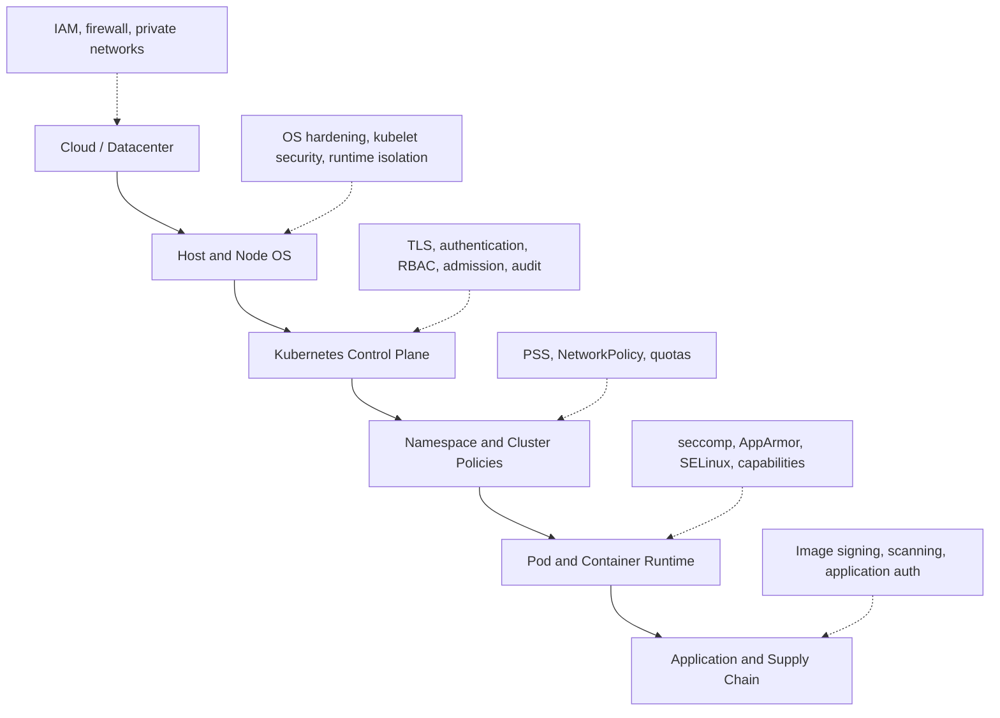

A secure workload therefore needs all of the following:

1. A secure control plane.
2. Hardened worker nodes.
3. Strong identity and authorization.
4. Admission-time policy enforcement.
5. Network segmentation.
6. Runtime isolation.
7. Secret protection.
8. Audit and detection.
9. Secure software supply chain.

The Kubernetes security documentation covers control-plane access, TLS, encryption at rest, Secrets, Pod Security Standards, RuntimeClass, NetworkPolicy, admission control and audit logging. ([Kubernetes][1])

---

# 1. How a Kubernetes API request is secured

Almost every Kubernetes operation passes through `kube-apiserver`.

Examples:

```bash
kubectl get pods
kubectl apply -f deployment.yaml
```

Controllers, schedulers, operators and kubelets also communicate with the API server rather than writing directly to etcd.

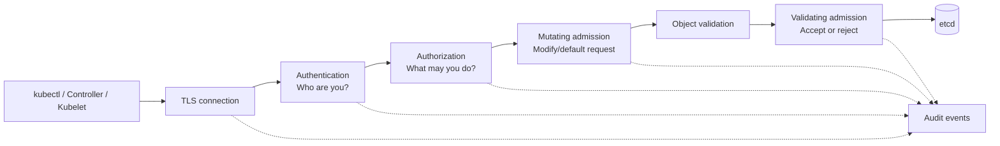

The API server normally exposes a TLS-protected endpoint, conventionally on port `6443`. Authentication establishes the caller’s identity, authorization evaluates the requested action, admission controls inspect object-changing requests, validation checks the object, and accepted state is persisted in etcd. Read-only requests such as `get`, `list` and `watch` do not normally pass through admission controls. ([Kubernetes][2])

## Example: creating a privileged Pod

A user submits:

```yaml
apiVersion: v1
kind: Pod
metadata:
  name: dangerous
spec:
  hostPID: true
  containers:
    - name: shell
      image: alpine
      securityContext:
        privileged: true
```

The request might be stopped at multiple stages:

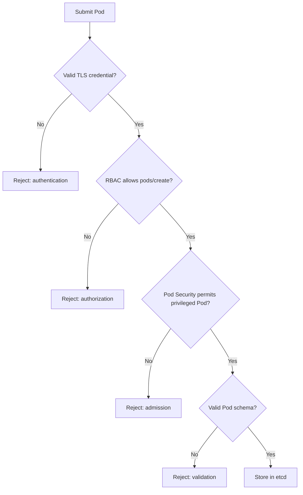

This illustrates defence in depth. RBAC controls whether someone may create Pods; Pod Security controls what kind of Pod they may create.

---

# 2. Authentication: proving identity

Kubernetes supports several authentication mechanisms.

| Identity          | Recommended mechanism                 | Typical usage                 |
| ----------------- | ------------------------------------- | ----------------------------- |
| Human users       | OIDC/JWT through an identity provider | Engineers and administrators  |
| Pods              | Projected ServiceAccount token        | Workload-to-API communication |
| Nodes             | X.509 client certificate              | Kubelet authentication        |
| Cluster bootstrap | Bootstrap token                       | Initial node joining          |
| External systems  | OIDC, client certificate or webhook   | CI/CD and automation          |
| Legacy scripts    | Static token                          | Avoid or migrate              |

Kubernetes supports X.509 certificates, ServiceAccount tokens, OIDC/JWT tokens, webhooks, authenticating proxies and bootstrap tokens. The documentation recommends using ServiceAccounts for workloads and a separate identity mechanism for human users. ([Kubernetes][3])

## Recommended human authentication

Use an external identity provider:

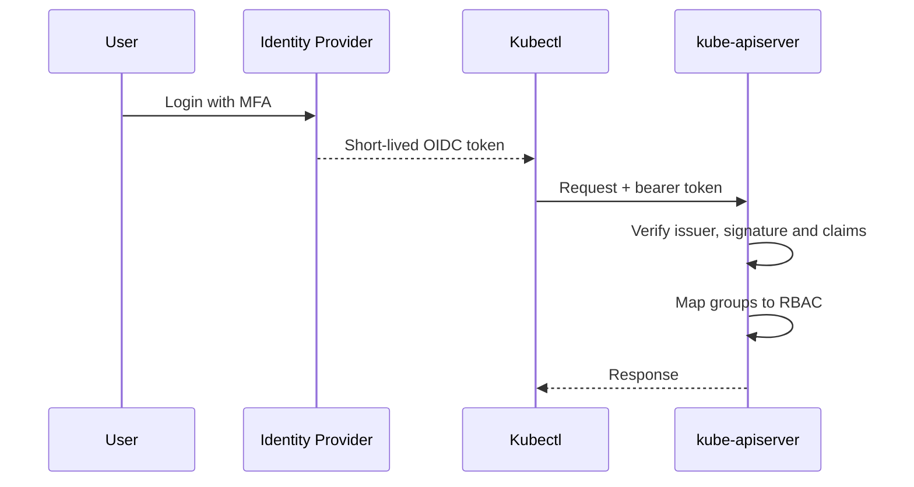

Advantages:

* Central user lifecycle management.
* MFA can be enforced by the identity provider.
* Short-lived credentials.
* Group membership maps naturally to RBAC.
* Users can be disabled without manually rotating cluster certificates.

Structured authentication configuration can define JWT issuers, claim mappings and validation rules centrally. ([Kubernetes][3])

## Workload identity

Pods should use ServiceAccounts:

```yaml
apiVersion: v1
kind: ServiceAccount
metadata:
  name: payment-api
  namespace: payments
automountServiceAccountToken: false
```

Only enable token mounting when the workload actually needs the Kubernetes API:

```yaml
spec:
  serviceAccountName: payment-api
  automountServiceAccountToken: true
```

Modern projected ServiceAccount tokens are short-lived, audience-bound and automatically rotated, unlike older long-lived Secret-based tokens. ([Kubernetes][4])

---

# 3. Authorization: what may the identity do?

The common Kubernetes authorization modes are:

* `RBAC`: permissions defined using Roles and bindings.
* `Node`: special permissions for kubelets.
* Webhook: authorization delegated to another service.
* ABAC: older attribute-based model, generally avoided for new deployments.

A typical production API server uses:

```text
--authorization-mode=Node,RBAC
```

## RBAC objects

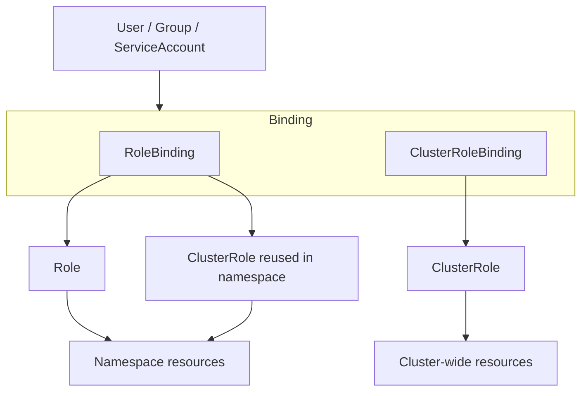

Kubernetes RBAC has four main objects:

* `Role`: namespaced permissions.
* `ClusterRole`: cluster-level permissions or reusable namespaced permissions.
* `RoleBinding`: binds permissions inside one namespace.
* `ClusterRoleBinding`: binds permissions cluster-wide.

RBAC permissions are additive; there are no explicit deny rules. ([Kubernetes][5])

## Least-privilege RBAC example

Allow a ServiceAccount to read Pods only in `payments`:

```yaml
apiVersion: v1
kind: ServiceAccount
metadata:
  name: deployment-observer
  namespace: payments
---
apiVersion: rbac.authorization.k8s.io/v1
kind: Role
metadata:
  name: pod-reader
  namespace: payments
rules:
  - apiGroups: [""]
    resources: ["pods"]
    verbs: ["get", "list", "watch"]

  - apiGroups: [""]
    resources: ["pods/log"]
    verbs: ["get"]
---
apiVersion: rbac.authorization.k8s.io/v1
kind: RoleBinding
metadata:
  name: deployment-observer-pod-reader
  namespace: payments
subjects:
  - kind: ServiceAccount
    name: deployment-observer
    namespace: payments
roleRef:
  apiGroup: rbac.authorization.k8s.io
  kind: Role
  name: pod-reader
```

Notice that `pods` and `pods/log` are separate resources.

## Dangerous RBAC permissions

These permissions are frequently underestimated:

| Permission                | Why it is powerful                          |
| ------------------------- | ------------------------------------------- |
| Create Pods               | Can mount Secrets or privileged host paths  |
| Create Deployments/Jobs   | Usually equivalent to creating Pods         |
| `get` Secrets             | Reads a specific Secret                     |
| `list` Secrets            | Can retrieve contents of all listed Secrets |
| Create RoleBindings       | May escalate privileges                     |
| Impersonate users/groups  | Can act as another identity                 |
| Access `pods/exec`        | Remote command execution                    |
| Access `pods/portforward` | Bypass normal ingress paths                 |
| Modify admission webhooks | Can disable or disrupt policy               |
| Modify CRDs               | Can affect operators and controllers        |
| Create CSRs               | May obtain additional certificates          |

Someone who can create a Pod may be able to expose Secrets available to that Pod, even without direct `get secrets` permission. Kubernetes therefore treats Pod creation as a high-trust permission. ([Kubernetes][6])

Avoid regular use of:

```text
cluster-admin
system:masters
resources: ["*"]
verbs: ["*"]
```

`system:masters` should generally be reserved for tightly controlled break-glass access. ([Kubernetes][7])

---

# 4. Admission control: controlling what enters the cluster

RBAC answers:

> May Alice create Pods?

Admission answers:

> Is Alice allowed to create this particular Pod configuration?

Admission controls include:

* Built-in admission controllers.
* Pod Security Admission.
* ValidatingAdmissionPolicy.
* MutatingAdmissionWebhook.
* ValidatingAdmissionWebhook.
* ResourceQuota.
* LimitRanger.
* NodeRestriction.

Kubernetes includes default admission plugins such as ServiceAccount, PodSecurity, ResourceQuota, LimitRanger, mutating and validating admission webhooks and ValidatingAdmissionPolicy. ([Kubernetes][8])

## Native policy versus webhook

| Mechanism                 | Use it for                                             |
| ------------------------- | ------------------------------------------------------ |
| Pod Security Admission    | Standard Pod hardening                                 |
| ValidatingAdmissionPolicy | CEL-based object validation without an external server |
| Validating webhook        | Complex policy or external data lookups                |
| Mutating webhook          | Injecting sidecars, labels, security defaults          |
| ResourceQuota             | Namespace resource limits                              |
| LimitRange                | Default/min/max container resources                    |
| NodeRestriction           | Restricting kubelet object modifications               |

Prefer native controls when they can express the requirement. An external webhook introduces another network dependency into API write operations.

---

# 5. Pod Security Standards

Kubernetes defines three Pod Security Standard profiles.

| Profile    | Meaning                              | When to use                                 |
| ---------- | ------------------------------------ | ------------------------------------------- |
| Privileged | Almost unrestricted                  | Trusted system agents requiring host access |
| Baseline   | Prevents common privilege escalation | Legacy applications during migration        |
| Restricted | Strong current hardening practices   | Most production application namespaces      |

The `Privileged`, `Baseline` and `Restricted` profiles are enforced using Pod Security Admission at namespace level. Admission supports `enforce`, `audit` and `warn` modes. ([Kubernetes][9])

## Recommended application namespace

```yaml
apiVersion: v1
kind: Namespace
metadata:
  name: payments
  labels:
    pod-security.kubernetes.io/enforce: restricted
    pod-security.kubernetes.io/enforce-version: v1.36

    pod-security.kubernetes.io/audit: restricted
    pod-security.kubernetes.io/audit-version: v1.36

    pod-security.kubernetes.io/warn: restricted
    pod-security.kubernetes.io/warn-version: v1.36
```

## Recommended rollout

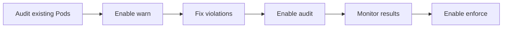

For an existing cluster:

1. Start with `warn` and `audit`.
2. Identify incompatible workloads.
3. Fix their security contexts.
4. Enforce `restricted`.
5. Isolate unavoidable privileged workloads into dedicated namespaces and nodes.

---

# 6. Pod and container security

Containers share the node kernel. Container isolation is therefore weaker than virtual-machine isolation unless additional sandboxing is used.

Linux workload security is built from:

* User and group IDs.
* Linux capabilities.
* Seccomp.
* AppArmor or SELinux.
* Namespaces.
* Cgroups.
* Read-only filesystems.
* Privilege-escalation controls.
* Optional user namespaces.
* Optional sandboxed runtimes.

Kubernetes exposes these through Pod and container `securityContext` fields. ([Kubernetes][10])

## Hardened Deployment example

```yaml
apiVersion: apps/v1
kind: Deployment
metadata:
  name: payment-api
  namespace: payments
spec:
  replicas: 3
  selector:
    matchLabels:
      app: payment-api
  template:
    metadata:
      labels:
        app: payment-api
    spec:
      serviceAccountName: payment-api
      automountServiceAccountToken: false

      securityContext:
        runAsNonRoot: true
        runAsUser: 10001
        runAsGroup: 10001
        fsGroup: 10001
        seccompProfile:
          type: RuntimeDefault

      containers:
        - name: api
          image: registry.example.com/payment-api@sha256:<image-digest>

          ports:
            - name: http
              containerPort: 8080

          securityContext:
            allowPrivilegeEscalation: false
            privileged: false
            readOnlyRootFilesystem: true
            capabilities:
              drop:
                - ALL

          resources:
            requests:
              cpu: 200m
              memory: 256Mi
            limits:
              cpu: "1"
              memory: 512Mi

          volumeMounts:
            - name: tmp
              mountPath: /tmp

      volumes:
        - name: tmp
          emptyDir:
            sizeLimit: 100Mi
```

### What each setting protects

| Setting                           | Protection                                    |
| --------------------------------- | --------------------------------------------- |
| `runAsNonRoot`                    | Prevents UID 0 execution                      |
| Explicit UID/GID                  | Predictable filesystem permissions            |
| `allowPrivilegeEscalation: false` | Prevents `setuid` and similar escalation      |
| `privileged: false`               | Prevents nearly unrestricted host access      |
| Drop `ALL` capabilities           | Removes kernel privileges such as raw sockets |
| `RuntimeDefault` seccomp          | Blocks selected dangerous syscalls            |
| Read-only root filesystem         | Limits persistence and tampering              |
| No automatic API token            | Reduces credential exposure                   |
| CPU/memory limits                 | Reduces noisy-neighbour and exhaustion risk   |
| Image digest                      | Prevents tag mutation                         |

A read-only root filesystem normally requires writable temporary directories such as `/tmp` to be explicitly mounted.

## Linux capabilities

A normal process traditionally receives many privileges through UID 0. Linux capabilities split those privileges into smaller units.

Examples:

| Capability     | Risk                                                |
| -------------- | --------------------------------------------------- |
| `NET_ADMIN`    | Modify interfaces, routes or firewall configuration |
| `SYS_ADMIN`    | Very broad; often described as near-root            |
| `SYS_PTRACE`   | Inspect or manipulate other processes               |
| `NET_RAW`      | Create raw network packets                          |
| `SYS_MODULE`   | Load kernel modules                                 |
| `DAC_OVERRIDE` | Bypass filesystem access checks                     |

Default approach:

```yaml
securityContext:
  capabilities:
    drop: ["ALL"]
```

Add back only a specifically required capability.

---

# 7. RuntimeClass and stronger isolation

A `RuntimeClass` lets a Pod select a particular container runtime handler.

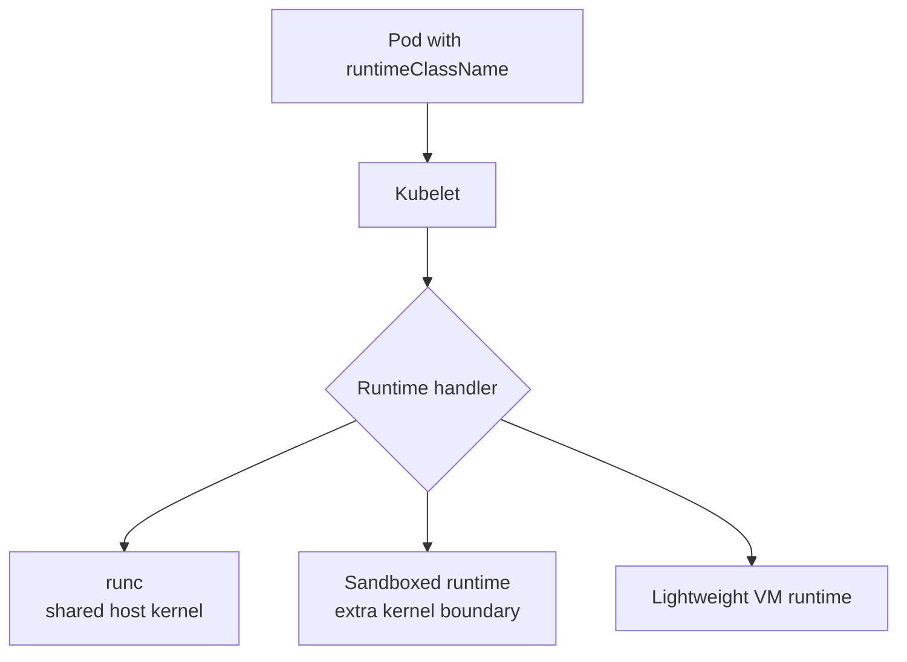

Example:

```yaml
apiVersion: node.k8s.io/v1
kind: RuntimeClass
metadata:
  name: sandboxed
handler: sandboxed-runtime
---
apiVersion: v1
kind: Pod
metadata:
  name: untrusted-processor
spec:
  runtimeClassName: sandboxed
  containers:
    - name: processor
      image: registry.example.com/processor:1.4.0
```

Use stronger runtime isolation when:

* Running untrusted customer code.
* Operating a multi-tenant build platform.
* Running browser automation or plugins.
* Processing potentially malicious files.
* Running arbitrary CI jobs.
* Security boundaries require more than ordinary containers.

Sandboxed or hardware-virtualized runtimes provide stronger isolation but introduce additional CPU, memory and startup overhead. ([Kubernetes][11])

## User namespaces

User namespaces map container users to different host UIDs.

Conceptually:

```text
Container UID 0  -> Host UID 100000
Container UID 1  -> Host UID 100001
```

The process may appear to be root inside the container but is not host root.

On supported Kubernetes, runtime and filesystem combinations:

```yaml
spec:
  hostUsers: false
```

User namespaces provide another containment layer, but support depends on the operating system, container runtime and mounted volume types. ([Kubernetes][12])

---

# 8. Network security

Without NetworkPolicy, Pods can commonly communicate broadly inside the cluster, depending on the networking implementation.

NetworkPolicy controls:

* Which sources may connect to a Pod.
* Which destinations a Pod may connect to.
* Which ports and protocols may be used.

Ingress and egress isolation are independent. NetworkPolicy enforcement also requires a CNI implementation that supports it. ([Kubernetes][13])

## Recommended model

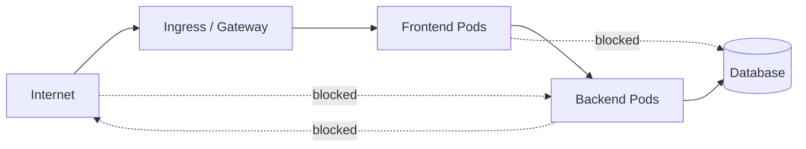

## Step 1: default deny

```yaml
apiVersion: networking.k8s.io/v1
kind: NetworkPolicy
metadata:
  name: default-deny-all
  namespace: payments
spec:
  podSelector: {}
  policyTypes:
    - Ingress
    - Egress
```

After applying this policy, selected Pods need explicit allow policies.

## Step 2: allow frontend to payment API

```yaml
apiVersion: networking.k8s.io/v1
kind: NetworkPolicy
metadata:
  name: allow-frontend
  namespace: payments
spec:
  podSelector:
    matchLabels:
      app: payment-api

  policyTypes:
    - Ingress

  ingress:
    - from:
        - namespaceSelector:
            matchLabels:
              kubernetes.io/metadata.name: frontend
          podSelector:
            matchLabels:
              app: checkout

      ports:
        - protocol: TCP
          port: 8080
```

## Step 3: allow DNS

```yaml
apiVersion: networking.k8s.io/v1
kind: NetworkPolicy
metadata:
  name: allow-dns
  namespace: payments
spec:
  podSelector: {}

  policyTypes:
    - Egress

  egress:
    - to:
        - namespaceSelector:
            matchLabels:
              kubernetes.io/metadata.name: kube-system
          podSelector:
            matchLabels:
              k8s-app: kube-dns

      ports:
        - protocol: UDP
          port: 53
        - protocol: TCP
          port: 53
```

## Step 4: allow only the database

```yaml
apiVersion: networking.k8s.io/v1
kind: NetworkPolicy
metadata:
  name: allow-database
  namespace: payments
spec:
  podSelector:
    matchLabels:
      app: payment-api

  policyTypes:
    - Egress

  egress:
    - to:
        - ipBlock:
            cidr: 10.40.12.0/24
      ports:
        - protocol: TCP
          port: 5432
```

NetworkPolicy is primarily an L3/L4 control. It does not replace:

* Application authentication.
* TLS or mTLS.
* API authorization.
* Service-mesh policy.
* Web Application Firewalls.
* Database permissions.

Also explicitly restrict access to cloud instance metadata endpoints unless workloads require it. ([Kubernetes][7])

---

# 9. Secrets and encryption

A Kubernetes Secret is an API object designed to hold sensitive data. Base64 encoding is not encryption.

Unless encryption at rest is configured, Secret data can be stored unencrypted in etcd. Access to Secrets must therefore be tightly limited, and etcd must be protected using TLS and network isolation. ([Kubernetes][6])

## Secret threat model

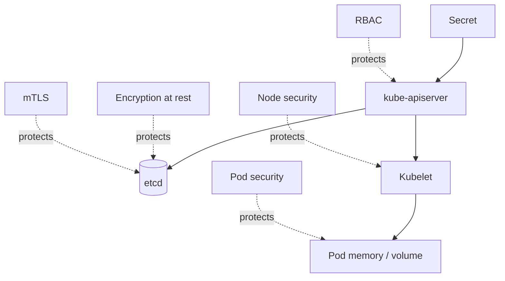

## Encryption at rest

The API server needs an `EncryptionConfiguration` and the corresponding command-line argument:

```text
--encryption-provider-config=/etc/kubernetes/encryption.yaml
```

For strong production key management, KMS v2 is generally preferable because it provides envelope encryption and keeps the key-encryption key in an external key-management system. Kubernetes documents KMS v2 as the strongest available option and a suitable choice when integrating external key-management tooling. ([Kubernetes][14])

Conceptual configuration:

```yaml
apiVersion: apiserver.config.k8s.io/v1
kind: EncryptionConfiguration
resources:
  - resources:
      - secrets
    providers:
      - kms:
          apiVersion: v2
          name: production-kms
          endpoint: unix:///var/run/kmsplugin/socket.sock
      - identity: {}
```

Provider ordering matters: the first provider encrypts new writes, while later providers can decrypt older data during migration. Existing objects must be rewritten to encrypt previously stored plaintext data. ([Kubernetes][14])

## Secret best practices

* Avoid giving applications `list` or `watch` access to Secrets.
* Separate applications into namespaces.
* Disable automatic ServiceAccount token mounting.
* Prefer short-lived credentials.
* Rotate Secrets regularly.
* Do not commit Secrets to Git.
* Protect etcd backups as highly sensitive data.
* Consider an external secret manager.
* Mount only the exact Secret keys a container needs.
* Avoid exposing Secrets through command-line arguments or logs.

The Secrets Store CSI Driver can mount secrets from external systems rather than storing every credential directly as a conventional Kubernetes Secret. ([Kubernetes][6])

---

# 10. Control-plane security in depth

The control plane contains:

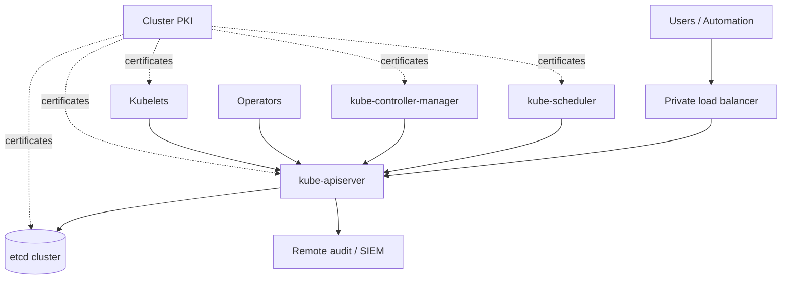

## 10.1 API server

The API server should be treated as the primary cluster security boundary.

Recommended controls:

* Private endpoint where possible.
* Firewall or source-IP restrictions.
* TLS certificates from a protected cluster CA.
* Anonymous authentication disabled unless explicitly required.
* OIDC for humans.
* Node and RBAC authorization.
* PodSecurity and NodeRestriction admission.
* Encryption at rest.
* Audit logging.
* Restricted administrative access.
* No direct public exposure of etcd or kubelets.

Representative self-managed configuration:

```yaml
command:
  - kube-apiserver

  - --anonymous-auth=false
  - --authorization-mode=Node,RBAC

  - --enable-admission-plugins=NodeRestriction,PodSecurity

  - --encryption-provider-config=/etc/kubernetes/encryption.yaml

  - --audit-policy-file=/etc/kubernetes/audit-policy.yaml
  - --audit-log-path=/var/log/kubernetes/audit.log
  - --audit-log-maxage=30
  - --audit-log-maxbackup=10

  - --etcd-cafile=/etc/kubernetes/pki/etcd/ca.crt
  - --etcd-certfile=/etc/kubernetes/pki/apiserver-etcd-client.crt
  - --etcd-keyfile=/etc/kubernetes/pki/apiserver-etcd-client.key

  - --tls-min-version=VersionTLS12
```

The exact flags exposed by managed Kubernetes services differ. In managed services, some control-plane settings are handled by the provider, while RBAC, admission policies, workload identity, NetworkPolicy and workload security remain cluster-owner concerns.

## 10.2 Kubernetes PKI

Kubernetes uses certificates for:

* API server serving TLS.
* API server-to-etcd authentication.
* etcd peer and client authentication.
* Kubelet client authentication.
* API server-to-kubelet authentication.
* Controller and scheduler identities.
* ServiceAccount token signing.

Kubernetes documents separate certificates and trust relationships for the API server, etcd, kubelets and other control-plane components. ([Kubernetes][15])

Operational requirements:

* Protect CA private keys offline or in secure storage.
* Rotate expiring certificates.
* Monitor certificate expiration.
* Avoid sharing one certificate across unrelated components.
* Restrict certificate file permissions.
* Back up keys separately from ordinary cluster data.

## 10.3 etcd

etcd contains the authoritative cluster state:

* Secrets.
* ConfigMaps.
* Workloads.
* RBAC rules.
* ServiceAccounts.
* CRDs and custom resources.
* Node state.

Direct write access to etcd is effectively cluster-root access because it bypasses API authentication, authorization and admission. etcd should be reachable only by trusted control-plane components and protected with mutual TLS and firewalls. ([Kubernetes][16])

Recommended topology:

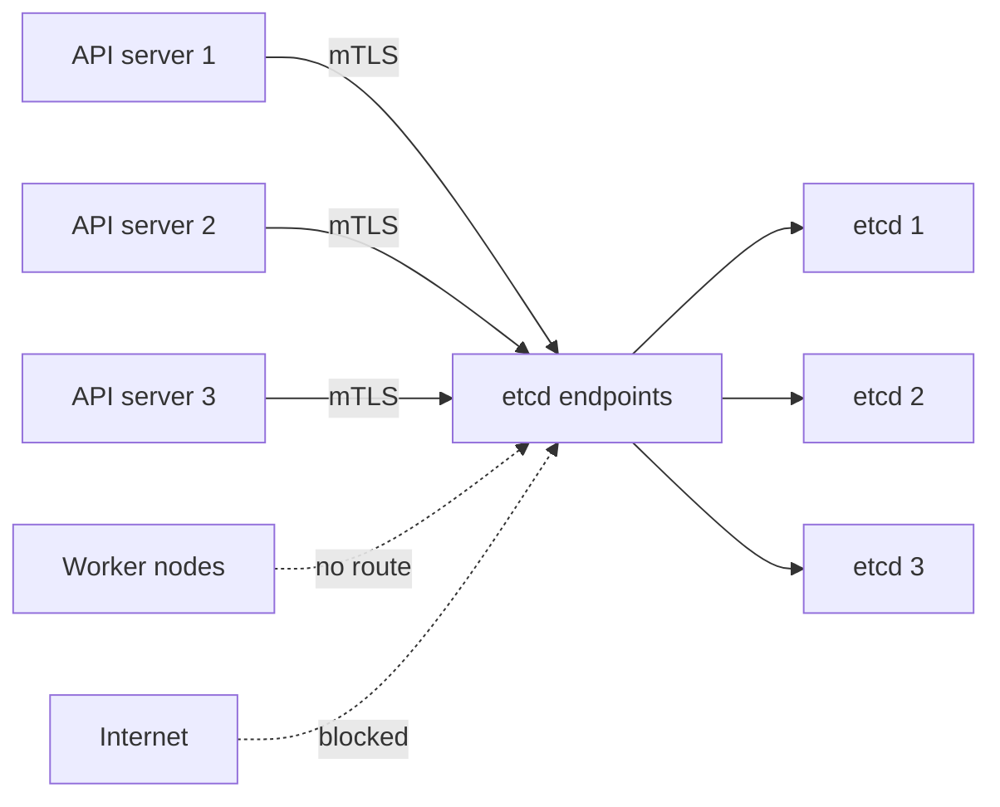

## 10.4 Scheduler and controller manager

These components should:

* Authenticate to the API server using distinct credentials.
* Have only the permissions required for their function.
* Never write directly to etcd.
* Expose metrics and health endpoints only on controlled networks.
* Run on dedicated control-plane nodes.
* Be protected by restrictive host permissions.

## 10.5 Audit logging

Audit logging records API activity.

Available audit levels are:

| Level             | Recorded                              |
| ----------------- | ------------------------------------- |
| `None`            | Nothing                               |
| `Metadata`        | User, request, timestamp and resource |
| `Request`         | Metadata and request body             |
| `RequestResponse` | Request and response bodies           |

Kubernetes produces no audit events unless an audit policy and backend are configured. Audit events can be written to logs or sent to a webhook backend. ([Kubernetes][17])

A reasonable starting policy:

```yaml
apiVersion: audit.k8s.io/v1
kind: Policy
omitStages:
  - RequestReceived

rules:
  # Do not record Secret bodies.
  - level: Metadata
    resources:
      - group: ""
        resources: ["secrets"]

  # Record RBAC changes with request bodies.
  - level: Request
    resources:
      - group: rbac.authorization.k8s.io
        resources:
          - roles
          - rolebindings
          - clusterroles
          - clusterrolebindings

  # Record workload mutations.
  - level: Request
    verbs: ["create", "update", "patch", "delete"]
    resources:
      - group: apps
        resources:
          - deployments
          - daemonsets
          - statefulsets

  # Default.
  - level: Metadata
```

Send audit logs to a remote append-only or access-controlled logging system. If an attacker compromises the control-plane host, local logs may be deleted or altered.

---

# 11. Worker-node and host-level security

A worker node is not simply a machine that runs containers. It contains several privileged components:

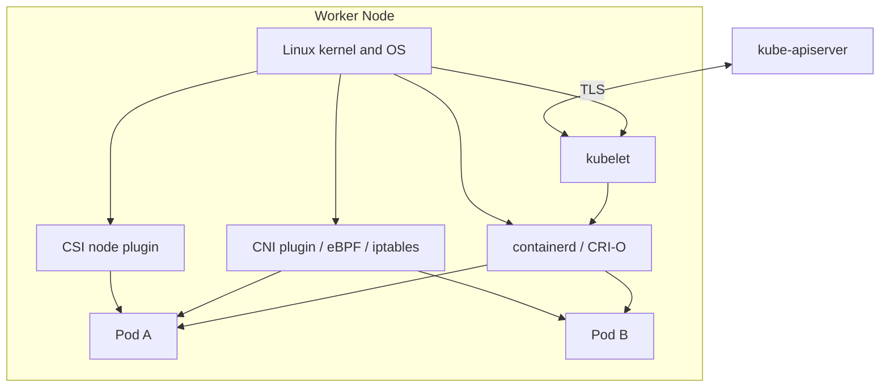

A node compromise can expose:

* Every Pod running on the node.
* Mounted Secrets.
* ServiceAccount tokens.
* Node credentials.
* Container runtime access.
* Network traffic.
* Host files.
* Potential access to other cluster resources through the kubelet identity.

## 11.1 Kubelet authentication and authorization

The kubelet API is security-sensitive because it exposes operations involving Pods, logs, metrics and command execution.

Recommended Kubelet configuration:

```yaml
apiVersion: kubelet.config.k8s.io/v1beta1
kind: KubeletConfiguration

authentication:
  anonymous:
    enabled: false

  webhook:
    enabled: true

  x509:
    clientCAFile: /etc/kubernetes/pki/ca.crt

authorization:
  mode: Webhook

readOnlyPort: 0

rotateCertificates: true
serverTLSBootstrap: true

protectKernelDefaults: true
```

The Kubernetes documentation recommends disabling anonymous access, using client certificates or webhook token authentication, and using webhook authorization instead of the permissive `AlwaysAllow` mode. ([Kubernetes][18])

## 11.2 Container runtime socket

The container runtime socket is effectively root-equivalent:

```text
/run/containerd/containerd.sock
/var/run/crio/crio.sock
```

A process with access may be able to:

* Start privileged containers.
* Mount host directories.
* Inspect container environments.
* Read workload filesystems.
* Bypass Kubernetes admission controls.

Do not mount the runtime socket into ordinary Pods. Restrict it to root and trusted node components.

## 11.3 Static Pods

Static Pods are loaded directly by the kubelet from local manifest files, commonly:

```text
/etc/kubernetes/manifests/
```

They bypass the normal Kubernetes API request path, including ordinary admission enforcement at creation time. Protect the static Pod manifest directory, kubelet configuration and associated credentials with strict filesystem permissions and host access controls. ([Kubernetes][19])

## 11.4 Important node directories

Protect these locations:

```text
/etc/kubernetes/
/var/lib/kubelet/
/var/lib/etcd/
/etc/cni/net.d/
/opt/cni/bin/
/etc/containerd/
/var/lib/containerd/
/run/containerd/
/var/log/pods/
/var/log/containers/
```

Control-plane nodes require especially strict access because `/var/lib/etcd` and the cluster PKI may provide full cluster compromise.

## 11.5 Host operating-system controls

For self-managed nodes:

* Use a minimal-purpose OS.
* Apply kernel, kubelet and runtime security patches.
* Disable unused services and packages.
* Restrict SSH to controlled administrative paths.
* Use short-lived administrative access.
* Enable disk encryption where appropriate.
* Protect boot configuration and kernel command-line settings.
* Use host firewall rules.
* Monitor file integrity.
* Restrict outbound node communication.
* Avoid installing general-purpose developer tooling.
* Separate control-plane and worker roles.
* Keep production workloads away from control-plane nodes.

## 11.6 Swap and memory-backed Secrets

Secrets mounted as volumes are normally memory-backed on Linux, but unsuitable or older swap configurations can risk writing sensitive memory pages to disk. Use Kubernetes-supported swap configuration and encrypted swap, or disable swap when it is not intentionally configured. ([Kubernetes][20])

## 11.7 Kernel security profiles

Use at least one Linux Security Module:

* AppArmor.
* SELinux.

And use seccomp:

```yaml
securityContext:
  seccompProfile:
    type: RuntimeDefault
```

The controls complement one another:

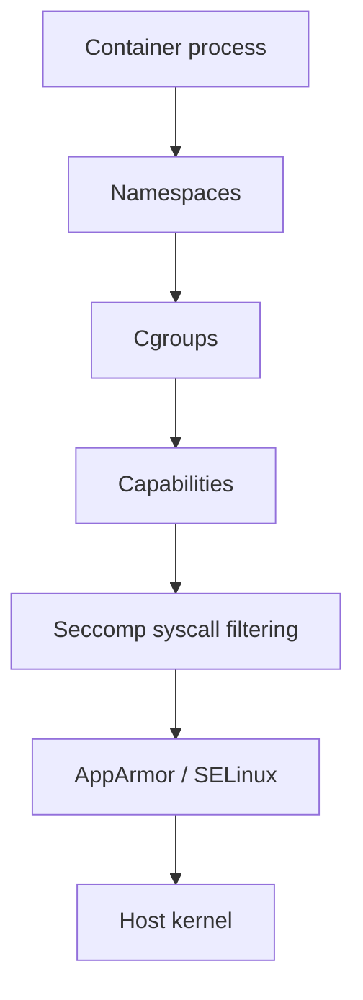

Namespaces hide resources. Cgroups limit consumption. Capabilities reduce root privileges. Seccomp limits syscalls. AppArmor or SELinux controls access to files and other objects.

---

# 12. Availability security

Security also includes preventing resource exhaustion.

## ResourceQuota

Example namespace quota:

```yaml
apiVersion: v1
kind: ResourceQuota
metadata:
  name: payments-quota
  namespace: payments
spec:
  hard:
    requests.cpu: "20"
    requests.memory: 40Gi
    limits.cpu: "40"
    limits.memory: 80Gi
    pods: "100"
    services.loadbalancers: "2"
    persistentvolumeclaims: "20"
```

## LimitRange

```yaml
apiVersion: v1
kind: LimitRange
metadata:
  name: container-defaults
  namespace: payments
spec:
  limits:
    - type: Container
      defaultRequest:
        cpu: 100m
        memory: 128Mi
      default:
        cpu: "1"
        memory: 512Mi
      max:
        cpu: "4"
        memory: 4Gi
```

Use quotas and limits to prevent:

* Accidental namespace exhaustion.
* One team consuming all cluster resources.
* Excessive LoadBalancer creation.
* Unlimited PVC creation.
* Workloads with no resource constraints.

ResourceQuota and LimitRanger are admission controls that reject or default objects before they are persisted. ([Kubernetes][8])

---

# 13. Software supply-chain security

Kubernetes runtime security cannot repair a compromised image.

The deployment path should be protected:

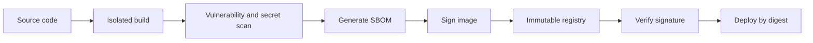

Controls include:

* Protected source repositories.
* Reviewed build definitions.
* Isolated build workers.
* Minimal base images.
* Dependency scanning.
* Secret scanning.
* SBOM generation.
* Image signing.
* Registry access controls.
* Immutable tags or digest references.
* Admission-time signature verification.
* Continuous vulnerability management.

Use these controls for every production delivery pipeline, especially environments where multiple teams publish workloads. Kubernetes security guidance explicitly includes image scanning and signing in the workload lifecycle. ([Kubernetes][21])

---

# 14. Security control selection guide

| Security control          | Protects against                       | Use it when                          |
| ------------------------- | -------------------------------------- | ------------------------------------ |
| TLS and PKI               | Credential and traffic interception    | Every cluster                        |
| OIDC authentication       | Unmanaged human credentials            | Every multi-user cluster             |
| ServiceAccounts           | Shared workload credentials            | Every workload calling the API       |
| RBAC                      | Excessive API permissions              | Every cluster                        |
| Node authorization        | Compromised kubelet overreach          | Every production cluster             |
| Pod Security Admission    | Unsafe Pod specifications              | Every application namespace          |
| ValidatingAdmissionPolicy | Organisation-specific object rules     | Central platform governance          |
| Admission webhooks        | Complex/external policy decisions      | When native policy is insufficient   |
| SecurityContext           | Container privilege escalation         | Every workload                       |
| Seccomp                   | Dangerous syscalls                     | Every Linux workload                 |
| AppArmor/SELinux          | Filesystem and process access          | Hardened production nodes            |
| NetworkPolicy             | Lateral movement                       | Every multi-service cluster          |
| Encryption at rest        | etcd or backup disclosure              | Every cluster holding sensitive data |
| External secret manager   | Long-lived static credentials          | Sensitive production systems         |
| RuntimeClass              | Host-kernel escape risk                | Untrusted or hostile workloads       |
| User namespaces           | Container-root exposure                | Supported Linux workloads            |
| ResourceQuota             | Namespace resource exhaustion          | Shared clusters                      |
| Audit logging             | Undetected misuse and weak forensics   | Every production cluster             |
| Image signing             | Compromised supply chain               | Controlled production deployment     |
| Separate clusters         | Strong tenant or environment isolation | Hostile tenants or strict compliance |

---

# 15. Recommended production security baseline

## Control plane

```text
Private API endpoint
+ TLS 1.2 or later
+ OIDC and MFA
+ Node,RBAC authorization
+ NodeRestriction
+ Pod Security Admission
+ etcd mutual TLS
+ encryption at rest
+ remote audit logging
+ break-glass administrator process
```

## Namespace

```text
Restricted Pod Security
+ default-deny ingress and egress
+ explicit allow policies
+ ResourceQuota
+ LimitRange
+ namespace-scoped RBAC
```

## Workload

```text
Non-root
+ no privilege escalation
+ drop all capabilities
+ RuntimeDefault seccomp
+ read-only root filesystem
+ resource requests and limits
+ no ServiceAccount token unless needed
+ image pinned by digest
```

## Node

```text
Anonymous kubelet access disabled
+ webhook authorization
+ runtime socket protected
+ static Pod directory protected
+ minimal patched OS
+ host firewall
+ disk and swap protection
+ runtime and host monitoring
```

## Detection

```text
API audit logs
+ node authentication logs
+ container runtime events
+ policy violations
+ privileged Pod alerts
+ exec/port-forward alerts
+ RBAC change alerts
+ Secret access monitoring
```

---

# Final mental model

Think about Kubernetes security as five questions:

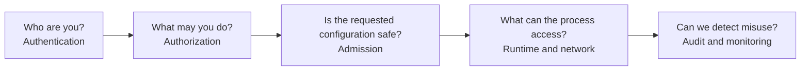

A secure cluster must answer all five. Strong RBAC cannot protect a privileged container. A secure container cannot protect an exposed API server. NetworkPolicy cannot protect unencrypted Secrets in etcd. Kubernetes security works only when control-plane, node, workload, network, data and supply-chain controls are applied together.

[1]: https://kubernetes.io/docs/concepts/security/ "Security | Kubernetes"
[2]: https://kubernetes.io/docs/concepts/security/controlling-access/ "Controlling Access to the Kubernetes API | Kubernetes"
[3]: https://kubernetes.io/docs/reference/access-authn-authz/authentication/ "Authenticating | Kubernetes"
[4]: https://kubernetes.io/docs/concepts/security/service-accounts/ "Service Accounts | Kubernetes"
[5]: https://kubernetes.io/docs/reference/access-authn-authz/rbac/ "Using RBAC Authorization | Kubernetes"
[6]: https://kubernetes.io/docs/concepts/security/secrets-good-practices/ "Good practices for Kubernetes Secrets | Kubernetes"
[7]: https://kubernetes.io/docs/concepts/security/security-checklist/ "Security Checklist | Kubernetes"
[8]: https://kubernetes.io/docs/reference/access-authn-authz/admission-controllers/ "Admission Control in Kubernetes | Kubernetes"
[9]: https://kubernetes.io/docs/concepts/security/pod-security-standards/ "Pod Security Standards | Kubernetes"
[10]: https://kubernetes.io/docs/tasks/configure-pod-container/security-context/ "Configure a Security Context for a Pod or Container | Kubernetes"
[11]: https://kubernetes.io/docs/concepts/containers/runtime-class/ "Runtime Class | Kubernetes"
[12]: https://kubernetes.io/docs/concepts/workloads/pods/user-namespaces/ "User Namespaces | Kubernetes"
[13]: https://kubernetes.io/docs/concepts/services-networking/network-policies/ "Network Policies | Kubernetes"
[14]: https://kubernetes.io/docs/tasks/administer-cluster/encrypt-data/ "Encrypting Confidential Data at Rest | Kubernetes"
[15]: https://kubernetes.io/docs/setup/best-practices/certificates/ "PKI certificates and requirements | Kubernetes"
[16]: https://kubernetes.io/docs/tasks/administer-cluster/configure-upgrade-etcd/ "Operating etcd clusters for Kubernetes | Kubernetes"
[17]: https://kubernetes.io/docs/tasks/debug/debug-cluster/audit/ "Auditing | Kubernetes"
[18]: https://kubernetes.io/docs/reference/access-authn-authz/kubelet-authn-authz/ "Kubelet authentication/authorization | Kubernetes"
[19]: https://kubernetes.io/docs/concepts/security/api-server-bypass-risks/ "Kubernetes API Server Bypass Risks | Kubernetes"
[20]: https://kubernetes.io/docs/concepts/security/linux-security/ "Security For Linux Nodes | Kubernetes"
[21]: https://kubernetes.io/docs/concepts/security/cloud-native-security/ "Cloud Native Security and Kubernetes | Kubernetes"
