# Kubernetes Service Networking: Control Plane to Linux Kernel

The cleanest mental model is:

> **CNI builds the Pod network. EndpointSlices describe available backends. kube-proxy or an equivalent component turns a Service into node-level packet-forwarding rules.**

A Kubernetes Service is generally **not a proxy process**, **not a virtual machine**, and **not an IP address assigned to a network interface**. It is API state that is compiled into networking configuration on every node.

The Kubernetes networking model separates four problems:

1. Container-to-container communication inside a Pod
2. Pod-to-Pod communication
3. Pod-to-Service communication
4. External-to-Service communication

Pod CIDRs, Service CIDRs, and Node CIDRs must not overlap. Pod IPs are normally allocated by the CNI/IPAM system, Service IPs by the Kubernetes API server, and Node addresses by the kubelet or cloud integration. ([Kubernetes][1])

---

# 1. The three networking layers

Kubernetes networking becomes easier to understand when divided into three layers.

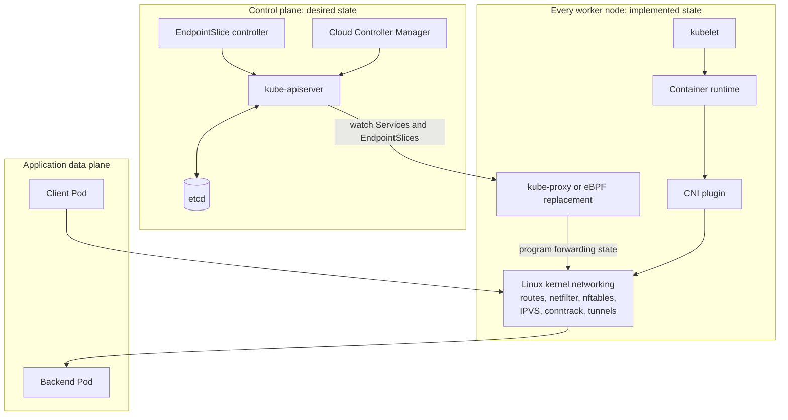

The layers have different responsibilities:

| Layer             | Responsibility                                                     |
| ----------------- | ------------------------------------------------------------------ |
| Control plane     | Stores Services, Pods, EndpointSlices and policies                 |
| Node networking   | Converts API state into routes, NAT rules, maps or virtual servers |
| Packet data plane | Moves each packet without contacting the API server                |

This distinction is important:

* The API server is **not in the packet path**.
* The EndpointSlice controller is **not in the packet path**.
* kube-proxy is usually **not forwarding packets itself**.
* Linux kernel networking, IPVS, nftables, iptables or eBPF handles packets.

---

# 2. Pod networking comes before Service networking

A Service cannot work until Pod-to-Pod networking works.

Kubernetes expects the Pod network to provide a flat networking model where Pods can communicate with other Pods, including across nodes, without application-visible NAT in the normal case. Every Pod has its own network namespace, while containers inside the same Pod share that namespace and communicate through `localhost`. ([Kubernetes][2])

Consider two nodes:

```text
Node A:
  Node IP: 192.168.10.11
  Pod CIDR: 10.244.1.0/24
  Client Pod: 10.244.1.10

Node B:
  Node IP: 192.168.10.12
  Pod CIDR: 10.244.2.0/24
  Web Pod: 10.244.2.19
```

The basic requirement is:

```text
10.244.1.10 must be able to reach 10.244.2.19
```

The mechanism is determined by the CNI plugin.

---

# 3. What happens when Kubernetes creates a Pod

Assume the scheduler assigns a Pod to Node A.

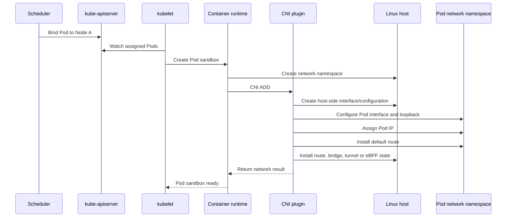

The container runtime invokes the configured CNI plugin. Kubernetes itself does not prescribe whether the plugin must use bridges, overlays, direct routes, cloud interfaces or eBPF. The CNI specification requires the plugin to configure container connectivity, assign addresses when applicable and install the necessary routing information. ([Kubernetes][3])

## Common host-level objects

Depending on the CNI, Pod creation may create or configure:

* A Pod network namespace
* A veth pair
* A host bridge
* A Pod IP address
* A default route inside the Pod
* A route for the Pod IP on the node
* An overlay tunnel device such as VXLAN or Geneve
* A cloud virtual network interface
* Neighbor or ARP entries
* iptables or nftables rules
* eBPF programs and maps

Not every CNI uses every item.

For example:

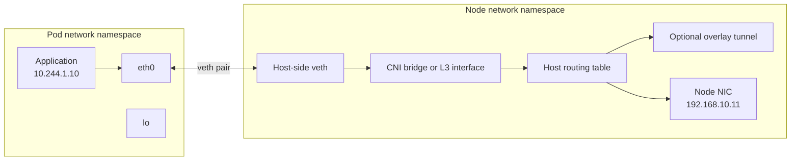

---

# 4. How cross-node Pod networking works

There are several common implementations.

## 4.1 Overlay networking

The original Pod packet is encapsulated inside a node-to-node packet.

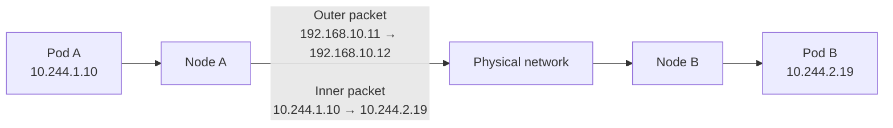

Examples include VXLAN or Geneve-based networking.

Advantages:

* Physical network does not need Pod CIDR routes.
* Works in many environments.
* Pod addressing is independent of underlay topology.

Costs:

* Encapsulation overhead
* Reduced effective MTU
* More difficult packet captures
* Additional tunnel processing

## 4.2 Native or direct routing

The physical network learns how to reach each node’s Pod CIDR.

```text
10.244.1.0/24 via 192.168.10.11
10.244.2.0/24 via 192.168.10.12
```

These routes may be distributed through:

* BGP
* Cloud routing tables
* Static routes
* A route controller

Advantages:

* No overlay encapsulation
* Easier packet inspection
* Potentially lower overhead

Costs:

* Physical network must support Pod routes
* Route scale can become significant
* Cloud route limits may apply

## 4.3 Cloud-native Pod interfaces

Some CNIs assign addresses from the cloud VPC directly to Pods.

A Pod may receive an IP that is natively routable in the VPC. The CNI attaches or manages cloud network interfaces and their secondary IPs.

Advantages:

* Native integration with cloud routing
* Cloud firewalls and security groups may understand Pod IPs

Costs:

* Consumes VPC IP space
* Cloud API rate limits
* Interface and IP-per-node limits

## 4.4 eBPF-based networking

An eBPF-based CNI may install programs at hooks such as:

* TC ingress/egress
* XDP
* cgroup socket hooks
* Network namespace interfaces

Instead of relying heavily on traditional iptables chains, packet forwarding and load balancing can be implemented through eBPF maps and programs.

---

# 5. What a Kubernetes Service actually creates

Consider this Service:

```yaml
apiVersion: v1
kind: Service
metadata:
  name: web
  namespace: default
spec:
  selector:
    app: web
  ports:
    - name: http
      port: 80
      targetPort: 8080
```

Assume Kubernetes assigns:

```text
Service name: web
ClusterIP: 10.96.20.50
Service port: 80
targetPort: 8080
```

And the selected Pods are:

```text
10.244.1.12:8080
10.244.2.19:8080
10.244.3.24:8080
```

The API server stores the Service, while the EndpointSlice controller finds matching Pods and creates or updates EndpointSlice objects. EndpointSlices are the scalable source of backend endpoint information used by kube-proxy. By default, a slice contains up to 100 endpoints, though that limit is configurable. ([Kubernetes][4])

Conceptually:

```yaml
apiVersion: discovery.k8s.io/v1
kind: EndpointSlice
metadata:
  labels:
    kubernetes.io/service-name: web
addressType: IPv4
ports:
  - port: 8080
endpoints:
  - addresses: ["10.244.1.12"]
    nodeName: node-a
    conditions:
      ready: true

  - addresses: ["10.244.2.19"]
    nodeName: node-b
    conditions:
      ready: true

  - addresses: ["10.244.3.24"]
    nodeName: node-c
    conditions:
      ready: false
```

The third endpoint generally does not receive normal Service traffic because it is not ready.

---

# 6. Control-plane reconciliation

The complete control-plane sequence looks like this:

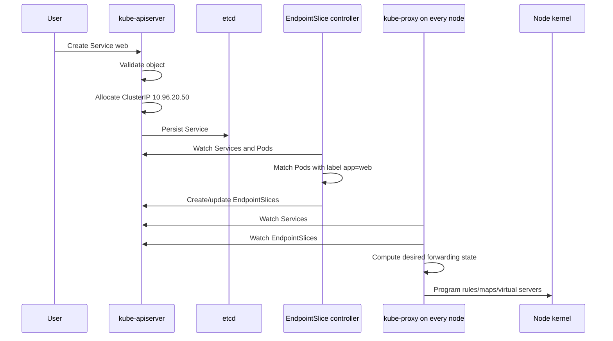

## Components involved

### kube-apiserver

The API server:

* Validates the Service
* Allocates a ClusterIP if one is not specified
* Allocates a NodePort when required
* Stores the object
* Exposes watch streams to controllers and node agents

ClusterIPs come from the configured Service CIDR. All API servers must agree on the Service CIDR, and that CIDR must not overlap Pod or Node networks. ([Kubernetes][5])

### EndpointSlice controller

The EndpointSlice controller:

1. Watches Services
2. Watches Pods
3. Evaluates Service selectors
4. Groups endpoints by address family, port and protocol
5. Creates, modifies and removes EndpointSlices

EndpointSlice conditions include:

* `ready`
* `serving`
* `terminating`

These allow the data plane to stop sending new traffic to Pods that are not ready or are being terminated. ([Kubernetes][6])

### kube-proxy

Every node normally runs kube-proxy unless the CNI or another component replaces it.

kube-proxy watches:

* Services
* EndpointSlices

It then synchronizes node-local kernel forwarding state. The kernel captures traffic addressed to a Service IP and redirects it to one of the Service endpoints. ([Kubernetes][7])

---

# 7. Why the ClusterIP is called a virtual IP

Suppose the Service IP is:

```text
10.96.20.50
```

Normally:

```bash
ip address
```

will not show `10.96.20.50` assigned to any node interface.

There is usually no application process listening directly on:

```text
10.96.20.50:80
```

The Service IP exists because the node has packet-processing rules that say:

```text
Packets for 10.96.20.50:80 should be translated
to one of these endpoints:

10.244.1.12:8080
10.244.2.19:8080
```

Consequences:

* `ss -lnt` normally will not show the ClusterIP.
* `netstat` normally will not show a listening Service socket.
* Pinging a Service IP is not a reliable test because Service rules are normally configured for specific transport protocols and ports.
* A TCP connection to the Service port works because the packet matches the Service forwarding rule.

---

# 8. Full ClusterIP packet walk

Consider:

```text
Client Pod:
  10.244.1.10 on Node A

Service:
  10.96.20.50:80

Selected backend:
  10.244.2.19:8080 on Node B
```

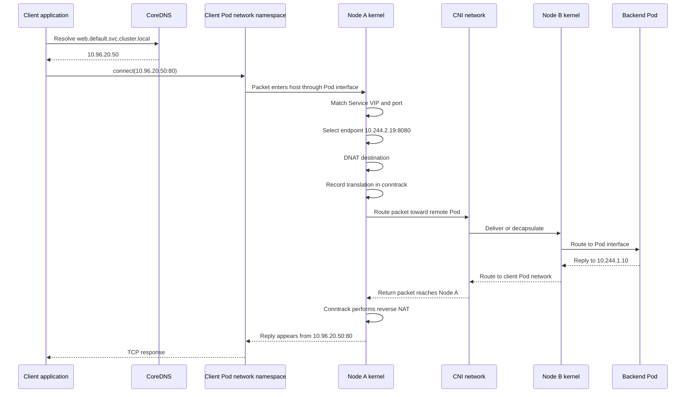

## Step 1: DNS resolution

A normal Service receives a DNS record such as:

```text
web.default.svc.cluster.local
```

CoreDNS returns:

```text
10.96.20.50
```

The kubelet configures each Pod’s `/etc/resolv.conf` with the cluster DNS server and search domains. A normal Service resolves to its ClusterIP, while a headless Service resolves to one or more endpoint addresses. ([Kubernetes][8])

A Pod may therefore use:

```text
http://web
```

because its search path expands the name to something similar to:

```text
web.default.svc.cluster.local
```

## Step 2: Packet leaves the Pod

The client creates:

```text
Source:      10.244.1.10:41422
Destination: 10.96.20.50:80
```

The Pod’s default route sends the packet through its Pod interface.

For a traditional veth setup, it crosses the veth pair into the host network namespace.

## Step 3: Service matching on Node A

For traffic arriving from a Pod interface, the packet typically encounters the Linux netfilter `PREROUTING` path.

The rules match:

```text
Destination IP = 10.96.20.50
Destination port = 80
Protocol = TCP
```

For traffic generated by a process running directly in the host namespace, the relevant path is generally `OUTPUT`, not `PREROUTING`.

## Step 4: Endpoint selection and DNAT

The node selects an eligible endpoint:

```text
10.244.2.19:8080
```

It performs destination NAT:

```text
Before:
10.244.1.10:41422 -> 10.96.20.50:80

After DNAT:
10.244.1.10:41422 -> 10.244.2.19:8080
```

The source normally remains the client Pod IP for ordinary Pod-to-ClusterIP traffic.

## Step 5: Connection tracking

Linux conntrack records the flow and NAT decision.

Conceptually:

```text
Original direction:
10.244.1.10:41422 -> 10.96.20.50:80

Translated direction:
10.244.1.10:41422 -> 10.244.2.19:8080
```

All packets belonging to that connection continue using the selected endpoint. Kubernetes does not reselect a backend for every TCP packet.

The effective load-balancing unit is normally a **connection**, not an individual request.

For HTTP/2, gRPC and persistent HTTP keep-alive connections, many application requests may therefore continue going to one backend.

## Step 6: Route lookup after DNAT

After destination translation, Linux performs a route lookup for:

```text
10.244.2.19
```

Now the Service network is no longer relevant. The packet has become an ordinary Pod-to-Pod packet.

The CNI-controlled routing state decides whether to use:

* A local Pod interface
* A route to another node
* A tunnel
* A cloud VPC route
* An eBPF redirect

This is the boundary between Service networking and Pod networking:

```text
kube-proxy:
  Service VIP -> backend Pod IP

CNI:
  backend Pod IP -> actual Pod
```

## Step 7: Return traffic and reverse NAT

The backend sees the client as:

```text
10.244.1.10
```

It sends the reply toward the client Pod.

When the return packet reaches the node where the original NAT decision occurred, conntrack applies reverse translation:

```text
Backend reply before reverse NAT:
10.244.2.19:8080 -> 10.244.1.10:41422

Reply presented to client:
10.96.20.50:80 -> 10.244.1.10:41422
```

The client therefore believes it communicated with the Service IP, not directly with the backend Pod.

---

# 9. kube-proxy implementation modes

On Linux, current Kubernetes supports several kube-proxy data-plane modes. ([Kubernetes][7])

## 9.1 iptables mode

iptables mode installs Linux netfilter NAT rules.

Conceptually:

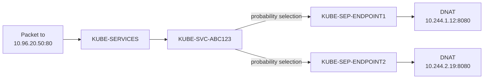

Illustrative rules might resemble:

```text
KUBE-SERVICES
  destination 10.96.20.50 tcp dpt:80
  jump KUBE-SVC-ABC123

KUBE-SVC-ABC123
  probability 0.5 jump KUBE-SEP-111
  jump KUBE-SEP-222

KUBE-SEP-111
  DNAT to 10.244.1.12:8080

KUBE-SEP-222
  DNAT to 10.244.2.19:8080
```

The exact chain names and implementation details are not part of the Service API contract.

iptables mode uses netfilter rules and DNAT to redirect traffic. Modern kube-proxy versions update only changed Services and EndpointSlices rather than rebuilding all rules for every small update. ([Kubernetes][7])

### Strengths

* Mature
* Widely deployed
* Uses standard Linux networking
* Easy to inspect with `iptables-save`

### Weaknesses

* Large rule sets can become expensive
* Sequential rule traversal
* Rule synchronization can be costly in very large clusters
* Debugging generated chains is verbose

## 9.2 nftables mode

nftables mode uses the newer Linux nftables subsystem.

Instead of representing everything as long linear chains, it can use:

* Sets
* Maps
* Concatenated keys
* More efficient rule updates

Conceptually:

```text
service_map[
  protocol,
  destination IP,
  destination port
] -> backend selection
```

nftables kube-proxy mode became stable in Kubernetes 1.33 and requires a sufficiently recent Linux kernel, documented as Linux 5.13 or newer. The current Kubernetes documentation positions it as a more scalable successor to older approaches. ([Kubernetes][7])

One operational difference is that nftables kube-proxy mode does not automatically open the NodePort range in a separate host firewall. Administrators must ensure that the required NodePort traffic is allowed. ([Kubernetes][7])

## 9.3 IPVS mode

IPVS models Services as kernel virtual servers.

Conceptually:

```text
Virtual server:
TCP 10.96.20.50:80

Real servers:
10.244.1.12:8080
10.244.2.19:8080
```

It supports scheduling algorithms such as:

* Round robin
* Least connection
* Source hashing

IPVS historically provided efficient lookup for large Service counts. However, Kubernetes deprecated IPVS mode in Kubernetes 1.35 because its model does not align cleanly with all Service API semantics, and nftables provides a better modernization path. ([Kubernetes][7])

## 9.4 eBPF kube-proxy replacement

eBPF is not a standard kube-proxy mode. Instead, some CNI implementations disable kube-proxy and implement Service handling themselves.

The path may look like:

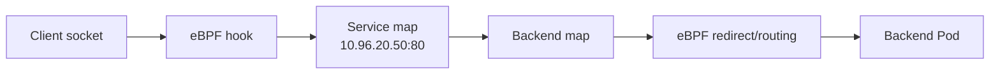

Possible advantages:

* Earlier packet or socket interception
* Efficient hash-map lookups
* Fewer iptables rules
* Integrated network policy and observability
* Direct Server Return or advanced load-balancing options

The exact behavior is implementation-specific.

---

# 10. Service types and their packet paths

## ClusterIP

The default Service type.

```text
Pod -> ClusterIP -> selected Pod endpoint
```

It is normally reachable only from within the cluster network.

## NodePort

NodePort adds a port on every eligible node.

Example:

```yaml
spec:
  type: NodePort
  ports:
    - port: 80
      targetPort: 8080
      nodePort: 32080
```

Traffic can arrive at:

```text
192.168.10.11:32080
192.168.10.12:32080
192.168.10.13:32080
```

The control plane allocates NodePorts from the configured range, which defaults to `30000-32767`. Every node programs forwarding from the NodePort to ready Service endpoints. ([Kubernetes][4])

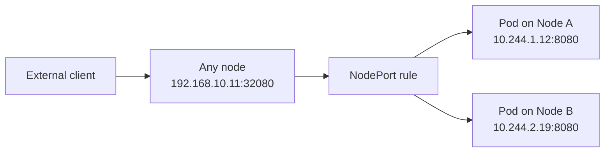

The selected endpoint does not have to be on the receiving node unless traffic policy restricts selection.

## LoadBalancer

A LoadBalancer Service usually involves the cloud controller manager.

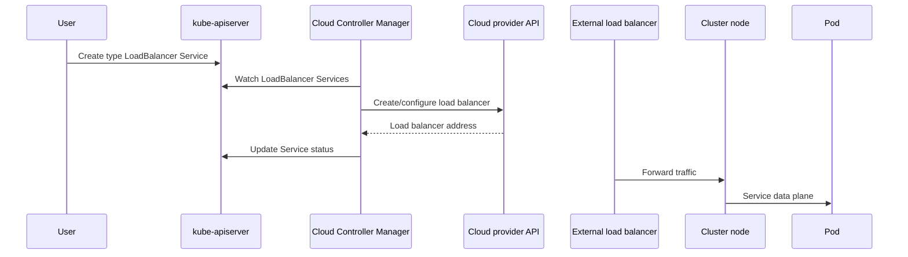

Traditionally, cloud load balancers send traffic to a NodePort, then kube-proxy forwards it to Pods:

```text
Client
  -> Cloud load balancer
  -> NodeIP:NodePort
  -> kube-proxy data plane
  -> Pod
```

Some load balancer implementations route directly to Pod IPs. In those cases, NodePort allocation can be disabled using `allocateLoadBalancerNodePorts: false`, where supported. Kubernetes also exposes `loadBalancerClass` and load-balancer IP mode information for provider-specific implementations. ([Kubernetes][4])

## ExternalName

An ExternalName Service does not create a packet-forwarding Service VIP. It creates a DNS alias.

```yaml
apiVersion: v1
kind: Service
metadata:
  name: database
spec:
  type: ExternalName
  externalName: database.example.internal
```

Conceptually:

```text
database.default.svc.cluster.local
       CNAME
database.example.internal
```

No kube-proxy load balancing is involved.

## Headless Service

A headless Service uses:

```yaml
spec:
  clusterIP: None
```

There is:

* No ClusterIP
* No kube-proxy Service load balancing
* No Service VIP DNAT

DNS returns backend addresses directly. ([Kubernetes][4])

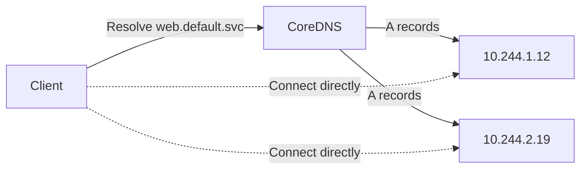

This is useful for:

* StatefulSets
* Databases
* Client-side load balancing
* Service discovery where individual Pod identity matters

---

# 11. External traffic and source IP preservation

External traffic introduces an additional routing problem.

Assume:

```text
External client: 203.0.113.50
Traffic enters Node A
Selected backend is on Node B
```

## `externalTrafficPolicy: Cluster`

The default behavior allows any node to forward to any endpoint.

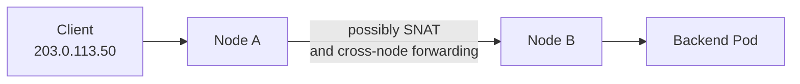

SNAT may be necessary because without it, the Pod could reply through a different path and bypass the node holding the NAT state.

Result:

* Better endpoint distribution
* Traffic can enter through any node
* Original client IP may not be visible to the Pod

## `externalTrafficPolicy: Local`

Only node-local endpoints are selected.

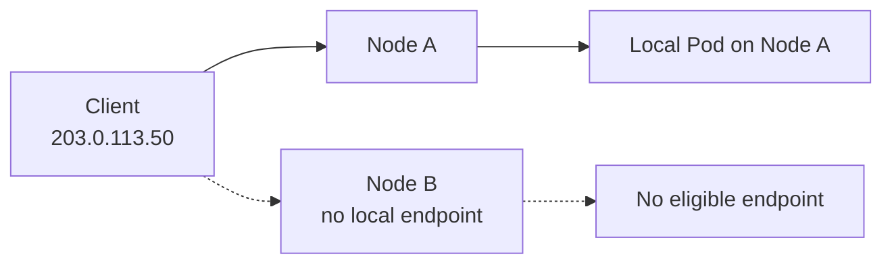

Benefits:

* Preserves source IP
* Avoids an additional node hop

Trade-offs:

* Traffic to a node without a local ready endpoint is dropped
* Load can become uneven across Pods
* External load balancer health checks must identify nodes with local endpoints

Kubernetes documents these source-IP and node-local-routing behaviors for NodePort and LoadBalancer Services. ([Kubernetes][9])

---

# 12. Internal traffic policy and topology preferences

## `internalTrafficPolicy: Cluster`

Any ready endpoint can be selected.

```text
Client Pod on Node A
  -> endpoint on A, B or C
```

## `internalTrafficPolicy: Local`

Only endpoints on the client’s node are eligible.

```text
Client Pod on Node A
  -> only endpoint on Node A
```

If there is no local endpoint, that Service behaves as if it has no endpoints on that node. ([Kubernetes][10])

This can reduce:

* Cross-node bandwidth
* Latency
* Zone transfer costs

But it can create:

* Uneven load
* Local availability failures
* Different behavior depending on where the client runs

## `trafficDistribution`

Traffic distribution preferences allow Kubernetes to prefer topologically close endpoints, such as endpoints in the same zone or on the same node. In Kubernetes 1.36, documented options include same-zone and same-node preferences. Hard traffic policies take precedence over softer distribution preferences. ([Kubernetes][4])

---

# 13. Readiness and endpoint removal

A Service selector does not simply mean “send traffic to every matching Pod.”

The simplified decision is closer to:

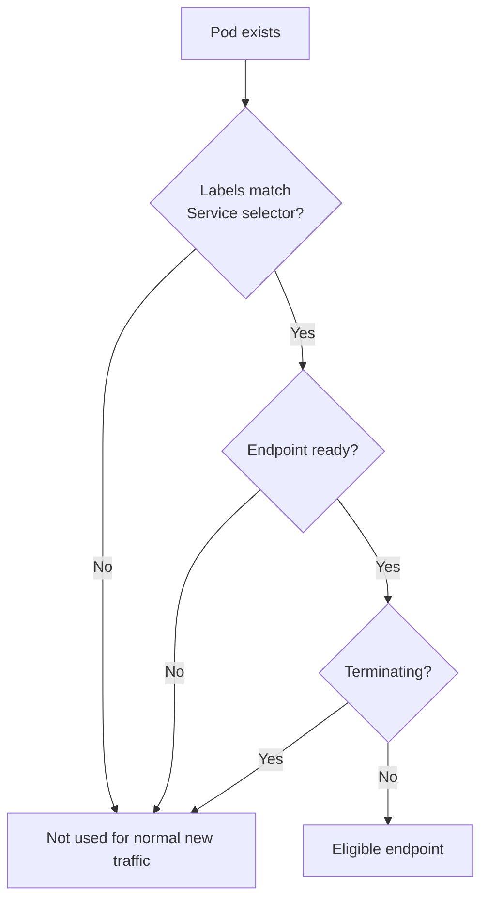

A readiness probe affects the Pod’s Ready condition. The EndpointSlice controller reflects the endpoint state into EndpointSlice conditions. kube-proxy or its replacement then updates node forwarding state.

There is propagation latency:

```text
Readiness changes
  -> kubelet updates Pod status
  -> API server stores it
  -> EndpointSlice controller reconciles
  -> EndpointSlice changes
  -> kube-proxy watch receives change
  -> node rules are synchronized
```

Therefore, endpoint removal is not mathematically instantaneous.

Existing connections may also remain alive because:

* Conntrack already associates them with a backend
* TCP connections are persistent
* Application or proxy connection pools remain open

Readiness primarily prevents **new connections** from being directed to an unready endpoint.

---

# 14. Services without selectors

A Service does not require a Pod selector.

For example:

```yaml
apiVersion: v1
kind: Service
metadata:
  name: legacy-database
spec:
  ports:
    - port: 5432
```

An operator or administrator can create EndpointSlices manually that point to external backends.

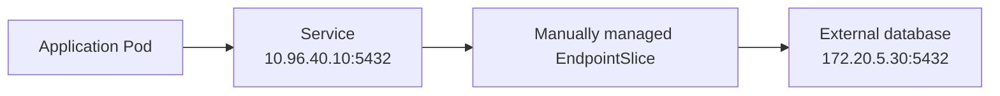

This allows applications to consume a stable Kubernetes Service name while the backend lives outside the cluster. Kubernetes does not automatically create EndpointSlices for selectorless Services; another controller or administrator must manage them. ([Kubernetes][4])

---

# 15. Host-level Linux packet path

A simplified Linux path for Pod-to-Service traffic is:

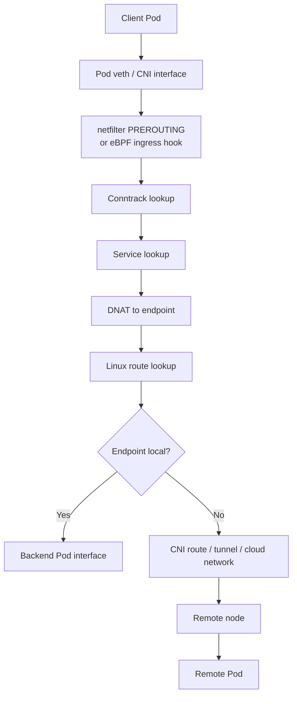

Important kernel subsystems include:

## Routing table

Used after DNAT to determine where the selected Pod IP lives.

Inspect with:

```bash
ip route
ip rule
```

## Netfilter

Provides hooks such as:

* `PREROUTING`
* `INPUT`
* `FORWARD`
* `OUTPUT`
* `POSTROUTING`

iptables and nftables configure rules attached to these hooks. Netfilter supports packet filtering, NAT and port translation. ([Netfilter][11])

## Conntrack

Tracks flows and NAT state.

Without conntrack, the return packet would not automatically be translated back so that the client sees the Service IP.

## Network namespaces

Each ordinary Pod has an isolated network namespace containing:

* Interfaces
* Routes
* Neighbor tables
* Socket namespace
* Network-related sysctls

Containers in the same Pod share this namespace.

## Veth pairs

A veth pair works like a virtual Ethernet cable:

```text
Pod eth0 <------> host-side veth
```

A packet entering one end exits the other.

## Tunnel interfaces

Overlay CNIs may create interfaces such as:

* VXLAN
* Geneve
* IP-in-IP
* WireGuard

## eBPF hooks and maps

An eBPF implementation may keep:

* Service-to-backend maps
* Connection affinity maps
* NAT maps
* Network policy maps
* Node and endpoint identity maps

---

# 16. Host configuration that commonly matters

The exact requirements depend on the CNI and kube-proxy mode.

## IP forwarding

For a node to route packets between Pod interfaces and other interfaces, IPv4 forwarding is commonly required:

```bash
sysctl net.ipv4.ip_forward
```

Typical desired value:

```text
net.ipv4.ip_forward = 1
```

This is commonly configured by the node image, bootstrap process or CNI.

## Bridge netfilter

Some bridge-based configurations require bridged packets to pass through netfilter:

```bash
sysctl net.bridge.bridge-nf-call-iptables
```

This is not universally required. Routed and eBPF-based CNIs may have different requirements.

## Reverse path filtering

Strict reverse-path filtering can reject traffic when Kubernetes uses asymmetric or policy-based routes.

Inspect with:

```bash
sysctl net.ipv4.conf.all.rp_filter
sysctl net.ipv4.conf.default.rp_filter
```

The correct setting is CNI-specific.

## MTU

Overlay encapsulation adds headers.

Example:

```text
Physical network MTU: 1500
VXLAN overhead: approximately 50 bytes
Pod MTU: commonly around 1450
```

An incorrect MTU can cause:

* Large requests to hang
* TLS failures
* Connections that work for small packets only
* Fragmentation or dropped packets

## Conntrack capacity

Large clusters can create substantial conntrack pressure.

Relevant indicators include:

```bash
sysctl net.netfilter.nf_conntrack_max
conntrack -S
```

A full conntrack table can cause:

* New connection failures
* Packet drops
* Intermittent Service failures

## Host firewalls

The node firewall must allow the traffic required by the installation, potentially including:

* Pod CIDRs
* Overlay UDP ports
* NodePorts
* Load balancer health checks
* BGP sessions
* API server access
* DNS traffic

The precise ports depend on the CNI and environment.

---

# 17. Service IP and NodePort allocation

The API server allocates ClusterIPs from the Service CIDR.

Example:

```text
Service CIDR: 10.96.0.0/12
```

Possible Service addresses:

```text
10.96.0.1
10.96.20.50
10.100.8.10
```

The Service CIDR must not overlap:

* Pod CIDRs
* Node networks
* Routable infrastructure networks

Otherwise, a destination might ambiguously refer to either a real network destination or a Service VIP.

NodePorts are allocated from a separate configured range:

```text
30000-32767 by default
```

That range should also be planned against:

* Host ephemeral ports
* Firewalls
* Cloud security groups
* Existing node applications

---

# 18. DNS does not carry application traffic

CoreDNS resolves names, but it does not generally proxy the subsequent application connection.

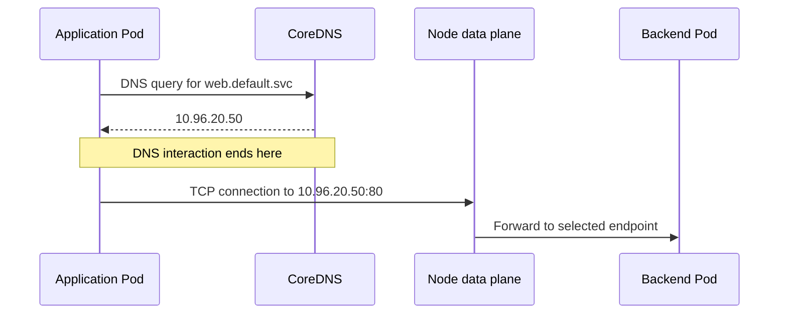

Therefore:

```text
DNS works
```

does not prove:

```text
Service forwarding works
```

And:

```text
Service ClusterIP works
```

does not prove:

```text
DNS works
```

They should be tested separately.

---

# 19. What happens when the control plane is unavailable

Once node-level networking state has been programmed, existing Service forwarding generally does not require a synchronous API-server call for every packet.

Therefore, as a practical consequence:

* Existing Services may continue working.
* Existing EndpointSlice-derived rules may continue working.
* Existing connections continue using conntrack state.
* New Services cannot be distributed to nodes.
* Endpoint changes cannot be reflected.
* Failed or newly ready Pods may not be added or removed promptly.
* Nodes can continue using increasingly stale state.

This follows from kube-proxy’s watch-and-synchronize architecture: it observes Service and EndpointSlice state and compiles it into persistent kernel forwarding configuration. ([Kubernetes][7])

This is an important SRE distinction:

> **Control-plane availability controls freshness of network configuration. Kernel data-plane availability controls packet forwarding.**

---

# 20. Debugging a Service from top to bottom

Use a layered approach.

## Layer 1: Is the Service correct?

```bash
kubectl get service web -o yaml
```

Check:

* `clusterIP`
* `ports`
* `targetPort`
* `selector`
* `type`
* `internalTrafficPolicy`
* `externalTrafficPolicy`

## Layer 2: Does the selector match Pods?

```bash
kubectl get pods -l app=web -o wide
```

Look for:

* Expected Pod count
* Correct labels
* Pod IPs
* Node placement
* Ready state

A common failure is:

```text
Service selector:
app: web

Pod label:
app: web-server
```

## Layer 3: Are EndpointSlices populated?

```bash
kubectl get endpointslice \
  -l kubernetes.io/service-name=web \
  -o yaml
```

Check:

* Endpoint addresses
* Ports
* `ready`
* `serving`
* `terminating`
* `nodeName`
* `zone`

A Service with no eligible endpoints cannot forward traffic.

## Layer 4: Can the client resolve DNS?

```bash
kubectl exec <client-pod> -- \
  getent hosts web.default.svc.cluster.local
```

Inspect Pod DNS configuration:

```bash
kubectl exec <client-pod> -- cat /etc/resolv.conf
```

## Layer 5: Can the client reach the ClusterIP?

```bash
kubectl exec <client-pod> -- \
  curl -v http://10.96.20.50:80
```

Then test the DNS name:

```bash
kubectl exec <client-pod> -- \
  curl -v http://web.default.svc.cluster.local
```

Interpretation:

| Direct ClusterIP | DNS name                          | Likely issue                  |
| ---------------- | --------------------------------- | ----------------------------- |
| Works            | Fails                             | DNS                           |
| Fails            | Resolves correctly                | Service data plane or backend |
| Both fail        | No resolution                     | DNS, plus possibly Service    |
| Both work        | Application-level issue elsewhere |                               |

## Layer 6: Can the backend Pod be reached directly?

```bash
kubectl exec <client-pod> -- \
  curl -v http://10.244.2.19:8080
```

If direct Pod access fails, investigate CNI routing or network policy before kube-proxy.

## Layer 7: Inspect kube-proxy mode

Depending on installation, kube-proxy exposes its mode locally:

```bash
curl -s http://127.0.0.1:10249/proxyMode
```

Possible output:

```text
iptables
nftables
ipvs
```

## Layer 8: Inspect node forwarding state

For iptables:

```bash
iptables-save -t nat | grep 10.96.20.50
iptables-save -t nat | grep KUBE-SERVICES
```

For nftables:

```bash
nft list ruleset
```

For IPVS:

```bash
ipvsadm -Ln
```

For eBPF implementations, use the CNI’s own CLI because the state may exist in eBPF maps rather than iptables.

## Layer 9: Inspect routes and interfaces

```bash
ip address
ip link
ip route
ip rule
```

Look for:

* Route to the backend Pod CIDR
* Tunnel interface
* CNI bridge
* Pod veth
* Policy routing rules

## Layer 10: Inspect conntrack

```bash
conntrack -L | grep 10.96.20.50
```

This can reveal the original and translated flow.

## Layer 11: Capture packets

On the client Pod:

```bash
tcpdump -ni any host 10.96.20.50
```

On the source node:

```bash
tcpdump -ni any \
  'host 10.96.20.50 or host 10.244.2.19'
```

On the destination node:

```bash
tcpdump -ni any host 10.244.2.19
```

A useful packet-capture sequence is:

```text
1. Did the packet leave the client Pod?
2. Did it enter the source node?
3. Was the destination translated?
4. Did it leave through the correct route or tunnel?
5. Did it arrive at the destination node?
6. Did it reach the backend Pod?
7. Did the reply return?
8. Was reverse NAT applied?
```

---

# 21. Common failure scenarios

## Service has no endpoints

Symptoms:

```text
Connection refused, timeout or immediate rejection
```

Check:

* Selector mismatch
* Pods not Ready
* Wrong namespace
* EndpointSlice conditions
* Incorrect target port

## Pod IP works, ClusterIP fails

Likely areas:

* kube-proxy not running
* kube-proxy watch failure
* Missing iptables/nftables/IPVS state
* eBPF Service map problem
* Service CIDR conflict
* Host firewall interference

## Same-node traffic works, cross-node traffic fails

Likely areas:

* Missing remote Pod CIDR route
* Overlay tunnel blocked
* Incorrect MTU
* Cloud route missing
* BGP route not advertised
* Reverse-path filtering
* Network policy

## ClusterIP works from Pods but not from nodes

Possible causes:

* kube-proxy did not program the host `OUTPUT` path
* eBPF implementation handles Pod sockets differently from host sockets
* Host routing or firewall rules
* Service CIDR route conflict

## NodePort works on some node addresses only

Check:

* kube-proxy `nodePortAddresses`
* Host firewall
* Cloud firewall/security group
* `externalTrafficPolicy: Local`
* Whether the node has a local endpoint
* nftables NodePort firewall requirements

## Intermittent long-lived failures after a deployment

Possible causes:

* Old persistent connections
* Conntrack state
* gRPC channel reuse
* HTTP keep-alive
* Endpoint removal propagation delay
* Application not handling connection draining

---

# 22. Complete end-to-end model

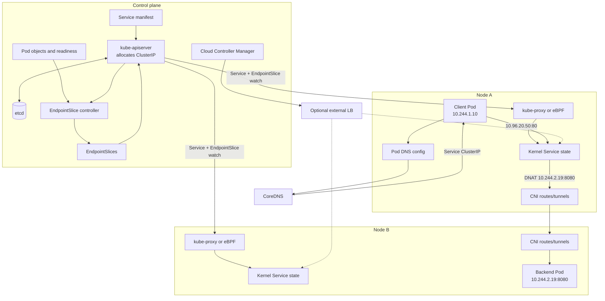

---

# 23. Final mental model

Remember the Service path as five steps:

```text
Name
  -> VIP
  -> Endpoint
  -> Route
  -> Pod
```

More precisely:

```text
CoreDNS
  resolves Service name to ClusterIP

EndpointSlice controller
  converts Service selector + Pod state into endpoints

kube-proxy or eBPF
  converts ClusterIP + endpoints into node forwarding state

Linux kernel
  selects an endpoint, performs NAT and tracks the connection

CNI
  routes the translated packet to the selected Pod
```

Or as a single sentence:

> **The control plane publishes intent, kube-proxy compiles that intent into kernel state, and the CNI delivers the translated packet to the Pod.**

The most important diagnostic boundary is:

```text
Service IP -> Pod IP       kube-proxy or Service data plane
Pod IP -> actual Pod       CNI and node routing
Service name -> Service IP CoreDNS
External IP -> cluster     cloud load balancer and NodePort/direct routing
```

[1]: https://kubernetes.io/docs/concepts/cluster-administration/networking/ "Cluster Networking | Kubernetes"
[2]: https://kubernetes.io/docs/concepts/services-networking/?utm_source=chatgpt.com "Services, Load Balancing, and Networking"
[3]: https://kubernetes.io/docs/concepts/extend-kubernetes/compute-storage-net/network-plugins/ "Network Plugins | Kubernetes"
[4]: https://kubernetes.io/docs/concepts/services-networking/service/ "Service | Kubernetes"
[5]: https://kubernetes.io/docs/concepts/services-networking/cluster-ip-allocation/ "Service ClusterIP allocation | Kubernetes"
[6]: https://kubernetes.io/docs/concepts/services-networking/endpoint-slices/ "EndpointSlices | Kubernetes"
[7]: https://kubernetes.io/docs/reference/networking/virtual-ips/ "Virtual IPs and Service Proxies | Kubernetes"
[8]: https://kubernetes.io/docs/concepts/services-networking/dns-pod-service/ "DNS for Services and Pods | Kubernetes"
[9]: https://kubernetes.io/docs/tutorials/services/source-ip/ "Using Source IP | Kubernetes"
[10]: https://kubernetes.io/docs/concepts/services-networking/service-traffic-policy/ "Service Internal Traffic Policy | Kubernetes"
[11]: https://www.netfilter.org/?utm_source=chatgpt.com "netfilter/iptables project homepage - The netfilter.org project"
