# Kubernetes Storage: end-to-end architecture

The current Kubernetes storage documentation covers volumes, PersistentVolumes, StorageClasses, ephemeral storage, projected volumes, CSI drivers, snapshots, cloning, capacity tracking, expansion, health monitoring, and related APIs. The live documentation is currently for Kubernetes v1.36. ([Kubernetes][1])

The most important mental model is:

> **Kubernetes does not normally store application data. Kubernetes stores storage intent and metadata, then coordinates a storage system, CSI driver, node, filesystem, and container runtime so that the application sees a usable path or block device.**

---

## 1. The high-level storage model

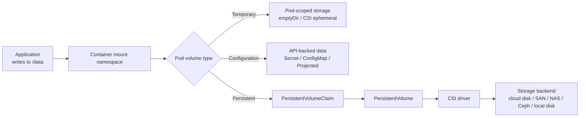

A container does not mount a `PersistentVolume` directly. The path is normally:

```text
Container
  → volumeMount
  → Pod volume
  → PersistentVolumeClaim
  → PersistentVolume
  → CSI driver
  → actual storage system
```

Kubernetes volumes are directories or block devices made available to containers. The Pod declares the volume under `.spec.volumes`, and each container chooses where to expose it through `.spec.containers[*].volumeMounts` or `volumeDevices`. ([Kubernetes][2])

---

# 2. Three different storage lifetimes

Understanding storage lifetime prevents most Kubernetes storage mistakes.

## 2.1 Container writable layer

Each container has a writable filesystem layer.

```text
Container image
├── Read-only image layers
└── Writable container layer
```

It is suitable for:

* Temporary process files
* Package-manager scratch space
* Files that can disappear
* Application binaries generated during startup

It is not suitable for:

* Databases
* User uploads
* Important logs
* Data shared between containers
* Anything that must survive container recreation

When the container is recreated, its writable layer is recreated.

---

## 2.2 Pod-scoped storage

Storage such as `emptyDir` follows the lifetime of the Pod.

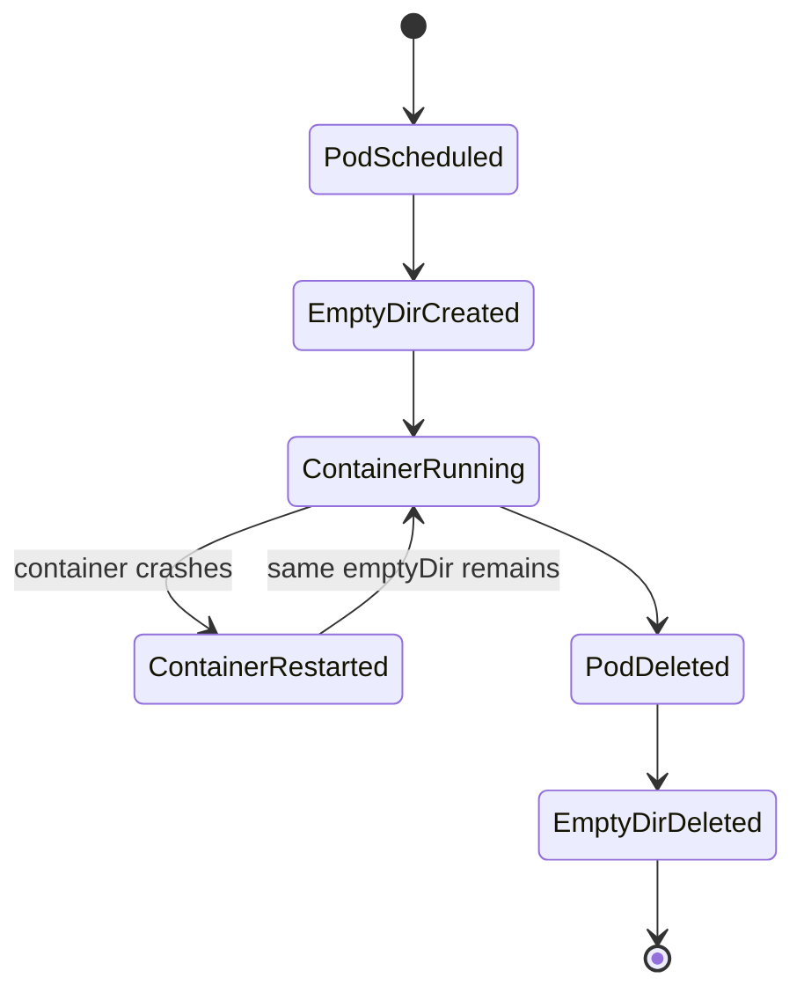

An `emptyDir` is created after the Pod is assigned to a node. All containers in that Pod can share it. Container crashes do not delete it, but removing the Pod from the node does. Disk-backed `emptyDir` normally uses node storage; `medium: Memory` uses `tmpfs`. ([Kubernetes][2])

---

## 2.3 Cluster-scoped persistent storage

A PV has a lifecycle independent of a specific Pod.

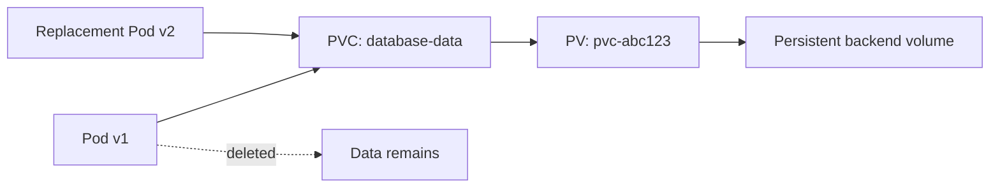

The Pod may be:

* Restarted
* Rescheduled
* Recreated by a Deployment
* Replaced during a StatefulSet rollout

The PVC and underlying storage can remain.

A `PersistentVolume` is a cluster resource representing storage. A `PersistentVolumeClaim` is a namespaced request for storage capacity, access mode, and other properties. A `StorageClass` describes the storage service or tier used to satisfy that request. ([Kubernetes][3])

---

# 3. Important Kubernetes storage objects

| Object                  |             Scope | Purpose                                   |
| ----------------------- | ----------------: | ----------------------------------------- |
| Pod volume              |               Pod | Connects a volume source to containers    |
| `PersistentVolumeClaim` |         Namespace | Application’s storage request             |
| `PersistentVolume`      |           Cluster | Concrete storage resource                 |
| `StorageClass`          |           Cluster | Provisioning policy and storage tier      |
| `VolumeAttachment`      |           Cluster | Intent to attach a volume to a node       |
| `CSIDriver`             |           Cluster | Declares CSI driver capabilities          |
| `CSINode`               |      Cluster/node | Describes CSI drivers available on a node |
| `CSIStorageCapacity`    | Topology-specific | Advertises provisionable capacity         |
| `VolumeSnapshot`        |         Namespace | User-facing snapshot request              |
| `VolumeSnapshotContent` |           Cluster | Concrete backend snapshot                 |
| `VolumeSnapshotClass`   |           Cluster | Snapshot policy                           |
| `VolumeAttributesClass` |           Cluster | Mutable driver-specific volume attributes |

`VolumeAttachment` captures the desired attachment or detachment of a volume to a particular node. `CSIDriver` allows a driver to declare capabilities such as whether attachment is required, whether persistent and ephemeral volumes are supported, and how filesystem ownership should be handled. ([Kubernetes][4])

---

# 4. PersistentVolume and PersistentVolumeClaim binding

Consider this PVC:

```yaml
apiVersion: v1
kind: PersistentVolumeClaim
metadata:
  name: database-data
spec:
  storageClassName: fast-rwo
  accessModes:
    - ReadWriteOnce
  volumeMode: Filesystem
  resources:
    requests:
      storage: 100Gi
```

The PVC says:

```text
I need:
- 100 GiB
- from storage class fast-rwo
- mounted as a filesystem
- writable from one node at a time
```

It does not say:

```text
Use cloud disk vol-12345.
```

That mapping is decided through PV binding and provisioning.

## Binding requirements

For a PVC and PV to bind, Kubernetes considers properties such as:

* StorageClass
* Requested capacity
* Access modes
* Volume mode
* Label selector, when specified
* Node and topology constraints

Binding is one-to-one:

```text
One PVC ↔ One PV
```

Multiple Pods can mount the same PVC when the access mode and storage system allow it.

The persistent-volume binder is a reconciliation loop that continuously looks for compatible PVs and PVCs. Once bound, the relationship is exclusive. ([Kubernetes][3])

---

# 5. Static versus dynamic provisioning

## 5.1 Static provisioning

An administrator creates the storage and PV before an application requests it.

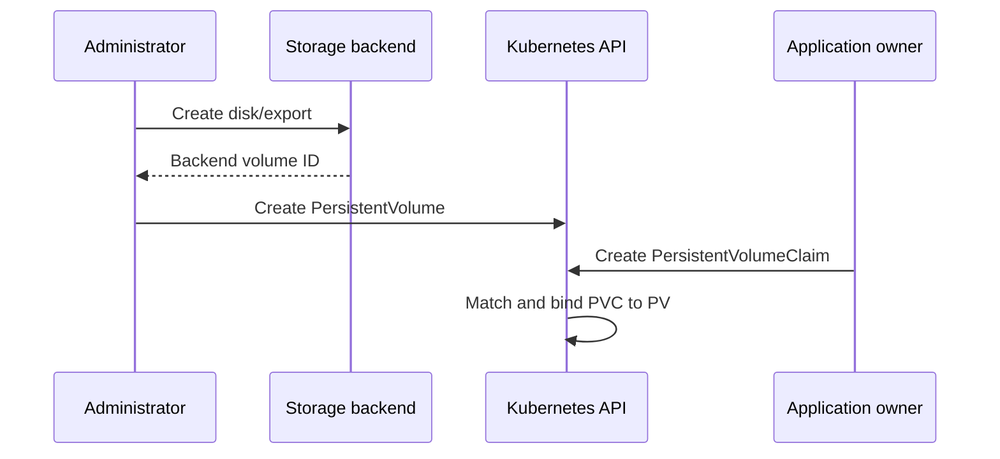

Static provisioning is useful for:

* Existing storage
* Pre-populated datasets
* Local disks
* Storage requiring manual approval
* Migration of an existing database
* Carefully controlled production volumes

---

## 5.2 Dynamic provisioning

A CSI provisioner creates storage after the PVC appears.

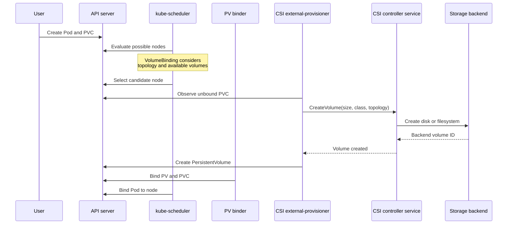

The external CSI provisioner watches PVCs, calls the driver’s `CreateVolume` operation, and creates a PV representing the resulting backend volume. With a `Delete` reclaim policy, it can call `DeleteVolume` when the PV is released. ([kubernetes-csi.github.io][5])

---

# 6. StorageClass: the storage policy

A StorageClass describes how new storage should be provisioned.

```yaml
apiVersion: storage.k8s.io/v1
kind: StorageClass
metadata:
  name: fast-rwo

# Replace this with the name of the installed CSI driver.
provisioner: csi.example.com

parameters:
  tier: fast
  encrypted: "true"

reclaimPolicy: Retain
allowVolumeExpansion: true
volumeBindingMode: WaitForFirstConsumer
```

A StorageClass normally controls:

* CSI provisioner
* Backend parameters
* Reclaim policy
* Volume binding timing
* Expansion support
* Mount options
* Allowed topology
* Sometimes encryption or performance tier

Kubernetes does not interpret most values under `parameters`; it passes them to the provisioner.

StorageClasses can specify `Delete` or `Retain` as the reclaim policy. `Delete` is the default when it is unspecified. They can also enable volume expansion. Expansion grows a volume; shrinking a PVC is not supported. Mount options are passed through without Kubernetes validating whether the backend supports them. ([Kubernetes][6])

---

# 7. Immediate versus WaitForFirstConsumer

This is one of the most important Kubernetes storage scheduling concepts.

## 7.1 `Immediate`

```yaml
volumeBindingMode: Immediate
```

The volume is provisioned as soon as the PVC appears.

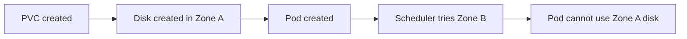

This can cause problems with topology-constrained storage such as:

* Zonal cloud disks
* Local disks
* Rack-specific SAN storage
* Topology-aware CSI drivers

---

## 7.2 `WaitForFirstConsumer`

```yaml
volumeBindingMode: WaitForFirstConsumer
```

Kubernetes waits until a Pod needs the PVC.

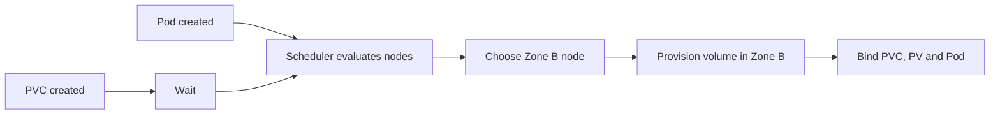

The scheduler can consider:

* Pod node selectors
* Node affinity
* Pod affinity and anti-affinity
* Storage topology
* Existing PV topology
* CSI capacity
* Node volume limits

The scheduler’s `VolumeBinding` plugin checks whether requested volumes are already available or can be bound for a candidate node. `NodeVolumeLimits` checks attachable-volume limits. ([Kubernetes][7])

`WaitForFirstConsumer` is generally the safer choice for topology-constrained storage. The documentation specifically warns that `Immediate` can provision a volume in a topology that cannot satisfy the Pod. Local volumes should use `WaitForFirstConsumer`. Also, setting `spec.nodeName` bypasses normal scheduling and can prevent this workflow; use a node selector or affinity instead. ([Kubernetes][6])

---

# 8. Complete attach and mount workflow

After scheduling and provisioning, Kubernetes still has to attach and mount the storage.

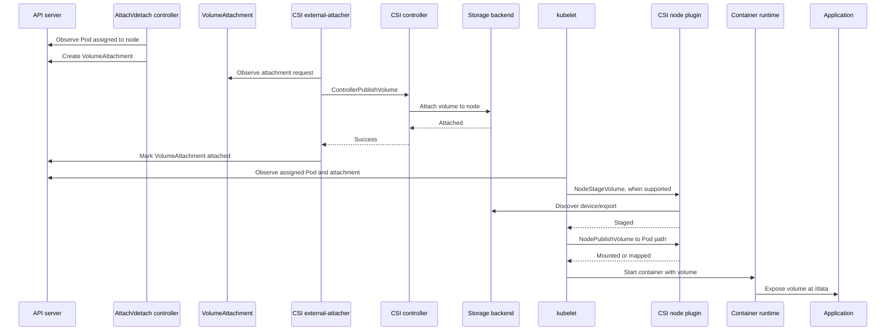

## Step-by-step

### Step 1: Pod scheduling

The scheduler chooses a node that can satisfy:

* CPU and memory
* Pod affinity rules
* PV node affinity
* Storage topology
* CSI driver availability
* Attach-volume limits

A PV can contain node affinity that restricts which nodes can access it. This is mandatory for local volumes and can also represent backend topology. ([Kubernetes][3])

### Step 2: Attachment intent

For storage requiring attachment, Kubernetes creates a `VolumeAttachment`.

Examples include many:

* Cloud block disks
* SAN LUNs
* iSCSI-style devices
* CSI-managed block devices

The external-attacher watches `VolumeAttachment` resources and calls the CSI controller’s `ControllerPublishVolume` or `ControllerUnpublishVolume`. ([kubernetes-csi.github.io][8])

Some shared filesystems do not need a separate attach operation. A CSI driver communicates this through `CSIDriver.spec.attachRequired`.

### Step 3: Backend attachment

The CSI controller may ask the backend to:

* Map a disk to a VM
* Grant a node access to a LUN
* Generate connection information
* Configure an export
* Attach a cloud volume

### Step 4: Node staging

The kubelet invokes the node-local CSI plugin.

A CSI driver may implement:

```text
NodeStageVolume
```

This usually performs node-wide preparation, such as:

* Discovering the block device
* Waiting for device appearance
* Formatting an unformatted device
* Mounting it into a staging directory
* Preparing encryption
* Connecting to a network-storage endpoint

Staging is optional in the CSI specification, so the exact flow depends on the driver.

### Step 5: Publishing to the Pod

The kubelet invokes:

```text
NodePublishVolume
```

The driver makes the volume available at the Pod-specific target path. This may involve:

* A bind mount
* A filesystem mount
* A block-device mapping
* A FUSE mount
* A network filesystem mount

### Step 6: Container mount namespace

The container runtime starts the container and exposes the kubelet’s Pod volume path at the requested location:

```yaml
volumeMounts:
  - name: data
    mountPath: /var/lib/postgresql/data
```

Inside the container, the application sees only:

```text
/var/lib/postgresql/data
```

It normally does not know whether the underlying storage is:

* Local NVMe
* Cloud block storage
* NFS
* Ceph RBD
* CephFS
* SAN
* A CSI-managed filesystem

---

# 9. CSI architecture

A typical CSI deployment has two parts:

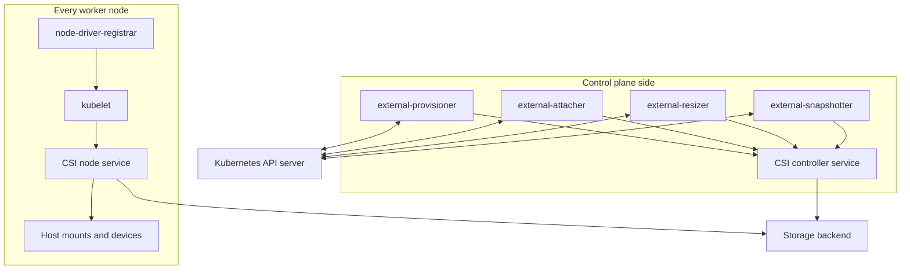

## CSI controller component

Usually deployed as a Deployment or StatefulSet.

It can contain:

* CSI driver controller service
* `external-provisioner`
* `external-attacher`
* `external-resizer`
* `external-snapshotter`
* Liveness sidecar

These sidecars watch Kubernetes API resources and translate changes into CSI RPC calls. They then update Kubernetes objects with the results. ([kubernetes-csi.github.io][9])

For high availability, multiple controller replicas can run with leader election, although the exact pattern depends on the driver.

## CSI node component

Usually deployed as a privileged DaemonSet on every eligible storage node.

It contains:

* CSI node service
* `node-driver-registrar`
* Often a liveness sidecar

The kubelet communicates with the node service over a Unix-domain socket shared through the host filesystem. The node plugin performs mount and unmount operations. ([kubernetes-csi.github.io][10])

---

# 10. Host-level filesystem and mount configuration

A typical Linux node has the following logical structure:

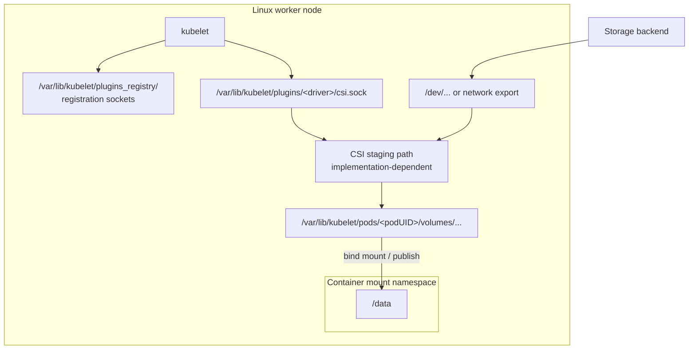

Important host paths commonly include:

```text
/var/lib/kubelet/plugins_registry/
/var/lib/kubelet/plugins/<driver-name>/
/var/lib/kubelet/pods/<pod-uid>/volumes/
```

The exact staging and plugin subdirectories are internal implementation details and can vary by driver and Kubernetes version.

The standard CSI deployment pattern mounts `/var/lib/kubelet/pods` into the node-driver container with bidirectional mount propagation. The driver socket is generally under `/var/lib/kubelet/plugins/<driver-name>`, and registration occurs through `/var/lib/kubelet/plugins_registry`. ([kubernetes-csi.github.io][10])

## Why bidirectional mount propagation is required

The CSI node driver runs in a container, but it performs a mount that must become visible on the host.

Without bidirectional mount propagation:

```text
CSI container sees mount
Host does not see mount
Kubelet cannot publish it to the application container
```

With bidirectional propagation:

```text
CSI container mount namespace
          ⇅
Host mount namespace
          ⇅
Pod container mount namespace
```

A typical node-plugin DaemonSet contains host mounts resembling:

```yaml
volumeMounts:
  - name: kubelet-dir
    mountPath: /var/lib/kubelet
    mountPropagation: Bidirectional

  - name: plugin-dir
    mountPath: /csi

volumes:
  - name: kubelet-dir
    hostPath:
      path: /var/lib/kubelet
      type: Directory

  - name: plugin-dir
    hostPath:
      path: /var/lib/kubelet/plugins/example.csi.io
      type: DirectoryOrCreate
```

CSI node plugins normally require significant host access because they may need to:

* Perform `mount` and `umount`
* Discover devices
* Access `/dev`
* Create filesystem mounts
* Run filesystem tools
* Configure network-storage sessions
* Propagate mounts to the host

---

# 11. What runs in the control plane?

The Kubernetes controller manager in v1.36 includes several storage-related controllers, including:

* Persistent-volume binder
* Persistent-volume attach/detach controller
* Persistent-volume expander
* PV protection controller
* PVC protection controller
* Ephemeral-volume controller
* VolumeAttributesClass protection controller

The CSI sidecars usually run outside `kube-controller-manager`, although they participate in the same reconciliation model. ([Kubernetes][11])

## Control-plane responsibility map

| Component                | Watches                   | Main responsibility                                                               |
| ------------------------ | ------------------------- | --------------------------------------------------------------------------------- |
| API server               | API requests              | Validates and stores desired state                                                |
| etcd                     | Kubernetes objects        | Persists PVC, PV, Pod, StorageClass and attachment metadata—not application bytes |
| PV binder                | PVs and PVCs              | Matches and binds claims                                                          |
| Scheduler                | Pods, PVCs, PVs, Nodes    | Selects a storage-compatible node                                                 |
| Attach/detach controller | Pods, Nodes, PVs          | Reconciles desired volume attachment                                              |
| CSI provisioner          | PVCs, PVs, StorageClasses | Calls `CreateVolume` and `DeleteVolume`                                           |
| CSI attacher             | VolumeAttachments         | Calls controller attach/detach RPCs                                               |
| CSI resizer              | PVCs and PVs              | Requests backend expansion                                                        |
| Snapshot controller      | Snapshot objects          | Binds snapshot requests and contents                                              |
| CSI snapshotter          | Snapshot objects          | Calls backend snapshot APIs                                                       |
| Kubelet                  | Assigned Pods             | Performs node-level stage, publish and unpublish                                  |
| CSI node plugin          | Kubelet RPCs              | Mounts, maps and unmounts storage                                                 |

The API server is the interface through which components observe and update cluster state. Controllers continuously compare desired and actual state and request changes to close the gap. ([Kubernetes][12])

---

# 12. Kubernetes storage types and when to use them

## 12.1 Container writable layer

**Lifetime:** Container
**Location:** Container runtime storage
**Persistent:** No

Use it for:

* Temporary process state
* Downloads that can be recreated
* Intermediate startup files

Avoid it for all important data.

---

## 12.2 `emptyDir`

```yaml
apiVersion: v1
kind: Pod
metadata:
  name: shared-workspace
spec:
  containers:
    - name: producer
      image: busybox:1.36
      command:
        - sh
        - -c
        - |
          while true; do
            date >> /work/events.log
            sleep 5
          done
      volumeMounts:
        - name: work
          mountPath: /work

    - name: consumer
      image: busybox:1.36
      command:
        - sh
        - -c
        - tail -f /work/events.log
      volumeMounts:
        - name: work
          mountPath: /work

  volumes:
    - name: work
      emptyDir:
        sizeLimit: 2Gi
```

**Lifetime:** Pod
**Location:** Node disk by default
**Shared:** Between containers in the same Pod

Use it for:

* Scratch space
* Sidecar communication
* Temporary caches
* Sorting and transformation work
* Downloading artifacts before processing
* Temporary web-server files

Do not use it for data that must survive Pod deletion.

### Memory-backed `emptyDir`

```yaml
volumes:
  - name: temporary-memory
    emptyDir:
      medium: Memory
      sizeLimit: 512Mi
```

Use it for:

* Very fast temporary files
* Sensitive temporary data where avoiding disk is useful
* Small compiler or processing workspaces

Memory-backed `emptyDir` uses `tmpfs`. Its usage is accounted as container memory rather than local ephemeral-storage usage. ([Kubernetes][2])

---

## 12.3 ConfigMap, Secret, Downward API and projected volumes

These volumes expose Kubernetes API data as files.

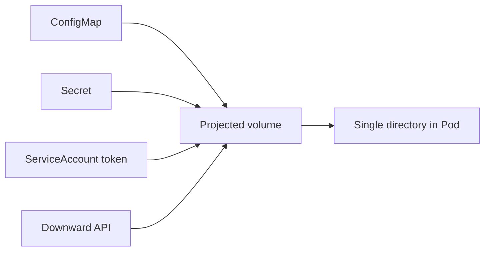

A projected volume can combine:

* ConfigMap
* Secret
* Downward API
* ServiceAccount token
* Cluster trust bundles
* Pod certificates

into one directory. Sources must belong to the same namespace as the Pod. ([Kubernetes][13])

Example:

```yaml
volumes:
  - name: application-identity
    projected:
      sources:
        - configMap:
            name: application-config
        - secret:
            name: database-credentials
        - serviceAccountToken:
            path: token
            expirationSeconds: 3600
            audience: internal-api
```

Use projected volumes for:

* Configuration
* Credentials
* CA certificates
* Workload identity tokens
* Pod metadata

Do not use them as a general application database or writable filesystem.

Secret volumes are read-only and stored using `tmpfs` on the node. ([Kubernetes][2])

---

## 12.4 `hostPath`

A `hostPath` mounts a path from the Kubernetes node directly into a Pod.

```yaml
volumes:
  - name: host-logs
    hostPath:
      path: /var/log
      type: Directory
```

Use it for:

* Node monitoring agents
* Log collectors
* Device plugins
* CSI and CNI infrastructure
* Accessing a known host socket
* Kubernetes system components

Avoid it for normal application persistence because:

* Data is tied to one node
* Different nodes can contain different data
* It exposes the host filesystem
* A privileged workload could modify critical host files
* Kubernetes does not provide normal PV lifecycle management

Treat `hostPath` as a host-integration mechanism, not a general storage service. Kubernetes supports type checks such as `Directory`, `DirectoryOrCreate`, `File`, `Socket`, `BlockDevice`, and `CharDevice`. ([Kubernetes][2])

---

## 12.5 Local PersistentVolume

A local PV represents a disk, partition, or directory physically attached to a node.

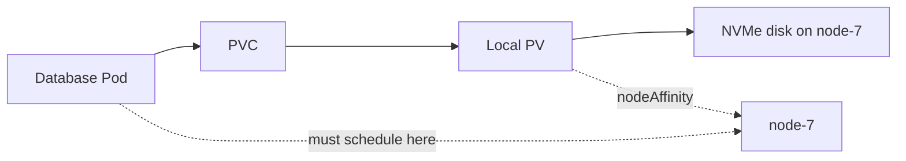

Example StorageClass:

```yaml
apiVersion: storage.k8s.io/v1
kind: StorageClass
metadata:
  name: local-nvme
provisioner: kubernetes.io/no-provisioner
volumeBindingMode: WaitForFirstConsumer
reclaimPolicy: Retain
```

Example PV:

```yaml
apiVersion: v1
kind: PersistentVolume
metadata:
  name: local-nvme-node-7
spec:
  capacity:
    storage: 500Gi

  volumeMode: Filesystem

  accessModes:
    - ReadWriteOnce

  persistentVolumeReclaimPolicy: Retain
  storageClassName: local-nvme

  local:
    path: /mnt/nvme/database

  nodeAffinity:
    required:
      nodeSelectorTerms:
        - matchExpressions:
            - key: kubernetes.io/hostname
              operator: In
              values:
                - node-7
```

Use local PVs for:

* High-performance databases
* Distributed databases that already replicate data
* Large temporary processing datasets
* Low-latency workloads
* Applications explicitly designed for node failure

Important limitations:

* The Pod is tied to the node containing the disk
* Node failure can make the volume unavailable
* Native local volumes use static provisioning
* Cleanup is normally manual unless an external local-volume manager is installed
* The application should usually provide replication

Local volumes require PV node affinity, and Kubernetes recommends `WaitForFirstConsumer` so that storage and compute scheduling happen together. ([Kubernetes][2])

---

## 12.6 Network block storage through CSI

Examples conceptually include cloud disks, SAN LUNs, and Ceph RBD.


Common characteristics:

* Usually `ReadWriteOnce`
* Often needs attach and detach operations
* Appears as a device on the selected node
* Usually formatted as ext4, XFS, or another filesystem
* Suitable for low-latency persistent applications

Use it for:

* PostgreSQL
* MySQL
* Kafka volumes
* Stateful application data
* Single-writer application storage
* StatefulSets

Prefer `ReadWriteOncePod` when the driver supports it and exactly one Pod must have write access.

---

## 12.7 Shared network filesystem

Examples conceptually include:

* NFS
* CephFS
* Managed cloud file services
* Distributed POSIX filesystems

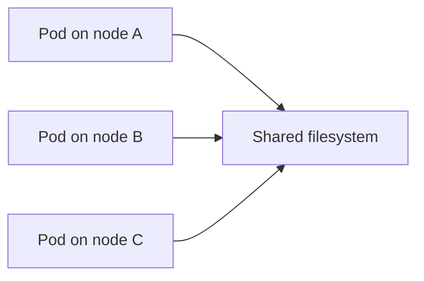

Use shared filesystems for:

* Content shared by many Pods
* CI build artifacts
* Shared model repositories
* Legacy applications expecting shared files
* Read-write-many workloads
* Shared home directories

Consider the trade-offs:

* Network latency
* Metadata-operation performance
* Locking behaviour
* Availability of the file service
* Many-small-files performance
* Cost

An NFS volume can be mounted by multiple writers, and its contents persist independently of an individual Pod. The NFS server or share must already exist unless a provisioner manages it. ([Kubernetes][2])

---

## 12.8 CSI ephemeral volumes

A CSI driver can expose storage directly in a Pod specification, with the volume following the Pod lifetime.

```yaml
volumes:
  - name: special-storage
    csi:
      driver: example.csi.io
      volumeAttributes:
        profile: temporary
```

Use CSI ephemeral volumes for driver-managed, Pod-scoped resources such as:

* Temporary encrypted workspaces
* Special filesystems
* Driver-generated credentials
* Hardware or device-backed temporary storage
* Runtime-specific data mounts

CSI ephemeral volumes are created after scheduling on the selected node. They do not use a normal PV/PVC binding workflow. ([Kubernetes][14])

---

## 12.9 Generic ephemeral volumes

Generic ephemeral volumes use a PVC template inline in the Pod.

```yaml
volumes:
  - name: scratch
    ephemeral:
      volumeClaimTemplate:
        spec:
          storageClassName: fast-scratch
          accessModes:
            - ReadWriteOnce
          resources:
            requests:
              storage: 20Gi
```

Conceptually:

```text
Pod created
  → ephemeral volume controller creates PVC
  → dynamic provisioner creates PV
  → volume mounted into Pod
  → Pod deleted
  → owned PVC deleted
  → reclaim policy controls backend cleanup
```

Use generic ephemeral volumes when you need temporary storage but also need StorageClass features such as:

* Dynamic provisioning
* CSI topology handling
* A storage capacity guarantee
* Backend encryption
* High-performance scratch disks
* Storage larger than available node-local ephemeral space

They provide a Pod-scoped lifecycle while using the regular PVC provisioning machinery. ([Kubernetes][14])

---

## 12.10 Raw block volumes

A PVC can expose an unformatted block device instead of a filesystem.

```yaml
apiVersion: v1
kind: PersistentVolumeClaim
metadata:
  name: raw-database-device
spec:
  storageClassName: fast-block
  accessModes:
    - ReadWriteOnce
  volumeMode: Block
  resources:
    requests:
      storage: 500Gi
```

The Pod uses `volumeDevices`, not `volumeMounts`:

```yaml
volumeDevices:
  - name: data
    devicePath: /dev/database-volume
```

Use raw block mode for:

* Databases that manage their own on-disk format
* Storage engines requiring direct device access
* Specialized clustered systems
* Applications that do not want a host filesystem

Kubernetes supports `Filesystem` and `Block` volume modes. `Filesystem` is the default; an empty block device may be formatted before it is mounted. ([Kubernetes][3])

---

## 12.11 Object storage

Object storage is generally not a native POSIX PersistentVolume abstraction.

Applications usually access it through:

```text
Application
  → object-storage SDK or HTTP API
  → bucket
```

Examples of suitable data:

* Images and videos
* Backups
* Logs and archives
* Data lakes
* Large immutable artifacts
* Machine-learning datasets
* Database backups

Some CSI or FUSE drivers can mount an object bucket as a directory, but a mounted bucket may not provide normal filesystem semantics for locking, atomic rename, hard links, permissions, or random writes.

For cloud-native applications:

```text
Database state      → block storage
Shared POSIX files  → filesystem storage
Large blobs         → object storage
Temporary work      → ephemeral storage
```

---

# 13. Access modes

Access modes describe how a volume may be mounted.

| Mode                      | Meaning                            | Typical use                    |
| ------------------------- | ---------------------------------- | ------------------------------ |
| `ReadWriteOnce` / RWO     | Read-write from one node           | Databases, single-node state   |
| `ReadOnlyMany` / ROX      | Read-only from many nodes          | Shared static datasets         |
| `ReadWriteMany` / RWX     | Read-write from many nodes         | Shared filesystems             |
| `ReadWriteOncePod` / RWOP | Read-write by one Pod cluster-wide | Strict single-writer workloads |

A subtle but important point:

> `ReadWriteOnce` means one **node**, not necessarily one Pod.

Two Pods scheduled on the same node may both access an RWO volume. Use `ReadWriteOncePod` when strict single-Pod access is needed and supported by the CSI driver. RWOP is available only for CSI volumes. ([Kubernetes][3])

The backend and CSI driver determine which modes actually work. Declaring `ReadWriteMany` does not turn a single-node block disk into a shared filesystem.

---

# 14. Local ephemeral-storage accounting

Kubernetes also tracks node-local ephemeral storage.

This includes:

* Container writable layers
* Container logs
* Disk-backed `emptyDir`
* Image storage, depending on node layout

A Pod can request and limit it:

```yaml
resources:
  requests:
    ephemeral-storage: 2Gi
  limits:
    ephemeral-storage: 5Gi
```

An `emptyDir` can have a separate limit:

```yaml
volumes:
  - name: scratch
    emptyDir:
      sizeLimit: 3Gi
```

The scheduler uses the request when deciding whether the Pod fits on a node. The kubelet measures usage and can evict the Pod when it exceeds applicable limits or when the node is under disk pressure. ([Kubernetes][15])

## Host filesystem layout

Common kubelet-managed locations include:

```text
/var/lib/kubelet
/var/log
```

Container images and writable layers reside in the container runtime’s configured storage location. Depending on the node configuration, kubelet storage and image storage may be on the same filesystem or separate filesystems. Kubernetes only tracks supported filesystem layouts correctly. ([Kubernetes][15])

Kubelet can measure local usage using:

* Periodic directory scanning
* Filesystem project quotas on supported XFS or ext4 setups

Project quotas can provide more accurate accounting for deleted-but-still-open files. ([Kubernetes][15])

---

# 15. PersistentVolume reclaim policies

After a PVC is deleted, the PV becomes released. What happens to the backend data depends on the reclaim policy.

## `Delete`

```text
PVC deleted
  → PV deleted
  → CSI DeleteVolume
  → backend disk deleted
```

Use for:

* Development environments
* Temporary volumes
* Automatically recreated data
* Large multi-tenant environments with strong automation

Risk: accidental PVC deletion can lead to backend deletion.

## `Retain`

```text
PVC deleted
  → PV remains Released
  → backend volume remains
  → administrator must recover or clean up
```

Use for:

* Production databases
* Regulated data
* Important state
* Environments where deletion requires manual approval

## `Recycle`

The old `Recycle` policy is deprecated and only supported in limited legacy scenarios. Do not design new systems around it.

Dynamically provisioned PVs normally inherit the StorageClass reclaim policy, and `Delete` is the default when no policy is specified. Protection finalizers help prevent PV or PVC deletion while the resources are still in use. ([Kubernetes][3])

---

# 16. Snapshots and clones

These are data-management operations, not separate mount types.

## Volume snapshots

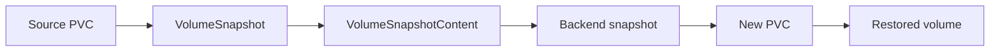

The snapshot API contains:

* `VolumeSnapshot`
* `VolumeSnapshotContent`
* `VolumeSnapshotClass`

Snapshots require a CSI driver with snapshot support, the snapshot CRDs, a snapshot controller, and the CSI snapshotter sidecar. The sidecar calls the backend’s `CreateSnapshot` and `DeleteSnapshot` operations. ([Kubernetes][16])

Use snapshots for:

* Point-in-time recovery
* Pre-upgrade safeguards
* Database restore workflows
* Creating test environments
* Backup pipelines

A storage snapshot alone does not automatically coordinate database transactions. For databases, use application-aware hooks, flushing, freezing, or a database-native backup procedure when transactional consistency matters.

## Volume cloning

```yaml
apiVersion: v1
kind: PersistentVolumeClaim
metadata:
  name: cloned-database
spec:
  storageClassName: fast-rwo
  dataSource:
    kind: PersistentVolumeClaim
    name: production-database
  accessModes:
    - ReadWriteOnce
  resources:
    requests:
      storage: 100Gi
```

A clone creates an independent volume from another PVC.

Use clones for:

* Development copies
* Integration-test environments
* Fast database duplication
* Creating reusable golden datasets

PVC cloning requires CSI dynamic provisioning. The source PVC must be bound and in the same namespace, source and destination volume modes must match, and the destination cannot be smaller than the source. ([Kubernetes][17])

---

# 17. Volume expansion

When the StorageClass allows expansion:

```yaml
allowVolumeExpansion: true
```

You can increase the PVC request:

```yaml
spec:
  resources:
    requests:
      storage: 200Gi
```

The workflow is approximately:

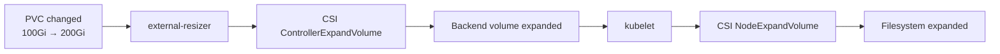

Expansion can require:

1. Backend volume expansion
2. Node-side device rescan
3. Partition or filesystem expansion

The exact operations depend on the driver, filesystem, and whether the volume is currently mounted. Kubernetes supports growing a volume but not shrinking it. ([Kubernetes][6])

---

# 18. StatefulSet storage

A common StatefulSet pattern is:

```yaml
apiVersion: apps/v1
kind: StatefulSet
metadata:
  name: postgres
spec:
  serviceName: postgres
  replicas: 3
  selector:
    matchLabels:
      app: postgres
  template:
    metadata:
      labels:
        app: postgres
    spec:
      containers:
        - name: postgres
          image: postgres:18
          volumeMounts:
            - name: data
              mountPath: /var/lib/postgresql/data

  volumeClaimTemplates:
    - metadata:
        name: data
      spec:
        storageClassName: fast-rwo
        accessModes:
          - ReadWriteOnce
        resources:
          requests:
            storage: 100Gi
```

Kubernetes creates one PVC for each StatefulSet replica:

```text
data-postgres-0
data-postgres-1
data-postgres-2
```

The relationship becomes:

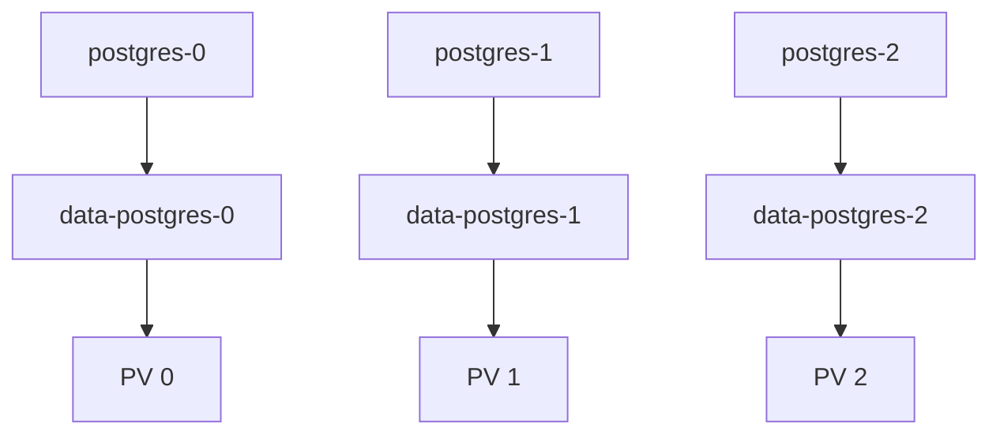

A StatefulSet provides stable Pod identities and stable claim names, but it does not replicate database data. PostgreSQL, MySQL, Kafka, Cassandra or their operators must implement replication and failover.

---

# 19. Choosing the right storage

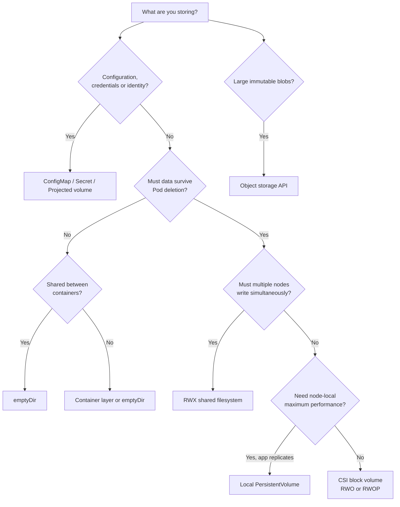

## Practical workload mapping

| Workload                 | Recommended approach                                |
| ------------------------ | --------------------------------------------------- |
| Stateless API            | No PVC; use `emptyDir` for cache                    |
| PostgreSQL/MySQL         | CSI block volume, RWO/RWOP, StatefulSet             |
| Distributed database     | CSI block or local PV, one volume per replica       |
| Shared web content       | RWX filesystem or object storage                    |
| User-uploaded images     | Usually object storage                              |
| Build workspace          | `emptyDir` or generic ephemeral volume              |
| Reusable build cache     | PVC or external cache service                       |
| Secrets and certificates | Secret/projected volume                             |
| Node log collector       | Read-only `hostPath`                                |
| ML training scratch      | Local NVMe or generic ephemeral volume              |
| ML dataset               | Object storage or high-throughput shared filesystem |
| Backup target            | Object storage                                      |
| Read-only common dataset | ROX filesystem or cloned volumes                    |
| Strict singleton writer  | `ReadWriteOncePod` when supported                   |

---

# 20. Troubleshooting by lifecycle stage

## PVC is `Pending`

Check:

```bash
kubectl get pvc
kubectl describe pvc database-data
kubectl get storageclass
kubectl get pv
```

Likely causes:

* StorageClass does not exist
* CSI provisioner is not running
* No compatible static PV exists
* Requested access mode is unsupported
* Requested capacity is unavailable
* Topology constraints cannot be satisfied
* `WaitForFirstConsumer` is waiting for a Pod

---

## Pod is `Pending`

Check:

```bash
kubectl describe pod <pod-name>
kubectl get pvc,pv
kubectl get csinode
kubectl get csistoragecapacity
```

Likely causes:

* PV node affinity conflicts
* Volume is in another zone
* Node does not have the CSI driver
* Node attach-volume limit reached
* Pod scheduling constraints conflict with storage topology
* Local PV is only available on an unschedulable node

CSI storage-capacity objects allow the scheduler to consider topology-specific provisionable capacity when using an appropriate CSI driver and delayed binding. Capacity information can become stale, so provisioning can still occasionally require retries. ([Kubernetes][18])

---

## Pod is stuck in `ContainerCreating`

Check:

```bash
kubectl describe pod <pod-name>
kubectl get volumeattachment
kubectl describe volumeattachment <name>
```

Look for events such as:

```text
FailedAttachVolume
FailedMount
MountVolume.SetUp failed
Multi-Attach error
timed out waiting for the condition
```

This usually means scheduling succeeded but attachment, staging, mounting, permission setup, or device discovery failed.

---

## CSI controller troubleshooting

```bash
kubectl -n kube-system get pods
kubectl -n kube-system logs <csi-controller-pod> -c csi-provisioner
kubectl -n kube-system logs <csi-controller-pod> -c csi-attacher
kubectl -n kube-system logs <csi-controller-pod> -c csi-resizer
```

Inspect:

```bash
kubectl get csidriver
kubectl get pv,pvc
kubectl get volumeattachment
kubectl get volumesnapshot
kubectl get volumesnapshotcontent
```

---

## CSI node troubleshooting

On the affected node:

```bash
journalctl -u kubelet
ls -la /var/lib/kubelet/plugins_registry
ls -la /var/lib/kubelet/plugins
findmnt -R /var/lib/kubelet
lsblk -f
mount
dmesg --ctime
```

Check the node plugin:

```bash
kubectl -n kube-system get pods -o wide
kubectl -n kube-system logs <csi-node-pod> -c node-driver-registrar
kubectl -n kube-system logs <csi-node-pod> -c <driver-container>
```

Common host-level failures include:

* CSI socket missing
* Driver not registered with kubelet
* Mount propagation misconfigured
* Required mount utility missing
* Device not visible under `/dev`
* Filesystem corruption
* Unsupported filesystem type
* Permission or `fsGroup` failure
* Network-storage endpoint unreachable
* Volume still attached to another node
* Stale mount from an unclean node shutdown

---

# 21. The complete mental model

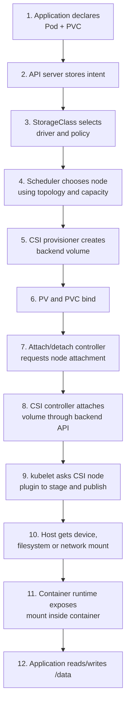

The most important interview-level distinction is:

```text
Control plane:
- Stores and reconciles storage intent
- Provisions and binds volumes
- Selects topology-compatible nodes
- Coordinates attachment
- Manages snapshots and expansion

Worker node:
- Registers the CSI node driver
- Discovers the device or export
- Formats and stages the volume
- Mounts or maps it to a Pod path
- Exposes it through the container mount namespace

Storage backend:
- Stores the actual bytes
- Implements replication and durability
- Creates, deletes, attaches, expands and snapshots volumes
```

Kubernetes storage is therefore not one subsystem. It is a coordinated pipeline involving the API server, storage controllers, scheduler, CSI controller sidecars, backend APIs, kubelet, CSI node plugins, Linux devices and mounts, and finally the container runtime.

[1]: https://kubernetes.io/docs/concepts/storage/ "Storage | Kubernetes"
[2]: https://kubernetes.io/docs/concepts/storage/volumes/ "Volumes | Kubernetes"
[3]: https://kubernetes.io/docs/concepts/storage/persistent-volumes/ "Persistent Volumes | Kubernetes"
[4]: https://kubernetes.io/docs/reference/kubernetes-api/storage/?utm_source=chatgpt.com "Storage | Kubernetes"
[5]: https://kubernetes-csi.github.io/docs/external-provisioner.html "external-provisioner - Kubernetes CSI Developer Documentation"
[6]: https://kubernetes.io/docs/concepts/storage/storage-classes/ "Storage Classes | Kubernetes"
[7]: https://kubernetes.io/docs/reference/scheduling/config/?utm_source=chatgpt.com "Scheduler Configuration | Kubernetes"
[8]: https://kubernetes-csi.github.io/docs/external-attacher.html "external-attacher - Kubernetes CSI Developer Documentation"
[9]: https://kubernetes-csi.github.io/docs/sidecar-containers.html "Sidecar Containers - Kubernetes CSI Developer Documentation"
[10]: https://kubernetes-csi.github.io/docs/deploying.html "Deploying a CSI Driver on Kubernetes - Kubernetes CSI Developer Documentation"
[11]: https://kubernetes.io/docs/reference/command-line-tools-reference/kube-controller-manager/?utm_source=chatgpt.com "kube-controller-manager | Kubernetes"
[12]: https://kubernetes.io/docs/concepts/overview/components/index.html?utm_source=chatgpt.com "Kubernetes Components | Kubernetes"
[13]: https://kubernetes.io/docs/concepts/storage/projected-volumes/ "Projected Volumes | Kubernetes"
[14]: https://kubernetes.io/docs/concepts/storage/ephemeral-volumes/ "Ephemeral Volumes | Kubernetes"
[15]: https://kubernetes.io/docs/concepts/storage/ephemeral-storage/ "Local ephemeral storage | Kubernetes"
[16]: https://kubernetes.io/docs/concepts/storage/volume-snapshots/ "Volume Snapshots | Kubernetes"
[17]: https://kubernetes.io/docs/concepts/storage/volume-pvc-datasource/ "CSI Volume Cloning | Kubernetes"
[18]: https://kubernetes.io/docs/concepts/storage/storage-capacity/?utm_source=chatgpt.com "Storage Capacity | Kubernetes"
