# Kubernetes Workloads: From YAML to Running Processes

A **workload** is an application or task running on Kubernetes. The actual unit Kubernetes schedules and executes is always a **Pod**. Higher-level objects such as Deployments, StatefulSets, DaemonSets, Jobs, and CronJobs exist to create, replace, scale, and update Pods according to different operational requirements. ([Kubernetes][1])

The most important mental model is:

> Kubernetes workload objects do not directly run containers. They continuously describe and reconcile the desired state of Pods.

---

## 1. The complete workload execution path

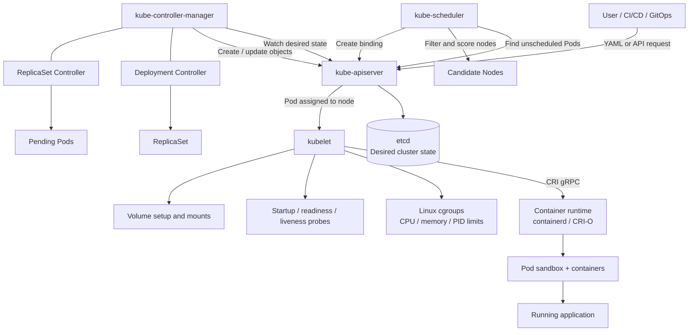

The control plane contains the API server, etcd, scheduler, and controllers. Worker nodes contain the kubelet, container runtime, and usually kube-proxy or another networking implementation. The scheduler only chooses a node; the kubelet and runtime perform the actual node-level execution. ([Kubernetes][2])

---

# 2. What exactly is a Pod?

A Pod is a logical host for one or more tightly coupled containers. Containers in the same Pod:

* Run on the same node.
* Share the Pod IP address and port space.
* Can communicate through `localhost`.
* Can share mounted volumes.
* Are scheduled and managed together.

Most Pods contain one application container. Multi-container Pods are appropriate when the containers are tightly coupled—for example, an application plus a sidecar proxy or log-processing helper. ([Kubernetes][3])

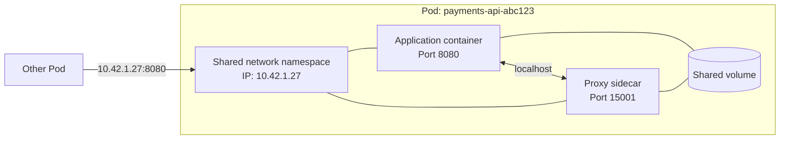

A Pod is deliberately disposable. If a Pod is deleted or its node fails, Kubernetes normally creates a **new Pod with a new UID**, rather than moving the original Pod. This is why applications should not rely on a Pod being a permanent machine. ([Kubernetes][1])

---

# 3. Deployment example: what happens internally?

Suppose you apply this Deployment:

```yaml
apiVersion: apps/v1
kind: Deployment
metadata:
  name: payments-api
spec:
  replicas: 3

  selector:
    matchLabels:
      app: payments-api

  template:
    metadata:
      labels:
        app: payments-api
    spec:
      containers:
        - name: api
          image: ghcr.io/example/payments-api:1.4.2

          ports:
            - containerPort: 8080

          resources:
            requests:
              cpu: 250m
              memory: 256Mi
            limits:
              cpu: "1"
              memory: 512Mi

          startupProbe:
            httpGet:
              path: /startup
              port: 8080
            periodSeconds: 5
            failureThreshold: 30

          readinessProbe:
            httpGet:
              path: /ready
              port: 8080
            periodSeconds: 5

          livenessProbe:
            httpGet:
              path: /health
              port: 8080
            periodSeconds: 10
```

## Internal sequence

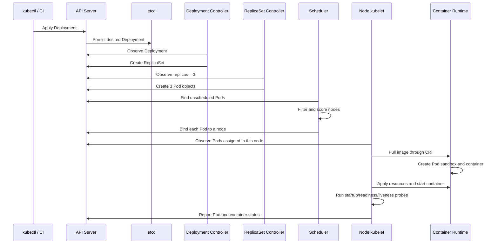

## Step 1: API server stores the desired state

The API server is the front door to the cluster. It receives the Deployment object and stores cluster state in etcd.

The object says:

```text
I want three Pods matching this template.
```

It does not instruct a particular node to immediately start three processes.

## Step 2: Deployment controller creates a ReplicaSet

The Deployment controller compares:

```text
Desired: Deployment has an active ReplicaSet for this Pod template
Actual:  No corresponding ReplicaSet exists
```

It creates the ReplicaSet.

The Deployment is primarily responsible for:

* Rollouts.
* Rollbacks.
* Version transitions.
* Rollout strategy.
* ReplicaSet history.
* Pause and resume.
* Deployment status.

The ReplicaSet is responsible for maintaining the requested number of Pods. ([Kubernetes][4])

## Step 3: ReplicaSet controller creates Pods

The ReplicaSet controller sees:

```text
Desired replicas: 3
Current Pods:      0
Difference:        3
```

It creates three Pod objects.

If one Pod later disappears:

```text
Desired replicas: 3
Current Pods:      2
Difference:        1
```

It creates one replacement Pod.

This is a **reconciliation loop**, not a one-time script. Kubernetes controllers repeatedly move current state toward desired state. ([Kubernetes][5])

## Step 4: scheduler selects nodes

Initially, each Pod exists with no assigned node.

The scheduler processes each unscheduled Pod in two major stages:

1. **Filtering**: remove nodes that cannot run the Pod.
2. **Scoring**: rank feasible nodes and choose a preferred node.

Inputs can include:

* CPU and memory requests.
* Node selectors.
* Node affinity.
* Pod affinity and anti-affinity.
* Taints and tolerations.
* Topology-spread constraints.
* Storage requirements.
* Priority and preemption.
* Custom scheduler plugins.

After selecting a node, the scheduler records a binding through the API server. ([Kubernetes][6])

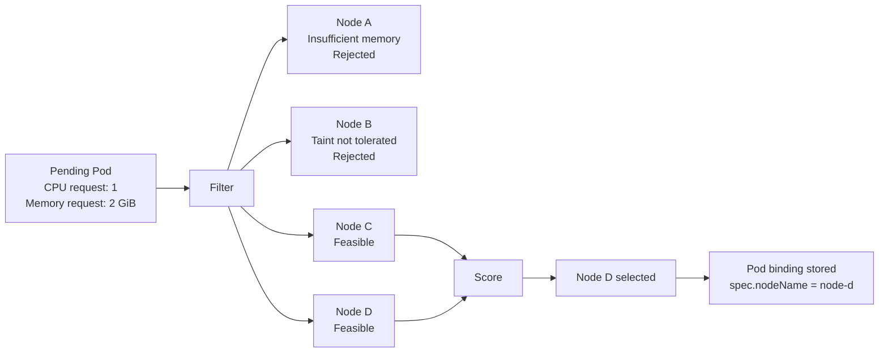

## Step 5: kubelet realizes the Pod

The kubelet on the selected node observes the assigned Pod and works with the configured container runtime through CRI.

At the node level, it generally has to:

1. Ensure referenced Secrets and ConfigMaps can be consumed.
2. Prepare volumes.
3. Ask the runtime to create the Pod sandbox.
4. Configure the Pod network through the node’s network implementation.
5. Pull container images.
6. Create containers.
7. Configure cgroups and resource limits.
8. Start containers.
9. Run probes.
10. Report Pod status to the API server.

CRI is a gRPC interface between kubelet and container runtimes. Every node requires a compatible runtime, such as containerd or CRI-O. ([Kubernetes][7])

---

# 4. Control-plane workload components

## 4.1 API server

The API server is the central coordination point.

Every major workload component communicates through it:

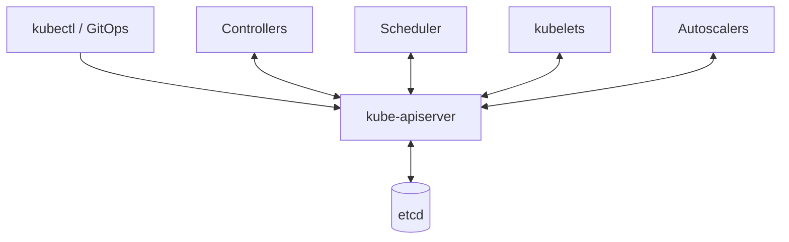

Components usually do not directly modify each other. For example, a Deployment controller does not call the scheduler. It creates Pods through the API server; the scheduler independently observes those unscheduled Pods. ([Kubernetes][2])

## 4.2 etcd

etcd stores the Kubernetes API state, including:

* Deployments.
* ReplicaSets.
* Pods.
* Jobs.
* Node objects.
* Bindings and status.
* ConfigMaps.
* Secrets.
* Services and EndpointSlices.

It stores desired and reported state, not container processes themselves. ([Kubernetes][2])

## 4.3 Controller manager

The controller manager runs multiple control loops.

For workloads, important examples include:

* Deployment controller.
* ReplicaSet controller.
* StatefulSet controller.
* DaemonSet controller.
* Job controller.
* CronJob controller.
* Node controller.
* EndpointSlice controller.

Each controller watches relevant API objects, computes a difference, and submits further API changes. ([Kubernetes][5])

## 4.4 Scheduler

The scheduler operates only on Pods that do not yet have a node assignment.

Its scheduling framework exposes stages such as:

* Queue sorting.
* Pre-filter.
* Filter.
* Post-filter.
* Pre-score.
* Score.
* Reserve.
* Permit.
* Pre-bind.
* Bind.
* Post-bind.

This framework allows custom scheduling behavior without replacing the complete scheduler. ([Kubernetes][6])

## 4.5 Cloud controller and node autoscaler

In a cloud environment, cloud-integrated controllers and node autoscaling components can interact with provider APIs to:

* Create nodes.
* Remove nodes.
* initialize node metadata.
* Manage cloud networking and load balancers.
* Respond to unschedulable workloads.

Node autoscaling is distinct from Pod autoscaling: HPA creates more Pods, while node autoscaling creates more infrastructure on which those Pods can run. ([Kubernetes][2])

---

# 5. Worker-node and host-level execution

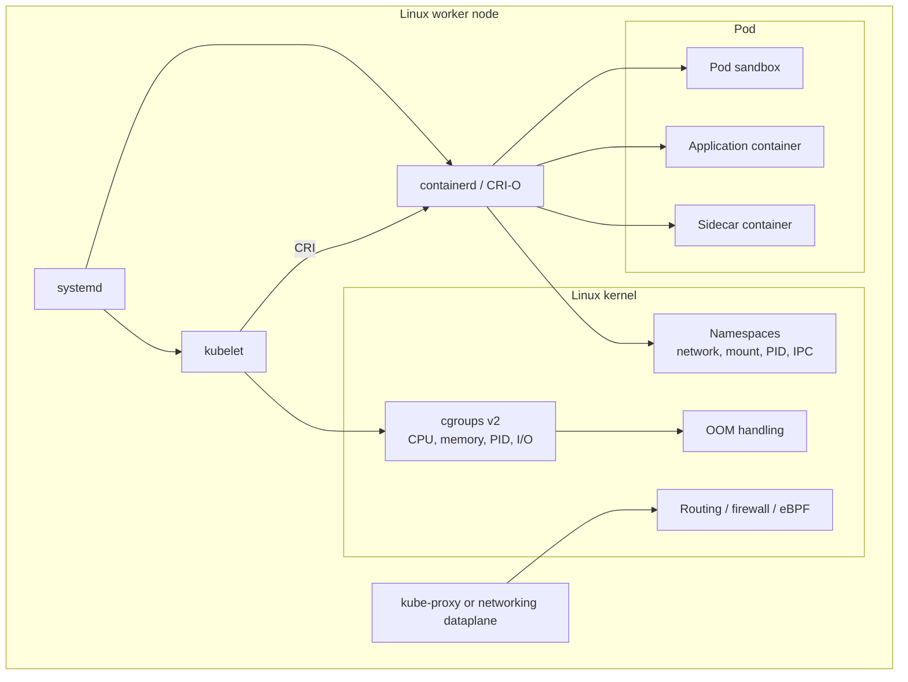

## 5.1 Resource requests versus limits

A request and a limit serve different purposes:

| Setting        | Used primarily by | Meaning                                                      |
| -------------- | ----------------- | ------------------------------------------------------------ |
| CPU request    | Scheduler         | CPU capacity that must be available before placement         |
| Memory request | Scheduler         | Memory capacity that must be available before placement      |
| CPU limit      | Kubelet/runtime   | Maximum CPU rate, normally enforced through throttling       |
| Memory limit   | Kubelet/runtime   | Maximum memory usage before an OOM response becomes possible |

The scheduler considers requests, not the Pod’s current CPU or memory consumption. A Pod requesting 8 GiB cannot be placed on a node with only 4 GiB allocatable, even if the application currently uses almost no memory. Kubelet passes resource configuration to the runtime, which enforces it using the host’s control-group mechanisms. ([Kubernetes][8])

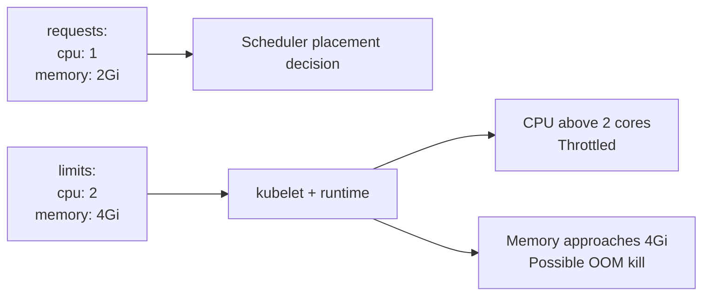

### Common resource mistake

```yaml
resources:
  limits:
    cpu: "2"
    memory: 2Gi
```

When no request is explicitly set and no admission-time default provides one, Kubernetes may copy the limit into the request. That can make the workload reserve considerably more scheduler capacity than expected. Explicit requests are normally safer. ([Kubernetes][8])

## 5.2 QoS classes

Kubernetes assigns every Pod one of three QoS classes:

| QoS class    | Typical configuration                                    | Eviction protection |
| ------------ | -------------------------------------------------------- | ------------------- |
| `Guaranteed` | CPU and memory requests equal limits for every container | Highest             |
| `Burstable`  | At least one request or limit, but not Guaranteed        | Medium              |
| `BestEffort` | No CPU or memory requests or limits                      | Lowest              |

During node resource pressure, Kubernetes generally evicts BestEffort workloads before Burstable workloads, and Burstable before Guaranteed workloads, subject to actual resource usage and eviction calculations. ([Kubernetes][9])

Example Guaranteed container:

```yaml
resources:
  requests:
    cpu: "2"
    memory: 4Gi
  limits:
    cpu: "2"
    memory: 4Gi
```

## 5.3 Node Allocatable

A node’s full machine capacity should not normally be offered entirely to Pods.

```text
Node capacity
  - operating-system reservation
  - Kubernetes daemon reservation
  - eviction safety margin
  = node allocatable for Pods
```

Without reservations, application Pods can compete with kubelet, the container runtime, SSH, journald, and other system daemons, potentially destabilizing the node. Kubernetes exposes Node Allocatable and supports `kubeReserved`, `systemReserved`, and eviction thresholds in kubelet configuration. ([Kubernetes][10])

Illustrative kubelet configuration:

```yaml
apiVersion: kubelet.config.k8s.io/v1beta1
kind: KubeletConfiguration

cgroupDriver: systemd

kubeReserved:
  cpu: 500m
  memory: 1Gi
  ephemeral-storage: 1Gi

systemReserved:
  cpu: 500m
  memory: 1Gi
  ephemeral-storage: 1Gi

evictionHard:
  memory.available: 500Mi
  nodefs.available: "10%"
  imagefs.available: "15%"
```

Actual reservation values should be calculated from node size, Pod density, runtime overhead, operating-system usage, and observed peaks.

## 5.4 Cgroup driver alignment

Kubelet and the container runtime must use compatible cgroup management.

For kubeadm-managed systemd hosts, the recommended arrangement is commonly:

```text
systemd
 ├── kubelet.service
 ├── containerd.service
 ├── system.slice
 └── kubepods.slice
      ├── Guaranteed Pods
      ├── Burstable Pods
      └── BestEffort Pods
```

Kubeadm defaults kubelet’s cgroup driver to `systemd` in modern versions, and the kubelet and runtime drivers should match. A mismatch can produce unstable resource accounting and node behavior. ([Kubernetes][11])

## 5.5 CPU Manager

Most applications can share CPU cores under the default CPU Manager policy.

For latency-sensitive workloads, kubelet supports the `static` CPU Manager policy. Eligible workloads can receive stronger CPU affinity and more exclusive CPU allocation. This is relevant for:

* Packet processing.
* High-frequency trading components.
* Telecom network functions.
* Low-latency databases.
* CPU-sensitive inference.
* Real-time media processing.

CPU Manager supports `none` and `static` policies. The static policy is most useful when Pods are Guaranteed and request whole CPU quantities. ([Kubernetes][12])

```yaml
apiVersion: kubelet.config.k8s.io/v1beta1
kind: KubeletConfiguration
cpuManagerPolicy: static
```

Example latency-sensitive container:

```yaml
resources:
  requests:
    cpu: "4"
    memory: 8Gi
  limits:
    cpu: "4"
    memory: 8Gi
```

## 5.6 Topology Manager and NUMA alignment

On multi-socket machines, CPU, memory, and devices may reside on different NUMA nodes. A Pod may suffer additional latency if its CPU is assigned from one NUMA node while its accelerator or memory is attached to another.

Topology Manager coordinates topology hints from resource managers and can align CPUs, memory, and devices. It supports policies such as:

* `none`
* `best-effort`
* `restricted`
* `single-numa-node`

This is particularly relevant for GPU workloads, network functions, scientific computing, low-latency systems, and high-throughput ML workloads. ([Kubernetes][13])

```yaml
apiVersion: kubelet.config.k8s.io/v1beta1
kind: KubeletConfiguration
cpuManagerPolicy: static
topologyManagerScope: pod
topologyManagerPolicy: restricted
```

## 5.7 Node-pressure eviction

Kubelet monitors node-level signals such as:

* Available memory.
* Node filesystem space.
* Image filesystem space.
* Inodes.
* Process identifiers.

If configured thresholds are crossed, kubelet can reclaim images and containers and eventually evict Pods. Node-pressure eviction is a node-survival mechanism and does **not** guarantee respect for a PodDisruptionBudget. Controllers may subsequently create replacement Pods elsewhere. ([Kubernetes][14])

---

# 6. Kubernetes workload types

## Selection overview

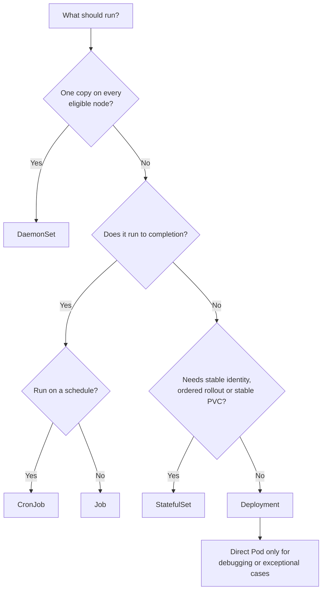

## 6.1 Direct Pod

### Use when

* Running temporary debugging tools.
* Testing scheduling behavior.
* Creating a short-lived experimental Pod.
* Building a custom controller that directly manages Pods.

### Avoid when

* The application needs self-healing.
* Multiple replicas are required.
* Rolling updates are required.
* The Pod must be recreated after deletion.

A direct Pod has no higher-level controller to replace it automatically. Kubernetes normally recommends using an appropriate workload controller. ([Kubernetes][3])

Example:

```bash
kubectl run debug-shell \
  --image=busybox:1.36 \
  --restart=Never \
  -- sleep 3600
```

---

## 6.2 Deployment

A Deployment manages ReplicaSets and is the standard choice for long-running stateless applications. It supports declarative rollout, rollback, scaling, status monitoring, and controlled replacement of old Pods. ([Kubernetes][4])

### Use when

* Running HTTP APIs.
* Running web front ends.
* Running stateless workers.
* Running consumers that do not require a stable Pod identity.
* Performing rolling application upgrades.
* Scaling replicas horizontally.

### Avoid when

* Every node needs one replica.
* Tasks must terminate successfully.
* Pods need permanent ordinal identities.
* Each replica needs a dedicated persistent volume.

### Update strategies

#### RollingUpdate

Gradually creates new Pods and removes old ones.

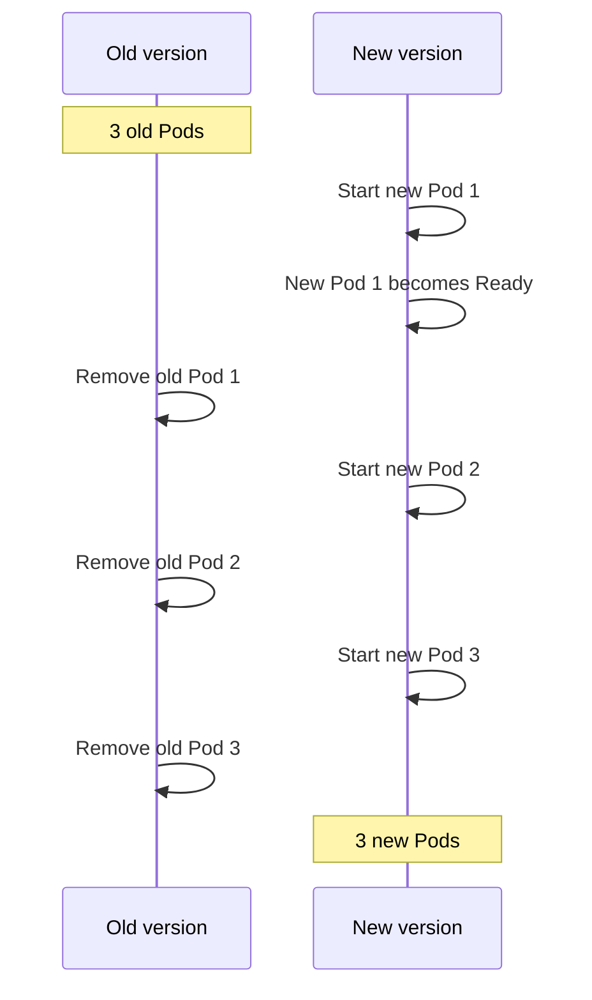

Example:

```yaml
strategy:
  type: RollingUpdate
  rollingUpdate:
    maxSurge: 25%
    maxUnavailable: 0
```

#### Recreate

Terminates existing Pods before creating new ones.

```yaml
strategy:
  type: Recreate
```

Use Recreate only when old and new versions cannot coexist or the application has exclusive resource constraints.

---

## 6.3 ReplicaSet

A ReplicaSet maintains a stable number of matching Pods.

```text
Desired replicas: 5
Actual replicas:  4
Action: create 1 Pod
```

You usually should not create ReplicaSets directly. A Deployment manages ReplicaSets while adding rollout history, update strategy, and rollback capabilities. Direct ReplicaSets are mainly useful for specialized controllers or custom update mechanisms. ([Kubernetes][15])

---

## 6.4 StatefulSet

A StatefulSet manages Pods that require stable identity or persistent storage.

Each replica receives a stable ordinal:

```text
mysql-0
mysql-1
mysql-2
```

It can also receive a corresponding persistent volume:

```text
data-mysql-0
data-mysql-1
data-mysql-2
```

StatefulSets provide stable network identities, stable storage association, ordered deployment and scaling, and controlled rolling updates. They usually require a headless Service for stable network identity. ([Kubernetes][16])

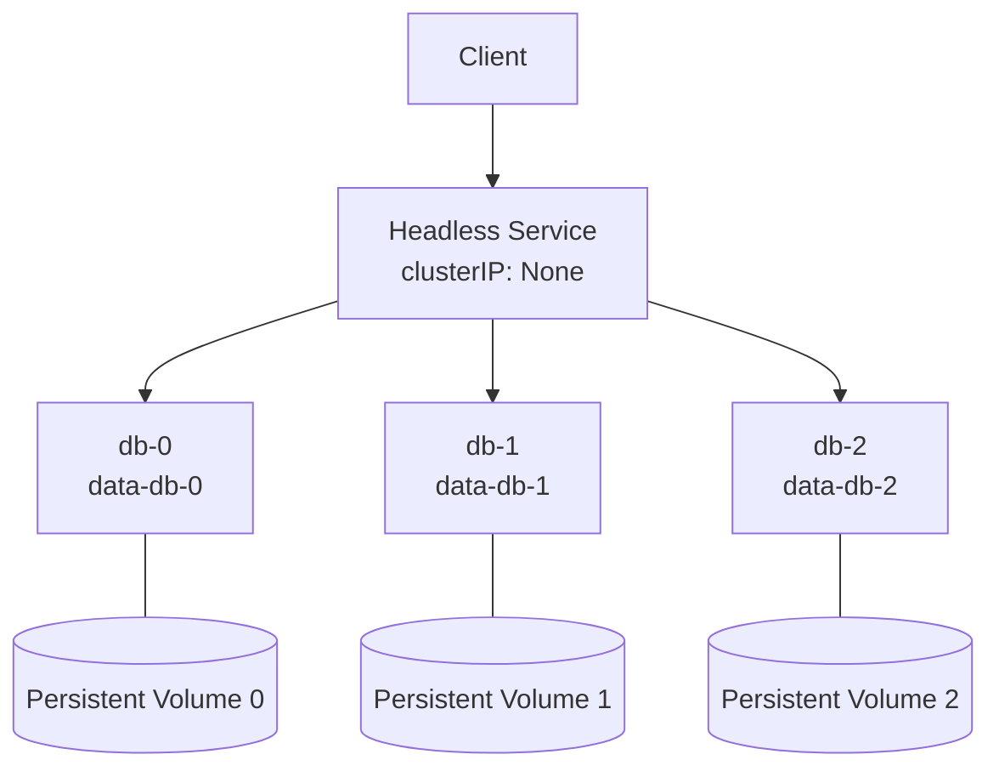

### Use when

* A replica needs a stable name.
* Each replica needs its own persistent volume.
* Startup or shutdown order matters.
* The application implements stateful replication or clustering.
* Stable network identity is required.

Examples include database clusters, consensus systems, Kafka-like brokers, and clustered data stores—provided the application or an Operator correctly handles membership, replication, backup, and recovery.

### Avoid when

* The application is stateless.
* All replicas are interchangeable.
* A shared external database already stores the application state.
* You only need a volume but not stable Pod identity.

### Important limitation

StatefulSet does not automatically make an application highly available. It manages Pod identity and storage attachment; the database or application still needs correct replication, quorum, failover, backup, and recovery logic.

PVCs are normally retained when StatefulSet replicas are scaled down, protecting data but potentially leaving storage that must be managed deliberately. ([Kubernetes][16])

---

## 6.5 DaemonSet

A DaemonSet ensures that a Pod runs on every eligible node, or on every node matching specific placement rules. It automatically adds Pods as nodes join and removes the associated Pods when nodes leave. ([Kubernetes][17])

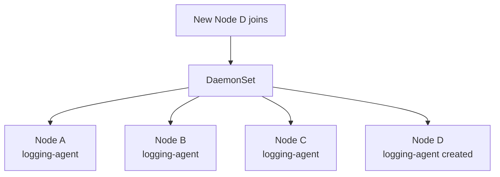

### Use when

* Running log collectors.
* Running node monitoring agents.
* Running networking agents.
* Running storage-node agents.
* Running security or compliance agents.
* Running a local cache on selected nodes.

### Do not use when

* You need an arbitrary replica count.
* Workload scale should follow traffic.
* The application is a normal web service.
* You need HPA to change the number of replicas.

HPA does not scale DaemonSets because the replica count is derived from eligible nodes, not from a workload replica field. ([Kubernetes][18])

Node selection example:

```yaml
spec:
  template:
    spec:
      nodeSelector:
        node-role.example.com/gpu: "true"

      tolerations:
        - key: dedicated
          operator: Equal
          value: gpu
          effect: NoSchedule
```

---

## 6.6 Job

A Job runs work to completion and retries failed Pods according to its policy. Jobs can run one task, multiple completions, or multiple tasks in parallel. ([Kubernetes][19])

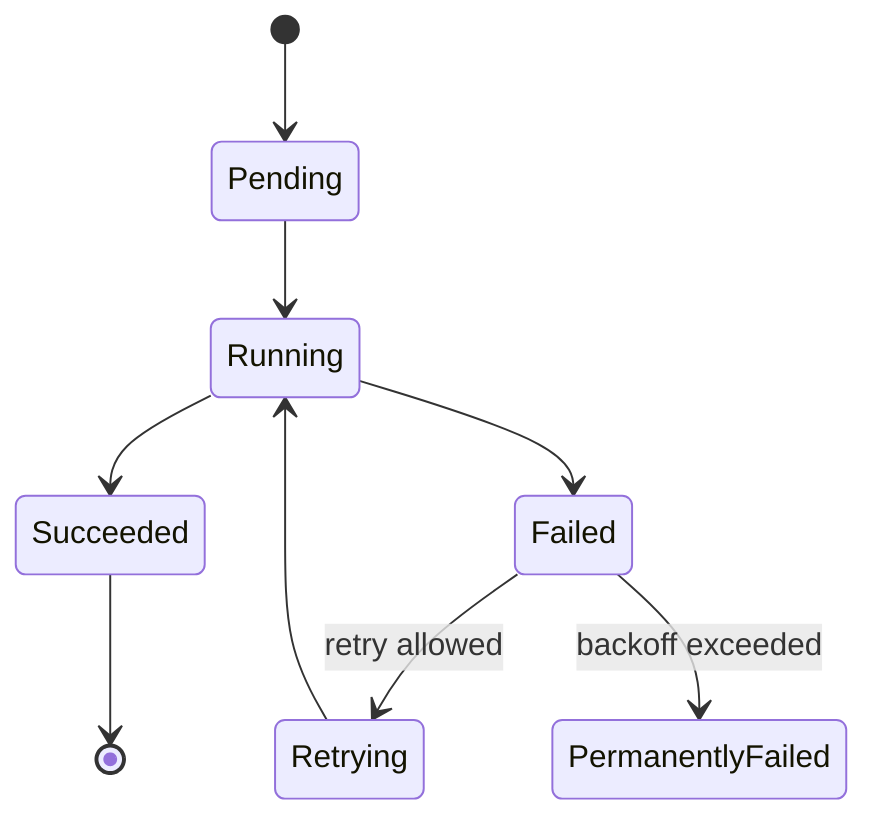

### Use when

* Running database migrations.
* Processing a batch.
* Importing or exporting data.
* Generating reports.
* Running finite ML training.
* Performing one-time administrative operations.

Example:

```yaml
apiVersion: batch/v1
kind: Job
metadata:
  name: database-migration
spec:
  backoffLimit: 3
  activeDeadlineSeconds: 1800

  template:
    spec:
      restartPolicy: Never

      containers:
        - name: migration
          image: ghcr.io/example/payments-migration:1.4.2
          command: ["/app/migrate"]
```

Important controls include:

* `backoffLimit`: allowed retry behavior.
* `activeDeadlineSeconds`: maximum Job runtime.
* `parallelism`: number of Pods that may run concurrently.
* `completions`: number of successful completions required.
* `completionMode`: non-indexed or indexed processing.
* `ttlSecondsAfterFinished`: cleanup of completed Jobs.

---

## 6.7 CronJob

A CronJob creates Jobs according to a schedule. Common uses include backups, reports, cleanup, reconciliation, and periodic batch work. ([Kubernetes][20])

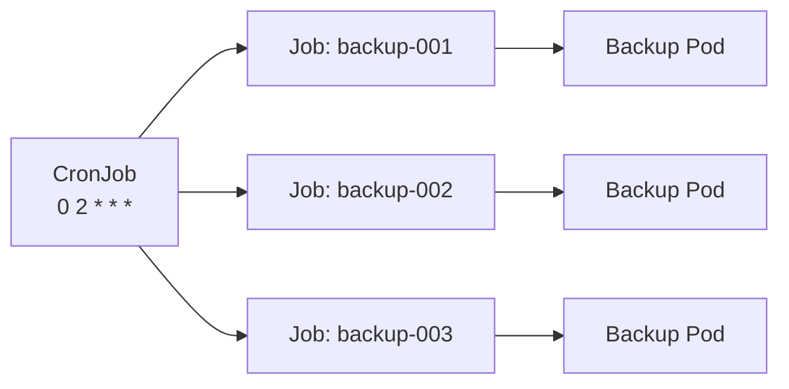

Example:

```yaml
apiVersion: batch/v1
kind: CronJob
metadata:
  name: nightly-backup
spec:
  schedule: "0 2 * * *"
  timeZone: "Asia/Singapore"

  concurrencyPolicy: Forbid
  startingDeadlineSeconds: 900
  successfulJobsHistoryLimit: 3
  failedJobsHistoryLimit: 3

  jobTemplate:
    spec:
      backoffLimit: 2

      template:
        spec:
          restartPolicy: Never

          containers:
            - name: backup
              image: ghcr.io/example/backup-tool:2.1.0
              command: ["/backup/run"]
```

CronJob scheduling is approximate: under certain failure or timing conditions, a Job can be missed or created more than once. Scheduled tasks should therefore be idempotent whenever possible. ([Kubernetes][20])

---

## 6.8 ReplicationController

ReplicationController is the older predecessor to ReplicaSet. It is retained for compatibility, but ReplicaSet and Deployment are the preferred APIs for modern applications. ([Kubernetes][21])

---

## 6.9 Custom workloads and Operators

Kubernetes can be extended with CustomResourceDefinitions and custom controllers.

For example:

```yaml
apiVersion: database.example.com/v1
kind: PostgreSQLCluster
metadata:
  name: orders-db
spec:
  replicas: 3
  version: "18"
```

A custom database Operator could translate this higher-level object into:

* StatefulSets.
* Services.
* Secrets.
* PVCs.
* Backup Jobs.
* Monitoring resources.
* Failover operations.

The same controller principle applies: observe desired state, compare it with actual state, and reconcile the difference.

---

## 6.10 Workload API and gang scheduling

Current Kubernetes documentation also describes an alpha Workload API for coordinated workloads, including Pod group templates and gang-scheduling use cases. It is disabled by default and is primarily relevant to batch, HPC, and distributed ML systems where a group of Pods should be admitted together rather than starting partially. ([Kubernetes][1])

Example problem:

```text
Distributed ML job needs 32 GPU Pods.

Without gang scheduling:
  19 Pods start.
  13 remain Pending.
  19 GPUs are occupied, but training cannot begin.

With gang scheduling:
  Start all 32 together, or wait.
```

Treat this as an advanced and version-sensitive feature rather than a standard default workload mechanism.

---

# 7. Health checks and self-healing

## Three probe types

| Probe     | Question answered                                | Failure behavior                          |
| --------- | ------------------------------------------------ | ----------------------------------------- |
| Startup   | Has the application finished starting?           | Liveness and readiness checks are delayed |
| Readiness | Can this Pod receive traffic now?                | Pod is removed from ready endpoints       |
| Liveness  | Is the process still healthy enough to continue? | Container is restarted                    |

Probes are executed by kubelet. A readiness failure does not normally restart the container; it removes the Pod from Service endpoint selection. A liveness failure can trigger a restart. Startup probes protect slow-starting applications from premature liveness failures. ([Kubernetes][22])

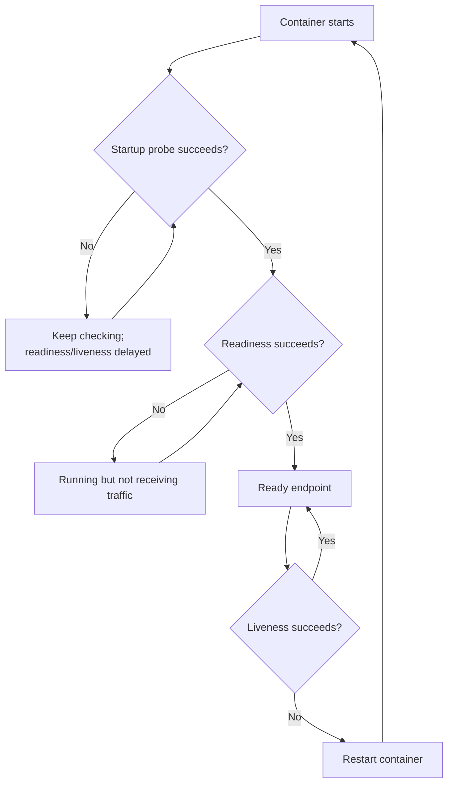

### Avoid this anti-pattern

```yaml
livenessProbe:
  httpGet:
    path: /health
    port: 8080
  initialDelaySeconds: 1
  periodSeconds: 1
  timeoutSeconds: 1
  failureThreshold: 1
```

An overly aggressive liveness probe can repeatedly kill a healthy but temporarily slow application and amplify an outage. Kubernetes documentation explicitly cautions that incorrect liveness checks can cause cascading failures. ([Kubernetes][22])

---

# 8. Restart, replacement, and rescheduling are different

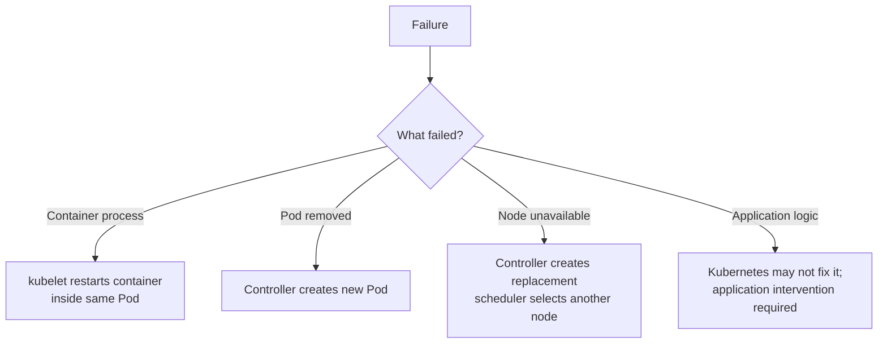

| Failure                            | Responsible component            | Typical action                         |
| ---------------------------------- | -------------------------------- | -------------------------------------- |
| Container exits                    | kubelet                          | Restart according to restart policy    |
| Liveness probe fails               | kubelet                          | Restart the container                  |
| Readiness probe fails              | kubelet/endpoints control        | Stop sending Service traffic           |
| Pod is deleted                     | workload controller              | Create replacement Pod                 |
| Node disappears                    | node/workload controllers        | Replace managed Pods elsewhere         |
| Node has memory or disk pressure   | kubelet                          | Reclaim resources or evict Pods        |
| Application returns incorrect data | Usually the application/operator | Kubernetes may not detect or repair it |
| Persistent storage fails           | Storage/application operator     | Requires storage recovery or failover  |

Kubernetes self-healing includes container restarts, replica replacement, rescheduling after node loss, volume reattachment where supported, and removal of unready Pods from Service endpoints. It cannot automatically repair arbitrary application bugs, corrupted data, or every storage failure. ([Kubernetes][23])

---

# 9. Pod restart policies

A Pod supports:

```yaml
restartPolicy: Always
```

```yaml
restartPolicy: OnFailure
```

```yaml
restartPolicy: Never
```

Typical usage:

| Controller          | Common restart policy  |
| ------------------- | ---------------------- |
| Deployment          | `Always`               |
| StatefulSet         | `Always`               |
| DaemonSet           | `Always`               |
| Job                 | `OnFailure` or `Never` |
| CronJob-created Job | `OnFailure` or `Never` |

Container restarts happen on the same node and within the same Pod identity. Repeated crashes use increasing restart delay, which appears as `CrashLoopBackOff`. ([Kubernetes][24])

---

# 10. Workload placement capabilities

## 10.1 `nodeSelector`

The simplest hard node constraint:

```yaml
spec:
  nodeSelector:
    workload-tier: compute-optimized
```

The Pod can only run on nodes carrying that label.

## 10.2 Node affinity

Node affinity supports richer hard and preferred rules:

```yaml
affinity:
  nodeAffinity:
    requiredDuringSchedulingIgnoredDuringExecution:
      nodeSelectorTerms:
        - matchExpressions:
            - key: topology.kubernetes.io/zone
              operator: In
              values:
                - ap-southeast-1a
                - ap-southeast-1b

    preferredDuringSchedulingIgnoredDuringExecution:
      - weight: 100
        preference:
          matchExpressions:
            - key: node.example.com/instance-family
              operator: In
              values:
                - compute
```

`required...` is mandatory. `preferred...` influences scoring but does not make other nodes impossible. ([Kubernetes][25])

## 10.3 Pod anti-affinity

Use anti-affinity to avoid placing replicas together:

```yaml
affinity:
  podAntiAffinity:
    requiredDuringSchedulingIgnoredDuringExecution:
      - topologyKey: kubernetes.io/hostname
        labelSelector:
          matchLabels:
            app: payments-api
```

This prevents two matching replicas from sharing a node. Strong required anti-affinity can also leave Pods Pending if the cluster does not have sufficient topology capacity.

## 10.4 Topology-spread constraints

Topology spread balances matching Pods across nodes, zones, regions, or another labeled topology. It is often more flexible than strict anti-affinity. ([Kubernetes][26])

```yaml
topologySpreadConstraints:
  - maxSkew: 1
    topologyKey: topology.kubernetes.io/zone
    whenUnsatisfiable: DoNotSchedule
    labelSelector:
      matchLabels:
        app: payments-api

  - maxSkew: 1
    topologyKey: kubernetes.io/hostname
    whenUnsatisfiable: ScheduleAnyway
    labelSelector:
      matchLabels:
        app: payments-api
```

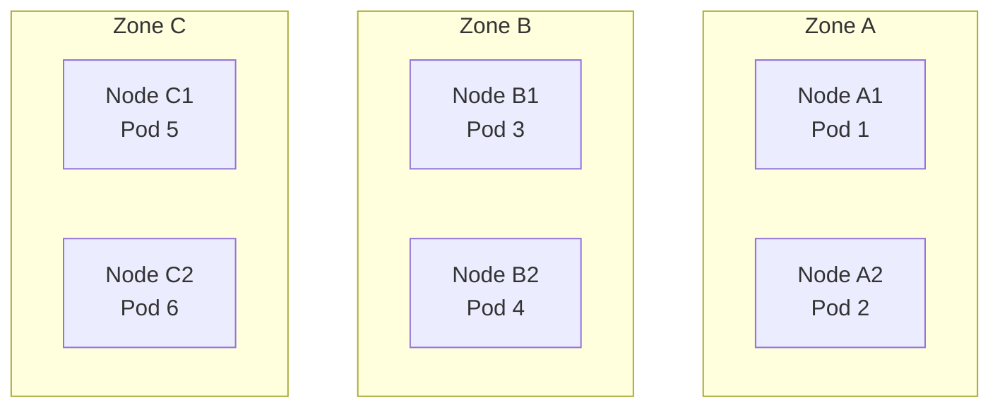

## 10.5 Taints and tolerations

Taints repel Pods. Tolerations allow a Pod to be considered for a tainted node, but do not force it onto that node. ([Kubernetes][27])

Node:

```bash
kubectl taint node gpu-node-1 dedicated=gpu:NoSchedule
```

Pod:

```yaml
tolerations:
  - key: dedicated
    operator: Equal
    value: gpu
    effect: NoSchedule
```

For dedicated node pools, combine toleration with node affinity:

```text
Toleration: I am allowed onto GPU nodes.
Affinity:   I specifically want a GPU node.
```

## 10.6 Priority and preemption

A high-priority unschedulable Pod can cause lower-priority Pods to be selected for preemption if removing them makes placement possible. ([Kubernetes][28])

```yaml
apiVersion: scheduling.k8s.io/v1
kind: PriorityClass
metadata:
  name: critical-api
value: 100000
globalDefault: false
description: Critical customer-facing API
---
apiVersion: v1
kind: Pod
metadata:
  name: critical-api
spec:
  priorityClassName: critical-api
```

Use high priority sparingly. If every workload is critical, priority ceases to provide meaningful differentiation.

## 10.7 RuntimeClass

RuntimeClass selects a node runtime configuration for a Pod. It can be used when different workloads require different runtime isolation or overhead characteristics—for example, a standard OCI runtime versus a hardware-virtualized sandbox. ([Kubernetes][29])

```yaml
apiVersion: node.k8s.io/v1
kind: RuntimeClass
metadata:
  name: sandboxed
handler: kata
---
apiVersion: v1
kind: Pod
metadata:
  name: untrusted-code
spec:
  runtimeClassName: sandboxed
```

The corresponding runtime handler must be configured on eligible nodes.

---

# 11. Autoscaling in Kubernetes

Kubernetes scaling happens at several different layers.

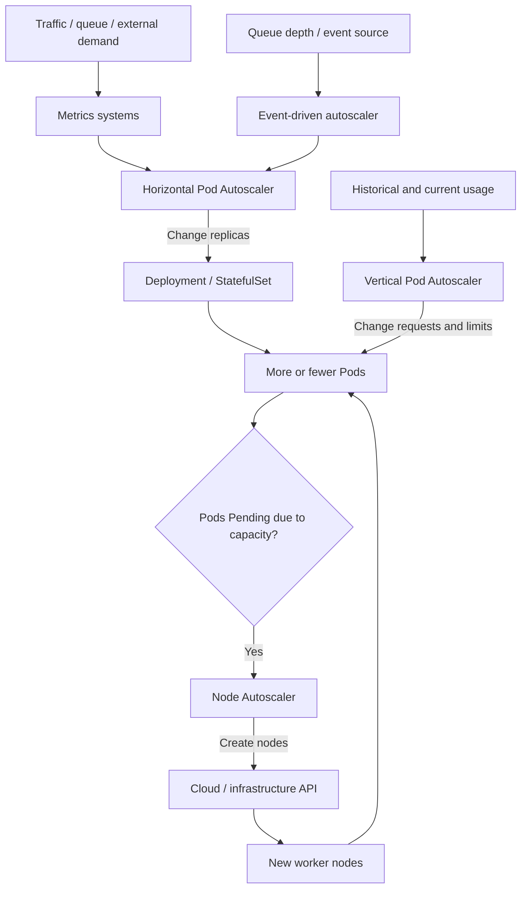

Horizontal scaling changes replica count. Vertical scaling adjusts resource sizing. Node autoscaling changes infrastructure capacity. Kubernetes also supports manual scaling and integrations for event-driven or scheduled scaling. ([Kubernetes][30])

---

## 11.1 Manual scaling

```bash
kubectl scale deployment payments-api --replicas=10
```

This directly changes the desired replica count.

Manual scaling is useful for:

* Testing.
* Planned events.
* Temporary operational intervention.
* Workloads without suitable metrics.
* Establishing an initial baseline.

It is not adaptive and can easily become stale.

---

## 11.2 Horizontal Pod Autoscaler

HPA periodically reads metrics and updates the target workload’s scale.

It can scale objects such as:

* Deployments.
* StatefulSets.
* Other scalable resources exposing the scale subresource.

It does not scale DaemonSets. ([Kubernetes][18])

### HPA control loop

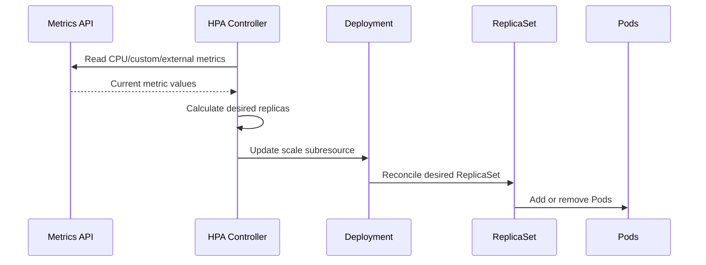

The simplified calculation is:

```text
desired replicas =
ceil(current replicas × current metric / desired metric)
```

For example:

```text
Current replicas:        4
Current CPU utilization: 90%
Target CPU utilization:  60%

desired = ceil(4 × 90 / 60)
        = ceil(6)
        = 6
```

The actual controller also applies tolerance, readiness handling, missing-metric behavior, stabilization, and scale policies. ([Kubernetes][18])

### HPA example

```yaml
apiVersion: autoscaling/v2
kind: HorizontalPodAutoscaler
metadata:
  name: payments-api
spec:
  scaleTargetRef:
    apiVersion: apps/v1
    kind: Deployment
    name: payments-api

  minReplicas: 3
  maxReplicas: 30

  behavior:
    scaleUp:
      stabilizationWindowSeconds: 0
      policies:
        - type: Percent
          value: 100
          periodSeconds: 60
        - type: Pods
          value: 4
          periodSeconds: 60
      selectPolicy: Max

    scaleDown:
      stabilizationWindowSeconds: 300
      policies:
        - type: Percent
          value: 25
          periodSeconds: 60

  metrics:
    - type: Resource
      resource:
        name: cpu
        target:
          type: Utilization
          averageUtilization: 60
```

### Critical CPU HPA requirement

CPU utilization is calculated relative to CPU requests.

If the container has:

```yaml
resources:
  requests:
    cpu: 500m
```

and uses 300m CPU:

```text
CPU utilization = 300m / 500m = 60%
```

Without a CPU request, HPA cannot meaningfully calculate percentage utilization for that container, and scaling may not occur as expected. ([Kubernetes][18])

### Metrics sources

HPA can use:

* Resource metrics, such as CPU and memory.
* Pod metrics.
* Object metrics.
* Custom metrics.
* External metrics, such as queue depth or cloud-provider metrics.
* Multiple metrics, with the largest recommended replica count generally winning.

The resource metrics API is commonly provided by Metrics Server, while custom and external metrics require suitable adapters or providers. ([Kubernetes][18])

### Deployment and HPA ownership

Once HPA manages a Deployment’s replica count, repeatedly applying a manifest containing a fixed `.spec.replicas` can reset the value and fight the autoscaler. Kubernetes documentation recommends avoiding `.spec.replicas` in the continuously applied Deployment manifest when HPA owns scaling. ([Kubernetes][4])

---

## 11.3 Vertical Pod Autoscaler

VPA recommends or applies CPU and memory requests based on observed workload usage. It is delivered as a separate Kubernetes add-on using CRDs rather than as an in-tree core controller. ([Kubernetes][31])

VPA contains:

* **Recommender**: calculates suitable resources.
* **Updater**: decides when Pods should be updated.
* **Admission controller**: applies recommendations to new Pods.

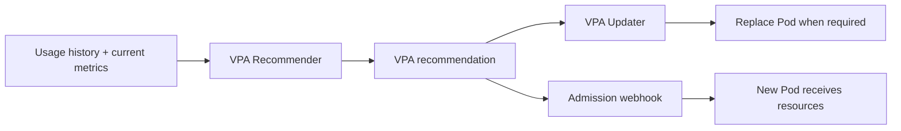

Example:

```yaml
apiVersion: autoscaling.k8s.io/v1
kind: VerticalPodAutoscaler
metadata:
  name: payments-api
spec:
  targetRef:
    apiVersion: apps/v1
    kind: Deployment
    name: payments-api

  updatePolicy:
    updateMode: Auto

  resourcePolicy:
    containerPolicies:
      - containerName: api
        minAllowed:
          cpu: 100m
          memory: 128Mi
        maxAllowed:
          cpu: "4"
          memory: 8Gi
```

### VPA use cases

* Rightsizing workloads with poorly understood resource needs.
* Reducing chronic CPU throttling.
* Reducing repeated memory OOMs.
* Improving node packing.
* Supplying better requests to the scheduler and node autoscaler.

### HPA and VPA conflict

Using HPA on CPU percentage while VPA modifies CPU requests can create interacting control loops:

```text
VPA increases CPU request
→ measured CPU percentage falls
→ HPA scales down
→ per-Pod load increases
→ VPA or HPA reacts again
```

A common design is:

* HPA based on demand-oriented external or custom metrics.
* VPA for requests.
* Or VPA in recommendation mode while engineers review suggestions.

The exact strategy should be load-tested for the workload.

---

## 11.4 In-place Pod resource resize

Current Kubernetes documentation describes in-place vertical Pod resource scaling as stable. It allows supported CPU or memory changes without necessarily replacing the Pod.

However, support depends on the resource, resize policy, runtime, kubelet, and application behavior. The current documentation also notes that VPA does not yet fully integrate with in-place resize in the same way as ordinary VPA replacement workflows. ([Kubernetes][30])

Conceptually:

```text
Traditional vertical update:
change resources → replace Pod → restart application

In-place resize:
change resources → kubelet updates cgroups → Pod may continue running
```

---

## 11.5 Event-driven autoscaling

KEDA is an external Kubernetes project commonly used to scale workloads from event sources such as:

* Kafka lag.
* RabbitMQ queue depth.
* Cloud queues.
* Prometheus queries.
* Database queries.
* Scheduled demand.
* Other external systems.

KEDA typically creates or manages HPA behavior using event-derived metrics. Kubernetes documentation lists KEDA as an event-driven and scheduled scaling option rather than a built-in workload controller. ([Kubernetes][30])

Example control flow:

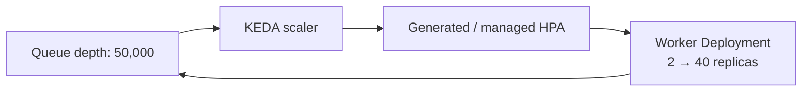

---

## 11.6 Node autoscaling

Node autoscaling reacts when Pods cannot be scheduled because the cluster lacks suitable capacity.

It evaluates requirements such as:

* CPU and memory requests.
* Node affinity.
* Taints and tolerations.
* Storage topology.
* Device requirements.
* Node-pool configuration.

It then interacts with infrastructure or cloud APIs to add nodes. It may later consolidate or remove underused nodes when workloads can safely move. ([Kubernetes][32])

```mermaid
sequenceDiagram
    participant H as HPA
    participant D as Deployment
    participant S as Scheduler
    participant N as Node Autoscaler
    participant C as Cloud Provider

    H->>D: Replicas 10 → 30
    D->>S: 20 new Pods need placement
    S->>S: 12 fit; 8 remain Pending
    N->>N: Examine unschedulable Pods
    N->>C: Request suitable nodes
    C-->>N: Nodes provisioned
    S->>S: Schedule remaining Pods
```

The node autoscaler primarily reasons from requests and scheduling constraints, not simply from real-time node utilization. Incorrect requests therefore damage both scheduler placement and autoscaling decisions. ([Kubernetes][32])

Current SIG Autoscaling-sponsored implementations described by Kubernetes documentation include Cluster Autoscaler and Karpenter. Their architecture and provider support differ. ([Kubernetes][32])

---

# 12. Availability and disruption controls

## 12.1 PodDisruptionBudget

A PDB limits how many replicas may be voluntarily disrupted at once.

```yaml
apiVersion: policy/v1
kind: PodDisruptionBudget
metadata:
  name: payments-api
spec:
  minAvailable: 2

  selector:
    matchLabels:
      app: payments-api
```

PDBs apply to compatible eviction-based voluntary operations such as node draining. They do not protect against every disruption, including hardware failure, direct Pod deletion, node-pressure eviction, or deletion of the owning workload. ([Kubernetes][33])

```mermaid
flowchart LR
    DRAIN["Drain node"] --> EVICT["Eviction API"]
    EVICT --> PDB{"Would eviction violate PDB?"}
    PDB -->|Yes| WAIT["Wait / reject eviction"]
    PDB -->|No| REMOVE["Evict Pod"]
    REMOVE --> REPLACE["Controller creates replacement"]
```

### PDB misconception

A PDB does not ensure that replicas are currently healthy. It limits voluntary disruption. Readiness probes, sufficient replica count, topology spreading, correct rollout strategy, and capacity planning remain necessary.

## 12.2 Graceful termination

When Kubernetes terminates a Pod, applications should be designed to:

1. Stop accepting new work.
2. Complete or transfer in-flight work.
3. Flush buffered state.
4. Release leases or connections.
5. Exit within the grace period.

```yaml
spec:
  terminationGracePeriodSeconds: 60

  containers:
    - name: api
      lifecycle:
        preStop:
          exec:
            command: ["/bin/sh", "-c", "/app/drain"]
```

A `preStop` hook consumes part of the termination grace period; it does not create a separate additional period.

## 12.3 Priority versus PDB

These solve different problems:

| Mechanism       | Purpose                                                  |
| --------------- | -------------------------------------------------------- |
| Priority        | Decide which Pods matter more during scheduling pressure |
| Preemption      | Remove lower-priority Pods to fit higher-priority Pods   |
| PDB             | Limit voluntary disruption of a replicated application   |
| QoS             | Influence local resource treatment and eviction order    |
| Topology spread | Reduce correlated placement failure                      |
| HPA             | Adjust replica count based on demand                     |

---

# 13. Integrated production workload example

The following combines the major workload mechanisms:

```yaml
apiVersion: apps/v1
kind: Deployment
metadata:
  name: payments-api
spec:
  # Omitted because HPA owns the replica count.

  selector:
    matchLabels:
      app: payments-api

  strategy:
    type: RollingUpdate
    rollingUpdate:
      maxSurge: 25%
      maxUnavailable: 0

  minReadySeconds: 10
  revisionHistoryLimit: 5
  progressDeadlineSeconds: 600

  template:
    metadata:
      labels:
        app: payments-api
        version: v1

    spec:
      terminationGracePeriodSeconds: 60

      securityContext:
        runAsNonRoot: true
        seccompProfile:
          type: RuntimeDefault

      topologySpreadConstraints:
        - maxSkew: 1
          topologyKey: topology.kubernetes.io/zone
          whenUnsatisfiable: DoNotSchedule
          labelSelector:
            matchLabels:
              app: payments-api

        - maxSkew: 1
          topologyKey: kubernetes.io/hostname
          whenUnsatisfiable: ScheduleAnyway
          labelSelector:
            matchLabels:
              app: payments-api

      affinity:
        nodeAffinity:
          preferredDuringSchedulingIgnoredDuringExecution:
            - weight: 100
              preference:
                matchExpressions:
                  - key: workload-tier
                    operator: In
                    values:
                      - compute-optimized

      containers:
        - name: api
          image: ghcr.io/example/payments-api:1.4.2

          ports:
            - name: http
              containerPort: 8080

          resources:
            requests:
              cpu: 500m
              memory: 512Mi
            limits:
              cpu: "2"
              memory: 1Gi

          startupProbe:
            httpGet:
              path: /startup
              port: http
            periodSeconds: 5
            timeoutSeconds: 2
            failureThreshold: 30

          readinessProbe:
            httpGet:
              path: /ready
              port: http
            periodSeconds: 5
            timeoutSeconds: 2
            failureThreshold: 3

          livenessProbe:
            httpGet:
              path: /health
              port: http
            periodSeconds: 10
            timeoutSeconds: 2
            failureThreshold: 3

          lifecycle:
            preStop:
              exec:
                command:
                  - /bin/sh
                  - -c
                  - /app/drain
---
apiVersion: autoscaling/v2
kind: HorizontalPodAutoscaler
metadata:
  name: payments-api
spec:
  scaleTargetRef:
    apiVersion: apps/v1
    kind: Deployment
    name: payments-api

  minReplicas: 3
  maxReplicas: 30

  behavior:
    scaleUp:
      stabilizationWindowSeconds: 0
      policies:
        - type: Percent
          value: 100
          periodSeconds: 60

    scaleDown:
      stabilizationWindowSeconds: 300
      policies:
        - type: Percent
          value: 25
          periodSeconds: 60

  metrics:
    - type: Resource
      resource:
        name: cpu
        target:
          type: Utilization
          averageUtilization: 60
---
apiVersion: policy/v1
kind: PodDisruptionBudget
metadata:
  name: payments-api
spec:
  minAvailable: 2
  selector:
    matchLabels:
      app: payments-api
```

This configuration provides:

* Declarative rolling updates.
* Automatic Pod replacement.
* Readiness-based traffic control.
* Startup and liveness detection.
* Horizontal scaling.
* Zone and node spreading.
* Voluntary-disruption protection.
* CPU and memory scheduling information.
* Controlled shutdown.

It still depends on having sufficient node capacity, sensible metrics, correct application health endpoints, enough failure-domain diversity, and suitable cluster-level autoscaling.

---

# 14. Common workload design mistakes

## Mistake 1: Running a production application as a direct Pod

```yaml
kind: Pod
```

When the Pod disappears, no Deployment or StatefulSet controller exists to recreate it.

**Better:** use a Deployment, StatefulSet, Job, or another appropriate controller.

## Mistake 2: Using StatefulSet because the application uses a database

An API that connects to an external database is still usually stateless from Kubernetes’ perspective.

**Better:** use StatefulSet only when the Pod replicas themselves require stable identity, storage, or ordering.

## Mistake 3: No resource requests

Consequences can include:

* Poor scheduler decisions.
* Broken CPU-utilization HPA behavior.
* Unpredictable node packing.
* Poor node-autoscaler decisions.
* Greater eviction risk.

The scheduler, HPA, QoS calculation, and node autoscaler all rely heavily on resource declarations. ([Kubernetes][8])

## Mistake 4: Memory limits that are too low

Memory is not throttled like CPU. Crossing an enforced memory boundary can result in an OOM kill.

**Better:** derive requests and limits from observed working set, peaks, garbage-collection behavior, and controlled load tests.

## Mistake 5: HPA based only on CPU for queue workers

Queue workers can have low CPU while a huge backlog accumulates.

**Better:** scale from queue depth, consumer lag, oldest-message age, or another demand metric.

## Mistake 6: Strict anti-affinity without enough nodes

Three replicas with required host anti-affinity require at least three eligible nodes.

**Better:** align scheduling constraints, minimum cluster size, and autoscaler node-pool configuration.

## Mistake 7: PDB that blocks every drain

For example, one replica with:

```yaml
minAvailable: 1
```

permits no voluntary eviction.

**Better:** run additional replicas or use a disruption policy consistent with the application’s real availability model.

## Mistake 8: CronJob is not idempotent

A scheduled payment or cleanup task may run more than once.

**Better:** use transaction IDs, distributed locking, unique constraints, checkpoints, or deduplication. CronJob execution is not an exactly-once guarantee. ([Kubernetes][20])

## Mistake 9: Liveness checks downstream dependencies

If the database becomes unavailable and every application Pod fails liveness, the cluster may restart the entire fleet even though restarts cannot repair the database.

**Better:**

* Liveness: “Is this process irrecoverably stuck?”
* Readiness: “Can this instance safely serve traffic?”
* Application metrics and alerts: “Is a dependency unhealthy?”

## Mistake 10: Assuming replicas equal high availability

Five replicas on one node or in one availability zone are still exposed to correlated failure.

**Better:** combine replicas with topology spread, anti-affinity, multi-zone node groups, disruption budgets, and sufficient spare capacity.

---

# 15. Interview-level mental model

Think of workload execution as four nested control systems:

```mermaid
flowchart TB
    L1["Application controller layer<br/>Deployment / StatefulSet / Job"]
    L2["Pod scheduling layer<br/>kube-scheduler"]
    L3["Node execution layer<br/>kubelet + CRI runtime"]
    L4["Kernel enforcement layer<br/>cgroups + namespaces"]

    L1 -->|"Which Pods should exist?"| L2
    L2 -->|"Which node should run each Pod?"| L3
    L3 -->|"Which containers should run?"| L4
    L4 -->|"How are resources isolated?"| PROCESS["Linux processes"]
```

A strong explanation in an interview is:

> Deployment and other workload controllers reconcile desired Pods. The scheduler chooses nodes using resource requests and scheduling constraints. Kubelet reconciles assigned Pods on each node through CRI. The runtime creates containers, while Linux namespaces and cgroups provide isolation and resource enforcement. Probes, restart policies, replica controllers, disruption controls, Pod autoscaling, and node autoscaling operate at different layers of that pipeline.

---

# 16. Workload choice summary

| Requirement                                       | Recommended workload                                                          |
| ------------------------------------------------- | ----------------------------------------------------------------------------- |
| Stateless API or web application                  | Deployment                                                                    |
| Stateless queue consumer                          | Deployment                                                                    |
| Stable Pod identity and per-replica storage       | StatefulSet                                                                   |
| Database cluster managed by an Operator           | Operator, commonly backed by StatefulSet                                      |
| Agent on every node                               | DaemonSet                                                                     |
| One-time migration or batch                       | Job                                                                           |
| Scheduled backup or cleanup                       | CronJob                                                                       |
| Temporary debugging container                     | Direct Pod                                                                    |
| Maintain replica count without rollout management | ReplicaSet, rarely directly                                                   |
| Coordinated distributed batch or ML Pods          | Specialized scheduler/controller; experimental Workload API where appropriate |
| Custom domain-specific lifecycle                  | Custom resource plus Operator                                                 |

The decision should begin with the application’s lifecycle and identity requirements—not with whether it happens to read or write data.

[1]: https://kubernetes.io/docs/concepts/workloads/ "Workloads | Kubernetes"
[2]: https://kubernetes.io/docs/concepts/overview/components/ "Kubernetes Components | Kubernetes"
[3]: https://kubernetes.io/docs/concepts/workloads/pods/ "Pods | Kubernetes"
[4]: https://kubernetes.io/docs/concepts/workloads/controllers/deployment/ "Deployments | Kubernetes"
[5]: https://kubernetes.io/docs/concepts/architecture/controller/ "Controllers | Kubernetes"
[6]: https://kubernetes.io/docs/concepts/scheduling-eviction/kube-scheduler/ "Kubernetes Scheduler | Kubernetes"
[7]: https://kubernetes.io/docs/concepts/containers/cri/ "Container Runtime Interface (CRI) | Kubernetes"
[8]: https://kubernetes.io/docs/concepts/configuration/manage-resources-containers/ "Resource Management for Pods and Containers | Kubernetes"
[9]: https://kubernetes.io/docs/concepts/workloads/pods/pod-qos/ "Pod Quality of Service Classes | Kubernetes"
[10]: https://kubernetes.io/docs/tasks/administer-cluster/reserve-compute-resources/ "Reserve Compute Resources for System Daemons | Kubernetes"
[11]: https://kubernetes.io/docs/tasks/administer-cluster/kubeadm/configure-cgroup-driver/ "Configuring a cgroup driver | Kubernetes"
[12]: https://kubernetes.io/docs/tasks/administer-cluster/cpu-management-policies/ "Control CPU Management Policies on the Node | Kubernetes"
[13]: https://kubernetes.io/docs/tasks/administer-cluster/topology-manager/ "Control Topology Management Policies on a node | Kubernetes"
[14]: https://kubernetes.io/docs/concepts/scheduling-eviction/node-pressure-eviction/ "Node-pressure Eviction | Kubernetes"
[15]: https://kubernetes.io/docs/concepts/workloads/controllers/replicaset/ "ReplicaSet | Kubernetes"
[16]: https://kubernetes.io/docs/concepts/workloads/controllers/statefulset/ "StatefulSets | Kubernetes"
[17]: https://kubernetes.io/docs/concepts/workloads/controllers/daemonset/ "DaemonSet | Kubernetes"
[18]: https://kubernetes.io/docs/concepts/workloads/autoscaling/horizontal-pod-autoscale/ "Horizontal Pod Autoscaling | Kubernetes"
[19]: https://kubernetes.io/docs/concepts/workloads/controllers/job/ "Jobs | Kubernetes"
[20]: https://kubernetes.io/docs/concepts/workloads/controllers/cron-jobs/ "CronJob | Kubernetes"
[21]: https://kubernetes.io/docs/concepts/workloads/controllers/replicationcontroller/ "ReplicationController | Kubernetes"
[22]: https://kubernetes.io/docs/concepts/workloads/pods/probes/ "Liveness, Readiness, and Startup Probes | Kubernetes"
[23]: https://kubernetes.io/docs/concepts/architecture/self-healing/ "Kubernetes Self-Healing | Kubernetes"
[24]: https://kubernetes.io/docs/concepts/workloads/pods/pod-lifecycle/ "Pod Lifecycle | Kubernetes"
[25]: https://kubernetes.io/docs/concepts/scheduling-eviction/assign-pod-node/ "Assigning Pods to Nodes | Kubernetes"
[26]: https://kubernetes.io/docs/concepts/scheduling-eviction/topology-spread-constraints/ "Pod Topology Spread Constraints | Kubernetes"
[27]: https://kubernetes.io/docs/concepts/scheduling-eviction/taint-and-toleration/ "Taints and Tolerations | Kubernetes"
[28]: https://kubernetes.io/docs/concepts/scheduling-eviction/pod-priority-preemption/ "Pod Priority and Preemption | Kubernetes"
[29]: https://kubernetes.io/docs/concepts/containers/runtime-class/ "Runtime Class | Kubernetes"
[30]: https://kubernetes.io/docs/concepts/workloads/autoscaling/ "Autoscaling Workloads | Kubernetes"
[31]: https://kubernetes.io/docs/concepts/workloads/autoscaling/vertical-pod-autoscale/ "Vertical Pod Autoscaling | Kubernetes"
[32]: https://kubernetes.io/docs/concepts/cluster-administration/node-autoscaling/ "Node Autoscaling | Kubernetes"
[33]: https://kubernetes.io/docs/concepts/workloads/pods/disruptions/ "Disruptions | Kubernetes"
