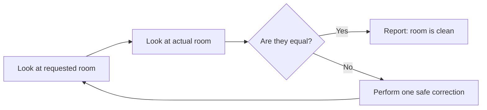
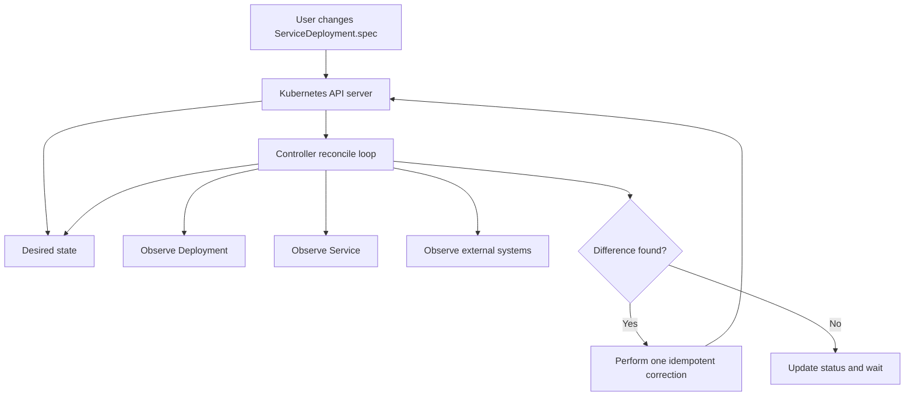
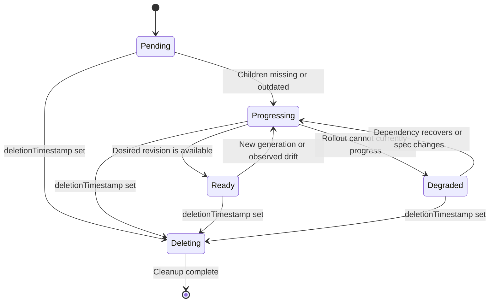
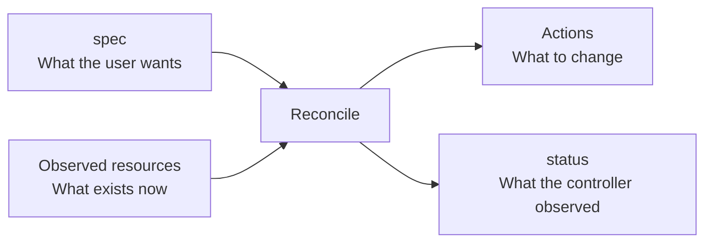
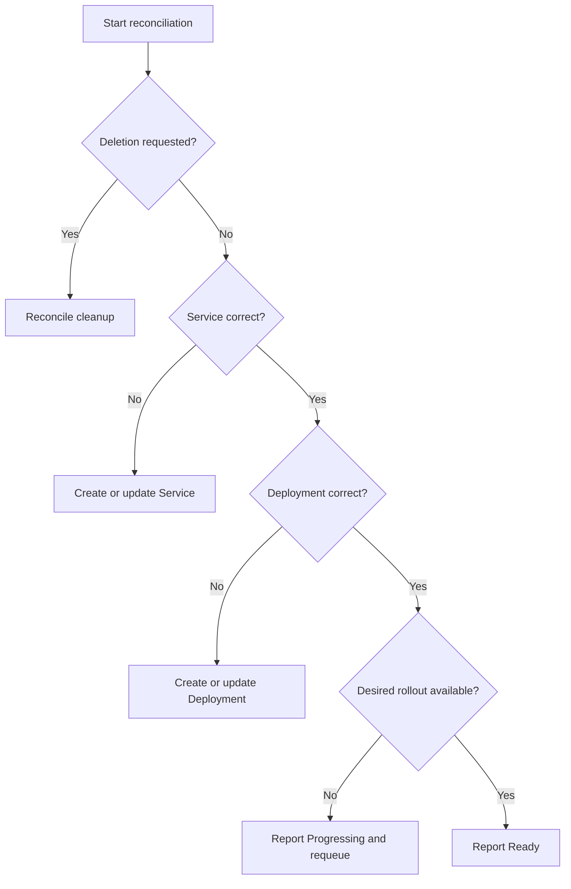
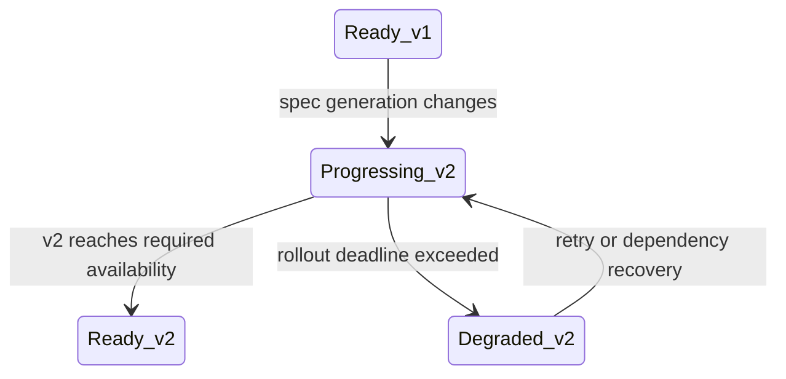
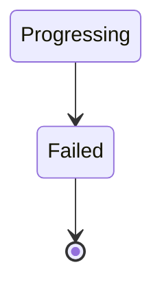
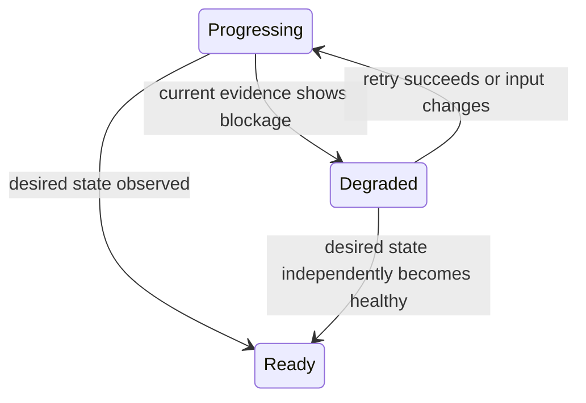
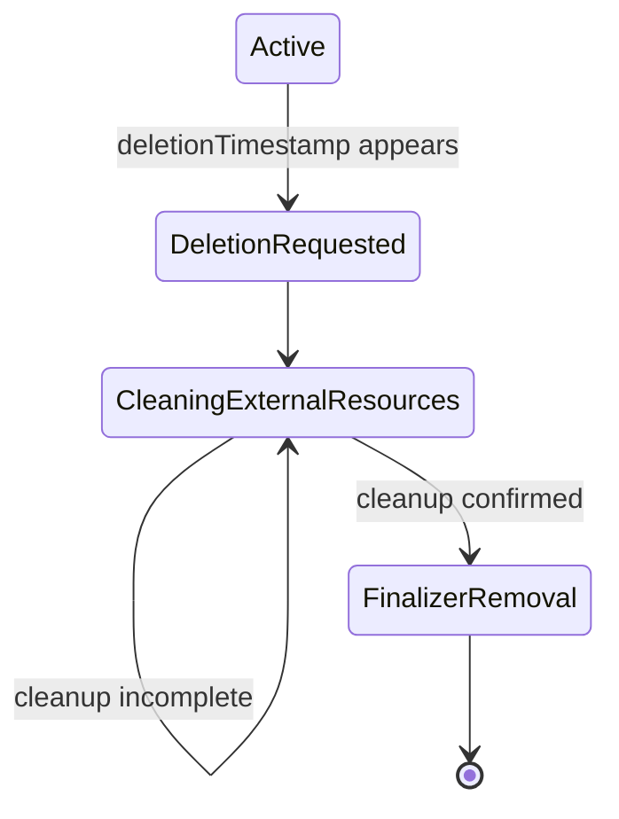
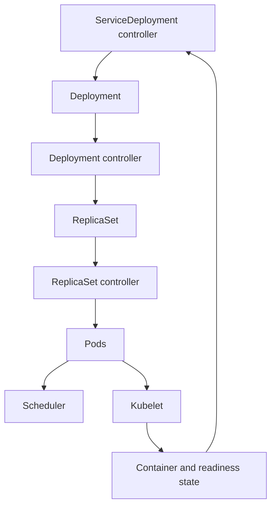

# 1. The core mental model

A state machine answers four questions:

1. **Where am I now?**
2. **Where should I be?**
3. **What is the smallest safe action that moves me closer?**
4. **After that action, what must I observe before continuing?**

For a Kubernetes controller:

```text
desired state = custom resource spec
actual state  = objects currently in the cluster
next action   = create, update, delete, wait, or report status
```

The controller repeatedly computes:

```text
reconcile(desired state, actual state) → next safe action
```

This is more important than thinking:

```text
event A → execute steps 1 through 10
```

Kubernetes events can be delayed, duplicated, combined, or missed. The controller must examine the current world and still make the correct decision.

---

# 2. Baby-room analogy

Imagine you tell a toddler:

> “Please make the room clean.”

That sentence is the **desired state**.

The room currently has:

- toys on the floor;
- books outside the shelf;
- an overturned chair.

That is the **actual state**.

A good helper repeatedly looks at the room:



The helper does not need to remember every action it previously performed. It can always look at the room again.

That is reconciliation.

A fragile helper thinks:

> “Yesterday I put away three toys, so today I must be at step four.”

If someone moves the toys overnight, its memory is now wrong.

A robust helper thinks:

> “Regardless of what happened yesterday, what is out of place right now?”

That is the central Kubernetes controller mental model.

---

# 3. The Kubernetes example

Suppose we create a custom resource called `ServiceDeployment`:

```yaml
apiVersion: apps.example.com/v1
kind: ServiceDeployment
metadata:
  name: payments
spec:
  image: example/payments:v2
  replicas: 3
  port: 8080
```

The controller is responsible for creating and maintaining:

- one `Deployment`;
- one `Service`;
- rollout status;
- deletion cleanup, if external resources exist.



The controller does not directly “run the service.” It manages Kubernetes resources that eventually cause other controllers, such as the Deployment controller and scheduler, to run Pods.

---

# 4. State is more than a single `phase`

It is tempting to model state like this:

```text
Pending → Deploying → Ready → Failed
```

That can be useful for explaining progress, but it is an incomplete representation.

The real state is a tuple:

```text
State =
    desired specification
  + observed Deployment
  + observed Service
  + observed Pods
  + external dependencies
  + deletion intent
  + last successfully observed generation
```

A phase is only a compressed view of that larger state.

## Baby analogy

A baby can simultaneously be:

- hungry;
- sleepy;
- safe;
- slightly unhappy.

Trying to represent all of this using one phase creates strange states:

```text
HungryAndSleepyButSafe
HungryNotSleepyAndSafe
HungryAndSleepyAndUnsafe
```

This is called **state explosion**.

Kubernetes Conditions are designed to represent independent facts:

```yaml
status:
  observedGeneration: 7
  conditions:
    - type: Available
      status: "True"
      reason: MinimumReplicasAvailable

    - type: Progressing
      status: "False"
      reason: RolloutComplete

    - type: Degraded
      status: "False"
      reason: Healthy
```

The resource can have several conditions simultaneously. This is usually better than forcing every possible combination into one `phase`.

---

# 5. A practical state design

A reasonable high-level state machine is:



But the controller should derive these states from observed facts:

| Derived state | Meaning |
|---|---|
| `Pending` | Reconciliation has not yet established the required children |
| `Progressing` | Children exist, but the desired revision is not fully ready |
| `Ready` | Service and Deployment match the specification and required replicas are available |
| `Degraded` | Progress is blocked or repeatedly failing |
| `Deleting` | Deletion was requested and cleanup remains |

Avoid making `Failed` permanently terminal unless recovery is genuinely impossible. Kubernetes systems are dynamic: credentials can be repaired, nodes can return, images can be published, and users can change the specification.

---

# 6. Separate desired, observed, and reported state

This separation prevents many controller bugs.



## `spec`: user-owned intent

```yaml
spec:
  image: example/payments:v2
  replicas: 3
```

The controller should not rewrite the user’s intent merely because it cannot currently satisfy it.

## Child resources: actual cluster state

```text
Deployment image: example/payments:v1
Available replicas: 2
Service exists: yes
```

## `status`: controller-owned observations

```yaml
status:
  observedGeneration: 7
  desiredRevision: "payments-7d87c9"
  readyReplicas: 2
  conditions:
    - type: Available
      status: "False"
      reason: InsufficientReplicas
      message: "2 of 3 replicas are available"
```

`status` should describe reality. It should not be used as a hidden command channel.

---

# 7. `generation` and `observedGeneration`

Suppose the user changes the image. Kubernetes increments:

```yaml
metadata:
  generation: 8
```

Until the controller processes that specification, status might say:

```yaml
status:
  observedGeneration: 7
```

This means:

> “The status you are reading describes generation 7, not the latest request.”

Only set:

```text
status.observedGeneration = metadata.generation
```

after the controller has successfully observed and handled that generation to the level its contract requires.

## Baby analogy

A parent gives instruction number 8:

> “Put the red toy in the box.”

The baby is still acting on instruction number 7.

The baby should not hold up a sign saying “done with instruction 8” until it has actually understood and handled instruction 8.

---

# 8. Design transitions from facts, not memories

A fragile design stores a “next step”:

```yaml
status:
  phase: CreatingService
  nextStep: CreateDeployment
```

This becomes dangerous if:

- the Service was manually deleted;
- the Deployment already exists;
- the controller crashed after creating something but before updating status;
- two reconciliations overlapped;
- the status update was rejected.

A robust controller recalculates the next action:

```text
if deleting:
    reconcile deletion
else if Service does not exist:
    create Service
else if Service differs:
    update Service
else if Deployment does not exist:
    create Deployment
else if Deployment differs:
    update Deployment
else if rollout is incomplete:
    wait and report progress
else:
    report Ready
```



Notice that every reconciliation can start from the top. No transition depends on the controller’s memory of the previous call.

---

# 9. The most important property: idempotency

An operation is idempotent when repeating it produces the same final result.

For example:

```text
Ensure Service has port 8080
```

is idempotent.

```text
Add port 8080 to the Service
```

may not be: every retry could append another port.

## Why retries are unavoidable

Consider this sequence:

```mermaid
sequenceDiagram
    participant C as Controller
    participant A as API server

    C->>A: Create Deployment
    A-->>C: Deployment created
    Note over C,A: Response is lost
    C->>C: Timeout; result is unknown
    C->>A: Reconcile again
    A-->>C: Deployment already exists
    C->>C: Compare it with desired state
    C->>A: Update only if necessary
```

The controller cannot know whether the first request succeeded. Therefore, “try again” must be safe.

## Good action

```text
Get child by deterministic name.
If missing, create it.
If present, compare and patch it.
```

## Bad action

```text
Every reconciliation creates a child with a random name.
```

The bad version can produce hundreds of Deployments during retries.

---

# 10. Perform one coherent correction at a time

A reconcile call should make bounded progress.

That does not strictly mean only one API request, but every group of changes should have understandable retry semantics.

For example:

```text
1. Ensure Service.
2. Return.
3. A new event triggers reconciliation.
4. Ensure Deployment.
5. Return.
6. Observe rollout.
```

This approach gives the system places to crash safely.

## Baby analogy

Do not tell a baby:

> “Pick up every toy, arrange all books, clean the table, fix the chair, and then tell me the exact result.”

Tell them:

> “Put this toy in the box.”

Then look again.

Small steps are easier to retry, inspect, and recover.

---

# 11. Good and bad state management

| Concern | Good | Bad |
|---|---|---|
| Source of truth | `spec` and observable resources | Controller process memory |
| State transitions | Derived from current facts | Assumed from the last event |
| Retries | Repeating actions is safe | Retry creates duplicates |
| Naming | Deterministic child names | Random name on every reconcile |
| Status | Reports observations | Drives hidden workflow commands |
| Errors | Preserve desired state and report blockage | Rewrite `spec` to match failure |
| Readiness | Based on the desired revision | Any old Pod being ready |
| Failures | Usually recoverable | Permanent `Failed` sink |
| Conditions | Independent facts | Huge list of combined phases |
| Deletion | Finalizer with observable cleanup | Remove finalizer before cleanup |
| Concurrency | Handle conflicts by re-reading | Overwrite newer state |
| Events | Hints to reconcile | Treated as an exact event log |

---

# 12. Bad example: event-driven scripting

```text
On ServiceDeployment creation:
    create Service
    create Deployment
    wait until Pods are ready
    update phase to Ready
```

Problems:

- What if the controller restarts while waiting?
- What if the Deployment is manually deleted later?
- What if the image changes?
- What if readiness belongs to the old revision?
- What if creating the Service succeeds but the response is lost?
- What if the controller receives the same event twice?
- What if no event arrives after drift?

This is a script triggered by an event, not a robust controller.

---

# 13. Good example: level-based reconciliation

Conceptually:

```go
func Reconcile(resource ServiceDeployment) {
    if resource.IsDeleting() {
        reconcileDeletion(resource)
        return
    }

    desiredService := buildService(resource)
    actualService := getService(resource)

    if !equivalent(actualService, desiredService) {
        ensureService(desiredService)
        return
    }

    desiredDeployment := buildDeployment(resource)
    actualDeployment := getDeployment(resource)

    if !equivalent(actualDeployment, desiredDeployment) {
        ensureDeployment(desiredDeployment)
        return
    }

    if !rolloutComplete(actualDeployment, resource.Generation) {
        reportProgressing(resource, actualDeployment)
        requeueLater()
        return
    }

    reportReady(resource)
}
```

Each function should express an invariant:

```text
ensureService:
    After success, a Service matching the relevant desired fields exists.

ensureDeployment:
    After success, a Deployment matching the desired revision exists.

reportReady:
    Status represents the latest observed generation and rollout.
```

This is a powerful design technique: define actions by their **postconditions**, not by the API calls they happen to make.

---

# 14. Invariants are more important than states

A state name tells you where the system appears to be. An invariant tells you what must always be true.

Useful invariants for this controller might be:

1. Every managed Deployment has an owner reference to its `ServiceDeployment`.
2. At most one stable Service selects the application.
3. A resource cannot be `Available=True` unless the latest desired revision is available.
4. `observedGeneration` never claims an unprocessed generation.
5. The controller never modifies fields owned by another controller.
6. A finalizer is removed only after external cleanup succeeds.
7. Reconciliation never creates two children for the same logical identity.

A controller can have perfect-looking phase transitions and still be incorrect if it violates these invariants.

---

# 15. Define ownership precisely

Suppose a Deployment contains:

```yaml
spec:
  replicas: 3
  template:
    spec:
      containers:
        - name: app
          image: example/payments:v2
```

Which fields does your controller own?

Possibilities include:

- image only;
- image and replicas;
- complete Pod template;
- labels needed for Service selection;
- rollout strategy.

Do not compare the entire live object byte-for-byte with your generated object. Kubernetes and other controllers add defaulted or managed fields.

Instead compare the fields in your contract:

```text
desired image       == actual image
desired replicas    == actual replicas
required labels     are present
Service selector    matches Pod labels
controller revision == desired generation/hash
```

## Baby analogy

You ask the baby to keep the toy shelf clean. Grandma adds a picture to the wall.

A bad controller says:

> “The room differs from my exact template!”  

and removes Grandma’s picture.

A good controller says:

> “I own the toy shelf. The picture is outside my responsibility.”

---

# 16. Conditions should answer operational questions

Good conditions help humans and other automation understand the resource.

For example:

```yaml
conditions:
  - type: Progressing
    status: "True"
    reason: RolloutInProgress
    message: "Revision payments-7d87c9 has 2 of 3 available replicas"

  - type: Available
    status: "False"
    reason: InsufficientReplicas
    message: "Waiting for one additional replica"

  - type: Degraded
    status: "False"
    reason: Healthy
```

A condition should normally contain:

- `type`: the question being answered;
- `status`: `True`, `False`, or `Unknown`;
- `reason`: stable, machine-readable category;
- `message`: useful human detail;
- `observedGeneration`: which request it describes;
- `lastTransitionTime`: when the condition’s status last changed.

Do not update `lastTransitionTime` merely because the message changed. It records a transition such as `False → True`, not every observation.

---

# 17. `Unknown` is a real state

Controllers often incorrectly report:

```yaml
type: Available
status: "False"
```

when they failed to read the Deployment.

But “I observed it is unavailable” and “I could not determine availability” are different.

Use:

```text
True    = evidence confirms the condition
False   = evidence disproves the condition
Unknown = insufficient or stale evidence
```

## Baby analogy

You ask, “Is the baby sleeping?”

- You see the baby sleeping: `True`.
- You see the baby playing: `False`.
- The camera is disconnected: `Unknown`.

A disconnected camera does not prove the baby is awake.

---

# 18. Readiness must belong to the desired revision

Suppose version `v1` has three healthy Pods. The user changes the image to `v2`.

Immediately after the change:

```text
old v1 available replicas: 3
new v2 available replicas: 0
```

The service has available Pods, but the latest request is not ready.



Status must distinguish:

- general service availability;
- rollout completion for the desired revision.

Otherwise the controller may report `Ready` based on old Pods.

A revision can be represented by:

- `metadata.generation`;
- a hash of relevant desired fields;
- the Deployment’s template hash;
- an explicit rollout identifier.

---

# 19. Failure is usually a condition, not a destination

A naive state machine uses:



This assumes failure is permanent.

But consider:

- image pull fails, then the registry recovers;
- quota is exceeded, then capacity is increased;
- a Secret is missing, then the user creates it;
- admission temporarily rejects requests;
- the specification changes.

A better model is:



You can still distinguish:

- **transient error:** retry with backoff;
- **user-correctable error:** report condition and watch for input changes;
- **permanent-for-this-generation error:** do not retry rapidly, but reconsider after the specification or dependency changes.

“Permanent” usually means “permanent given the current inputs,” not “forever.”

---

# 20. Requeueing is not state

Avoid storing:

```yaml
status:
  retryCount: 7
  nextRetryTime: ...
```

unless that data is part of the user-visible API contract or must survive restarts.

The work queue can normally manage transient retries and exponential backoff.

Keep a durable retry field only when business semantics require it—for example:

> “Attempt external database provisioning no more than five times across controller restarts.”

That is durable domain state, not merely controller scheduling state.

---

# 21. Optimistic concurrency

Multiple actors may update the same resource:

- the user updates `spec`;
- the controller updates `status`;
- Kubernetes updates metadata;
- another controller modifies a child;
- two reconciliation calls overlap.

Kubernetes uses `resourceVersion` to prevent an old write from silently overwriting a newer object.

```mermaid
sequenceDiagram
    participant A as Reconcile A
    participant B as Reconcile B
    participant K as API server

    A->>K: Read version 10
    B->>K: Read version 10
    B->>K: Update using version 10
    K-->>B: Success; version becomes 11
    A->>K: Update using version 10
    K-->>A: Conflict
    A->>K: Read version 11 and recompute
```

A conflict is not usually a system failure. It means:

> “Your observation is stale. Look again.”

Never blindly retry the identical stale update. Re-read and recompute.

---

# 22. Deletion is a state machine too

Kubernetes deletion is not always an immediate disappearance.

If external cleanup is necessary, use a finalizer:



Safe sequence:

1. Observe `deletionTimestamp`.
2. Stop creating normal resources.
3. Ensure external cleanup has completed.
4. Remove the finalizer.
5. Kubernetes deletes the custom resource.

Bad sequence:

1. Start asynchronous cleanup.
2. Remove the finalizer immediately.
3. Controller crashes.
4. Custom resource disappears.
5. External resources leak.

Again, cleanup must be idempotent. “Delete external resource if it exists” is safer than “issue deletion exactly once.”

---

# 23. The controller is part of a larger distributed state machine

Your controller does not control every transition.



Your controller requests a Deployment. It does not directly create ready containers.

Therefore, your state machine includes waiting states:

```text
Deployment requested
Deployment observed
ReplicaSet created
Pods scheduled
Containers started
Readiness passed
Desired replicas available
```

But your custom resource may not need to persist each of those as a separate phase. Many are already represented by child-resource status.

A good controller aggregates relevant information instead of duplicating every downstream state.

---

# 24. A deeper mathematical model

You can model reconciliation as:

```text
D = desired state
O = observed state
A = possible action
S = reported status

transition(D, O) → (A, S)
```

After action `A`, the world may change:

```text
O' = environment(O, A, concurrent actors, failures)
```

Then reconciliation runs again:

```text
transition(D, O') → (A', S')
```

The system converges when:

```text
satisfies(O, D) = true
```

and therefore:

```text
A = no-op
```

The goal is not to execute a predetermined path. The goal is to reach and maintain a set of acceptable states.

This matters because there may be many valid actual states:

```text
Three desired replicas can be running on many different nodes.
Pod names may differ.
IP addresses may differ.
Defaulted fields may differ.
Timestamps will differ.
```

Define equality semantically:

```text
satisfies(actual, desired)
```

not literally:

```text
actual == desired byte-for-byte
```

---

# 25. Safety and liveness

Two powerful ways to reason about a controller are:

## Safety

> “Something bad never happens.”

Examples:

- never route traffic to an unready revision;
- never delete the active Deployment before the replacement is usable;
- never remove the finalizer before cleanup;
- never manage another owner’s Deployment.

## Liveness

> “Something good eventually happens.”

Examples:

- if resources and dependencies remain available, the service eventually becomes ready;
- a corrected specification eventually recovers from degradation;
- deletion eventually completes once cleanup succeeds.

A controller that is safe but has no liveness might wait forever.

A controller with liveness but poor safety might reach `Ready` by briefly taking the service offline.

You need both.

---

# 26. Test the state machine as a transition table

Before writing controller code, make a table like this:

| Desired input | Observed world | Expected action | Expected status |
|---|---|---|---|
| Generation 1 | No Service | Create Service | `Progressing=True` |
| Generation 1 | Service exists, no Deployment | Create Deployment | `Progressing=True` |
| Generation 1 | Deployment has wrong image | Patch Deployment | `Progressing=True` |
| Generation 1 | 2/3 desired replicas ready | No mutation; requeue | `Available=False` |
| Generation 1 | 3/3 desired replicas ready | No mutation | `Available=True` |
| Generation 2 | Old generation ready | Start/update rollout | `Progressing=True` |
| Generation 2 | API read failed | Retry | `Available=Unknown` |
| Any | Deletion requested | Reconcile cleanup | `Deleting` |
| Any | External cleanup complete | Remove finalizer | deletion proceeds |

Then test every row twice.

The second execution should not create extra side effects. That is a straightforward idempotency test.

Also test starting from “impossible” or unexpected combinations:

- status says Ready, but Deployment is missing;
- Service exists, but Deployment does not;
- child has the wrong owner;
- finalizer exists, but cleanup already happened;
- new generation arrives during deletion;
- child is ready, but status is stale.

A robust state machine repairs these combinations rather than assuming they cannot occur.

---

# 27. A reusable design checklist

When designing any controller state machine, ask:

1. What is the authoritative desired state?
2. What facts can be observed from the world?
3. Which facts must survive controller restarts?
4. Which information can be derived instead of stored?
5. What fields does this controller own?
6. What invariants must never be violated?
7. Is every action safe to repeat?
8. What happens if the action succeeds but its response is lost?
9. Can every degraded state recover?
10. Does readiness describe the latest generation?
11. What does `Unknown` mean?
12. How does deletion work after a crash?
13. What happens when objects are manually changed?
14. What happens when two reconciliations overlap?
15. Can the controller always restart using only API-visible state?

The final question is an excellent quality test:

> If the controller loses all in-memory information and restarts, can it reconstruct the correct next action by reading Kubernetes and external systems?

If the answer is yes, you probably have a healthy controller design.

The deepest mental model is this:

> A good state machine does not remember a perfect story about how the system got here. It observes where the system is, protects its invariants, and takes a safe, repeatable step toward where it should be.
