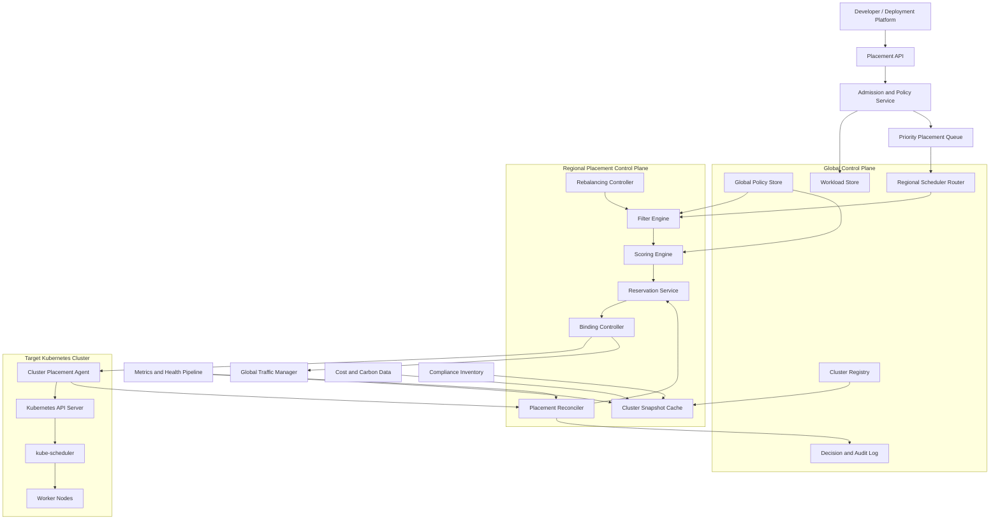
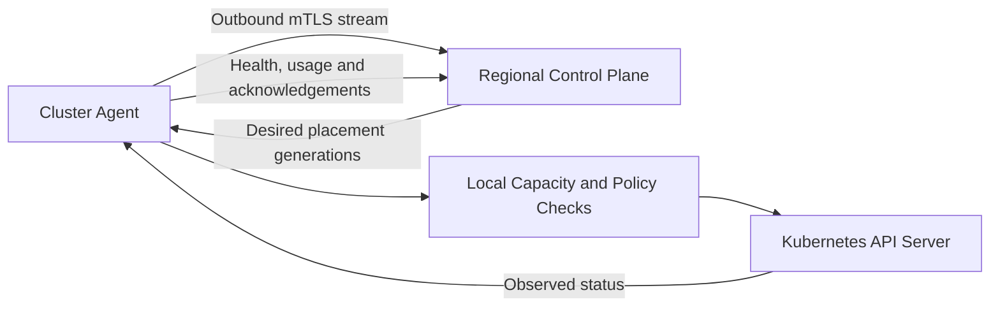
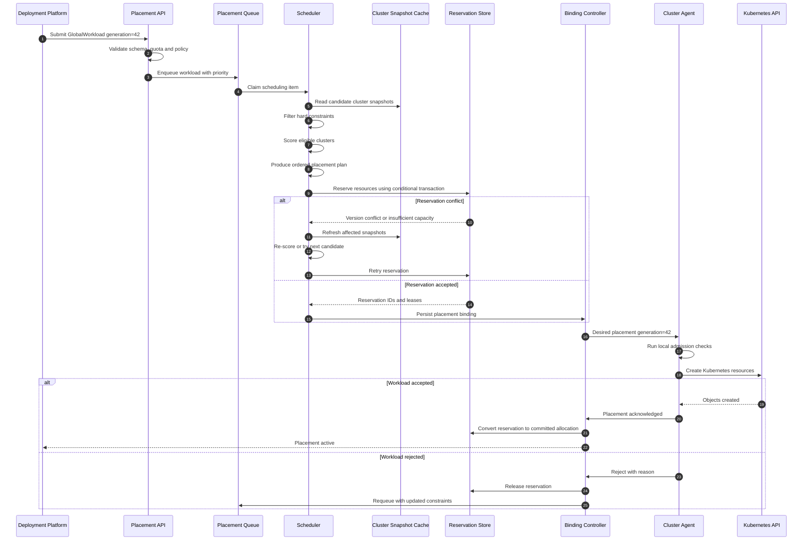
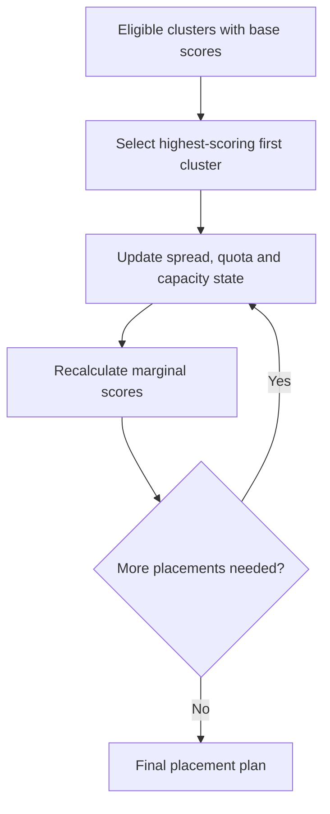
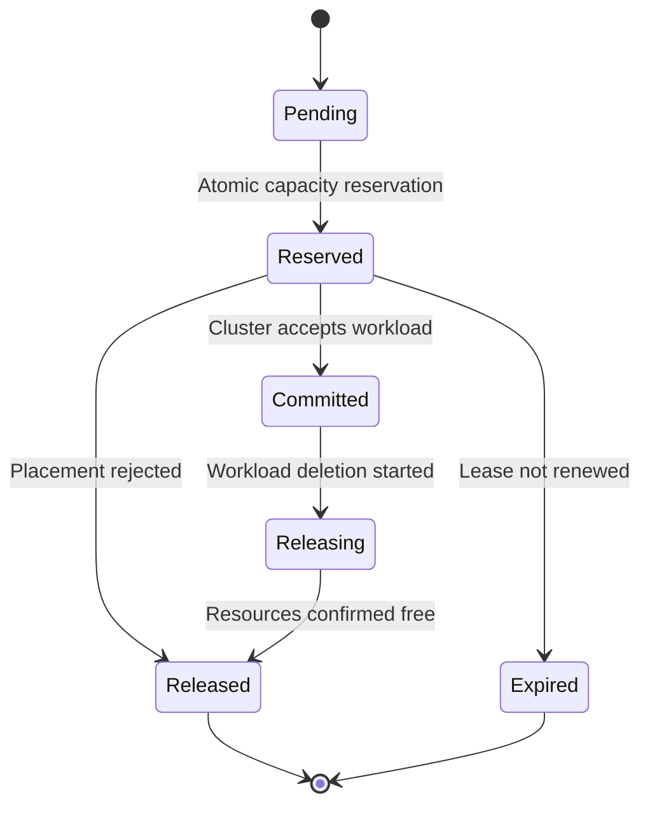
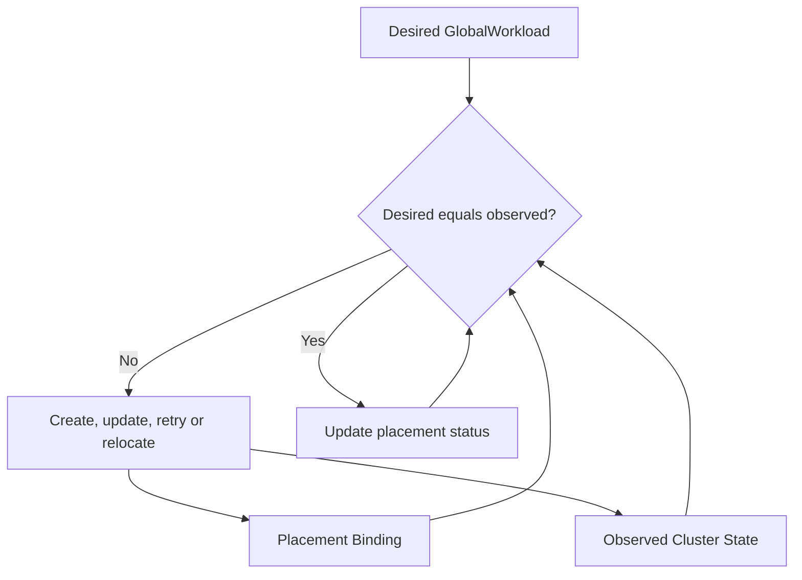
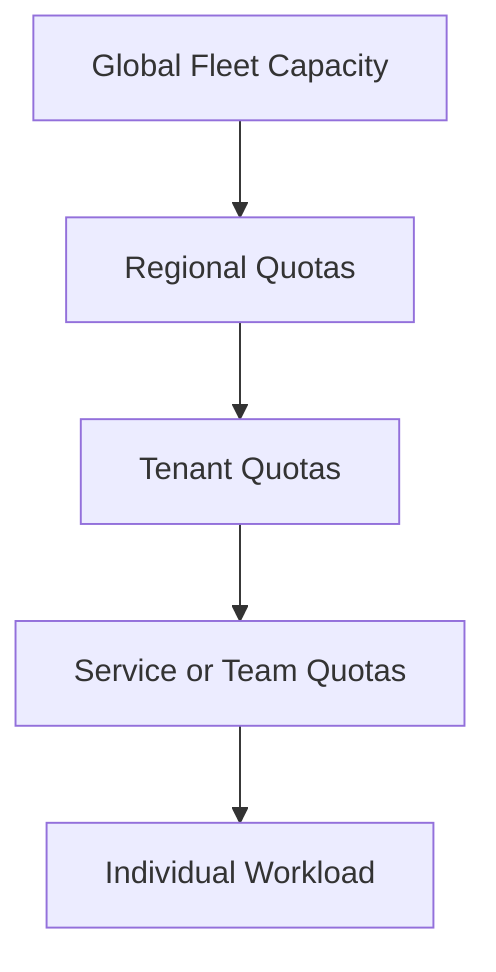
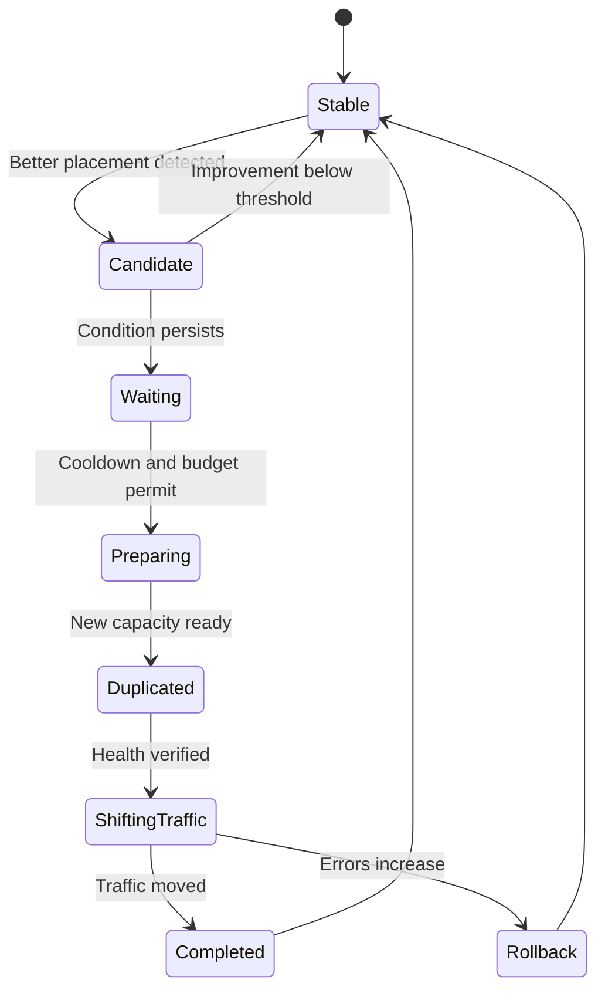
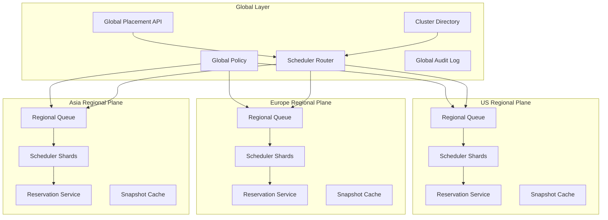

# Design a Global Workload-Placement and Scheduling System

The system decides **which Kubernetes cluster or set of clusters should receive a workload**. It does not replace the Kubernetes scheduler inside each cluster.

The scheduling hierarchy is:

```text
Global placement system
    ↓ selects cluster(s)
Regional or cluster deployment controller
    ↓ creates Kubernetes objects
kube-scheduler
    ↓ selects node
kubelet
    ↓ starts containers
```

The global scheduler answers:

> “Should this workload run in `eu-west-prod-17`, `eu-central-prod-04`, or somewhere else?”

The Kubernetes scheduler answers:

> “Which node inside `eu-west-prod-17` should run this Pod?”

---

# 1. Clarify the requirements

Before proposing the design, I would ask the interviewer several questions.

## Workload model

1. Are we placing an entire workload into one cluster?
2. Can replicas be distributed across multiple clusters?
3. Are workloads stateless, stateful, batch, GPU, or all of them?
4. Is live migration required?
5. Who controls traffic routing after placement?

For this design, assume:

* 1,000–10,000 Kubernetes clusters.
* 20–50 geographical regions.
* Millions of workload placement decisions per day.
* Stateless, stateful, batch, GPU, and machine-learning workloads.
* A workload can require one cluster or multiple clusters.
* Placement decisions must normally complete within seconds.
* Cluster state is eventually consistent.
* Resource reservations must prevent overcommit.
* The system must tolerate regional control-plane failures.

---

# 2. Functional requirements

The system must:

1. Register and inventory clusters.
2. Collect capacity, health, cost, topology, version, and compliance data.
3. Accept workload placement requests.
4. Filter clusters that violate hard constraints.
5. Score eligible clusters.
6. reserve resources atomically.
7. Bind workloads to clusters.
8. Deliver deployment instructions.
9. Observe whether the workload was successfully created.
10. Retry or select another cluster when placement fails.
11. Re-evaluate placement when cluster or workload conditions change.
12. Support quotas, fairness, priority, preemption, and tenant isolation.
13. Explain why a cluster was selected or rejected.
14. Roll out new scheduling logic safely.

---

# 3. Non-functional requirements

| Requirement             |                                        Target |
| ----------------------- | --------------------------------------------: |
| Placement availability  |                                        99.99% |
| Placement latency       |                           p99 under 5 seconds |
| Cluster-state freshness |                     normally under 30 seconds |
| Reservation correctness |                        no accepted overcommit |
| Auditability            |                   every placement explainable |
| Scale                   |                         thousands of clusters |
| Recovery                |         no duplicate deployment after retries |
| Regional isolation      |  one regional failure must not stop the fleet |
| Determinism             |    identical inputs produce identical ranking |
| Blast radius            | scheduler rollout limited by region or tenant |

The central design tension is:

> Cluster state may be stale, but resource commitment must still be safe.

The solution is to allow eventual consistency for telemetry while using strongly coordinated reservations for capacity commitment.

---

# 4. High-level architecture



---

# 5. Major components

## 5.1 Placement API

Receives requests such as:

```yaml
apiVersion: placement.platform.example/v1
kind: GlobalWorkload
metadata:
  name: recommendation-api
  tenant: music
spec:
  replicas: 300

  resources:
    cpu: "600"
    memory: "1200Gi"

  hardConstraints:
    allowedRegions:
      - eu-west
      - eu-central

    compliance:
      - GDPR

    kubernetesVersion:
      minimum: "1.34"

    capabilities:
      - cilium
      - workload-identity-v2

  preferences:
    latency:
      clientRegion: eu-west
      weight: 30

    cost:
      weight: 20

    availableCapacity:
      weight: 25

    failureDomainSpread:
      weight: 25

  distribution:
    minimumClusters: 3
    maximumClusters: 5
    maxPercentPerCluster: 40

  relocationPolicy:
    mode: automatic
    minimumImprovementPercent: 20
    cooldown: 6h
```

The API should be declarative. The user specifies desired outcomes and constraints, not a cluster name.

---

## 5.2 Cluster Registry

The registry stores relatively static cluster metadata.

```yaml
clusterID: eu-west-prod-017
region: eu-west
country: ireland
environment: production
provider: private-cloud
kubernetesVersion: 1.35.2

failureDomain:
  region: eu-west
  zone: eu-west-2a
  datacenter: dub-03
  powerDomain: pdu-17

capabilities:
  gpuTypes:
    - h100
  cni: cilium
  storageClasses:
    - local-nvme
    - replicated-ssd
  workloadIdentity: spiffe

compliance:
  - GDPR
  - ISO27001

lifecycle:
  state: ACTIVE
  upgradeRing: ring-2
```

The registry is not the source of dynamic capacity. Dynamic capacity comes from the telemetry and reservation systems.

---

## 5.3 Cluster placement agent

Each cluster runs an agent that:

* Reports capacity and health.
* Receives desired placements.
* Validates local feasibility.
* Creates namespaces, quotas, Deployments, StatefulSets, or custom resources.
* Reports deployment status.
* Renews reservations.
* Buffers status updates during temporary network loss.
* Detects local drift.
* Rejects placements when local safety checks fail.

The agent should normally establish an outbound connection to the regional control plane. This works better through firewalls and private networks.



A hybrid model is useful:

* **Pull/streaming agent** for desired-state delivery.
* **Event publication** for telemetry.
* **Direct API reads** only for troubleshooting or reconciliation.

---

## 5.4 Cluster snapshot service

Schedulers should not synchronously query thousands of clusters for every scheduling decision. Instead, they operate on a local snapshot cache.

A snapshot includes:

```go
type ClusterSnapshot struct {
    ClusterID string

    Capacity ResourceVector
    Allocated ResourceVector
    Reserved ResourceVector

    Health ClusterHealth
    Capabilities CapabilitySet
    Compliance ComplianceSet
    Topology FailureTopology

    Cost CostModel
    Latency LatencyMatrix

    ObservedAt time.Time
    Version    uint64
}
```

Effective free capacity is:

```text
effectiveFree =
    allocatable
  - runningAllocation
  - activeReservations
  - operationalHeadroom
  - uncertaintyBuffer
```

The uncertainty buffer grows as telemetry becomes older.

For example:

```text
snapshot age < 15 seconds  → reserve 10% safety margin
snapshot age 15–30 seconds → reserve 20% safety margin
snapshot age 30–60 seconds → reserve 40% safety margin
snapshot age > 60 seconds  → reject for normal placement
```

---

# 6. End-to-end placement flow



---

# 7. Scheduling algorithm

The scheduler uses a Kubernetes-style pipeline:

```text
PreFilter
Filter
PostFilter
Score
NormalizeScore
Select
Reserve
Permit
Bind
PostBind
```

For global placement:

```mermaid
flowchart LR
    REQUEST[Placement Request]
    PREFILTER[Pre-filter and derive requirements]
    FILTER[Hard constraint filtering]
    SCORE[Soft constraint scoring]
    PLAN[Multi-cluster plan]
    RESERVE[Atomic reservation]
    PERMIT[Optional policy approval]
    BIND[Persist binding]
    APPLY[Cluster agent applies workload]

    REQUEST --> PREFILTER
    PREFILTER --> FILTER
    FILTER --> SCORE
    SCORE --> PLAN
    PLAN --> RESERVE
    RESERVE --> PERMIT
    PERMIT --> BIND
    BIND --> APPLY
```



---

## 7.1 Pre-filter

Pre-filter calculates data that is common to every candidate.

Examples:

* Total CPU and memory required.
* Number of replicas.
* Minimum number of clusters.
* Required storage classes.
* Compliance requirements.
* Tenant quota.
* Resource fragmentation requirements.
* Required Kubernetes and platform versions.

For a workload with 300 replicas:

```yaml
perReplica:
  cpu: 2
  memory: 4Gi

total:
  cpu: 600
  memory: 1200Gi
```

If the workload allows a maximum of 40% of replicas per cluster:

```text
maximum replicas per cluster = 300 × 0.40 = 120
```

---

## 7.2 Hard-constraint filtering

A cluster is either eligible or ineligible.

Typical filters:

| Filter               | Example                                   |
| -------------------- | ----------------------------------------- |
| Cluster lifecycle    | Must be `ACTIVE`                          |
| Cluster health       | API server and nodes healthy              |
| Region               | Must be in EU                             |
| Compliance           | Must support GDPR                         |
| Kubernetes version   | Must be at least 1.34                     |
| Capability           | Must support H100 GPUs                    |
| Capacity             | Must have sufficient safe capacity        |
| Storage locality     | Required dataset or volume available      |
| Network connectivity | Must reach dependency network             |
| Tenant isolation     | Tenant allowed on cluster                 |
| Quota                | Tenant regional quota available           |
| Upgrade state        | Cluster not draining or upgrading         |
| Failure domain       | Must not violate spread requirements      |
| Maintenance window   | No imminent maintenance                   |
| Platform components  | Required service mesh or identity version |

Example:

```text
10,000 registered clusters
  ↓ environment=production
  4,100
  ↓ allowed region
  620
  ↓ GDPR compliant
  510
  ↓ required Kubernetes version
  470
  ↓ healthy and not upgrading
  392
  ↓ sufficient CPU and memory
  81
  ↓ required network connectivity
  54 eligible clusters
```

Reject reasons must be recorded:

```json
{
  "cluster": "eu-west-prod-009",
  "eligible": false,
  "reasons": [
    {
      "filter": "MinimumKubernetesVersion",
      "expected": ">=1.34",
      "actual": "1.33.7"
    }
  ]
}
```

This is important for debugging and tenant trust.

---

## 7.3 Scoring eligible clusters

Each scoring plugin returns a normalized score from 0 to 100.

```text
FinalScore(cluster) =
    Wcapacity  × CapacityScore
  + Wlatency   × LatencyScore
  + Wcost      × CostScore
  + Whealth    × HealthScore
  + Wspread    × SpreadScore
  + Wlocality  × LocalityScore
  + Wstability × StabilityScore
  - penalties
```

Example weights:

| Score                 | Weight |
| --------------------- | -----: |
| Available capacity    |     25 |
| Latency               |     25 |
| Cost                  |     15 |
| Failure-domain spread |     20 |
| Cluster health        |     10 |
| Software stability    |      5 |

Weights can vary by workload class.

For a latency-sensitive user-facing service:

```text
latency weight = 35
cost weight = 10
```

For offline batch processing:

```text
latency weight = 5
cost weight = 40
```

---

## 7.4 Capacity scoring

Capacity scoring should consider both available resources and fragmentation.

Naive scoring:

```text
CPU free percentage = free CPU / total CPU
memory free percentage = free memory / total memory
```

This is insufficient because a cluster may have large aggregate capacity but no nodes capable of fitting the workload.

A better score includes:

```text
CapacityScore =
  0.40 × aggregateHeadroom
+ 0.30 × nodeFitProbability
+ 0.20 × postPlacementBalance
+ 0.10 × burstHeadroom
```

For GPU workloads, score exact GPU availability rather than total GPU count.

```text
Cluster A: 16 free H100 GPUs, but fragmented as 1 per node
Cluster B: 8 free H100 GPUs, with 8 on one node

A workload requiring 8 GPUs on one node must select Cluster B.
```

The global scheduler can use summarized node-shape histograms:

```yaml
nodeShapes:
  - shape:
      cpu: 96
      memory: 768Gi
      gpu:
        h100: 8
    totalNodes: 50
    freeNodes: 7
```

---

## 7.5 Latency scoring

Latency can include:

* User-to-region latency.
* Cluster-to-database latency.
* Service-to-service dependency latency.
* Inter-cluster replication latency.
* Cross-region network reliability.

Example:

```text
LatencyScore = max(0, 100 - normalizedLatencyPenalty)
```

For a dependency graph:

```yaml
dependencies:
  - service: user-profile
    maximumP95Latency: 20ms
  - database: music-catalog-eu
    maximumP95Latency: 10ms
```

A network topology service can maintain latency matrices:

```text
cluster → dependency endpoint
region  → user population
region  → region
```

Avoid using a single recent latency sample. Use rolling percentiles and confidence intervals.

---

## 7.6 Cost scoring

Cost includes more than VM price:

```text
Total placement cost =
    compute cost
  + storage cost
  + network egress
  + reserved capacity opportunity cost
  + software licensing
  + operational overhead
```

For data-intensive workloads, egress can dominate compute cost.

A cost score should therefore be workload-specific:

```text
EstimatedCost =
    requestedCPUHours × regionCPUPrice
  + requestedMemoryHours × regionMemoryPrice
  + expectedEgressGB × egressPrice
  + storageGB × storagePrice
```

---

## 7.7 Failure-domain scoring

The scheduler should avoid concentrating replicas in the same:

* Cluster.
* Availability zone.
* Datacenter.
* Power domain.
* Network fabric.
* Cloud provider.
* Control-plane failure domain.

Example spread policy:

```yaml
distribution:
  minimumClusters: 3

  topologyConstraints:
    - key: region
      minimumDistinctValues: 2

    - key: zone
      minimumDistinctValues: 3

    - key: powerDomain
      maxPercent: 40
```

The score should consider placements already made for the same workload.

The first placement might select the highest-scoring cluster. Later selections should receive anti-affinity penalties.

```text
AdjustedScore(cluster) =
    BaseScore(cluster)
  - sameRegionPenalty
  - sameZonePenalty
  - samePowerDomainPenalty
```

---

# 8. Multi-cluster planning

Selecting the top three clusters independently can produce a poor global result.

Example:

```text
Cluster A: score 95, eu-west-1a
Cluster B: score 94, eu-west-1a
Cluster C: score 93, eu-west-1a
Cluster D: score 89, eu-central-1a
```

Selecting A, B, and C violates regional diversity.

Therefore, scheduling should produce a **placement plan**, not just independent rankings.



This is a constrained optimization problem.

For most online systems, a greedy algorithm with recalculated marginal scores is sufficient:

1. Select the best candidate.
2. Subtract reserved capacity.
3. Add topology concentration penalties.
4. Recalculate tenant and regional utilization.
5. Select the next candidate.
6. Repeat.

For highly valuable or very large placements, the system can use integer programming or constraint solving asynchronously, but the normal scheduling path should remain bounded and predictable.

---

# 9. Reservation protocol

Reservation is the most important correctness boundary.

Two schedulers may concurrently select the same cluster based on the same capacity snapshot.

Suppose:

```text
Cluster free capacity: 1,000 CPU

Scheduler A wants: 700 CPU
Scheduler B wants: 600 CPU
```

Both see 1,000 CPU available. Without reservation, both bind, producing 1,300 CPU demand.

## 9.1 Strongly consistent reservation ledger

Maintain a reservation ledger partitioned by cluster.

```yaml
clusterID: eu-west-prod-017
capacityVersion: 824417

allocatable:
  cpu: 10000
  memory: 40Ti

committed:
  cpu: 8000
  memory: 31Ti

reserved:
  cpu: 500
  memory: 2Ti
```

A reservation request contains:

```yaml
reservationID: res-98273
workloadID: recommendation-api
generation: 42
clusterID: eu-west-prod-017

resources:
  cpu: 600
  memory: 1200Gi

expectedCapacityVersion: 824417
leaseDuration: 120s
```

The transaction succeeds only when:

```text
expected version == current version

and

allocatable
- committed
- reserved
- safety margin
>= requested resources
```

On success:

```text
reserved += requested
capacityVersion++
```

This can be implemented using:

* Compare-and-swap in a strongly consistent database.
* A transactional relational database.
* A consensus-backed key-value store.
* Single-writer cluster partitions.

---

## 9.2 Reservation leases

Reservations must expire if the scheduler crashes.

State machine:



Reservation leases prevent abandoned reservations from permanently consuming capacity.

However, lease expiry does not automatically mean the workload was not created. Reconciliation must check the cluster before releasing capacity after an ambiguous failure.

---

## 9.3 Idempotency

Every request uses:

```text
idempotency key = workload ID + workload generation
```

Repeated processing of the same generation must return the same binding or resume the existing operation.

The binding record should be persisted before dispatch:

```yaml
workloadID: recommendation-api
generation: 42
placementRevision: 7

targets:
  - clusterID: eu-west-prod-017
    reservationID: res-98273
    replicas: 100
    state: DISPATCHED
```

The agent also remembers the highest processed placement generation.

This prevents duplicate deployments when messages are retried.

---

# 10. Binding the workload

After reservation, the system creates a durable binding.

```yaml
apiVersion: placement.platform.example/v1
kind: WorkloadBinding
metadata:
  name: recommendation-api-generation-42
spec:
  workloadRef: recommendation-api
  placements:
    - clusterID: eu-west-prod-017
      replicas: 100
      reservationID: res-98273

    - clusterID: eu-central-prod-004
      replicas: 100
      reservationID: res-98274

    - clusterID: eu-west-prod-021
      replicas: 100
      reservationID: res-98275

status:
  phase: Applying
```

A cluster-specific desired-state object is then delivered to each agent:

```yaml
clusterID: eu-west-prod-017
generation: 42

resources:
  - apiVersion: apps/v1
    kind: Deployment
    metadata:
      name: recommendation-api
      namespace: music-recommendation
    spec:
      replicas: 100
```

The cluster agent performs final local admission checks:

* Namespace quota.
* Local policy.
* Current node capacity.
* Storage availability.
* API-server health.
* Required platform components.
* Tenant authorization.

If local admission fails, the agent rejects the placement and supplies a structured reason.

---

# 11. Reconciliation loop

The system is declarative and continuously reconciled.



The reconciler compares:

```text
desired placement
versus
durable binding
versus
agent acknowledgement
versus
actual Kubernetes objects
versus
observed workload health
```

Examples of drift:

* Binding says 100 replicas, cluster has 80.
* Workload object is missing.
* Cluster has become unreachable.
* Reservation exists but no binding exists.
* Binding exists but reservation expired.
* Workload exists without a corresponding global binding.

Each inconsistency has an explicit repair action.

---

# 12. Handling stale capacity information

This is a likely interview follow-up.

No distributed system with thousands of clusters can maintain perfectly fresh telemetry. The design should make stale data safe rather than pretending it can eliminate staleness.

Use several mechanisms together.

## 12.1 Versioned snapshots

Every cluster snapshot carries:

```text
cluster ID
observation timestamp
monotonic version
source health
confidence level
```

The scheduler records the snapshot version used for the decision.

---

## 12.2 Freshness thresholds

```text
Fresh:
  age < 15 seconds
  normal scheduling

Degraded:
  age 15–60 seconds
  increased safety buffer

Stale:
  age > 60 seconds
  no new normal-priority placements

Unknown:
  disconnected or invalid metrics
  emergency-only placement if explicitly allowed
```

Thresholds should vary by workload class. A batch workload can tolerate older capacity data than a latency-critical production service.

---

## 12.3 Safety margins

Do not schedule to 100% reported capacity.

```text
schedulable capacity =
    physical allocatable
  - platform reserve
  - failure reserve
  - telemetry uncertainty
  - fragmentation reserve
```

Example:

```text
Physical CPU:             10,000
Current allocation:        7,500
Existing reservations:       300
Platform safety reserve:      500
Staleness buffer:             400
----------------------------------
Schedulable CPU:            1,300
```

---

## 12.4 Reservation as source of truth

Telemetry is an estimate. The reservation ledger is authoritative for uncommitted global allocations.

Every accepted placement must pass the reservation transaction.

---

## 12.5 Local admission check

The cluster agent performs a final check using local real-time information.

This creates a layered model:

```text
Global snapshot:
  fast and scalable candidate selection

Reservation ledger:
  concurrent commitment protection

Local agent:
  current feasibility validation

kube-scheduler:
  actual node-level placement
```

---

## 12.6 Event-driven updates

Important changes should be pushed immediately rather than waiting for periodic telemetry:

* Cluster becomes unhealthy.
* Cluster begins an upgrade.
* Capacity drops sharply.
* Storage becomes unavailable.
* Network partition detected.
* Large placement committed.
* Node pool enters maintenance.

Periodic full snapshots remain necessary to repair missed events.

---

# 13. Preventing two schedulers from selecting the same capacity

Multiple schedulers may rank the same cluster. That is acceptable.

The correctness rule is:

> Multiple schedulers may select the same candidate, but they may not both successfully reserve unavailable capacity.

Approaches:

## Preferred: optimistic concurrency

Each cluster capacity record has a version.

```text
Scheduler A:
  reads version 100
  reserves 700 CPU
  CAS version 100 → success
  new version 101

Scheduler B:
  read version 100
  reserves 600 CPU
  CAS version 100 → failure
  refresh and retry
```

Advantages:

* High concurrency.
* No long-held locks.
* Simple retry semantics.
* Schedulers remain stateless.

## Alternative: single-writer partition

Hash each cluster to one reservation owner.

```text
owner shard = hash(clusterID) mod reservationShardCount
```

All reservations for one cluster are serialized through the owner.

Advantages:

* Simpler capacity accounting.
* Predictable order.

Disadvantages:

* Hot clusters may become hot partitions.
* Shard failover must preserve ordering.

A practical design can combine them:

* Single logical owner per cluster.
* Transactional backing store for failover correctness.

---

# 14. Scheduling large tenants

Large tenants create several risks:

* They can monopolize high-quality clusters.
* A large placement can starve smaller requests.
* One scheduling request may touch hundreds of clusters.
* Their retries can overload the control plane.
* They can consume an entire region.

Use hierarchical quotas and fairness.



## 14.1 Quota dimensions

Quotas may apply to:

* CPU.
* Memory.
* GPU type.
* Persistent storage.
* Number of clusters.
* Number of regions.
* API operations.
* Reservation rate.
* Premium capacity classes.

---

## 14.2 Dominant Resource Fairness

CPU-only quota can be unfair.

Example:

```text
Tenant A uses:
  20% CPU
  80% GPU

Tenant B uses:
  60% CPU
  10% GPU
```

Dominant Resource Fairness considers the largest proportional resource consumption.

```text
dominant share =
    max(
      tenant CPU / total CPU,
      tenant memory / total memory,
      tenant GPU / total GPU
    )
```

The scheduling queue can prefer tenants with lower dominant shares while still respecting priorities.

---

## 14.3 Chunk large placements

Do not reserve 100 clusters in one large transaction.

Break large requests into placement batches:

```text
Phase 1: reserve minimum viable capacity
Phase 2: activate workload
Phase 3: expand incrementally
```

For example:

```text
Desired: 50,000 CPU across 100 clusters

Batch 1: 10 clusters
Validate rollout
Batch 2: 20 clusters
Validate
Batch 3: remaining clusters
```

This reduces contention and blast radius.

---

# 15. Avoiding one region receiving all traffic

Capacity-based scoring alone tends to create hotspots. A newly provisioned region may look attractive and receive most new workloads.

Use explicit regional control.

## 15.1 Regional quotas

```yaml
regionalLimits:
  eu-west:
    maxFleetUtilization: 70
  eu-central:
    maxFleetUtilization: 70
```

---

## 15.2 Target utilization bands

Instead of always selecting the emptiest region, define target ranges.

```text
Preferred utilization: 55–70%
Warning zone:          70–80%
Hard placement limit:  80%
```

A region below 55% receives a modest bonus, not an unlimited one.

---

## 15.3 Concentration penalty

```text
RegionPenalty =
    f(
      workload replicas already in region,
      tenant allocation in region,
      global fleet allocation in region
    )
```

For example:

```text
more than 50% of workload in one region → strong penalty
more than 70% of tenant capacity in one region → reject
```

---

## 15.4 Capacity budgets

Regional operators can publish placement budgets:

```yaml
region: eu-west
capacityClass: production-general
placementBudget:
  cpuPerMinute: 5000
  maxConcurrentLargePlacements: 5
```

This avoids sudden capacity shocks.

---

## 15.5 Traffic-aware placement

Placement and traffic management must cooperate.

Creating 50% of replicas in a region does not necessarily mean 50% of traffic should go there.

The workflow should be:

```text
Place capacity
→ verify readiness
→ gradually shift traffic
→ observe latency and errors
→ continue or roll back
```

---

# 16. When should an existing workload be moved?

Do not continuously move workloads just because another cluster scores slightly higher.

Migration has costs:

* Cache cold starts.
* Data replication.
* Connection draining.
* Temporary duplicate capacity.
* Increased risk.
* User-visible latency.
* Operational instability.

Use separate triggers for mandatory and optional movement.

## Mandatory movement

Move when:

* Cluster is being decommissioned.
* Compliance becomes invalid.
* Required software version is no longer supported.
* Cluster is persistently unhealthy.
* Tenant isolation policy changes.
* Capacity is no longer sufficient.
* Region must be evacuated.
* Storage or network dependency is no longer reachable.

## Optional optimization

Move for:

* Lower cost.
* Improved latency.
* Better load distribution.
* Reduced carbon intensity.
* Improved failure-domain spread.
* Cluster defragmentation.

Optional movement should require:

```text
expected benefit > migration cost + safety margin
```

Example policy:

```yaml
relocationPolicy:
  minimumScoreImprovement: 20
  minimumCostSavingsPercent: 15
  violationDuration: 30m
  cooldownAfterMove: 12h
  maximumMovesPerDay: 2
```

This introduces hysteresis.

---

## 16.1 Rebalancing state machine



For stateless services, use create-before-delete.

For stateful services:

1. Replicate data.
2. Validate consistency.
3. Promote the new replica.
4. Shift traffic.
5. Drain the old location.
6. Delete only after safety checks.

---

# 17. Keeping placement deterministic

Determinism matters for:

* Debugging.
* Replaying decisions.
* Stable tests.
* Avoiding workload oscillation.
* Comparing scheduler versions.

Use the following rules.

## 17.1 Immutable scheduling input

Every decision references:

```text
workload generation
policy version
cluster snapshot versions
scheduler version
feature flags
random seed, if used
```

---

## 17.2 Stable normalization

Do not normalize scores based on unordered map iteration.

Sort candidates by cluster ID before scoring.

---

## 17.3 Stable tie-breaking

Use:

```text
primary: final score descending
secondary: stable hash(workloadID, clusterID)
tertiary: clusterID ascending
```

A stable hash avoids always preferring lexicographically smaller clusters while remaining deterministic.

```text
tieBreak = hash(workloadID + placementGeneration + clusterID)
```

Do not use the current timestamp as a random seed.

---

## 17.4 Integer or fixed-point scores

Floating-point calculations may produce minor platform-dependent differences.

Prefer integer or fixed-point calculations:

```text
latency score = 8732 out of 10000
capacity score = 9210 out of 10000
```

---

## 17.5 Decision record

Persist an explanation:

```json
{
  "workload": "recommendation-api",
  "generation": 42,
  "schedulerVersion": "placement-scheduler-2.7.1",
  "policyVersion": "music-production-18",
  "selectedCluster": "eu-west-prod-017",
  "finalScore": 87.42,
  "componentScores": {
    "capacity": 93,
    "latency": 88,
    "cost": 64,
    "spread": 96,
    "health": 91
  },
  "snapshotVersion": 824417,
  "tieBreaker": 13883362
}
```

This supports exact replay when historical snapshots are retained.

---

# 18. Introducing machine-learning ranking safely

Machine learning should not control eligibility or reservation correctness.

A safe architecture is:

```text
Hard filters:
  deterministic policy code

Capacity reservation:
  strongly consistent transactional system

ML:
  optional scoring feature
```

The ML model can estimate:

* Probability of placement success.
* Expected future capacity pressure.
* Risk of workload eviction.
* Predicted latency.
* Expected cost.
* Failure probability.
* Future regional demand.

It should not override:

* Compliance constraints.
* Security policy.
* Resource availability.
* Tenant quotas.
* Failure-domain hard limits.
* Cluster lifecycle state.

---

## 18.1 Rollout stages


### Stage 1: offline evaluation

Replay historical decisions.

Measure:

* Placement success.
* Utilization.
* Latency.
* Cost.
* Movement rate.
* Concentration.
* Constraint violations.

### Stage 2: shadow mode

The model produces scores but does not affect placement.

Compare:

```text
current scheduler selection
versus
ML recommendation
versus
actual outcome
```

### Stage 3: bounded influence

Start with:

```text
FinalScore =
    0.95 × deterministic score
  + 0.05 × ML score
```

Apply only to:

* Low-risk batch workloads.
* One test tenant.
* One region.
* A small percentage of requests.

### Stage 4: gradual increase

Increase weight only when guardrail metrics remain healthy.

---

## 18.2 ML guardrails

1. Maximum score contribution.
2. Deterministic fallback.
3. Feature freshness validation.
4. Input range checks.
5. Confidence threshold.
6. Out-of-distribution detection.
7. Regional kill switch.
8. Tenant opt-out.
9. Placement explanation.
10. No ML participation in hard filtering.

If the model is unavailable:

```text
ML score defaults to neutral
or
scheduler uses deterministic scoring only
```

Scheduling must not stop.

---

## 18.3 Avoid feedback loops

The model’s past decisions change future training data.

For example:

```text
Model sends many workloads to Cluster A
→ Cluster A accumulates more observations
→ Model sees more successful placements for A
→ Model increasingly prefers A
```

Countermeasures:

* Exploration budget.
* Randomized shadow experiments.
* Counterfactual evaluation.
* Separate observational and intervention data.
* Regional and tenant concentration limits.
* Retraining audits.

---

# 19. Regional control-plane architecture

A single global scheduler is a scalability and availability risk.

Use a hierarchical architecture.



Responsibilities:

## Global layer

* Global tenant policy.
* Cluster directory.
* Cross-region workload planning.
* Compliance.
* Global quota.
* Placement intent.
* Audit and governance.

## Regional layer

* High-frequency telemetry.
* Regional candidate filtering.
* Capacity reservation.
* Cluster-agent communication.
* Regional reconciliation.
* Local failover.

This reduces latency and limits failures.

---

# 20. Scheduler sharding

Schedulers should be stateless workers reading from a durable queue.

Possible shard keys:

* Workload ID.
* Tenant ID.
* Home region.
* Workload class.
* Placement group.

A good default:

```text
queue partition = hash(tenantID + workloadID)
```

This keeps updates for one workload ordered while distributing unrelated workloads.

However, resource reservation must still be coordinated per cluster.

```text
Workload scheduling ownership:
  partitioned by workload

Capacity commitment ownership:
  partitioned by cluster
```

These are separate dimensions.

---

## 20.1 Work queue behavior

The queue supports:

* Priority.
* Tenant fairness.
* Delay and backoff.
* Deduplication.
* Dead-letter handling.
* Per-tenant rate limits.
* Processing leases.
* Requeue after transient failure.

Priority classes:

```text
P0: emergency evacuation
P1: production recovery
P2: production deployment
P3: development deployment
P4: batch optimization
```

Avoid strict priority starvation. Use weighted fair queuing.

---

# 21. Cluster health model

Health should not be a single Boolean.

```yaml
health:
  connectivity: Healthy
  apiServer: Healthy
  nodeCapacity: Degraded
  storage: Healthy
  network: Healthy
  controlPlaneLatency: Warning
  agent: Healthy
  admissionSuccessRate: 97.2
```

Possible states:

```text
Healthy
Degraded
Unreachable
Draining
Upgrading
Quarantined
Decommissioning
```

Different workloads may interpret degraded states differently.

For example:

* Batch workload may enter a cluster with elevated API latency.
* Critical stateful workload may not.
* Existing workloads may remain while new placements are blocked.

---

## 21.1 Health score

Health should use rolling windows:

```text
HealthScore =
  API availability
+ node readiness
+ admission success rate
+ recent workload failure rate
+ network health
+ storage health
```

Avoid instantly evicting workloads because of a single failed health check.

Use thresholds:

```text
3 consecutive failures → stop new placements
5 minutes unhealthy → mark degraded
15 minutes unreachable → initiate recovery evaluation
```

---

# 22. Disconnected clusters

When a cluster loses control-plane connectivity:

1. Existing workloads continue running.
2. New placements stop.
3. Reservation leases associated with unacknowledged placements enter an uncertain state.
4. The regional system does not immediately release committed resources.
5. Agent buffers local status updates.
6. Reconciliation resumes after reconnection.

Cluster state:

```text
connected
→ suspect
→ disconnected
→ quarantined
→ recovered
```

The scheduler must distinguish between:

* Telemetry delayed.
* Agent disconnected.
* Cluster API unavailable.
* Entire region disconnected.

For critical services, traffic management may shift traffic away before workloads are relocated.

---

# 23. Failure scenarios

## 23.1 Scheduler crashes after reservation

State:

```text
reservation exists
binding not yet written
```

Recovery:

* Reservation lease expires.
* Recovery controller scans orphan reservations.
* Before release, verify no binding or workload exists.
* Release or reconstruct binding.

A stronger implementation writes reservation and binding intent in one transaction when they share a database.

---

## 23.2 Scheduler crashes after binding

The binding controller resumes from durable state and dispatches the binding.

All delivery is idempotent.

---

## 23.3 Agent creates workload but acknowledgement is lost

The agent receives the same desired generation again and responds:

```text
generation 42 already applied
```

The control plane converts the reservation to committed.

---

## 23.4 Agent rejects the placement

The reservation is released and the request is requeued with the rejection reason.

The failing cluster may receive a temporary penalty.

---

## 23.5 Reservation database unavailable

Do not accept new placements that require capacity commitment.

Existing workloads continue running.

The API may still accept desired-state requests and queue them.

---

## 23.6 Telemetry pipeline unavailable

Use the most recent snapshots for a limited period with increased safety margins.

After the maximum staleness threshold, stop normal placement.

---

## 23.7 Regional scheduler unavailable

Agents continue running current desired state.

Another regional instance acquires queue partitions and reservation ownership.

Global routing may temporarily send new requests to a paired regional control plane.

---

## 23.8 Split brain in reservation ownership

The backing store’s consensus or transactional conditional update remains the final authority.

Ownership leases are an optimization, not the only correctness mechanism.

---

# 24. Example placement decision

Consider a service requiring:

```yaml
workload: payment-risk-api
replicas: 150

requirements:
  cpu: 300
  memory: 600Gi
  regions:
    - singapore
    - tokyo
  minimumClusters: 3
  minimumRegions: 2
  compliance:
    - PCI-DSS
  maximumP95DependencyLatency: 30ms
```

Eligible candidates:

| Cluster       | Capacity | Latency | Cost | Spread | Health |
| ------------- | -------: | ------: | ---: | -----: | -----: |
| sg-prod-01    |       95 |      98 |   60 |     40 |     94 |
| sg-prod-02    |       90 |      96 |   65 |     40 |     97 |
| sg-prod-03    |       82 |      94 |   70 |     40 |     92 |
| tokyo-prod-01 |       88 |      80 |   55 |    100 |     96 |
| tokyo-prod-02 |       75 |      82 |   58 |    100 |     98 |

Weights:

```text
capacity = 25%
latency  = 30%
cost     = 10%
spread   = 25%
health   = 10%
```

Initial base scores:

```text
sg-prod-01:
  0.25×95 + 0.30×98 + 0.10×60 + 0.25×40 + 0.10×94
  = 78.55

tokyo-prod-01:
  0.25×88 + 0.30×80 + 0.10×55 + 0.25×100 + 0.10×96
  = 86.10
```

The Tokyo cluster scores higher because the spread requirement strongly rewards a second region.

A possible final plan:

```yaml
placements:
  - cluster: sg-prod-01
    replicas: 60

  - cluster: sg-prod-02
    replicas: 40

  - cluster: tokyo-prod-01
    replicas: 50
```

The scheduler does not select all top Singapore clusters because the workload requires at least two regions.

---

# 25. Storage-locality considerations

Stateful placement is more constrained.

Possible storage categories:

1. Region-replicated network storage.
2. Zone-local block storage.
3. Cluster-local storage.
4. Node-local NVMe.
5. External distributed database.
6. Object storage.

For existing stateful workloads:

```text
storage location is usually a hard constraint
```

For new stateful workloads:

```text
storage cost and replication topology are scoring inputs
```

Example:

```yaml
storage:
  class: replicated-ssd
  capacity: 20Ti
  locality:
    dataset: recommendation-model-v74
    preferredRegions:
      - eu-west
  replication:
    minimumRegions: 2
```

The scheduler may use data-movement cost:

```text
DataMovementPenalty =
    datasetSize
  × transferCost
  × estimatedTransferTime
  × businessCriticality
```

A 100 TiB dataset should not be relocated to save a small amount of compute cost.

---

# 26. Software-version compatibility

A cluster may be healthy but incompatible with the workload.

Track:

* Kubernetes version.
* Container runtime.
* CNI version.
* CSI version.
* Service mesh version.
* GPU driver.
* Kernel version.
* Platform APIs.
* Workload-identity version.

The workload can specify:

```yaml
compatibility:
  kubernetes:
    minimum: "1.34"
    maximumExclusive: "1.37"

  platformAPIs:
    - name: workload-identity
      minimumVersion: "2.1"

  gpuDriver:
    minimum: "570.0"
```

Version constraints are normally hard filters.

A preference for newer stable versions can be a score, but avoid placing all workloads onto the newest upgrade ring.

---

# 27. API-server throttling

Deploying to many clusters can overload Kubernetes API servers.

Use per-cluster dispatch budgets:

```yaml
clusterID: eu-west-prod-017

limits:
  maxConcurrentPlacements: 20
  maxObjectWritesPerSecond: 50
  maxLargeDeploymentsPerMinute: 5
```

The agent should use:

* Shared informers rather than repeated listing.
* Server-side apply.
* Exponential backoff.
* Client-side rate limiting.
* Bounded concurrency.
* Idempotent object reconciliation.
* Priority queues.

The global scheduler should consider dispatch saturation when scoring:

```text
cluster has capacity but agent queue is overloaded
→ reduce placement score
```

---

# 28. Security model

## Agent identity

Each agent receives a short-lived workload identity using:

* SPIFFE/SPIRE.
* Cloud workload identity.
* Short-lived client certificates.

Identity example:

```text
spiffe://platform.example/region/eu-west/cluster/eu-west-prod-017/agent
```

## Authorization

The agent may:

* Read local cluster inventory.
* Apply platform-managed resources.
* Report status for its own cluster.

It may not:

* Read another cluster.
* modify global policies.
* Create bindings.
* Reserve global capacity.

## Communication

Use:

* Mutual TLS.
* Certificate rotation.
* Request signing.
* Replay protection.
* Generation numbers.
* Audit logging.
* Encryption at rest.
* Secret-free desired-state messages where possible.

Tenant-sensitive policies should be evaluated centrally and locally.

---

# 29. Observability

## Scheduler metrics

```text
placement_requests_total
placement_latency_seconds
placement_success_rate
placement_retries_total
filter_rejection_total{filter}
reservation_conflicts_total
reservation_expirations_total
binding_apply_latency_seconds
scheduler_queue_depth
scheduler_queue_age_seconds
```

## Fleet metrics

```text
cluster_snapshot_age_seconds
cluster_effective_capacity
cluster_reserved_capacity
cluster_committed_capacity
region_utilization
tenant_dominant_share
workload_concentration_ratio
cluster_agent_disconnects
placement_admission_failures
```

## Quality metrics

```text
predicted versus actual placement success
post-placement resource pressure
number of forced relocations
optional relocations per day
cost per workload
p95 dependency latency after placement
constraint violation count
```

A placement decision should have a trace:

```text
API request
→ admission
→ queue
→ filtering
→ scoring
→ reservation
→ binding
→ agent application
→ Kubernetes readiness
→ traffic activation
```

---

# 30. Suggested SLOs

| SLO                             |               Target |
| ------------------------------- | -------------------: |
| Placement API availability      |               99.99% |
| Successful standard placement   |                99.9% |
| p99 scheduling decision         |      under 5 seconds |
| Binding delivery p99            |     under 30 seconds |
| Snapshot freshness              | 99% under 30 seconds |
| Incorrect accepted overcommit   |                    0 |
| Duplicate active bindings       |                    0 |
| Mandatory evacuation initiation |      under 5 minutes |
| Decision log completeness       |                 100% |

---

# 31. Key design decisions and trade-offs

| Decision                         | Preferred choice                   | Reason                              |
| -------------------------------- | ---------------------------------- | ----------------------------------- |
| Global versus regional scheduler | Hierarchical                       | Scalability and regional isolation  |
| Telemetry consistency            | Eventual                           | Strong consistency is too expensive |
| Reservations                     | Strongly consistent                | Prevents concurrent overcommit      |
| Agent communication              | Outbound stream/pull               | Firewall-friendly and resilient     |
| Scheduler state                  | Stateless workers                  | Easy horizontal scaling             |
| Queue ordering                   | Per-workload ordering              | Prevents generation races           |
| Capacity ownership               | Per-cluster partition              | Serializes conflicting reservations |
| Ranking                          | Plugin-based deterministic scoring | Extensible and explainable          |
| Rebalancing                      | Threshold and hysteresis based     | Avoids oscillation                  |
| ML usage                         | Bounded score contribution         | Limits correctness risk             |
| Bind delivery                    | At-least-once and idempotent       | Practical distributed delivery      |
| Deployment                       | Declarative reconciliation         | Self-healing                        |

---

# 32. Common follow-up questions and strong answers

## 1. How do you prevent stale capacity information?

Use versioned snapshots, freshness thresholds, uncertainty buffers, event-driven invalidation, a strongly consistent reservation ledger, and a final local admission check. Telemetry may be stale, but no placement becomes committed without a successful reservation.

---

## 2. What happens when two schedulers choose the same cluster?

Both may rank it first. They submit conditional reservation transactions. Only reservations that fit the latest capacity version succeed. Losers refresh the cluster state and try another candidate.

---

## 3. How do you handle large tenants?

Use hierarchical quotas, Dominant Resource Fairness, tenant-specific rate limits, weighted fair queues, regional concentration limits, and chunked reservations. Large placements are progressively expanded instead of being applied fleet-wide in one operation.

---

## 4. How do you avoid one region receiving all traffic?

Use minimum and maximum regional distribution constraints, utilization bands, concentration penalties, regional placement budgets, and traffic-manager integration. The scheduler considers the marginal effect of each placement rather than selecting clusters independently.

---

## 5. When should an existing workload be moved?

Mandatory violations trigger movement: compliance loss, decommissioning, persistent health failure, or unsupported versions. Optional optimization requires a meaningful benefit, a persistence period, migration budget, and cooldown. Small score differences do not trigger relocation.

---

## 6. How do you keep placement deterministic?

Version all inputs, sort candidate sets, use fixed-point scoring, stable plugin ordering, and a deterministic tie-breaker based on workload and cluster identity. Persist the snapshot, policy, and scheduler versions used for every decision.

---

## 7. How do you introduce ML ranking safely?

Keep hard filters and reservations deterministic. Run the model offline, then in shadow mode, followed by low-risk canaries with a capped score contribution. Add confidence checks, fallback behavior, kill switches, and guardrail metrics.

---

## 8. Why not query every cluster during scheduling?

It would produce high latency, overload API servers, and fail when clusters are unreachable. Schedulers use aggregated snapshots, while agents perform final local validation.

---

## 9. What if reservation succeeds but binding fails?

The reservation has a lease. A recovery controller detects the incomplete operation. It either completes the binding or safely releases the reservation after verifying that the workload was not created.

---

## 10. What if the cluster creates the workload but the control plane misses the acknowledgement?

Delivery and acknowledgement are idempotent. On retry, the agent reports that the same generation is already applied. The reconciliation controller then commits the reservation.

---

## 11. Would you use distributed locks?

Not across the entire scheduling transaction. Long-running distributed locks reduce throughput and create difficult failure modes. Prefer optimistic concurrency or per-cluster serialized reservation ownership with transactional compare-and-swap.

---

## 12. How do you support GPU workloads?

Maintain GPU types, topology, driver versions, node shapes, and free contiguous GPU groups. GPU type and topology are hard filters; fragmentation and cost are scoring inputs.

---

## 13. How do you support stateful workloads?

Treat existing storage location, replication state, and data-residency policy as hard constraints. New placement includes storage provisioning and replication topology. Relocation requires data synchronization, promotion, traffic shift, and rollback capability.

---

## 14. What if no cluster satisfies all constraints?

Return structured unschedulable reasons:

```yaml
status: Unschedulable

reasons:
  - constraint: GDPR
    rejectedClusters: 320

  - constraint: required H100 GPU
    rejectedClusters: 170

  - constraint: minimum free capacity
    rejectedClusters: 24

recommendations:
  - reduce requested GPU count
  - permit eu-central region
  - wait for capacity reservation expiry
```

The request remains pending if policy allows waiting.

---

## 15. Would you preempt lower-priority workloads?

Only when explicitly permitted. Preemption should consider disruption budgets, workload priority, tenant fairness, relocation feasibility, and business criticality. It is a last resort for emergency or recovery workloads.

---

## 16. How do you test the scheduler?

Use:

* Unit tests for every filter and scorer.
* Golden deterministic ranking tests.
* Property-based tests for invariants.
* Reservation concurrency tests.
* Historical workload replay.
* Synthetic fleet simulation.
* Fault injection.
* Shadow scheduling.
* Regional canary deployment.

Important invariants:

```text
committed + reserved <= safe allocatable
hard constraints are never violated
one generation has one active binding revision
tie-breaking is deterministic
expired reservation is never treated as committed
```

---

## 17. How would you roll out a new scoring algorithm?

Deploy it in stages:

```text
offline replay
→ shadow decisions
→ one test tenant
→ one small region
→ low-risk workloads
→ region rings
→ fleet-wide rollout
```

Compare old and new decisions and automatically roll back on:

* Increased admission failure.
* Increased relocation.
* Regional concentration.
* Higher cost.
* Higher placement latency.
* Lower workload availability.

---

## 18. How do you avoid scheduler oscillation?

Use:

* Placement stickiness.
* Cooldowns.
* Minimum score-improvement thresholds.
* Persistence windows.
* Migration budgets.
* Create-before-delete.
* Separate scheduling and rebalancing controllers.

---

## 19. How do you handle cluster upgrades?

Mark the cluster with lifecycle states:

```text
ACTIVE
→ UPGRADE_PLANNED
→ DRAINING
→ UPGRADING
→ VALIDATING
→ ACTIVE
```

New placements stop during draining. Existing workloads are migrated according to priority and disruption policies. After upgrade validation, the cluster gradually re-enters scheduling through rollout rings.

---

## 20. What is the most important invariant in this design?

A strong answer is:

> An accepted placement must never consume capacity that was not successfully reserved, and all reservation and binding operations must be recoverable and idempotent.

---

# 33. Interview summary

A concise interview explanation would be:

> I would build a hierarchical global placement system with global policy and regional scheduling planes. Cluster agents continuously report versioned capacity and health snapshots. For each workload, the scheduler first filters clusters using hard requirements such as compliance, region, software version, connectivity, storage, health, and safe capacity. It then scores eligible clusters based on capacity, latency, cost, topology spread, and stability.
>
> The scheduler constructs a multi-cluster placement plan and performs strongly consistent resource reservations using per-cluster versioned capacity records. This prevents two schedulers from overcommitting the same cluster. After reservation, it writes a durable binding and delivers desired state through an outbound cluster agent. The agent performs final local admission checks and applies Kubernetes resources. Reconciliation controllers recover from every partial failure.
>
> Telemetry is eventually consistent, but correctness is protected by freshness limits, safety margins, reservation transactions, and local validation. Existing workloads are moved only for mandatory policy violations or when a sustained benefit exceeds migration cost. Scheduling remains deterministic through versioned inputs and stable tie-breaking. Machine learning can augment scoring, but never hard constraints or capacity reservation, and is introduced through replay, shadow mode, canaries, bounded influence, and immediate fallback.
