# Design Kubernetes Control-Plane Scalability

## 1. Interview framing

I would begin with:

> “I would not immediately add more API servers or controller replicas. First, I would identify whether the bottleneck is request admission, API-server CPU, watch fan-out, admission webhooks, scheduler throughput, controller amplification, or etcd commit latency. The design goal is to minimize control-plane amplification while preserving correctness, fairness, and recoverability.”

The central equation is:

[\text{Control-plane load}
=========================

\text{external requests}
+
\text{watch fan-out}
+
\text{controller-generated requests}
+
\text{retries}
+
\text{periodic reconciliation}
]

A single object update can create:

1. One write to the API server.
2. One etcd transaction.
3. Events to hundreds of watches.
4. Reconciliation by multiple controllers.
5. Child-object updates.
6. Status updates.
7. More watch events and further reconciliations.

This amplification, rather than simple user QPS, usually causes large-scale failures.

---

# 2. Requirements and assumptions

Assume a very large cluster:

| Dimension                      |    Illustrative scale |
| ------------------------------ | --------------------: |
| Nodes                          |                 5,000 |
| Pods                           |               150,000 |
| Containers                     |               300,000 |
| Namespaces                     |                20,000 |
| CRDs                           |                   200 |
| Long-running watches           |                20,000 |
| Normal mutating traffic        |   300 requests/second |
| Burst mutating traffic         | 3,000 requests/second |
| Controllers/operators          |                  100+ |
| API-server availability target |                99.99% |
| Pod scheduling p99             |       Under 5 seconds |
| Ordinary API write p99         |        Under 1 second |

Kubernetes v1.36 documents a supported large-cluster envelope of up to 5,000 nodes, 150,000 Pods, 300,000 containers and 110 Pods per node, although actual capacity still depends heavily on workload shape and extensions. ([Kubernetes][1])

## Functional requirements

The control plane must support:

* Creating and updating Kubernetes objects.
* Scheduling Pods.
* Running built-in and custom controllers.
* Admission validation and mutation.
* Efficient list and watch operations.
* CRDs and aggregated APIs.
* High availability.
* Backup and disaster recovery.
* Fairness between system components, tenants and automation.

## Non-functional requirements

* API-server overload must not block node heartbeats or critical controllers.
* One defective controller must not starve other clients.
* Controller retries must be bounded.
* etcd must remain within storage and latency limits.
* A webhook failure must have a documented failure policy.
* Recovery must be tested, not just documented.
* Scaling replicas must not cause proportional growth in watches.

---

# 3. Existing control-plane request flow

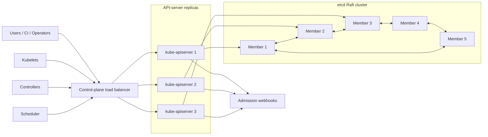

The API server is the central coordination point. The scheduler and controllers do not normally modify etcd directly; they read and write through the Kubernetes API.

---

# 4. Diagnose before redesigning

## 4.1 Symptom-to-component mapping

| Symptom                                | Likely bottleneck                                          |
| -------------------------------------- | ---------------------------------------------------------- |
| All API calls slow                     | API server, etcd, authentication or global webhook         |
| Writes slow but cached reads healthy   | etcd commit latency or admission                           |
| Large LIST calls slow                  | serialization, etcd reads, watch cache misses              |
| Many HTTP 429 responses                | APF saturation or client rate limiting                     |
| Watches frequently reconnect           | API server restart, network issue, stale resource versions |
| Scheduling queue grows                 | Scheduler throughput or API-server latency                 |
| Controller queue grows                 | Slow reconciliation, dependencies or excessive events      |
| etcd leader changes frequently         | Disk, CPU or network latency                               |
| etcd DB grows despite deleted objects  | Missing compaction or fragmentation                        |
| API latency jumps during deployment    | Admission webhook or controller update storm               |
| High API CPU with moderate request QPS | Large objects, CRD conversion or watch serialization       |
| Large bursts every resync interval     | Synchronized informer resyncs                              |

## 4.2 Start with the RED method

For every control-plane component measure:

* **Rate:** requests, writes, watch events and reconciliations.
* **Errors:** 429, 5xx, webhook timeout, etcd timeout and conflicts.
* **Duration:** p50, p95 and p99 latency.

Then correlate:

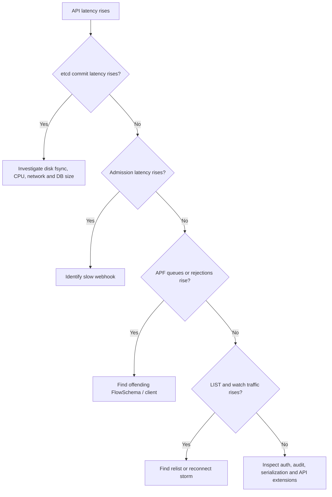

## 4.3 Important metrics

### API server

* `apiserver_request_total`
* `apiserver_request_duration_seconds`
* `apiserver_current_inflight_requests`
* `apiserver_response_sizes`
* `apiserver_watch_events_total`
* `apiserver_longrunning_requests`
* `apiserver_storage_objects`
* `apiserver_admission_webhook_admission_duration_seconds`
* `apiserver_admission_webhook_rejection_count`
* `apiserver_flowcontrol_rejected_requests_total`
* `apiserver_flowcontrol_request_wait_duration_seconds`
* `apiserver_flowcontrol_request_concurrency_in_use`

### etcd

* `etcd_server_has_leader`
* `etcd_server_leader_changes_seen_total`
* `etcd_disk_wal_fsync_duration_seconds`
* `etcd_disk_backend_commit_duration_seconds`
* `etcd_mvcc_db_total_size_in_bytes`
* `etcd_mvcc_db_total_size_in_use_in_bytes`
* `etcd_server_proposals_pending`
* `etcd_network_peer_round_trip_time_seconds`

### Scheduler

* Pending Pods.
* Scheduling attempts.
* Scheduling latency.
* Plugin execution latency.
* Unschedulable queue size.
* API update conflict rate.

### Controllers

* Queue depth.
* Oldest queued item.
* Reconciliation rate.
* Reconciliation duration.
* Retry count.
* API requests per reconciliation.
* Status updates per reconciliation.
* Error classification.

---

# 5. Target scalable architecture

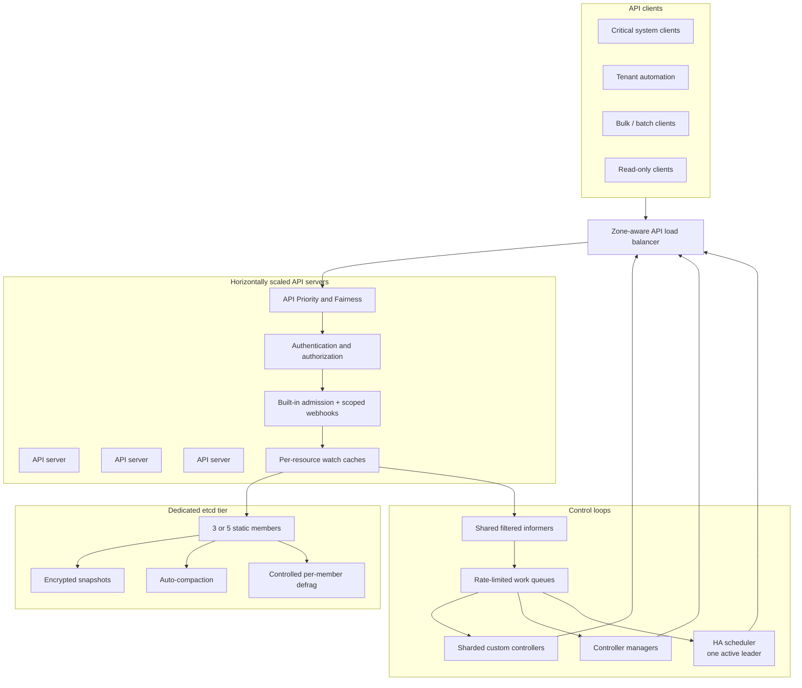

The redesign has six layers:

1. Protect the API server with APF and client limits.
2. Reduce LIST and watch cost.
3. Remove write amplification from controllers.
4. Make admission bounded and highly available.
5. Protect etcd from unnecessary history and slow storage.
6. Shard actual work, not merely process replicas.

---

# 6. End-to-end write path

Consider:

```bash
kubectl apply -f deployment.yaml
```

## 6.1 Detailed flow

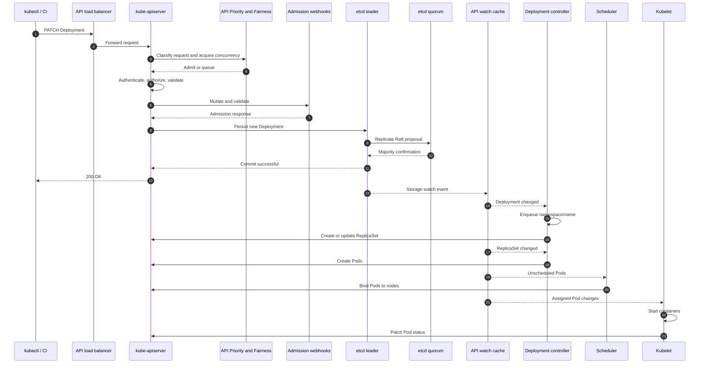

etcd uses majority-based consensus. A three-member cluster requires two members for quorum and tolerates one failure; a five-member cluster requires three and tolerates two. Adding members increases availability but also increases consensus and replication cost. ([etcd][2])

## 6.2 Where this path becomes slow

Any of the following affects the original client request:

* APF queueing.
* Authentication or authorization.
* Admission webhook latency.
* Object conversion.
* etcd leader or disk latency.
* Raft network latency.
* API-server serialization.
* Audit sink backpressure.

Downstream controller and scheduling delays do not necessarily delay the original `kubectl apply`, but they delay actual convergence.

---

# 7. API-server scalability

## 7.1 What causes API-server overload?

### Request volume

Examples:

* Thousands of kubelets updating statuses.
* CI systems repeatedly applying resources.
* Operators continuously patching status.
* Monitoring systems issuing unbounded LIST calls.
* Clients polling every second rather than watching.

### Expensive requests

One large LIST can cost much more than many GETs because it requires:

* Reading many objects.
* Deserializing them.
* Filtering them.
* Converting API versions.
* Serializing a large response.
* Sending it over the network.

APF models expensive requests using concurrency “seats”; large LIST requests may consume multiple seats. Replacing repeated LISTs with watches normally reduces concurrency consumption after the initial state transfer. ([Kubernetes][3])

### Watch fan-out

Suppose:

* 100,000 Pod updates per minute.
* 100 clients watch all Pods.
* Each event averages 5 KB.

Approximate outbound data:

[
100{,}000 \times 100 \times 5\text{ KB}
= 50\text{ GB/minute}
]

This is why broad, duplicate watches are dangerous even when etcd write rate appears manageable.

### Watch reconnect storms

If API servers restart or clients lose connections:

1. Thousands of watches reconnect.
2. Clients may perform full LIST operations.
3. API server CPU and network increase.
4. etcd read latency increases.
5. Clients time out and retry.
6. The control plane enters a positive feedback loop.

### Slow admission webhooks

Admission happens synchronously on the write path. Multiple mutating webhooks can execute sequentially, and validation follows mutation. A slow webhook consumes API concurrency for the duration of the call.

Kubernetes allows webhook timeouts between 1 and 30 seconds, with a documented default of 10 seconds. When the timeout expires, the request is allowed or rejected according to `failurePolicy`. ([Kubernetes][4])

### etcd latency

The API server cannot make write latency lower than its storage path. Slow fsync, CPU starvation, leader elections or network latency directly affect mutating operations.

### Large CRDs

Large custom objects increase:

* etcd storage.
* API-server memory.
* Serialization cost.
* Watch bandwidth.
* Controller cache size.
* Conversion webhook cost.
* Status update cost.

---

## 7.2 Horizontally scale API servers

API servers are mostly horizontally scalable:

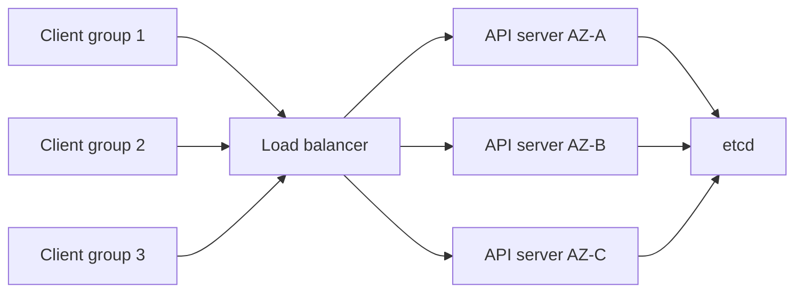

Design:

* Run at least three replicas across failure domains.
* Use health-aware load balancing.
* Keep API servers close to etcd.
* Give each replica dedicated CPU and memory reservations.
* Autoscale cautiously using concurrency, latency and CPU.
* Drain replicas gradually to avoid reconnect storms.
* Stagger rollouts.
* Maintain enough spare capacity to lose one zone.

### Why adding API servers may not help

If etcd is already saturated, additional API servers:

* Generate more backend concurrency.
* Add more watch-cache memory.
* Add backend watches and connections.
* Allow more total requests to reach etcd.
* Potentially worsen storage contention.

Horizontal scaling helps only when API-server compute, network or front-end concurrency is the limiting factor.

---

# 8. API Priority and Fairness

APF protects the API server during overload. It classifies traffic into flows and priority levels, then applies concurrency limits and fair queueing. A noisy controller can therefore be isolated from kubelets, leader election and administrative traffic. ([Kubernetes][3])

## 8.1 Proposed traffic classes

| Priority             | Clients                                              | Policy                              |
| -------------------- | ---------------------------------------------------- | ----------------------------------- |
| Critical             | Node heartbeats, leader election, system controllers | High concurrency, queue             |
| Operational          | SRE emergency operations                             | Reserved capacity                   |
| Platform             | Trusted platform controllers                         | Medium-high concurrency             |
| Tenant interactive   | kubectl, application delivery                        | Medium concurrency                  |
| Batch                | Bulk deployments, scanners                           | Low concurrency, queue              |
| Untrusted automation | Unknown operators                                    | Low concurrency, reject on overload |

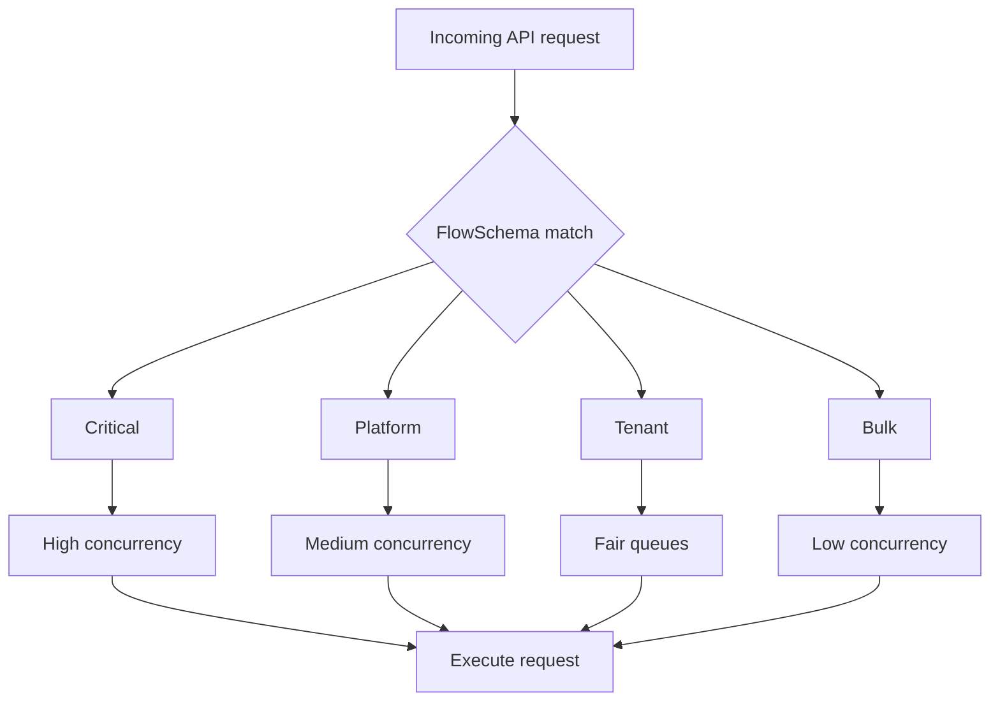

## 8.2 Important design point

APF does not create capacity. It decides:

* Who progresses during overload.
* Who waits.
* Who receives HTTP 429.
* Whether one client can starve another.

APF applies to watch requests, although certain other long-running operations such as log streaming and remote execution are treated differently. ([Kubernetes][3])

## 8.3 Client behavior for 429

Clients should:

* Honor `Retry-After`.
* Use exponential backoff.
* Add jitter.
* Bound retries.
* Distinguish transient from permanent errors.
* Avoid immediately opening parallel retries.

Bad retry:

```text
500 clients receive 429
→ every client retries after exactly one second
→ API server is overloaded again
```

Better retry:

```text
base delay = 500 ms
max delay  = 30 seconds
jitter     = ±50%
retry cap  = 8
```

---

# 9. Watches, polling and watch cache

## 9.1 Polling

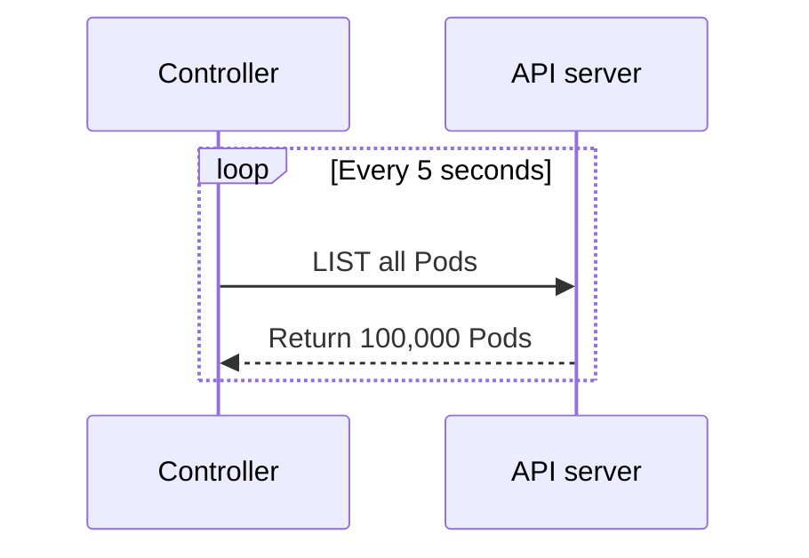

If 20 controllers each list 100,000 Pods every 10 seconds:

[
20 \times 100{,}000 / 10
========================

200{,}000 \text{ object transfers/second}
]

Most objects may not have changed.

## 9.2 Watch

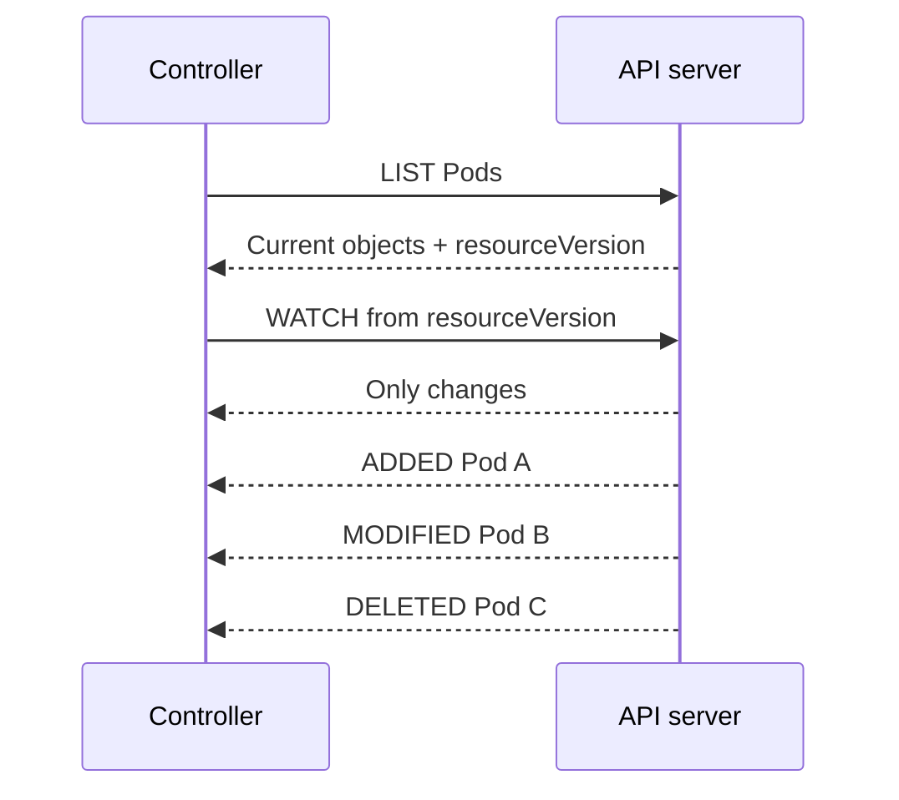

The watch establishes state once and then transfers deltas.

Kubernetes also supports watch bookmarks and streaming initial events, allowing clients to establish a current state and continue watching from a known resource version. ([Kubernetes][5])

## 9.3 Shared informer pattern

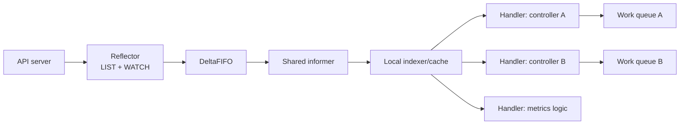

A shared informer:

* Maintains an eventually consistent local cache.
* Avoids repeated direct API reads.
* Shares one underlying list/watch within the process.
* Supports indexes and selectors.
* Delivers event notifications to handlers.
* Should hand expensive work to a work queue rather than performing it in the watch handler. ([Go Packages][6])

### Bad controller

```text
Event received
→ make five API GETs
→ call cloud API
→ wait ten seconds
→ update status
```

This blocks informer event processing.

### Better controller

```text
Event received
→ calculate namespace/name
→ enqueue key
→ return immediately
```

A worker later performs reconciliation.

## 9.4 Watch cache

The API-server watch cache keeps recent resource state and events in memory. It reduces repeated direct storage access for suitable list/watch operations.

Design considerations:

* Size high-cardinality resource caches appropriately.
* Monitor cache memory and event churn.
* Avoid treating it as a general-purpose query engine.
* Use label and field selectors where supported.
* Paginate large lists.
* Avoid clients constantly requesting strongly consistent full lists.
* Support relisting after resource versions become too old.

## 9.5 Prevent reconnect storms

Clients should:

* Resume from the last resource version.
* Use randomized reconnect backoff.
* Use bookmarks.
* Avoid starting every controller simultaneously.
* Stagger deployments and restarts.
* Avoid short watch timeouts.
* Reuse shared informers.
* Add readiness only after initial cache synchronization.

---

# 10. Controller design and reconciliation scalability

## 10.1 Standard scalable controller

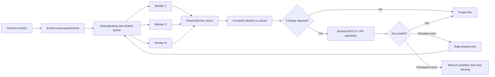

The client-go work queue supports rate-limited queueing; current client-go APIs favor typed rate-limiting queues. ([Go Packages][7])

## 10.2 Reconciliation pseudocode

```go
// Exact question: How does `processNextItem` solve Reconciliation pseudocode?
//
// Possible answer: Use `processNextItem` with a FIFO queue to process items in discovery order and record each result.
//
// Output format: Return a `bool` value from `processNextItem`; the function does not print the answer.
//
// Inline descriptions:
// - `ctx` is the context.Context input used by this example.
//
// Boundary checks:
// - `shutdown` decides whether the branch or loop should continue for the current input.
//
// Key variables:
// - `ctx` is the context.Context input used by this example.
//
// Logic:
// 1. Return the value produced after the state updates are complete.
func processNextItem(ctx context.Context) bool {
    key, shutdown := queue.Get()
    if shutdown {
        return false
    }
    defer queue.Done(key)

    err := reconcile(ctx, key)

    switch {
    case err == nil:
        queue.Forget(key)

    case isPermanent(err):
        queue.Forget(key)
        recordPermanentFailure(key, err)

    case queue.NumRequeues(key) < maxRetries:
        queue.AddRateLimited(key)

    default:
        queue.Forget(key)
        deadLetter(key, err)
    }

    return true
}

// time complexity: O(1) -> the snippet performs a fixed number of operations independent of input size.
// space complexity: O(1) -> only a fixed number of scalar variables or references is kept.
```

Important properties:

* Queue object keys, not complete mutable objects.
* Deduplicate repeated events for the same key.
* Read current state at reconciliation time.
* Make reconciliation idempotent.
* Bound concurrency.
* Use exponential backoff.
* Separate permanent and transient failures.
* Avoid holding worker slots while waiting for long external operations.
* Set request deadlines for cloud APIs.

## 10.3 Level-triggered, not edge-triggered

A controller should converge from current state:

```text
Desired replicas: 5
Actual replicas: 3
Action: create 2
```

It should not depend on receiving every intermediate event.

If events are collapsed:

```text
3 replicas → 4 → 2 → 5
```

the controller can still compare final desired and current actual state.

This is essential because informer caches are eventually consistent and can omit intermediate states while preserving ordering for observed states.

---

# 11. Reducing reconciliation storms

## 11.1 Common causes

### Full periodic resync

Every controller receives synthetic updates for all objects at the same time.

### Status writes that trigger another reconcile

```text
Reconcile
→ update status.lastCheckedTime
→ watch event
→ reconcile
→ update status.lastCheckedTime
→ repeat
```

### Parent-child fan-out

One parent change enqueues 100,000 children simultaneously.

### External dependency outage

All objects fail against the same cloud API and retry continuously.

### Broad watches

A controller watches all Pods but manages only 1% of them.

### Non-semantic updates

Annotations, timestamps or condition ordering change even when state has not materially changed.

## 11.2 Mitigations

### Event filtering

Only enqueue updates when relevant fields change.

```go
// Exact question: How does `shouldEnqueue` solve Event filtering?
//
// Possible answer: Use `shouldEnqueue` to compare the current values and return or update state when the condition matches.
//
// Output format: Return a `bool` value from `shouldEnqueue`; the function does not print the answer.
//
// Inline descriptions:
// - `oldObj` points to a MyResource value that the function reads or updates.
// - `newObj` points to a MyResource value that the function reads or updates.
//
// Boundary checks:
// - `oldObj.Generation != newObj.Generation` decides whether the branch or loop should continue for the current input.
//
// Key variables:
// - `oldObj` points to a MyResource value that the function reads or updates.
// - `newObj` points to a MyResource value that the function reads or updates.
//
// Logic:
// 1. Return the value produced after the state updates are complete.
func shouldEnqueue(oldObj, newObj *MyResource) bool {
    if oldObj.Generation != newObj.Generation {
        return true
    }

    return relevantDependencyChanged(oldObj, newObj)
}

// time complexity: O(1) -> the snippet performs a fixed number of operations independent of input size.
// space complexity: O(1) -> only a fixed number of scalar variables or references is kept.
```

`metadata.generation` is useful for distinguishing desired-spec changes from many status or metadata changes.

### Write status only when it changes

Bad:

```go
// Exact question: How does this Go example demonstrate Write status only when it changes?
//
// Possible answer: Use the fragment to execute the shown state update directly from top to bottom.
//
// Output format: This fragment demonstrates syntax or state updates and does not define a standalone output value.
//
// Inline descriptions:
// - The comments in this preface describe how the important expressions and state changes are used.
//
// Boundary checks:
// - No explicit boundary branch appears in this fragment; its caller or surrounding example supplies valid inputs.
//
// Key variables:
// - This fragment operates directly on the values named in each statement; it introduces no separate data structure.
//
// Logic:
// 1. Execute the statements from top to bottom to perform the demonstrated operation.
status.LastCheckedAt = time.Now()
client.Status().Update(ctx, obj)

// time complexity: O(1) -> the snippet performs a fixed number of operations independent of input size.
// space complexity: O(1) -> only a fixed number of scalar variables or references is kept.
```

Better:

```go
// Exact question: How does this Go example demonstrate Write status only when it changes?
//
// Possible answer: Use the fragment to compare the current values and return or update state when the condition matches.
//
// Output format: This is a partial Go fragment; its surrounding function determines the final returned value.
//
// Inline descriptions:
// - The comments in this preface describe how the important expressions and state changes are used.
//
// Boundary checks:
// - `equality.Semantic.DeepEqual(obj.Status, newStatus)` decides whether the branch or loop should continue for the current input.
//
// Key variables:
// - `newStatus` holds the intermediate value produced by `calculateStatus(obj`.
//
// Logic:
// 1. Return the value produced after the state updates are complete.
newStatus := calculateStatus(obj)

if equality.Semantic.DeepEqual(obj.Status, newStatus) {
    return nil
}

patchStatus(obj, newStatus)

// time complexity: O(1) -> the snippet performs a fixed number of operations independent of input size.
// space complexity: O(1) -> only a fixed number of scalar variables or references is kept.
```

### Track observed generation

```yaml
status:
  observedGeneration: 42
  conditions:
    - type: Ready
      status: "True"
      reason: Reconciled
```

Do not write the same condition repeatedly.

### Use minimal patches

Prefer a targeted patch over replacing the entire object. This:

* Reduces payload size.
* Reduces update conflicts.
* Avoids accidentally modifying unrelated fields.
* Reduces watch bytes.

### Jitter periodic work

Instead of all 10,000 objects reconciling at exactly midnight:

```text
reconcileTime = baseTime + random(0, 30 minutes)
```

### Global dependency circuit breaker

If a cloud API is unavailable:

* Stop sending calls for every object.
* Open a circuit breaker.
* Perform limited health probes.
* Requeue affected items with long jittered delays.

### Rate limit per dependency

Use separate limits for:

* Kubernetes writes.
* Cloud APIs.
* Tenant APIs.
* Expensive reconciliation categories.

### Batch carefully

Batching can reduce request count, but large atomic operations increase latency, contention and blast radius. Use bounded batches.

---

# 12. Controller replicas and leader election

## 12.1 Standard active-passive model

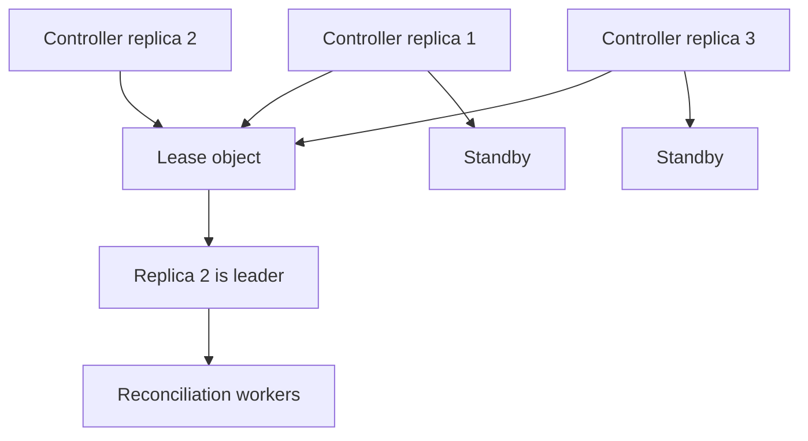

Kubernetes control-plane components use Lease objects as lightweight distributed locks for leader election. ([Kubernetes][8])

## 12.2 Why increasing replicas can make performance worse

Suppose an operator has one replica:

* One Pod informer.
* One cache containing 150,000 Pods.
* One watch stream.

Increase to ten replicas with leader election:

* Ten Pod informers.
* Ten caches.
* Ten watch streams.
* Ten initial LIST operations.
* Nine replicas may do no useful reconciliation work.

Memory, network and API-server load increase by roughly ten times, while reconciliation throughput remains close to one active leader.

This is a common interview trap:

> Leader election provides availability, not horizontal work scaling.

## 12.3 When to use leader election

Use one active leader when:

* Work cannot be partitioned safely.
* Global ordering is required.
* Operations modify shared global state.
* Expected throughput fits one process.
* Simplicity is more valuable than parallelism.

Run two or three replicas for availability, not twenty.

---

# 13. Controller sharding

When one active controller cannot handle the workload, partition ownership.

## 13.1 Namespace-based sharding

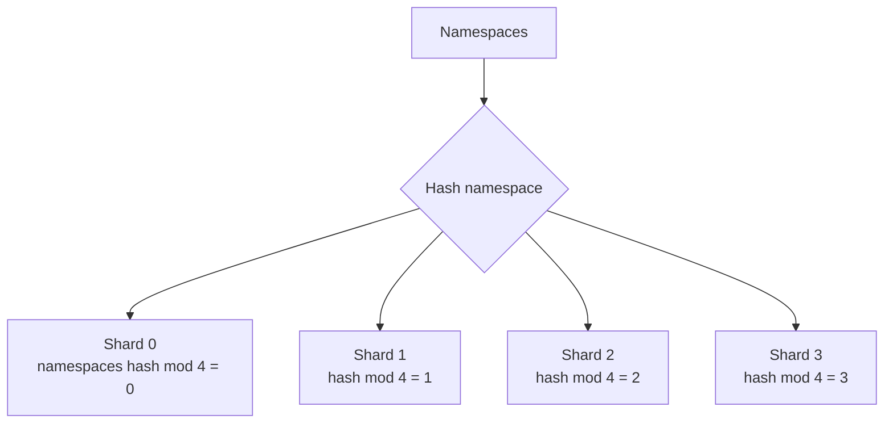

Advantages:

* Stable ownership.
* Tenant locality.
* Easy operational understanding.
* Informers can sometimes use namespace restrictions.

Disadvantages:

* Large namespaces cause skew.
* Cluster-scoped objects require separate ownership.
* Moving shard counts may move many namespaces.

## 13.2 Object-UID consistent hashing

[
\text{shard} = hash(object.UID) \bmod N
]

Better distribution, but harder to query efficiently unless server-side sharding or selectors are available.

## 13.3 Explicit shard label

```yaml
metadata:
  labels:
    platform.example.com/controller-shard: "7"
```

Each controller watches only its shard:

```text
labelSelector=platform.example.com/controller-shard=7
```

Advantages:

* Server-side filtering.
* Predictable ownership.
* Lower per-replica watch traffic.

Disadvantages:

* Requires assigning and maintaining labels.
* Relabeling transfers ownership.
* Needs protection against overlapping ownership.

## 13.4 Lease-based dynamic assignment

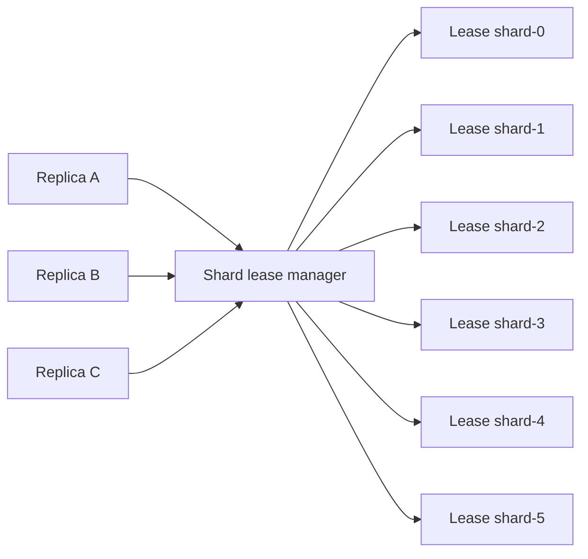

Use many logical shards, for example 128 shards, assigned among a smaller number of replicas.

Benefits:

* Easier rebalancing.
* A failed replica’s shards can be reassigned.
* Replica count can change without rehashing every object if logical shard count remains fixed.

## 13.5 Sharding caveat

A controller can shard reconciliation but still have every replica watch all objects.

That improves worker throughput but not:

* API-server watch load.
* Controller memory.
* Network fan-out.
* Deserialization CPU.

The complete solution needs server-side filtering through namespaces, labels or a supported sharded watch mechanism.

Kubernetes v1.36 introduced an alpha, disabled-by-default sharded list-and-watch capability that allows replicas to request hash ranges based on object UID or namespace. Because it remains alpha, I would treat it as an evaluated optimization rather than the default production dependency. ([Kubernetes][9])

---

# 14. Scheduler scalability

## 14.1 Scheduler flow

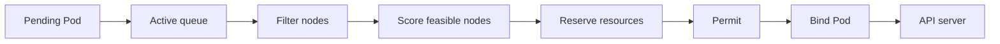

## 14.2 Scheduler bottlenecks

* Too many nodes evaluated per Pod.
* Expensive custom scheduler plugins.
* Slow API operations.
* Large scheduling queue.
* High Pod churn.
* Frequent scheduling failures.
* Complex affinity and anti-affinity.
* Topology-spread calculations.
* External extender calls.
* Scheduler cache invalidation.
* Repeated retries for fundamentally unschedulable Pods.

## 14.3 Improvements

* Keep scheduler plugins in-process and efficient.
* Avoid network calls in filter and score paths.
* Cache topology and resource information.
* Measure plugin-specific latency.
* Separate unschedulable and backoff queues.
* Avoid immediately retrying Pods when unrelated nodes change.
* Reduce expensive affinity patterns.
* Use multiple scheduler profiles where isolation is useful.
* Use multiple independent schedulers only for distinctly partitioned workloads.
* Maintain HA replicas but normally one active leader per scheduler identity.

For large clusters, `percentageOfNodesToScore` lets the scheduler stop searching after enough feasible nodes are found, trading some placement optimality for scheduling latency. The Kubernetes documentation advises against setting it very low without a clear throughput requirement. ([Kubernetes][10])

## 14.4 Multiple schedulers

A second scheduler helps only when workload ownership is explicit:

```yaml
spec:
  schedulerName: gpu-scheduler
```

Possible partitioning:

* Default scheduler for general workloads.
* GPU scheduler for accelerators.
* Batch scheduler for gang scheduling.
* Low-latency scheduler for critical services.

Do not allow two schedulers to compete for the same unassigned Pods.

---

# 15. Admission webhook scalability

## 15.1 Admission flow

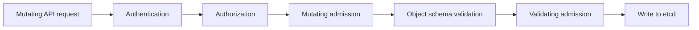

A webhook is in the synchronous request path. Therefore, it must be treated like a critical control-plane component.

## 15.2 What happens when a webhook is slow?

Suppose:

* API concurrency capacity: 600 seats.
* Webhook response time rises from 50 ms to 5 seconds.
* Incoming traffic: 200 requests/second.

Approximate concurrency required:

[
200 \times 5 = 1{,}000
]

The system has only 600 seats, so:

* APF queues grow.
* Requests time out.
* Clients retry.
* More requests arrive.
* Even unrelated writes can be affected if they share the flow.

## 15.3 Webhook design

### Keep timeouts short

Example:

```yaml
webhooks:
  - name: image-policy.example.com
    timeoutSeconds: 2
```

### Scope matching narrowly

Bad:

```yaml
apiGroups: ["*"]
apiVersions: ["*"]
resources: ["*"]
operations: ["CREATE", "UPDATE", "DELETE", "CONNECT"]
```

Better:

```yaml
apiGroups: ["apps"]
apiVersions: ["v1"]
resources: ["deployments"]
operations: ["CREATE", "UPDATE"]
```

Also use:

* `namespaceSelector`
* `objectSelector`
* `matchConditions`
* Exact operations and resource types

### Avoid external network dependencies

Bad:

```text
Webhook
→ call external database
→ call artifact registry
→ call identity service
→ return response
```

A network issue in any dependency blocks Kubernetes writes.

Better:

* Maintain local cached policy data.
* Update cache asynchronously.
* Evaluate admission locally.
* Make the decision deterministic.
* Bound stale-cache behavior.

### Run multiple replicas

* At least three replicas.
* Spread across zones and nodes.
* Use PodDisruptionBudget.
* Avoid control-plane circular dependencies.
* Provide startup and readiness probes.
* Reserve resources.
* Avoid injecting your webhook into its own Pods.

### Prefer in-process policy where possible

Use built-in admission, CEL-based validating policies or mutating policies when they satisfy the requirement. This removes an external network hop and operating dependency.

## 15.4 Fail-open versus fail-closed

| Policy type                   | Typical choice                                |
| ----------------------------- | --------------------------------------------- |
| Mandatory security boundary   | Fail closed                                   |
| Optional metadata injection   | Fail open                                     |
| Cost annotation               | Usually fail open                             |
| Compliance enforcement        | Usually fail closed                           |
| Observability label injection | Fail open                                     |
| Image-signature policy        | Depends on threat model; commonly fail closed |

Kubernetes supports `failurePolicy: Ignore` and `failurePolicy: Fail`; the latter is the default. Network errors, malformed responses and timeouts are handled according to that policy. ([Kubernetes][4])

A fail-open webhook must provide another way to identify and remediate objects that bypassed enforcement.

---

# 16. etcd scalability and availability

## 16.1 etcd architecture

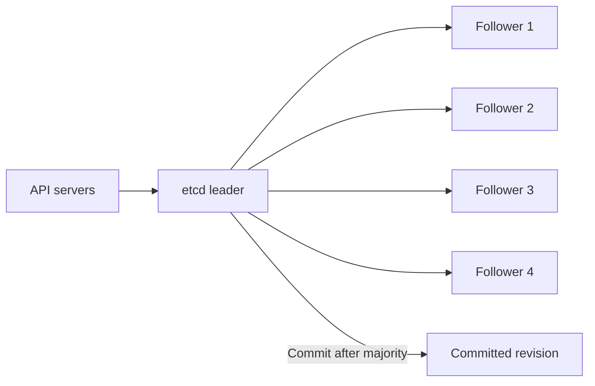

## 16.2 Three versus five members

| Members | Quorum | Failures tolerated | Trade-off                          |
| ------: | -----: | -----------------: | ---------------------------------- |
|       1 |      1 |                  0 | Development only                   |
|       3 |      2 |                  1 | Common balance                     |
|       5 |      3 |                  2 | Higher availability, slower writes |
|       7 |      4 |                  3 | Usually unnecessary for Kubernetes |

Do not autoscale etcd. Membership changes affect quorum and must be controlled. Kubernetes documentation notes that adding members trades performance for availability rather than increasing storage throughput. ([Kubernetes][11])

## 16.3 Storage design

Use:

* Dedicated low-latency SSD or NVMe.
* Reserved CPU and memory.
* No noisy colocated workloads.
* Low-latency networking between members.
* Members spread across failure domains, but not high-latency geographic regions.
* Separate client and peer monitoring.
* Disk latency alerts before API latency fails.
* Conservative storage quotas.

etcd consensus performance is highly sensitive to disk fsync, CPU starvation and peer latency. Slow disk can also cause missed heartbeats and unnecessary leader elections. ([etcd][2])

## 16.4 Compaction versus defragmentation

These solve different problems.

### Compaction

etcd retains older MVCC revisions. Compaction removes history older than a selected revision.

```text
Revision 100: object=A
Revision 200: object=B
Revision 300: object=C

Compact at 250
→ revisions below 250 are no longer readable
```

Without compaction:

* Database history grows.
* Storage pressure increases.
* Garbage collection and reads may degrade.
* Old watchers can retain large history requirements.

etcd supports periodic or revision-based automatic compaction. The retention window must be long enough for expected watcher recovery. ([etcd][12])

### Defragmentation

After compaction, reusable gaps may remain inside the database file. Defragmentation rewrites the database and returns free space to the filesystem.

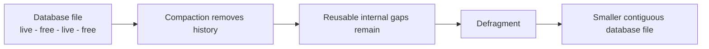

Defragmentation is per member and blocks reads and writes on the member being rebuilt, so perform it one member at a time and monitor cluster health. ([etcd][12])

## 16.5 Status update storms and etcd

Consider 100,000 resources whose controllers write status every 10 seconds:

[
100{,}000 / 10 = 10{,}000 \text{ writes/second}
]

Even if the status has not changed, each write causes:

* A new etcd revision.
* Raft replication.
* Watch-cache update.
* Event serialization.
* Watch fan-out.
* More controller events.

The first fix is not a larger etcd cluster. It is eliminating unnecessary writes.

---

# 17. CRD scale

CRDs behave like Kubernetes API resources and are persisted in etcd.

## 17.1 Common CRD scalability problems

* Objects contain large embedded configuration.
* Status contains unbounded history.
* One CR represents every low-level event.
* Operators watch every namespace.
* Conversion webhooks run on every request.
* Controllers update status continuously.
* Too many served API versions.
* Schema validation is excessively complex.
* Finalizers block deletion indefinitely.
* Large `managedFields` sections accumulate.
* Child resources create huge fan-out.

CRDs in `apiextensions.k8s.io/v1` require structural schemas, and enabling the status subresource lets controllers update `.status` independently from `.spec`. ([Kubernetes][13])

## 17.2 Good CRD design

```yaml
apiVersion: platform.example.com/v1
kind: Database
metadata:
  name: payments
spec:
  engine: postgres
  version: "17"
  size: medium
status:
  observedGeneration: 8
  conditions:
    - type: Ready
      status: "True"
```

Avoid embedding:

```yaml
status:
  reconcileHistory:
    - timestamp: ...
      fullCloudResponse: ...
    - timestamp: ...
      fullCloudResponse: ...
    # Thousands more entries
```

Historical data belongs in:

* Logs.
* Metrics.
* Traces.
* An external database.
* Object storage.
* An event pipeline.

## 17.3 CRD principles

* Keep objects compact.
* Bound all arrays and maps.
* Store references instead of large payloads.
* Use `.status` only for current observable state.
* Use `observedGeneration`.
* Minimize served versions.
* Avoid conversion webhooks when possible.
* Do not use etcd as a high-volume event store.
* Do not create a CR for every heartbeat or metric.
* Apply quotas to CR counts.
* Index frequently used lookup dimensions in controller caches.

---

# 18. Client-side rate limiting

APF protects the server. Client-side rate limiting prevents clients from becoming abusive.

## 18.1 Token bucket model

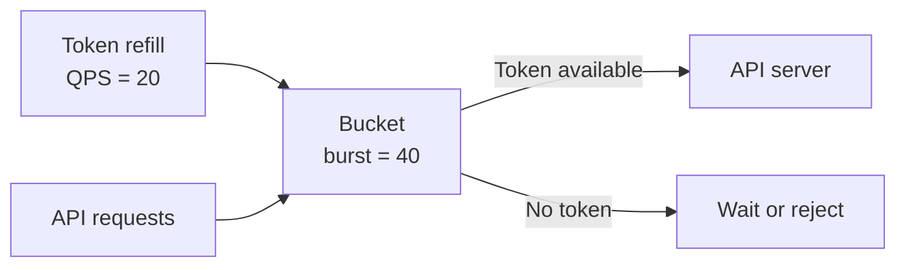

Configure separate limits for:

* Read traffic.
* Write traffic.
* Status updates.
* Resynchronization.
* External dependencies.

## 18.2 Concurrency is as important as QPS

A controller limited to 100 QPS but with 1,000 concurrent slow requests can still consume excessive resources.

Use both:

* Requests per second.
* Maximum concurrent requests.

Example:

```text
Kubernetes API:
  QPS: 50
  Burst: 100
  Maximum concurrent mutations: 20

Cloud provider:
  QPS: 10
  Maximum concurrent operations: 5
```

---

# 19. High-availability and failure behavior

## 19.1 API server failure

* Load balancer removes failed instance.
* Clients reconnect to another instance.
* Watches resume from resource versions.
* Capacity must tolerate at least one replica loss.
* Use staggered restart and termination grace periods.

## 19.2 Scheduler leader failure

* Existing Pods keep running.
* New Pods remain pending temporarily.
* Standby scheduler acquires the Lease.
* New leader reconstructs or synchronizes cache.
* Scheduling resumes.

## 19.3 Controller-manager leader failure

* Existing workloads continue running.
* Reconciliation pauses.
* Standby becomes leader.
* Idempotent reconciliation repairs missed work.

## 19.4 Admission webhook failure

Result depends on:

* `failurePolicy`.
* Webhook timeout.
* Matching configuration.
* API request type.

Avoid a webhook design where the failure of an ordinary worker node blocks all cluster changes.

## 19.5 Loss of etcd quorum

With no quorum:

* Consistent mutations cannot commit.
* API writes fail.
* Scheduling and controller changes stop.
* Existing workloads generally continue running.
* Kubelets may continue operating existing containers.
* The cluster cannot reliably converge to new desired state.

Once transient connectivity returns and quorum is restored, etcd can resume safely. Permanent quorum loss requires disaster recovery rather than forcing unsafe membership changes.

---

# 20. etcd recovery design

## 20.1 Backup architecture

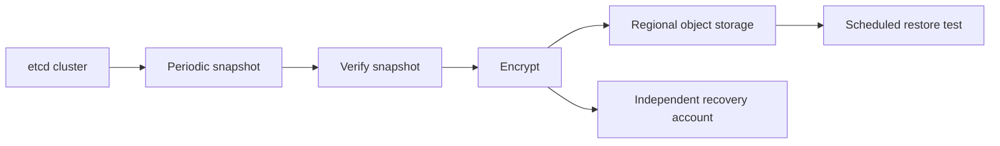

Requirements:

* Frequent snapshots based on RPO.
* Encryption at rest.
* Off-cluster storage.
* Integrity validation.
* Version metadata.
* Retention policy.
* Regular restoration tests.
* Documented PKI and static-Pod recovery.
* Restricted access because snapshots contain Kubernetes state and Secrets.

Kubernetes documents that etcd snapshots contain the full Kubernetes state and recommends protecting them as sensitive data. ([Kubernetes][11])

## 20.2 Recovery scenarios

### Scenario A: one member lost, quorum healthy

1. Verify remaining cluster health.
2. Remove the failed member.
3. Provision replacement storage.
4. Add the replacement member.
5. Allow it to synchronize.
6. Verify alarms, membership and latency.

Do not blindly add a fourth member to an unhealthy three-member cluster because changing cluster size can alter quorum requirements.

### Scenario B: quorum temporarily lost

1. Stop making membership changes.
2. Restore connectivity or failed members.
3. Wait for majority to return.
4. Verify leader and consistency.
5. Investigate the underlying failure.

### Scenario C: permanent quorum loss

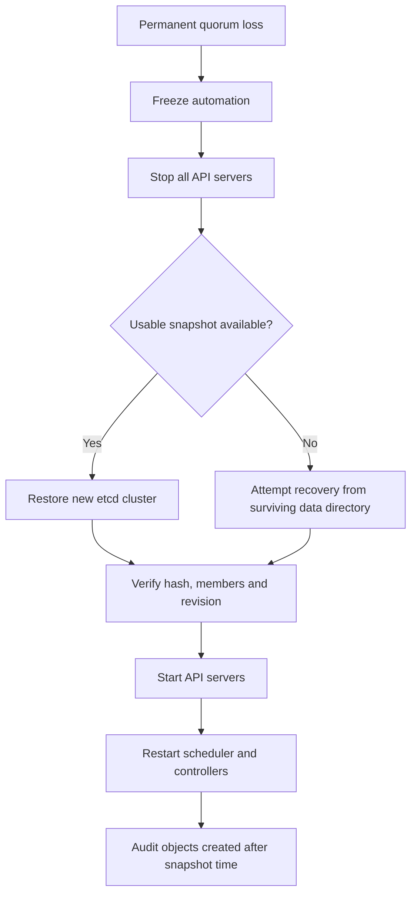

Kubernetes recovery guidance recommends stopping API servers before restoring etcd, restoring the cluster state, restarting API servers, and restarting control-plane components so they do not continue using stale assumptions. Modern guidance favors `etcdutl` for snapshot restore. ([Kubernetes][11])

## 20.3 Revision problem after restore

A restore moves cluster state backward in time. Controllers and watchers may have observed higher resource versions before the failure.

Mitigations:

* Stop API servers before restore.
* Restart all controllers and schedulers.
* Force fresh informer lists.
* Ensure caches are discarded.
* Verify restored objects against external reality.
* Reconcile cloud resources idempotently.
* Use revision bump procedures where supported by the chosen etcd recovery process.

External systems may contain resources created after the snapshot. Controllers must not blindly recreate, duplicate or delete them without ownership checks.

---

# 21. Example incident: status update storm

## 21.1 Incident

A custom `ClusterHealth` operator manages 20,000 objects.

Every 10 seconds each reconciler:

1. Reads five child objects.
2. Calls an external health endpoint.
3. Writes `status.lastCheckedTime`.
4. Requeues after ten seconds.

Five replicas are running with leader election, but every replica has a full informer cache.

### Generated load

Status writes:

[
20{,}000 / 10 = 2{,}000 \text{ writes/second}
]

Child reads without cache:

[
2{,}000 \times 5 = 10{,}000 \text{ reads/second}
]

Watch streams:

```text
5 replicas × all ClusterHealth objects
```

## 21.2 Failure chain

```mermaid
flowchart TD
    A[Periodic reconcile] --> B[Unchanged status update]
    B --> C[New etcd revision]
    C --> D[Watch event to all replicas]
    D --> E[Objects re-enqueued]
    E --> F[More reconciliations]
    F --> B

    C --> G[etcd commit latency rises]
    G --> H[API latency rises]
    H --> I[Client timeouts]
    I --> J[Retries]
    J --> G
```

## 21.3 Redesign

* Remove `lastCheckedTime` from continuously updated status.
* Write status only when Ready, reason or observed generation changes.
* Cache child objects through shared informers.
* Reconcile health every five minutes with jitter.
* Use a dedicated external metrics system for health samples.
* Partition objects into 128 logical shards.
* Assign shards to four active workers.
* Filter watches by shard label.
* Limit Kubernetes mutations to 50 QPS.
* Use dependency circuit breakers.
* Track queue age and retries.

Result:

```text
Before: approximately 2,000 status writes/second
After: writes only on actual health transitions
```

---

# 22. Rollout plan

Do not change every component simultaneously.

## Phase 1: Observe

* Build request attribution by user agent, service account, verb and resource.
* Measure webhook latency.
* Measure etcd latency and database size.
* Add controller queue and reconciliation metrics.
* Identify broad LIST and watch clients.
* Find repeated no-op writes.

## Phase 2: Stabilize

* Apply client-side limits.
* Fix retry storms.
* Reduce webhook timeouts.
* Disable or scope unnecessary webhooks.
* Stop no-op status updates.
* Configure APF isolation.
* Add snapshot verification.

## Phase 3: Optimize reads

* Replace polling with informers.
* Share informers inside processes.
* Add field and label selectors.
* Paginate bulk lists.
* Add watch bookmarks and reconnect jitter.
* Stagger restarts.

## Phase 4: Optimize writes

* Use minimal patches.
* Filter events by generation and relevant fields.
* Add rate-limited work queues.
* Bound worker concurrency.
* Jitter periodic reconciliation.
* Remove high-frequency state from CRDs.

## Phase 5: Scale components

* Add API servers if front-end compute is limiting.
* Tune scheduler only after profiling.
* Shard controllers if one active worker cannot meet SLOs.
* Use filtered watches so sharding reduces API load.
* Increase etcd members only for failure tolerance, not throughput.

## Phase 6: Prove failure recovery

* Kill one API server.
* Kill the scheduler leader.
* Kill one etcd member.
* Simulate webhook timeout.
* Simulate watch reconnect storm.
* Restore etcd from backup in an isolated environment.
* Verify RPO and RTO.
* Run a large deployment burst test.

---

# 23. Key trade-offs

| Decision          | Option A                     | Option B                          | Recommendation                                     |
| ----------------- | ---------------------------- | --------------------------------- | -------------------------------------------------- |
| Controller HA     | Leader election              | Active-active sharding            | Leader election until throughput requires sharding |
| etcd size         | 3 members                    | 5 members                         | 3 normally; 5 for stronger failure tolerance       |
| Admission failure | Fail open                    | Fail closed                       | Based on policy criticality                        |
| Controller reads  | Direct GET/LIST              | Informer cache                    | Informer cache by default                          |
| Retry             | Immediate                    | Exponential backoff               | Backoff with jitter                                |
| Status            | Frequent heartbeat           | Semantic changes only             | Semantic changes only                              |
| Scheduling        | Score all nodes              | Score subset                      | Use defaults, tune after measurement               |
| CRD data          | Store complete history       | Store current state               | Current state; history externally                  |
| Resync            | Frequent global resync       | Watch-driven + slow safety resync | Watch-driven with jitter                           |
| Replicas          | More leader-elected replicas | Actual work sharding              | Shard work; do not multiply idle watchers          |
| API overload      | Global request limit         | APF isolation                     | APF plus client-side limits                        |
| etcd space        | Compaction only              | Compaction and defrag             | Both, for distinct purposes                        |

---

# 24. Direct answers to common deep dives

## What causes API-server overload?

Usually one or more of:

* Large LIST operations.
* Too many duplicate watches.
* Watch reconnect storms.
* Status update storms.
* Slow admission webhooks.
* Excessive client retries.
* Controllers without rate limits.
* Large CRDs.
* Conversion webhooks.
* Slow etcd.
* Expensive authentication or audit processing.
* Too many no-op writes.
* Synchronized resyncs.
* Excessive API-server replica concurrency against an already saturated etcd.

## How do watches differ from polling?

Polling repeatedly fetches current state whether or not anything changed. Watches establish a starting state and then stream changes.

Watches reduce repeated reads but create long-lived connections, server memory and event fan-out. They must handle disconnects, stale resource versions and relisting.

## What happens when an admission webhook is slow?

The API request waits synchronously. It occupies API-server concurrency, APF queues grow, requests may time out, and clients may retry. On timeout, the request proceeds or fails according to `failurePolicy`.

## How do you reduce reconciliation storms?

* Event filtering.
* Shared informer caches.
* Deduplicating work queues.
* Semantic status updates.
* Minimal patches.
* Exponential backoff.
* Jitter.
* Circuit breakers.
* Bounded worker concurrency.
* Sharded ownership.
* Avoid broad watches.
* Avoid frequent global resync.

## How would you shard a controller?

Prefer stable logical shards:

1. Define 128 shards.
2. Assign each object using namespace, UID or explicit shard label.
3. Use Leases to assign logical shards to replicas.
4. Filter list/watch traffic per replica.
5. Ensure exactly one owner per shard.
6. Reassign shards after lease expiry.
7. Make reconciliation idempotent in case ownership briefly overlaps.

## How does etcd quorum affect availability?

A majority must be available for consensus operations.

* Three members tolerate one failure.
* Five members tolerate two.
* Loss of quorum prevents safe writes.
* Adding an even-numbered member does not necessarily increase failure tolerance.
* Cross-region placement increases consensus latency.

## How would you recover etcd?

* If quorum remains, replace individual failed members safely.
* If quorum is temporarily lost, restore member/network availability.
* If quorum is permanently lost, stop API servers, restore all members from a verified snapshot into a new cluster, restart API servers and controllers, and reconcile state against external systems.

## Why can increasing controller replicas make the problem worse?

With leader election, every replica may still perform full LIST/WATCH operations and hold complete informer caches, while only one replica reconciles. More replicas then create more API load, memory and watch fan-out without increasing useful throughput.

---

# 25. Potential interview follow-up questions

## API server

1. How would you identify the service account generating the most expensive traffic?
2. When does adding API-server replicas improve performance?
3. When can it make etcd performance worse?
4. How would you configure APF for kubelets versus tenant CI?
5. What is the difference between an APF queue and client-side rate limiting?
6. How do large LIST calls affect APF concurrency?
7. How would you prevent restart-induced watch storms?
8. How do audit policies affect API-server performance?
9. How would you safely roll API-server instances?
10. When should a client request a strongly consistent read?

## Watches and informers

11. What happens when a watch’s resource version has been compacted?
12. How does an informer recover after a watch closes?
13. Why should handlers avoid doing reconciliation directly?
14. What is eventual consistency in an informer cache?
15. Can an informer skip intermediate updates?
16. How would you reduce memory usage for a controller watching Pods?
17. How do bookmarks help watch clients?
18. How would you distinguish a real update from an informer resync event?
19. Why is a shared informer better than one informer per controller?
20. What happens if an event handler is slower than the incoming event stream?

## Controllers

21. What makes a reconciliation function idempotent?
22. Why queue keys instead of complete objects?
23. How do you prevent two workers from modifying the same object?
24. How do you classify transient versus permanent errors?
25. When should a controller update status?
26. How do you avoid status update conflicts?
27. How would you handle a global dependency outage?
28. How would you design a dead-letter mechanism?
29. How do you scale a controller beyond one leader?
30. How would you rebalance shards without double-processing?
31. How do finalizers affect controller scalability?
32. When is periodic resync still useful?

## Admission webhooks

33. How would you decide fail-open versus fail-closed?
34. Why are mutating webhooks more operationally complex?
35. What happens when two mutating webhooks change the same field?
36. How do you avoid webhook dependency cycles?
37. How would you upgrade a fail-closed webhook safely?
38. When would you replace a webhook with CEL admission policy?
39. How do namespace and object selectors reduce admission load?
40. How would you provide a break-glass mechanism?

## etcd

41. Why does etcd prefer an odd number of members?
42. Why does adding members reduce write performance?
43. What is the difference between compaction and defragmentation?
44. Why can defragmentation cause latency?
45. What happens when the etcd storage quota is exceeded?
46. Why is low disk fsync latency important?
47. Should etcd span geographic regions?
48. How often should snapshots be taken?
49. How do you test whether an etcd backup is usable?
50. What state may be inconsistent after restoring an old snapshot?

## Scheduler

51. Why is the scheduler normally active-passive?
52. What makes a scheduler plugin expensive?
53. How does `percentageOfNodesToScore` affect throughput and quality?
54. When should multiple schedulers be deployed?
55. How do you ensure schedulers do not compete for the same Pods?
56. What happens when the scheduler is unavailable for ten minutes?
57. How do affinity and topology rules affect scheduler complexity?

## CRDs

58. Why should CRD status not contain event history?
59. How do conversion webhooks affect API latency?
60. How would you handle millions of custom objects?
61. When should data live outside Kubernetes?
62. How does object size affect watch scalability?
63. What is the purpose of the status subresource?
64. How do finalizers create deletion backlogs?
65. How would you apply quotas to custom resources?

---

# 26. Strong interview conclusion

> “My design would first eliminate amplification rather than simply add replicas. I would isolate critical API traffic with APF, replace polling and duplicate watches with shared filtered informers, make controllers level-triggered and rate-limited, suppress no-op status writes, bound admission latency, and run etcd on dedicated low-latency infrastructure with tested compaction, defragmentation and recovery. I would use leader election for availability and controller sharding only when I also have a way to partition list and watch traffic. The final validation would be failure injection and load testing against explicit API, scheduling, reconciliation and recovery SLOs.”

[1]: https://kubernetes.io/docs/setup/best-practices/cluster-large/?utm_source=chatgpt.com "Considerations for large clusters"
[2]: https://etcd.io/docs/v3.3/faq/ "Frequently Asked Questions (FAQ) | etcd"
[3]: https://kubernetes.io/docs/concepts/cluster-administration/flow-control/ "API Priority and Fairness | Kubernetes"
[4]: https://kubernetes.io/docs/reference/access-authn-authz/extensible-admission-controllers/ "Dynamic Admission Control | Kubernetes"
[5]: https://kubernetes.io/docs/reference/using-api/api-concepts/?utm_source=chatgpt.com "Kubernetes API Concepts"
[6]: https://pkg.go.dev/k8s.io/client-go/tools/cache "cache package - k8s.io/client-go/tools/cache - Go Packages"
[7]: https://pkg.go.dev/k8s.io/client-go/util/workqueue "workqueue package - k8s.io/client-go/util/workqueue - Go Packages"
[8]: https://kubernetes.io/docs/concepts/cluster-administration/coordinated-leader-election/?utm_source=chatgpt.com "Coordinated Leader Election"
[9]: https://kubernetes.io/docs/reference/using-api/api-concepts/ "Kubernetes API Concepts | Kubernetes"
[10]: https://kubernetes.io/docs/concepts/scheduling-eviction/scheduler-perf-tuning/ "Scheduler Performance Tuning | Kubernetes"
[11]: https://kubernetes.io/docs/tasks/administer-cluster/configure-upgrade-etcd/ "Operating etcd clusters for Kubernetes | Kubernetes"
[12]: https://etcd.io/docs/v3.5/op-guide/maintenance/ "Maintenance | etcd"
[13]: https://kubernetes.io/docs/tasks/extend-kubernetes/custom-resources/custom-resource-definitions/ "Extend the Kubernetes API with CustomResourceDefinitions | Kubernetes"
