# Design a Large-Scale Multi-Tenant Kubernetes Platform

This is an interview-style design for a managed Kubernetes platform serving:

* Thousands of developers
* Thousands of microservices
* Multiple business units and security domains
* Multiple geographic regions
* Stateless, stateful, batch, streaming, and machine-learning workloads

The design is illustrative. References to Apple Music and iCloud represent hypothetical tenants, not Apple’s actual architecture.

---

# 1. Clarify the requirements

Before drawing the architecture, establish scale, trust boundaries, availability requirements, and workload characteristics.

## 1.1 Assumed scale

| Dimension               |                              Assumption |
| ----------------------- | --------------------------------------: |
| Developers              |                                  10,000 |
| Engineering teams       |                                   1,000 |
| Microservices           |                            5,000–10,000 |
| Deployment instances    | 50,000+ across environments and regions |
| Pods                    |                       500,000–1,000,000 |
| Kubernetes clusters     |                     Approximately 1,000 |
| Regions                 |                                    6–10 |
| Availability zones      |         3 or more per production region |
| Production environments |                    Shared and dedicated |
| Platform availability   |          99.99% for regional management |
| Workload availability   |            Defined by each service tier |

These are design assumptions, not Kubernetes limits.

## 1.2 Functional requirements

The platform must provide:

1. Cluster provisioning and decommissioning
2. Tenant and developer onboarding
3. Workload deployment
4. Multi-region workload placement
5. Namespace, node-pool, cluster, network, and identity isolation
6. Autoscaling
7. Ingress and service discovery
8. Persistent storage
9. Policy enforcement
10. Cluster and platform upgrades
11. Centralized observability
12. Cost attribution and chargeback
13. Disaster recovery
14. Self-service APIs and developer portal

## 1.3 Non-functional requirements

The main non-functional priorities are:

* **Regional autonomy:** a global platform failure must not stop regional workloads.
* **Bounded blast radius:** no cluster, controller, policy, or tenant should affect the entire fleet.
* **Declarative operations:** clusters and tenants are represented as desired-state resources.
* **Strong isolation where needed:** not every tenant receives the same tenancy model.
* **Safe fleet changes:** every change is progressively rolled out.
* **No static credentials:** developers and workloads use short-lived identities.
* **Auditable operations:** every privileged action is attributable.
* **Standardization with controlled exceptions:** teams consume paved roads, not unrestricted clusters.

---

# 2. Core design decision

I would build a **cell-based, federated Kubernetes platform**.

The platform has three major layers:

1. **Global management plane**
2. **Regional management cells**
3. **Workload clusters**

The global management plane holds fleet metadata and business-level desired state. Regional cells perform cluster lifecycle and deployment operations. Workload clusters execute applications.

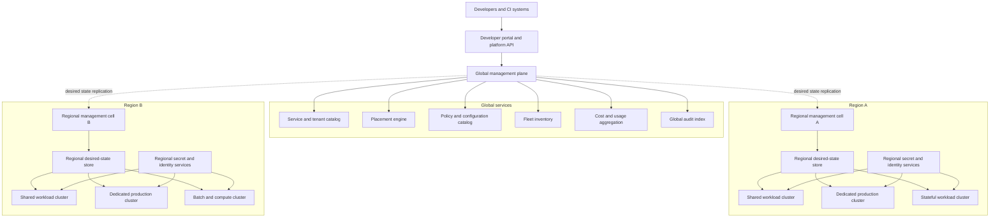

## Why this structure?

A single global Kubernetes management cluster would create an unacceptable blast radius.

Instead:

* Each regional cell manages a bounded number of clusters.
* Each cell has its own queues, controllers, database, deployment store, credentials, and rate limits.
* A failed regional cell affects only that region.
* A failed workload cluster affects only its assigned tenants.
* A global failure stops global changes but does not stop existing regional workloads.

Cluster API is one possible foundation for declarative cluster lifecycle management because it represents clusters and their infrastructure through Kubernetes-style APIs and controllers. ([Cluster API][1])

---

# 3. Control-plane versus data-plane responsibilities

It is important to separate the **platform control plane** from the Kubernetes control planes.

## 3.1 Global management plane

The global plane is responsible for:

* Tenant catalog
* Service catalog
* Global cluster inventory
* Placement decisions
* Approved Kubernetes versions
* Global policy definitions
* Global capacity visibility
* Cost aggregation
* Compliance reporting
* Regional desired-state distribution

It is not responsible for:

* Routing application traffic
* Running application admission webhooks
* Scheduling pods
* Directly operating worker nodes
* Holding application secrets
* Serving every deployment request synchronously

## 3.2 Regional management cell

A regional cell runs:

* Cluster lifecycle controllers
* Tenant and namespace controllers
* Deployment orchestrators
* Regional Git or desired-state repositories
* Regional policy distribution
* Regional image and artifact mirrors
* Regional identity brokers
* Upgrade controllers
* Capacity and health services
* Regional API endpoints

## 3.3 Workload cluster

Each workload cluster contains:

* Kubernetes control plane
* Worker node pools
* CNI and NetworkPolicy implementation
* CSI storage drivers
* Ingress or Gateway controllers
* Policy agents
* GitOps or deployment agents
* Metrics, log, trace, audit, and cost agents
* Node lifecycle and autoscaling components

Kubernetes supports multi-tenancy primarily through namespace-based sharing or virtualized control planes, but dedicated clusters remain appropriate when stronger isolation is required. Namespaces alone do not isolate cluster-scoped resources such as CRDs, storage classes, and admission webhooks. ([Kubernetes][2])

---

# 4. Tenancy model

There should not be one tenancy model for every workload.

Use an **isolation ladder**.

## 4.1 Isolation tiers

| Tier   | Isolation                                        | Typical usage                                                      |
| ------ | ------------------------------------------------ | ------------------------------------------------------------------ |
| Tier 0 | Shared namespace or sandbox                      | Experiments and temporary development                              |
| Tier 1 | Dedicated namespace in shared cluster            | Standard development and low-risk production                       |
| Tier 2 | Dedicated namespaces and node pools              | Sensitive or performance-critical services                         |
| Tier 3 | Dedicated cluster                                | Critical production, regulatory or strong blast-radius requirement |
| Tier 4 | Dedicated cluster, account, network and hardware | Highest security or hardware isolation                             |

## 4.2 Namespace-based tenant

A normal tenant receives:

* One namespace per service and environment
* Namespace-scoped RBAC
* ResourceQuota
* LimitRange
* Default-deny NetworkPolicies
* Pod Security restrictions
* Dedicated service accounts
* Cost and ownership labels
* Approved storage and ingress classes

Example:

```text
Tenant: music-catalog
Team: music-discovery

Namespaces:
  music-catalog-dev
  music-catalog-staging
  music-catalog-prod-us
  music-catalog-prod-eu
```

I prefer **one namespace per workload and environment**, rather than putting every service from one organization in a single large namespace. This provides smaller policy and operational boundaries.

Kubernetes namespaces provide logical API segmentation, but secure multi-tenancy requires RBAC, quotas, network policies, admission policy, and possibly node isolation in addition to namespaces. ([Kubernetes][2])

## 4.3 Dedicated node pools

A tenant can share the control plane but receive dedicated workers.

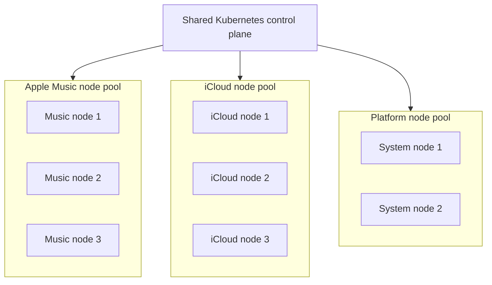

Implementation:

* Node labels identify pool ownership.
* Taints prevent unrelated workloads from entering the pool.
* Tenant workloads receive matching tolerations and node affinity.
* Platform components run on protected system pools.
* RuntimeClass can select sandboxed runtimes where required.
* Separate autoscaling groups allow independent scaling.

This improves CPU, memory, network, disk and kernel-level isolation, but the Kubernetes API server and cluster-scoped resources remain shared.

## 4.4 Dedicated cluster

Use a dedicated cluster when the tenant needs:

* Independent failure domain
* Different Kubernetes lifecycle
* Cluster administrator capability
* Custom CRDs or admission webhooks
* Separate encryption or key-management boundary
* Separate network trust domain
* Separate compliance controls
* Predictable control-plane performance
* Protection from another tenant’s API activity
* Large or unusual workloads

---

# 5. How I would isolate Apple Music from iCloud

For critical production workloads, I would not depend solely on namespace isolation.

A hypothetical separation would look like:

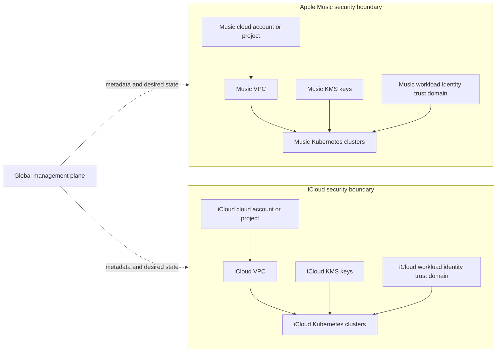

The isolation controls would include:

* Separate production clusters
* Separate cloud accounts or projects
* Separate VPCs
* Separate cluster service identities
* Separate KMS keys
* Separate secrets
* Separate certificate trust domains
* Separate ingress and egress controls
* Separate node pools or hardware
* Separate audit streams
* Explicit service-to-service authorization

Development environments could use shared clusters if the data classification permits it.

The key interview point is:

> Isolation is driven by threat model, data classification and acceptable blast radius—not merely by organization name.

---

# 6. Tenant onboarding flow

Developers should not receive unrestricted access and manually build namespaces.

They use a portal or API backed by a tenant controller.

## 6.1 Tenant resource

```yaml
apiVersion: platform.example.com/v1
kind: Tenant
metadata:
  name: music-catalog
spec:
  owner:
    group: music-discovery
    costCenter: cc-4210

  classification:
    environment: production
    dataSensitivity: confidential
    criticality: tier-1

  isolation:
    profile: dedicated-node-pool

  regions:
    - eu-west
    - us-east

  quota:
    cpu: "400"
    memory: 1Ti
    storage: 20Ti
    pods: 2000

  capabilities:
    ingress: private-and-public
    statefulWorkloads: true
    gpu: false

  recovery:
    availabilityTier: regional-ha
    rpo: 15m
    rto: 1h
```

## 6.2 Onboarding sequence

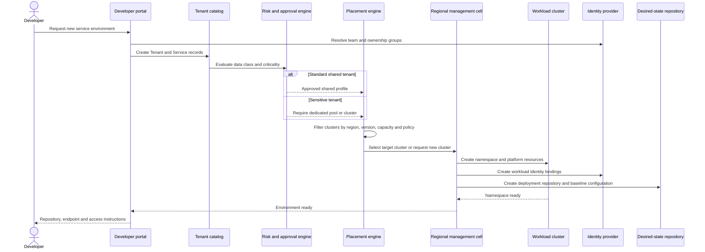

## 6.3 Resources created automatically

The tenant controller creates:

* Namespace
* ResourceQuota
* LimitRange
* RoleBindings
* Service accounts
* NetworkPolicies
* Pod Security labels
* PriorityClass eligibility
* Storage quota
* Ingress quota
* Identity bindings
* Cost labels
* Observability configuration
* Default dashboards
* Alert routing
* Deployment repository
* SLO configuration
* Backup policy

## 6.4 Developer identity

Human users authenticate through corporate SSO.

```text
Corporate identity
    ↓
OIDC token
    ↓
Platform API
    ↓
Group-to-role mapping
    ↓
Short-lived Kubernetes access
```

Do not assign Kubernetes permissions user by user. Bind corporate groups to platform roles:

```text
music-discovery-developers  → deploy and read
music-discovery-oncall      → operational write
music-discovery-admins      → namespace administration
platform-sre                → controlled fleet administration
```

For 10,000 developers, identity lifecycle must be driven by the corporate directory. Joining or leaving a team automatically changes access.

---

# 7. Cluster provisioning and lifecycle

Clusters are declarative resources, not manually constructed infrastructure.

## 7.1 Provisioning architecture

```mermaid
flowchart LR
    Request[Cluster request]
    API[Regional platform API]
    Lifecycle[Cluster lifecycle controller]
    Infra[Infrastructure provider]
    Bootstrap[Bootstrap service]
    Cluster[New Kubernetes cluster]
    Addons[Add-on manager]
    Register[Fleet registration]
    Ready[Ready for placement]

    Request --> API
    API --> Lifecycle
    Lifecycle --> Infra
    Infra --> Bootstrap
    Bootstrap --> Cluster
    Cluster --> Addons
    Addons --> Register
    Register --> Ready
```

## 7.2 Provisioning steps

1. Validate the cluster profile.
2. Allocate network ranges.
3. Provision load balancers and control-plane infrastructure.
4. Create control-plane nodes.
5. Create system worker pool.
6. Install CNI and CSI.
7. Install identity and certificate components.
8. Install ingress or Gateway implementation.
9. Install policy components.
10. Install deployment and observability agents.
11. Run conformance and platform tests.
12. Register the cluster with the regional inventory.
13. Mark it eligible for placement.

## 7.3 Cluster profiles

Avoid arbitrary cluster configurations. Define versioned profiles:

```text
general-purpose-v12
stateful-v8
compute-optimized-v6
gpu-v4
restricted-production-v10
edge-v3
```

Each profile pins:

* Kubernetes version
* Operating-system image
* Container runtime
* CNI version
* CSI versions
* Admission policies
* Observability agents
* Kernel configuration
* Node pool shapes
* Upgrade strategy
* Supported features

## 7.4 Immutable nodes

Worker nodes should be replaced rather than modified in place.

For an operating-system update:

1. Create a new node group from the approved image.
2. Add nodes.
3. Verify node health.
4. Cordon old nodes.
5. Drain workloads safely.
6. Remove old nodes.
7. Delete the old node group.

PodDisruptionBudgets can limit simultaneous voluntary disruptions, and draining uses the eviction mechanism to respect those budgets where possible. ([Kubernetes][3])

---

# 8. Workload placement

The deployment system determines where a workload should run.

## 8.1 Hard constraints

A cluster is rejected if it fails any hard constraint:

* Region
* Environment
* Data residency
* Tenant isolation tier
* Kubernetes version
* Architecture
* GPU or accelerator requirement
* Storage capability
* Network connectivity
* Compliance certification
* Capacity reservation
* Maintenance state

## 8.2 Soft scoring

Remaining clusters receive scores.

Example:

```text
score =
    0.30 × available_capacity
  + 0.20 × failure_domain_balance
  + 0.15 × estimated_cost
  + 0.15 × tenant_spread
  + 0.10 × image_locality
  + 0.10 × operational_health
```

## 8.3 Placement example

```text
Workload:
  tenant: music-catalog
  region: eu-west
  cpu-request: 200 cores
  memory-request: 500 GiB
  storage: encrypted-ssd
  isolation: dedicated-node-pool
  minimum-kubernetes-version: 1.35
```

```text
Cluster A:
  capacity: sufficient
  storage: supported
  isolation: shared only
  result: rejected

Cluster B:
  capacity: sufficient
  storage: supported
  dedicated pool available
  result: score 91

Cluster C:
  capacity: sufficient
  storage: supported
  dedicated pool available
  maintenance scheduled
  result: score 68
```

Cluster B is selected.

## 8.4 Avoid continuous movement

The placement engine should not continuously move services because another cluster becomes marginally cheaper.

Use:

* Minimum improvement threshold
* Cooldown period
* Movement budget
* Tenant disruption budget
* Explicit rebalancing windows

---

# 9. Workload deployment flow

The platform should favor declarative, pull-based deployment.

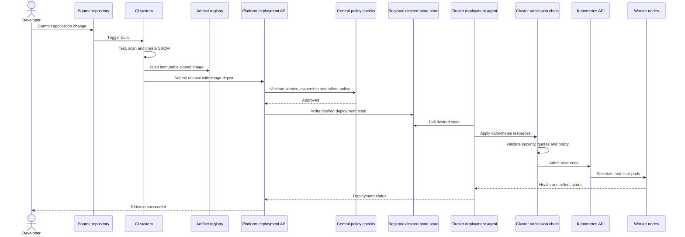

## Why pull-based?

* Workload clusters do not require inbound privileged access from one global controller.
* Regional desired-state mirrors support operation during global outages.
* Credentials are bounded to individual clusters.
* Reconciliation corrects configuration drift.
* A global deployment service does not need to maintain thousands of direct API connections.

Emergency imperative operations may still exist, but they should be audited and tightly controlled.

---

# 10. Admission and policy enforcement

Policies should be enforced at several stages.

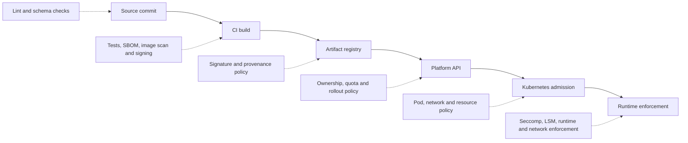

## 10.1 Baseline policies

Require:

* Immutable image digest
* Approved image registry
* CPU and memory requests
* Memory limits
* Non-root execution
* Read-only root filesystem where practical
* Seccomp profile
* Dropped Linux capabilities
* No privileged containers
* No host network, PID or IPC by default
* No arbitrary hostPath
* Approved storage classes
* Owner and cost labels
* Readiness and liveness configuration
* PodDisruptionBudget for high-availability services
* Topology spread for production replicas
* Default-deny ingress and egress

Pod Security Admission provides namespace-level enforcement of Kubernetes Pod Security Standards, with privileged, baseline and restricted levels. ([Kubernetes][4])

ValidatingAdmissionPolicy provides in-process, CEL-based validation and can warn, audit or deny non-compliant API operations. External admission webhooks remain useful where policies require remote data or more complex logic. ([Kubernetes][5])

## 10.2 Policy rollout

A bad policy can stop every deployment, so policy changes also need progressive delivery:

```text
audit only
   ↓
warn in development
   ↓
deny in development
   ↓
warn in production
   ↓
deny on 1% of clusters
   ↓
deny fleet-wide
```

Critical admission components should:

* Run multiple replicas
* Use topology spreading
* Have strict latency budgets
* Have explicit fail-open or fail-closed decisions
* Exclude recovery namespaces
* Be monitored independently

Security-critical policies generally fail closed. Non-security enrichment policies can fail open.

---

# 11. Preventing noisy neighbours

Noisy-neighbour protection must cover more than CPU.

## 11.1 Resource dimensions

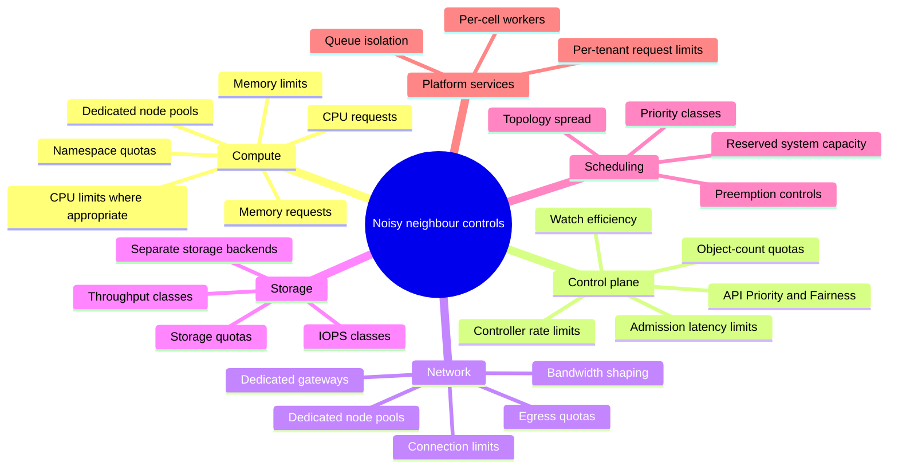

## 11.2 CPU and memory

Use:

* ResourceQuota per namespace
* LimitRange defaults and bounds
* Requests required for scheduling
* Memory limits to prevent unbounded consumption
* Guaranteed QoS for latency-critical workloads where justified
* Dedicated pools for consistently high consumers

Kubernetes ResourceQuota limits aggregate namespace consumption. CPU requests reserve scheduler capacity, while CPU limits cap consumption; memory exceeding a hard limit can result in termination. ([Kubernetes][6])

## 11.3 Control-plane fairness

A tenant can overload the API server by:

* Creating excessive objects
* Starting poorly implemented controllers
* Opening large numbers of watches
* Repeatedly listing objects
* Producing excessive events

Mitigations:

* Object-count ResourceQuotas
* API Priority and Fairness
* Per-identity request classification
* Controller client rate limits
* Shared informers instead of repeated polling
* Exponential backoff
* Limits on custom controllers
* Separate clusters for tenants requiring cluster-wide controllers

API Priority and Fairness classifies requests, queues short bursts and applies fair queuing so a poorly behaved client does not starve other API users. ([Kubernetes][7])

## 11.4 Network and storage fairness

ResourceQuota does not fully protect shared network or storage devices.

For high-risk tenants, use:

* Dedicated nodes
* Dedicated network interfaces
* Per-tenant egress gateways
* Traffic shaping
* Connection limits
* Storage classes with defined IOPS and throughput
* Separate storage accounts or backends
* Dedicated clusters for very high throughput

---

# 12. Workload identity and secrets

Workloads should never receive long-lived cloud credentials.

## 12.1 Identity flow

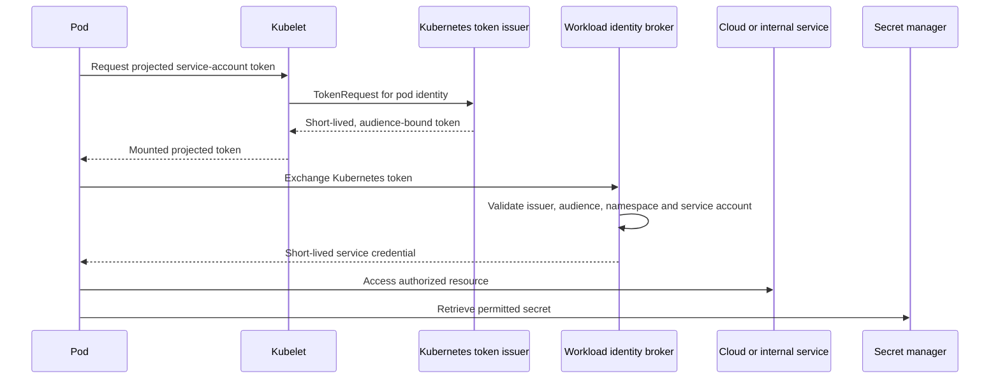

## 12.2 Identity granularity

Each service gets a separate service account:

```text
system:serviceaccount:music-catalog-prod:catalog-api
```

Authorization can include:

* Cluster identity
* Namespace
* Service account
* Pod identity
* Tenant
* Environment
* Region
* Intended audience

Projected service-account tokens are short-lived and audience-bound, and are the recommended alternative to legacy persistent service-account token Secrets. Kubernetes also allows API credential automounting to be disabled for workloads that do not require Kubernetes API access. ([Kubernetes][8])

## 12.3 Secrets

The Kubernetes API should not be the enterprise secret source of truth.

Recommended flow:

1. Secret stored in a regional secret manager.
2. Workload authenticates using workload identity.
3. Secret is mounted or fetched at runtime.
4. Access is audited.
5. Secret rotates independently.
6. Application reloads or restarts safely.

Use different encryption keys and secret-manager boundaries for critical tenants.

---

# 13. Networking and ingress

## 13.1 Network architecture

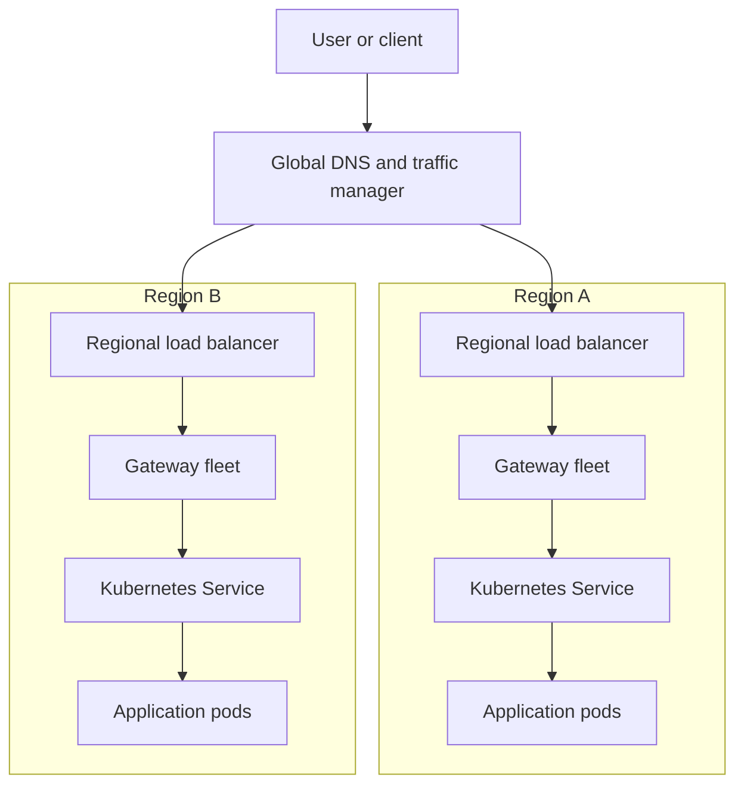

## 13.2 North-south traffic

Use:

* Global DNS or global traffic manager
* Regional load balancers
* Gateway or ingress fleets
* Tenant-specific routing configuration
* TLS termination
* Web application firewall where needed
* Rate limiting
* DDoS protection
* Canary and traffic-splitting support

Do not run one ingress controller for the entire region. Partition ingress into cells or shards based on:

* Tenant
* Domain
* Traffic class
* Public versus private
* Security classification

## 13.3 East-west traffic

Options:

* Kubernetes Service and DNS for ordinary in-cluster communication
* Cross-cluster service discovery for regional services
* Service mesh only where mTLS, identity-aware authorization, traffic policy or telemetry justify its cost

Avoid requiring every service call to traverse a global service-mesh control plane.

## 13.4 Network isolation

Default tenant policy:

```text
deny all ingress
deny all egress
allow namespace-local communication
allow approved shared services
allow approved external destinations
```

Kubernetes NetworkPolicy can restrict ingress and egress, but enforcement depends on the selected networking implementation. ([Kubernetes][9])

## 13.5 Egress controls

Use centralized egress gateways for:

* Stable source addresses
* Domain or IP allow-listing
* Audit
* Data-loss prevention
* Per-tenant accounting
* Rate limiting
* Blocking cloud metadata endpoints

Critical tenants receive dedicated gateways.

---

# 14. Storage and stateful workloads

Kubernetes can run stateful applications, but storage and data recovery require a separate design.

## 14.1 Storage classes

Offer curated classes:

| Storage class          | Intended workload                                |
| ---------------------- | ------------------------------------------------ |
| `standard-rwo`         | General persistent applications                  |
| `premium-rwo`          | Latency-sensitive database                       |
| `shared-rwx`           | Shared filesystem workloads                      |
| `local-nvme`           | High-performance ephemeral or replicated storage |
| `encrypted-restricted` | Sensitive tenant data                            |
| `backup-enabled`       | Volumes with mandatory snapshot policy           |

CSI drivers expose storage systems to Kubernetes, and VolumeSnapshot resources provide a Kubernetes API representation of storage-system snapshots. ([Kubernetes][10])

## 14.2 Stateless service

A stateless service should have:

* Deployment
* Multiple replicas
* Topology spread
* HPA
* PDB
* Regional traffic routing
* No durable data on node disks

## 14.3 Stateful service

A stateful service may have:

* StatefulSet or operator
* PersistentVolumeClaims
* Zone-aware storage
* Backup and restore policy
* Replication
* Anti-affinity or topology spread
* Controlled disruption and upgrade process
* Explicit RPO and RTO
* Data integrity tests

StatefulSet provides stable pod identity and storage associations, but application-level replication and recovery remain the application or database operator’s responsibility. ([Kubernetes][11])

## 14.4 Preferred database strategy

For ordinary teams, offer a managed database service outside workload clusters.

Run databases inside Kubernetes when:

* The organization has a mature operator
* Lifecycle is automated
* Backup and restore are tested
* Storage performance is predictable
* The team understands quorum and failure behavior
* Cross-region replication is implemented

## 14.5 Stateful disaster recovery

A volume snapshot alone is not always application-consistent.

For databases:

1. Quiesce or coordinate through the database operator.
2. Take snapshots.
3. Store backups in another failure domain.
4. Replicate backup metadata.
5. Regularly restore into an isolated environment.
6. Validate application-level integrity.

---

# 15. Autoscaling

Autoscaling exists at multiple layers.

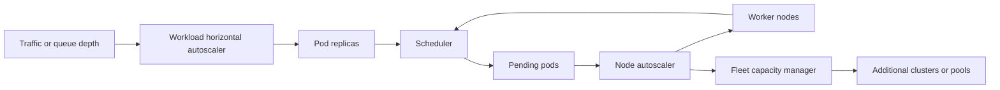

## 15.1 Workload autoscaling

Provide:

* HPA for CPU, memory or custom metrics
* Event-driven scaling for queue-based workloads
* VPA recommendations
* Scheduled scaling
* Minimum replica requirements
* Scale-up and scale-down policies

Kubernetes workload autoscaling covers horizontal and vertical adjustment; VPA is deployed as an add-on rather than being part of the default core installation. ([Kubernetes][12])

## 15.2 Node autoscaling

Each node pool scales independently.

Examples:

```text
general-purpose: 50–500 nodes
memory-optimized: 10–100 nodes
gpu: 0–50 nodes
music-dedicated: 20–200 nodes
```

Maintain spare capacity for critical tiers:

* Tier 1: 20% regional headroom
* Tier 2: 10% headroom
* Batch: best effort
* GPU: reservations or scheduled queues

Node autoscaling can operate together with horizontal and vertical workload autoscaling. ([Kubernetes][13])

## 15.3 Fleet autoscaling

If existing clusters cannot accept more workloads:

1. Add a node pool.
2. Expand an existing cluster if within the preferred operational envelope.
3. Provision another cluster.
4. Register it with the fleet.
5. Allow placement after health validation.

Fleet scaling is slower than pod or node scaling, so capacity forecasting and pre-provisioned buffer clusters are needed.

---

# 16. Observability

Observability has four audiences:

1. Application developers
2. Tenant operators
3. Platform SREs
4. Security and compliance teams

## 16.1 Telemetry architecture

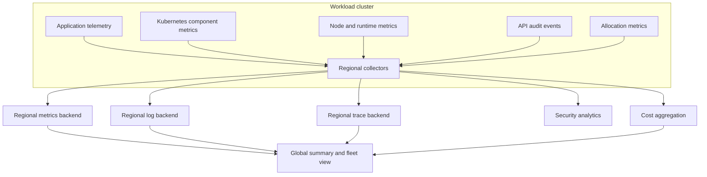

## 16.2 Platform signals

Monitor:

### Control plane

* API request latency and errors
* etcd health and latency
* Scheduler latency
* Controller work-queue depth
* Admission latency
* API Priority and Fairness rejects and queues
* Object counts
* Watch counts

### Nodes

* Ready state
* CPU, memory and disk pressure
* Container runtime errors
* Image-pull latency
* Network errors
* Kubelet certificate status
* Pod start latency

### Platform services

* Deployment reconciliation delay
* Cluster provisioning time
* Upgrade progress
* Policy failures
* Identity exchange failures
* Autoscaler latency
* Ingress provisioning latency

Kubernetes components expose metrics in Prometheus format, but the platform must define collection, retention, tenancy and cardinality controls. ([Kubernetes][14])

## 16.3 Tenant observability

Each tenant receives:

* Service dashboards
* Deployment history
* Pod and workload health
* SLO status
* Resource consumption
* Cost view
* Alerts
* Logs and traces
* Policy violations
* Capacity recommendations

## 16.4 Cardinality protection

A single tenant can damage the observability system using unbounded labels.

Controls include:

* Label allow-lists
* Per-tenant series quotas
* Log rate limits
* Trace sampling
* Retention tiers
* Payload-size limits
* Per-tenant ingestion queues

---

# 17. Chargeback and capacity management

Chargeback should be based primarily on requested or reserved resources, not only instantaneous usage.

## 17.1 Allocation model

Example:

```text
Monthly tenant cost =
    requested CPU-hours × CPU rate
  + requested memory GiB-hours × memory rate
  + storage GiB-months × storage-class rate
  + network egress × regional rate
  + load balancer and IP costs
  + GPU hours
  + dedicated cluster overhead
  + platform service surcharge
```

## 17.2 Required labels

Every resource must include:

```yaml
metadata:
  labels:
    platform.example.com/tenant: music-catalog
    platform.example.com/service: catalog-api
    platform.example.com/environment: production
    platform.example.com/cost-center: cc-4210
    platform.example.com/owner: music-discovery
```

Admission denies workloads without ownership and cost metadata.

## 17.3 Showback versus chargeback

Start with **showback**:

* “Your team requested 1,000 CPUs but used 300.”
* “This service costs $40,000 monthly.”
* “Moving non-critical replicas to another pool saves 20%.”

Move to financial chargeback only after data quality and ownership are reliable.

---

# 18. Safely upgrading 1,000 clusters

Fleet upgrades are a rollout problem, not merely a Kubernetes command.

## 18.1 Release artifact

An upgrade release includes:

```text
Kubernetes version
Operating-system image
Container runtime
CNI version
CSI version
Ingress or Gateway version
Policy version
Observability agent version
Known compatibility constraints
Rollback or replacement procedure
```

## 18.2 Upgrade pipeline

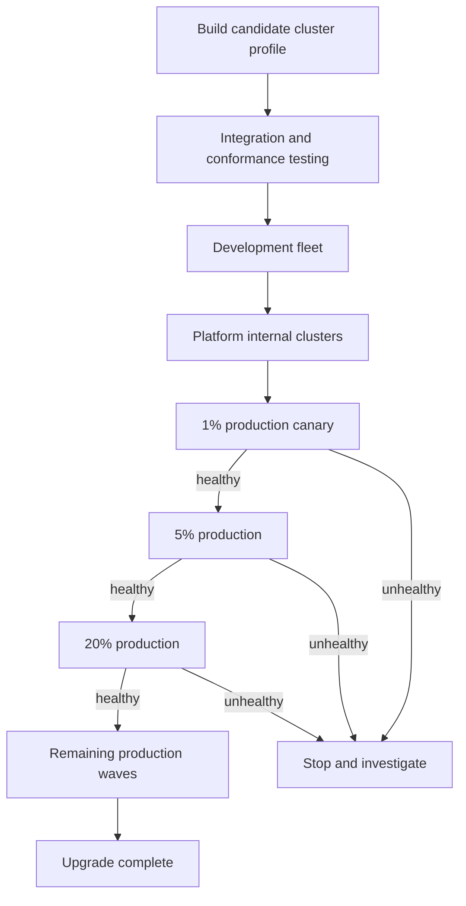

## 18.3 Cluster selection

Do not select only easy clusters for canaries.

The canary set should include:

* Small and large clusters
* Shared and dedicated clusters
* Stateful workloads
* Multiple regions
* Different network profiles
* Different node architectures
* High deployment activity
* High traffic

## 18.4 Upgrade steps per cluster

1. Mark cluster as upgrading.
2. Stop new tenant placement.
3. Run preflight checks.
4. Verify API removals and deprecated usage.
5. Check PDBs and topology.
6. Confirm spare capacity.
7. Upgrade control-plane components.
8. Validate API, etcd, scheduler and controllers.
9. Create new worker node pools.
10. Drain old workers gradually.
11. Run synthetic tests.
12. Observe for a bake period.
13. Return cluster to placement eligibility.
14. Delete old node pools after rollback window.

Kubernetes recommends upgrading the control plane before worker nodes and adjusting clients and manifests for API changes. ([Kubernetes][15])

## 18.5 Health gates

Stop rollout if any of these regress:

* API server error rate
* API latency
* Scheduling latency
* Pod start latency
* Network error rate
* Storage attach latency
* DNS error rate
* Node readiness
* Admission latency
* Application SLOs
* Deployment failure rate

## 18.6 Rollback reality

Worker nodes can usually be restored through immutable replacement.

Control-plane downgrade may not be safe or supported in every situation. Therefore:

* Take etcd backups.
* Preserve the old node pools.
* Use forward fixes where required.
* Test rollback procedures before production.
* Limit the number of clusters exposed before confidence is established.

---

# 19. Disaster recovery

Disaster recovery must distinguish between:

* Global management-plane failure
* Regional management-cell failure
* Workload-cluster failure
* Availability-zone failure
* Region failure
* Data-service failure

## 19.1 Global management-plane failure

The global plane is not in the application request path.

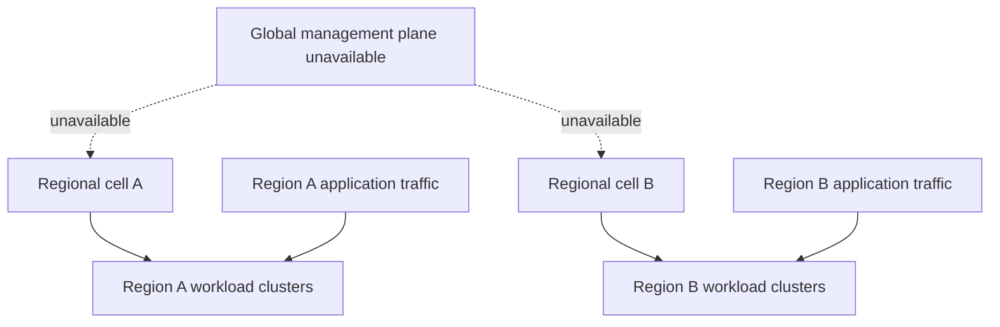

During a global outage:

### Continues working

* Existing applications
* Kubernetes scheduling
* Local autoscaling
* Regional ingress
* Service discovery
* Workload identity
* Regional deployments already present in the desired-state mirror
* Regional alerting
* Node replacement within predefined limits

### Degraded or unavailable

* New tenant creation
* Global placement decisions
* Cross-region fleet inventory
* Global cost reports
* New cluster profiles
* Global policy changes
* Some cross-region failover decisions

Regional cells buffer status changes and reconcile when the global plane returns.

## 19.2 Regional management-cell failure

Existing workload clusters continue operating.

Recovery options:

* Active-standby regional management cell
* Replicated regional state
* Controllers restarted in another availability zone
* Cluster agents continue from cached desired state
* Emergency access available through audited break-glass procedures

## 19.3 Workload-cluster failure

For critical tenants:

* Deploy across multiple clusters
* Prefer separate availability zones
* Remove the failed cluster from traffic
* Place additional replicas in surviving clusters
* Restore state from replication or backup
* Recreate the cluster declaratively

Do not attempt to repair a severely corrupted cluster indefinitely. Recreate it from the cluster profile.

## 19.4 Region failure

Stateless recovery:

1. Global traffic manager detects regional failure.
2. Traffic shifts to healthy regions.
3. Workload replicas in surviving regions scale up.
4. Capacity reservations absorb the increase.

Stateful recovery depends on the data layer:

* Active-active replication
* Active-passive replication
* Cross-region backups
* Explicit promotion procedure
* Application consistency checks

The declared service RPO and RTO determine the design.

---

# 20. Handling stateless and stateful workloads

Do not promise identical behavior for both.

## Stateless workload platform

Provide:

* Deployment templates
* HPA
* Multi-zone distribution
* PDB
* Regional deployment
* Global traffic management
* Fast rescheduling
* Automated canary rollout

## Stateful workload platform

Provide:

* StatefulSet and operator support
* Curated CSI storage
* Backup controllers
* Restore workflows
* Snapshot policies
* Quorum-aware disruption controls
* Storage topology rules
* Dedicated node pools when required
* Explicit data replication strategy
* Recovery testing

## Example service tiers

| Tier     | Stateless expectation        | Stateful expectation                                 |
| -------- | ---------------------------- | ---------------------------------------------------- |
| Bronze   | Single cluster               | Backup only                                          |
| Silver   | Multi-zone cluster           | Synchronous in-region replication                    |
| Gold     | Multiple clusters or regions | Cross-region replica and tested failover             |
| Platinum | Active-active cells          | Application-specific active-active data architecture |

---

# 21. Key platform APIs

The platform should expose higher-level intent rather than raw infrastructure configuration.

## 21.1 Tenant API

```yaml
kind: Tenant
spec:
  owner: music-discovery
  isolationProfile: dedicated-node-pool
  dataClassification: confidential
```

## 21.2 Cluster API

```yaml
kind: PlatformCluster
spec:
  region: eu-west
  profile: restricted-production-v10
  capacity:
    targetNodes: 100
  tenancy:
    mode: dedicated
```

## 21.3 Workload environment API

```yaml
kind: WorkloadEnvironment
spec:
  service: catalog-api
  environment: production
  regions:
    - eu-west
    - us-east
  availabilityTier: gold
```

## 21.4 Release API

```yaml
kind: Release
spec:
  service: catalog-api
  image:
    digest: sha256:abc123
  strategy:
    type: canary
    steps:
      - traffic: 1
        duration: 10m
      - traffic: 10
        duration: 30m
      - traffic: 50
        duration: 30m
      - traffic: 100
```

These APIs reduce developer exposure to cluster-specific details and allow the platform to change implementations later.

---

# 22. Important design trade-offs

## 22.1 Many clusters versus one large cluster

### Benefits of many clusters

* Smaller failure domains
* Independent upgrades
* Regional boundaries
* Stronger tenant isolation
* Better compliance separation
* Reduced control-plane contention
* Different workload profiles
* Easier cluster replacement
* Limited impact from bad CRDs or webhooks

### Costs

* More control planes
* More wasted capacity
* More certificate and identity management
* More complex networking
* More fragmented observability
* Harder workload placement
* More upgrades
* More configuration drift risk

### Decision

Use many clusters, but make clusters cheap operationally through:

* Declarative provisioning
* Versioned cluster profiles
* Fleet-wide controllers
* Standard add-ons
* Progressive delivery
* Automated conformance tests
* Central inventory
* Regional cells

The answer is not “more clusters are always better.” It is:

> Add clusters when the reduction in blast radius and isolation risk exceeds the operational and capacity cost.

## 22.2 Shared versus dedicated clusters

Shared clusters maximize utilization but require stronger policy and fairness controls.

Dedicated clusters maximize isolation but increase:

* Control-plane cost
* Capacity fragmentation
* Upgrade surface
* Operational ownership

The platform should automatically select the cheapest tenancy model that satisfies the tenant’s security and reliability requirements.

---

# 23. Capacity and reliability principles

## 23.1 Cluster size guardrails

Even if Kubernetes supports larger clusters, define an internal preferred operating envelope, for example:

```text
Preferred:
  fewer than 500 worker nodes
  fewer than 10,000–20,000 active pods
  bounded API object counts
  bounded tenant count
```

These are organizational guardrails rather than Kubernetes limits.

The purpose is to:

* Bound upgrade duration
* Bound control-plane load
* Bound outage impact
* Make capacity forecasting predictable
* Make cluster recreation practical

## 23.2 Cell size

For example:

```text
One regional management cell:
  100–200 workload clusters
  independent database
  independent queues
  independent credentials
  independent deployment workers
```

At 1,000 clusters, the platform may have 8–15 cells.

## 23.3 Error budgets

Define separate SLOs for:

* Workload API availability
* Tenant onboarding time
* Cluster provisioning time
* Deployment reconciliation time
* Identity exchange latency
* Regional ingress availability
* Upgrade success
* Autoscaling responsiveness

---

# 24. Direct answers to likely follow-up questions

## Why many clusters instead of one large cluster?

One cluster creates a shared API server, shared cluster-scoped resources, shared admission chain and shared lifecycle. A control-plane overload, bad webhook, faulty CNI change or failed upgrade can affect every tenant.

Multiple clusters provide:

* Bounded blast radius
* Regional failure isolation
* Independent upgrades
* Stronger trust boundaries
* Different configuration profiles
* Easier replacement

The trade-off is additional operational complexity and lower utilization. I address that through automated lifecycle management, standardized cluster profiles and fleet-level APIs.

---

## How would you isolate Apple Music from iCloud?

For critical production environments:

* Separate clusters
* Separate accounts or projects
* Separate VPCs
* Separate KMS keys
* Separate workload identity trust domains
* Separate ingress and egress infrastructure
* Separate secrets
* Explicitly authorized cross-domain communication

For lower environments, they may share clusters using namespaces or dedicated pools where permitted by the threat model.

---

## How would you prevent noisy neighbours?

At several layers:

* Namespace ResourceQuota and LimitRange
* Requests and limits
* Dedicated node pools
* PriorityClasses
* API Priority and Fairness
* Object-count quotas
* Network bandwidth and connection controls
* Storage IOPS classes
* Per-tenant observability quotas
* Queue isolation in platform services
* Dedicated clusters for workloads that cannot safely share

CPU quotas alone are insufficient because tenants can exhaust API, network, storage or telemetry resources.

---

## How would you upgrade 1,000 clusters safely?

I would use:

* Versioned cluster profiles
* Automated preflight checks
* Development and internal canaries
* 1%, 5%, 20% and broad production waves
* Representative canary clusters
* Health gates
* Automatic rollout pause
* Immutable node replacement
* PDB-aware draining
* Synthetic workload tests
* Bake periods
* Regional concurrency limits
* Preserved rollback capacity

The goal is not maximum upgrade speed. It is limiting the maximum number of simultaneously exposed clusters.

---

## What happens if the global control plane fails?

Existing application traffic and workload-cluster operation continue.

Regional cells operate from replicated desired state. Local scheduling, autoscaling, ingress, identity and observability continue.

Unavailable operations may include:

* New tenant creation
* Global placement
* Global policy changes
* New fleet-wide upgrades
* Global reporting

Status events are buffered and reconciled when the global plane returns.

---

## How would you onboard 10,000 developers?

Use:

* Corporate SSO
* Directory group integration
* Team and service catalog
* Self-service portal
* Platform templates
* Automated namespace creation
* Group-based RBAC
* GitOps deployment
* Standard dashboards
* Automated cost attribution
* Time-limited elevated access

Do not assign cluster access individually. Users inherit permissions from team and operational-role groups.

---

## How would you support both stateful and stateless workloads?

Offer different paved roads.

Stateless services receive Deployments, HPA, topology spreading, PDBs and multi-region routing.

Stateful services receive StatefulSets or operators, curated storage classes, zone-aware scheduling, backup and restore workflows, replication policies and stricter disruption controls.

For ordinary databases, prefer managed database services. In-cluster databases require mature operators and tested restore procedures.

---

# 25. Additional interview follow-up questions

## Architecture and scale

1. How many clusters should one regional cell manage?
2. How would you shard the fleet-management database?
3. How would you handle cluster inventory consistency?
4. How would you avoid a reconciliation storm after an outage?
5. How would you rate-limit controllers managing 1,000 clusters?
6. How would you choose the maximum preferred cluster size?
7. How would you support multiple infrastructure providers?
8. How would you migrate a workload between clusters?

## Tenancy and security

9. What Kubernetes resources are not namespace-scoped?
10. Can namespaces provide hard multi-tenancy?
11. When are dedicated nodes insufficient?
12. How do you prevent tenants from accessing node metadata services?
13. How do you secure custom controllers?
14. How do you handle privileged platform workloads?
15. How do you rotate workload identities?
16. How do you provide break-glass access?
17. How do you prevent admission webhooks from taking down the API?

## Scheduling and fairness

18. How do you guarantee capacity for critical services?
19. How do PriorityClasses and quotas interact?
20. What happens when a high-priority service preempts other workloads?
21. How do you prevent control-plane noisy neighbours?
22. How do you manage batch workloads alongside latency-sensitive services?
23. How do you account for daemonset overhead?
24. How do you safely overcommit CPU?

## Networking

25. How do services communicate across clusters?
26. How do you allocate pod and service CIDRs for 1,000 clusters?
27. How do you prevent address overlap?
28. How do you shard ingress?
29. How do you handle regional DNS failure?
30. How do you enforce tenant egress policy?
31. Would you deploy a service mesh?
32. How do you rotate service certificates?

## Storage and state

33. How do you recover a stateful service after cluster loss?
34. Is a volume snapshot sufficient for database backup?
35. How do you perform cross-region storage replication?
36. How do you avoid volume topology conflicts?
37. How do you safely upgrade a database operator?
38. How do you test restores?

## Upgrades and operations

39. What signals stop an upgrade rollout?
40. How many clusters would you upgrade concurrently?
41. How do you handle deprecated APIs?
42. How do you upgrade CNI without losing connectivity?
43. How do you handle workloads that block node draining?
44. What happens when PDBs make an upgrade impossible?
45. How do you roll back a control-plane upgrade?
46. How do you detect configuration drift?

## Developer experience

47. How much raw Kubernetes access should developers receive?
48. How would you design the developer portal?
49. How do teams request an exception to platform policy?
50. How do you measure platform developer productivity?
51. How do you prevent the platform team from becoming a ticket queue?
52. How do you version and deprecate platform APIs?

## Reliability and disaster recovery

53. How do regional cells elect ownership?
54. What state must be replicated globally?
55. What state must stay regional?
56. How do you recover a regional management cell?
57. How do you avoid two regions making conflicting placement decisions?
58. How do you test regional evacuation?
59. How do you operate during a global identity-provider outage?
60. What are the platform’s RTO and RPO?

---

# 26. A strong five-minute interview summary

> I would design the platform as a cell-based federated system. A thin global management plane owns tenant metadata, fleet inventory, policy versions and placement intent. Independent regional management cells provision and upgrade clusters, maintain regional desired state and continue operating if the global plane fails. Application traffic never traverses the global management plane.
>
> I would support an isolation ladder: namespaces for ordinary tenants, dedicated node pools for stronger compute isolation, dedicated clusters for critical workloads and separate accounts, networks, identities and keys for the highest security tier.
>
> Cluster lifecycle would be declarative and profile-based. Every cluster is created from a versioned profile containing Kubernetes, OS, runtime, networking, storage, policy and observability versions. Worker changes use immutable replacement.
>
> Developers onboard through SSO and a self-service portal. A tenant controller creates namespaces, quotas, identity bindings, network policies, deployment repositories, dashboards and cost labels. Access is group-based rather than assigned per user.
>
> Workloads are deployed through signed artifacts and regional pull-based reconciliation. Admission policy enforces security and reliability standards. Noisy-neighbour protection covers CPU, memory, API usage, network, storage and telemetry.
>
> Upgrades proceed through representative canaries and progressively larger waves, with automated health gates and regional concurrency limits. A global management-plane outage prevents new global changes but does not interrupt existing applications, regional ingress, scheduling, autoscaling or workload identity.
>
> Finally, stateless and stateful workloads receive separate paved roads. Stateless services rely on replication and traffic routing; stateful services require curated storage, operators, backups, application-level replication and tested recovery procedures.

[1]: https://cluster-api.sigs.k8s.io/?utm_source=chatgpt.com "Introduction - The Cluster API Book"
[2]: https://kubernetes.io/docs/concepts/security/multi-tenancy/?utm_source=chatgpt.com "Multi-tenancy | Kubernetes"
[3]: https://kubernetes.io/docs/tasks/run-application/configure-pdb/?utm_source=chatgpt.com "Specifying a Disruption Budget for your Application"
[4]: https://kubernetes.io/docs/concepts/security/pod-security-admission/?utm_source=chatgpt.com "Pod Security Admission | Kubernetes"
[5]: https://kubernetes.io/docs/reference/access-authn-authz/validating-admission-policy/?utm_source=chatgpt.com "Validating Admission Policy | Kubernetes"
[6]: https://kubernetes.io/docs/tasks/administer-cluster/namespaces/?utm_source=chatgpt.com "Share a Cluster with Namespaces | Kubernetes"
[7]: https://kubernetes.io/docs/concepts/cluster-administration/flow-control/?utm_source=chatgpt.com "API Priority and Fairness"
[8]: https://kubernetes.io/docs/concepts/security/service-accounts/?utm_source=chatgpt.com "Service Accounts | Kubernetes"
[9]: https://kubernetes.io/docs/reference/kubernetes-api/networking/network-policy-v1/?utm_source=chatgpt.com "NetworkPolicy | Kubernetes"
[10]: https://kubernetes.io/docs/concepts/storage/volumes/?q=configmap&utm_source=chatgpt.com "Volumes | Kubernetes"
[11]: https://kubernetes.io/docs/concepts/workloads/controllers/statefulset/?utm_source=chatgpt.com "StatefulSets"
[12]: https://kubernetes.io/docs/concepts/workloads/autoscaling/?utm_source=chatgpt.com "Autoscaling Workloads | Kubernetes"
[13]: https://kubernetes.io/docs/concepts/cluster-administration/node-autoscaling/?utm_source=chatgpt.com "Node Autoscaling | Kubernetes"
[14]: https://kubernetes.io/docs/reference/instrumentation/metrics/?utm_source=chatgpt.com "Kubernetes Metrics Reference"
[15]: https://kubernetes.io/docs/tasks/administer-cluster/cluster-upgrade/?utm_source=chatgpt.com "Upgrade A Cluster | Kubernetes"
