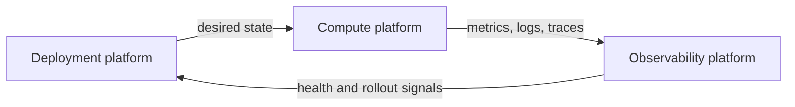
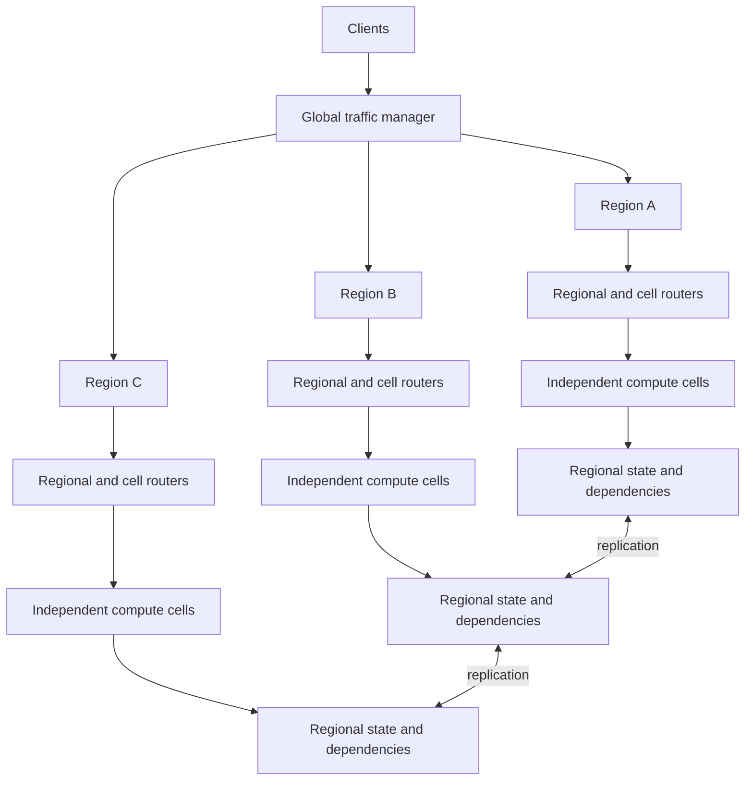
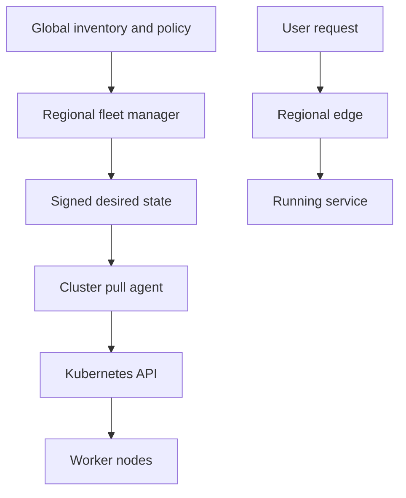
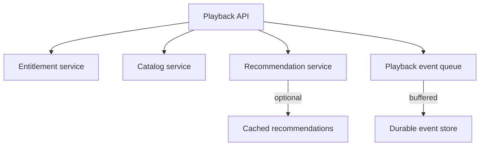
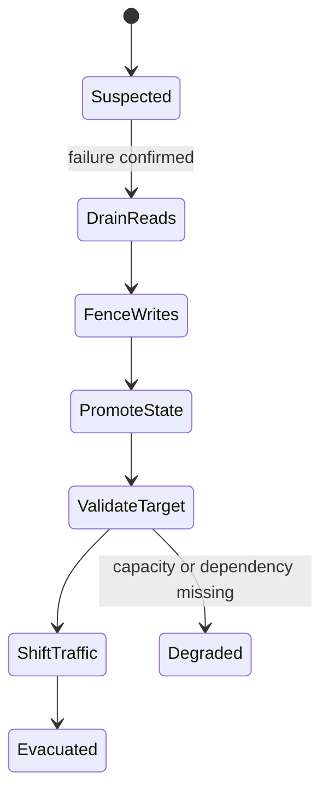
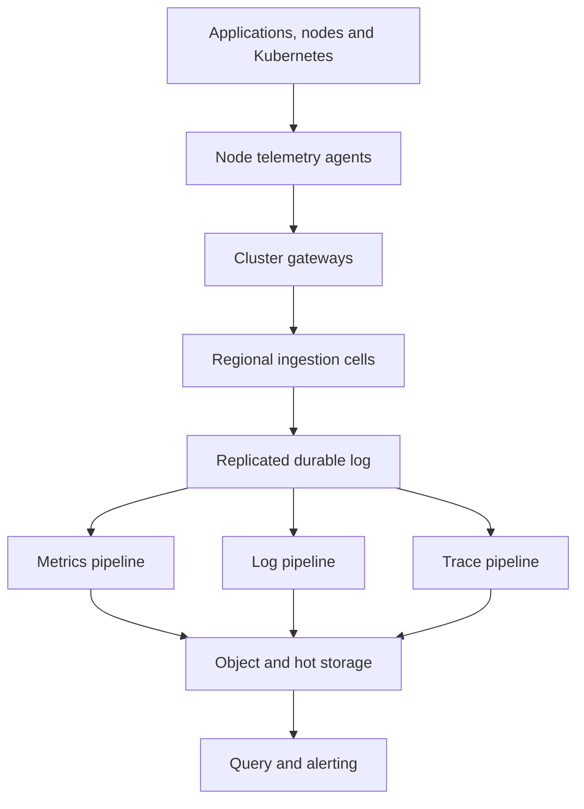
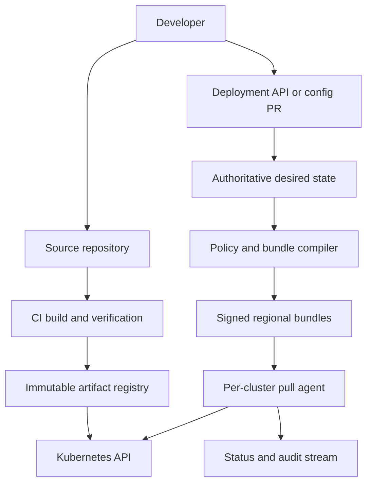
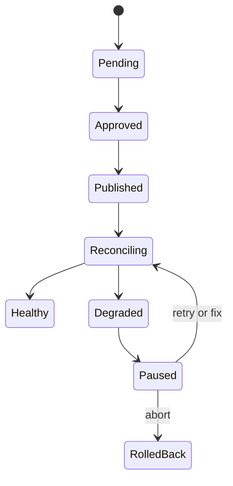
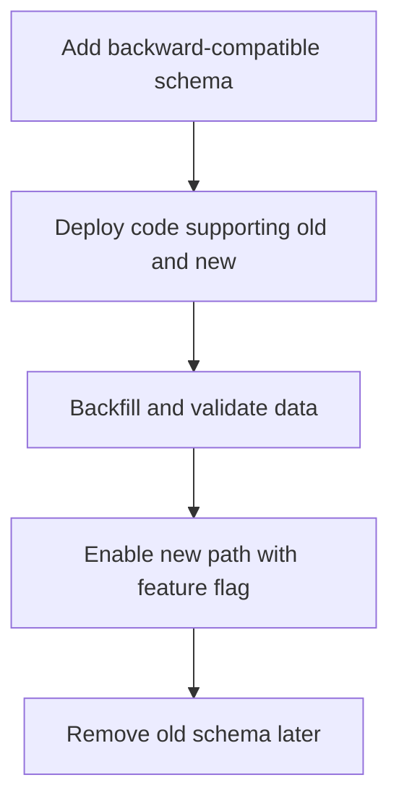

# Overall framing

I would treat these as three connected platforms:



The critical design rule is:

> A failure of the deployment or observability control plane must not stop already-running production workloads.

The following is a hypothetical design suitable for Apple-scale services; it does not imply Apple’s actual architecture.

---

# 1. Highly available compute platform

## 1.1 Requirements and guarantees

Assume:

* Thousands of services and clusters.
* Millions of containers.
* Three or more geographic regions.
* Three availability zones per region.
* Stateless APIs, streaming services, background workers and stateful systems.
* Individual services have different durability and consistency requirements.
* A bad tenant deployment must not affect unrelated tenants.

### Explicit objectives

| Objective                     |                                         Proposed target |
| ----------------------------- | ------------------------------------------------------: |
| User-serving availability SLO |          99.99% successful requests per rolling 30 days |
| Latency SLO                   |        Example: 99.9% of eligible requests under 300 ms |
| Zone-loss traffic RTO         |                                         Under 2 minutes |
| Region-loss read RTO          |                                         Under 2 minutes |
| Region-loss write RTO         |                    Under 10 minutes for Tier-0 services |
| In-region RPO                 |                               0 for acknowledged writes |
| Cross-region RPO              | Depends on state class: 0, 5 seconds or reconstructable |
| Global control-plane RTO      |         30 minutes; existing workloads remain available |
| Regional evacuation           |   Traffic and Tier-0 writes recovered within 10 minutes |

A 99.99% availability SLO gives approximately 4.4 minutes of monthly equivalent unavailability, although a request-based SLI is better than simply measuring downtime.

The SLI could be:

[
Availability =
\frac{\text{successful requests meeting correctness criteria}}
{\text{all eligible requests}}
]

Timeouts, 5xx responses and incorrect stale responses count as failures.

## 1.2 State classes and RPO

Not all data should pay the cost of global synchronous replication.

| State class              | Examples                                         | Replication                                            | Region-loss RPO | Failover behavior                                            |
| ------------------------ | ------------------------------------------------ | ------------------------------------------------------ | --------------: | ------------------------------------------------------------ |
| Class A: no-loss         | Account security, entitlement, billing           | Synchronous cross-region quorum or durable global log  |               0 | May temporarily reject writes rather than risk inconsistency |
| Class B: low-loss        | Playlist edits, playback position, user metadata | Synchronous within region, asynchronous across regions |      ≤5 seconds | Promote follower after fencing old writer                    |
| Class C: reconstructable | Caches, indexes, recommendations                 | Asynchronous or rebuildable                            |   Minutes/hours | Rebuild from authoritative source                            |
| Class D: ephemeral       | Sessions, temporary calculations                 | Replicated cache or client retry                       |    No guarantee | Recreate or require reauthentication                         |

An important interview statement is:

> Active-active compute does not automatically mean active-active database writes.

Compute can accept traffic in every region while each data shard still has one authoritative writer.

---

## 1.3 Capacity model

Suppose global peak demand is one million requests per second across three active regions.

Provision each region for 600,000 requests per second:

* Normal traffic per region: approximately 333,000 RPS.
* Provisioned regional capacity: 600,000 RPS.
* Total capacity: 1.8 million RPS, or 180% of global peak.

Within each region, place 200,000 RPS of capacity in each of three zones.

### During one-zone loss

The region retains:

[
2 \times 200,000 = 400,000 \text{ RPS}
]

That is sufficient for its normal 333,000 RPS load with approximately 20% headroom.

### During one-region loss

The two surviving regions retain:

[
2 \times 600,000 = 1.2 \text{ million RPS}
]

That supports the global one-million-RPS peak with 20% headroom.

### Simultaneous region and zone loss

If one region disappears and one zone in another region disappears:

[
600,000 + 400,000 = 1,000,000 \text{ RPS}
]

The platform can meet peak demand, but without reserve. Nonessential work should be shed.

These numbers are illustrative. Real capacity must account for:

* CPU, memory, storage IOPS and network separately.
* Regional data residency.
* Per-service hotspots.
* Cold-start time.
* State-store capacity.
* Downstream dependency capacity.
* Failover traffic amplification caused by retries.

Reserved quota is not enough: the receiving region must also have nodes, IP addresses, load-balancer capacity, database replicas, KMS limits and dependent-service quota.

---

## 1.4 Architecture



Each region contains multiple cells. A cell is an independently operated failure unit containing:

* One or more Kubernetes clusters.
* Ingress and service-routing components.
* Independent node pools.
* Local service discovery.
* Local caches and queues.
* Regional state endpoints.
* Workload-identity and secret-resolution services.
* Separate deployment and observability agents.

A service is spread across multiple cells. A cluster failure therefore affects only a bounded percentage of traffic.

## 1.5 Failure-domain hierarchy

| Domain                  | Protection                                                     |
| ----------------------- | -------------------------------------------------------------- |
| Process/container       | Multiple replicas, readiness checks and restart                |
| Node                    | Anti-affinity, rescheduling and spare nodes                    |
| Rack/power domain       | Topology-aware placement                                       |
| Availability zone       | Replicas across three zones; zone-independent ingress          |
| Cluster/cell            | Multiple independent cells; limit tenant size per cell         |
| Region                  | Three active regions or active plus warm standby               |
| Global management plane | Regional autonomy; management plane excluded from request path |

For Kubernetes workloads:

* `topologySpreadConstraints` spread replicas across zones and hosts.
* Pod anti-affinity prevents all replicas sharing one node.
* PodDisruptionBudgets protect voluntary operations, not physical failures.
* Priority classes reserve resources for Tier-0 workloads.
* Separate node pools isolate system components, batch jobs and latency-sensitive services.
* Admission policy rejects a Tier-0 workload with insufficient replica or topology configuration.

---

## 1.6 Control plane versus data plane



The user request never passes through the global management plane.

If the global control plane fails:

* Running pods continue.
* Existing load balancers and service discovery continue.
* Autoscaling operates regionally.
* Cluster agents keep the last valid desired state.
* New global placements and large deployments pause.
* Regional operators can perform controlled emergency actions.

---

## 1.7 Workload models

| Workload             | Placement                                           | HA model                                              |
| -------------------- | --------------------------------------------------- | ----------------------------------------------------- |
| Stateless API        | Multiple replicas across zones, cells and regions   | Active-active                                         |
| Media streaming edge | Regional active-active with CDN/origin failover     | Active-active                                         |
| Stateful database    | Quorum replicas across zones; cross-region replicas | Single writer per shard or globally consistent quorum |
| Background worker    | Multiple regions with leased partitions             | Active-active workers with fenced ownership           |
| Scheduled job        | Regional leader lease and idempotency key           | Active-passive execution                              |
| ML/batch workload    | Interruptible capacity with checkpointing           | Restart or move after failure                         |
| Cache                | Per-cell and per-region copies                      | Reconstructable                                       |

Background work needs particular care. A job must not execute twice merely because its region failed. Use:

* Globally unique job IDs.
* Idempotent processing.
* Partition leases containing an epoch or fencing token.
* Checkpoints in durable storage.
* Deduplication at side-effect boundaries.

---

## 1.8 Traffic management

Traffic is managed at several layers:

1. Global traffic manager selects a healthy, policy-compatible region.
2. Regional load balancer selects a healthy cell.
3. Cell ingress selects a service instance.
4. Service mesh or client-side routing handles instance-level retries.

Routing inputs include:

* Region and cell health.
* Client latency.
* Data residency.
* Available capacity.
* Data-shard ownership.
* Deployment version.
* Error rate and saturation.
* Dependency availability.

Use a low DNS TTL where DNS is involved, but do not depend solely on DNS. Existing connections, ISP caches and long-lived streams will outlive the TTL. Anycast, connection draining and application-level reconnect behavior are also required.

Retries must use:

* Exponential backoff and jitter.
* A retry budget.
* Idempotency keys for writes.
* A different endpoint only when safe.
* No uncontrolled nested retries across multiple service layers.

---

## 1.9 Health checks

Different health checks answer different questions.

| Level              | Signal                                                       | Action                           |
| ------------------ | ------------------------------------------------------------ | -------------------------------- |
| Container liveness | Is the process irrecoverably stuck?                          | Restart container                |
| Pod readiness      | Can this instance safely serve?                              | Remove from load balancing       |
| Cell health        | Are ingress, DNS, compute and critical dependencies working? | Stop sending new traffic to cell |
| Region health      | Can an end-to-end synthetic request succeed?                 | Drain region                     |
| Data health        | Is the replica current and able to become writer?            | Permit or reject promotion       |
| Capacity health    | Can the target survive shifted load?                         | Permit or block evacuation       |

Avoid using a dependency failure as a liveness failure. Restarting every pod because a database is down creates a restart storm.

Regional evacuation should require multiple independent signals, such as:

* External synthetic probes.
* Server-side success rate.
* Network reachability.
* State-store health.
* Regional control-plane health.

Use hysteresis: failing a region may take 30–60 seconds of sustained evidence, while returning it to service should take considerably longer.

---

## 1.10 Secrets and workload identity

A regional failover can succeed only if the receiving region can authenticate and obtain secrets.

The design should provide:

* Workload identity based on service and tenant, not node credentials.
* Short-lived credentials issued regionally.
* Encrypted secret replicas in all approved failover regions.
* Regional KMS capacity and replicated key metadata.
* Region-specific key wrapping where required.
* No plaintext secrets in Git or container images.
* Continuous secret-readiness checks in standby regions.

A workload starts with an identity token, then retrieves only its allowed secret references. If the global identity service is unavailable, the regional issuer continues using cached policy and regional trust material.

---

## 1.11 Dependency isolation

Every service dependency should have a declared resilience policy.



Isolation mechanisms include:

* Separate connection pools per dependency.
* Circuit breakers.
* Concurrency limits.
* Per-tenant and per-service quotas.
* Bulkheads for thread pools and queues.
* Timeouts shorter than the upstream deadline.
* Cell-local dependency instances.
* Durable queues for noninteractive side effects.
* Cached or simplified responses for optional features.

A failure in recommendations must not exhaust threads required for entitlement checks.

---

## 1.12 Graceful degradation

For an Apple Music-like workload:

| Failure                               | Degraded behavior                        |
| ------------------------------------- | ---------------------------------------- |
| Recommendation service unavailable    | Show recently cached recommendations     |
| Artwork service unavailable           | Return metadata with placeholder artwork |
| Playback-event pipeline unavailable   | Buffer events and continue playback      |
| Search index unavailable              | Show recent searches and library content |
| Lyrics unavailable                    | Continue audio playback                  |
| Personalization database unavailable  | Serve generic regional content           |
| Entitlement cannot be verified safely | Fail closed for protected content        |
| New deployment system unavailable     | Continue last-known-good version         |

Features should be assigned criticality levels before an incident, not during one.

---

## 1.13 Zone failure flow

Assume Zone B loses power:

1. External and internal health checks detect failed endpoints.
2. Regional load balancers remove Zone B instances.
3. Existing clients reconnect to Zones A and C.
4. Stateful quorum remains available using replicas in A and C.
5. Kubernetes observes lost nodes and reschedules eligible pods.
6. Reserved node capacity absorbs replacements.
7. Autoscaling increases replicas if remaining utilization rises.
8. Queue consumers redistribute partitions using fenced leases.
9. Observability marks the zone as failed and suppresses duplicate pod alerts.
10. Deployment controllers pause disruptive rollouts in that region.

Traffic recovery does not have to wait for pods to reschedule because sufficient active capacity already exists in the surviving zones.

---

## 1.14 Regional evacuation flow

A region evacuation must coordinate traffic, state, compute, secrets and dependencies.



Detailed sequence:

1. Confirm failure using independent signals.
2. Stop assigning new sessions to the region.
3. Shift safe read traffic to healthy regions.
4. Revoke the old region’s write lease.
5. Require services in the old region to reject writes when they cannot renew the lease.
6. Select the most current replica and verify replication lag.
7. Promote it with a higher epoch/fencing token.
8. Validate compute capacity, secrets, KMS, identity, DNS, queues and downstream services.
9. Scale pre-warmed compute if required.
10. Shift traffic in stages, for example 1%, 10%, 50%, 100%.
11. Monitor error rate, latency, saturation and data correctness.
12. Shed noncritical workloads if capacity approaches its emergency threshold.

### Preventing split brain

Traffic routing alone cannot prevent split brain because the isolated region may still serve some clients.

The data writer must hold a lease from a quorum outside the failure domain. Every mutation carries the writer epoch. When a new region obtains epoch 43, writes from the old epoch 42 are rejected.

For Class A data, if the platform cannot safely determine a writer, it sacrifices write availability and rejects writes.

---

## 1.15 Failback procedure

Failback should not be the reverse of failover performed at full speed.

1. Repair the original region.
2. Rebuild or validate compute, networking, identity and secrets.
3. Replicate all data from the current authoritative region.
4. Confirm zero or acceptable replication lag.
5. Run synthetic and shadow traffic.
6. Add the region back for reads only.
7. Shift 1%, 5%, 25%, 50% and then normal traffic.
8. If writer ownership must return, acquire a new fencing epoch.
9. Monitor for an extended soak period.
10. Restore normal capacity reserves.
11. Close temporary degradation flags and reconcile emergency changes.

Do not automatically move the writer back merely because the old region has recovered. Every move is another risky event.

---

## 1.16 Important failure matrix

| Failure                 | Expected platform behavior                                                                          |
| ----------------------- | --------------------------------------------------------------------------------------------------- |
| Pod/node                | Route around immediately; reschedule                                                                |
| Availability zone       | Surviving zones carry normal regional traffic                                                       |
| Kubernetes cluster      | Other cells take traffic                                                                            |
| Entire region           | Fence state, promote replica and shift traffic                                                      |
| Global management plane | Existing services run; global changes pause                                                         |
| Regional secret service | Existing short-lived credentials continue briefly; start operations pause or use replicated service |
| Database leader         | Elect/promote with fencing                                                                          |
| Optional dependency     | Circuit-break and degrade                                                                           |
| Network partition       | Only partition holding the valid write lease may accept writes                                      |
| Major bad deployment    | Halt rollout and revert desired-state digest                                                        |

---

# 2. Observability platform

## 2.1 Scale assumptions

Illustrative assumptions:

* 5,000 clusters.
* Two million containers.
* 100 active metric series per container after filtering.
* Metric scrape interval of 30 seconds.
* Average logs of 0.5 KB/s per container.
* Two million requests per second globally with 1% traces retained.

### Approximate volume

Metrics:

[
\frac{2,000,000 \times 100}{30}
\approx 6.7\text{ million samples/second}
]

Logs:

[
2,000,000 \times 0.5\text{ KB/s}
\approx 1\text{ GB/s}
\approx 86\text{ TB/day}
]

Traces, assuming 10 spans and 500 bytes per span:

[
2,000,000 \times 1% \times 10 \times 500
\approx 100\text{ MB/s}
]

These estimates immediately require sharding, sampling, tiered retention and strict tenant limits.

## 2.2 Proposed SLOs

| Capability                           |                                      SLO |
| ------------------------------------ | ---------------------------------------: |
| Telemetry ingestion acceptance       |                                   99.95% |
| Tier-0 alert evaluation and delivery |                                   99.99% |
| Interactive query availability       |                                    99.9% |
| Recent-metrics query latency         |                      95% under 5 seconds |
| Region recovery RTO                  |                               15 minutes |
| Acknowledged data RPO within region  |                                        0 |
| Region-destruction RPO               |          ≤5 minutes for normal telemetry |
| Audit/security telemetry             | Separate no-loss pipeline where required |

Telemetry priorities differ:

1. Security and audit events.
2. SLO and paging metrics.
3. Operational logs and traces.
4. Debug logs and high-volume profiling data.

When overloaded, the platform drops lower-priority data first.

---

## 2.3 Architecture



### Node agents

A DaemonSet on every node collects:

* Container stdout/stderr.
* Node and kubelet metrics.
* Kubernetes metadata.
* OTLP metrics, logs and traces.
* Host and network telemetry.
* Optional eBPF signals.

Agents:

* Enrich events with tenant, cluster, namespace, workload and version.
* Remove forbidden labels and fields.
* Batch and compress.
* Maintain a bounded local disk queue.
* Retry with backoff.
* Track file offsets.
* Never block the application because the backend is unavailable.

### Cluster gateways

Cluster-level collectors provide:

* Aggregation and relabeling.
* Trace tail-sampling.
* Per-tenant rate limiting.
* A second buffering layer.
* One authenticated egress path per cluster.
* Reduction of connections to the regional backend.

Gateways should be deployed across zones and protected by disruption budgets.

---

## 2.4 Ingestion and acknowledgment

Each telemetry request carries:

* Tenant ID.
* Service identity.
* Region and cluster.
* Data type.
* Priority.
* Schema/version.

The regional gateway authenticates with mTLS or workload identity, then applies:

* Tenant quota.
* Payload-size limit.
* Cardinality policy.
* Schema validation.
* Rate limiting.
* Priority classification.

Data is acknowledged only after it has reached a replicated durable log in at least two availability zones.

Agents delete local buffered data only after acknowledgment. Delivery is therefore at least once, so downstream systems must tolerate duplicates:

* Metrics deduplicate by series and timestamp.
* Logs include an event ID or source offset when necessary.
* Traces identify spans by trace and span ID.

---

## 2.5 Partitioning

Partition keys should balance locality and load:

| Data type   | Partition key                         |
| ----------- | ------------------------------------- |
| Metrics     | `hash(tenant_id, series_fingerprint)` |
| Logs        | `hash(tenant_id, stream_fingerprint)` |
| Traces      | `hash(tenant_id, trace_id)`           |
| Alert rules | `hash(tenant_id, rule_group)`         |

Partitioning traces by `trace_id` brings spans together for tail sampling.

Tenant ID must participate in every partition and authorization decision. Very large tenants can be assigned dedicated ingestion cells so they cannot consume all shared partitions.

---

## 2.6 Storage and indexing

| Signal  | Hot storage                          | Durable storage           | Index                                                    |
| ------- | ------------------------------------ | ------------------------- | -------------------------------------------------------- |
| Metrics | Recent compressed time-series chunks | Object-store blocks       | Tenant, label names/values and time                      |
| Logs    | Recent stream chunks                 | Compressed object storage | Selected labels and time                                 |
| Traces  | Recent trace cache                   | Columnar/object blocks    | Trace ID, service, operation, duration and selected tags |

Do not index every log field. Indexing unbounded strings such as exception messages, user IDs or URLs creates extreme cost and cardinality.

A better log model is:

* Index stable labels such as service, region, cluster, namespace and severity.
* Store the complete structured log in compressed chunks.
* Search chunk contents only after the index narrows the time and stream range.

---

## 2.7 Retention and aggregation

Example policy:

| Signal          |    Raw retention |         Aggregated retention |
| --------------- | ---------------: | ---------------------------: |
| Tier-0 metrics  |          30 days |   13-month hourly aggregates |
| Normal metrics  |          14 days |    6-month hourly aggregates |
| Debug metrics   |           3 days |                         None |
| Production logs |       14–30 days | Compliance-dependent archive |
| Debug logs      |         3–7 days |                         None |
| Traces          |           7 days | Aggregate service statistics |
| Audit logs      | Policy-dependent |            Immutable archive |

Metrics are compacted into progressively larger blocks and downsampled. Object storage is used for long retention because compute-local disks are too expensive at this scale.

---

## 2.8 Cardinality control

A metric series is defined by its name and complete label set:

```text
http_requests_total{
  service="catalog",
  region="sg",
  status="200"
}
```

Never use labels such as:

* User ID.
* Session ID.
* Request ID.
* Full URL.
* Timestamp.
* Error message.
* Pod UID when a stable workload label is sufficient.

Cardinality controls should exist at several layers:

1. SDK linting and developer guidance.
2. CI validation for known metric definitions.
3. Agent-side label filtering.
4. Per-tenant active-series limits.
5. Per-metric label-value limits.
6. Ingestion-time rejection or overflow buckets.
7. Cardinality dashboards and budget alerts.
8. Automatic expiry of unused series.
9. Chargeback for excessive usage.

If a tenant exceeds its limit, preserve its critical allowlisted metrics and drop or aggregate lower-priority series.

---

## 2.9 Backend and network failures

### Storage unavailable, ingestion healthy

* Ingestion continues writing to the replicated broker.
* Consumers stop committing offsets.
* The broker absorbs the outage up to its configured retention.
* Alerts based on already-ingested recent data may continue from hot storage.
* If the broker approaches capacity, debug data is shed first.

### Regional ingestion unavailable

* Agents buffer to local disk.
* Cluster gateways buffer a second copy where configured.
* Agents retry with exponential backoff and jitter.
* Tier-0 telemetry may fail over to a paired region.
* Ordinary telemetry remains local to avoid overloading the secondary.
* Applications continue serving; telemetry failure never blocks them.

For example, a 10 GB agent buffer receiving compressed telemetry at 2 MB/s lasts approximately:

[
\frac{10 \times 1024}{2} \approx 5120\text{ seconds}
\approx 85\text{ minutes}
]

Local buffering is bounded. During an eight-hour partition, some data will be lost unless more storage or an alternate backend exists.

### Logs during a network partition

The agent records the last acknowledged file offset. It continues tailing into its disk spool. When communication returns:

1. Buffered segments are replayed in order.
2. The backend deduplicates where event identity exists.
3. If the buffer filled, lowest-priority segments were deleted first.
4. A data-loss metric identifies the exact node and time interval.

Audit logs should use a separate, more durable path rather than competing with debug logs.

---

## 2.10 Query architecture

A query frontend:

* Authenticates the tenant.
* Determines which regions and time blocks contain data.
* Splits large queries by time and shard.
* Places them in a fair query scheduler.
* Uses result and metadata caches.
* Enforces CPU, scan-byte and concurrency limits.
* Merges partial results.
* Clearly labels incomplete results.

Global dashboards should query regional aggregates by default. Raw log queries stay regional unless explicitly authorized, reducing network cost and preserving data residency.

---

## 2.11 Alerting

Alert rules run close to the data in each region.

The alert pipeline contains:

* Sharded rule evaluators.
* Replicated rule ownership.
* Alert state checkpoints.
* Deduplication.
* Grouping and inhibition.
* Silence management.
* Independent notification delivery.
* Dead-man alerts proving the pipeline is alive.

For SLO alerting, use multi-window burn rates rather than simple instantaneous thresholds. For example:

* Fast burn: two-hour error budget being consumed extremely quickly.
* Slow burn: sustained degradation over several hours.

The monitoring system itself needs out-of-band monitoring from separate infrastructure. Otherwise, a compute-region failure may take down both the service and the system expected to report it.

---

## 2.12 Correlating metrics, logs and traces

Every signal should share common resource attributes:

```text
tenant
service
environment
region
cluster
namespace
workload
deployment_version
pod
```

Correlation mechanisms:

* Put trace IDs and span IDs in structured logs.
* Add trace exemplars to latency histograms.
* Attach deployment version to all signals.
* Record Kubernetes ownership metadata.
* Link alerts to dashboards, traces, logs, deployment and runbook.

Example incident flow:

1. An SLO alert reports increased playback latency.
2. The latency histogram contains an exemplar.
3. The exemplar opens a slow distributed trace.
4. The trace shows time spent in the entitlement service.
5. Logs for the trace ID show connection-pool exhaustion.
6. The deployment version indicates the problem began with release `v4.8.2`.
7. The deployment platform pauses and rolls back that release.

---

## 2.13 Tenant isolation and cost control

Tenant isolation includes:

* Per-tenant identities and encryption boundaries.
* Ingestion quotas.
* Active-series limits.
* Log bytes-per-second limits.
* Trace sampling budgets.
* Query concurrency and scan limits.
* Fair scheduling.
* Dedicated cells for extremely large tenants.
* No cross-tenant cache keys or indexes.
* Chargeback dashboards.

Cost is controlled by:

* Collecting only actionable telemetry.
* Aggregating at the agent or gateway.
* Adaptive and tail-based trace sampling.
* Short retention for debug data.
* Object storage for cold data.
* Compression and compaction.
* Log-field and label controls.
* Recording rules for frequently used expensive queries.
* Per-team budgets and usage attribution.

---

# 3. Deployment and GitOps platform

## 3.1 Requirements

Assume:

* 10,000 developers.
* Thousands of clusters.
* Hundreds of thousands of deployed workload instances.
* Multiple environments and geographic regions.
* Strong separation between application delivery and cluster administration.
* Progressive deployment with automatic health analysis.
* Complete audit history.
* Existing applications must continue if the deployment platform fails.

### Proposed SLOs

| Capability                                         |               Target |
| -------------------------------------------------- | -------------------: |
| Deployment API availability                        |                99.9% |
| Desired-state distribution                         |               99.95% |
| Status freshness                                   | 99% within 2 minutes |
| Tier-0 rollback initiation                         |      Under 2 minutes |
| Existing application impact during platform outage |                 None |
| Desired-state metadata RPO                         |                    0 |
| Control-plane regional RTO                         |           30 minutes |

---

## 3.2 Architecture



Git remains the human-reviewable source of truth, but thousands of clusters should not all continuously clone a giant monorepo.

Instead:

1. Git stores authoritative declarations.
2. The platform compiles per-cluster desired-state bundles.
3. Bundles are immutable, content-addressed and signed.
4. Regional object or OCI distribution makes them scalable.
5. Cluster agents pull and verify the relevant bundle.
6. Git history remains the audit origin; bundles are the scalable distribution format.

---

## 3.3 Core objects

| Object            | Purpose                                                  |
| ----------------- | -------------------------------------------------------- |
| Application       | Owner, source, artifact and operational metadata         |
| Environment       | Development, staging, production and policy requirements |
| Release           | Immutable artifact digest plus configuration version     |
| RolloutPlan       | Targets, rings, strategy and health criteria             |
| ClusterAssignment | Which application belongs on which clusters              |
| Approval          | Identity, scope, timestamp and justification             |
| ObservedState     | Version and health reported by each cluster              |
| BreakGlassLease   | Narrow, time-bound emergency exception                   |

A simplified API request might be:

```json
{
  "application": "music-catalog",
  "environment": "production",
  "artifactDigest": "sha256:93a7...",
  "configRevision": "git:8f21c4",
  "strategy": {
    "type": "canary",
    "rings": ["preprod", "prod-canary", "prod-10", "prod-50", "prod-all"]
  },
  "healthPolicy": "tier0-standard",
  "changeReason": "catalog cache optimization"
}
```

The API returns a release ID. It does not directly call every Kubernetes API server.

---

## 3.4 Build and artifact flow

1. Developer pushes source.
2. CI runs tests, static analysis and security scanning.
3. CI builds the artifact once.
4. It generates an SBOM and provenance statement.
5. The artifact is scanned and cryptographically signed.
6. The artifact is pushed by immutable digest.
7. Deployment configuration references the digest, not a mutable tag.
8. The same digest is promoted through staging and production.

“Build once, promote many” prevents production from receiving an artifact different from the one tested in staging.

Policy may require:

* Trusted builder.
* Approved base image.
* No critical vulnerability.
* Valid signature and provenance.
* Resource requests and limits.
* Required probes.
* Minimum replicas and topology spread.
* Approved network policy.
* Correct tenant ownership.
* No privileged container unless explicitly approved.

---

## 3.5 Reconciliation flow



Per-cluster reconciliation is:

1. Pull desired-state metadata.
2. Verify transport identity.
3. Verify bundle signature and tenant scope.
4. Compare desired and observed state.
5. Run local admission policies.
6. Apply using server-side apply or another idempotent mechanism.
7. Watch rollout readiness.
8. Report observed version, conditions and errors.
9. Repeat until convergence.

The agent uses outbound communication. The central platform holds no universal inbound cluster-admin credential.

---

## 3.6 Progressive rollout

A production release might use:

| Ring              |   Example targets | Purpose                                 |
| ----------------- | ----------------: | --------------------------------------- |
| Preproduction     |     Test clusters | Functional and integration validation   |
| Employee/internal |    Internal users | Realistic traffic                       |
| Production canary |        5 clusters | Detect major production-specific issues |
| Ring 1            |     5% of traffic | Validate SLOs                           |
| Ring 2            |               25% | Detect scale-sensitive problems         |
| Ring 3            |               50% | Confirm broad stability                 |
| Global            | Remaining targets | Complete deployment                     |

Each ring has:

* Minimum observation period.
* Maximum concurrent clusters.
* Error-rate and latency criteria.
* Resource-saturation criteria.
* Business correctness metrics.
* Automatic pause and rollback thresholds.
* Manual override rules.

Cluster selection should mix regions, hardware and traffic profiles without exposing a large percentage of any one customer population.

Rollout analysis must fail safe: if observability is unavailable, the rollout pauses rather than assuming success.

---

## 3.7 Rollout strategies

| Strategy       | Best use                                     | Trade-off                                |
| -------------- | -------------------------------------------- | ---------------------------------------- |
| Rolling update | Ordinary backward-compatible changes         | Simple, but old and new coexist          |
| Canary         | Risky or high-scale changes                  | Slow but strong blast-radius control     |
| Blue-green     | Fast cutover and rollback                    | Requires duplicate capacity              |
| Traffic split  | Behavioural testing with precise percentages | Requires routing integration             |
| Shadow         | Validate read-only behavior                  | Extra cost; cannot validate side effects |
| Feature flag   | Decouple deployment from activation          | Adds flag lifecycle complexity           |

A rollback usually changes the desired artifact digest back to the previous release. It does not blindly “undo” every operation because data migrations and external side effects may be irreversible.

---

## 3.8 Handling partial deployments

A multi-cluster deployment cannot be a single ACID transaction. Partial state is normal.

The control plane records:

```text
Desired version: v4.8.2

Region A: 100/100 healthy
Region B: 38/100 healthy, rollout paused
Region C: not started
```

On failure:

1. Stop advancing new rings.
2. Preserve detailed target-level state.
3. Decide whether to retry, roll forward or roll back.
4. Reconcile every target idempotently.
5. Maintain compatibility between old and new versions.
6. Do not report global success until required target thresholds are met.

For a severe failure, the system can roll back successful targets. For a local capacity problem, it may leave healthy targets on the new version while repairing only failed targets.

---

## 3.9 Application and database changes

Use the expand–migrate–contract pattern.



Example:

1. Add a nullable `normalized_title` column.
2. Deploy code that can read both old and new formats.
3. Backfill the column in throttled batches.
4. Validate data completeness.
5. Enable reads from the new column.
6. Monitor.
7. Stop writing the old format.
8. Remove the old column in a later release.

Never couple an application rollback to an irreversible destructive migration.

Migration jobs need:

* Lease-based single ownership.
* Checkpoints.
* Idempotency.
* Rate limits.
* Database load monitoring.
* Separate approval for destructive operations.

---

## 3.10 Secret delivery

Git stores only a reference:

```yaml
database:
  secretRef:
    provider: regional-secret-store
    path: services/music-catalog/database
    version: "42"
```

The cluster uses workload identity to retrieve the secret at runtime.

Controls include:

* No plaintext secrets in Git, status events or generated bundles.
* Region-local secret stores.
* Namespace-scoped authorization.
* Short-lived credentials.
* Versioned rotation.
* Audit trail.
* Validation that the secret exists in every target region before rollout.

---

## 3.11 Drift detection

The agent continuously compares desired and observed state.

Drift can come from:

* Manual `kubectl` changes.
* Mutating admission controllers.
* Autoscalers.
* Another operator owning the same fields.
* Failed or incomplete reconciliation.

Use field ownership:

* Deployment platform owns image, configuration and specified workload fields.
* HPA owns replica count.
* Platform operators own cluster-level policy.
* Application teams cannot claim infrastructure-security fields.

Drift policies may be:

* Automatically reconcile.
* Alert only.
* Ignore explicitly delegated fields.
* Pause reconciliation under an active break-glass lease.

---

## 3.12 Protecting against a compromised central system

This is one of the most important design areas.

Controls:

1. Cluster agents pull; the central service cannot directly execute arbitrary commands.
2. Bundles must be signed.
3. Production signing keys live in KMS/HSM and require authorized workflows.
4. Use separate signing keys by tenant, environment and region.
5. Agents have namespace-scoped RBAC.
6. Local admission policy remains authoritative.
7. Application delivery cannot modify its own admission policy or trust roots.
8. Root platform policy uses a separate administrative channel.
9. Rollout controllers enforce ring and concurrency limits.
10. Production releases may require independent approval.
11. Artifact signatures and provenance are verified in-cluster.
12. Every action enters an append-only audit log.
13. A fleet-wide kill switch can reject new desired-state revisions.
14. Clusters retain the last known valid bundle.

No single compromised application account should be capable of modifying all clusters.

---

## 3.13 Emergency changes

Emergency access should be fast but governed.

A safe workflow:

1. Operator requests a narrowly scoped break-glass lease.
2. Strong authentication and an incident ID are required.
3. The lease identifies resources, fields and expiry time.
4. Reconciliation pauses only for that scope.
5. The operator applies the emergency change.
6. Every command and diff is logged.
7. The permanent fix is added to Git.
8. The break-glass lease expires automatically.
9. Normal reconciliation resumes.

This avoids the dangerous choice between “no emergency access” and “unrestricted permanent cluster-admin access.”

---

## 3.14 Argo CD versus Flux-style architecture

| Area                      | Argo CD style                                  | Flux style                                          |
| ------------------------- | ---------------------------------------------- | --------------------------------------------------- |
| Primary model             | Application-oriented GitOps platform           | Composable in-cluster controllers                   |
| User experience           | Strong application UI and rollout visibility   | More Kubernetes-native and toolkit-oriented         |
| Control layout            | Often central or regional Argo instances       | Naturally decentralized per cluster                 |
| Multi-cluster credentials | Central model may hold destination credentials | Cluster-local pull avoids central credentials       |
| Extensibility             | ApplicationSets, sync waves and ecosystem      | Source, Kustomize, Helm and automation controllers  |
| Best fit                  | Rich application-management experience         | Large decentralized fleets and pull-based isolation |

For thousands of security-sensitive clusters, I would use a hybrid:

* Central application catalog, policy, rollout orchestration and status UI.
* Flux-style or equivalent lightweight reconcilers in each cluster.
* Signed immutable bundles delivered regionally.
* No central cluster-admin credentials.

The architectural properties matter more than the product name; Argo can also be deployed per cluster, and Flux can be combined with central orchestration.

---

## 3.15 Deployment dependency ordering

Represent necessary dependencies as a DAG, but avoid turning deployment into one giant global transaction.

Possible ordering:

1. Infrastructure prerequisite.
2. Backward-compatible database expansion.
3. Backend service.
4. API or consumer.
5. Frontend or feature activation.
6. Schema contraction later.

Every stage should have:

* Readiness criteria.
* Timeout.
* Idempotent retry.
* Failure policy.
* Compensation or rollback plan.

Runtime compatibility is safer than assuming deployments always finish in a perfect order.

---

## 3.16 Deployment failure matrix

| Failure                           | Behavior                                                             |
| --------------------------------- | -------------------------------------------------------------------- |
| Git unavailable                   | Existing workloads run; cached bundle remains; new changes pause     |
| Artifact registry unavailable     | Existing nodes run; new image pulls pause; regional mirrors may help |
| Global deployment API unavailable | Agents continue reconciling last desired state                       |
| Cluster unreachable               | Mark target stale; retry without blocking other clusters             |
| Policy service unavailable        | No new production promotion                                          |
| Observability unavailable         | Rollout pauses                                                       |
| Some clusters fail                | Stop ring and retain per-target status                               |
| Bad release                       | Roll back desired digest                                             |
| Secret absent in one region       | Block that region before application change                          |
| Compromised central service       | Local signature, RBAC and admission checks limit changes             |

---

# 4. Combined example: Apple Music playback release

Suppose `playback-api v4.8.2` must be deployed globally.

1. CI builds and signs one immutable image.
2. A config PR references its digest.
3. Policy verifies probes, resource limits, topology spread and provenance.
4. The platform checks that required secrets and dependencies exist in every region.
5. The release enters an internal ring.
6. Cluster agents pull and apply the signed bundle.
7. Metrics include `deployment_version="4.8.2"`.
8. Logs include trace IDs and release ID.
9. The deployment proceeds to five production canary clusters.
10. Observability detects a rise in entitlement-call latency.
11. Exemplars lead to traces showing connection-pool exhaustion.
12. The rollout pauses before reaching the next ring.
13. Desired state is returned to `v4.8.1`.
14. Agents reconcile the rollback.
15. Compute continues serving from unaffected cells throughout.

If a region fails during this process:

* Its rollout is stopped.
* Writes are fenced and state is promoted.
* Traffic moves to surviving regions.
* Receiving regions use reserved compute and dependency capacity.
* The deployment remains paused until the platform returns to a stable capacity state.

---

# 5. Likely interview follow-up questions

## Highly available compute

1. Why use cells instead of one very large regional cluster?
2. How do you decide cell size?
3. How do you prevent split brain during a regional network partition?
4. When would you sacrifice write availability for consistency?
5. How much spare capacity is required for a zone or region failure?
6. What if the receiving region has compute capacity but insufficient database capacity?
7. How do long-lived streaming connections fail over?
8. How do you evacuate a region without causing a retry storm?
9. How do secrets and workload identity survive regional failure?
10. What happens if the global traffic manager is wrong?
11. How do you test regional evacuation safely?
12. How do you prevent an autoscaler from consuming emergency capacity?
13. How do you prioritize workloads during capacity shortage?
14. How do you safely fail back?
15. How would your design change for strict data residency?

Strong answers should mention fencing, cell isolation, dependency capacity, controlled load shedding and regular game-day testing.

## Observability

1. What happens when the backend is unavailable?
2. How much data should an agent buffer?
3. Why must buffering be bounded?
4. How do you handle duplicate telemetry?
5. How do you prevent unbounded metric cardinality?
6. Why not index every log field?
7. How do you isolate a very large tenant?
8. How do you choose trace sampling rules?
9. How do you preserve rare errors while sampling?
10. What happens to logs during an eight-hour network partition?
11. How do you monitor the monitoring system?
12. How do you evaluate alerts during a storage outage?
13. How do you correlate metrics, logs, traces and deployments?
14. How do you enforce data residency?
15. How do you attribute and reduce observability cost?

Strong answers distinguish best-effort telemetry from no-loss audit data and explain priority-based shedding.

## Deployment and GitOps

1. Why use pull instead of push?
2. Does Git need to be available for workloads to run?
3. Why compile signed bundles instead of making every cluster clone Git?
4. How do you prevent central compromise from reaching every cluster?
5. How do you handle partial deployments?
6. How do you roll back a database migration?
7. How do you detect and reconcile drift?
8. What happens when observability is unavailable during a canary?
9. How do emergency changes avoid permanent governance bypass?
10. How do you promote exactly the same artifact across environments?
11. How do you manage version skew between dependent services?
12. Argo CD or Flux, and why?
13. How do you upgrade the GitOps agents themselves?
14. What if the artifact registry is unavailable?
15. How do you prove who approved and deployed a production version?

The central theme across all three designs is:

> Keep serving paths regional and autonomous, make state ownership explicit, bound every blast radius, and treat failure recovery as a coordinated transition—not merely a traffic-routing change.
