# Design a Multi-Cluster Kubernetes Management Platform

## 1. Interview summary

I would design a **hierarchical, regionalized, pull-based management platform**:

* A **global control plane** stores fleet inventory, global policy, release definitions and rollout intent.
* **Regional control planes** own cluster connections, assignments, status ingestion and regional orchestration.
* A lightweight **agent inside every managed cluster** maintains an outbound mTLS connection, pulls versioned desired state, reconciles it locally and reports summarized observed state.
* Configuration and policies are packaged as **immutable, content-addressed bundles**.
* Operations such as upgrades use **canary rings, concurrency budgets, health gates and automatic circuit breakers**.
* The system provides **at-least-once delivery and idempotent reconciliation**, rather than trying to provide exactly-once execution.
* A disconnected cluster continues running the **last known good state**, buffers status locally and resumes reconciliation when connectivity returns.

The key principle is:

> The central platform declares intent. The cluster agent decides how to safely converge the local cluster toward that intent.

Kubernetes itself follows this desired-state controller model: controllers observe actual state and repeatedly attempt to move it toward declared state. ([Kubernetes][1])

---

# 2. Requirements

## 2.1 Functional requirements

The platform must:

1. Register and inventory thousands of Kubernetes clusters.
2. Distribute configuration, add-ons and policies.
3. Continuously reconcile desired and observed state.
4. Detect cluster, control-plane and agent health.
5. Orchestrate Kubernetes and node upgrades.
6. Rotate cluster-agent credentials.
7. Support intermittently connected or air-gapped clusters.
8. Prevent fleet-wide changes from creating a global outage.
9. Provide audit history and rollout visibility.
10. Support cluster groups selected by labels, region, environment or ownership.

## 2.2 Non-functional requirements

Assume:

| Dimension                     |                                        Target |
| ----------------------------- | --------------------------------------------: |
| Managed clusters              |       10,000 initially, extensible to 100,000 |
| Geographic regions            |                                         20–30 |
| Agent heartbeat interval      |                                    30 seconds |
| Configuration convergence     |    P99 below 2 minutes for connected clusters |
| Critical policy convergence   |                          P99 below 30 seconds |
| Control-plane availability    |                                        99.99% |
| Regional failure isolation    |                 No impact outside that region |
| Agent disconnection tolerance |                                 Days or weeks |
| Audit retention               |                               At least 1 year |
| Upgrade concurrency           | Configurable by region, ring and cluster type |

## 2.3 Out of scope

The platform manages cluster lifecycle and configuration, but it does not:

* Schedule application traffic across clusters.
* Replace the Kubernetes API server inside each cluster.
* Collect every Pod event into the central database.
* Provide synchronous consistency across all clusters.
* Directly operate container runtimes or nodes from the global control plane.

---

# 3. Key architectural decisions

| Decision               | Choice                                                           |
| ---------------------- | ---------------------------------------------------------------- |
| Agent communication    | Pull over an agent-initiated bidirectional stream                |
| Control-plane topology | Global → regional → cell/shard                                   |
| Desired-state storage  | Transactional metadata DB + immutable object storage + event log |
| Authoring source       | Git or API                                                       |
| Agent identity         | Short-lived X.509 identity, preferably SPIFFE-compatible         |
| Delivery semantics     | At-least-once                                                    |
| Reconciliation         | Idempotent and generation-based                                  |
| Rollouts               | Rings, regional waves and concurrency budgets                    |
| Disconnected behavior  | Last-known-good state plus local durable journal                 |
| Cluster credentials    | Never store cluster-admin kubeconfigs centrally                  |
| Controller scaling     | Consistent-hash sharding with per-shard leadership               |
| Failure isolation      | Region, cell, rollout ring and cluster-level circuit breakers    |

A pull-based hub-and-agent architecture has a useful operational precedent: Open Cluster Management uses agents that pull prescriptions and reconcile locally, reducing direct hub-to-cluster access and allowing agents to continue operating during hub outages. ([Open Cluster Management][2])

---

# 4. High-level architecture

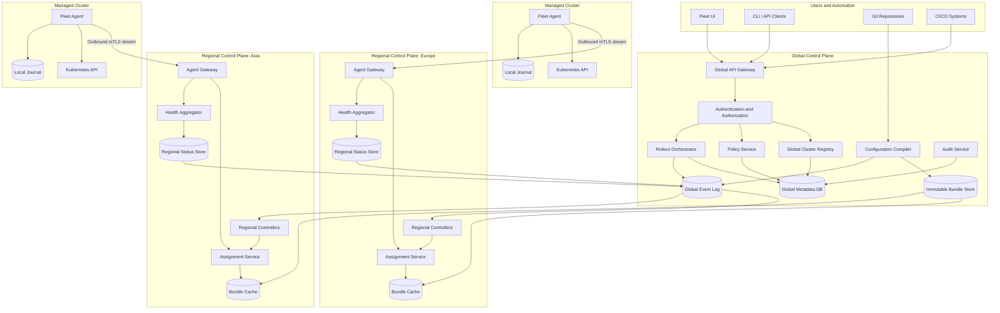

---

# 5. Why hierarchical control planes?

A single global control plane becomes problematic because:

* Every agent connection terminates in one location.
* A global rollout controller can accidentally target the entire fleet.
* Network latency is high for distant clusters.
* A single database or message-bus failure affects every cluster.
* Status ingestion from thousands of clusters creates a high-cardinality hotspot.
* Data-residency rules may prevent all telemetry from leaving a region.

The hierarchy separates responsibilities.

## Global control plane

Responsible for:

* Canonical cluster identity.
* Fleet-wide policy definitions.
* Release and bundle definitions.
* Global rollout plans.
* Region assignment.
* Organization-level RBAC.
* Global audit history.
* Aggregated fleet health.

It does **not** maintain direct Kubernetes API connections to managed clusters.

## Regional control plane

Responsible for:

* Terminating agent sessions.
* Caching configuration bundles.
* Mapping global intent to regional assignments.
* Ingesting status.
* Regional upgrade scheduling.
* Regional rollout circuit breakers.
* Serving clusters when the global plane is temporarily unavailable.

## Cells inside a region

A large region is divided into cells:

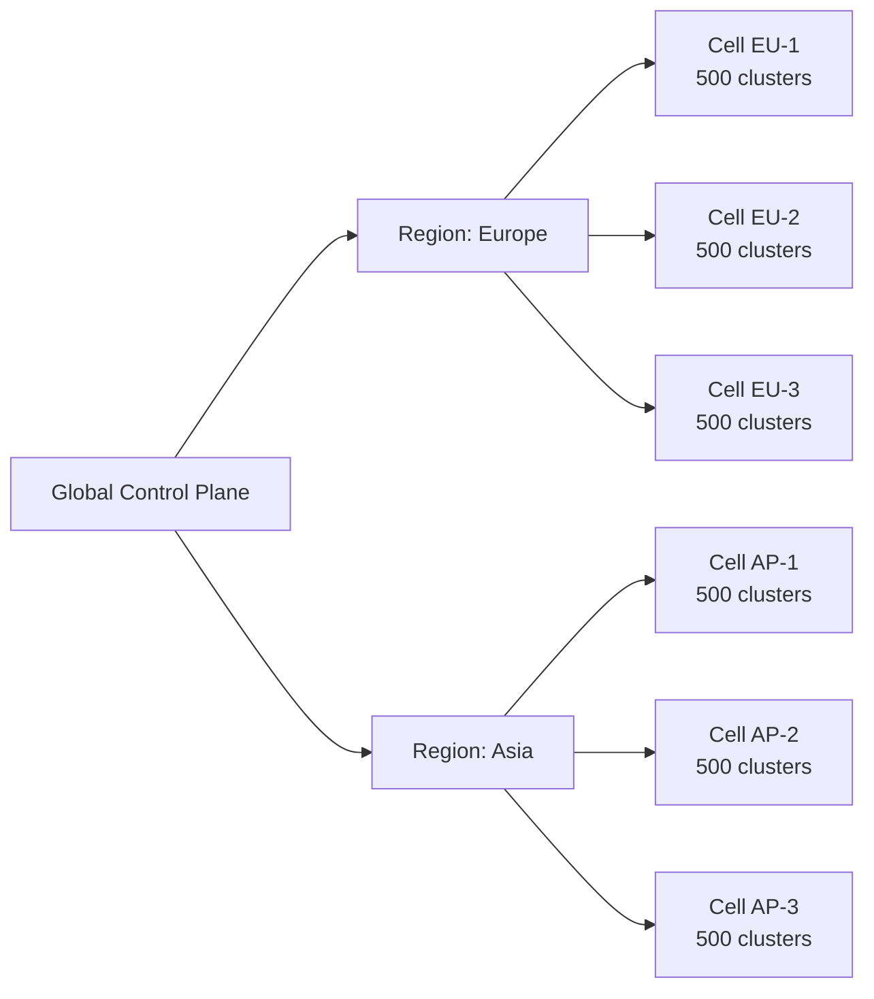

A cell may own 500–2,000 clusters. It has:

* Independent agent gateways.
* Separate controller shards.
* Dedicated queues.
* Regional status partitions.
* Independent deployment schedules.

This gives another blast-radius boundary below the region.

---

# 6. Main platform components

## 6.1 Fleet API gateway

Provides APIs for:

* Cluster registration.
* Cluster queries.
* Group and selector management.
* Bundle publication.
* Policy creation.
* Rollout creation.
* Upgrade requests.
* Credential revocation.
* Operational pause and quarantine.

Example endpoints:

```text
POST   /v1/clusters
GET    /v1/clusters/{clusterId}
POST   /v1/bundles
POST   /v1/rollouts
POST   /v1/upgrade-plans
POST   /v1/clusters/{clusterId}:quarantine
POST   /v1/clusters/{clusterId}:rotateCredentials
```

All mutating operations receive:

* An idempotency key.
* An actor identity.
* A reason or ticket reference.
* A request version.
* Optional approval metadata.

---

## 6.2 Cluster registry

The registry contains durable cluster metadata, not continuously changing Kubernetes objects.

Example record:

```yaml
apiVersion: fleet.example.io/v1
kind: ManagedCluster
metadata:
  name: prod-payments-sg-001
  uid: cluster-7f61f643
  labels:
    region: ap-southeast-1
    environment: production
    business-unit: payments
    tier: critical
    kubernetes-provider: eks
spec:
  region: singapore
  cell: ap-cell-03
  owner: payments-platform
  connectivityMode: connected
  desiredAgentVersion: 4.8.2
  maintenanceWindow:
    timezone: Asia/Singapore
    dayOfWeek: Sunday
    start: "01:00"
    duration: 4h
status:
  registrationState: Active
  agentState: Connected
  healthState: Healthy
  kubernetesVersion: v1.35.4
  agentVersion: 4.8.2
  lastHeartbeatTime: "2026-07-19T09:22:31Z"
  desiredGeneration: 847
  appliedGeneration: 847
```

### Important registry properties

* `clusterId` is immutable.
* Human-readable names may change.
* Cluster labels are indexed.
* Sensitive credentials are stored in a secret manager, not the registry.
* Status has explicit freshness timestamps.
* Deleted clusters are tombstoned before final removal.
* Region and cell ownership changes are controlled migrations.

---

## 6.3 Bundle compiler and artifact store

Users should not send arbitrary YAML independently to 10,000 clusters.

Instead:

1. Source configuration is submitted through Git or API.
2. The compiler resolves templates and dependencies.
3. Schemas and policy constraints are validated.
4. Resources are normalized.
5. A deterministic bundle is generated.
6. The bundle is signed.
7. It is stored by content digest.

Example:

```yaml
apiVersion: fleet.example.io/v1
kind: ConfigurationBundle
metadata:
  name: platform-baseline-2026-07-19
spec:
  digest: sha256:75bca38d...
  version: 2026.07.19-3
  components:
    - name: metrics-agent
      version: 8.4.1
    - name: policy-agent
      version: 3.2.0
    - name: cni-settings
      version: 14
  compatibility:
    kubernetes:
      minimum: v1.32.0
      maximum: v1.36.x
  signature:
    keyId: fleet-release-key-2026
```

The database stores only the digest and metadata. Large manifests, Helm charts, images or binaries live in object storage.

### Why immutable bundles?

* Every rollout is reproducible.
* Agents can verify signatures and hashes.
* Rollback means selecting an earlier digest.
* Bundles can be cached regionally.
* The platform avoids silently changing an in-progress rollout.
* Auditors can identify exactly what each cluster received.

---

## 6.4 Assignment service

The assignment service maps bundles and policies to clusters.

Example:

```yaml
apiVersion: fleet.example.io/v1
kind: FleetAssignment
metadata:
  name: baseline-production-clusters
spec:
  selector:
    matchLabels:
      environment: production
  bundleRef:
    digest: sha256:75bca38d...
  generation: 847
  enforcementMode: Enforce
  priority: 100
  rolloutRef: baseline-rollout-847
```

The assignment service calculates the selected cluster set and writes regional assignment records.

It does not directly apply configuration to Kubernetes clusters.

---

# 7. Cluster agent architecture

The agent is the most important data-plane component.

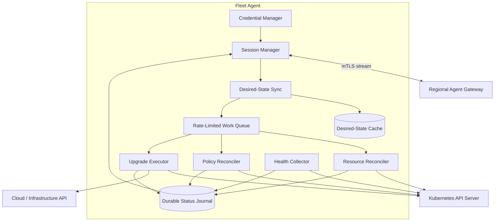

## 7.1 Agent subcontrollers

### Session manager

* Establishes outbound mTLS.
* Reconnects with exponential backoff and jitter.
* Sends heartbeat and capability information.
* Receives work-available notifications.
* Pulls assignments and bundles.

### Desired-state sync

* Tracks the latest assignment generation.
* Downloads missing bundles.
* Verifies signatures and digests.
* Builds a local desired-state view.
* Rejects incompatible bundles.

### Resource reconciler

* Applies Kubernetes resources.
* Detects drift.
* Updates only resources it owns.
* Uses idempotent patches.
* Reports per-resource and aggregate status.

### Policy reconciler

* Installs local policy resources.
* Evaluates compliance.
* Enforces policies that are configured for enforcement.
* Reports violations without continuously streaming every Kubernetes event.

### Upgrade executor

* Performs local preflight checks.
* Coordinates the provider-specific upgrade adapter.
* Enforces local disruption and concurrency limits.
* Pauses or rolls back when possible.

### Credential manager

* Renews agent identity.
* Rotates trust bundles.
* Maintains overlapping old and new credentials.
* Removes expired credentials only after successful switchover.

### Health collector

* Collects control-plane, node and critical add-on health.
* Produces summarized deltas.
* Avoids uploading high-cardinality Pod data by default.

---

# 8. Push versus pull

## 8.1 Pure push

The central controller directly calls every Kubernetes API server.

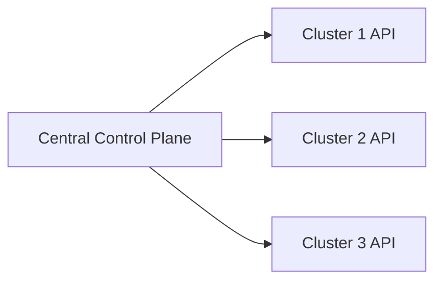

### Advantages

* Immediate command execution.
* Simpler initial mental model.
* No permanent in-cluster agent beyond credentials.

### Problems

* Central platform must hold credentials for every cluster.
* Kubernetes APIs must be reachable inbound.
* Network policy and firewall management become difficult.
* The central controller must handle thousands of different API versions and latencies.
* A bug in the central reconciler can create high API load across the entire fleet.
* Disconnected clusters cannot be managed.
* Connection and retry storms concentrate centrally.

---

## 8.2 Pure pull

Agents periodically poll the control plane.

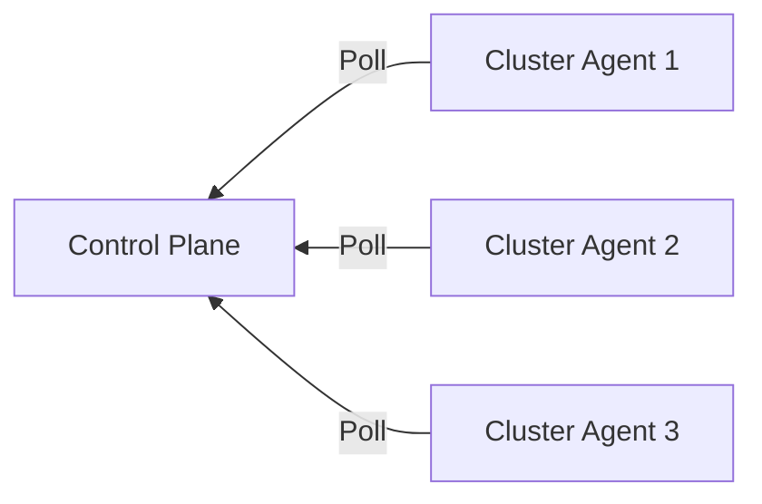

### Advantages

* Outbound-only connectivity.
* Credentials stay local.
* Good support for private clusters.
* Local reconciliation.
* Better failure isolation.

### Problems

* Polling creates unnecessary traffic.
* Convergence is bounded by the polling interval.
* Emergency commands may be delayed.
* Large polling waves can synchronize and create traffic spikes.

---

## 8.3 Recommended hybrid

The agent creates an outbound, long-lived stream. The server sends only notifications; the agent pulls the actual immutable work.

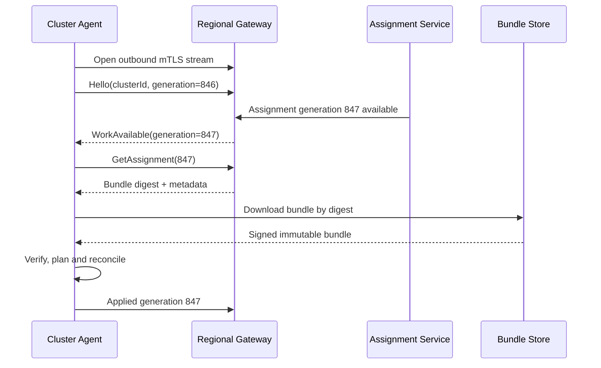

The notification is push-like, but execution remains pull-based.

This preserves:

* Low-latency notification.
* Outbound-only connectivity.
* Local credential ownership.
* Regional bundle caching.
* Safe retry and resumability.
* Disconnected-cluster support.

---

# 9. End-to-end cluster registration

## 9.1 Bootstrap process

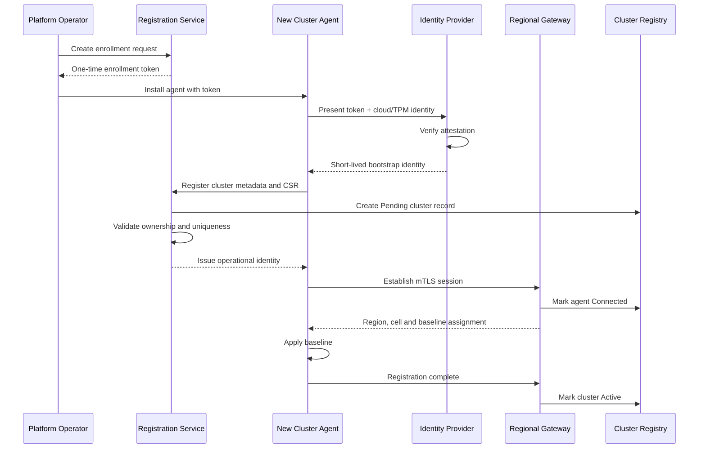

## 9.2 Bootstrap security

The one-time token alone should not be sufficient.

Bind enrollment to one or more of:

* Cloud instance identity.
* Cloud account and cluster ARN.
* TPM-backed attestation.
* Existing organization PKI.
* Manual operator approval.
* Expected cluster fingerprint.
* Provisioning-system identity.

After registration:

* Invalidate the bootstrap token.
* Issue a short-lived operational identity.
* Give the agent permissions only for its own cluster record.
* Prevent one agent from requesting another cluster’s assignments.
* Record the registration event in an immutable audit log.

SPIFFE defines workload identities using SPIFFE IDs and short-lived SVIDs, which can be retrieved through a workload API and used for mTLS. ([spiffe.io][3])

An example identity could be:

```text
spiffe://fleet.example.com/region/ap-southeast-1/cluster/cluster-7f61f643/agent
```

---

# 10. Configuration distribution flow

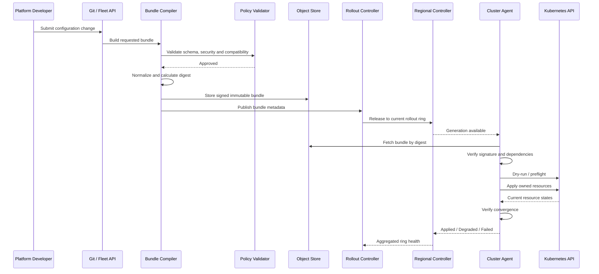

## 10.1 Local apply rules

The agent should:

1. Validate bundle compatibility.
2. Resolve declared dependencies.
3. Run dry-run validation where supported.
4. Apply resources in phases.
5. Wait for readiness conditions.
6. Mark the generation applied only after success.
7. Report detailed errors.
8. Retry transient failures.
9. Stop retrying permanent failures until intent changes.

Example phases:

```text
Phase 1: CRDs
Phase 2: namespaces and RBAC
Phase 3: admission and policy configuration
Phase 4: controllers and DaemonSets
Phase 5: dependent custom resources
Phase 6: readiness verification
```

---

# 11. Desired-state reconciliation

## 11.1 Generation model

Each assignment has a monotonically increasing generation.

```text
desiredGeneration  = 847
observedGeneration = 847
appliedGeneration  = 846
```

This means:

* The agent has observed generation 847.
* It has not successfully applied it.
* Generation 846 remains the last confirmed state.

The agent reports:

```yaml
status:
  observedGeneration: 847
  appliedGeneration: 846
  phase: Degraded
  conditions:
    - type: BundleDownloaded
      status: "True"
    - type: ResourcesApplied
      status: "False"
      reason: AdmissionRejected
      message: NetworkPolicy contains an unsupported field
```

## 11.2 Reconciliation pseudocode

```go
func ReconcileAssignment(
    ctx context.Context,
    clusterID string,
) error {
    desired, err := assignmentStore.GetDesired(ctx, clusterID)
    if err != nil {
        return retryable(err)
    }

    local, err := localState.Get(ctx, clusterID)
    if err != nil {
        return retryable(err)
    }

    if local.AppliedGeneration == desired.Generation &&
        local.AppliedDigest == desired.BundleDigest {
        return nil
    }

    bundle, err := bundleCache.GetOrDownload(
        ctx,
        desired.BundleDigest,
    )
    if err != nil {
        return retryable(err)
    }

    if err := verifier.Verify(bundle); err != nil {
        return permanent(err)
    }

    plan, err := planner.Build(bundle, local)
    if err != nil {
        return permanent(err)
    }

    if err := executor.Apply(ctx, plan); err != nil {
        return classify(err)
    }

    if err := verifier.VerifyConvergence(ctx, plan); err != nil {
        return retryable(err)
    }

    return localState.MarkApplied(
        ctx,
        desired.Generation,
        desired.BundleDigest,
    )
}
```

## 11.3 Idempotency

Every action must be safely repeatable.

The platform assumes messages can be:

* Delivered more than once.
* Delivered out of order.
* Delayed.
* Lost and later reconstructed.
* Replayed during disaster recovery.

Therefore:

```text
Assignment key:
clusterId + assignmentId + generation

Operation key:
clusterId + operationId + stepId
```

Before executing a step, the agent checks its local operation journal.

---

# 12. Informers, watches and local work queues

Within a managed cluster, the agent should use shared informers or equivalent list/watch caches rather than repeatedly polling every resource.

The Kubernetes API supports an initial list followed by a watch from a `resourceVersion`. Clients must handle expired history by processing `410 Gone`, relisting and restarting the watch. ([Kubernetes][4])

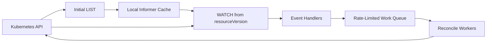

### Work-queue rules

* Queue keys, not full objects.
* Deduplicate repeated events for the same key.
* Apply exponential backoff per item.
* Apply a global token-bucket limit.
* Call `Forget` after success or permanent failure.
* Add jitter to retries.
* Send permanently invalid work to a dead-letter state.
* Bound worker concurrency.

The Kubernetes client-go workqueue package supports typed rate-limiting queues and retry tracking. ([Go Packages][5])

Example:

```text
Transient failure:
5s → 10s → 20s → 40s → 80s → capped at 10m

Permanent validation failure:
Do not retry until desired generation changes.

API throttling:
Maximum 10 concurrent mutations per cluster agent.
```

---

# 13. Controller sharding

At 10,000 clusters, a single controller cannot own all reconciliation keys.

## 13.1 Virtual shards

Create significantly more virtual shards than controller replicas.

Example:

```text
1,024 virtual shards
32 controller replicas
Approximately 32 shards per replica
```

Map clusters using consistent or rendezvous hashing:

```text
virtualShard = hash(clusterId) % 1024
```

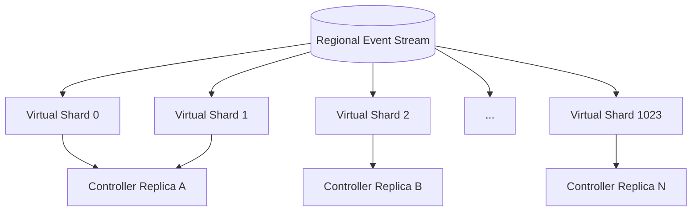

## 13.2 Why virtual shards?

If replicas directly own `hash(clusterId) % replicaCount`, changing the replica count remaps a large fraction of clusters.

Virtual shards provide:

* Stable cluster assignment.
* Cheap rebalancing.
* Better hotspot isolation.
* Per-shard lag metrics.
* Controlled failover.

## 13.3 Leadership

Each virtual shard has one active owner.

A replica acquires shard ownership through:

* Kubernetes Lease objects.
* Database leases.
* A consensus-backed coordination service.

Kubernetes uses Lease resources for capabilities including component leader election and node heartbeats. ([Kubernetes][6])

The lease contains:

```yaml
shard: 271
holder: regional-controller-17
leaseExpiry: "2026-07-19T09:24:00Z"
epoch: 4831
```

### Fencing token

A lease alone is insufficient if an old leader continues running after a partition.

Every mutation includes the lease epoch:

```text
write assignment status
where shard_epoch = 4831
```

After leadership changes, writes from epoch 4830 are rejected.

---

# 14. Cluster health model

A heartbeat is not sufficient to determine cluster health.

The platform tracks several independent signals.

## 14.1 Health dimensions

| Dimension        | Example signals                                 |
| ---------------- | ----------------------------------------------- |
| Connectivity     | Last heartbeat, stream reconnect rate           |
| Agent            | Process health, queue depth, local disk         |
| Kubernetes API   | `/readyz`, request latency, error rate          |
| Control plane    | API server, scheduler, controller manager, etcd |
| Nodes            | Ready ratio, pressure conditions                |
| Add-ons          | DNS, CNI, CSI, ingress, policy agent            |
| Configuration    | Desired vs applied generation                   |
| Security         | Certificate expiry, trust-bundle state          |
| Upgrade          | Current stage, failed nodes, elapsed time       |
| Synthetic probes | DNS lookup, service networking, storage test    |

## 14.2 Health state machine

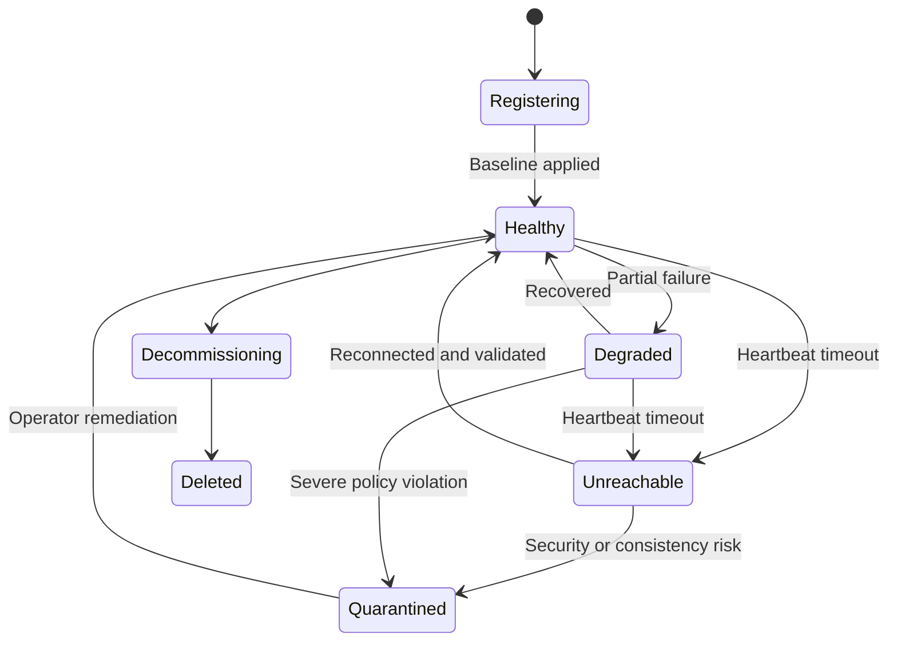

## 14.3 Heartbeat payload

Keep it small:

```json
{
  "clusterId": "cluster-7f61f643",
  "sessionEpoch": 93,
  "timestamp": "2026-07-19T09:22:31Z",
  "agentVersion": "4.8.2",
  "kubernetesVersion": "v1.35.4",
  "desiredGeneration": 847,
  "appliedGeneration": 847,
  "health": "HEALTHY",
  "queueDepth": 0,
  "certificateExpiresInSeconds": 43182
}
```

Detailed status is sent only:

* When a condition changes.
* At a low-frequency snapshot interval.
* When explicitly requested for troubleshooting.

---

# 15. Policy propagation

Policies have two separate purposes:

1. **Admission enforcement** — prevent unsafe changes locally.
2. **Compliance assessment** — detect drift or violations.

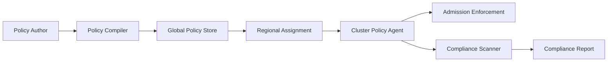

## 15.1 Policy modes

```yaml
spec:
  mode: Enforce
```

Possible values:

* `Audit`
* `Warn`
* `Enforce`
* `Disabled`

## 15.2 Conflict resolution

Use deterministic precedence:

```text
Organization baseline
    >
Business-unit policy
    >
Environment policy
    >
Cluster-specific exception
```

An exception must include:

* Owner.
* Justification.
* Approval.
* Expiry time.
* Scope.
* Audit reference.

Conflicting policies should fail compilation rather than relying on application order.

---

# 16. Upgrade orchestration

An upgrade is a long-running distributed workflow, not one Kubernetes API call.

## 16.1 Upgrade plan

```yaml
apiVersion: fleet.example.io/v1
kind: UpgradePlan
metadata:
  name: kubernetes-1-36-production
spec:
  fromVersions:
    - v1.35.x
  targetVersion: v1.36.2

  selector:
    matchLabels:
      environment: production

  rollout:
    rings:
      - name: internal
        maximumClusters: 5
      - name: canary
        percentage: 1
      - name: early
        percentage: 5
      - name: regional
        maximumConcurrentPerRegion: 20
      - name: fleet
        maximumConcurrentGlobal: 100

  healthGates:
    maximumFailureRate: 0.5%
    maximumApiLatencyIncrease: 20%
    minimumObservationPeriod: 30m

  maintenanceWindowRequired: true
  automaticPause: true
```

## 16.2 Upgrade state machine

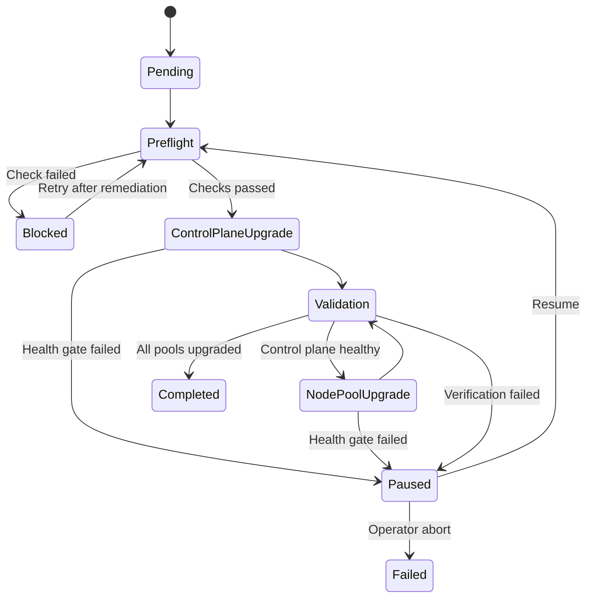

## 16.3 Upgrade flow

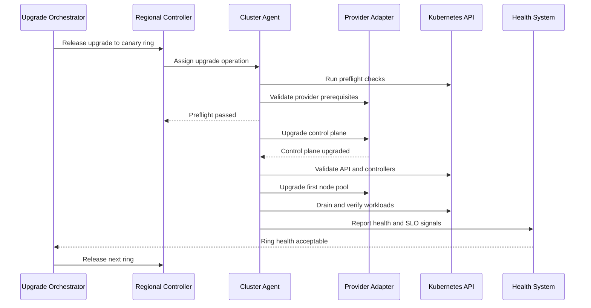

## 16.4 Safety gates

Before upgrade:

* Supported version transition.
* No existing critical incident.
* Control plane healthy.
* Sufficient node capacity.
* Pod disruption constraints evaluated.
* Storage and networking add-ons compatible.
* Backups current.
* Agent version supports target Kubernetes version.
* Maintenance window active.
* No conflicting operation in progress.

During upgrade:

* Limit concurrent clusters.
* Limit concurrent nodes per cluster.
* Upgrade one availability zone or node pool at a time.
* Pause when health degradation exceeds threshold.
* Require observation periods between rings.

After upgrade:

* Run synthetic API, DNS, networking and storage checks.
* Compare pre- and post-upgrade SLOs.
* Verify critical controllers.
* Mark complete only after a soak period.

Cluster API uses Kubernetes-style APIs and controllers to automate cluster creation, configuration and lifecycle management; the platform could use Cluster API providers where appropriate, while retaining a separate fleet orchestration layer. ([Cluster API][7])

---

# 17. Fleet-wide blast-radius control

This is a major interview focus.

## 17.1 Layered scope boundaries

```text
Global fleet
  └── Region
       └── Cell
            └── Cluster class
                 └── Rollout ring
                      └── Individual cluster
```

A rollout must specify its maximum allowed scope at every level.

Example:

```yaml
safetyBudget:
  maximumGlobalConcurrent: 100
  maximumRegionalConcurrent: 20
  maximumCellConcurrent: 5
  maximumCriticalClustersConcurrent: 2
```

## 17.2 Rollout rings

Example:

| Ring                |        Clusters | Purpose                  |
| ------------------- | --------------: | ------------------------ |
| Development         |              10 | Functional validation    |
| Internal production |              20 | Real workload validation |
| Canary              |              1% | Broad compatibility      |
| Early regional      |   5% per region | Detect regional issues   |
| General             | Remaining fleet | Controlled completion    |

## 17.3 Circuit breaker

Pause automatically when any threshold is crossed:

```text
Cluster failure rate > 0.5%
API latency increase > 20%
Node NotReady increase > 2%
Critical add-on failure > 1 cluster
Upgrade stage duration > expected maximum
Agent reconciliation error rate > 5%
```

## 17.4 Kill switches

Provide several independent controls:

* Pause one rollout.
* Pause one region.
* Pause one cell.
* Quarantine one bundle digest.
* Disable one agent feature.
* Disable destructive operations globally.
* Force clusters to remain on last-known-good configuration.

Kill switches should themselves be:

* Highly audited.
* Protected by elevated authorization.
* Time limited where possible.
* Independent from the affected deployment path.

## 17.5 Destructive changes

Deletion or irreversible operations require additional controls:

* Explicit destructive intent.
* Resource count preview.
* Two-person approval.
* Maximum deletion budget.
* Backup verification.
* Delayed execution window.
* Automatic cancellation if the observed scope changes.

---

# 18. Credential rotation

## 18.1 Identity lifecycle

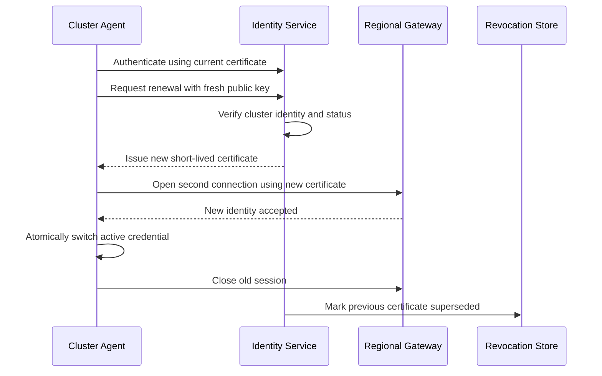

## 18.2 Rotation properties

* Certificates should be short-lived.
* Private keys are generated inside the cluster.
* Private keys never leave the cluster.
* Rotate before roughly half to two-thirds of the lifetime.
* Add jitter so 10,000 agents do not renew simultaneously.
* Maintain an overlap period.
* Support emergency revocation.
* Bind certificates to immutable cluster IDs.
* Reject certificates from decommissioned clusters.

SPIFFE-compatible systems can provide short-lived workload-specific X.509 identities and automatic rotation through a workload API. ([spiffe.io][8])

## 18.3 CA rotation

Use overlapping trust bundles:

```text
Phase 1: Clients trust CA-old
Phase 2: Clients trust CA-old + CA-new
Phase 3: Issue identities from CA-new
Phase 4: Verify all active clients use CA-new
Phase 5: Remove CA-old
```

Never simultaneously replace the issuer and remove the previous trust root.

---

# 19. Disconnected clusters

Disconnected operation must be designed explicitly.

## 19.1 Local state

The agent persists:

```text
Last verified desired bundle
Last successfully applied generation
Pending operation journal
Unsent status events
Current credential material
Trusted signing keys
Bundle compatibility metadata
```

## 19.2 Behavior during disconnection

The agent should:

* Continue reconciling the last known desired state.
* Continue enforcing local security policy.
* Buffer bounded status updates.
* Compact repeated status events.
* Avoid starting a new disruptive upgrade unless already authorized.
* Avoid removing resources because their central assignment temporarily disappeared.
* Continue certificate renewal through a regional or offline issuer where supported.

## 19.3 Reconnection flow

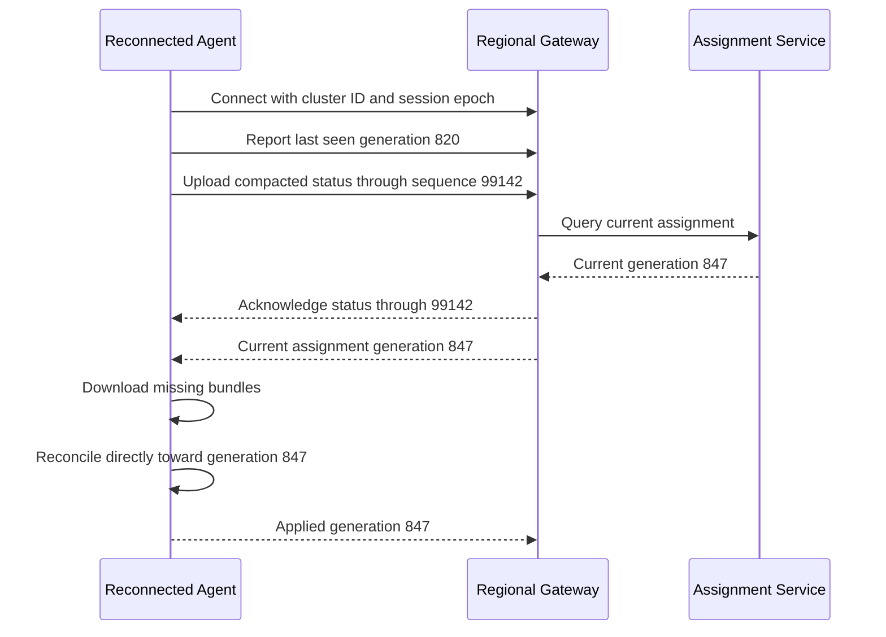

The cluster does not need to replay every intermediate generation. It converges directly to the latest applicable desired state unless an operation explicitly requires ordered transitions.

## 19.4 Extended disconnection

After a configurable period:

```text
0–15 minutes: Connected or transiently disconnected
15 minutes–24 hours: Unreachable
1–7 days: Stale
More than 7 days: Administratively review
Certificate expiry approaching: Recovery workflow required
```

The UI must distinguish:

* “Healthy when last observed.”
* “Currently healthy.”

It is incorrect to mark a cluster healthy indefinitely based on old telemetry.

---

# 20. Eventual consistency model

Strong consistency across thousands of clusters is neither realistic nor necessary.

## 20.1 Consistency domains

| Data                           | Consistency                              |
| ------------------------------ | ---------------------------------------- |
| Cluster identity and ownership | Strong within global registry            |
| Rollout definition             | Strong                                   |
| Bundle contents by digest      | Immutable                                |
| Regional assignment            | Eventually consistent from global intent |
| Agent desired state            | Eventually consistent                    |
| Cluster observed state         | Eventually consistent and timestamped    |
| Audit log                      | Append-only and durable                  |
| Individual operation ownership | Strongly fenced                          |

## 20.2 Version fields

Every control message contains:

```text
globalIntentVersion
regionalAssignmentVersion
clusterDesiredGeneration
operationSequence
bundleDigest
sessionEpoch
controllerFencingEpoch
```

This allows receivers to reject stale messages.

Example:

```text
Current clusterDesiredGeneration: 847
Received command generation: 845
Action: Ignore as stale
```

## 20.3 Delivery semantics

Use:

* At-least-once message delivery.
* Idempotent handlers.
* Durable operation state.
* Monotonic generation numbers.
* Content digests.
* Status sequence numbers.

Do not promise exactly-once execution. Network partitions and process crashes make exactly-once distributed side effects impractical. The system instead provides **effectively-once outcomes** through idempotency and durable step journals.

---

# 21. State storage choices

## 21.1 Recommended combination

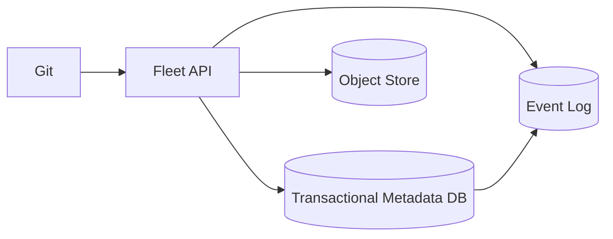

### Transactional database

Stores:

* Cluster records.
* Ownership.
* Rollout definitions.
* Current assignments.
* Operation state.
* Approval state.
* Idempotency records.

A relational database is useful because these records require:

* Uniqueness.
* Transactions.
* Indexed queries.
* Referential integrity.
* Conditional updates.

### Event log

Stores change notifications such as:

```text
ClusterRegistered
BundlePublished
AssignmentChanged
RolloutRingAdvanced
ClusterHealthChanged
OperationFailed
```

Uses:

* Regional replication.
* Controller work distribution.
* Replay.
* Audit enrichment.
* Event-driven cache invalidation.

The event log is not the sole source of current state unless the organization is prepared to implement and operate full event sourcing.

### Object storage

Stores:

* Signed bundles.
* Large manifests.
* Upgrade artifacts.
* Diagnostics.
* Audit exports.

### Git

Git is an authoring and review mechanism, not the runtime distribution protocol.

Using agents to clone large repositories repeatedly would cause:

* Credential distribution problems.
* High Git-server load.
* Slow convergence.
* Difficulty representing per-cluster assignments.
* Poor status reporting.

The compiler converts Git state into immutable runtime bundles.

---

# 22. Preventing Kubernetes API-server overload

Each cluster agent can accidentally become a noisy client.

## 22.1 API usage controls

* Shared informer caches.
* Watch instead of repeated list.
* Metadata-only watches where possible.
* Narrow label and field selectors.
* Pagination for large lists.
* Maximum mutation concurrency.
* Per-resource token buckets.
* Exponential backoff.
* Request timeouts.
* Jittered periodic resync.
* Server-side dry run for validation.
* Minimal patches instead of complete object replacement.
* Separate critical and background queues.

Kubernetes API Priority and Fairness classifies requests and can queue or limit them under overload. ([Kubernetes][9])

An agent can be assigned a limited APF priority level so platform maintenance does not starve core Kubernetes controllers.

## 22.2 Priority queues

```text
Priority 0: credential expiry and security revocation
Priority 1: critical policy enforcement
Priority 2: failed rollout recovery
Priority 3: normal configuration reconciliation
Priority 4: compliance scans
Priority 5: inventory refresh
```

## 22.3 Thundering-herd prevention

After regional recovery:

```text
Reconnect delay = random(0, 120 seconds)
Bundle download delay = random(0, 300 seconds)
Credential renewal jitter = ±20% lifetime
Retry backoff = exponential + full jitter
```

The gateway also returns `Retry-After` and admission tokens.

---

# 23. Regional failure scenarios

## 23.1 Global control plane unavailable

Expected behavior:

* Existing regional assignments remain available.
* Regional gateways continue accepting agent sessions.
* Agents continue reconciling cached desired state.
* Regional health ingestion continues.
* No new global rollouts begin.
* Operators may perform predefined regional emergency actions.
* Changes are replayed after global recovery.

The managed clusters continue serving application traffic.

## 23.2 Regional control plane unavailable

Expected behavior:

* Agents reconnect with jitter.
* Agents continue last-known-good reconciliation.
* Another regional endpoint may be used after controlled failover.
* New regional assignments pause.
* Status is buffered locally.
* Cluster applications are unaffected.

## 23.3 Regional database failure

* Promote a regional replica.
* Controllers use fencing epochs.
* Rebuild caches from the database and event log.
* Do not advance rollouts until ownership and state are verified.

## 23.4 Event-log outage

* API writes commit state to the database with an outbox record.
* A background publisher retries event publication.
* Controllers periodically perform reconciliation scans as a safety net.
* No user operation is considered complete merely because an event was published.

## 23.5 Object store unavailable

* Agents use cached bundles.
* Existing desired state remains valid.
* New bundle rollouts pause.
* Regional caches protect against global object-store interruption.

## 23.6 Agent bug

* Agent updates use their own rollout rings.
* Two adjacent agent versions are supported.
* Emergency feature flags disable problematic controllers.
* The old agent remains available for rollback.
* Agent self-update is separated from Kubernetes upgrades.

## 23.7 Compromised cluster agent

* Identity is scoped to one cluster.
* Agent cannot modify assignments.
* Agent cannot read other clusters’ data.
* Gateway validates cluster ID against certificate identity.
* Reported status is treated as untrusted input.
* Credentials can be revoked.
* The cluster can be quarantined.

---

# 24. Capacity estimation

Assume 10,000 clusters.

## Connections

```text
10,000 long-lived agent streams
20 regions
Average: 500 streams per region
```

This is manageable with horizontally scaled gateways.

## Heartbeats

With one heartbeat every 30 seconds:

```text
10,000 / 30 ≈ 333 heartbeats per second globally
```

At 1 KB per heartbeat:

```text
≈333 KB/s before protocol overhead
```

## Status updates

Assume two compacted status changes per minute per cluster:

```text
10,000 × 2 / 60 ≈ 333 status updates per second
```

Do not stream every Pod or Kubernetes event centrally.

## Fleet-wide rollout

To update 10,000 clusters over four hours:

```text
10,000 / (4 × 3,600) ≈ 0.7 new cluster operations per second
```

The challenge is not average throughput. The challenge is:

* Controlling concurrency.
* Avoiding synchronized retries.
* Monitoring health.
* Preventing one bad release from reaching every cluster.

---

# 25. Observability

## 25.1 Platform metrics

### Global

```text
fleet_clusters_total
fleet_clusters_by_health
rollout_clusters_by_phase
rollout_failure_rate
global_event_delivery_lag_seconds
bundle_publish_duration_seconds
```

### Regional

```text
agent_connections_active
agent_reconnect_rate
assignment_delivery_latency_seconds
status_ingestion_rate
controller_queue_depth
controller_oldest_work_item_seconds
controller_reconcile_errors_total
regional_bundle_cache_hit_ratio
```

### Per cluster

```text
cluster_last_heartbeat_age_seconds
cluster_desired_generation
cluster_applied_generation
cluster_reconciliation_lag
cluster_certificate_expiry_seconds
cluster_upgrade_stage_duration_seconds
cluster_api_request_errors_total
```

## 25.2 Important alerts

* Region loses more than a threshold percentage of agent connections.
* Reconciliation lag exceeds SLO.
* A rollout ring crosses its failure budget.
* Bundle signature verification fails.
* Controller queue age increases continuously.
* Credential expiry is approaching.
* A shard has no valid leader.
* Multiple controllers claim the same fencing epoch.
* Regional status replication stops.
* A critical cluster becomes unreachable.

## 25.3 Audit record

Every mutation records:

```json
{
  "timestamp": "2026-07-19T09:10:00Z",
  "actor": "user:platform-operator@example.com",
  "action": "CreateRollout",
  "resource": "rollout/platform-baseline-847",
  "targetCount": 8321,
  "bundleDigest": "sha256:75bca38d...",
  "approvalTicket": "CHG-48127",
  "requestId": "req-994fe7"
}
```

---

# 26. Example end-to-end scenario

Suppose the platform team must upgrade the policy agent on 8,000 production clusters.

## Step 1: Publish

The developer submits:

```yaml
policyAgent:
  version: 3.2.0
  imageDigest: sha256:abc123...
```

The compiler:

* Validates schemas.
* Checks Kubernetes compatibility.
* Scans and signs the artifact.
* Creates bundle digest `sha256:75bca38d...`.

## Step 2: Create rollout

```yaml
selector:
  environment: production

rings:
  - name: platform-test
    count: 10
  - name: canary
    percentage: 1
  - name: early-regions
    percentage: 5
  - name: broad
    percentage: 100

budgets:
  global: 100
  perRegion: 15
  perCell: 3
```

## Step 3: Regional assignment

The global orchestrator selects ring 0 and publishes regional assignment events.

Each region writes assignments for its selected clusters.

## Step 4: Agent reconciliation

An agent receives generation 847:

```text
Current: generation 846, policy-agent 3.1.4
Desired: generation 847, policy-agent 3.2.0
```

It:

* Downloads and verifies the bundle.
* Performs dry-run validation.
* Updates the local Deployment.
* Waits for readiness.
* Runs a policy admission probe.
* Reports success.

## Step 5: Health gate

After 30 minutes:

```text
10 clusters updated
10 healthy
0 failed
API latency change: +1.2%
Admission failure change: 0%
```

The orchestrator releases the canary ring.

## Step 6: Automatic pause

Suppose three canary clusters report high CPU usage.

The rollout automatically pauses because:

```text
Failure threshold: 0.5%
Observed degraded rate: 3.75%
```

No additional clusters receive generation 847.

The platform team can:

* Investigate.
* Publish a corrected generation 848.
* Roll back selected clusters to generation 846.
* Resume only after approval.

---

# 27. Main trade-offs

## Pull versus push

**Choose pull** because it provides better credential isolation, private-network support and disconnected operation.

Use an agent-initiated stream to reduce pull latency.

## Global versus regional

**Choose hierarchical regional control planes** because they isolate failures and reduce latency.

The trade-off is more complex state replication and operational overhead.

## Database versus event log

Use a **database for authoritative current state** and an **event log for propagation and replay**.

Using only an event log requires a substantially more complex event-sourced architecture.

## Git versus runtime API

Use Git for reviewable authoring, but compile Git state into runtime assignments and immutable bundles.

## Certificates versus cloud identity

Use cloud identity or hardware attestation for bootstrap, then issue portable short-lived identities for regular operation.

## Central reconciliation versus local reconciliation

Use local reconciliation.

Central reconciliation gives greater direct visibility but creates credential, scaling and network-reachability problems.

## Full status versus summarized status

Use summarized status and on-demand diagnostics.

Streaming every object centrally creates excessive cost and cardinality.

---

# 28. Interview answer structure

A clear 45-minute interview presentation could be:

1. Clarify scale, cluster types and connectivity.
2. State the pull-based hierarchical design.
3. Draw global, regional and cluster-agent architecture.
4. Explain cluster registration and identity.
5. Explain desired-state distribution and generations.
6. Explain reconciliation and work queues.
7. Explain controller sharding and leadership.
8. Walk through a safe fleet upgrade.
9. Cover disconnected operation.
10. Cover blast-radius controls and failure modes.
11. Finish with scale estimates and trade-offs.

---

# 29. Potential follow-up questions and answers

## 1. Why pull instead of push?

Push requires the central platform to reach every Kubernetes API and generally hold credentials for every cluster. Pull allows outbound-only connectivity, keeps execution local and continues operating during temporary control-plane outages.

A long-lived stream removes most of the latency disadvantage of periodic polling.

---

## 2. Why not use one Kubernetes cluster as the global management plane?

It could be used for a smaller deployment, but one management cluster becomes a shared blast radius for:

* API-server saturation.
* Controller failures.
* etcd issues.
* Admission policy mistakes.
* Regional network partitions.

At fleet scale, I would separate global metadata from regional agent connectivity and use cells within large regions.

---

## 3. What happens if the global control plane fails?

Regional planes continue serving cached assignments, receiving health and maintaining agent connections. Agents continue reconciling last-known-good state.

New global rollouts and policy changes pause until recovery.

---

## 4. What happens if a regional control plane fails?

Agents continue operating locally and reconnect with jitter. They buffer compacted status.

A controlled regional failover can redirect agents to a secondary region, but automatic failover must avoid two regions concurrently issuing conflicting operations.

---

## 5. How do you avoid split brain between regional controllers?

Every cluster or virtual shard has one owner and a fencing epoch. Operations from an old epoch are rejected by the assignment store and gateways.

Leadership uses leases, but safety comes from conditional writes and fencing tokens.

---

## 6. How do you shard controllers?

Hash immutable cluster IDs into many virtual shards. Assign virtual shards to controller replicas.

This limits reassignment when replicas scale and provides per-shard leadership, queueing and metrics.

---

## 7. Why is leader election not sufficient?

A former leader may remain alive during a network partition. It could continue issuing writes.

Therefore each leader receives a monotonically increasing fencing epoch, and storage rejects writes from earlier epochs.

---

## 8. How do you prevent work-queue storms?

* Deduplicate keys.
* Bound workers.
* Use per-item exponential backoff.
* Use global token buckets.
* Add full jitter.
* Separate critical and background queues.
* Limit work released per region and cell.
* Reconcile periodically as a safety net.

---

## 9. How does the agent handle a watch failure?

It records the last `resourceVersion`, restarts the watch when possible and relists when Kubernetes returns `410 Gone`.

It rebuilds its local cache before resuming reconciliation.

---

## 10. How do you avoid overloading cluster API servers?

Use shared informer caches, narrow watches, minimal patches, concurrency limits and API Priority and Fairness.

The agent also monitors its own API latency and reduces concurrency under pressure.

---

## 11. How do you guarantee that configuration was applied?

The platform distinguishes:

```text
Delivered
Observed
Applied
Ready
Verified
```

An assignment is successful only when the agent reports the target generation and required readiness checks pass.

This is not a synchronous distributed transaction; it is an eventually consistent verified convergence process.

---

## 12. How do you handle duplicate messages?

All assignments and operations have stable IDs and generations.

Handlers are idempotent and consult durable local operation state before executing side effects.

---

## 13. How do you handle messages delivered out of order?

The agent ignores generations older than its current desired generation.

Ordered workflows use explicit step sequence numbers and prerequisites.

---

## 14. What happens when a cluster reconnects after 30 days?

The agent:

1. Authenticates or enters credential recovery.
2. Uploads a compacted status summary.
3. Retrieves the latest assignment.
4. Downloads missing immutable bundles.
5. Runs compatibility checks.
6. Converges directly to the latest valid generation.

It does not necessarily replay all 30 days of intermediate configuration.

---

## 15. What if the latest configuration is incompatible with a long-disconnected cluster?

The assignment service evaluates capability constraints:

```text
Kubernetes version
Agent version
Provider
Architecture
Installed APIs
Feature gates
```

The cluster receives the newest compatible bundle and is marked blocked from the general rollout until prerequisites are satisfied.

---

## 16. How would you rotate credentials across 10,000 clusters?

Use short-lived identities with renewal jitter.

Agents generate new private keys locally, obtain new certificates, establish a second session and only then retire the old credentials.

CA changes use overlapping trust bundles.

---

## 17. What happens if the agent is compromised?

Its identity permits access only to its own assignments and status stream.

It cannot modify global intent or read other cluster data. The platform can revoke the identity and quarantine the cluster.

The cluster is then treated as untrusted until re-enrolled.

---

## 18. How do you roll out a Kubernetes upgrade to 1,000 clusters?

Use:

* Internal clusters.
* Canary clusters.
* Percentage-based rings.
* Region-by-region waves.
* Global and regional concurrency budgets.
* Preflight checks.
* Observation periods.
* Automatic circuit breakers.
* Maintenance windows.

Never issue a fleet-wide upgrade as one unbounded operation.

---

## 19. How do you roll back a Kubernetes upgrade?

Configuration and add-ons can generally be rolled back by selecting an earlier immutable bundle.

Kubernetes control-plane downgrades may not be safe or supported. For those operations, the recovery strategy may require:

* Restoring from backup.
* Replacing the cluster.
* Rebuilding control-plane nodes.
* Migrating workloads.

The platform must distinguish reversible configuration rollout from potentially irreversible infrastructure upgrades.

---

## 20. How do you manage agent version skew?

Define a compatibility matrix:

```text
Control plane supports agent N, N-1 and N-2.
Agent supports a bounded Kubernetes-version range.
```

The protocol is versioned and capabilities are negotiated during session establishment.

New server fields must be optional until older agents have been upgraded.

---

## 21. Would you store every cluster’s Kubernetes objects centrally?

No.

Store:

* Summarized inventory.
* Health conditions.
* Desired and applied generations.
* Critical resource state.
* On-demand diagnostic snapshots.

Do not duplicate every Pod, event and Secret into the global plane.

---

## 22. Why use immutable bundles?

They provide deterministic rollout, signature verification, caching, auditability and rollback.

Mutable references such as `latest` should be resolved to immutable digests before rollout.

---

## 23. How do you prevent one bad policy from blocking every cluster?

* Compile and validate before publication.
* Test in isolated clusters.
* Use rollout rings.
* Default new policies to audit mode.
* Enforce concurrency and failure budgets.
* Quarantine bad policy digests.
* Maintain a local emergency bypass with strict auditing.

---

## 24. How would this scale to 100,000 clusters?

* Add more regional cells.
* Increase virtual shards.
* Partition registry and status by region and cluster ID.
* Keep agent sessions regional.
* Store only summarized status globally.
* Use hierarchical rollout aggregation.
* Cache bundles at regional and edge layers.
* Avoid global per-cluster synchronous operations.

The architecture scales primarily by adding independent cells rather than vertically scaling a single hub.

---

# 30. Final recommendation

The preferred architecture is:

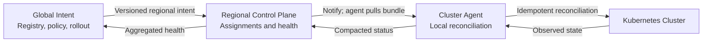

Its defining properties are:

* **Declarative rather than command driven.**
* **Pull-based rather than centrally credentialed.**
* **Regionalized rather than globally coupled.**
* **Eventually consistent rather than synchronously distributed.**
* **Idempotent rather than exactly once.**
* **Ring-based rather than fleet-wide.**
* **Locally autonomous rather than dependent on permanent hub availability.**
* **Fenced and rate limited rather than relying only on leader election.**

[1]: https://kubernetes.io/docs/concepts/architecture/controller/?utm_source=chatgpt.com "Controllers | Kubernetes"
[2]: https://open-cluster-management.io/docs/concepts/architecture/?utm_source=chatgpt.com "Architecture"
[3]: https://spiffe.io/docs/latest/spiffe-specs/x509-svid/?utm_source=chatgpt.com "X509-SVID | SPIFFE"
[4]: https://kubernetes.io/docs/reference/using-api/api-concepts/ "Kubernetes API Concepts | Kubernetes"
[5]: https://pkg.go.dev/k8s.io/client-go/util/workqueue?utm_source=chatgpt.com "workqueue package - k8s.io/client-go/util ..."
[6]: https://kubernetes.io/docs/concepts/architecture/leases/?utm_source=chatgpt.com "Leases | Kubernetes"
[7]: https://cluster-api.sigs.k8s.io/?utm_source=chatgpt.com "The Cluster API Book: Introduction"
[8]: https://spiffe.io/docs/?utm_source=chatgpt.com "SPIFFE Overview | SPIFFE"
[9]: https://kubernetes.io/docs/concepts/cluster-administration/flow-control/?utm_source=chatgpt.com "API Priority and Fairness | Kubernetes"
